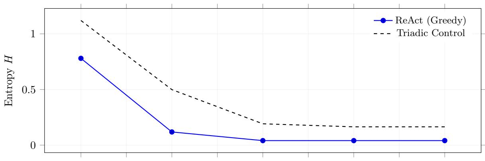
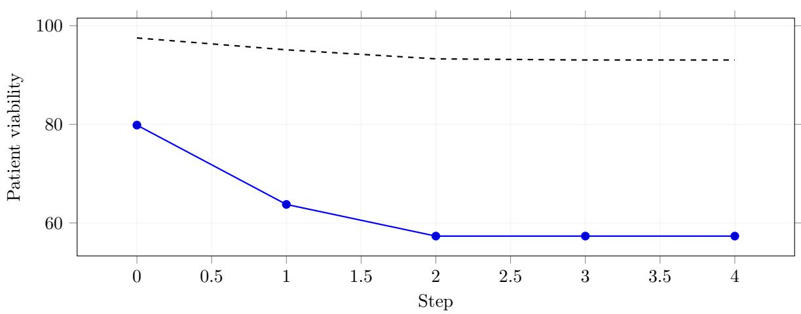
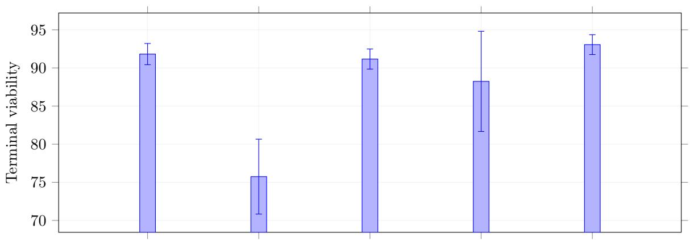
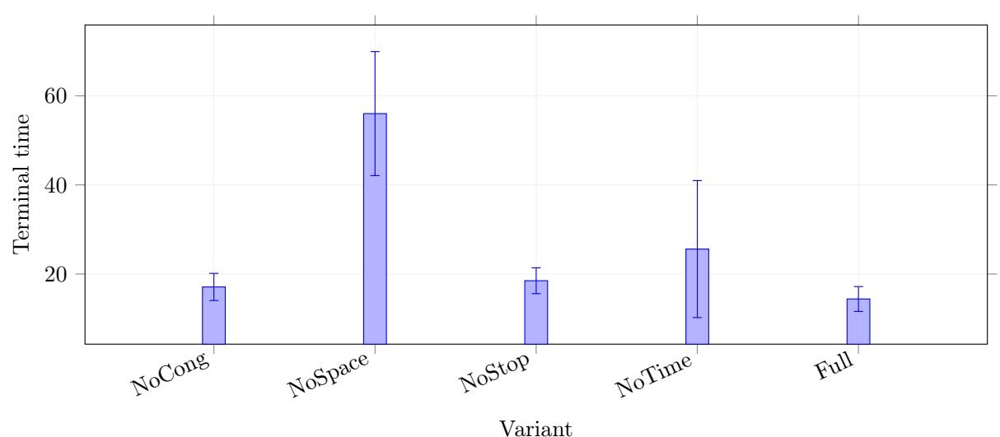
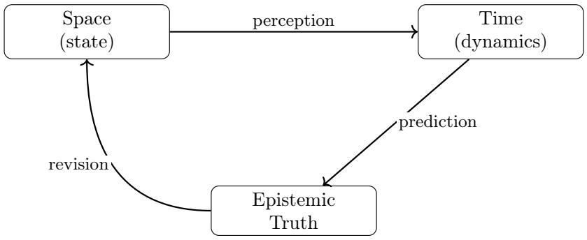

# 三元认知架构：通过时空与认知摩擦约束自主行为

达维德·迪焦亚（Davide Di Gioia） ucesigi@ucl.ac.uk

# 摘要

当前以大语言模型（LLMs）为主要驱动力的自主人工智能代理，运行于一种“认知失重”状态：它们处理信息时缺乏对网络拓扑结构、时间节奏以及认知边界的内在感知。因此，启发式代理循环（例如 ReAct）在交互式环境中易出现若干失效模式，包括在网络拥塞下过度调用工具、在时间衰减压力下陷入冗长审思，以及在证据模糊时表现出脆弱行为。本文提出三元认知架构（Triadic Cognitive Architecture, TCA），一种统一的数学框架，将机器推理锚定于连续时间物理系统之中。该框架融合非线性滤波理论、黎曼路由几何学与最优控制理论，形式化地定义了“认知摩擦”（Cognitive Friction）这一概念。我们将代理的审思过程建模为一个耦合的随机控制问题，其中信息获取具有路径依赖性且受物理约束。TCA 并不依赖任意设定的启发式终止标记（stop-token），而是采用基于 Hamilton-Jacobi-Bellman（HJB）方程推导的终止边界，并通过基于 rollout 的近似方法实现信念依赖型信息价值（value-of-information）的计算，辅以净效用（net-utility）驱动的终止条件。我们在模拟的紧急医疗诊断网格（Emergency Medical Diagnostic Grid, EMDG）中开展实证验证：结果表明，在延迟与网络拥塞成本约束下，贪心基线策略倾向于过度审思；而三元策略则显著缩短行动响应时间，同时提升患者存活率，且未损害该环境下的诊断准确性。

# 1 引言

自主机器智能的研究路径已高度集中于围绕自回归语言模型构建的迭代式、提示驱动型推理循环。ReAct、思维链（Tree-of-Thoughts）及 AutoGPT 等框架已成功证明，LLMs 可有效模拟序列化规划能力 [17, 18, 1]。然而，这些系统本质上仍与真实世界执行所依托的物理规律相脱离。其运行隐含着一个灾难性的假设——即认知环境是无摩擦的：信息获取被预设为瞬时完成、结构自由且可靠性恒定。

当此类系统脱离静态文本生成基准任务，部署至动态、具身或高度网络化的现实环境中时，该假设在数学上将导致系统性失效。若缺乏对空间拓扑、时间节奏与认知分辨力的内生约束，无约束代理将呈现以下三类关键失效模式：

- 1. 拓扑饱和（空间维度）：无差别 API 查询引发级联式网络拥塞，单次查询负载成本持续攀升；代理未能对信息经由多智能体集群或分布式数据库进行路由所引致的结构性代价进行合理估价。  
- 2. 无限审思（时间维度）：由于缺乏连续时间尺度下的节奏调控机制，代理易陷入递归式思维循环，无法识别“最优决策效用随时间推移呈指数衰减”这一基本事实。

3. 认知崩塌（真值维度）：面对不可消解的矛盾证据，代理缺乏严谨的数学框架来表征怀疑。其非但未能揭示证据的模糊性，反而对相互冲突的主张进行平均化处理，并以高度自信的姿态幻构出一种混合式合成结论。

本文主张：真正的自主控制无法源于非结构化的提示—反思（prompt-reflection）范式；它必须建立在形式化、基于决策理论的优化层之上。我们由此提出三元认知架构（TCA），从根本上将机器审思重新定义为——并非文本生成，而是穿越“认知时空”（Cognitive Spacetime）的一条有界物理轨迹。

本工作借鉴了拥塞感知路由、区间感知决策以及熵驱动主张解析等相关思想 [3, 4, 5]，首次将代理的信念状态与其所处环境的物理摩擦正式耦合。我们采用连续时间建模以确保理论普适性（涵盖非线性滤波与 HJB 驱动的终止机制）；而在 EMDG 实现中，我们将信念限定于有限假设集，并通过蒙特卡洛 rollout 近似计算信息价值（详见第 3.4 节）。

创新性与贡献。不同于现有基于 LLM 的代理框架——后者通常将审思视为零成本过程，并依赖启发式终止规则——三元认知架构（TCA）通过显式量化时空摩擦与认知维护成本，实现了对受限推理的形式化建模。本文主要贡献包括：（i）一种理想化的连续时间随机控制建模，其中最优终止由 HJB 自由边界（free boundary）刻画；（ii）一种可计算的离散化实现方案，通过蒙特卡洛 rollout 估计信念依赖型信息价值（VOI），并施加净效用驱动的终止准则。在 EMDG 场景下的实证结果表明，TCA 在延迟与拥塞成本约束下更早终止审思、提升患者存活率，同时保持诊断准确性不变，从而为从原理性终止机制迈向可部署代理控制器提供了切实可行的技术路径。

本工作的新颖之处在于：不同于以往基于 VOI 或有限理性（bounded rationality）的方法——这些方法通常将工具使用成本视为静态或外部给定——TCA 在单一、受最优停止理论启发的终止框架内，联合建模了以下三类动态成本：（i）依赖于拓扑结构与网络拥塞的信息获取成本（空间维度）；（ii）随延迟增长而上升的机会成本（时间维度）；（iii）依赖于当前信念状态的信息价值（真值维度）。核心贡献在于：将上述三项要素整合进统一的决策规则，并提供一种基于 rollout 的、可计算的终止边界近似方法。

本文其余部分结构如下：第2节回顾相关工作，将TCA置于经典有限理性理论与现代具身智能体AI的交叉语境中；第3节形式化“认知摩擦”的物理机制，并推导出三元随机控制目标；第4节通过“紧急医疗诊断网格”（EMDG）对本框架进行实证验证；最后，第5节探讨TCA作为安全、可扩展自主性之基础性框架所蕴含的理论与实践意义。

# 2 相关工作

三元认知架构（Triadic Cognitive Architecture, TCA）弥合了经典有限计算理论与基于大语言模型（LLM）的具身推理之间的鸿沟。我们简要地将本文贡献置于这两个交叉领域之中加以定位。

# 2.1 基于大语言模型的自主智能体

大语言模型的迅猛发展推动了向“具身型”（agentic）架构的范式转变。ReAct [17]、思维树（Tree-of-Thoughts）[18] 以及 Reflexion [13] 等框架已表明：将链式推理提示（chain-of-thought prompting）与环境观测进行交替整合，可显著提升任务成功率。然而，这些框架高度依赖离散的启发式假设集合及任意设定的终止约束（例如 token 数量上限或最大步数限制）[16]。AgentBench [9] 等评测基准虽能有效量化智能体在交互场景下的失效模式，但仍隐含地将审思计算（deliberation computation）视作一种无成本资源。TCA则主张：实现安全的自主性，必须将计算本身作为一项结构性成本予以优化。

# 2.2 有限理性与元推理

为审思过程赋予显式代价这一思想，可追溯至西蒙（Herbert Simon）提出的“有限理性”（bounded rationality）奠基性概念 [15]——该理论指出，智能体必须在信息、认知能力与时间等严格约束下作出决策。罗素（Stuart Russell）与韦法尔德（Eric Wefald）[11] 将其形式化拓展为“元推理”（meta-reasoning）与“有限最优性”（bounded optimality），主张智能体仅应在计算成本低于其预期带来的决策效用增益时才继续计算。在深度学习领域，自适应计算时间（Adaptive Computation Time, ACT）[7] 首次为循环神经网络引入了基于内部置信度的停机机制。TCA 在大语言模型时代重拾这些经典思想，并将提示驱动的工具调用建模为一个受拓扑负载与指数衰减支配的连续时间物理过程。

# 2.3 主动推理与随机控制

本框架在哲学内核上与卡尔·弗里斯顿（Karl Friston）提出的自由能原理（Free Energy Principle）与主动推理（Active Inference）[6]，以及杨立昆（Yann LeCun）提出的联合嵌入预测架构（Joint Embedding Predictive Architecture, JEPA）一脉相承。上述理论均主张：智能体通过构建预测性世界模型，与环境互动以最小化“意外”（surprise）或“预期自由能”。尽管具有深刻的理论根基，但精确贝叶斯主动推理对于离散、自回归式语言模型而言，在计算上仍基本不可行。TCA 为此类概念模型提供了一种原则性替代方案：它构建了一个可计算、闭环式的随机控制包络（stochastic control envelope）。通过融合非线性滤波 [8, 2]、拥塞感知路由（congestion-aware routing）以及Hamilton–Jacobi–Bellman（HJB）最优停机理论 [14, 10]，TCA 在理论认知神经科学与实用机器学习系统工程之间架起桥梁。

# 3 认知摩擦的形式化：耦合随机控制目标

问题设定：我们考虑一类通过代价高昂的工具查询获取信息的智能体，其需同时决定下一步执行哪项查询，以及何时终止审思并执行最终决策。该智能体维护两类状态：一是关于假设空间的概率信念状态（belief state），二是刻画拓扑结构与拥塞程度所决定的访问代价的路由状态（routing state）。

直觉阐释（面向机器学习实践者）：在推理阶段，一个使用工具的智能体面临两个耦合问题：我接下来应调用哪个工具？我应在何时停止查询并采取行动？当前大多数智能体循环（agent loop）均采用启发式策略回答二者（如固定预算、步数上限或临时设定的置信阈值）。TCA 则对审思过程进行显式定价：每一潜在查询均具备两项属性：（i）依赖于当前信念的期望收益（即信息价值 VOI：预期熵减）；（ii）依赖于环境的代价（延迟与拥塞）。控制器选择使净效用最大化的动作，并在即使最优可用查询亦无法带来正向净效用时终止。连续时间下的 HJB 公式为此提供了原则性的停机边界；EMDG 则通过基于 rollout 的 VOI 估计与短视型（myopic）停机规则，实例化了一个可计算的离散近似。

我们将时刻 $t$ 的活跃认知状态定义为 $s _ { t } = \langle p _ { t } , \gamma _ { t } \rangle$，其中 $p _ { t } ( \theta )$ 表示在固定假设流形 $\Theta$ 上的概率信念测度，而 $\gamma _ { t }$ 是黎曼流形 $( \mathcal { M } , g _ { \mu \nu } )$ 上的路由状态。路由状态的演化由控制过程 $u _ { t } \in \mathcal { U }$ 显式支配，满足如下关系：

# 3.1 耦合观测模型

关键在于，信息获取具有路径依赖性。观测过程 $Y _ { t }$ 遵循伊藤扩散（Itô diffusion），且严格耦合于智能体的空间路由状态：其中 $h ( \theta , \gamma _ { t } )$ 表示在假设 $\theta$ 下、于网络位置 $\gamma _ { t }$ 处的期望证据。信念状态 $p _ { t }$ 由 Kushner–Stratonovich 方程演化，其驱动力为创新过程 $d \nu _ { t } = d Y _ { t } - h ( \gamma _ { t } ) d t$。

# 3.2 三元价值函数

智能体旨在最大化期望信息增益，同时最小化时空维度上的认知摩擦。我们规范地将瞬时空间路由代价定义为：

价值函数定义为所有满足 $T \geq t$ 的停时 $T$ 上的上确界：

为便于阅读，当上下文已明确 $\gamma$ 时，我们有时简记为 $V ( p , t )$。

# 3.3 HJB 变分不等式与最优停机

令 $\mathcal{L}^u$ 表示在控制策略 $u_t$ 下马尔可夫状态 $(p_t, \gamma_t)$ 的（受控）无穷小生成元（包括 $p_t$ 中的滤波动力学与路由动力学 $\dot{\gamma}_t = f(\gamma_t, u_t)$）。我们用 $\mathcal{L}^u$ 作为相应泛函 Itô 算子的简写；参见文献 [8, 2]。根据动态规划原理，该系统满足 Hamilton–Jacobi–Bellman（HJB）变分不等式：

在离散型 EMDG 实例化中，运行时的时间惩罚被近似为一个依赖于动作的单步代价，其大小正比于延迟 $\tau(a)$（见第 3.4 节）。

# 3.4 EMDG 中采用的离散时间实例化（基于 rollout 的信息价值 + 短视型终止）

尽管前述小节提出了理想化的连续时间建模框架（含滤波过程与基于 HJB 的终止机制），EMDG 实验则采用了一种与工具使用型智能体相适配的离散近似方案。

符号说明：我们用 $\alpha$ 表示成本-效用缩放系数，$\beta$ 表示时间衰减/延迟惩罚系数，$\lambda_S$ 表示空间/拓扑结构成本权重；$\Omega(a)$ 和 $\tau(a)$ 分别表示动作负载与延迟。信息价值（Value-of-Information, VOI）定义为依赖于信念状态的期望熵减少量，即 $\widehat{\Delta H}(a \mid b_t) = \mathbb{E}[H(b_t) - H(b_{t+1}) \mid a]$，在 EMDG 中通过 rollout 方法进行估计。

我们通过 rollout 方法估计 VOI 项 $\widehat{\Delta H}(a \mid b_t)$。信念状态 $b_t$ 是定义在有限假设集 $\Theta$ 上的类别分布，即 $b_t \in \Delta^{|\Theta| - 1}$。给定一个动作 $a$（即一次工具查询）及一次观测样本，我们依据贝叶斯规则更新 $b_t$，并计算其类别熵：  
$$
H(b) = -\sum_i b(i) \log\big(b(i) + \varepsilon\big)
$$

为估计依赖于信念的信息价值，我们在克隆的状态上执行蒙特卡洛 rollout：

随后，我们依据一项净效用目标函数对动作进行打分，该函数对拥塞与延迟进行量化定价；并在最优延续效用非正时终止推理：

该短视型终止规则忽略延续价值（等价于在一阶前向展望（one-step lookahead）公式中设前向展望权重 $\eta = 0$）；我们将显式的延续价值近似留作未来工作。此处，$\gamma_t$ 表示前述引入的路由状态，而 $\eta$ 是一个独立的标量前向展望权重（在我们的实验中设为零）。

关于离散化误差：理想化的 HJB 变分不等式旨在对未来信息路径上的延续价值进行优化。而我们的 EMDG 控制器采用短视规则（$\eta = 0$），即仅比较即时 VOI 与即时时空成本，并在最优净效用非正时立即终止。这一选择是刻意为之：它产生了一个简单、鲁棒且计算开销低廉的推理时控制器。原则上，延续价值可通过多步 rollout 或学习得到的价值函数加以近似；我们将系统性评估 $\eta > 0$ 及更深层前向展望的工作留待后续研究。

理论–实现桥梁：理想化的 HJB 变分不等式刻画了持续信息获取的最优停止边界。我们的离散控制器可被解释为在延续价值为零（即 $\eta := 0$）条件下对该边界的首阶、计算可行近似：我们并不求解完整值函数 $V$，而是估计即时、依赖于信念的 VOI（即期望熵减少量），并在即使最优可用动作也产生非正净延续效用时停止。因此，该实现近似的是停止边界本身，而非完整的 HJB 解，同时保留了认知增益与时空成本之间的核心权衡关系。

**定理 1（理想化 TCA 模型中的最优停止）**：假设（i）$h(\theta, \cdot)$ 与 $\sigma(\cdot)$ 满足 Lipschitz 条件且具有线性增长性，（ii）$\sigma \sigma^\top$ 一致非退化。则理想化的连续时间三元控制问题存在最优停止时刻。进一步，令 $D = \{(p, \gamma, t) : V(p, \gamma, t) = 0\}$ 表示停止区域，则最小最优停止时刻即为首次击中时间：

**注（理论 vs. 实例化）**：定理 1 针对理想化的连续时间建模框架。我们的 EMDG 实验则实现了第 3.4 节所述的离散近似方案，采用基于 rollout 的 VOI 估计与短视型停止规则（即禁用延续项）。

# 4 经验证实：紧急医疗诊断网格（EMDG）

为阐明施加受限时空约束与认知约束的必要性，我们模拟了一个安全关键型自主推理环境：紧急医疗诊断网格（Emergency Medical Diagnostic Grid, EMDG）。在此仿真中，一个自主诊断智能体需识别一种危及生命的病理并开具干预方案。

该环境施加了严格的物理现实约束：

- • 认知模糊性：智能体初始对五种高致死率病理持有均匀先验假设（$B_0$）；  
- • 空间拓扑结构：智能体通过向分布式医院子系统（如血液科实验室、MRI 网络、患者病史系统）发送查询来获取证据。每个子系统具有不同的结构性负载成本（$\Omega$）。

• 时间衰减：患者存活率随已耗时间呈指数衰减。部分查询（如快速血液检测）耗时 5 个时间步；另一些（如 MRI）则耗时 45 个时间步。

EMDG 蒙特卡洛实验（$N=50$）：平均轨迹图

图 1：EMDG 蒙特卡洛实验（$N=50$）：固定时间范围内的平均熵与患者存活性轨迹。横轴“步数”对应离散化的工具查询迭代次数；所有轨迹在终止后均以终端状态向前填充，以确保逐步一致性（例如，时间不可倒流）。

我们对比评估了一种标准的前沿代理式大语言模型（采用 ReAct 风格的“思考 → 行动 → 观察”循环 [17]）与三元认知架构（Triadic Cognitive Architecture, TCA）。

评估完整性。为防止估计器与轨迹之间的耦合，我们通过为每个环境分别使用独立的随机数生成器（RNG）来解耦随机性：一个 RNG 用于实际转移与观测采样，另一个独立的 RNG 流则专用于在克隆状态上进行信息价值（Value-of-Information, VOI）的 rollout 计算。尽管 HJB 理论为停止边界提供了理论依据，但我们的 EMDG 控制器实现了一种基于 rollout 的、依赖信念的状态信息价值近似，并采用净效用（net utility）为判据的终止条件。

# 4.1 无约束智能体（ReAct）的失效

在缺乏认知摩擦的情况下，基线 ReAct 智能体以贪心方式最大化其估计的信息增益，且在动作选择中未对拥塞或延迟进行代价建模。在第 0 步，它即向 MRI 网络发起查询。

空间性失效。由于其忽略与路由相关的负载与拥塞惩罚，该智能体倾向于在任何时刻只要某工具的即时估计增益最大，便选择高负载工具。

时间性失效。由于 MRI 查询引入 45 个时间步的延迟，可行性（viability）随等待时间呈指数衰减；换言之，在低延迟干预本可及时实施之前，其有效性已大幅下降。

认知性失效。该基线智能体缺乏一种停止规则，无法将边际信息增益与时间敏感的可行性损失进行比较；因此，即使当前信念熵已很低，继续获取额外信息所带来的收益亦不足以弥补延迟成本，它仍持续发起查询。

# 4.2 三元智能体（TCA）的成功

TCA 在 $t = 0$ 时刻动态评估统一目标函数。它计算得出：尽管 MRI 提供较高的预期认知增益（例如，期望熵减少量），但其综合的时间摩擦（$\Phi$）与空间摩擦（Ω）导致净认知效用严重为负。

动作组合。在第 0 步，贪心式 ReAct 在全部 $100\%$ 的随机种子中均选择 MRI_Network；而三元控制器则在全部 $100\%$ 的随机种子中均选择 Hematology_Lab，反映出在认知摩擦约束下对低延迟证据获取的一致偏好。

相反，TCA 向血液学实验室（Hematology Lab）发送一条轻量级查询（$\tau = 5$，Ω 较低）。经过若干次低延迟查询后，系统进入一种状态：此时边际期望信息增益已被时空成本所超越，策略随即终止。

具体而言，我们通过蒙特卡洛 rollout 估计依赖信念的信息价值，并依据净效用对动作进行评分：选择 $a _ { t } = \arg \operatorname* { \max } _ { a \in \mathcal { A } } U ( a ; b _ { t } , t , C _ { t } )$，并在满足以下条件时停止：

TCA 在最优后续效用（best continuation utility）非正时即终止推理过程，并提前执行动作。

我们报告均值 ± 95% 置信区间，其计算公式为 $1.96 \hat{\sigma} / \sqrt{N}$，其中 $N = 50$ 为随机种子数，所用数据为每颗种子对应的终端值（即每颗种子日志中的最后一行）。

<table><tr><td>Agent</td><td>Time</td><td>Viability</td><td>Entropy</td><td>Accuracy</td><td>ptrue</td><td>Total info gain</td></tr><tr><td>ReAct (Greedy)</td><td>112.5 ± 6.3</td><td>57.34 ± 1.80</td><td>0.0406 ± 0.0081</td><td>1.00 ± 0.00</td><td>0.9938 ± 0.0014</td><td>1.5688 ± 0.0081</td></tr><tr><td>Triadic Control</td><td>14.4 ± 0.8</td><td>93.06 ± 0.36</td><td>0.1645 ± 0.0202</td><td>1.00 ± 0.00</td><td>0.9664 ± 0.0055</td><td>1.4450 ± 0.0202</td></tr></table>

表 1：EMDG 实验结果（$N=50$）。终端值取自每颗种子日志中的最后一行。总信息增益为每轮 episode 中 info_gain 的累加和；在此设定下，其等于熵减少量 $H ( b _ { 0 } ) - H ( b _ { T } )$（一个望远镜求和式）。在第 0 步，ReAct 在 $100\%$ 的随机种子中选择 MRI_Network，而 TCA 则在 $100\%$ 的随机种子中选择 Hematology_Lab。

注：在 EMDG 中，info_gain 按步记录为 $H ( b _ { t } ) - H ( b _ { t + 1 } )$，因此每轮 episode 的总信息增益望远镜求和为 $H ( b _ { 0 } ) - H ( b _ { T } )$。由于初始信念 $b _ { 0 }$ 由均匀先验固定，总信息增益的离散程度（从而置信区间宽度）与终端熵的离散程度一致。

可扩展性考量。EMDG 环境被有意设计为小规模，以在拥塞与延迟条件下隔离有限推理（bounded deliberation）效应。在更大规模的工具生态系统中，朴素的蒙特卡洛 VOI rollout 可能带来高昂计算开销。然而，VOI 估计可通过以下方式分摊成本：(i) 学习期望熵减少量的代理模型；(ii) 对相似信念状态缓存并复用 rollout 结果；(iii) 利用低成本筛选启发式方法限制候选工具集合；或 (iv) 在适用时采用解析近似（如 Fisher 信息或局部线性化）。这些近似方法与 TCA 的理念一致：控制器所需的是经代价标定的边际信息价值估计，而非必须精确计算。

向异构工具生态系统的泛化。未来工作的一个关键方向是，在具备异构工具套件（例如网页导航、代码执行与多跳问答）的多领域智能体设置中评估 TCA 性能，其中各类工具展现出差异化的延迟与拥塞特征。在此类环境中，一个核心问题是：是否存在一组通用的时空代价参数，可在无需针对各领域单独调参的前提下，持续产生一致的效用权衡？若能证明 TCA 在跨领域场景中仍能维持高效的停止行为与代价感知的工具选择能力，则将有力表明：认知摩擦是适用于受限智能体推理的一般性原理，而非 EMDG 这一特定环境下的偶然产物。

# 4.3 超参数与可复现性

在 EMDG 中，代价–效用缩放系数 $\alpha$、时间衰减因子 $\beta$ 以及空间代价权重 $\lambda _ { S }$ 在全部随机种子上保持固定，以反映拥塞条件下的时间敏感型诊断范式。在当前实现中，它们分别对应于 `cost_scale`（$\Delta \alpha = 0.01$）、`beta`（$\beta = 0.5$）与 `lambda_s`（$\lambda _ { S } \approx 0.8$）（参见 `emdg_sim.py`）。我们将对这些参数（以及显式延续值近似中 $\eta > 0$ 的设定）开展系统性敏感性扫描，留待后续工作完成。

敏感性分析（计划中）。由于 $\alpha$、$\beta$、$\lambda _ { S }$ 共同调控信息增益与时空代价之间的权衡关系，我们计划对这些参数开展敏感性扫描（例如，在 $\pm 25\%$ 范围内变动），以量化模型鲁棒性并校准推荐默认值。

# 4.4 消融实验

为分离三元控制器中各组件的独立贡献，我们在 $N = 50$ 个蒙特卡洛随机种子上开展受控的消融实验。具体消融设置如下：(i) 移除HJB停机准则（即禁止执行 STOP 动作，记为 No-Stop）；(ii) 移除空间/拓扑项（即将空间摩擦权重设为零，记为 No-Space）；(iii) 移除时间项（即将时间摩擦权重设为零，记为 No-Time）；(iv) 移除拥堵反馈项（即在空间摩擦计算中忽略实时拥堵状态，记为 No-Congestion）。图2展示了终末患者存活性（terminal patient viability）与终末决策耗时（terminal deliberation time）的均值及其标准差（$\pm 1 \sigma$）。

EMDG 消融实验结果（$N=50$）：终末指标均值 $\pm 1 \sigma$

图2：EMDG 消融实验（$N=50$）：不同控制器变体下的终末患者存活性与终末决策耗时。柱状图表示均值，误差线表示跨随机种子的 $\pm 1 \sigma$。

完整三元控制器在实现最高患者存活性的同时最小化了决策耗时，表明联合对空间、时间和显式停机边界进行代价建模具有必要性。

# 5 启示：TCA 作为有界智能体推理的基础性框架

三元认知架构（Triadic Cognitive Architecture, TCA）为从脱离具身的模式匹配器向具身化、自主化智能体的演进提供了蓝图。通过形式化“认知摩擦”（cognitive friction），TCA 引入了一种数学上严格的安全机制，以防范大语言模型（LLM）在无约束推理循环中固有的资源失控消耗问题。

# 5.1 空间、时间与认识论真值的耦合

在 TCA 框架下，智能体的推理过程被严格限定于三个相互作用的模块之内（参见图3）：

- • 空间（拓扑具身性）：环境并非被视作一组扁平化的可调用 API 列表，而是被建模为一个黎曼流形（Riemannian manifold）。度规张量 $g_{\mu\nu}$ 根据网络延迟与实时拥堵状态动态更新，迫使智能体沿结构化的测地线（geodesics）路由查询请求。此举可防止 API 过载式调用，并保护脆弱的子智能体免于级联失效。  
- • 时间（时间一致性）：无限上下文长度并不能规避一个基本事实——物理世界在智能体进行推理的过程中持续演化。指数衰减因子 $\beta(t)$ 确保智能体尊重计算所付出的时间机会成本，从而内在地阻止无限推理循环的发生。  
- • 真值（认识论维护）：通过将信念修正建模为 Kushner-Stratonovich 方程，智能体维持着对各类假设的校准化概率测度。它显式建模输入数据的费舍尔信息量（Fisher Information），从而自然规避对矛盾证据进行简单平均所导致的幻觉（hallucination）陷阱。

综上所述，这三种摩擦形式（空间摩擦、时间摩擦与认识论摩擦）共同定义了一个自主推理的有界控制包络（bounded control envelope）。TCA 并非孤立地优化推理准确性，而是通过显式权衡信息增益与物理及时间成本，来决定何时行动、查询何类信息、以及决策应持续多久。这种三元耦合机制为防止过度推理、网络饱和以及认识论层面的过度自信，提供了原理性的解决方案。

图3：三元认知架构（TCA）：空间（状态）、时间（动力学）与认识论真值（信念修正）之间的耦合闭环。

# 5.2 推理时控制器（Inference-Time Controller）

TCA 的核心是一个受 HJB 最优停机理论启发的推理时控制器。该控制器持续聚合空间路由成本与时间衰减效应，并将其动态加权后与预期的认识论增益进行比较。该控制器充当 AI 的自主神经系统：正如生物有机体在能量消耗超过潜在收益时会直觉性地中止探索，TCA 智能体亦在新增证据的边际价值被时空成本所超越时，自动中止 API 查询并触发执行动作。

# 5.3 相对于既有认知理论的定位

在提示驱动的多步推理领域已有大量研究工作，代表性方法包括 ReAct [17]、思维树（Tree-of-Thoughts）[18] 与 Reflexion [13]。然而，这些框架依赖于启发式、离散化的假设集合，忽视了网络依赖型的物理成本，且缺乏用于最优停机的原理性数学判据 [9, 16]。

TCA 框架在哲学渊源上与 Karl Friston 的自由能原理（Free Energy Principle）与主动推理（Active Inference）[6]，以及 Yann LeCun 提出的联合嵌入预测架构（Joint Embedding Predictive Architecture, JEPA）存在共通之处。上述理论均主张：智能体致力于在其预测性世界模型中最小化“意外”（surprise）。然而，主动推理依赖的变分界（variational bounds）对于离散型、自回归式语言模型而言仍普遍难以处理。TCA 为此类概念模型提供了一种原理性替代方案：它构建了一个可计算、闭环式的随机控制包络。通过将非线性滤波 [8, 2]、拥塞感知路由与 HJB 最优停机理论 [14, 10] 有机融合，TCA 在理论认知神经科学与实用机器学习系统工程之间架起了一座桥梁。

# 5.4 结论

三元认知架构提供了一种统合性视角：稳健的自主性要求对结构化空间、时间动力学与认识论真值维护进行显式耦合。通过将推理过程建模为一条受约束的物理轨迹，TCA 为工具使用型智能体的有界推理提供了原理性框架。尽管本文在 EMDG 中评估的是基于离散 rollout 的实例化方案，但其底层建模形式可自然推广至异构环境——在该类环境中，信息获取本身即伴随着真实的时空成本。

# 5.5 更广泛影响与意义

三元认知架构（Triadic Cognitive Architecture, TCA）通过显式耦合**认知确定性**（epistemic certainty）、**时间动力学**（temporal dynamics）与**空间/拓扑约束**（spatial/topological constraints），重新定义了人工智能中安全且可扩展的自主性。借此，TCA 弥合了当前具身智能体（agentic AI）领域的一项关键空白：现有基于大语言模型（LLM）的推理系统运行于一种“认知真空”之中，忽视了信息获取与审慎推理在现实世界中所产生成本。通过形式化定义“认知摩擦”（Cognitive Friction），并施加一个具有理论依据的停机边界（该边界受 Hamilton–Jacobi–Bellman（HJB）最优停机理论启发，并在我们的实验中通过可计算的、基于 rollout 的信息价值（Value of Information, VOI）加以实现），TCA 将计算从一种无限抽象转变为一种**可度量、可优化的资源**。这一转变在多个领域具有深远意义：在医疗健康领域，它可助力自主诊断智能体在避免过度审慎的前提下，及时、可靠地作出决策；在机器人学领域，它支持智能体在物理与时间双重约束下更安全地执行任务；在人工智能基础研究领域，它提供了一个可复现、闭环的建模框架，成功弥合了随机控制理论与 LLM 驱动的认知建模之间的鸿沟。除上述直接应用外，TCA 更为下一代类原初通用人工智能（proto-AGI）系统奠定了理论基础，阐明了智能系统如何在自主推理、自主行动与自主终止之间达成平衡，从而降低认知崩溃（epistemic collapse）、时间超限（temporal overrun）与系统过载（systemic overloading）的风险。

# 参考文献

- [1] AutoGPT（2023）。开源项目。  
- [2] Bain, A. 和 Crisan, D.（2009）。《随机滤波基础》（Fundamentals of Stochastic Filtering）。Springer Science & Business Media。  
- [3] Di Gioia, D.（2026）。《级联感知的多智能体路由》（Cascade-Aware Multi-Agent Routing）。未发表手稿 / 审稿中。  
- [4] Di Gioia, D.（2026）。《区间感知的强化学习》（Interval-Aware Reinforcement Learning）。未发表手稿 / 审稿中。  
- [5] Di Gioia, D.（2026）。《熵驱动的主张裁决》（Entropic Claim Resolution）。未发表手稿 / 审稿中。  
- [6] Friston, K.（2010）。《自由能原理：一种统一的大脑理论？》（The free-energy principle: a unified brain theory?）。《自然·神经科学综述》（Nature Reviews Neuroscience），11(2)，127–138。  
- [7] Graves, A.（2016）。《循环神经网络的自适应计算时间》（Adaptive Computation Time for Recurrent Neural Networks）。arXiv 预印本 arXiv:1603.08983。  
- [8] Kushner, H. J.（1964）。《马尔可夫过程条件概率密度所满足的微分方程》（On the differential equations satisfied by conditional probability densities of Markov processes）。《工业与应用数学学会期刊·A辑：控制》（Journal of the Society for Industrial and Applied Mathematics, Series A: Control），2(1)，106–119。  
- [9] Liu, X. 等（2023）。《AgentBench：将大语言模型作为智能体进行评估》（AgentBench: Evaluating LLMs as Agents）。arXiv 预印本 arXiv:2308.03688。（已录用至 ICLR 2024。）  
- [10] Øksendal, B.（2003）。《随机微分方程：带应用的导论》（Stochastic Differential Equations: An Introduction with Applications）。Springer。  
- [11] Russell, S. J. 与 Wefald, E.（1991）。《做正确的事：有限理性研究》（Do the Right Thing: Studies in Limited Rationality）。MIT Press。  
- [12] Shannon, C. E.（1948）。《通信的数学理论》（A Mathematical Theory of Communication）。《贝尔系统技术期刊》（Bell System Technical Journal）。  
- [13] Shinn, N. 等（2023）。《反思机制：采用言语式强化学习的语言智能体》（Reflexion: Language agents with verbal reinforcement learning）。NeurIPS。  
- [14] Peskir, G. 与 Shiryaev, A. N.（2006）。《最优停时与自由边界问题》（Optimal Stopping and Free-Boundary Problems）。《苏黎世联邦理工学院数学讲义》（Lectures in Mathematics ETH Zürich）。DOI: 10.1007/978-3-7643-7390-0。  
- [15] Simon, H. A.（1955）。《理性选择的行为模型》（A behavioral model of rational choice）。《经济学季刊》（The Quarterly Journal of Economics），69(1)，99–118。  
- [16] Xi, Z. 等（2023）。《基于大语言模型的智能体的兴起与潜力：一项综述》（The Rise and Potential of Large Language Model Based Agents: A Survey）。arXiv 预印本 arXiv:2309.07864。  
- [17] Yao, S. 等（2023）。《ReAct：语言模型中推理与行动的协同》（ReAct: Synergizing Reasoning and Acting in Language Models）。ICLR。  
- [18] Yao, S. 等（2023）。《思维之树：利用大语言模型进行审慎的问题求解》（Tree of Thoughts: Deliberate Problem Solving with Large Language Models）。NeurIPS。

# 定理 1（理想化连续时间模型）的证明概要

本附录为第 3 节中提出的理想化连续时间模型（基于 Kushner–Stratonovich 滤波与受 HJB 理论启发的最优停机）提供一个证明概要。该概要**不直接适用于**离散型 EMDG 控制器——后者采用基于 rollout 的 VOI 估计方法，并遵循一种短视的净效用停机准则（见第 3.4 节）。

我们重申理想化模型的核心结论：在标准正则性条件下，三元认知控制问题存在一个由 HJB 自由边界所刻画的最优停时。

步骤 1：滤波动力学与马尔可夫状态的正则性。设观测过程由下式支配：

假设函数 $h ( \theta , \cdot )$ 与 $\sigma ( \cdot )$ 满足一致 Lipschitz 连续性及线性增长界；并假设一致非退化性：存在 $\epsilon > 0$，使得

在上述假设下，创新过程 $d \nu _ { t } = d Y _ { t } - h ( \gamma _ { t } ) d t$ 关于观测滤波 $\mathcal { F } _ { t } ^ { Y }$ 是一个布朗运动，且相应的非线性滤波器（即 Kushner–Stratonovich 滤波器；示意形式）是适定的；参见例如文献 [8, 2]。特别地，受控状态 $( p _ { t } , \gamma _ { t } )$ 关于 $\mathcal { F } _ { t } ^ { Y }$ 构成一个马尔可夫过程。

定义 $\begin{array} { r } { h ( \gamma _ { t } ) = \int _ { \Theta } h ( \theta , \gamma _ { t } ) p _ { t } ( \theta ) d \theta } \end{array}$ 及创新项

Kushner–Stratonovich 更新的示意形式为

步骤 2：值函数与动态规划。智能体旨在最大化期望认知增益减去认知摩擦。对任意停时 $\tau \geq t$，记其中 $f ( p , \gamma , t )$ 表示瞬时净奖励（即信息代理项减去路由成本与时间惩罚），与第 3 节一致。令表示值函数。若 $V$ 具备足够正则性（或在粘性解框架下开展分析），则针对受控马尔可夫过程的标准动态规划论证可导出一个变分不等式刻画 [14, 10]。

步骤 3：Hamilton–Jacobi–Bellman（HJB）变分不等式与自由边界。根据最优停时理论，值函数在适当的经典意义或粘性解意义下满足如下形式的变分不等式 [14, 10]，其中 $\mathcal { L } ^ { u }$ 是第 3 节中定义的马尔可夫状态 $( p _ { t } , \gamma _ { t } )$ 的受控无穷小生成元。在所假设的成本结构下，$f$ 连续且有界，因此在标准假设下，$V$ 是连续的。将停时区域定义为闭集，而将继续区域定义为开集：

于是，首次击中停时区域的时刻即为一个最优停时；此外，它在此类问题的通常意义上是最小（极小）的最优停时 [14]。至此，证明概要完成。