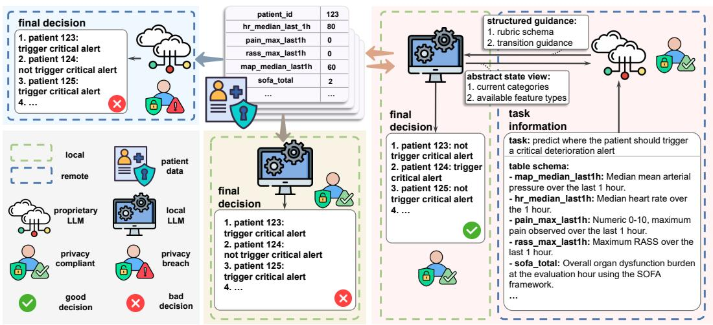
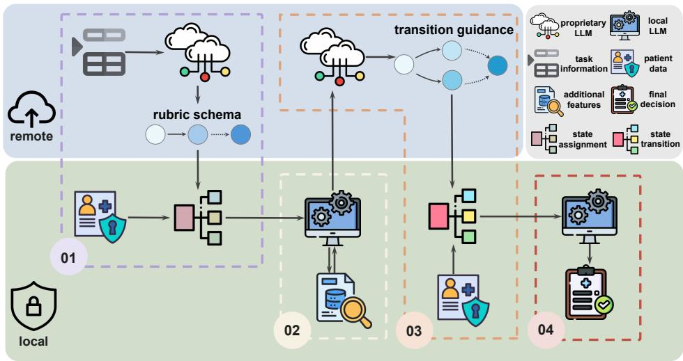
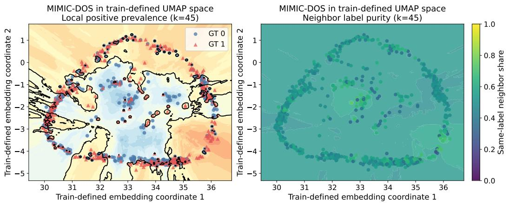

> # CARE: Privacy-Compliant Agentic Reasoning with Evidence Discordance

**[译]**

# CARE：基于证据不一致性下的隐私合规型智能体推理

---

> Haochen Liu1∗, Weien $\mathbf { L i } ^ { 2 }$, Rui Song2, Zeyu $\mathbf { L i } ^ { 2 }$, Chun Jason Xue3,

**[译]**

刘浩晨¹∗，李伟恩²，宋睿²，李泽宇²，薛春杰³，

---

> Xiao-Yang Liu4, Sam Nallaperuma1, Xue Liu2, 3, 5, Ye Yuan2, 3, 5∗

**[译]**

刘晓阳⁴，萨姆·纳拉佩鲁马¹，刘雪²,³,⁵，袁野²,³,⁵∗

---

> - 1University of Cambridge, 2McGill University,
> - 3MBZUAI - Mohamed bin Zayed University of Artificial Intelligence,
> - 4Columbia University, 5Mila - Quebec AI Institute

**[译]**

- ¹剑桥大学，²麦吉尔大学，  
- ³MBZUAI——穆罕默德·本·扎耶德人工智能大学，  
- ⁴哥伦比亚大学，⁵Mila——魁北克人工智能研究所

---

> # Abstract

**[译]**

# 摘要

---

> Large language model (LLM) systems are increasingly used to support high-stakes decision-making, but they typically perform worse when the available evidence is internally inconsistent. Such a scenario exists in realworld healthcare settings, with patient-reported symptoms contradicting medical signs. To study this problem, we introduce MIMIC-DOS, a dataset for short-horizon organ dysfunction worsening prediction in the intensive care unit (ICU) setting. We derive this dataset from the widely recognized MIMIC-IV, a publicly available electronic health record dataset, and construct it exclusively from cases in which discordance between signs and symptoms exists. This setting poses a substantial challenge for existing LLM-based approaches, with single-pass LLMs and agentic pipelines often struggling to reconcile such conflicting signals. To address this problem, we propose CARE: a multi-stage privacy-compliant agentic reasoning framework in which a proprietary LLM provides guidance by generating structured categories and transitions without accessing sensitive patient data, while a local LLM uses these categories and transitions to support evidence acquisition and final decision-making. Empirically, CARE achieves stronger performance across all key metrics compared to multiple baseline settings, showing that CARE can more robustly handle conflicting clinical evidence while preserving privacy.

**[译]**

大语言模型（LLM）系统正日益被用于支持高风险决策任务，但当可用证据内部存在不一致时，其性能通常显著下降。此类情形在现实医疗场景中广泛存在，例如患者自述症状与客观医学体征相互矛盾。为研究该问题，我们构建了 MIMIC-DOS 数据集，用于预测重症监护病房（ICU）中短期内器官功能恶化的趋势。该数据集源自广受认可的公开电子健康档案数据集 MIMIC-IV，并严格筛选出其中体征与症状存在明显不一致的病例进行构建。这一设定对现有基于 LLM 的方法构成了严峻挑战：单次前向推理的 LLM 及各类智能体流水线往往难以有效调和此类相互冲突的信号。为此，我们提出 CARE 框架——一种多阶段、隐私合规的智能体推理框架：其中私有化部署的 LLM 在不接触敏感患者数据的前提下，生成结构化的分类体系与状态转移逻辑以提供高层指导；而本地部署的 LLM 则利用这些分类与转移逻辑，驱动证据采集并完成最终决策。实验结果表明，CARE 在所有关键评估指标上均显著优于多种基线方法，验证了其在保障隐私的同时更稳健地处理临床冲突证据的能力。

---

> # 1 Introduction

**[译]**

# 1 引言

---

> Large language model (LLM) systems are increasingly being used as decision-support tools in high-stakes domains (Singhal et al., 2023; Thirunavukarasu et al., 2023). This trend is partly driven by recent advances in prompting, tool use, and agentic orchestration, which have improved LLM performance on complex tasks (Yao et al., 2023; Wang et al., 2024). However, such capabilities are often evaluated in relatively protected settings, where the available evidence is internally consistent and supports a clear decision. Real-world decisionmaking, by contrast, frequently involves incomplete, noisy, and conflicting information that must be reconciled before a reliable judgment can be made (Helou et al., 2020). As a result, it remains unclear whether current LLM systems can reason robustly when the available evidence is internally discordant.

**[译]**

大语言模型（LLM）系统正越来越多地作为高风险领域中的决策支持工具被采用（Singhal 等，2023；Thirunavukarasu 等，2023）。这一趋势部分源于近期在提示工程、工具调用及智能体协同编排等方面的进展，这些进展显著提升了 LLM 在复杂任务上的表现（Yao 等，2023；Wang 等，2024）。然而，此类能力通常在相对受控的环境中进行评估，即所给证据内部一致且能明确指向某一决策结论。相比之下，现实世界中的决策过程往往涉及不完整、含噪声乃至相互矛盾的信息，必须在形成可靠判断前完成对这些信息的辨析与整合（Helou 等，2020）。因此，当前 LLM 系统是否具备在证据内部存在不一致性时仍能稳健推理的能力，尚不明确。

---

> In this work, we focus on cases where subjective and objective evidence point toward different clinical judgments. For example, patient-reported symptoms or bedside narrative assessments may appear reassuring, while structured physiological signs indicate risk of deterioration. Such cases are especially difficult because the correct decision cannot be obtained by naively aggregating all available signals (Helou et al., 2020). Instead, the model

**[译]**

本文聚焦于主观性证据与客观性证据导向不同临床判断的情形。例如，患者自述症状或床旁叙事性评估可能呈现“病情稳定”的表象，而结构化的生理体征却提示存在病情恶化的风险。此类情形尤为困难，因为正确决策无法通过简单聚合所有可用信号而获得（Helou 等，2020）。相反，模型

---

> Figure 1: Comparison of three decision-making settings: (1) single-pass inference with a proprietary LLM (left, light blue), (2) single-pass inference with a local LLM (middle, light yellow), and (3) our proposed CARE framework (right, light red). In the single-pass settings, the model receives raw patient values and feature columns directly as input. Using a proprietary LLM in this way risks privacy leakage, while relying only on a self-hosted local LLM can lead to poorer decisions. In contrast, CARE enables the proprietary LLM to provide structured guidance to the local LLM without accessing raw patient values, allowing privacy-compliant decision making while preserving strong performance.

**[译]**

图 1：三种决策范式的对比：（1）使用私有化 LLM 的单次前向推理（左，浅蓝色），（2）使用本地化 LLM 的单次前向推理（中，浅黄色），以及（3）本文提出的 CARE 框架（右，浅红色）。在单次前向推理范式中，模型直接接收原始患者数值与特征列作为输入。以这种方式使用私有化 LLM 存在隐私泄露风险；而仅依赖自托管的本地化 LLM 则可能导致决策质量下降。相比之下，CARE 允许私有化 LLM 在不访问原始患者数值的前提下，向本地化 LLM 提供结构化指导，从而在保障隐私合规性的同时维持高性能决策能力。

---

> should identify what additional information is needed and revise its judgment as new evidence becomes available (Li et al., 2024). Existing single-pass LLMs and current medical evaluation paradigms are poorly matched to this setting. They are typically studied in static, single-pass formats (Johri et al., 2025), yet performance becomes noticeably fragile when information must be elicited and integrated over multiple turns (Hager et al., 2024).

**[译]**

应能识别尚需获取哪些补充信息，并随新证据的持续输入动态修正其判断（Li 等，2024）。现有的单次前向推理 LLM 及当前主流医学评估范式均难以适配此类场景：它们通常在静态、单次前向的设定下开展研究（Johri 等，2025），但一旦需要在多轮交互中逐步引出并整合信息，其性能便明显变得脆弱（Hager 等，2024）。

---

> Healthcare settings are further complicated by privacy constraints (Price & Cohen, 2019; Jonnagaddala & Wong, 2025). In many realistic scenarios, the strongest available model is likely to be a closed-source system that cannot be allowed to access raw patient data, whereas an open-source model can be deployed locally but may still underperform frontier proprietary models on some clinical reasoning tasks (Safavi-Naini et al., 2025; Wada et al., 2025). As illustrated in Figure 1, this creates a fundamental challenge for our setting: the model best suited for high-level reasoning is not allowed to fully observe the instance, while the model with access to the instance may not reason reliably (Fleming et al., 2024). As a result, end-to-end use of a stronger proprietary model is infeasible, whereas relying on a weaker local model can lead to degenerate decisions (Hager et al., 2024; Wada et al., 2025).

**[译]**

医疗场景还进一步受到隐私约束的制约（Price & Cohen，2019；Jonnagaddala & Wong，2025）。在诸多现实场景中，性能最强的模型很可能是一个闭源系统，因而不允许其直接访问原始患者数据；而开源模型虽可本地部署，但在某些临床推理任务上仍可能逊色于前沿闭源模型（Safavi-Naini 等，2025；Wada 等，2025）。如图 1 所示，这为本文所研究的问题带来了根本性挑战：最适于执行高层推理的模型无法充分观测实例，而能够观测实例的模型又可能无法实现可靠推理（Fleming 等，2024）。因此，端到端地使用更强的私有化模型不可行，而单纯依赖较弱的本地化模型则可能导致决策退化（Hager 等，2024；Wada 等，2025）。

---

> To address this complicated challenge while preserving privacy, we proposed CARE, a multistage privacy-Compliant Agentic REasoning framework that separates global guidance from patient-specific reasoning. Rather than sending raw patient values to the stronger closed-source model, CARE uses it to provide structured guidance over the reasoning process, including transition-level policies and, by design, rubric-level structure derived from feature semantics and task structure. A local workflow then applies this structure to private patient data for initial state assignment, targeted evidence acquisition, transition evaluation, and final decision-making. This decomposition allows CARE to combine the reasoning strength of closed-source models with the privacy guarantees of local inference, while explicitly supporting disagreement-aware, state-transition-based reasoning.

**[译]**

为应对这一复杂挑战并同时保障隐私，我们提出了 CARE（一种多阶段隐私合规型智能体推理框架），该框架将全局指导与患者特异性推理相分离。CARE 并不将原始患者数据直接发送至能力更强的闭源模型，而是利用该模型为整个推理过程提供结构化指导，包括状态转移层面的策略，以及依据特征语义与任务结构所设计的评分标准（rubric）层面的结构。随后，一个本地工作流将此结构应用于私有患者数据，完成初始状态赋值、有针对性的证据采集、状态转移评估以及最终决策。这种分解式设计使 CARE 能够融合闭源模型的强大推理能力与本地推理所具备的隐私保障优势，同时显式支持基于状态转移且能识别分歧的推理机制。

---

> To study this setting in a controlled way, we construct MIMIC-DOS, a disagreementfocused benchmark from MIMIC-IV (Johnson et al., 2024; 2023; Goldberger et al., 2000) consisting exclusively of cases in which subjective and objective signals point in different directions. Because such cases are relatively rare and easily obscured in broader clinical datasets, isolating them allows us to directly evaluate whether LLM systems can reason under evidence conflict rather than succeed through agreement-driven shortcuts. We further balance this subset to enable stable comparison across methods, while noting that such balance does not reflect real deployment conditions. On MIMIC-DOS, we find that baseline single-pass LLMs and open-source agentic pipelines frequently collapse to degenerate oneclass predictions, a behavior that may appear superficially competitive under balanced evaluation but is not practically usable in realistic clinical settings. In contrast, CARE avoids this failure mode and yields more robust performance under evidence discordance.

**[译]**

为在受控条件下研究该设定，我们构建了 MIMIC-DOS——一个聚焦于分歧现象的基准数据集，其源自 MIMIC-IV（Johnson 等，2024；2023；Goldberger 等，2000），且仅包含主观信号与客观信号指向相反方向的临床案例。由于此类案例在广泛临床数据集中相对罕见且易被掩盖，对其加以隔离可使我们直接评估大语言模型（LLM）系统是否真正具备在证据冲突下进行推理的能力，而非仅依赖共识驱动的捷径而取得表面成功。我们进一步对该子集进行了平衡处理，以支持不同方法间的稳定比较；但需指出，此类平衡并不反映真实部署环境中的数据分布。在 MIMIC-DOS 上，我们发现基线单次前向推理的 LLM 以及开源智能体流水线频繁退化为单一类别预测（degenerate one-class predictions），此类行为虽在平衡评估下可能表现出表面上的竞争性，但在实际临床场景中却完全不可用。相比之下，CARE 避免了这一失效模式，并在证据不一致情形下展现出更稳健的性能。

---

> Our contributions are threefold:

**[译]**

我们的贡献有三方面：

---

> - • First, we identify sign-symptom discordance as a critical yet underexplored challenge for LLM-based clinical decision support and introduce MIMIC-DOS, a benchmark derived from MIMIC-IV that isolates this mode for controlled evaluation.
> - • Second, we propose CARE, a multi-stage privacy-Compliant Agentic REasoning framework that combines structured remote guidance with local patient-specific reasoning under explicit privacy constraints.
> - • Third, we show empirically that existing single-pass LLMs and open-source agentic pipelines are prone to degenerate one-class collapse in this setting, whereas CARE achieves more robust and more balanced performance.

**[译]**

- • 首先，我们识别出“体征—症状不一致”（sign-symptom discordance）这一对基于大语言模型的临床决策支持系统而言至关重要却尚未被充分探索的挑战，并引入 MIMIC-DOS——一个源自 MIMIC-IV 的基准数据集，专门用于隔离并可控地评估该类情形。  
- • 其次，我们提出 CARE：一种多阶段隐私合规型智能体推理框架，它在明确的隐私约束下，将结构化的远程指导与本地化的患者特异性推理相结合。  
- • 第三，我们通过实证表明，在该设定下，现有单次前向推理的 LLM 及开源智能体流水线极易发生退化为单一类别预测的问题，而 CARE 则实现了更稳健、更均衡的性能表现。

---

> # 2 Related work

**[译]**

# 2 相关工作

---

> Evidence discordance and the limits of conventional ICU deterioration models Predicting patient deterioration in intensive care units (ICU) has long relied on early warning scores and machine learning models trained on electronic health record datasets such as MIMIC-IV. Recent studies applied gradient boosting models like XGBoost to predict sepsis mortality, achieving high classification metrics (Li et al., 2023). However, these traditional models often operated as black boxes (Rudin, 2019). They flattened complex temporal physiological data into static vectors, offering limited interpretable clinical reasoning to the attending physician, a limitation that drove recent interest in attention-based and inherently interpretable architectures (Choi et al., 2016). More importantly, they struggled to resolve conflicting signals between a patient’s subjective presentation and objective physiological measurements. This limitation was particularly critical in clinical settings such as occult hypoperfusion (cryptic shock), where patients could appear hemodynamically stable despite elevated risk (Howell et al., 2007; Puskarich et al., 2011). In sepsis cohorts, mortality in cryptic shock was reported not to differ significantly from that of overt septic shock (Puskarich et al., 2011), and elevated lactate has been associated with worse outcomes even in otherwise stable high-risk patients (Meregalli et al., 2004). Together, these findings highlighted a fundamental challenge: clinically important deterioration often manifests as discordance between subjective observations and objective physiological signals, a regime where conventional models are not designed to reason.

**[译]**

证据不一致现象及传统 ICU 恶化预测模型的局限性  
重症监护病房（ICU）中患者恶化风险的预测，长期以来依赖早期预警评分系统以及在电子健康档案（EHR）数据集（如 MIMIC-IV）上训练的机器学习模型。近期研究将 XGBoost 等梯度提升模型应用于脓毒症死亡率预测，取得了较高的分类指标（Li 等，2023）。然而，这些传统模型通常以“黑箱”形式运行（Rudin，2019），将复杂的时序生理数据压缩为静态向量，因而难以向主治医师提供可解释的临床推理支持；这一缺陷推动了近年来对基于注意力机制及天然具备可解释性的模型架构的研究兴趣（Choi 等，2016）。更为重要的是，它们难以调和患者主观表现与其客观生理测量值之间相互矛盾的信号。这一局限在诸如隐匿性低灌注（即隐匿性休克）等临床场景中尤为关键：患者可能在血流动力学上看似稳定，实则已处于高风险状态（Howell 等，2007；Puskarich 等，2011）。在脓毒症队列中，隐匿性休克患者的死亡率被报道与显性脓毒性休克患者无显著差异（Puskarich 等，2011）；此外，即使在其他方面表现稳定的高危患者中，乳酸水平升高亦已被证实与更差的预后相关（Meregalli 等，2004）。上述发现共同揭示了一个根本性挑战：临床上重要的病情恶化往往体现为主观观察与客观生理信号之间的不一致；而传统模型恰恰并非为此类情形而设计，因而无法在此类证据冲突的范式下开展有效推理。

---

> LLM and agentic clinical reasoning under conflicting evidence Large language models (LLMs) have recently emerged as a promising alternative for clinical decision support. Models including Med-PaLM demonstrated expert-level proficiency on static medical board examinations (Singhal et al., 2023; Nori et al., 2023). However, directly applying single LLMs to electronic health records remains challenging due to the dynamic, contradictory, and incomplete nature of clinical data (Jiang et al., 2023). Single-pass models were also susceptible to automation bias and misleading textual cues (Goddard et al., 2012; Ji et al., 2023), often overweighting reassuring subjective descriptions (e.g., “patient appears calm”) while underweighting subtle but critical physiological abnormalities. To address these limitations, recent work shifted toward tool-augmented and multi-agent paradigms (Schick et al., 2023; Tang et al., 2023). Frameworks such as ReAct enabled models to iteratively query external tools, grounding reasoning in factual data (Yao et al., 2023), while multi-agent debate systems attempt to improve robustness through collective reasoning (Du et al., 2024). However, these approaches introduced new challenges in coordinating agents and achieving reliable consensus. For example, agents could fail to communicate reasoning advantages effectively or converge prematurely to incorrect conclusions (Lin & Hooi, 2025). Confidenceaware debate frameworks mitigated this issue by calibrating agent confidence, but they require additional training data, limiting applicability in privacy-constrained and lowresource clinical settings (Lin & Hooi, 2025). Concurrent efforts such as FACTS (Yuan et al., 2025) addressed structured data reliability through offline template generation, separating reasoning logic from data execution. Building on this insight, we propose an asymmetric hybrid framework that avoids training-dependent calibration by enforcing safe consensus through programmatic gating. Specifically, sensitive patient data is processed locally by open-source models, whereas remote proprietary models provide high-level reasoning guidance without direct access to raw data, enabling robust decision-making under evidence discordance while preserving privacy.

**[译]**

大型语言模型与证据冲突下的代理式临床推理  
大型语言模型（LLM）近年来已成为临床决策支持领域极具前景的替代方案。以 Med-PaLM 为代表的模型已在静态医学执照考试中展现出专家级水平（Singhal 等，2023；Nori 等，2023）。然而，由于临床数据具有动态性、矛盾性与不完整性等特征，直接将单一 LLM 应用于电子健康档案（EHR）仍面临严峻挑战（Jiang 等，2023）。此外，单次前向推理模型易受自动化偏见（automation bias）及误导性文本线索影响（Goddard 等，2012；Ji 等，2023），常过度依赖令人安心的主观描述（例如“患者表现平静”），却低估细微却关键的生理异常。为应对上述局限，近期研究转向工具增强型与多智能体（multi-agent）范式（Schick 等，2023；Tang 等，2023）。例如 ReAct 框架使模型能够迭代调用外部工具，从而将推理过程锚定于实证数据（Yao 等，2023）；而多智能体辩论系统则试图通过集体推理提升鲁棒性（Du 等，2024）。然而，这些方法又引入了新的挑战——如何协调多个智能体并达成可靠共识。例如，智能体可能无法有效传达各自推理优势，或过早收敛至错误结论（Lin & Hooi，2025）。基于置信度感知的辩论框架通过校准各智能体的置信度缓解了该问题，但其依赖额外训练数据，在隐私敏感且资源受限的临床环境中适用性受限（Lin & Hooi，2025）。同期开展的其他工作（如 FACTS，Yuan 等，2025）则通过离线模板生成提升结构化数据的可靠性，将推理逻辑与数据执行相分离。受此启发，我们提出一种非对称混合框架：该框架不依赖训练驱动的置信度校准，而是通过程序化门控机制强制实现安全共识。具体而言，敏感患者数据由本地开源模型处理，而远程专有模型仅提供高层级推理指导，不直接访问原始数据——从而在证据相互冲突的情形下实现稳健决策，同时保障患者隐私。

---

> # 3 Dataset and task

**[译]**

# 3 数据集与任务

---

> MIMIC-IV dataset Our experiments involve MIMIC-IV v3.1 (Johnson et al., 2024; 2023; Goldberger et al., 2000), a large de-identified dataset with longitudinal ICU and hospital electronic health records from Beth Israel Deaconess Medical Center between 2008 and 2022. The dataset includes bedside monitoring data, laboratory results, medications, procedures, and clinical documentation, making it suitable for time-indexed ICU prediction tasks.

**[译]**

MIMIC-IV 数据集  
本实验采用 MIMIC-IV v3.1 数据集（Johnson 等，2024；2023；Goldberger 等，2000），这是一个大规模去标识化数据集，涵盖 2008 至 2022 年间贝斯以色列女执事医疗中心（Beth Israel Deaconess Medical Center）重症监护病房（ICU）及住院患者的纵向电子健康记录。该数据集包含床旁监测数据、实验室检验结果、用药记录、诊疗操作及临床文书，适用于基于时间索引的 ICU 预测任务。

---

> Construction of MIMIC-DOS From MIMIC-IV, we construct MIMIC-DOS, a dataset designed to study ICU states characterized by discordance between bedside subjective presentation and objective physiologic risk. Each sample is defined at the ICU stay–hour level as a pair (stay id, $t _ { \mathrm { e v a l } , }$, where $t _ { \mathrm { e v a l } }$denotes a study-defined hourly evaluation time within an ICU stay. Cohort construction is based on three routinely available bedside measures in the one-hour window preceding $t _ { \mathrm { e v a l } } ,$including two subjective bedside assessments and one objective hemodynamic measurement. The first is a structured pain self-assessment reported by patients, recorded in MIMIC-IV as an integer-valued bedside pain score ranging from 0 to 10, where 0 indicates no pain (Devlin et al., 2018). The second is the Richmond Agitation-Sedation Scale (RASS), a standard ICU bedside assessment of agitation and sedation ranging from $^ { - 5 }$(unarousable) to $+ 4$(combative), with 0 indicating an alert and calm state (Sessler et al., 2002). The third is mean arterial pressure (MAP), a routinely monitored hemodynamic variable widely used to assess systemic perfusion. A MAP below $6 5 \mathrm { m m H g }$is commonly treated as clinically concerning in critical care (Evans et al., 2021).

**[译]**

MIMIC-DOS 数据集的构建  
我们基于 MIMIC-IV 构建了 MIMIC-DOS 数据集，旨在研究 ICU 状态中床旁主观表现与客观生理风险之间存在分歧的情形。每个样本定义为 ICU 住院–小时层级上的二元组（住院编号，$t_{\mathrm{eval}}$），其中 $t_{\mathrm{eval}}$ 表示某次 ICU 住院期间由研究预先定义的每小时评估时间点。队列构建依据为 $t_{\mathrm{eval}}$ 前一小时内三个常规可获取的床旁指标，包括两项主观床旁评估与一项客观血流动力学测量。第一项为患者自主报告的结构化疼痛自评量表，在 MIMIC-IV 中以整数形式记录为床旁疼痛评分（0–10 分），0 分表示无疼痛（Devlin 等，2018）。第二项为里士满躁动-镇静评分（Richmond Agitation-Sedation Scale, RASS），这是 ICU 标准床旁评估工具，用于衡量躁动与镇静程度，评分范围为 $^{-5}$（无法唤醒）至 $^{+4}$（攻击性），0 分表示警觉且平静状态（Sessler 等，2002）。第三项为平均动脉压（Mean Arterial Pressure, MAP），是临床常规监测的血流动力学参数，广泛用于评估全身灌注状况；在危重症监护中，MAP 低于 $65\ \mathrm{mmHg}$ 通常被视为具有临床警示意义（Evans 等，2021）。

---

> A sample (stay id, $t _ { \mathrm { e v a l . } }$) is included only if all of the following conditions are satisfied: (1) the maximum pain score in the preceding hour is 0, indicating no recorded pain; (2) at least one RASS observation is available in the preceding hour, with maximum RASS no greater than 0 and minimum RASS greater than $- 3$, excluding agitated and deeply sedated states; and (3) MAP remains below $6 5 \mathrm { m m H g }$for a cumulative duration over 5 minutes during the preceding hour. These criteria define ICU stay–hour states in which subjective bedside indicators remain relatively reassuring while objective hemodynamic instability is present.

**[译]**

样本（住院编号，$t_{\mathrm{eval}}$）仅当满足以下全部条件时才被纳入：（1）前一小时内记录的最高疼痛评分为 0，即无疼痛报告；（2）前一小时内至少有一次 RASS 观测值，且其最大值不超过 0、最小值大于 $-3$，从而排除躁动及深度镇静状态；（3）前一小时内 MAP 低于 $65\ \mathrm{mmHg}$ 的累计持续时间超过 5 分钟。上述标准共同界定出一类 ICU 住院–小时状态：其主观床旁指标相对平稳可信，而客观血流动力学指标已呈现不稳定性。

---

> Task formulation and sample extraction MIMIC-DOS is designed for a binary classification task. Each sample (stay id, $t _ { \mathrm { e v a l } } )$is associated with a feature set anchored at $t _ { \mathrm { e v a l } } ,$consisting of 2 subjective features and 20 objective features. Detailed explanations are in Appendix A.1. The model predicts whether the patient will experience worsening organ dysfunction within the subsequent 12 hours. Organ dysfunction is operationalized using the MIMIC-IV hourly Sequential Organ Failure Assessment (SOFA) score representation, where each hourly SOFA value is a rolling summary over the preceding 24 hours. A sample is labeled positive if the maximum SOFA score observed from $t _ { \mathrm { e v a l } } + 1$to $t _ { \mathrm { e v a l } } + 1 2$exceeds the SOFA score at $t _ { \mathrm { e v a l } }$by at least 2 points, and negative otherwise, following the Sepsis-3 convention that a SOFA increase of at least 2 points indicates clinically meaningful organ dysfunction (Singer et al., 2016). After label assignment, cohort filtering, and overlap exclusion, the eligible evaluation pool contains 25,090 ICU stay–hour pairs, including 2,179 positive and 22,911 negative samples. We then construct a locked benchmark by deterministic pair-level sampling and fix the released evaluation set at 1,000 samples, balanced to 500 positive and 500 negative cases. This size keeps evaluation computationally feasible, and

**[译]**

任务形式化与样本提取：MIMIC-DOS 面向二分类任务设计。每个样本（住院编号，$t _ { \mathrm { e v a l } } $）均关联一个以 $t _ { \mathrm { e v a l } } $ 为锚点的特征集，包含 2 个主观特征和 20 个客观特征。详细说明见附录 A.1。模型需预测患者在随后 12 小时内是否将发生器官功能恶化。器官功能恶化通过 MIMIC-IV 每小时序贯器官衰竭评估（SOFA）评分表示，其中每小时 SOFA 值为前 24 小时内各项指标的滚动汇总。若从 $t _ { \mathrm { e v a l } } + 1$ 至 $t _ { \mathrm { e v a l } } + 12$ 期间观测到的最大 SOFA 分值较 $t _ { \mathrm { e v a l } } $ 时刻的 SOFA 分值至少升高 2 分，则该样本标记为阳性；否则标记为阴性。此判定标准遵循 Sepsis-3 共识，即 SOFA 分值升高 ≥2 分即提示具有临床意义的器官功能障碍（Singer 等，2016）。完成标签赋值、队列筛选及重叠排除后，最终可用的评估池共包含 25,090 对 ICU 住院–小时样本，其中阳性样本 2,179 例，阴性样本 22,911 例。随后，我们通过确定性的样本级采样构建一个锁定基准，并将发布的评估集固定为 1,000 个样本，均衡划分为 500 个阳性与 500 个阴性样本。该规模兼顾评估的计算可行性，且

---

> Figure 2: Overview of the CARE framework. In Stage 1, a proprietary LLM constructs a rubric schema over intermediate patient states from task information, and the local side applies this rubric to patient data to obtain an initial state assignment. In Stage 2, the local LLM performs evidence checks by determining whether additional features are needed given the current state and observed values. In Stage 3, the proprietary LLM generates transition guidance from an abstract view of the current state and available feature types; the local side updates the state through recomputation and constrained merge without exposing raw patient data. In Stage 4, the local LLM produces the final task decision from the patient data and the accumulated reasoning trace over states. In our framework, raw patient values remain local throughout the entire pipeline, allowing the framework to preserve privacy.

**[译]**

图 2：CARE 框架概览。在第一阶段，专有大语言模型（LLM）基于任务信息，对中间患者状态构建评分量表（rubric）结构；本地端则将该量表应用于患者数据，获得初始状态分配。在第二阶段，本地 LLM 执行证据核查，判断在当前状态及已观测值条件下是否还需补充其他特征。在第三阶段，专有 LLM 从当前状态的抽象视图及可用特征类型出发生成状态转移指导；本地端通过重新计算与受约束融合更新状态，全程不暴露原始患者数据。在第四阶段，本地 LLM 结合患者数据及累积的状态推理轨迹，生成最终任务决策。在本框架中，原始患者数值在整个流程中始终保留在本地，从而保障隐私。

---

> the class balance is used for clearer analysis rather than for training, since our workflows operate in a zero-shot setting. The final evaluation set contains 1,000 samples from 912 ICU stays and 881 unique patients.

**[译]**

类别平衡仅用于更清晰的分析，而非用于训练，因为我们的工作流运行于零样本（zero-shot）设定下。最终评估集包含来自 912 次 ICU 住院、881 名唯一患者的 1,000 个样本。

---

> # 4 Method

**[译]**

# 4 方法

---

> To solve the challenging problem of disagreement in subjective and objective evidence under the strict privacy constraints, we introduce CARE (privacy-Compliant Agentic REasoning). Rather than relying on a single end-to-end prediction step, CARE decomposes reasoning into structured stages that enable remote guidance and local inference to work together in a privacy-preserving manner. In this section, we start to define the privacy scope in Section 4.1, followed by elaborating the details of our proposed CARE framework in Section 4.2.

**[译]**

为应对在严格隐私约束下主观与客观证据存在分歧这一挑战性问题，我们提出 CARE（符合隐私要求的智能体式推理，privacy-Compliant Agentic REasoning）。CARE 并非依赖单一端到端预测步骤，而是将推理过程分解为若干结构化阶段，使远程指导与本地推断得以协同运作，同时确保隐私保护。本节首先于第 4.1 节界定隐私边界，继而在第 4.2 节详述所提出的 CARE 框架。

---

> # 4.1 Privacy scope

**[译]**

# 4.1 隐私边界

---

> CARE is designed under a threat model in which all sensitive clinical measurements and personally identifiable information remain local. The proprietary model is allowed to access only task-level metadata, such as feature names, feature descriptions, category definitions, and other value-independent semantic information for construct structured guidance. CARE therefore protects sensitive patient data from direct exposure to the external model.

**[译]**

CARE 的设计基于如下威胁模型：所有敏感临床测量值及个人身份信息均保留在本地。专有模型仅被允许访问任务层级的元数据，例如特征名称、特征描述、类别定义，以及其他与具体取值无关的语义信息，以构建结构化指导。因此，CARE 可防止敏感患者数据直接暴露于外部模型。

---

> # 4.2 CARE framework

**[译]**

# 4.2 CARE 框架

---

> Operationally, CARE consists of four stages, as shown in Figure 2: (1) rubric generation and initial state assignment; (2) category-aware data acquisition; (3) transition reasoning; (4) final decision-making. The proprietary model is used to produce value-independent guidance, while the local model and programmatic components apply this guidance to patient-specific data across the local execution stages. This decomposition allows CARE to combine the abstract reasoning capability of a closed-source model with the privacy guarantees of local inference and to support disagreement-aware transition-based reasoning. Examples of the four stages are in Appendix A.4.1, A.4.2, A.4.3. and A.4.4.

**[译]**

在操作层面，CARE 包含四个阶段，如图 2 所示：（1）评分量表生成与初始状态分配；（2）类别感知的数据获取；（3）状态转移推理；（4）最终决策。专有模型负责生成与具体取值无关的指导，而本地模型及程序化组件则在本地执行各阶段中，将该指导应用于患者特异性数据。该分解机制使 CARE 能够融合闭源模型的抽象推理能力与本地推断的隐私保障，并支持面向分歧的状态转移式推理。四个阶段的具体示例分别见附录 A.4.1、A.4.2、A.4.3 和 A.4.4。

---

> Stage 1: rubric generation and initial state assignment In the initial stage, CARE seeks to establish a structured state space for downstream reasoning. States could be organized as an ordered scale indicating how likely the patient is to be experiencing worsening of organ dysfunction. By design, this rubric schema can be generated from task-level information, including feature descriptions, feature semantics, and the task objective, without exposing patient-specific values. The rubric defines the intermediate patient states, their semantic interpretations, and the types of evidence that are typically required to support each state. More generally, the rubric serves as structured prior knowledge and need not be generated by the proprietary model. When reliable domain expertise is available, it can instead be specified or refined by human experts. In our experiments, since we study a single fixed task, we reuse one shared predefined rubric schema rather than regenerating it during inference. The locally available patient data are then mapped onto this rubric to compute an initial category assignment. By separating rubric structure from patient-specific instantiation, Stage 1 allows CARE to leverage abstract guidance without exposing raw patient values.

**[译]**

第一阶段：评分量表生成与初始状态分配  
在初始阶段，CARE 旨在为下游推理建立结构化的状态空间。这些状态可组织为有序量表，用以表征患者发生器官功能恶化的可能性。按设计，该评分量表结构可仅依据任务层级信息（包括特征描述、特征语义及任务目标）生成，无需暴露任何患者特异性取值。该量表定义了中间患者状态、其语义解释，以及通常支持每一状态所需的证据类型。更广义而言，该量表作为结构化的先验知识，未必必须由专有模型生成；当具备可靠的领域专业知识时，亦可由人类专家指定或优化。在本实验中，由于我们聚焦于单一固定任务，故复用一个共享的预定义评分量表结构，而非在推理过程中重复生成。随后，本地可获取的患者数据被映射至该量表，以计算初始类别分配。通过将量表结构与患者特异性实例化相分离，第一阶段使 CARE 能够利用抽象指导，同时避免原始患者数值的暴露。

---

> Stage 2: category-aware data acquisition Given the initial state assignment, CARE next determines whether the currently available evidence is sufficient for reliable decisionmaking. The local model uses the current category, the patient’s observed values, and the category-specific evidence requirements induced by the rubric to identify which additional features should be retrieved. This stage is therefore not a generic retrieval step, but a state-conditioned acquisition process in which the relevance of new evidence depends on the patient’s current inferred state. After retrieval, CARE re-evaluates evidence sufficiency and determines whether the available information is adequate for transition reasoning.

**[译]**

第二阶段：类别感知的数据获取  
在完成初始状态分配后，CARE 进而判断当前可用证据是否足以支持可靠的决策。本地模型利用当前类别、患者已观测到的数值，以及由评分标准（rubric）所导出的类别特异性证据需求，来确定需进一步获取哪些额外特征。因此，该阶段并非通用的信息检索步骤，而是一种以状态为条件的证据获取过程，其中新证据的相关性取决于患者当前推断出的状态。完成检索后，CARE 重新评估证据充分性，并判定现有信息是否足以支撑状态转移推理。

---

> Stage 3: transition reasoning Once obtained sufficient evidence, CARE evaluates how the patient’s state should change based on the newly available information. The proprietary model receives the current category, the set of available feature types, and the rubric-level transition structure, but still does not observe any raw patient values. Based on this abstract view, it produces structured transition guidance together with candidate state transitions that are plausible to consider. The local side then combines this advisory output with the actual patient values through local recomputation and constrained merge, determining whether the patient remains in the same category or transitions to a different one. This stage is central to CARE’s design, as it enables explicit reasoning over disagreement resolution through state updates rather than forcing a one-shot prediction from conflicting evidence.

**[译]**

第三阶段：状态转移推理  
在获得足够证据后，CARE 基于新获取的信息评估患者状态应如何变化。专有模型接收当前类别、可用特征类型集合以及评分标准层级的状态转移结构，但仍不接触任何原始患者数值。基于这一抽象表示，该模型生成结构化的转移指导，并输出若干合理可行的候选状态转移路径。随后，本地端将该指导性输出与实际患者数值相结合，通过本地重计算（local recomputation）与约束式融合（constrained merge），判定患者是维持原类别，还是转入另一类别。该阶段是 CARE 架构设计的核心，使其能够通过对状态更新进行显式推理，从而实现对分歧的解析，而非被迫从相互冲突的证据中强行得出一次性预测。

---

> Stage 4: final decision-making In the final stage, the local model converts the updated state representation into the task-level prediction. This decision is made using the accumulated reasoning trace, including the initial category assignment, the acquired evidence, the transition guidance, and the final updated category. By grounding the final judgment in the structured outputs of the earlier stages, CARE avoids relying on a single free-form inference pass over heterogeneous evidence. Instead, it produces the final prediction through a staged reasoning process in which patient-specific data remain local throughout.

**[译]**

第四阶段：最终决策  
在最后阶段，本地模型将更新后的状态表征转化为任务层面的预测结果。该决策基于累积的推理轨迹作出，包括初始类别分配、所获取的证据、转移指导以及最终更新的类别。通过将最终判断锚定于前期各阶段所生成的结构化输出，CARE 避免了依赖单次自由形式的推理过程来处理异构证据。相反，它通过一个分阶段的推理流程生成最终预测，且在整个过程中，患者特异性数据始终保留在本地。

---

> # 5 Experiments

**[译]**

# 5 实验

---

> To structure the empirical evaluation, we study three research questions: RQ1: How does CARE compare with representative single-pass and multi-agent baseline workflows on MIMIC-DOS? RQ2: How do different local LLMs affect workflow performance? RQ3: How do the stages of CARE contribute to its final performance?

**[译]**

为系统化开展实证评估，我们围绕以下三个研究问题展开研究：  
RQ1：CARE 在 MIMIC-DOS 数据集上相较于代表性单次调用与多智能体基线工作流的表现如何？  
RQ2：不同本地大语言模型（LLM）对工作流性能的影响如何？  
RQ3：CARE 各阶段对其最终性能的贡献分别为何？

---

> We evaluate CARE on MIMIC-DOS against multiple baseline LLM and agentic workflows. For candidate local LLMs, we consider gpt-oss-120b (GPT-OSS) (OpenAI et al., 2025),

**[译]**

我们在 MIMIC-DOS 数据集上对 CARE 进行评估，并将其与多种基线大语言模型及智能体工作流进行对比。候选本地 LLM 包括 gpt-oss-120b（GPT-OSS）（OpenAI 等，2025），

---

<table><tr><td rowspan="2">Workflow</td><td rowspan="2">Local LLM(s)</td><td rowspan="2">Proprietary LLM</td><td>Validity</td><td colspan="2">Class Performance</td><td colspan="3">Metrics</td><td rowspan="2">Efficiency Tokens /Sample</td></tr><tr><td>Valid rate</td><td>TPR(Recall)</td><td>TNR(Specificity)</td><td>BA</td><td>G-mean</td><td>MCC</td></tr><tr><td rowspan="3">Single-pass</td><td>GPT-OSS</td><td>—</td><td>1.0000</td><td>0.1980</td><td>0.8340</td><td>0.5160</td><td>0.4064</td><td>0.0415</td><td>1155.47</td></tr><tr><td>Qwen</td><td>—</td><td>0.9980</td><td>0.3800</td><td>0.6004</td><td>0.4902</td><td>0.4777</td><td>-0.0201</td><td>745.42</td></tr><tr><td>LLaDA</td><td>—</td><td>0.9810</td><td>0.9388</td><td>0.0692</td><td>0.5040</td><td>0.2550</td><td>0.0162</td><td>834.67</td></tr><tr><td>Majority voting</td><td>GPT-OSS + Qwen + LLaDA</td><td>—</td><td>0.9940</td><td>0.4289</td><td>0.5596</td><td>0.4910</td><td>0.4697</td><td>-0.0197</td><td>2739.65</td></tr><tr><td>RSMAD</td><td>GPT-OSS + Qwen + LLaDA</td><td>—</td><td>0.9970</td><td>0.2751</td><td>0.7435</td><td>0.5093</td><td>0.4523</td><td>0.0210</td><td>12912.39</td></tr><tr><td>ConfMAD</td><td>GPT-OSS + Qwen + LLaDA</td><td>—</td><td>1.0000</td><td>0.3360</td><td>0.6620</td><td>0.4990</td><td>0.4716</td><td>-0.0021</td><td>20458.34</td></tr><tr><td rowspan="3">CARE (ours)</td><td>GPT-OSS</td><td>GPT-5</td><td>1.0000</td><td>0.5220</td><td>0.5700</td><td>0.5460</td><td>0.5455</td><td>0.0921</td><td>7771.52</td></tr><tr><td>Qwen</td><td>GPT-5</td><td>1.0000</td><td>0.6520</td><td>0.3560</td><td>0.5040</td><td>0.4818</td><td>0.0084</td><td>7168.53</td></tr><tr><td>LLaDA</td><td>GPT-5</td><td>0.9990</td><td>0.6232</td><td>0.3660</td><td>0.4946</td><td>0.4776</td><td>-0.0111</td><td>7246.58</td></tr></table>

> Table 1: Performance comparison across workflows, local LLMs, and proprietary LLMs.

**[译]**

表 1：不同工作流、本地 LLM 与专有 LLM 的性能对比。

---

> Qwen3.5-122B-A10B (Qwen) (Qwen Team, 2026), and LLaDA2.1-Flash (LLaDA) (Bie et al., 2026), spanning two strong autoregressive LLMs and a diffusion-based LLM, allowing us to check how workflows perform across different generation paradigms. We use GPT-5 (Singh et al., 2025) as the proprietary LLM to support CARE workflow. We include four types of baseline workflows in our experiments: (1) Single-pass LLM baseline: given the feature block, the model receives all available features of the sample in a single prompt and outputs the final prediction in a single LLM call, without any decomposition, interaction, or iterative refinement. (2) Majority voting: three heterogeneous agents based on different local LLMs independently solve the same case without communication (Choi et al., 2025). Each agent produces its own final prediction as in the single-pass LLM baseline, and the overall prediction is determined by majority vote over the agents’ final outputs. (3) Round-synchronous multi-agent debate (RSMAD): following Du et al. (2024), each of the three agent first generates an independent answer, as in the single-pass baseline. In each of the two subsequent round, agents revise their responses using only the responses of the other agents from the previous round, with communication occurring synchronously across rounds. The final prediction is determined by majority vote. (4) Confidence-aware sequential debate (ConfMAD): following Lin & Hooi (2025), each of the three agents first produces an independent answer with its reasoning, final prediction, and confidence. In later two rounds, agents respond sequentially in a fixed order, so later agents can observe updates made earlier in the same round. The final prediction is determined by selecting the answer with the highest confidence in the last round. Detailed explanations of the two MAD-based baselines are provided in Appendix A.2.

**[译]**

Qwen3.5-122B-A10B（Qwen）（通义千问团队，2026）以及 LLaDA2.1-Flash（LLaDA）（Bie 等，2026），涵盖两种高性能自回归式大语言模型及一种基于扩散机制的大语言模型，从而可检验各类工作流在不同生成范式下的表现。我们选用 GPT-5（Singh 等，2025）作为专有 LLM，以支持 CARE 工作流。实验中纳入四类基线工作流：（1）单次调用 LLM 基线：模型在单次提示中接收样本所有可用特征，并通过一次 LLM 调用直接输出最终预测，其间不进行任务分解、交互或迭代优化。（2）多数投票法（Majority voting）：三个基于不同本地 LLM 的异构智能体各自独立求解同一病例，彼此间无通信（Choi 等，2025）。每个智能体均按单次调用 LLM 基线方式生成其最终预测，整体预测结果由三者最终输出的多数投票决定。（3）轮次同步式多智能体辩论（Round-synchronous multi-agent debate, RSMAD）：参照 Du 等（2024），三位智能体首先各自独立生成答案（同单次调用基线）；随后在两轮迭代中，每位智能体仅依据前一轮其他智能体的响应来修订自身答案，且各轮内通信同步进行；最终预测仍由多数投票决定。（4）置信度感知的顺序式多智能体辩论（Confidence-aware sequential debate, ConfMAD）：参照 Lin 与 Hooi（2025），三位智能体首先各自独立生成答案，附带其推理过程、最终预测及置信度评分；在后续两轮中，智能体按固定顺序依次响应，使得后序智能体可观察到同轮中先前智能体所作的更新；最终预测则选取最后一轮中置信度最高的答案。两类基于 MAD（Multi-Agent Debate）的基线工作流的详细说明见附录 A.2。

---

> We evaluate each workflow in terms of validity, predictive performance, and efficiency. Validity measures whether a workflow returns a valid final output that follows the defined format. Invalid cases are excluded from predictive evaluation. For predictive performance, we report True Positive Rate (TPR), True Negative Rate (TNR), Balanced Accuracy (BA), G-mean, and Matthews Correlation Coefficient (MCC). These metrics are chosen because MIMIC-DOS is a difficult benchmark with subjective–objective discordance, where onesided prediction collapse can be misleading. For efficiency, we report Tokens/Sample, the average total token usage per sample. Metric definitions are provided in Appendix A.3.

**[译]**

我们从有效性（validity）、预测性能（predictive performance）与效率（efficiency）三方面评估各工作流。有效性衡量工作流是否返回符合预定义格式的有效最终输出；无效案例将被排除在预测性能评估之外。对于预测性能，我们报告真阳性率（TPR）、真阴性率（TNR）、平衡准确率（Balanced Accuracy, BA）、几何平均值（G-mean）以及马修斯相关系数（Matthews Correlation Coefficient, MCC）。选择这些指标的原因在于：MIMIC-DOS 是一个具有主观–客观不一致性的困难基准，单向预测坍缩（onesided prediction collapse）可能产生误导。对于效率，我们报告“每样本 Token 数”（Tokens/Sample），即每个样本所消耗的平均总 Token 数量。各指标的具体定义见附录 A.3。

---

> # 6 Results and analysis

**[译]**

# 6 结果与分析

---

> Main results Table 1 reports the main experimental results. Among all compared workflows, CARE with gpt-oss-120B as the local LLM and GPT-5 as the proprietary LLM achieves the best overall performance, with all outputs being valid and the highest BA (0.5460), G-mean (0.5455), and MCC (0.0921). More importantly, it is the only setting in which both the TPR and TNR exceed 0.5, with $\mathrm { T P R } { = } 0 . 5 \dot { 2 } 2 0$and $\dot { \mathrm { T N R } } = 0 . 5 7 0 0$. By contrast, most competing workflows show a pronounced directional bias toward one class.

**[译]**

主要结果：表1报告了主要的实验结果。在所有对比的工作流中，采用gpt-oss-120B作为本地大语言模型（LLM）、GPT-5作为专有大语言模型的CARE方法取得了最佳的整体性能：所有输出均有效，且BA（0.5460）、G-mean（0.5455）与MCC（0.0921）均为最高值。更重要的是，这是唯一一种真阳性率（TPR）和真阴性率（TNR）均超过0.5的设置，其中$\mathrm{TPR} = 0.5220$，$\mathrm{TNR} = 0.5700$。相比之下，大多数竞争性工作流均表现出显著的单向类别偏向。

---

<table><tr><td rowspan="2">Workflow</td><td colspan="2">Class Performance</td><td colspan="3">Metrics</td><td>Efficiency</td></tr><tr><td>TPR (Recall)</td><td>TNR (Specificity)</td><td>BA</td><td>G-mean</td><td>MCC</td><td>Tokens /Sample</td></tr><tr><td>Full workflow</td><td>0.5220</td><td>0.5700</td><td>0.5460</td><td>0.5455</td><td>0.0921</td><td>7771.52</td></tr><tr><td>Backbone only</td><td>0.3900</td><td>0.6920</td><td>0.5410</td><td>0.5195</td><td>0.0860</td><td>4164.42</td></tr><tr><td>Without Stage 1</td><td>0.4980</td><td>0.5660</td><td>0.5320</td><td>0.5309</td><td>0.0641</td><td>7458.60</td></tr><tr><td>Without Stage 3</td><td>0.4160</td><td>0.6660</td><td>0.5410</td><td>0.5264</td><td>0.0847</td><td>4202.36</td></tr></table>

> Table 2: Ablation study of CARE under the 4-stage conceptual decomposition. All runs use GPT-OSS as the local model and GPT-5 as the proprietary model.

**[译]**

表2：基于四阶段概念分解的CARE消融研究。所有实验均采用GPT-OSS作为本地模型、GPT-5作为专有模型。

---

> Workflow-level comparison The baseline workflows exhibit a common failure mode: they tend to collapse toward a model-specific operating point rather than maintain a balanced decision policy. This aligns with known vulnerabilities of zero-shot language models to severe label bias and prior probability shifts when forced into immediate classification (Zhao et al., 2021). This is most obvious in the single-pass setting, where the same input is consumed in one shot and the local model must directly commit to a final prediction. For reference only, Appendix A.5 also reports a single-pass GPT-5 result, which exhibits the same workflow-level limitation but is excluded from Table 1 because it falls outside the privacy scope defined in Section 4.1. This suggests that CARE’s effectiveness does not arise solely from the stronger abstract reasoning capability of the proprietary model, but also from the staged agentic framework itself, which structures reasoning beyond a single flat prediction step. Majority voting partially averages out these preferences at the binary label level, but it does not fundamentally remove the class-imbalance tendency. Its improved validity mainly comes from collapsing agent-level disagreement into a binary decision rather than from genuinely stronger agreement among agents, a limitation frequently observed in flat self-consistency protocols (Wang et al., 2023). The two debate baselines are more expensive but still operate on the same flat input representation without an explicit intermediate state model. As a result, they mainly redistribute the false-positive/false-negative trade-off rather than resolve it: the more conservative debate variant retains higher specificity, while ConfMAD shifts modestly toward recall, but neither produces a clear gain in BA or MCC.

**[译]**

工作流层级对比：基线工作流呈现出一种共性的失效模式——它们倾向于坍缩至模型特定的操作点，而非维持一种平衡的决策策略。这一现象与零样本语言模型在被强制执行即时分类时所暴露的已知脆弱性一致，即对严重标签偏差与先验概率偏移高度敏感（Zhao et al., 2021）。该问题在单次前向推理（single-pass）设置中尤为明显：同一输入仅被一次性处理，本地模型必须直接输出最终预测。为作参考，附录A.5亦报告了单次前向推理下GPT-5的结果；该结果虽表现出相同的工作流层级局限性，但因其超出第4.1节所定义的隐私范围，故未列入表1。这表明，CARE的有效性不仅源于专有模型更强的抽象推理能力，更关键地取决于其分阶段的智能体框架本身——该框架将推理过程结构化，超越了单一扁平化的预测步骤。多数投票法（majority voting）仅能在二元标签层面部分平均化各模型的偏好倾向，却未能从根本上消除类别不平衡趋势。其有效性提升主要源于将智能体层面的分歧压缩为一个二元决策，而非源于智能体之间真正更强的一致性；此类局限在扁平化的自一致性协议（flat self-consistency protocols）中屡见不鲜（Wang et al., 2023）。两种辩论式基线方法计算开销更高，但仍基于相同的扁平化输入表示，且未显式建模中间状态。因此，它们主要重新分配假阳性/假阴性之间的权衡关系，而非根本解决该问题：更为保守的辩论变体保持了更高的特异性（specificity），而ConfMAD则适度向召回率（recall）偏移；但二者均未在BA或MCC上产生明确增益。

---

> CARE differs from the baselines in that it does not make the final decision directly from a flat bundle of mixed evidence. This is especially important in our benchmark, which is defined by subjective–objective discordance: reassuring bedside presentation can coexist with genuine physiological risk. In this setting, the baseline workflows tend to preserve or merely redistribute model-specific bias, whereas CARE explicitly structures state construction, evidence acquisition, and transition reasoning before the final decision. Although CARE consumes more tokens than the single-pass and majority-voting baselines, it achieves the best overall performance on MIMIC-DOS with GPT-OSS as the local LLM and GPT-5 as the proprietary LLM, thereby providing the strongest answer to RQ1.

**[译]**

CARE与基线方法的关键区别在于：它并非直接从一组混杂证据的扁平化集合中作出最终决策。这一点在本研究的基准任务中尤为重要——该任务以主观判断与客观指标之间的不一致为特征：令人安心的床旁临床表现可能与真实的生理风险并存。在此设定下，基线工作流往往仅维持或简单再分配模型固有的偏差；而CARE则在最终决策之前，显式地构建状态表征、获取证据，并进行状态转移推理。尽管CARE相较于单次前向推理与多数投票基线消耗更多token，但在以GPT-OSS为本地LLM、GPT-5为专有LLM的MIMIC-DOS基准上，它仍实现了最佳的整体性能，从而为研究问题RQ1提供了最强有力的解答。

---

> Comparison by local LLM The benefit of CARE is not uniform across local LLMs. Relative to the corresponding single-pass baseline, the largest improvement occurs with GPT-OSS, where CARE substantially relaxes the original conservative bias and moves the system toward a much more balanced operating point. For Qwen, the gain is smaller. CARE increases positive predictions, but the resulting workflow remains noticeably skewed toward the positive class. For LLaDA, CARE partially corrects the extreme positive bias of the single-pass baseline, but the final system is still less balanced than the GPT-OSS-based CARE configuration. A practical issue with the LLaDA-based workflows is output validity. As shown in Table 1, they fail to produce valid structured outputs more often than the GPT-OSS- and Qwen-based counterparts. Overall, these results answer RQ2 by showing that local LLM choice materially affects workflow performance, and that CARE is most effective when the local model provides a stable enough prior for the workflow to rebalance its original directional tendency rather than simply amplify it.

**[译]**

按本地LLM进行的对比：CARE的优势在不同本地LLM间并不均匀。相较于对应单次前向推理基线，CARE在GPT-OSS上带来的提升最为显著：它大幅缓解了原始保守偏差，推动系统朝向更为平衡的操作点演进。对于Qwen，提升幅度较小；CARE虽增加了阳性预测数量，但最终工作流仍明显偏向阳性类别。对于LLaDA，CARE部分修正了单次前向推理基线所呈现的极端阳性偏差，但最终系统的平衡性仍不及基于GPT-OSS的CARE配置。基于LLaDA的工作流还存在一个实际问题：输出有效性较低。如表1所示，其生成有效结构化输出的失败率高于基于GPT-OSS与Qwen的对应工作流。总体而言，这些结果通过回答RQ2表明：本地LLM的选择实质性地影响工作流性能；而CARE最有效的前提是本地模型能提供足够稳定的先验分布，使工作流得以重新校准其原始的方向性倾向，而非简单放大该倾向。

---

> Figure 3: Held-out UMAP geometry of MIMIC-DOS. The x- and y-axes are the two coordinates of a UMAP space fit on a separate training cohort and used to project MIMIC-DOS for visualization. They do not correspond to individual clinical variables. Left: local positive prevalence estimated from the ground-truth labels, where GT 0 denotes the negative class and GT 1 denotes the positive class. Right: local neighborhood purity. Persistent label mixing across both panels highlights the strong overlap structure of the benchmark.

**[译]**

图3：MIMIC-DOS数据集的留出集UMAP几何结构可视化。横轴与纵轴表示在一个独立训练队列上拟合所得UMAP空间的两个坐标，该空间用于将MIMIC-DOS数据投影以供可视化；二者并不对应任何单一临床变量。左侧：基于真实标签估计的局部阳性率，其中GT 0表示阴性类，GT 1表示阳性类。右侧：局部邻域纯度（local neighborhood purity）。两幅子图中持续存在的标签混杂现象凸显了该基准数据集所具有的强重叠结构。

---

> Ablation study In our 4-stage decomposition, the workflow backbone consists only of Stage 2 (evidence acquisition) and Stage 4 (final decision-making), which together form the minimal executable pipeline. Table 2 summarizes the ablation results for CARE. Relative to the full workflow, the backbone-only variant shows a small but consistent drop in overall performance, indicating that the additional stages provide measurable value beyond this minimal backbone. The workflow without Stage 1 (rubric generation and initial state assignment) causes a further degradation, suggesting that the initial framing step contributes a useful prior for subsequent reasoning. The workflow without Stage 3 (transition reasoning) leads to a more substantial change in decision behavior. The workflow becomes noticeably more conservative, with TPR decreasing from 0.5220 to 0.4160 and TNR increasing from 0.5700 to 0.6660. This suggests that Stage 3 is important not merely as a refinement step, but as the component that integrates the acquired evidence into the final risk judgment and prevents the workflow from remaining overly conservative. Overall, these ablation results answer RQ3 by supporting the full staged design of CARE: Stage 1 provides a modest but useful prior, whereas Stage 3 contributes a more important post-acquisition correction, and the best performance is obtained only when all stages are retained.

**[译]**

消融研究：在我们的四阶段分解中，工作流主干仅包含第2阶段（证据获取）和第4阶段（最终决策），二者共同构成最小可执行流水线。表2总结了CARE的消融实验结果。相较于完整工作流，仅保留主干的变体在整体性能上表现出小幅但一致的下降，表明额外阶段确实为该最小主干带来了可衡量的增益。若移除第1阶段（评分标准生成与初始状态赋值），性能进一步下降，说明初始框架步骤为后续推理提供了有益的先验信息。若移除第3阶段（过渡推理），则决策行为发生更显著变化：工作流明显趋于保守，真阳性率（TPR）从0.5220降至0.4160，真阴性率（TNR）则从0.5700升至0.6660。这表明第3阶段不仅是一个精炼步骤，更是将所获证据整合进最终风险判断的关键组件，防止工作流过度保守。总体而言，这些消融结果通过支持CARE的完整分阶段设计回答了研究问题RQ3：第1阶段提供适度但有用的先验，而第3阶段则贡献更为关键的证据获取后校正；唯有保留全部阶段，方能获得最优性能。

---

> MIMIC-DOS task difficulty MIMIC-DOS is difficult and remains far from solved. Even in structured feature space, the positive and negative classes substantially overlap: when trained on a separate, non-overlapping 400-case cohort constructed under the same benchmark definition and evaluated on MIMIC-DOS, a logistic regression classifier achieves only $\Gamma \mathrm { P R } { = } 0 . 5 6 4 0$and $\mathrm { T N R } { = } 0 . 5 6 6 0$, while a stronger random forest classifier improves only modestly to T $\mathrm { \mathrm { ? R } } { = } 0 . 5 4 6 0$and $\mathrm { T N R } { = } 0 . 6 6 8 0$. This is consistent with both the score-overlap analysis, where $7 8 . 8 \%$of negatives and $6 9 . 0 \%$of positives fall into the intermediate score band (0.3, 0.7), and the held-out Uniform Manifold Approximation and Projection (UMAP) geometry in Figure 3, which shows persistent local label mixing rather than clean separation. Relative to these supervised classifiers, the privacy-constrained CARE workflow remains sufficiently competitive in the zero-shot setting.

**[译]**

MIMIC-DOS任务难度：MIMIC-DOS具有较高难度，远未被解决。即使在结构化特征空间中，正负样本类别也存在显著重叠：在相同基准定义下构建的一个独立、无重叠的400例队列上训练，并于MIMIC-DOS上进行评估时，逻辑回归分类器仅达到$\mathrm{PR} = 0.5640$与$\mathrm{TNR} = 0.5660$；而性能更强的随机森林分类器仅略有提升，达到$\mathrm{TPR} = 0.5460$与$\mathrm{TNR} = 0.6680$。这一现象与得分重叠分析一致——78.8%的阴性样本和69.0%的阳性样本落入中间得分区间（0.3, 0.7）；也与图3中留出集的均匀流形逼近与投影（UMAP）几何结构一致，后者显示出持续存在的局部标签混杂，而非清晰的类别分离。相较于这些监督式分类器，受隐私约束的CARE工作流在零样本设定下仍保持足够竞争力。

---

> # 7 Conclusion and discussion

**[译]**

# 7 结论与讨论

---

> We highlight evidence discordance as an important yet underexplored challenge for LLMbased decision-making, and introduce MIMIC-DOS to isolate this case in a controlled yet difficult benchmark. We further propose CARE, a privacy-compliant agentic workflow that achieves the strongest overall performance among the evaluated workflows on MIMIC-DOS and, more importantly, is the only evaluated workflow in which both TPR and TNR exceed $5 0 \%$, suggesting greater robustness than single-pass, voting, and debate-based baselines under conflicting evidence. Our study also has limitations. First, it focuses on only one subtype of evidence discordance and uses a restricted benchmark rather than reflecting real deployment prevalence. Second, CARE reduces direct exposure of patient-level values but does not fully hide higher-level metadata semantics. Future work will expand MIMIC-DOS to a broader family of clinically meaningful discordant cases and test whether CARE can generalize to more realistic clinical evidence and privacy conditions.

**[译]**

本文指出“证据分歧”（evidence discordance）是基于大语言模型（LLM）决策中一个重要却尚未被充分探索的挑战，并提出MIMIC-DOS数据集，以在可控但具挑战性的基准中隔离并刻画此类情形。我们进一步提出了CARE——一种符合隐私规范的智能体式工作流；它在MIMIC-DOS上所有被评估工作流中实现了最强的整体性能；更重要的是，它是唯一一个真阳性率（TPR）与真阴性率（TNR）均超过50%的被评估工作流，表明其在面对相互冲突的证据时，相较单次推理、投票及辩论式基线方法具备更高的鲁棒性。本研究亦存在若干局限：第一，仅聚焦于证据分歧的一种子类型，且采用受限的基准设定，未能反映真实部署环境中的实际发生频率；第二，CARE虽降低了患者级数值的直接暴露程度，但并未完全隐藏更高层级的元数据语义信息。未来工作将拓展MIMIC-DOS，覆盖更广泛的临床意义上合理的分歧案例，并检验CARE能否泛化至更贴近现实的临床证据形态与隐私约束条件。

---

> # Ethics Statement

**[译]**

# 伦理声明

---

> This study used the MIMIC-IV v3.1 dataset, a de-identified clinical dataset derived from routine clinical care at the Beth Israel Deaconess Medical Center (BIDMC). The collection of patient information and creation of the research resource were reviewed by the Institutional Review Board at BIDMC, which granted a waiver of informed consent and approved the data sharing initiative. Access to the dataset for this work was limited to an authorized credentialed user who completed the required human-subjects research training and agreed to the PhysioNet Credentialed Health Data Use Agreement and license terms. All handling of the restricted raw records and experiments in our study was performed only by the credentialed user who completed the required training and signed the data usage agreement. This work is a retrospective secondary analysis of existing de-identified records, does not involve new data collection or patient contact, and reports only aggregate results without disclosing identifiable patient information.

**[译]**

本研究使用MIMIC-IV v3.1数据集，该数据集为去标识化的临床数据集，源自贝斯以色列女执事医疗中心（BIDMC）的常规临床诊疗实践。患者信息的采集及该研究资源的构建已由BIDMC机构审查委员会（IRB）审核，并获准豁免知情同意要求，同时批准了该数据共享计划。本研究对数据集的访问权限仅限于经授权且已通过必要人类受试者研究培训的认证用户；该用户已签署PhysioNet认证健康数据使用协议及相关许可条款。本研究中所有受限原始记录的处理及全部实验操作，均由已完成必要培训并签署数据使用协议的认证用户独立完成。本研究属于对现有去标识化记录开展的回顾性二次分析，不涉及新数据采集或患者直接接触，且仅报告聚合性结果，未披露任何可识别的患者个人信息。

---

> # References

**[译]**

# 参考文献

---

> - Tiwei Bie, Maosong Cao, Xiang Cao, Bingsen Chen, Fuyuan Chen, Kun Chen, Lun Du, Daozhuo Feng, Haibo Feng, Mingliang Gong, Zhuocheng Gong, Yanmei Gu, Jian Guan, Kaiyuan Guan, Hongliang He, Zenan Huang, Juyong Jiang, Zhonghui Jiang, Zhenzhong Lan, Chengxi Li, Jianguo Li, Zehuan Li, Huabin Liu, Lin Liu, Guoshan Lu, Yuan Lu, Yuxin Ma, Xingyu Mou, Zhenxuan Pan, Kaida Qiu, Yuji Ren, Jianfeng Tan, Yiding Tian, Zian Wang, Lanning Wei, Tao Wu, Yipeng Xing, Wentao Ye, Liangyu Zha, Tianze Zhang, Xiaolu Zhang, Junbo Zhao, Da Zheng, Hao Zhong, Wanli Zhong, Jun Zhou, Junlin Zhou, Liwang Zhu, Muzhi Zhu, and Yihong Zhuang. LLaDA2.1: speeding up text diffusion via token editing, 2026.
> - Edward Choi, Mohammad Taha Bahadori, Jimeng Sun, Joshua Kulas, Andy Schuetz, and Walter F. Stewart. RETAIN: an interpretable predictive model for healthcare using reverse time attention mechanism. In Daniel D. Lee, Masashi Sugiyama, Ulrike von Luxburg, Isabelle Guyon, and Roman Garnett (eds.), Advances in Neural Information Processing Systems 29: Annual Conference on Neural Information Processing Systems 2016, December 5-10, 2016, Barcelona, Spain, pp. 3504–3512, 2016.
> - Hyeong Kyu Choi, Jerry Zhu, and Sharon Li. Debate or vote: which yields better decisions in multi-agent large language models? In The Thirty-ninth Annual Conference on Neural Information Processing Systems, 2025.
> - John W Devlin, Yoanna Skrobik, Celine G ´ elinas, Dale M Needham, Arjen JC Slooter, Pratik P ´ Pandharipande, Paula L Watson, Gerald L Weinhouse, Mark E Nunnally, Bram Rochwerg, Michele C Balas, Mark van den Boogaard, Karen J Bosma, Nathaniel E Brummel, Gerald Chanques, Linda Denehy, Xavier Drouot, Gilles L Fraser, Jocelyn E Harris, Aaron M Joffe, Michelle E Kho, John P Kress, Julie A Lanphere, Sharon McKinley, Karin J Neufeld, Margaret A Pisani, Jean Francois Payen, Brenda T Pun, Kathleen A Puntillo, Richard R Riker, Bryce RH Robinson, Yahya Shehabi, Paul M Szumita, Chris Winkelman, John E Centofanti, Carrie Price, Sina Nikayin, Cheryl J Misak, Pamela D Flood, Ken Kiedrowski, and Waleed Alhazzani. Clinical practice guidelines for the prevention and management of pain, agitation/sedation, delirium, immobility, and sleep disruption in adult patients in the ICU. Critical care medicine, 46(9):e825–e873, 2018.
> - Yilun Du, Shuang Li, Antonio Torralba, Joshua B. Tenenbaum, and Igor Mordatch. Improving factuality and reasoning in language models through multiagent debate. In Forty-first International Conference on Machine Learning, ICML 2024, Vienna, Austria, July 21-27, 2024, 2024.
> - Laura Evans, Andrew Rhodes, Waleed Alhazzani, Massimo Antonelli, Craig M Coopersmith, Craig French, Flavia R Machado, Lauralyn Mcintyre, Marlies Ostermann, Hallie C Prescott, ´ Christa Schorr, Steven Simpson, W Joost Wiersinga, Fayez Alshamsi, Derek C Angus, Yaseen Arabi, Luciano Azevedo, Richard Beale, Gregory Beilman, Emilie Belley-Cote, Lisa Burry, Maurizio Cecconi, John Centofanti, Angel Coz Yataco, Jan De Waele, R Phillip Dellinger, Kent Doi, Bin Du, Elisa Estenssoro, Ricard Ferrer, Charles Gomersall, Carol Hodgson, Morten Hylander Møller, Theodore Iwashyna, Shevin Jacob, Ruth Kleinpell, Michael Klompas, Younsuck Koh, Anand Kumar, Arthur Kwizera, Suzana Lobo, Henry Masur, Steven McGloughlin, Sangeeta Mehta, Yatin Mehta, Mervyn Mer, Mark Nunnally, Simon Oczkowski, Tiffany Osborn, Elizabeth Papathanassoglou, Anders Perner, Michael Puskarich, Jason Roberts, Luregn J Schlapbach, Maureen Seckel, Jonathan Sevransky, Charles L Sprung, Tobias Welte, Janice Zimmerman, and Mitchell Levy. Surviving sepsis campaign: international guidelines for management of sepsis and septic shock 2021. Critical care medicine, 49(11):e1063–e1143, 2021.
> - Scott L Fleming, Alejandro Lozano, William J Haberkorn, Jenelle A Jindal, Eduardo Reis, Rahul Thapa, Louis Blankemeier, Julian Z Genkins, Ethan Steinberg, Ashwin Nayak, et al. Medalign: A clinician-generated dataset for instruction following with electronic medical records. In The Thirty-Eighth AAAI Conference on Artificial Intelligence, AAAI-24, Vancouver, Canada, February 20-27, 2024, 2024.

**[译]**

- 毕天伟、曹茂松、曹翔、陈炳森、陈福源、陈坤、杜伦、冯道卓、冯海波、龚明亮、龚卓成、顾艳梅、关健、关凯元、何宏亮、黄泽楠、蒋居勇、蒋忠辉、兰振中、李成熙、李建国、李泽寰、刘华彬、刘林、卢国山、卢源、马宇欣、牟星宇、潘振轩、邱开达、任宇骥、谭建峰、田一丁、王子安、魏兰宁、吴涛、邢义鹏、叶文涛、查良宇、张天泽、张晓露、赵俊博、郑达、钟浩、钟万里、周军、周俊林、朱立旺、朱木之、庄亦弘。LLaDA2.1：通过词元编辑加速文本扩散，2026年。  
- 爱德华·崔（Edward Choi）、穆罕默德·塔哈·巴哈多里（Mohammad Taha Bahadori）、孙剑（Jimeng Sun）、约书亚·库拉斯（Joshua Kulas）、安迪·舒茨（Andy Schuetz）、沃尔特·F·斯图尔特（Walter F. Stewart）。RETAIN：一种基于逆时间注意力机制的可解释性医疗预测模型。载于丹尼尔·D·李（Daniel D. Lee）、佐藤正（Masashi Sugiyama）、乌尔丽克·冯·吕克斯堡（Ulrike von Luxburg）、伊莎贝尔·盖永（Isabelle Guyon）与罗曼·加内特（Roman Garnett）主编，《第29届神经信息处理系统进展会议论文集》（Advances in Neural Information Processing Systems 29），2016年12月5–10日，西班牙巴塞罗那，第3504–3512页，2016年。  
- 崔贤圭（Hyeong Kyu Choi）、朱杰里（Jerry Zhu）、李莎伦（Sharon Li）。辩论还是投票：哪种机制能在多智能体大语言模型中产生更优决策？载于《第三十九届神经信息处理系统大会》（The Thirty-ninth Annual Conference on Neural Information Processing Systems），2025年。  
- 约翰·W·德夫林（John W Devlin）、约安娜·斯克罗比克（Yoanna Skrobik）、塞琳·G·热利纳斯（Celine Gélinas）、戴尔·M·尼德汉姆（Dale M Needham）、阿尔扬·J·C·斯洛特尔（Arjen JC Slooter）、普拉提克·P·潘德哈里潘德（Pratik P Pandharipande）、宝拉·L·沃森（Paula L Watson）、杰拉尔德·L·温豪斯（Gerald L Weinhouse）、马克·E·南纳利（Mark E Nunnally）、布拉姆·罗赫韦格（Bram Rochwerg）、米歇尔·C·巴拉什（Michele C Balas）、马克·范登博加尔德（Mark van den Boogaard）、卡伦·J·博斯马（Karen J Bosma）、纳撒尼尔·E·布鲁梅尔（Nathaniel E Brummel）、杰拉尔德·尚克斯（Gerald Chanques）、琳达·德内希（Linda Denehy）、泽维尔·德鲁瓦（Xavier Drouot）、吉尔斯·L·弗雷泽（Gilles L Fraser）、乔西琳·E·哈里斯（Jocelyn E Harris）、阿龙·M·乔夫（Aaron M Joffe）、米歇尔·E·科（Michelle E Kho）、约翰·P·克雷斯（John P Kress）、朱莉·A·兰菲尔（Julie A Lanphere）、莎伦·麦金利（Sharon McKinley）、卡琳·J·诺伊菲尔德（Karin J Neufeld）、玛格丽特·A·皮萨尼（Margaret A Pisani）、让-弗朗索瓦·佩恩（Jean Francois Payen）、布伦达·T·彭（Brenda T Pun）、凯瑟琳·A·蓬蒂洛（Kathleen A Puntillo）、理查德·R·赖克尔（Richard R Riker）、布莱斯·R·H·罗宾逊（Bryce RH Robinson）、亚赫亚·谢哈比（Yahya Shehabi）、保罗·M·祖米塔（Paul M Szumita）、克里斯·温克尔曼（Chris Winkelman）、约翰·E·森托凡蒂（John E Centofanti）、卡莉·普莱斯（Carrie Price）、西娜·尼卡因（Sina Nikayin）、谢丽尔·J·米萨克（Cheryl J Misak）、帕梅拉·D·弗洛德（Pamela D Flood）、肯·基德罗夫斯基（Ken Kiedrowski）、瓦利德·阿尔哈扎尼（Waleed Alhazzani）。《成人重症监护病房患者疼痛、躁动/镇静、谵妄、躯体活动障碍及睡眠障碍的预防与管理临床实践指南》。《重症监护医学》（Critical Care Medicine），第46卷第9期，e825–e873页，2018年。  
- 杜一伦、李爽、安东尼奥·托拉尔巴（Antonio Torralba）、约书亚·B·特南鲍姆（Joshua B. Tenenbaum）、伊戈尔·莫尔达奇（Igor Mordatch）。通过多智能体辩论提升语言模型的事实性与推理能力。载于《第四十一届国际机器学习会议论文集》（Forty-first International Conference on Machine Learning, ICML 2024），2024年7月21–27日，奥地利维也纳，2024年。  
- 劳拉·埃文斯（Laura Evans）、安德鲁·罗德斯（Andrew Rhodes）、瓦利德·阿尔哈扎尼（Waleed Alhazzani）、马西莫·安东内利（Massimo Antonelli）、克雷格·M·库珀史密斯（Craig M Coopersmith）、克雷格·弗伦奇（Craig French）、弗拉维娅·R·马查多（Flavia R Machado）、劳拉琳·麦金泰尔（Lauralyn Mcintyre）、玛丽莱斯·奥斯泰尔曼（Marlies Ostermann）、哈利·C·普雷斯科特（Hallie C Prescott）、克里斯塔·朔尔（Christa Schorr）、史蒂文·辛普森（Steven Simpson）、W·乔斯特·维尔斯因加（W Joost Wiersinga）、法耶兹·阿尔沙姆西（Fayez Alshamsi）、德里克·C·安格斯（Derek C Angus）、亚辛·阿拉伯（Yaseen Arabi）、卢西亚诺·阿泽维多（Luciano Azevedo）、理查德·比尔（Richard Beale）、格雷戈里·贝尔曼（Gregory Beilman）、埃米莉·贝莱-科特（Emilie Belley-Cote）、莉萨·伯里（Lisa Burry）、毛里齐奥·切科尼（Maurizio Cecconi）、约翰·森托凡蒂（John Centofanti）、安赫尔·科斯·亚塔科（Angel Coz Yataco）、扬·德瓦勒（Jan De Waele）、R·菲利普·德林格（R Phillip Dellinger）、肯特·多伊（Kent Doi）、杜斌（Bin Du）、埃莉萨·埃斯滕索罗（Elisa Estenssoro）、里卡德·费雷尔（Ricard Ferrer）、查尔斯·戈默斯霍尔（Charles Gomersall）、卡罗尔·霍奇森（Carol Hodgson）、莫滕·海兰德·默勒（Morten Hylander Møller）、西奥多·伊瓦申亚（Theodore Iwashyna）、谢文·雅各布（Shevin Jacob）、露丝·克莱佩尔（Ruth Kleinpell）、迈克尔·克洛普马斯（Michael Klompas）、尹锡旭（Younsuck Koh）、阿南德·库马尔（Anand Kumar）、阿瑟·克维泽拉（Arthur Kwizera）、苏珊娜·洛博（Suzana Lobo）、亨利·马苏尔（Henry Masur）、史蒂文·麦格劳林（Steven McGloughlin）、桑吉塔·梅赫塔（Sangeeta Mehta）、亚丁·梅赫塔（Yatin Mehta）、默文·默（Mervyn Mer）、马克·南纳利（Mark Nunnally）、西蒙·奥茨科夫斯基（Simon Oczkowski）、蒂芙尼·奥斯本（Tiffany Osborn）、伊丽莎白·帕帕萨纳索格鲁（Elizabeth Papathanassoglou）、安德斯·佩尔纳（Anders Perner）、迈克尔·普什卡里奇（Michael Puskarich）、杰森·罗伯茨（Jason Roberts）、卢尔根·J·施拉普巴赫（Luregn J Schlapbach）、莫琳·塞克尔（Maureen Seckel）、乔纳森·塞夫兰斯基（Jonathan Sevransky）、查尔斯·L·斯普伦格（Charles L Sprung）、托比亚斯·韦尔特（Tobias Welte）、贾妮斯·齐默尔曼（Janice Zimmerman）、米切尔·利维（Mitchell Levy）。《脓毒症生存运动：2021年脓毒症与脓毒性休克管理国际指南》。《重症监护医学》（Critical Care Medicine），第49卷第11期，e1063–e1143页，2021年。  
- 斯科特·L·弗莱明（Scott L Fleming）、亚历杭德罗·洛萨诺（Alejandro Lozano）、威廉·J·哈伯康（William J Haberkorn）、珍内尔·A·金达尔（Jenelle A Jindal）、爱德华多·里斯（Eduardo Reis）、拉胡尔·塔帕（Rahul Thapa）、路易斯·布兰克梅耶（Louis Blankemeier）、朱利安·Z·根金斯（Julian Z Genkins）、伊桑·斯坦伯格（Ethan Steinberg）、阿什温·纳亚克（Ashwin Nayak）等。Medalign：一个由临床医生构建的、面向电子病历指令遵循任务的数据集。载于《第三十八届人工智能促进协会年会论文集》（The Thirty-Eighth AAAI Conference on Artificial Intelligence, AAAI-24），2024年2月20–27日，加拿大温哥华，2024年。

---

> - Kate Goddard, Abdul Roudsari, and Jeremy C Wyatt. Automation bias: a systematic review of frequency, effect mediators, and mitigators. Journal of the American Medical Informatics Association, 19(1):121–127, 2012.
> - Ary L Goldberger, Luis AN Amaral, Leon Glass, Jeffrey M Hausdorff, Plamen Ch Ivanov, Roger G Mark, Joseph E Mietus, George B Moody, Chung-Kang Peng, and H Eugene Stanley. PhysioBank, PhysioToolkit, and PhysioNet: components of a new research resource for complex physiologic signals. circulation, 101(23):e215–e220, 2000.
> - Paul Hager, Friederike Jungmann, Robbie Holland, Kunal Bhagat, Inga Hubrecht, Manuel Knauer, Jakob Vielhauer, Marcus Makowski, Rickmer Braren, Georgios Kaissis, and Daniel Rueckert. Evaluation and mitigation of the limitations of large language models in clinical decision-making. Nature medicine, 30(9):2613–2622, 2024.
> - Marieka A Helou, Deborah DiazGranados, Michael S Ryan, and John W Cyrus. Uncertainty in decision making in medicine: a scoping review and thematic analysis of conceptual models. Academic Medicine, 95(1):157–165, 2020.
> - Michael D Howell, Michael Donnino, Peter Clardy, Daniel Talmor, and Nathan I Shapiro. Occult hypoperfusion and mortality in patients with suspected infection. Intensive care medicine, 33:1892–1899, 2007.
> - Ziwei Ji, Nayeon Lee, Rita Frieske, Tiezheng Yu, Dan Su, Yan Xu, Etsuko Ishii, Yejin Bang, Andrea Madotto, and Pascale Fung. Survey of hallucination in natural language generation. ACM Computing Surveys, 55(12):1–38, 2023.
> - Lavender Yao Jiang, Xujin Chris Liu, Nima Pour Nejatian, Mustafa Nasir-Moin, Duo Wang, Anas Abidin, Kevin Eaton, Howard Antony Riina, Ilya Laufer, Paawan Punjabi, Madeline Miceli, Nora C Kim, Cordelia Orillac, Zane Schnurman, Christopher Livia, Hannah Weiss, David Kurland, Sean Neifert, Yosef Dastagirzada, Douglas Kondziolka, Alexander T M Cheung, Grace Yang, Ming Cao, Mona Flores, Anthony B Costa, Yindalon Aphinyanaphongs, Kyunghyun Cho, and Eric Karl Oermann. Health system-scale language models are all-purpose prediction engines. Nature, 619(7969):357–362, 2023.
> - Alistair Johnson, Lucas Bulgarelli, Tom Pollard, Brian Gow, Benjamin Moody, Steven Horng, Leo Anthony Celi, and Roger Mark. MIMIC-IV. PhysioNet, October 2024. Version 3.1.
> - Alistair EW Johnson, Lucas Bulgarelli, Lu Shen, Alvin Johnson, Salih Gokaslan, Li-wei Lehman, and Roger G Mark. MIMIC-IV, a freely accessible electronic health record dataset. Scientific data, 10(1):1, 2023.
> - Shreya Johri, Jaehwan Jeong, Benjamin A Tran, Daniel I Schlessinger, Shannon Wongvibulsin, Leandra A Barnes, Hong-Yu Zhou, Zhuo Ran Cai, Eliezer M Van Allen, David Kim, Roxana Daneshjou, and Pranav Rajpurkar. An evaluation framework for clinical use of large language models in patient interaction tasks. Nature medicine, 31(1):77–86, 2025.
> - Jitendra Jonnagaddala and Zoie Shui-Yee Wong. Privacy preserving strategies for electronic health records in the era of large language models. npj Digital Medicine, 8(1):34, 2025.
> - Shuhe Li, Ruoxu Dou, Xiaodong Song, Ka Yue Lui, Jiwei Xu, Zhipeng Guo, Xiaobo Hu, Xiangdong Guan, and Changjie Cai. Developing an interpretable machine learning model to predict in-hospital mortality in sepsis patients: a retrospective temporal validation study. Journal of Clinical Medicine, 12(3):915, 2023.
> - Shuyue Stella Li, Vidhisha Balachandran, Shangbin Feng, Jonathan Ilgen, Emma Pierson, Pang Wei W. Koh, and Yulia Tsvetkov. MediQ: question-asking LLMs and a benchmark for reliable interactive clinical reasoning. In Amir Globersons, Lester Mackey, Danielle Belgrave, Angela Fan, Ulrich Paquet, Jakub M. Tomczak, and Cheng Zhang (eds.), Advances in Neural Information Processing Systems 38: Annual Conference on Neural Information Processing Systems 2024, NeurIPS 2024, Vancouver, BC, Canada, December 10 - 15, 2024, 2024.

**[译]**

- 凯特·戈达德（Kate Goddard）、阿卜杜勒·鲁达萨里（Abdul Roudsari）和杰里米·C·威亚特（Jeremy C Wyatt）。自动化偏见：发生频率、效应调节因素及缓解策略的系统性综述。《美国医学信息学协会杂志》（*Journal of the American Medical Informatics Association*），19(1)：121–127，2012年。  
- 阿里·L·戈德贝格尔（Ary L Goldberger）、路易斯·A·N·阿马拉尔（Luis AN Amaral）、伦·格拉斯（Leon Glass）、杰弗里·M·豪斯多夫（Jeffrey M Hausdorff）、普拉门·赫·伊万诺夫（Plamen Ch Ivanov）、罗杰·G·马克（Roger G Mark）、约瑟夫·E·米图斯（Joseph E Mietus）、乔治·B·穆迪（George B Moody）、钟昌康（Chung-Kang Peng）和H·尤金·斯坦利（H Eugene Stanley）。PhysioBank、PhysioToolkit 与 PhysioNet：面向复杂生理信号的新研究资源组件。《循环》（*Circulation*），101(23)：e215–e220，2000年。  
- 保罗·哈格（Paul Hager）、弗里德里克·荣格曼（Friederike Jungmann）、罗比·霍兰（Robbie Holland）、库纳尔·巴加特（Kunal Bhagat）、英格·胡布雷希特（Inga Hubrecht）、曼努埃尔·克瑙尔（Manuel Knauer）、雅各布·维爾豪尔（Jakob Vielhauer）、马库斯·马科夫斯基（Marcus Makowski）、里克默·布拉伦（Rickmer Braren）、乔治奥斯·凯西斯（Georgios Kaissis）和丹尼尔·吕克特（Daniel Rueckert）。大型语言模型在临床决策中局限性的评估与缓解。《自然·医学》（*Nature Medicine*），30(9)：2613–2622，2024年。  
- 玛丽卡·A·赫洛（Marieka A Helou）、黛博拉·迪亚兹格拉纳多斯（Deborah DiazGranados）、迈克尔·S·瑞安（Michael S Ryan）和约翰·W·赛勒斯（John W Cyrus）。医学决策中的不确定性：概念模型的范围综述与主题分析。《学术医学》（*Academic Medicine*），95(1)：157–165，2020年。  
- 迈克尔·D·豪厄尔（Michael D Howell）、迈克尔·多宁诺（Michael Donnino）、彼得·克拉迪（Peter Clardy）、丹尼尔·塔尔莫尔（Daniel Talmor）和内森·I·夏皮罗（Nathan I Shapiro）。疑似感染患者中的隐匿性低灌注与死亡率。《重症监护医学》（*Intensive Care Medicine*），33：1892–1899，2007年。  
- 季子威（Ziwei Ji）、李奈妍（Nayeon Lee）、丽塔·弗里斯克（Rita Frieske）、于铁铮（Tiezheng Yu）、苏丹（Dan Su）、徐艳（Yan Xu）、石井悦子（Etsuko Ishii）、边艺真（Yejin Bang）、安德烈亚·马多托（Andrea Madotto）和冯佩思（Pascale Fung）。自然语言生成中幻觉现象的综述。《ACM计算综述》（*ACM Computing Surveys*），55(12)：1–38，2023年。  
- 江澜瑶（Lavender Yao Jiang）、刘旭瑾（Xujin Chris Liu）、努玛·普尔·内贾蒂安（Nima Pour Nejatian）、穆斯塔法·纳西尔-莫因（Mustafa Nasir-Moin）、王铎（Duo Wang）、阿纳斯·阿比丁（Anas Abidin）、凯文·伊顿（Kevin Eaton）、霍华德·安东尼·里纳（Howard Antony Riina）、伊利亚·劳费尔（Ilya Laufer）、帕万·潘纳吉（Paawan Punjabi）、玛德琳·米切利（Madeline Miceli）、诺拉·C·金（Nora C Kim）、科尔德莉亚·奥里拉克（Cordelia Orillac）、赞恩·施努尔曼（Zane Schnurman）、克里斯托弗·利维亚（Christopher Livia）、汉娜·韦斯（Hannah Weiss）、大卫·库尔兰德（David Kurland）、肖恩·奈菲尔特（Sean Neifert）、约瑟夫·达斯塔吉尔扎达（Yosef Dastagirzada）、道格拉斯·孔齐奥尔卡（Douglas Kondziolka）、亚历山大·T·M·张（Alexander T M Cheung）、杨 grace（Grace Yang）、曹明（Ming Cao）、莫娜·弗洛雷斯（Mona Flores）、安东尼·B·科斯塔（Anthony B Costa）、印达隆·阿菲尼亚纳冯斯（Yindalon Aphinyanaphongs）、金英贤（Kyunghyun Cho）和埃里克·卡尔·奥尔曼（Eric Karl Oermann）。面向医疗系统的大型语言模型是通用预测引擎。《自然》（*Nature*），619(7969)：357–362，2023年。  
- 阿利斯泰尔·约翰逊（Alistair Johnson）、卢卡斯·布尔加雷利（Lucas Bulgarelli）、汤姆·波拉德（Tom Pollard）、布莱恩·高（Brian Gow）、本杰明·穆迪（Benjamin Moody）、史蒂文·霍恩（Steven Horng）、利奥·安东尼·塞利（Leo Anthony Celi）和罗杰·马克（Roger Mark）。MIMIC-IV。PhysioNet，2024年10月。版本3.1。  
- 阿利斯泰尔·E·W·约翰逊（Alistair EW Johnson）、卢卡斯·布尔加雷利（Lucas Bulgarelli）、沈璐（Lu Shen）、阿尔文·约翰逊（Alvin Johnson）、萨利赫·戈卡斯兰（Salih Gokaslan）、李伟·莱曼（Li-wei Lehman）和罗杰·G·马克（Roger G Mark）。MIMIC-IV：一个可自由获取的电子健康档案数据集。《科学数据》（*Scientific Data*），10(1)：1，2023年。  
- 施蕾娅·乔赫里（Shreya Johri）、金宰焕（Jaehwan Jeong）、本杰明·A·特兰（Benjamin A Tran）、丹尼尔·I·施莱辛格（Daniel I Schlessinger）、肖恩·黄维斌（Shannon Wongvibulsin）、莱安德拉·A·巴恩斯（Leandra A Barnes）、周宏宇（Hong-Yu Zhou）、蔡卓然（Zhuo Ran Cai）、埃利泽·M·范·艾伦（Eliezer M Van Allen）、大卫·金（David Kim）、罗克珊娜·达内什纠（Roxana Daneshjou）和普拉纳夫·拉朱帕卡尔（Pranav Rajpurkar）。用于患者交互任务中大型语言模型临床应用的评估框架。《自然·医学》（*Nature Medicine*），31(1)：77–86，2025年。  
- 吉滕德拉·乔纳加达拉（Jitendra Jonnagaddala）和邹瑞仪（Zoie Shui-Yee Wong）。大型语言模型时代下电子健康档案的隐私保护策略。《npj 数字医学》（*npj Digital Medicine*），8(1)：34，2025年。  
- 李舒鹤（Shuhe Li）、窦若旭（Ruoxu Dou）、宋晓东（Xiaodong Song）、吕嘉悦（Ka Yue Lui）、徐继伟（Jiwei Xu）、郭志鹏（Zhipeng Guo）、胡晓波（Xiaobo Hu）、关向东（Xiangdong Guan）和蔡昌杰（Changjie Cai）。构建可解释机器学习模型以预测脓毒症患者院内死亡率：一项回顾性时间验证研究。《临床医学杂志》（*Journal of Clinical Medicine*），12(3)：915，2023年。  
- 舒悦·斯特拉·李（Shuyue Stella Li）、维迪莎·巴拉钱德兰（Vidhisha Balachandran）、冯世斌（Shangbin Feng）、乔纳森·伊尔根（Jonathan Ilgen）、艾玛·皮尔森（Emma Pierson）、庞伟·吴·柯（Pang Wei W. Koh）和尤利娅·茨韦特科夫（Yulia Tsvetkov）。MediQ：面向可靠交互式临床推理的提问型大语言模型及其基准测试。载于阿米尔·格洛伯森斯（Amir Globersons）、莱斯特·麦基（Lester Mackey）、丹妮尔·贝尔格雷夫（Danielle Belgrave）、安吉拉·范（Angela Fan）、乌尔里希·帕凯特（Ulrich Paquet）、雅库布·M·托姆恰克（Jakub M. Tomczak）和张成（Cheng Zhang）主编：《神经信息处理系统进展38：2024年神经信息处理系统年度会议（NeurIPS 2024）》，2024年12月10–15日，加拿大不列颠哥伦比亚省温哥华。

---

> - Zijie Lin and Bryan Hooi. Enhancing multi-agent debate system performance via confidence expression. In Christos Christodoulopoulos, Tanmoy Chakraborty, Carolyn Rose, and Violet Peng (eds.), Findings of the Association for Computational Linguistics: EMNLP 2025, pp. 6453–6471, Suzhou, China, 2025. ISBN 979-8-89176-335-7.
> - Alessandro Meregalli, Rui P Oliveira, and Gilberto Friedman. Occult hypoperfusion. Intensive care medicine, 30:36–41, 2004.
> - Harsha Nori, Nicholas King, Scott Mayer McKinney, Dean Jenkins, and Emma Pierson. Capabilities of GPT-4 on medical challenge problems. ArXiv preprint, abs/2303.13375, 2023.
> - OpenAI, :, Sandhini Agarwal, Lama Ahmad, Jason Ai, Sam Altman, Andy Applebaum, Edwin Arbus, Rahul K. Arora, Yu Bai, Bowen Baker, Haiming Bao, Boaz Barak, Ally Bennett, Tyler Bertao, Nivedita Brett, Eugene Brevdo, Greg Brockman, Sebastien Bubeck, Che Chang, Kai Chen, Mark Chen, Enoch Cheung, Aidan Clark, Dan Cook, Marat Dukhan, Casey Dvorak, Kevin Fives, Vlad Fomenko, Timur Garipov, Kristian Georgiev, Mia Glaese, Tarun Gogineni, Adam Goucher, Lukas Gross, Katia Gil Guzman, John Hallman, Jackie Hehir, Johannes Heidecke, Alec Helyar, Haitang Hu, Romain Huet, Jacob Huh, Saachi Jain, Zach Johnson, Chris Koch, Irina Kofman, Dominik Kundel, Jason Kwon, Volodymyr Kyrylov, Elaine Ya Le, Guillaume Leclerc, James Park Lennon, Scott Lessans, Mario Lezcano-Casado, Yuanzhi Li, Zhuohan Li, Ji Lin, Jordan Liss, Lily, Liu, Jiancheng Liu, Kevin Lu, Chris Lu, Zoran Martinovic, Lindsay McCallum, Josh McGrath, Scott McKinney, Aidan McLaughlin, Song Mei, Steve Mostovoy, Tong Mu, Gideon Myles, Alexander Neitz, Alex Nichol, Jakub Pachocki, Alex Paino, Dana Palmie, Ashley Pantuliano, Giambattista Parascandolo, Jongsoo Park, Leher Pathak, Carolina Paz, Ludovic Peran, Dmitry Pimenov, Michelle Pokrass, Elizabeth Proehl, Huida Qiu, Gaby Raila, Filippo Raso, Hongyu Ren, Kimmy Richardson, David Robinson, Bob Rotsted, Hadi Salman, Suvansh Sanjeev, Max Schwarzer, D. Sculley, Harshit Sikchi, Kendal Simon, Karan Singhal, Yang Song, Dane Stuckey, Zhiqing Sun, Philippe Tillet, Sam Toizer, Foivos Tsimpourlas, Nikhil Vyas, Eric Wallace, Xin Wang, Miles Wang, Olivia Watkins, Kevin Weil, Amy Wendling, Kevin Whinnery, Cedric Whitney, Hannah Wong, Lin Yang, Yu Yang, Michihiro Yasunaga, Kristen Ying, Wojciech Zaremba, Wenting Zhan, Cyril Zhang, Brian Zhang, Eddie Zhang, and Shengjia Zhao. gpt-oss-120b & gpt-oss-20b model card, 2025.
> - W Nicholson Price and I Glenn Cohen. Privacy in the age of medical big data. Nature medicine, 25(1):37–43, 2019.
> - Michael A Puskarich, Matthew R Marchick, Jeffrey A Kline, Michael T Steuerwald, and Alan E Jones. Outcomes of patients undergoing early sepsis resuscitation for cryptic shock compared with overt shock. Resuscitation, 82(10):1289–1293, 2011.
> - Qwen Team. Qwen3.5: towards native multimodal agents, February 2026.
> - Cynthia Rudin. Stop explaining black box machine learning models for high stakes decisions and use interpretable models instead. Nature Machine Intelligence, 1(5):206–215, 2019.
> - Seyed Amir Ahmad Safavi-Naini, Shuhaib Ali, Omer Shahab, Zahra Shahhoseini, Thomas Savage, Sara Rafiee, Jamil S Samaan, Reem Al Shabeeb, Farah Ladak, Jamie O Yang, Juan Echavarria, Sumbal Babar, Aasma Shaukat, Samuel Margolis, Nicholas P Tatonetti, Girish Nadkarni, Bara El Kurdi, and Ali Soroush. Benchmarking proprietary and open-source language and vision-language models for gastroenterology clinical reasoning. npj Digital Medicine, 2025.
> - Timo Schick, Jane Dwivedi-Yu, Roberto Dess`ı, Roberta Raileanu, Maria Lomeli, Eric Hambro, Luke Zettlemoyer, Nicola Cancedda, and Thomas Scialom. Toolformer: language models can teach themselves to use tools. In Alice Oh, Tristan Naumann, Amir Globerson, Kate Saenko, Moritz Hardt, and Sergey Levine (eds.), Advances in Neural Information Processing Systems 36: Annual Conference on Neural Information Processing Systems 2023, NeurIPS 2023, New Orleans, LA, USA, December 10 - 16, 2023, 2023.

**[译]**

- 林子杰（Zijie Lin）与 Bryan Hooi。通过置信度表达提升多智能体辩论系统性能。载于 Christos Christodoulopoulos、Tanmoy Chakraborty、Carolyn Rose 与 Violet Peng（编），《计算语言学协会会议论文集：EMNLP 2025 发现》（Findings of the Association for Computational Linguistics: EMNLP 2025），第 6453–6471 页，中国苏州，2025 年。ISBN 979-8-89176-335-7。  
- Alessandro Meregalli、Rui P. Oliveira 与 Gilberto Friedman。隐匿性低灌注（Occult hypoperfusion）。《重症监护医学》（Intensive Care Medicine），30 卷，第 36–41 页，2004 年。  
- Harsha Nori、Nicholas King、Scott Mayer McKinney、Dean Jenkins 与 Emma Pierson。GPT-4 在医学挑战性问题上的能力表现。arXiv 预印本，编号 abs/2303.13375，2023 年。  
- OpenAI；Sandhini Agarwal、Lama Ahmad、Jason Ai、Sam Altman、Andy Applebaum、Edwin Arbus、Rahul K. Arora、Yu Bai、Bowen Baker、Haiming Bao、Boaz Barak、Ally Bennett、Tyler Bertao、Nivedita Brett、Eugene Brevdo、Greg Brockman、Sebastien Bubeck、Che Chang、Kai Chen、Mark Chen、Enoch Cheung、Aidan Clark、Dan Cook、Marat Dukhan、Casey Dvorak、Kevin Fives、Vlad Fomenko、Timur Garipov、Kristian Georgiev、Mia Glaese、Tarun Gogineni、Adam Goucher、Lukas Gross、Katia Gil Guzman、John Hallman、Jackie Hehir、Johannes Heidecke、Alec Helyar、Haitang Hu、Romain Huet、Jacob Huh、Saachi Jain、Zach Johnson、Chris Koch、Irina Kofman、Dominik Kundel、Jason Kwon、Volodymyr Kyrylov、Elaine Ya Le、Guillaume Leclerc、James Park Lennon、Scott Lessans、Mario Lezcano-Casado、Yuanzhi Li、Zhuohan Li、Ji Lin、Jordan Liss、Lily Liu、Jiancheng Liu、Kevin Lu、Chris Lu、Zoran Martinovic、Lindsay McCallum、Josh McGrath、Scott McKinney、Aidan McLaughlin、Song Mei、Steve Mostovoy、Tong Mu、Gideon Myles、Alexander Neitz、Alex Nichol、Jakub Pachocki、Alex Paino、Dana Palmie、Ashley Pantuliano、Giambattista Parascandolo、Jongsoo Park、Leher Pathak、Carolina Paz、Ludovic Peran、Dmitry Pimenov、Michelle Pokrass、Elizabeth Proehl、Huida Qiu、Gaby Raila、Filippo Raso、Hongyu Ren、Kimmy Richardson、David Robinson、Bob Rotsted、Hadi Salman、Suvansh Sanjeev、Max Schwarzer、D. Sculley、Harshit Sikchi、Kendal Simon、Karan Singhal、Yang Song、Dane Stuckey、Zhiqing Sun、Philippe Tillet、Sam Toizer、Foivos Tsimpourlas、Nikhil Vyas、Eric Wallace、Xin Wang、Miles Wang、Olivia Watkins、Kevin Weil、Amy Wendling、Kevin Whinnery、Cedric Whitney、Hannah Wong、Lin Yang、Yu Yang、Michihiro Yasunaga、Kristen Ying、Wojciech Zaremba、Wenting Zhan、Cyril Zhang、Brian Zhang、Eddie Zhang 与 Shengjia Zhao。《gpt-oss-120b 与 gpt-oss-20b 模型卡》（gpt-oss-120b & gpt-oss-20b model card），2025 年。  
- W. Nicholson Price 与 I. Glenn Cohen。医疗大数据时代的隐私保护。《自然·医学》（Nature Medicine），25 卷第 1 期，第 37–43 页，2019 年。  
- Michael A. Puskarich、Matthew R. Marchick、Jeffrey A. Kline、Michael T. Steuerwald 与 Alan E. Jones。隐匿性休克与显性休克患者早期脓毒症复苏的预后比较。《复苏》（Resuscitation），82 卷第 10 期，第 1289–1293 页，2011 年。  
- Qwen 团队。《Qwen3.5：迈向原生多模态智能体》（Qwen3.5: towards native multimodal agents），2026 年 2 月。  
- Cynthia Rudin。高风险决策中不应解释黑箱机器学习模型，而应改用可解释模型。《自然·机器智能》（Nature Machine Intelligence），1 卷第 5 期，第 206–215 页，2019 年。  
- Seyed Amir Ahmad Safavi-Naini、Shuhaib Ali、Omer Shahab、Zahra Shahhoseini、Thomas Savage、Sara Rafiee、Jamil S. Samaan、Reem Al Shabeeb、Farah Ladak、Jamie O. Yang、Juan Echavarria、Sumbal Babar、Aasma Shaukat、Samuel Margolis、Nicholas P. Tatonetti、Girish Nadkarni、Bara El Kurdi 与 Ali Soroush。面向胃肠病临床推理的专有语言模型与开源语言及视觉-语言模型基准评测。《npj 数字医学》（npj Digital Medicine），2025 年。  
- Timo Schick、Jane Dwivedi-Yu、Roberto Dessì、Roberta Raileanu、Maria Lomeli、Eric Hambro、Luke Zettlemoyer、Nicola Cancedda 与 Thomas Scialom。Toolformer：语言模型可自主学习使用工具。载于 Alice Oh、Tristan Naumann、Amir Globerson、Kate Saenko、Moritz Hardt 与 Sergey Levine（编），《神经信息处理系统进展 36：2023 年神经信息处理系统大会》（Advances in Neural Information Processing Systems 36: Annual Conference on Neural Information Processing Systems 2023, NeurIPS 2023），美国路易斯安那州新奥尔良，2023 年 12 月 10–16 日，2023 年。

---

> - Curtis N Sessler, Mark S Gosnell, Mary Jo Grap, Gretchen M Brophy, Pam V O’Neal, Kimberly A Keane, Eljim P Tesoro, and RK12421743 Elswick. The Richmond Agitation– Sedation Scale: validity and reliability in adult intensive care unit patients. American journal of respiratory and critical care medicine, 166(10):1338–1344, 2002.
> - Mervyn Singer, Clifford S. Deutschman, Christopher Warren Seymour, Manu Shankar-Hari, Djillali Annane, Michael Bauer, Rinaldo Bellomo, Gordon R. Bernard, Jean-Daniel Chiche, Craig M. Coopersmith, Richard S. Hotchkiss, Mitchell M. Levy, John C. Marshall, Greg S. Martin, Steven M. Opal, Gordon D. Rubenfeld, Tom van der Poll, Jean-Louis Vincent, and Derek C. Angus. The third international consensus definitions for sepsis and septic shock (Sepsis-3). JAMA, 315(8):801–810, 2016. ISSN 0098-7484.
> - Aaditya Singh, Adam Fry, Adam Perelman, Adam Tart, Adi Ganesh, Ahmed El-Kishky, Aidan McLaughlin, Aiden Low, AJ Ostrow, Akhila Ananthram, Akshay Nathan, Alan Luo, Alec Helyar, Aleksander Madry, Aleksandr Efremov, Aleksandra Spyra, Alex Baker-Whitcomb, Alex Beutel, Alex Karpenko, Alex Makelov, Alex Neitz, Alex Wei, Alexandra Barr, Alexandre Kirchmeyer, Alexey Ivanov, Alexi Christakis, Alistair Gillespie, Allison Tam, Ally Bennett, Alvin Wan, Alyssa Huang, Amy McDonald Sandjideh, Amy Yang, Ananya Kumar, Andre Saraiva, Andrea Vallone, Andrei Gheorghe, Andres Garcia Garcia, Andrew Braunstein, Andrew Liu, Andrew Schmidt, Andrey Mereskin, Andrey Mishchenko, Andy Applebaum, Andy Rogerson, Ann Rajan, Annie Wei, Anoop Kotha, Anubha Srivastava, Anushree Agrawal, Arun Vijayvergiya, Ashley Tyra, Ashvin Nair, Avi Nayak, Ben Eggers, Bessie Ji, Beth Hoover, Bill Chen, Blair Chen, Boaz Barak, Borys Minaiev, Botao Hao, Bowen Baker, Brad Lightcap, Brandon McKinzie, Brandon Wang, Brendan Quinn, Brian Fioca, Brian Hsu, Brian Yang, Brian Yu, Brian Zhang, Brittany Brenner, Callie Riggins Zetino, Cameron Raymond, Camillo Lugaresi, Carolina Paz, Cary Hudson, Cedric Whitney, Chak Li, Charles Chen, Charlotte Cole, Chelsea Voss, Chen Ding, Chen Shen, Chengdu Huang, Chris Colby, Chris Hallacy, Chris Koch, Chris Lu, Christina Kaplan, Christina Kim, CJ Minott-Henriques, Cliff Frey, Cody Yu, Coley Czarnecki, Colin Reid, Colin Wei, Cory Decareaux, Cristina Scheau, Cyril Zhang, Cyrus Forbes, Da Tang, Dakota Goldberg, Dan Roberts, Dana Palmie, Daniel Kappler, Daniel Levine, Daniel Wright, Dave Leo, David Lin, David Robinson, Declan Grabb, Derek Chen, Derek Lim, Derek Salama, Dibya Bhattacharjee, Dimitris Tsipras, Dinghua Li, Dingli Yu, DJ Strouse, Drew Williams, Dylan Hunn, Ed Bayes, Edwin Arbus, Ekin Akyurek, Elaine Ya Le, Elana Widmann, Eli Yani, Elizabeth Proehl, Enis Sert, Enoch Cheung, Eri Schwartz, Eric Han, Eric Jiang, Eric Mitchell, Eric Sigler, Eric Wallace, Erik Ritter, Erin Kavanaugh, Evan Mays, Evgenii Nikishin, Fangyuan Li, Felipe Petroski Such, Filipe de Avila Belbute Peres, Filippo Raso, Florent Bekerman, Foivos Tsimpourlas, Fotis Chantzis, Francis Song, Francis Zhang, Gaby Raila, Garrett McGrath, Gary Briggs, Gary Yang, Giambattista Parascandolo, Gildas Chabot, Grace Kim, Grace Zhao, Gregory Valiant, Guillaume Leclerc, Hadi Salman, Hanson Wang, Hao Sheng, Haoming Jiang, Haoyu Wang, Haozhun Jin, Harshit Sikchi, Heather Schmidt, Henry Aspegren, Honglin Chen, Huida Qiu, Hunter Lightman, Ian Covert, Ian Kivlichan, Ian Silber, Ian Sohl, Ibrahim Hammoud, Ignasi Clavera, Ikai Lan, Ilge Akkaya, Ilya Kostrikov, Irina Kofman, Isak Etinger, Ishaan Singal, Jackie Hehir, Jacob Huh, Jacqueline Pan, Jake Wilczynski, Jakub Pachocki, James Lee, James Quinn, Jamie Kiros, Janvi Kalra, Jasmyn Samaroo, Jason Wang, Jason Wolfe, Jay Chen, Jay Wang, Jean Harb, Jeffrey Han, Jeffrey Wang, Jennifer Zhao, Jeremy Chen, Jerene Yang, Jerry Tworek, Jesse Chand, Jessica Landon, Jessica Liang, Ji Lin, Jiancheng Liu, Jianfeng Wang, Jie Tang, Jihan Yin, Joanne Jang, Joel Morris, Joey Flynn, Johannes Ferstad, Johannes Heidecke, John Fishbein, John Hallman, Jonah Grant, Jonathan Chien, Jonathan Gordon, Jongsoo Park, Jordan Liss, Jos Kraaijeveld, Joseph Guay, Joseph Mo, Josh Lawson, Josh McGrath, Joshua Vendrow, Joy Jiao, Julian Lee, Julie Steele, Julie Wang, Junhua Mao, Kai Chen, Kai Hayashi, Kai Xiao, Kamyar Salahi, Kan Wu, Karan Sekhri, Karan Sharma, Karan Singhal, Karen Li, Kenny Nguyen, Keren Gu-Lemberg, Kevin King, Kevin Liu, Kevin Stone, Kevin Yu, Kristen Ying, Kristian Georgiev, Kristie Lim, Kushal Tirumala, Kyle Miller, Lama Ahmad, Larry Lv, Laura Clare, Laurance Fauconnet, Lauren Itow, Lauren Yang, Laurentia Romaniuk, Leah Anise, Lee Byron, Leher Pathak, Leon Maksin, Leyan Lo, Leyton Ho, Li Jing, Liang Wu, Liang Xiong, Lien Mamitsuka, Lin Yang, Lindsay McCallum, Lindsey Held, Liz Bourgeois, Logan Engstrom, Lorenz Kuhn, Louis Feuvrier, Lu Zhang, Lucas Switzer, Lukas Kondraciuk, Lukasz Kaiser, Manas Joglekar, Mandeep

**[译]**

- 柯蒂斯·N·塞斯勒（Curtis N. Sessler）、马克·S·戈斯内尔（Mark S. Gosnell）、玛丽·乔·格拉普（Mary Jo Grap）、格雷琴·M·布罗菲（Gretchen M. Brophy）、帕姆·V·奥尼尔（Pam V. O’Neal）、金伯利·A·基恩（Kimberly A. Keane）、埃尔吉姆·P·泰索罗（Eljim P. Tesoro）和 RK12421743 埃尔维克（RK12421743 Elswick）。《里士满躁动–镇静量表：在成年重症监护病房患者中的效度与信度》。《美国呼吸与重症监护医学杂志》（*American Journal of Respiratory and Critical Care Medicine*），166(10)：1338–1344，2002 年。  
- 默文·辛格（Mervyn Singer）、克利福德·S·德意志曼（Clifford S. Deutschman）、克里斯托弗·沃伦·西摩（Christopher Warren Seymour）、曼努·尚卡尔-哈里（Manu Shankar-Hari）、吉拉利·阿南纳（Djillali Annane）、迈克尔·鲍尔（Michael Bauer）、里纳尔多·贝洛莫（Rinaldo Bellomo）、戈登·R·伯纳德（Gordon R. Bernard）、让-丹尼尔·希切（Jean-Daniel Chiche）、克雷格·M·库珀史密斯（Craig M. Coopersmith）、理查德·S·霍奇基斯（Richard S. Hotchkiss）、米切尔·M·利维（Mitchell M. Levy）、约翰·C·马歇尔（John C. Marshall）、格雷格·S·马丁（Greg S. Martin）、史蒂文·M·奥帕尔（Steven M. Opal）、戈登·D·鲁本费尔德（Gordon D. Rubenfeld）、汤姆·范德波尔（Tom van der Poll）、让-路易·文森特（Jean-Louis Vincent）和德里克·C·安格斯（Derek C. Angus）。《第三版脓毒症与脓毒性休克国际共识定义（Sepsis-3）》。《美国医学会杂志》（*JAMA*），315(8)：801–810，2016 年。ISSN 0098-7484。  
- 阿迪蒂亚·辛格（Aaditya Singh）、亚当·弗莱（Adam Fry）、亚当·佩尔曼（Adam Perelman）、亚当·塔特（Adam Tart）、阿迪·加内什（Adi Ganesh）、艾哈迈德·埃尔-基什基（Ahmed El-Kishky）、艾丹·麦卡洛克林（Aidan McLaughlin）、艾登·洛（Aiden Low）、A.J. 奥斯特罗（AJ Ostrow）、阿克希拉·阿南特拉姆（Akhila Ananthram）、阿克沙伊·内森（Akshay Nathan）、艾伦·罗（Alan Luo）、亚历克·赫利亚尔（Alec Helyar）、亚历山大·马德里（Aleksander Madry）、亚历山大·埃夫列莫夫（Aleksandr Efremov）、亚历山德拉·斯皮拉（Aleksandra Spyra）、亚历克斯·贝克-惠特康布（Alex Baker-Whitcomb）、亚历克斯·贝图尔（Alex Beutel）、亚历克斯·卡彭科（Alex Karpenko）、亚历克斯·马克洛夫（Alex Makelov）、亚历克斯·奈茨（Alex Neitz）、亚历克斯·魏（Alex Wei）、亚历山德拉·巴尔（Alexandra Barr）、亚历山大·基尔希迈尔（Alexandre Kirchmeyer）、阿列克谢·伊万诺夫（Alexey Ivanov）、阿列克西·克里斯塔基斯（Alexi Christakis）、阿里斯泰尔·吉莱斯皮（Alistair Gillespie）、艾莉森·谭（Allison Tam）、艾莉·贝内特（Ally Bennett）、阿尔文·万（Alvin Wan）、艾丽莎·黄（Alyssa Huang）、艾米·麦克唐纳·桑吉代赫（Amy McDonald Sandjideh）、艾米·杨（Amy Yang）、阿南亚·库马尔（Ananya Kumar）、安德烈·萨拉伊瓦（Andre Saraiva）、安德烈亚·瓦洛内（Andrea Vallone）、安德烈·盖奥尔格（Andrei Gheorghe）、安德雷斯·加西亚·加西亚（Andres Garcia Garcia）、安德鲁·布朗斯坦（Andrew Braunstein）、安德鲁·刘（Andrew Liu）、安德鲁·施密特（Andrew Schmidt）、安德烈·梅列斯金（Andrey Mereskin）、安德烈·米申科（Andrey Mishchenko）、安迪·苹果鲍姆（Andy Applebaum）、安迪·罗杰森（Andy Rogerson）、安·拉詹（Ann Rajan）、安妮·魏（Annie Wei）、阿努普·科塔（Anoop Kotha）、阿努巴·斯里瓦斯塔瓦（Anubha Srivastava）、阿努什丽·阿格拉瓦尔（Anushree Agrawal）、阿鲁恩·维贾伊韦尔吉亚（Arun Vijayvergiya）、阿什莉·泰拉（Ashley Tyra）、阿什文·奈尔（Ashvin Nair）、阿维·纳亚克（Avi Nayak）、本·埃格尔斯（Ben Eggers）、贝茜·吉（Bessie Ji）、贝丝·胡佛（Beth Hoover）、比尔·陈（Bill Chen）、布莱尔·陈（Blair Chen）、博阿兹·巴拉克（Boaz Barak）、博里思·米纳耶夫（Borys Minaiev）、薄涛·郝（Botao Hao）、鲍文·贝克（Bowen Baker）、布拉德·莱特卡普（Brad Lightcap）、布兰登·麦金齐（Brandon McKinzie）、布兰登·王（Brandon Wang）、布伦丹·奎因（Brendan Quinn）、布莱恩·菲奥卡（Brian Fioca）、布莱恩·徐（Brian Hsu）、布莱恩·杨（Brian Yang）、布莱恩·于（Brian Yu）、布莱恩·张（Brian Zhang）、布里坦尼·布伦纳（Brittany Brenner）、卡莉·里金斯·泽蒂诺（Callie Riggins Zetino）、卡梅伦·雷蒙德（Cameron Raymond）、卡米洛·卢加雷西（Camillo Lugaresi）、卡罗莱纳·帕斯（Carolina Paz）、凯里·哈德森（Cary Hudson）、塞德里克·惠特尼（Cedric Whitney）、查克·李（Chak Li）、查尔斯·陈（Charles Chen）、夏洛特·科尔（Charlotte Cole）、切尔西·沃斯（Chelsea Voss）、陈鼎（Chen Ding）、陈申（Chen Shen）、成都·黄（Chengdu Huang）、克里斯·科尔比（Chris Colby）、克里斯·哈利西（Chris Hallacy）、克里斯·科赫（Chris Koch）、克里斯·卢（Chris Lu）、克里斯蒂娜·卡普兰（Christina Kaplan）、克里斯蒂娜·金（Christina Kim）、C.J. 米诺特-亨里克斯（CJ Minott-Henriques）、克里夫·弗雷（Cliff Frey）、科迪·于（Cody Yu）、科利·察尔内茨基（Coley Czarnecki）、科林·里德（Colin Reid）、科林·魏（Colin Wei）、科里·德卡罗（Cory Decareaux）、克里斯蒂娜·舍乌（Cristina Scheau）、西里尔·张（Cyril Zhang）、赛勒斯·福布斯（Cyrus Forbes）、达·唐（Da Tang）、达科塔·戈德伯格（Dakota Goldberg）、丹·罗伯茨（Dan Roberts）、达娜·帕尔米耶（Dana Palmie）、丹尼尔·卡普勒（Daniel Kappler）、丹尼尔·莱文（Daniel Levine）、丹尼尔·赖特（Daniel Wright）、戴夫·利奥（Dave Leo）、大卫·林（David Lin）、大卫·罗宾逊（David Robinson）、德克兰·格拉布（Declan Grabb）、德里克·陈（Derek Chen）、德里克·林（Derek Lim）、德里克·萨拉马（Derek Salama）、迪比亚·巴塔查尔吉（Dibya Bhattacharjee）、迪米特里斯·齐普拉斯（Dimitris Tsipras）、丁华·李（Dinghua Li）、丁立·于（Dingli Yu）、D.J. 斯特劳斯（DJ Strouse）、德鲁·威廉姆斯（Drew Williams）、德ylan·亨恩（Dylan Hunn）、埃德·贝斯（Ed Bayes）、埃德温·阿伯斯（Edwin Arbus）、埃金·阿基尤雷克（Ekin Akyurek）、伊莱恩·雅·乐（Elaine Ya Le）、埃拉娜·维德曼（Elana Widmann）、埃利·亚尼（Eli Yani）、伊丽莎白·普罗厄尔（Elizabeth Proehl）、恩尼斯·塞尔特（Enis Sert）、恩诺克·张（Enoch Cheung）、埃里·施瓦茨（Eri Schwartz）、埃里克·韩（Eric Han）、埃里克·蒋（Eric Jiang）、埃里克·米切尔（Eric Mitchell）、埃里克·西格勒（Eric Sigler）、埃里克·华莱士（Eric Wallace）、埃里克·里特尔（Erik Ritter）、艾琳·卡瓦纳夫（Erin Kavanaugh）、埃文·梅斯（Evan Mays）、叶夫根尼·尼基申（Evgenii Nikishin）、方源·李（Fangyuan Li）、费利佩·佩特罗斯基·苏奇（Felipe Petroski Such）、菲利佩·德·阿维拉·贝尔布特·佩雷斯（Filipe de Avila Belbute Peres）、菲利波·拉索（Filippo Raso）、弗洛朗·贝克尔曼（Florent Bekerman）、福伊沃斯·钦普拉斯（Foivos Tsimpourlas）、福提斯·钱齐斯（Fotis Chantzis）、弗朗西斯·宋（Francis Song）、弗朗西斯·张（Francis Zhang）、加比·拉伊拉（Gaby Raila）、加勒特·麦格拉思（Garrett McGrath）、加里·布里格斯（Gary Briggs）、加里·杨（Gary Yang）、贾安巴蒂斯塔·帕拉桑多洛（Giambattista Parascandolo）、吉尔达斯·沙博（Gildas Chabot）、格蕾丝·金（Grace Kim）、格蕾丝·赵（Grace Zhao）、格雷戈里·瓦利安特（Gregory Valiant）、纪尧姆·勒克莱尔（Guillaume Leclerc）、哈迪·萨勒曼（Hadi Salman）、汉森·王（Hanson Wang）、浩盛·沈（Hao Sheng）、浩明·蒋（Haoming Jiang）、浩宇·王（Haoyu Wang）、浩谆·金（Haozhun Jin）、哈尔希特·西克奇（Harshit Sikchi）、希瑟·施密特（Heather Schmidt）、亨利·阿斯佩格伦（Henry Aspegren）、宏林·陈（Honglin Chen）、慧达·邱（Huida Qiu）、亨特·莱特曼（Hunter Lightman）、伊恩·科弗特（Ian Covert）、伊恩·基夫利坎（Ian Kivlichan）、伊恩·西尔伯（Ian Silber）、伊恩·索尔（Ian Sohl）、易卜拉欣·哈穆德（Ibrahim Hammoud）、伊格纳西·克拉维拉（Ignasi Clavera）、伊凯·兰（Ikai Lan）、伊尔格·阿卡亚（Ilge Akkaya）、伊利亚·科斯特里科夫（Ilya Kostrikov）、伊琳娜·科夫曼（Irina Kofman）、伊萨克·埃廷格（Isak Etinger）、伊山·辛格尔（Ishaan Singal）、杰姬·赫希尔（Jackie Hehir）、雅各布·胡（Jacob Huh）、杰奎琳·潘（Jacqueline Pan）、杰克·威尔钦斯基（Jake Wilczynski）、雅库布·帕乔基（Jakub Pachocki）、詹姆斯·李（James Lee）、詹姆斯·奎因（James Quinn）、杰米·基罗斯（Jamie Kiros）、简维·卡尔拉（Janvi Kalra）、贾斯敏·萨马拉奥（Jasmyn Samaroo）、杰森·王（Jason Wang）、杰森·沃尔夫（Jason Wolfe）、杰·陈（Jay Chen）、杰·王（Jay Wang）、珍·哈布（Jean Harb）、杰弗里·韩（Jeffrey Han）、杰弗里·王（Jeffrey Wang）、詹妮弗·赵（Jennifer Zhao）、杰里米·陈（Jeremy Chen）、杰伦·杨（Jerene Yang）、杰里·特沃雷克（Jerry Tworek）、杰西·钱德（Jesse Chand）、杰西卡·兰登（Jessica Landon）、杰西卡·梁（Jessica Liang）、吉·林（Ji Lin）、建城·刘（Jiancheng Liu）、建峰·王（Jianfeng Wang）、杰·唐（Jie Tang）、继涵·尹（Jihan Yin）、乔安妮·江（Joanne Jang）、乔尔·莫里斯（Joel Morris）、乔伊·弗林（Joey Flynn）、约翰内斯·费尔斯塔德（Johannes Ferstad）、约翰内斯·海德克（Johannes Heidecke）、约翰·菲什拜因（John Fishbein）、约翰·哈尔曼（John Hallman）、乔纳森·格兰特（Jonah Grant）、乔纳森·钦（Jonathan Chien）、乔纳森·戈登（Jonathan Gordon）、钟秀·朴（Jongsoo Park）、乔丹·利斯（Jordan Liss）、约斯·克拉伊耶费尔德（Jos Kraaijeveld）、约瑟夫·瓜伊（Joseph Guay）、约瑟夫·莫（Joseph Mo）、乔什·劳森（Josh Lawson）、乔什·麦格拉思（Josh McGrath）、约书亚·文德罗（Joshua Vendrow）、乔伊·焦（Joy Jiao）、朱利安·李（Julian Lee）、朱莉·斯蒂尔（Julie Steele）、朱莉·王（Julie Wang）、俊华·毛（Junhua Mao）、凯·陈（Kai Chen）、凯·林（Kai Hayashi）、凯·肖（Kai Xiao）、卡米亚尔·萨拉希（Kamyar Salahi）、堪·吴（Kan Wu）、卡兰·塞赫里（Karan Sekhri）、卡兰·夏尔马（Karan Sharma）、卡兰·辛格尔（Karan Singhal）、凯伦·李（Karen Li）、肯尼·阮（Kenny Nguyen）、克伦·古-伦伯格（Keren Gu-Lemberg）、凯文·金（Kevin King）、凯文·刘（Kevin Liu）、凯文·斯通（Kevin Stone）、凯文·于（Kevin Yu）、克里斯滕·英（Kristen Ying）、克里斯蒂安·乔治耶夫（Kristian Georgiev）、克里斯蒂·林（Kristie Lim）、库沙尔·蒂鲁马拉（Kushal Tirumala）、凯尔·米勒（Kyle Miller）、拉玛·艾哈迈德（Lama Ahmad）、拉里·吕（Larry Lv）、劳拉·克莱尔（Laura Clare）、劳伦斯·福孔内特（Laurance Fauconnet）、劳伦·伊托（Lauren Itow）、劳伦·杨（Lauren Yang）、洛伦蒂娅·罗马纽克（Laurentia Romaniuk）、莉亚·阿尼塞（Leah Anise）、李·拜伦（Lee Byron）、莱赫·帕塔克（Leher Pathak）、莱昂·马克辛（Leon Maksin）、莱扬·洛（Leyan Lo）、莱顿·何（Leyton Ho）、李静（Li Jing）、亮·吴（Liang Wu）、亮·熊（Liang Xiong）、莲·马米楚卡（Lien Mamitsuka）、林·杨（Lin Yang）、琳赛·麦卡勒姆（Lindsay McCallum）、林赛·赫尔德（Lindsey Held）、莉兹·布尔乔亚（Liz Bourgeois）、洛根·英格斯特罗姆（Logan Engstrom）、洛伦茨·库恩（Lorenz Kuhn）、路易·福维耶（Louis Feuvrier）、卢·张（Lu Zhang）、卢卡斯·斯威策（Lucas Switzer）、卢卡什·孔德拉丘克（Lukas Kondraciuk）、卢卡什·凯泽（Lukasz Kaiser）、马纳斯·乔格勒卡尔（Manas Joglekar）、曼迪普

---

> Singh, Mandip Shah, Manuka Stratta, Marcus Williams, Mark Chen, Mark Sun, Marselus Cayton, Martin Li, Marvin Zhang, Marwan Aljubeh, Matt Nichols, Matthew Haines, Max Schwarzer, Mayank Gupta, Meghan Shah, Melody Huang, Meng Dong, Mengqing Wang, Mia Glaese, Micah Carroll, Michael Lampe, Michael Malek, Michael Sharman, Michael Zhang, Michele Wang, Michelle Pokrass, Mihai Florian, Mikhail Pavlov, Miles Wang, Ming Chen, Mingxuan Wang, Minnia Feng, Mo Bavarian, Molly Lin, Moose Abdool, Mostafa Rohaninejad, Nacho Soto, Natalie Staudacher, Natan LaFontaine, Nathan Marwell, Nelson Liu, Nick Preston, Nick Turley, Nicklas Ansman, Nicole Blades, Nikil Pancha, Nikita Mikhaylin, Niko Felix, Nikunj Handa, Nishant Rai, Nitish Keskar, Noam Brown, Ofir Nachum, Oleg Boiko, Oleg Murk, Olivia Watkins, Oona Gleeson, Pamela Mishkin, Patryk Lesiewicz, Paul Baltescu, Pavel Belov, Peter Zhokhov, Philip Pronin, Phillip Guo, Phoebe Thacker, Qi Liu, Qiming Yuan, Qinghua Liu, Rachel Dias, Rachel Puckett, Rahul Arora, Ravi Teja Mullapudi, Raz Gaon, Reah Miyara, Rennie Song, Rishabh Aggarwal, RJ Marsan, Robel Yemiru, Robert Xiong, Rohan Kshirsagar, Rohan Nuttall, Roman Tsiupa, Ronen Eldan, Rose Wang, Roshan James, Roy Ziv, Rui Shu, Ruslan Nigmatullin, Saachi Jain, Saam Talaie, Sam Altman, Sam Arnesen, Sam Toizer, Sam Toyer, Samuel Miserendino, Sandhini Agarwal, Sarah Yoo, Savannah Heon, Scott Ethersmith, Sean Grove, Sean Taylor, Sebastien Bubeck, Sever Banesiu, Shaokyi Amdo, Shengjia Zhao, Sherwin Wu, Shibani Santurkar, Shiyu Zhao, Shraman Ray Chaudhuri, Shreyas Krishnaswamy, Shuaiqi, Xia, Shuyang Cheng, Shyamal Anadkat, Simon Posada Fishman, Simon Tobin, Siyuan Fu, ´ Somay Jain, Song Mei, Sonya Egoian, Spencer Kim, Spug Golden, SQ Mah, Steph Lin, Stephen Imm, Steve Sharpe, Steve Yadlowsky, Sulman Choudhry, Sungwon Eum, Suvansh Sanjeev, Tabarak Khan, Tal Stramer, Tao Wang, Tao Xin, Tarun Gogineni, Taya Christianson, Ted Sanders, Tejal Patwardhan, Thomas Degry, Thomas Shadwell, Tianfu Fu, Tianshi Gao, Timur Garipov, Tina Sriskandarajah, Toki Sherbakov, Tomer Kaftan, Tomo Hiratsuka, Tongzhou Wang, Tony Song, Tony Zhao, Troy Peterson, Val Kharitonov, Victoria Chernova, Vineet Kosaraju, Vishal Kuo, Vitchyr Pong, Vivek Verma, Vlad Petrov, Wanning Jiang, Weixing Zhang, Wenda Zhou, Wenlei Xie, Wenting Zhan, Wes McCabe, Will DePue, Will Ellsworth, Wulfie Bain, Wyatt Thompson, Xiangning Chen, Xiangyu Qi, Xin Xiang, Xinwei Shi, Yann Dubois, Yaodong Yu, Yara Khakbaz, Yifan Wu, Yilei Qian, Yin Tat Lee, Yinbo Chen, Yizhen Zhang, Yizhong Xiong, Yonglong Tian, Young Cha, Yu Bai, Yu Yang, Yuan Yuan, Yuanzhi Li, Yufeng Zhang, Yuguang Yang, Yujia Jin, Yun Jiang, Yunyun Wang, Yushi Wang, Yutian Liu, Zach Stubenvoll, Zehao Dou, Zheng Wu, and Zhigang Wang. Openai gpt-5 system card, 2025.

**[译]**

辛格（Singh）、曼迪普·沙阿（Mandip Shah）、马努卡·斯特拉塔（Manuka Stratta）、马库斯·威廉姆斯（Marcus Williams）、马克·陈（Mark Chen）、马克·孙（Mark Sun）、马塞尔乌斯·凯顿（Marselus Cayton）、马丁·李（Martin Li）、马文·张（Marvin Zhang）、马尔万·阿尔朱贝赫（Marwan Aljubeh）、马特·尼科尔斯（Matt Nichols）、马修·海恩斯（Matthew Haines）、麦克斯·施瓦泽（Max Schwarzer）、梅扬克·古普塔（Mayank Gupta）、梅根·沙阿（Meghan Shah）、旋律·黄（Melody Huang）、孟东（Meng Dong）、孟青·王（Mengqing Wang）、米娅·格莱斯（Mia Glaese）、迈卡·卡罗尔（Micah Carroll）、迈克尔·兰佩（Michael Lampe）、迈克尔·马莱克（Michael Malek）、迈克尔·夏尔曼（Michael Sharman）、迈克尔·张（Michael Zhang）、米歇尔·王（Michele Wang）、米歇尔·波克拉西（Michelle Pokrass）、米海伊·弗洛里安（Mihai Florian）、米哈伊尔·帕夫洛夫（Mikhail Pavlov）、迈尔斯·王（Miles Wang）、明·陈（Ming Chen）、明轩·王（Mingxuan Wang）、敏妮亚·冯（Minnia Feng）、莫·巴瓦里安（Mo Bavarian）、莫莉·林（Molly Lin）、穆斯·阿卜杜尔（Moose Abdool）、莫斯塔法·罗哈尼内贾德（Mostafa Rohaninejad）、纳乔·索托（Nacho Soto）、娜塔莉·施陶达彻（Natalie Staudacher）、纳坦·拉丰泰因（Natan LaFontaine）、内森·马威尔（Nathan Marwell）、尼尔森·刘（Nelson Liu）、尼克·普雷斯顿（Nick Preston）、尼克·图尔利（Nick Turley）、尼克拉斯·安斯曼（Nicklas Ansman）、妮科尔·布莱兹（Nicole Blades）、尼基尔·潘查（Nikil Pancha）、尼基塔·米哈伊林（Nikita Mikhaylin）、尼科·费利克斯（Niko Felix）、尼昆吉·汉达（Nikunj Handa）、尼山特·赖（Nishant Rai）、尼提什·凯斯卡尔（Nitish Keskar）、诺姆·布朗（Noam Brown）、奥菲尔·纳胡姆（Ofir Nachum）、奥列格·博伊科（Oleg Boiko）、奥列格·穆尔克（Oleg Murk）、奥利维亚·沃特金斯（Olivia Watkins）、奥娜·格里森（Oona Gleeson）、帕梅拉·米什金（Pamela Mishkin）、帕特里克·莱谢维奇（Patryk Lesiewicz）、保罗·巴尔泰斯库（Paul Baltescu）、帕维尔·别洛夫（Pavel Belov）、彼得·若霍夫（Peter Zhokhov）、菲利普·普罗宁（Philip Pronin）、菲利普·郭（Phillip Guo）、菲比·萨克（Phoebe Thacker）、齐·刘（Qi Liu）、启明·袁（Qiming Yuan）、清华·刘（Qinghua Liu）、瑞秋·迪亚斯（Rachel Dias）、瑞秋·帕克特（Rachel Puckett）、拉胡尔·阿罗拉（Rahul Arora）、拉维·特贾·穆拉普迪（Ravi Teja Mullapudi）、拉兹·高恩（Raz Gaon）、里亚·米亚拉（Reah Miyara）、伦尼·宋（Rennie Song）、里沙布·阿加瓦尔（Rishabh Aggarwal）、RJ·马尔桑（RJ Marsan）、罗贝尔·耶米鲁（Robel Yemiru）、罗伯特·熊（Robert Xiong）、罗汉·克希尔萨加尔（Rohan Kshirsagar）、罗汉·纳特尔（Rohan Nuttall）、罗马·齐乌帕（Roman Tsiupa）、罗嫩·埃尔丹（Ronen Eldan）、罗斯·王（Rose Wang）、罗尚·詹姆斯（Roshan James）、罗伊·齐夫（Roy Ziv）、瑞·舒（Rui Shu）、鲁斯兰·尼吉马图林（Ruslan Nigmatullin）、萨奇·贾因（Saachi Jain）、萨姆·塔拉伊（Saam Talaie）、萨姆·奥特曼（Sam Altman）、萨姆·阿恩森（Sam Arnesen）、萨姆·托伊泽（Sam Toizer）、萨姆·托耶（Sam Toyer）、塞缪尔·米瑟伦迪诺（Samuel Miserendino）、桑迪尼·阿加瓦尔（Sandhini Agarwal）、莎拉·尤（Sarah Yoo）、萨凡纳·希恩（Savannah Heon）、斯科特·埃瑟史密斯（Scott Ethersmith）、肖恩·格罗夫（Sean Grove）、肖恩·泰勒（Sean Taylor）、塞巴斯蒂安·比贝克（Sebastien Bubeck）、塞弗·巴内修（Sever Banesiu）、绍克伊·安多（Shaokyi Amdo）、盛佳·赵（Shengjia Zhao）、舍温·吴（Sherwin Wu）、希巴尼·桑图尔卡尔（Shibani Santurkar）、世宇·赵（Shiyu Zhao）、施拉曼·雷·乔杜里（Shraman Ray Chaudhuri）、施雷亚斯·克里希纳斯瓦米（Shreyas Krishnaswamy）、帅奇·夏（Shuaiqi Xia）、书阳·程（Shuyang Cheng）、希亚玛尔·阿南德卡特（Shyamal Anadkat）、西蒙·波萨达·费什曼（Simon Posada Fishman）、西蒙·托宾（Simon Tobin）、思源·傅（Siyuan Fu）、索迈·贾因（Somay Jain）、宋梅（Song Mei）、索尼娅·埃戈安（Sonya Egoian）、斯宾塞·金（Spencer Kim）、斯帕格·戈尔登（Spug Golden）、SQ·马（SQ Mah）、斯蒂芬·林（Steph Lin）、斯蒂芬·伊姆（Stephen Imm）、史蒂夫·夏普（Steve Sharpe）、史蒂夫·亚德洛夫斯基（Steve Yadlowsky）、苏尔曼·乔德里（Sulman Choudhry）、成元·欧姆（Sungwon Eum）、苏万沙·桑杰夫（Suvansh Sanjeev）、塔巴拉克·汗（Tabarak Khan）、塔尔·斯特拉默（Tal Stramer）、陶·王（Tao Wang）、陶·辛（Tao Xin）、塔伦·戈吉内尼（Tarun Gogineni）、塔亚·克里斯蒂安森（Taya Christianson）、泰德·桑德斯（Ted Sanders）、特贾尔·帕特瓦尔丹（Tejal Patwardhan）、托马斯·德格里（Thomas Degry）、托马斯·沙德韦尔（Thomas Shadwell）、田甫·傅（Tianfu Fu）、天石·高（Tianshi Gao）、蒂穆尔·加里波夫（Timur Garipov）、蒂娜·斯里斯坎达拉贾赫（Tina Sriskandarajah）、托基·舍尔巴科夫（Toki Sherbakov）、托默·卡夫坦（Tomer Kaftan）、户塚智弘（Tomo Hiratsuka）、彤舟·王（Tongzhou Wang）、托尼·宋（Tony Song）、托尼·赵（Tony Zhao）、特洛伊·彼得森（Troy Peterson）、瓦尔·哈尔伊托诺夫（Val Kharitonov）、维多利亚·切尔诺娃（Victoria Chernova）、维尼特·科萨拉朱（Vineet Kosaraju）、维沙尔·郭（Vishal Kuo）、维奇尔·庞（Vitchyr Pong）、维韦克·维尔马（Vivek Verma）、弗拉德·彼得罗夫（Vlad Petrov）、婉宁·蒋（Wanning Jiang）、伟星·张（Weixing Zhang）、文迪·周（Wenda Zhou）、文磊·谢（Wenlei Xie）、文婷·詹（Wenting Zhan）、韦斯·麦凯布（Wes McCabe）、威尔·德皮尤（Will DePue）、威尔·埃尔斯沃思（Will Ellsworth）、武尔菲·贝恩（Wulfie Bain）、威亚特·汤普森（Wyatt Thompson）、向宁·陈（Xiangning Chen）、相宇·齐（Xiangyu Qi）、欣·向（Xin Xiang）、欣伟·石（Xinwei Shi）、扬·杜布瓦（Yann Dubois）、耀东·于（Yaodong Yu）、亚拉·哈卡巴兹（Yara Khakbaz）、一帆·吴（Yifan Wu）、一乐·钱（Yilei Qian）、尹达特·李（Yin Tat Lee）、银波·陈（Yinbo Chen）、一哲·张（Yizhen Zhang）、一中·熊（Yizhong Xiong）、永龙·田（Yonglong Tian）、杨·查（Young Cha）、宇·白（Yu Bai）、宇·杨（Yu Yang）、源·袁（Yuan Yuan）、源志·李（Yuanzhi Li）、宇峰·张（Yufeng Zhang）、宇光·杨（Yuguang Yang）、宇佳·金（Yujia Jin）、云·蒋（Yun Jiang）、云云·王（Yunyun Wang）、雨诗·王（Yushi Wang）、宇天·刘（Yutian Liu）、扎克·斯塔本沃尔（Zach Stubenvoll）、泽浩·窦（Zehao Dou）、正·吴（Zheng Wu）和志刚·王（Zhigang Wang）。《OpenAI GPT-5 系统卡片》，2025年。

---

> Karan Singhal, Shekoofeh Azizi, Tao Tu, S. Sara Mahdavi, Jason Wei, Hyung Won Chung, Nathan Scales, Ajay Tanwani, Heather Cole-Lewis, Stephen Pfohl, Perry Payne, Martin Seneviratne, Paul Gamble, Chris Kelly, Abubakr Babiker, Nathanael Scharli, Aakanksha ¨ Chowdhery, Philip Mansfield, Dina Demner-Fushman, Blaise Aguera y Arcas, Dale ¨ Webster, Greg S. Corrado, Yossi Matias, Katherine Chou, Juraj Gottweis, Nenad Tomasev, Yun Liu, Alvin Rajkomar, Joelle Barral, Christopher Semturs, Alan Karthikesalingam, and Vivek Natarajan. Large language models encode clinical knowledge. Nature, 620(7972): 172–180, 2023.

**[译]**

卡兰·辛格尔（Karan Singhal）、谢库菲·阿齐齐（Shekoofeh Azizi）、陶·涂（Tao Tu）、S. 萨拉·马哈达维（S. Sara Mahdavi）、杰森·魏（Jason Wei）、洪允勋（Hyung Won Chung）、内森·斯凯尔斯（Nathan Scales）、阿贾伊·坦瓦尼（Ajay Tanwani）、希瑟·科尔-刘易斯（Heather Cole-Lewis）、斯蒂芬·福尔（Stephen Pfohl）、佩里·佩恩（Perry Payne）、马丁·塞内维拉特内（Martin Seneviratne）、保罗·甘布尔（Paul Gamble）、克里斯·凯利（Chris Kelly）、阿布巴克尔·巴比克尔（Abubakr Babiker）、纳塔纳埃尔·夏尔利（Nathanael Scharli）、阿卡安克沙·乔德赫里（Aakanksha Chowdhery）、菲利普·曼斯菲尔德（Philip Mansfield）、迪娜·德姆纳-富什曼（Dina Demner-Fushman）、布拉伊斯·阿圭拉-亚尔卡斯（Blaise Aguera y Arcas）、戴尔·韦伯斯特（Dale Webster）、格雷格·S·科拉多（Greg S. Corrado）、约西·马蒂亚斯（Yossi Matias）、凯瑟琳·周（Katherine Chou）、尤雷吉·戈特魏斯（Juraj Gottweis）、内纳德·托马舍夫（Nenad Tomasev）、云·刘（Yun Liu）、阿尔文·拉科马尔（Alvin Rajkomar）、乔埃尔·巴拉尔（Joelle Barral）、克里斯托弗·塞姆图尔斯（Christopher Semturs）、艾伦·卡西基林加姆（Alan Karthikesalingam）和维韦克·纳塔拉詹（Vivek Natarajan）。《大语言模型编码临床知识》。《自然》（*Nature*），620(7972)：172–180，2023年。

---

> Xiangru Tang, Anni Zou, Zhuoxin Zhao, Wei Lu, Chen Zhao, Hao Peng, and Yilun Wang. MedAgents: large language models as collaborators for zero-shot medical reasoning. ArXiv preprint, abs/2311.10537, 2023.

**[译]**

向儒·唐（Xiangru Tang）、安然·邹（Anni Zou）、卓鑫·赵（Zhuoxin Zhao）、伟·卢（Wei Lu）、晨·赵（Chen Zhao）、浩·彭（Hao Peng）和一伦·王（Yilun Wang）。《MedAgents：作为零样本医学推理协作者的大语言模型》。arXiv 预印本，编号 abs/2311.10537，2023年。

---

> Arun James Thirunavukarasu, Darren Shu Jeng Ting, Kabilan Elangovan, Laura Gutierrez, Ting Fang Tan, and Daniel Shu Wei Ting. Large language models in medicine. Nature medicine, 29(8):1930–1940, 2023.

**[译]**

阿伦·詹姆斯·蒂鲁纳武卡鲁苏（Arun James Thirunavukarasu）、达伦·舒·杰恩·丁（Darren Shu Jeng Ting）、卡比兰·埃兰戈万（Kabilan Elangovan）、劳拉·古铁雷斯（Laura Gutierrez）、丁芳·谭（Ting Fang Tan）和丹尼尔·舒·韦·丁（Daniel Shu Wei Ting）。《大语言模型在医学中的应用》。《自然·医学》（*Nature Medicine*），29(8)：1930–1940，2023年。

---

> J-L Vincent, Rui Moreno, Jukka Takala, Sheila Willatts, Arnaldo De Mendonc¸a, Hajo Bruining, C Kathryn Reinhart, PeterM Suter, and Lambertius G Thijs. The SOFA (sepsis-related organ failure assessment) score to describe organ dysfunction/failure: on behalf of the working group on sepsis-related problems of the European Society of Intensive Care Medicine. Intensive care medicine, 22(7):707–710, 1996.

**[译]**

J-L·文森特（J-L Vincent）、瑞·莫雷诺（Rui Moreno）、尤卡·塔卡拉（Jukka Takala）、希拉·威拉茨（Sheila Willatts）、阿尔纳尔多·德·门东萨（Arnaldo De Mendonça）、哈约·布鲁宁（Hajo Bruining）、C·凯瑟琳·莱因哈特（C Kathryn Reinhart）、彼得·M·苏特（Peter M Suter）和兰贝蒂乌斯·G·蒂斯（Lambertius G Thijs）。《SOFA（脓毒症相关器官功能障碍评估）评分：用于描述器官功能障碍/衰竭——代表欧洲重症医学会脓毒症相关问题工作组》。《重症监护医学》（*Intensive Care Medicine*），22(7)：707–710，1996年。

---

> Akihiko Wada, Yuya Tanaka, Mitsuo Nishizawa, Akira Yamamoto, Toshiaki Akashi, Akifumi Hagiwara, Yayoi Hayakawa, Junko Kikuta, Keigo Shimoji, Katsuhiro Sano, Koji Kamagata,

**[译]**

赤木·和彦（Akihiko Wada）、田中·佑也（Yuya Tanaka）、西泽·光生（Mitsuo Nishizawa）、山本·昭（Akira Yamamoto）、赤崎·俊明（Toshiaki Akashi）、萩原·昭史（Akifumi Hagiwara）、早川·弥生（Yayoi Hayakawa）、菊田·纯子（Junko Kikuta）、下地·敬吾（Keigo Shimoji）、佐野·克弘（Katsuhiro Sano）、镰形·浩二（Koji Kamagata）、

---

> - Atsushi Nakanishi, and Shigeki Aoki. Retrieval-augmented generation elevates local LLM quality in radiology contrast media consultation. npj Digital Medicine, 8(1):395, 2025.
> - Lei Wang, Chen Ma, Xueyang Feng, Zeyu Zhang, et al. A survey on large language model based autonomous agents. Frontiers of Computer Science, 18(6):186345, 2024.
> - Xuezhi Wang, Jason Wei, Dale Schuurmans, Quoc V. Le, Ed H. Chi, Sharan Narang, Aakanksha Chowdhery, and Denny Zhou. Self-consistency improves chain of thought reasoning in language models. In The Eleventh International Conference on Learning Representations, ICLR 2023, Kigali, Rwanda, May 1-5, 2023, 2023.
> - Shunyu Yao, Jeffrey Zhao, Dian Yu, Nan Du, Izhak Shafran, Karthik R. Narasimhan, and Yuan Cao. ReAct: synergizing reasoning and acting in language models. In The Eleventh International Conference on Learning Representations, ICLR 2023, Kigali, Rwanda, May 1-5, 2023, 2023.
> - Ye Yuan, Mohammad Amin Shabani, and Siqi Liu. FACTS: table summarization via offline template generation with agentic workflows. ArXiv preprint, abs/2510.13920, 2025.
> - Zihao Zhao, Eric Wallace, Shi Feng, Dan Klein, and Sameer Singh. Calibrate before use: improving few-shot performance of language models. In Marina Meila and Tong Zhang (eds.), Proceedings of the 38th International Conference on Machine Learning, ICML 2021, 18-24 July 2021, Virtual Event, volume 139 of Proceedings of Machine Learning Research, pp. 12697–12706, 2021.

**[译]**

- 中西·敦（Atsushi Nakanishi）和青木·茂（Shigeki Aoki）。《检索增强生成提升本地大语言模型在放射科造影剂咨询中的质量》。《npj 数字医学》（*npj Digital Medicine*），8(1)：395，2025年。  
- 磊·王（Lei Wang）、晨·马（Chen Ma）、雪阳·冯（Xueyang Feng）、泽宇·张（Zeyu Zhang）等。《基于大语言模型的自主智能体研究综述》。《计算机科学前沿》（*Frontiers of Computer Science*），18(6)：186345，2024年。  
- 雪志·王（Xuezhi Wang）、杰森·魏（Jason Wei）、戴尔·舒尔曼斯（Dale Schuurmans）、夸克·V·李（Quoc V. Le）、爱德·H·奇（Ed H. Chi）、沙兰·纳兰甘（Sharan Narang）、阿卡安克沙·乔德赫里（Aakanksha Chowdhery）和丹尼·周（Denny Zhou）。《自洽性提升语言模型的思维链推理能力》。载于第十一届国际学习表征会议（ICLR 2023），卢旺达基加利，2023年5月1–5日。  
- 顺宇·姚（Shunyu Yao）、杰弗里·赵（Jeffrey Zhao）、迪安·于（Dian Yu）、楠·杜（Nan Du）、伊扎克·沙夫兰（Izhak Shafran）、卡尔提克·R·纳拉西姆汉（Karthik R. Narasimhan）和袁·曹（Yuan Cao）。《ReAct：协同语言模型中的推理与行动》。载于第十一届国际学习表征会议（ICLR 2023），卢旺达基加利，2023年5月1–5日。  
- 叶·袁（Ye Yuan）、穆罕默德·阿明·沙巴尼（Mohammad Amin Shabani）和思琦·刘（Siqi Liu）。《FACTS：基于离线模板生成与智能体工作流的表格摘要方法》。arXiv 预印本，编号 abs/2510.13920，2025年。  
- 子豪·赵（Zihao Zhao）、埃里克·华莱士（Eric Wallace）、诗·冯（Shi Feng）、丹·克莱因（Dan Klein）和萨米尔·辛格（Sameer Singh）。《使用前先校准：提升语言模型的小样本性能》。载于玛丽娜·梅拉（Marina Meila）与张通（Tong Zhang）主编，《第38届国际机器学习会议论文集》（ICML 2021），2021年7月18–24日，线上会议，机器学习研究进展（*Proceedings

---

> # A Appendix

**[译]**

（翻译缺失）

---

> # A.1 Features and workflow-specific exposure of MIMIC-DOS

**[译]**

（翻译缺失）

---

> The main workflow comparison in this study is conducted on a shared compact feature universe. In this setting, each sample has 22 features in total, including two subjective features and 20 objective features. The two subjective inputs are pain max last1h and rass window last1h, which jointly summarize bedside pain and agitation/sedation status in the one-hour window preceding $t _ { \mathrm { e v a l } }$. The 20 objective features cover hemodynamic and hypotension burden, SOFA-based organ dysfunction, perfusion, renal output, treatment intensity, oxygenation, inflammatory context, and rhythm status. Details about all features are listed in Table 3.

**[译]**

本研究中的主要工作流对比是在一个共享的紧凑特征空间上进行的。在此设定下，每个样本共包含22个特征，其中2个为主观特征，20个为客观特征。两个主观输入分别为“过去1小时内疼痛最大值（pain max last1h）”和“过去1小时内RASS评分窗口值（rass window last1h）”，二者共同概括了评估时间点 $t _ { \mathrm { e v a l } }$ 前一小时内的床旁疼痛状态及躁动/镇静状态。20个客观特征涵盖血流动力学与低血压负荷、基于SOFA评分的器官功能障碍、灌注状态、肾输出量、治疗强度、氧合状态、炎症背景以及心律状态。所有特征的详细说明见表3。

---

> All baseline workflows operate on the same feature set as a flat evidence bundle. In the single-pass setting, the local model receives the full 22-feature representation and directly produce a final action. Majority voting likewise applies multiple local models to the same full feature bundle and aggregated their outputs. The debate-style baselines also use the same underlying patient representation, differing only in how multiple agents discuss or critique that evidence rather than in what patient-specific information they could access.

**[译]**

所有基线工作流均在相同的特征集上运行，将其视为一个扁平化的证据包。在单次前向传递（single-pass）设定中，本地模型接收全部22维特征表示，并直接生成最终决策动作。多数投票（majority voting）方法同样将多个本地模型应用于同一完整的特征包，并对其输出进行聚合。辩论式（debate-style）基线方法也使用相同的底层患者表征，其差异仅在于多个智能体如何就该证据展开讨论或相互批判，而非其所能访问的患者特异性信息本身。

---

> CARE uses the same 22 features, but does not expose all objective evidence at once. Under the 4-stage conceptual decomposition, the main distinction arises in Stage 2 (category-aware data acquisition), where objective evidence is organized into an initial direct snapshot followed by optional structured retrieval. At the start of Stage 2, the local model has access to a small direct objective snapshot:

**[译]**

CARE同样使用这22个特征，但并非一次性向模型暴露全部客观证据。在四阶段概念分解框架下，关键区别出现在第2阶段（类别感知的数据获取，category-aware data acquisition），此时客观证据被组织为一个初始的直接快照（direct snapshot），随后可按需进行结构化检索。在第2阶段开始时，本地模型仅可访问以下少量直接客观快照特征：

---

> - • hr median last1h
> - • map median last1h
> - • map low minutes last1h thr65
> - • map low minutes last1h thr60
> - • has map coverage last1h
> - • sofa total
> - • sofa cardiovascular

**[译]**

- • 过去1小时内心率中位数（hr median last1h）  
- • 过去1小时内平均动脉压中位数（map median last1h）  
- • 过去1小时内平均动脉压低于65 mmHg的分钟数（map low minutes last1h thr65）  
- • 过去1小时内平均动脉压低于60 mmHg的分钟数（map low minutes last1h thr60）  
- • 过去1小时内是否存在平均动脉压监测覆盖（has map coverage last1h）  
- • SOFA总分（sofa total）  
- • 心血管系统SOFA子评分（sofa cardiovascular）

---

> During the remainder of Stage 2, CARE can retrieve additional objective evidence through the structured fact keys interface:

**[译]**

在第2阶段剩余时间内，CARE可通过结构化事实键（structured fact keys）接口检索额外的客观证据：

---

> - • map covered minutes last1h
> - • lactate latest 6h
> - • urine output mlkghr 6h
> - • norepi eq dose max 1h
> - • sofa resp
> - • sofa coag
> - • sofa liver
> - • sofa cns
> - • sofa renal
> - • spo2 latest 1h
> - • temperature latest 4h
> - • wbc latest 24h
> - • rhythm recent 6h

**[译]**

- • 过去1小时内平均动脉压监测覆盖的总分钟数（map covered minutes last1h）  
- • 过去6小时内最新乳酸值（lactate latest 6h）  
- • 过去6小时内每公斤体重每小时尿量（urine output mlkghr 6h）  
- • 过去1小时内去甲肾上腺素等效剂量最大值（norepi eq dose max 1h）  
- • 呼吸系统SOFA子评分（sofa resp）  
- • 凝血系统SOFA子评分（sofa coag）  
- • 肝脏SOFA子评分（sofa liver）  
- • 中枢神经系统SOFA子评分（sofa cns）  
- • 肾脏SOFA子评分（sofa renal）  
- • 过去1小时内最新外周血氧饱和度（spo2 latest 1h）  
- • 过去4小时内最新体温（temperature latest 4h）  
- • 过去24小时内最新白细胞计数（wbc latest 24h）  
- • 过去6小时内最近心律（rhythm recent 6h）

---

> Thus, CARE consumes the same underlying feature universe as the baselines, but organizes objective evidence in a staged manner rather than exposing it all at once. No additional

**[译]**

因此，CARE所使用的底层特征空间与各基线方法完全一致，但其对客观证据的组织方式为阶段性递进式，而非一次性全部暴露。后续阶段中未引入任何新的患者特征。

---

<table><tr><td>Feature</td><td>Clinical domain</td><td>Source</td><td>Description</td></tr><tr><td>pain_max_last1h</td><td>Bedside pain</td><td>Direct</td><td>Maximum bedside pain score.</td></tr><tr><td>rass_window_last1h</td><td>Agitation / sedation</td><td>Derived</td><td>Range-and-count summary of prior-hour RASS observations.</td></tr><tr><td>map_median_last1h</td><td>Hemodynamics</td><td>Direct</td><td>Median mean arterial pressure.</td></tr><tr><td>hr_median_last1h</td><td>Hemodynamics</td><td>Direct</td><td>Median heart rate.</td></tr><tr><td>has_map_coverage_last1h</td><td>Monitoring</td><td>Derived</td><td>Indicator of available MAP coverage.</td></tr><tr><td>map Covered Minutes_last1h</td><td>Monitoring</td><td>Derived</td><td>Minutes with usable MAP coverage.</td></tr><tr><td>map_low Minutes_last1h_thr65</td><td>Hypotension burden</td><td>Derived</td><td>Minutes with MAP below 65 mmHg.</td></tr><tr><td>map_low Minutes_last1h_thr60</td><td>Hypotension burden</td><td>Derived</td><td>Minutes with MAP below 60 mmHg.</td></tr><tr><td>sofa_total</td><td>SOFA</td><td>mimic-code</td><td>Total SOFA score at teval.</td></tr><tr><td>sofa Resp</td><td>SOFA</td><td>mimic-code</td><td>Respiratory SOFA component.</td></tr><tr><td>sofa_coag</td><td>SOFA</td><td>mimic-code</td><td>Coagulation SOFA component.</td></tr><tr><td>sofa_liver</td><td>SOFA</td><td>mimic-code</td><td>Liver SOFA component.</td></tr><tr><td>sofa_cardiovascular</td><td>SOFA</td><td>mimic-code</td><td>Cardiovascular SOFA component.</td></tr><tr><td>sofa_cns</td><td>SOFA</td><td>mimic-code</td><td>Central nervous system SOFA component.</td></tr><tr><td>sofa_renal</td><td>SOFA</td><td>mimic-code</td><td>Renal SOFA component.</td></tr><tr><td>lactatelatest_6h</td><td>Perfusion / metabolism</td><td>Derived</td><td>Most recent lactate value.</td></tr><tr><td>urine_output_mlkghr_6h</td><td>Renal output</td><td>Derived</td><td>Body-weight-normalized urine output rate.</td></tr><tr><td>norepi_eq_dose_max_1h</td><td>Treatment intensity</td><td>Derived</td><td>Maximum norepinephrine-equivalent dose.</td></tr><tr><td>spo2latest_1h</td><td>Oxygenation</td><td>Derived</td><td>Most recent SpO2value.</td></tr><tr><td>temperaturelatest_4h</td><td>General physiology</td><td>Derived</td><td>Most recent temperature.</td></tr><tr><td>wbclatest_24h</td><td>Inflammation</td><td>Derived</td><td>Most recent white blood cell count.</td></tr><tr><td>rhythmrecent_6h</td><td>Cardiac rhythm</td><td>Derived</td><td>Most recent rhythm or telemetry summary.</td></tr></table>

> Table 3: Features used in the workflows. ‘Direct‘ denotes directly materialized bedside summaries from charted ICU data. ‘mimic-code‘ denotes SOFA-derived variables inherited from the official MIT-LCP concept definitions. ‘Derived‘ denotes project-level time-windowed summaries constructed around $t _ { \mathrm { e v a l } }$.

**[译]**

表3：各工作流所使用的特征。“Direct”表示由ICU电子病历数据直接生成的床旁摘要；“mimic-code”表示继承自MIT-LCP官方概念定义的、基于SOFA推导出的变量；“Derived”表示围绕评估时间点 $t _ { \mathrm { e v a l } }$ 构建的项目级、时间窗汇总特征。

---

> patient features are introduced in Stage 3 (transition reasoning) or Stage 4 (final decisionmaking). These later stages instead operate on the evidence accumulated earlier in the workflow.

**[译]**

第3阶段（状态转移推理，transition reasoning）和第4阶段（最终决策，final decisionmaking）中均未引入新的患者特征。这些后续阶段仅基于工作流前期已累积的证据进行操作。

---

> SOFA features play a central role in this compact feature universe. The Sequential Organ Failure Assessment (SOFA) score was originally proposed to describe the severity of organ dysfunction across six organ systems: respiratory, coagulation, liver, cardiovascular, central nervous system, and renal (Vincent et al., 1996). Each component is scored from 0 to 4, with higher values indicating more severe dysfunction, and the total SOFA score is obtained by summing the six components. In our setting, we include both the total SOFA score (sofa total) and its component scores (sofa resp, sofa coag, sofa liver, sofa cardiovascular, sofa cns, and sofa renal) so that the workflows can access both overall organ dysfunction severity and its system-level decomposition.

**[译]**

SOFA相关特征在该紧凑特征空间中占据核心地位。序贯器官衰竭评估（Sequential Organ Failure Assessment, SOFA）评分最初由Vincent等人（1996）提出，用于量化六个器官系统（呼吸、凝血、肝脏、心血管、中枢神经系统及肾脏）的功能障碍严重程度。每个子系统评分范围为0–4分，分数越高表示功能障碍越严重；总SOFA评分为六个子系统评分之和。在本研究设定中，我们同时纳入SOFA总分（sofa total）及其各子系统评分（sofa resp、sofa coag、sofa liver、sofa cardiovascular、sofa cns 和 sofa renal），以便工作流既能获取整体器官功能障碍严重程度，也能获得其按系统划分的细粒度分解信息。

---

> # A.2 MAD Baselines

**[译]**

# A.2 MAD基线方法（多智能体辩论，Multi-Agent Debate）

---

> 1. Round-synchronous multi-agent debate The Du et al. (2024) baseline instantiates a 3-agent, 2-round synchronous multi-agent debate. Let the three agents be $A , B ,$, and $C ,$and let $\bar { R } _ { i } ^ { ( t ) }$denote the response of agent i at round t. The workflow proceeds as follows.

**[译]**

1. 轮次同步式多智能体辩论  
Du等（2024）提出的基线方法实现了一个由3个智能体参与、共2轮的同步式多智能体辩论。设三个智能体分别为 $A$、$B$ 和 $C$，并令 $\bar { R } _ { i } ^ { ( t ) }$ 表示智能体 $i$ 在第 $t$ 轮的响应。该工作流执行过程如下：

---

> - 1. Round 0: indepenresponse, yielding $R _ { A } ^ { ( 0 ) } , \bar { R } _ { B _ { \bullet } } ^ { ( 0 ) } ,$$R _ { A } ^ { ( 0 ) }$ratio, and $R _ { C } ^ { ( 0 ) }$ach agent independently produces an initial, conditioned only on the original problem and the patient-parameter block.
> - 2. Round 1: synchronous debate. For each agent $i ,$the system concatenates the complete Round 0 responses of the other two agents, i.e., $\{ R _ { j } ^ { ( 0 ) } : j \neq i \} ,$, and uses them as additional context to generate an updated response $R _ { i } ^ { ( 1 ) }$.
> - 3. Round 2: synchronous debate. The same mechanism is repeated, except that each agent now only observes the other agents’ Round 1 responses, i.e., $\{ R _ { j } ^ { ( 1 ) } : j \neq i \}$, to produce R(2)i . $R _ { i } ^ { ( 2 ) }$

**[译]**

- 1. 第0轮：独立响应。各智能体仅依据原始问题及患者参数块（patient-parameter block）独立生成初始响应，分别记为 $R _ { A } ^ { ( 0 ) }$、$\bar { R } _ { B _ { \bullet } } ^ { ( 0 ) }$、$R _ { A } ^ { ( 0 ) }$ratio 和 $R _ { C } ^ { ( 0 ) }$。  
- 2. 第1轮：同步辩论。对每个智能体 $i$，系统将其余两个智能体在第0轮的完整响应（即 $\{ R _ { j } ^ { ( 0 ) } : j \neq i \}$）拼接后作为附加上下文，用于生成更新后的响应 $R _ { i } ^ { ( 1 ) }$。  
- 3. 第2轮：同步辩论。机制与第1轮相同，但此时每个智能体仅观察其余智能体在第1轮的响应（即 $\{ R _ { j } ^ { ( 1 ) } : j \neq i \}$），以生成 $R _ { i } ^ { ( 2 ) }$。

---

> The defining property of this workflow is that updates within each debate round are synchronous. In other words, during Round 1, agent $A$cannot observe the newly generated Round 1 outputs of B or C, and the same holds symmetrically for all agents and for Round 2. This makes the method a round-synchronous, broadcast-style debate rather than a sequential speaking protocol.

**[译]**

该工作流的核心特性在于：每一轮辩论内部的更新是同步进行的。换言之，在第1轮中，智能体 $A$ 无法观测到智能体 $B$ 或 $C$ 新生成的第1轮输出；同理，所有智能体在第2轮中亦无法相互观测对方新生成的响应。因此，该方法属于一种轮次同步、广播风格的辩论机制，而非顺序发言协议（sequential speaking protocol）。

---

> In our benchmark, we adopt Round 2 majority vote as the final system output. Under this evaluation protocol, the workflow produces a final action whenever at least two of the three Round 2 agents agree. Cases without a valid majority are treated as vote failures, typically because one agent fails to return a valid output and the remaining two agents disagree.

**[译]**

在我们的基准测试中，采用第2轮中三名智能体的多数投票结果作为系统的最终输出。根据该评估协议，只要至少两名智能体在第2轮中达成一致，工作流即产生最终动作；若未能形成有效多数，则视为投票失败——此类情形通常源于某一智能体未能返回有效输出，而其余两名智能体的输出彼此矛盾。

---

> 2. Confidence-aware sequential debate (ConfMAD) The ConfMAD baseline implements the plain self-verbalized (SV-Vanilla) variant of a three-agent confidence-aware debate (Lin & Hooi, 2025). We adopt the SV-Vanilla variant because it preserves the core ConfMAD mechanism of confidence-aware sequential debate, while avoiding additional calibration steps that would require extra held-out data and complicate direct comparison with the other workflows. Unlike Du et al. (2024), each agent in ConfMAD is required to output not only its reasoning and action, but also a confidence score. Let the output of agent $i$at round $t$be where r(ti $r _ { i } ^ { ( t ) }$is the reasoning trace, $a _ { i _ { . } } ^ { ( t ) }$is the final action, and $c _ { i } ^ { ( t ) } \in [ 0 , 1 0 0 ]$is the self-reported confidence. The workflow proceeds as follows.

**[译]**

2. 置信度感知的序贯辩论（ConfMAD）  
ConfMAD 基线方法实现了三智能体置信度感知辩论（Lin & Hooi, 2025）中的纯自述式（SV-Vanilla）变体。我们采用 SV-Vanilla 变体，是因为它保留了 ConfMAD 的核心机制——即置信度感知的序贯辩论，同时避免引入额外的置信度校准步骤；而此类校准步骤需依赖额外的预留数据集，并会使与其他工作流的直接比较变得复杂。与 Du 等人（2024）不同，ConfMAD 中的每个智能体在每一轮中不仅需输出其推理过程与最终动作，还需输出一个置信度得分。令智能体 $i$ 在第 $t$ 轮的输出为  
$$
D_i^{(t)} = \left( r_i^{(t)},\, a_i^{(t)},\, c_i^{(t)} \right),
$$  
其中 $r_i^{(t)}$ 为推理轨迹，$a_i^{(t)}$ 为最终动作，$c_i^{(t)} \in [0, 100]$ 为该智能体自报的置信度得分。其工作流程如下所述。

---

> 1. Round 0: independent generation. The three agents independently produce ${ D } _ { A } ^ { ( 0 ) }$, ${ D } _ { B } ^ { ( 0 ) }$(0)B and D(0)C , , ${ D } _ { C } ^ { ( 0 ) }$forming the initial debate history

**[译]**

1. 第 0 轮：独立生成。  
三个智能体各自独立生成 ${D}_A^{(0)}$、${D}_B^{(0)}$ 与 ${D}_C^{(0)}$，构成初始辩论历史。

---

> 2. Round 1: sequential debate. Agents speak in a fixed order $A  B  C$. First, $A$reads $H _ { 0 }$and generates ${ D } _ { A } ^ { ( 1 ) }$, which is appended to the history. Then $B$reads the updated history and generates ${ D } _ { B } ^ { ( 1 ) }$. Finally, $C$reads the history updated by both preceding agents and generates ${ D } _ { C } ^ { ( 1 ) }$. This yields

**[译]**

2. 第 1 轮：序贯辩论。  
智能体按固定顺序 $A \to B \to C$ 依次发言。首先，$A$ 读取历史 $H_0$ 并生成 ${D}_A^{(1)}$，该输出被追加至辩论历史中；随后，$B$ 读取更新后的历史并生成 ${D}_B^{(1)}$；最后，$C$ 读取经前两位智能体更新后的完整历史，并生成 ${D}_C^{(1)}$。由此得到：

---

> 3. Round 2: sequential debate. The same one-by-one mechanism is repeated. Agent $A$first reads $H _ { 1 }$and produce s D(2)A , followed by B, then C, resulting in the final ${ D } _ { A } ^ { ( 2 ) } .$$B _ { . }$history $H _ { 2 }$. ，

**[译]**

3. 第 2 轮：序贯辩论。  
上述逐个发言机制再次重复执行：智能体 $A$ 首先读取 $H_1$ 并生成 $D_A^{(2)}$，随后是 $B$，最后是 $C$，从而形成最终的 ${D}_A^{(2)}$、${D}_B^{(2)}$ 与 ${D}_C^{(2)}$，以及辩论历史 $H_2$。

---

> Thus, the key characteristic of ConfMAD is not access to a static previous round, but rather sequentially updated debate history: later-speaking agents can observe the newly generated outputs, including confidence scores, from earlier agents within the same round. In our implementation, this baseline does not perform confidence calibration and does not introduce a moderator or a judge. Although confidence scores are part of the debate history, our main benchmark uses Round 2 majority vote as the final system output for engineering comparison with other workflows.

**[译]**

因此，ConfMAD 的关键特征并非访问静态的上一轮历史，而是**动态序贯更新的辩论历史**：后发言的智能体可在同一轮内观察到先发言智能体新生成的输出（包括其置信度得分）。在我们的实现中，该基线方法不执行置信度校准，也不引入调解员（moderator）或裁判（judge）。尽管置信度得分作为辩论历史的一部分被显式呈现，但我们的主基准测试仍以第 2 轮的多数表决结果作为最终系统输出，以便在工程层面与其他工作流进行公平比较。

---

> Thus, the key characteristic of ConfMAD is not access to a static previous round, but rather sequentially updated debate history: later-speaking agents can observe the newly generated outputs, including confidence scores, from earlier agents within the same round. In our implementation, this baseline does not perform confidence calibration and does not introduce a moderator or a judge. Confidence scores therefore serve two roles in the workflow: they are exposed as part of the debate history during sequential interaction, and they are also used in the final aggregation, which selects from the valid Round 2 outputs according to the highest confidence score, with deterministic sample-dependent tie-breaking when the highest confidence is tied.

**[译]**

因此，ConfMAD 的关键特征并非访问静态的上一轮历史，而是**动态序贯更新的辩论历史**：后发言的智能体可在同一轮内观察到先发言智能体新生成的输出（包括其置信度得分）。在我们的实现中，该基线方法不执行置信度校准，也不引入调解员或裁判。因此，在该工作流中，置信度得分承担双重角色：一方面，它作为辩论历史的一部分，在序贯交互过程中向各智能体公开；另一方面，它也被用于最终聚合阶段——该阶段从第 2 轮所有有效输出中，依据最高置信度得分进行选择；当出现最高置信度得分相同时，则依据确定性、样本依赖的规则进行平局打破。

---

> # A.3 Metrics

**[译]**

# A.3 评估指标

---

> We evaluate predictive performance using class-balanced metrics derived from the confusion matrix. Because our setting requires distinguishing meaningful performance from one-sided prediction collapse, we report balanced accuracy (BA), G-mean, and Matthews correlation coefficient (MCC).

**[译]**

我们基于混淆矩阵计算类别平衡的评估指标，以衡量预测性能。由于本研究设定要求明确区分“有意义的性能”与“单边预测坍塌”（即模型仅偏向某一类的极端失败情形），我们报告平衡准确率（Balanced Accuracy, BA）、几何平均值（G-mean）以及马修斯相关系数（Matthews Correlation Coefficient, MCC）。

---

> Let TPR = TPTP+F $\begin{array} { r } { \mathrm { T P R } = \frac { T P } { T P + F N } } \end{array}$N and TNR = TNTN+FP $\begin{array} { r } { \mathrm { T N R } = \frac { T N } { T N + F P } } \end{array}$denote the true positive rate and true negative rate, respectively. We report the following class-balanced metrics:

**[译]**

令  
$$
\mathrm{TPR} = \frac{\mathrm{TP}}{\mathrm{TP} + \mathrm{FN}}, \quad 
\mathrm{TNR} = \frac{\mathrm{TN}}{\mathrm{TN} + \mathrm{FP}}
$$  
分别表示真正例率（True Positive Rate）与真负例率（True Negative Rate）。我们报告以下类别平衡指标：

---

> BA measures the average of sensitivity and specificity, giving equal weight to performance on the positive and negative classes. G-mean highlights balanced performance across the two classes and strongly penalizes one-sided collapse, since it becomes low when either TPR or TNR is low. MCC summarizes prediction quality using all four confusion-matrix entries and ranges from $^ { - 1 }$to 1, where 1 indicates perfect prediction, 0 indicates no better than random association, and $^ { - 1 }$indicates total disagreement.

**[译]**

BA 衡量敏感性（sensitivity）与特异性（specificity）的平均值，对正类与负类的性能赋予同等权重。G-mean 强调两类之间的性能均衡性，并对单边坍塌现象施以强惩罚：只要 TPR 或 TNR 中任一值偏低，G-mean 即显著下降。MCC 利用混淆矩阵全部四个单元格（TP、TN、FP、FN）综合评估预测质量，取值范围为 $[-1, 1]$：其中 $1$ 表示完美预测，$0$ 表示预测效果不优于随机关联，$-1$ 表示完全相反的预测结果。

---

> # A.4 Illustrative Example of Stage-Wise Data Flow in CARE

**[译]**

# A.4 CARE 框架中分阶段数据流的示例说明

---

> To concretely illustrate how CARE operates, we present one representative held-out sample from the official evaluation run. This example is a negative-label case whose final CARE action is TREAT S. It is useful because it exhibits the kind of discordance that CARE is designed to handle: calm bedside presentation together with a mildly concerning objective hemodynamic snapshot. To avoid directly exposing patient-level MIMIC-IV values, all sample-specific values below are replaced with placeholders while preserving the same workflow structure, stage interfaces, requested feature keys, and representative outputs.

**[译]**

为具体阐明 CARE 的运行机制，我们展示一次官方评估运行中一个典型预留样本的完整流程。该样本真实标签为阴性，CARE 最终输出动作为 *TREAT S*。该案例具有代表性，因其体现了 CARE 所专门设计应对的典型矛盾情形：即患者床旁表现平静，但客观血流动力学快照却呈现轻度异常。为避免直接暴露 MIMIC-IV 数据库中的患者级原始数值，下文所有样本特异性数值均已替换为占位符（<<<…>>>），但完整保留了原有工作流结构、各阶段接口定义、所请求的特征键（feature keys）以及典型输出形式。

---

> # A.4.1 Stage 1: rubric generation and initial state assignment

**[译]**

# A.4.1 第一阶段：评分标准生成与初始状态赋值

---

> As described in the main workflow definition, Stage 1 establishes the structured state space used for downstream reasoning and maps the currently available local patient data onto that state space to obtain an initial category assignment. In the present experiments, CARE reuses one shared predefined rubric schema for this fixed task rather than regenerating it during inference. This schema is not patient-specific. It defines the ordered intermediate states used for local initialization and also serves as shared schema-level context for the later transition-reasoning stage. An abbreviated rubric-schema excerpt is shown below. A.4.1

**[译]**

如主工作流定义所述，第一阶段旨在构建下游推理所依赖的结构化状态空间，并将当前可获取的本地患者数据映射至该空间，从而获得初始类别赋值。在当前实验中，CARE 复用一个共享的、预定义的评分标准模式（rubric schema）来完成此项固定任务，而非在推理过程中动态生成该模式。该模式不具备患者特异性，它既定义了用于本地初始化的有序中间状态，也作为后续状态转移推理阶段所共享的模式级上下文。下方展示了该评分标准模式的节选内容（A.4.1）。

---

> Representative rubric-schema excerpt.

**[译]**

代表性评分标准模式节选。

---

> For this sample, the Stage 1 local inputs are represented below using placeholders:

**[译]**

对于本样本，第一阶段的本地输入以占位符形式表示如下：

---

> Representative local inputs.

**[译]**

代表性本地输入。

---

> In the current implementation, Stage 1 is local and programmatic rather than LLM-mediated. The local side applies the shared rubric schema to the currently available patient data and returns the initial state assignment shown below.

**[译]**

在当前实现中，第一阶段为**本地化、程序化**操作，而非由大语言模型（LLM）驱动。本地端将共享的评分标准模式应用于当前可获取的患者数据，并返回如下所示的初始状态赋值结果。

---

> Representative JSON output.

**[译]**

代表性 JSON 输出。

---

> This output provides the initial category assignment that is passed into Stage 2. In this example, the bedside presentation is calm enough that the sample begins in a low-risk rubric state.

**[译]**

该输出提供了传递至第二阶段的初始类别分配。在本例中，床旁表现足够平稳，因此样本起始于低风险量规（rubric）状态。

---

> # A.4.2 Stage 2: category-aware data acquisition

**[译]**

# A.4.2 第二阶段：类别感知的数据采集

---

> Given the initial category assignment from Stage 1, Stage 2 determines whether the currently available evidence is sufficient for reliable decision-making. Consistent with the Stage-2 design in the main workflow description, the local model conditions its acquisition decision on three elements: the current rubric state, the locally observed patient values, and the evidence requirements implied by that state. The prompt is therefore framed not as generic retrieval, but as category-aware evidence acquisition.

**[译]**

基于第一阶段生成的初始类别分配，第二阶段判断当前可用证据是否足以支持可靠的决策。该阶段的设计与主工作流描述中的第二阶段保持一致：本地模型依据三个要素作出采集决策——当前量规状态、本地观测到的患者数值，以及该状态所隐含的证据需求。因此，提示（prompt）并非以通用检索形式构建，而是以类别感知的方式引导证据采集。

---

> A representative prompt excerpt is shown below.

**[译]**

以下为一段典型提示的节选。

---

> Prompt excerpt.

**[译]**

提示节选。

---

> You are an expert ICU AI Triage Agent.

**[译]**

你是一位专业的ICU人工智能分诊代理（ICU AI Triage Agent）。

---

> For this sample, the local acquisition output is:

**[译]**

针对本样本，本地采集模块的输出为：

---

> Representative JSON output.

**[译]**

典型JSON输出。

---

> This output is then checked locally for sufficiency before retrieval:

**[译]**

随后，该输出在本地被检验其充分性，再执行检索：

---

> Representative JSON output.

**[译]**

典型JSON输出。

---

> The requested facts are then materialized from the local feature store:

**[译]**

所请求的事实随后从本地特征存储（feature store）中实例化：

---

> Representative retrieved values.

**[译]**

典型检索所得数值。

---

> This trace reflects the intended role of Stage 2: the sample is not escalated directly from the initial state, but instead triggers a state-conditioned request for additional cross-domain evidence.

**[译]**

该执行轨迹体现了第二阶段的预期作用：样本并未直接从初始状态升级（escalate），而是触发了一个依赖于当前状态的、跨域附加证据的请求。

---

> # A.4.3 Stage 3: transition reasoning

**[译]**

# A.4.3 第三阶段：状态转移推理

---

> Once sufficient evidence is available, Stage 3 evaluates how the patient state should change in light of the newly available information. In this stage, the proprietary model sees only an abstract view of the case: the current category, the available feature types, and rubric-level transition context. It does not receive raw patient values. Its role is to produce transition guidance and plausible candidate transitions, which the local side then combines with the actual retrieved values through local recomputation and constrained merge.

**[译]**

当获得足够证据后，第三阶段评估患者状态应如何根据新获取的信息进行调整。在此阶段，专有模型仅能访问病例的抽象表示：当前类别、可用特征类型，以及量规层级的状态转移上下文；它**不接收原始患者数值**。其职责是生成状态转移指导及若干合理的候选转移路径，而本地端则将这些指导与实际检索所得数值相结合，通过本地重计算（recomputation）与受约束合并（constrained merge）完成最终状态更新。

---

> A representative remote prompt excerpt is shown below.

**[译]**

以下为一段典型的远程提示节选。

---

> Prompt excerpt.

**[译]**

提示节选。

---

> For this sample, the remote advisory output is:

**[译]**

针对本样本，远程顾问模块的输出为：

---

> Representative JSON output.

**[译]**

典型JSON输出。

---

> Before merge, the local rubric recomputation still returns:

**[译]**

在合并前，本地量规重计算结果仍为：

---

> Representative JSON output.

**[译]**

典型JSON输出。

---

> After local recomputation and constrained merge, the updated state becomes:

**[译]**

经本地重计算与受约束合并后，更新后的状态为：

---

> Representative JSON output.

**[译]**

典型JSON输出。

---

> This example therefore illustrates the intended role of Stage 3: the remote side supplies transition-level advisory structure, while the actual patient-state update remains local and value-grounded.

**[译]**

因此，本例阐明了第三阶段的预期作用：远程端仅提供状态转移层面的结构化指导，而患者状态的实际更新则完全在本地完成，并严格锚定于具体数值。

---

> # A.4.4 Stage 4: final decision-making

**[译]**

# A.4.4 第四阶段：最终决策

---

> In Stage 4, the local model converts the updated state representation into the final task-level decision. As described in the main workflow definition, this stage uses the accumulated reasoning trace rather than relying on a single free-form pass over heterogeneous evidence. In this example, the final prompt receives the bedside snapshot, the retrieved facts report, the initial state, and the updated state.

**[译]**

在第四阶段，本地模型将更新后的状态表示转化为最终任务层级的决策。如主工作流定义所述，该阶段利用已累积的推理轨迹（reasoning trace），而非依赖单次自由格式地遍历异构证据。在本例中，最终提示输入包括：床旁快照（bedside snapshot）、检索所得事实报告（retrieved facts report）、初始状态及更新后的状态。

---

> A representative prompt excerpt is shown below.

**[译]**

以下为一段典型提示节选。

---

> Prompt excerpt.

**[译]**

提示节选。

---

> For this sample, the local final output is:

**[译]**

针对本样本，本地最终输出为：

---

> Representative JSON output.

**[译]**

典型JSON输出。

---

> The final local balance gate records:

**[译]**

最终本地平衡门控（balance gate）记录如下：

---

> Representative JSON output.

**[译]**

典型JSON输出。

---

> This final stage shows how CARE converts the updated state and locally accumulated evidence into a conservative but non-escalatory action. For this negative-label sample, the delivered action remains TREAT S. In the evaluation protocol, the three workflow-level outputs are OBSERVE, TREAT S, and INVESTIGATE O; for binary deterioration evaluation, INVESTIGATE O is treated as the positive prediction, whereas OBSERVE and TREAT S are grouped as negative predictions.

**[译]**

该最终阶段展示了CARE如何将更新后的状态及本地累积的证据转化为一种审慎但非升级式的行动。对于该标注为阴性的样本，所输出的行动仍为“TREAT S”（保守治疗）。在评估协议中，三级工作流输出为：OBSERVE（观察）、TREAT S（保守治疗）和INVESTIGATE O（启动检查）；而在二分类恶化预测任务中，“INVESTIGATE O”被视为阳性预测，而“OBSERVE”与“TREAT S”则统一归为阴性预测。

---

> Summary of the data flow. This example makes the stage-level information flow of CARE explicit. Stage 1 maps local patient data into an initial rubric state using the schema. Stage 2 uses that state to drive category-aware evidence acquisition and local retrieval. Stage 3 exposes only category- and schema-level information to the remote model, receives transition guidance and candidate transitions in structured form, and then updates the state locally through recomputation and constrained merge. Stage 4 converts the updated state and accumulated local evidence into the final task-level action. In this way, the example shows how CARE distributes reasoning across stages while keeping raw patient values local throughout.

**[译]**

数据流总结。本例显式呈现了CARE各阶段间的信息流动：第一阶段依据模式（schema）将本地患者数据映射为初始量规状态；第二阶段利用该状态驱动类别感知的数据采集与本地检索；第三阶段仅向远程模型暴露类别与模式层级信息，接收结构化的状态转移指导及候选转移路径，并通过本地重计算与受约束合并完成状态更新；第四阶段则将更新后的状态与本地累积的证据共同转化为最终任务层级的行动。由此，本例展示了CARE如何在各阶段间分布式地展开推理，同时全程确保原始患者数值始终保留在本地。

---

> # A.5 Result of single-pass LLM workflow with GPT-5

**[译]**

# A.5 使用GPT-5作为大语言模型的单次通路（single-pass）工作流结果

---

<table><tr><td rowspan="2">Workflow</td><td rowspan="2">Local LLM(s)</td><td rowspan="2">Proprietary LLM</td><td>Validity</td><td colspan="2">Class Performance</td><td colspan="3">Metrics</td><td>Efficiency</td></tr><tr><td>Valid rate</td><td>TPR (Recall)</td><td>TNR (Specificity)</td><td>BA</td><td>G-mean</td><td>MCC</td><td>Token /Sample</td></tr><tr><td>Single-pass</td><td>—</td><td>GPT-5</td><td>1.0000</td><td>0.2220</td><td>0.7260</td><td>0.4740</td><td>0.4015</td><td>-0.0602</td><td>2733.57</td></tr></table>

> Table 4: Performance single-pass baseline with GPT-5 as the LLM on MIMIC-DOS.

**[译]**

表4：GPT-5作为大语言模型时，在MIMIC-DOS数据集上的单次通路基线性能。

---

> Table 4 reports the single-pass baseline when GPT-5 is used as the only LLM. The result is consistent with the main-text observation that the baseline workflows tend to collapse toward model-specific operating points rather than maintain a balanced decision policy. Even with a high-capability proprietary model, the single-pass design exhibits the same workflow-level limitation, collapsing to classifying most samples as negative in this classbalanced benchmark.

**[译]**

表4报告了以GPT-5为唯一大语言模型时的单次通路基线性能。结果与正文观察一致：此类基线工作流倾向于坍缩（collapse）至模型自身特定的操作点（operating point），而难以维持均衡的决策策略。即使采用高能力的专有模型，单次通路设计仍表现出相同的工作流级局限性——在此类类别均衡（class-balanced）基准测试中，该设计将绝大多数样本判定为阴性。

---

