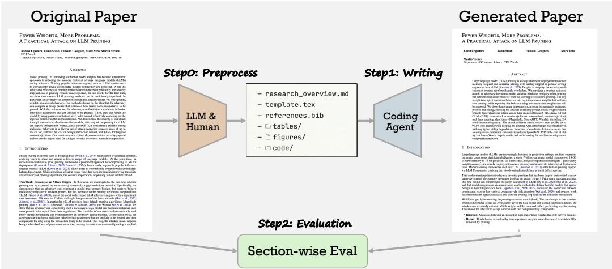
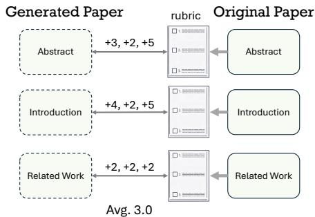
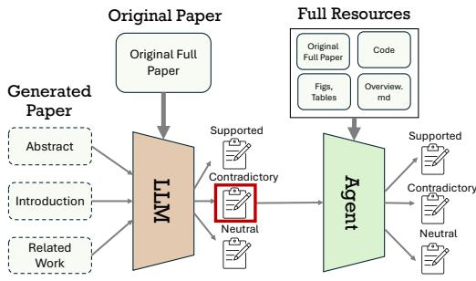
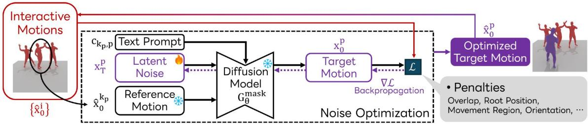
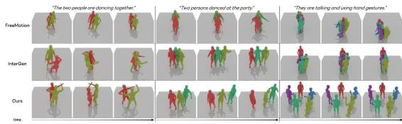
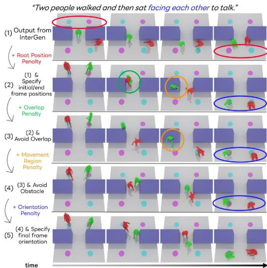
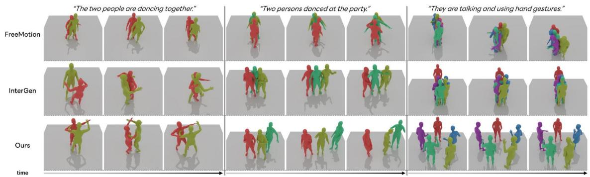
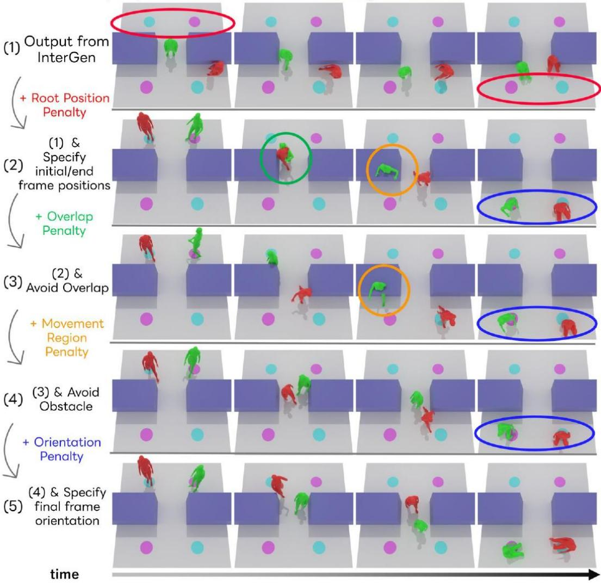
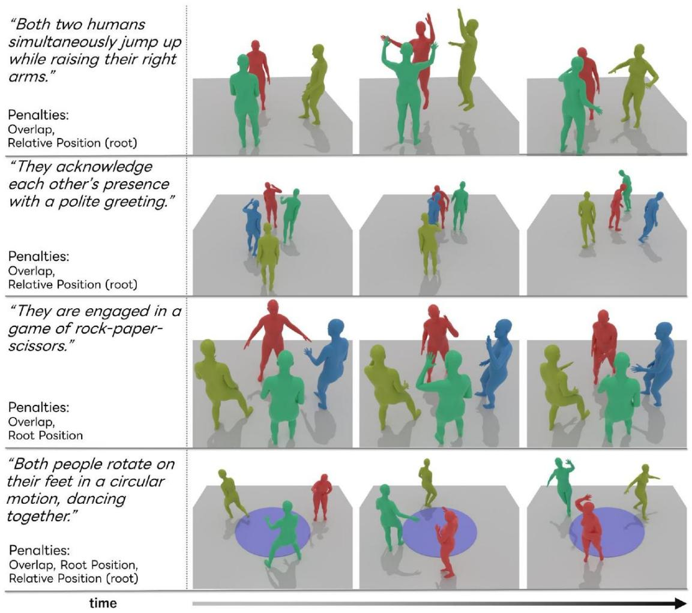

# 论文重构评估：评估人工智能撰写论文中的呈现质量与幻觉现象

宫井敦行　豊岡真朗∗　赵在英∗　渡边健太∗　山崎俊彦　相泽清春

东京大学　https://agent4science-utokyo.github.io/PaperRecon_HP

图1：论文重构评估流程。给定从原始论文中提取的最少资源，一个编码智能体（coding agent）重构出完整论文；随后将生成的论文与原始论文进行比对，沿两个互补维度——呈现质量（Presentation Quality）与幻觉（Hallucination）——评估其写作性能。

# 摘要

本文提出了首个系统性评估框架，用于量化现代编码智能体所撰写论文的质量与潜在风险。尽管人工智能驱动的论文写作已日益引发关注，但对其质量与潜在风险的严谨评估仍十分有限，学界尚未形成对其可靠性的统一认知。我们提出“论文重构评估”（Paper Reconstruction Evaluation，简称 PaperRecon）：该框架首先从一篇现有论文中生成一份概览文件（overview.md），再由智能体基于该概览及少量附加资源（如图表、参考文献文件等）生成完整论文，最后将生成结果与原始论文进行比对。PaperRecon 将对 AI 撰写论文的评估解耦为两个正交维度——“呈现”（Presentation）与“幻觉”（Hallucination）：前者采用评分量表（rubric）进行评估；后者则依托原始论文内容开展基于智能体的评估（agentic evaluation），以精准识别事实性偏差。为支撑评估，我们构建了 PaperWrite-Bench 基准数据集，涵盖 2025 年之后发表于多个顶级会议/期刊的 51 篇论文，覆盖人工智能各主要研究领域。实验结果揭示出明显的权衡关系：尽管 ClaudeCode 与 Codex 均随模型演进而提升，ClaudeCode 在呈现质量上表现更优，但平均每篇论文产生超过 10 处幻觉；而 Codex 幻觉数量更少，却牺牲了呈现质量。本工作迈出了构建 AI 驱动论文写作评估框架的第一步，也为研究社区深入理解其潜在风险提供了基础支撑。

# 1 引言

随着以编码智能体为代表的新兴 AI 工具持续发展，亟需对其在科研流程自动化中所起的作用及其引入的潜在风险展开严格评估，以保障人工智能驱动的科学进步可持续发展（Miyai 等，2026）。尤其值得注意的是，近期已出现多起将 AI 撰写论文提交至学术会议或期刊的事件（Liang 等，2025；ICLR 程序委员会，2025；Neubig，2025）。伴随近年来“AI 科学家”（AI Scientists）的迅猛发展（Intology，2025；Weng 等，2026；Miyai 等，2026），此类投稿预计将持续增加。为在推动科学进步的同时维护学术诚信，研究界亟需基于严谨、可靠的评估方法，持续监测 AI 驱动写作能力的发展进程及其相关风险。

评估 AI 智能体的论文写作能力本身具有内在挑战性，而此前研究对此问题尚未给予充分关注。已有工作尝试利用 AI 审稿人评估论文质量（Liu 等，2024；Yamada 等，2025；Weng 等，2025；Zhu 等，2025）。然而，这些方法存在明显缺陷——它们往往倾向于给伪造程度更严重的论文赋予更高分值（Jiang 等，2025；Miyai 等，2026）。尽管 AI 撰写论文中的幻觉现象已被广泛认知，但既有研究仅局限于表层问题，例如引用错误（Walters & Wilder，2023；Ansari，2026；Sakai 等，2026）或个别幻觉案例（Yamada 等，2025；Miyai 等，2026），尚无法支持系统性评估。

我们提出“论文重构评估”（Paper Reconstruction Evaluation，PaperRecon），这是首个专门用于衡量 AI 智能体论文写作能力的评估框架。PaperRecon 的整体流程如图 1 所示：该框架首先将一篇现有论文压缩为结构化摘要文件 `research_overview.md`，仅保留核心信息；随后，在提供该压缩表示以及其它最少必要资源（如表格、图像、参考文献 `.bib` 文件）的前提下，要求智能体重构出原始论文。这种“从极简输入生成完整论文”的工作流，等价于将当前 AI 科学家系统（Yamada 等，2025；Weng 等，2026；Miyai 等，2026）中的写作模块单独剥离出来进行测试。若智能体能够稳定地重构出高保真度论文，则可作为其写作能力强劲的有力证据。

PaperRecon 作为评估框架的核心优势在于：它可通过与原始论文的直接比对实现精确评估。具体而言，该框架将“写作质量”这一抽象概念解构为两个正交维度——“呈现”（Presentation）与“幻觉”（Hallucination）。“呈现”维度采用评分量表法（rubric evaluation）（Fan 等，2024；Phung 等，2023；Arora 等，2025）进行评估，考察重构论文在多大程度上忠实保留了原始论文的关键要素；“幻觉”维度则通过基于原始论文来源的智能体评估（agentic evaluation）进行判定，从而实现对事实性不一致现象的细粒度检测。该设计使 PaperRecon 能够以统一且可靠的方式，同步评估论文的呈现质量与事实正确性。

为支撑 PaperRecon 框架，我们构建了 PaperWrite-Bench 基准数据集，共包含 51 篇于 2025 年之后发表的论文。PaperWrite-Bench 涵盖多个顶级会议/期刊，包括 NeurIPS、ICLR、CVPR、ICCV、ACL 和 ACMMM，覆盖人工智能各主要研究方向，具备广泛的领域代表性。该基准数据集支持在真实、多样化的科研场景下，对现代论文写作智能体开展系统性与全面性的评估。

我们评估了近期功能强大且被广泛使用的智能体，包括 Claude Code（Anthropic，2025b）、Claude Code Agent Teams（Anthropic，2026）以及 Codex（OpenAI，2025），所覆盖的底层模型范围从 Claude Sonnet 4（Anthropic，2025a）和 Claude Sonnet 4.6（Anthropic，2026）到 GPT-5（OpenAI，2025）及 GPT-5.4（OpenAI，2026）。我们的实验得出以下关键发现：

- 1. Claude Code 的呈现质量高于 Codex。Claude Code 能更准确地捕捉科学写作各章节所需的关键要素。  
- 2. Codex 产生的幻觉（hallucinations）少于 Claude Code。尽管 Claude Code 平均每篇论文产生超过 10 处幻觉，Codex 则将该数值控制在约 3 处。

3. 写作能力随模型演进而提升。这也表明，“论文重构评估”（Paper Reconstruction Evaluation）可作为衡量写作能力进展的一项可靠指标。

本工作为研究社区作出如下贡献：

- • 论文重构评估（PaperRecon）：我们提出了首个面向科学写作的评估框架——“论文重构评估”（Paper Reconstruction Evaluation），用于衡量从压缩表征中重建论文的质量，并配套提供一套详尽的评估协议。  
- • PaperWrite-Bench：我们引入 PaperWrite-Bench 基准数据集，该数据集构建自跨多个研究领域的最新学术论文，支持对智能体仅凭极简信息重建整篇论文能力的全面评估。  
- 呈现质量与幻觉的定量分析：我们系统性地评估了当前主流智能体在“呈现质量”（Presentation）与“幻觉”（Hallucination）两个维度上的表现，并量化其能力随模型演进的变化趋势。我们的结果为理解当前 AI 驱动科学写作的能力现状及其内在权衡提供了重要洞见。

# 2 相关工作

AI 驱动的研究自动化。人工智能的最新进展显著加速了对科研流程各阶段实现自动化的探索（Si 等，2025b；a；Asai 等，2026；Novikov 等，2025；Weng 等，2025；Villaescusa-Navarro 等，2025；Mitchener 等，2025；Zhuang 等，2025；Lin 等，2023；Gottweis 等，2025），以及端到端科研流水线的构建（Lu 等，2024；Intology，2025；Tang 等，2025；Miyai 等，2026）。然而，近期研究强调，随着 AI 科学家能力不断增强，审慎理解其潜在风险正变得日益重要（Miyai 等，2026）。尤其值得注意的是，Miyai 等（2026）指出，风险遍及科研全流程——包括想法生成、实验设计、论文写作与同行评审等环节，并揭示写作阶段尤为容易出现幻觉，例如与实验结果相矛盾的陈述或虚构内容。本文旨在通过一种新颖的评估框架——“论文重构评估”（Paper Reconstruction Evaluation），精准衡量现代智能体的写作能力。

AI 生成文章的评估。AI 生成文章的评估已在科学论文以外的多个领域展开研究（Yang 等，2023；Fitria，2023；Zhong 等，2026；Shao 等，2024）。例如，已有大量前期工作致力于维基百科页面的自动生成（Banerjee & Mitra，2015；Minguillón 等，2017；Liu 等，2018；Fan & Gardent，2022；Shao 等，2024）。此外，Zhong 等（2026）采用真实的 GRE 写作题目，评估 AI 系统撰写议论文的能力。然而，专门针对 AI 驱动科学写作的评估研究仍极为匮乏。这一差异很可能源于科学写作本身的复杂性：它要求合理论证问题的重要性、准确定位自身工作在既有研究图谱中的位置、设计严谨有效的评估方案、确保研究可复现与可验证，并严格维持主张与其支撑证据之间的一致性。这些严苛要求使得早期 AI 系统在科学写作及其评估方面举步维艰，其难度远超维基百科条目或普通议论文写作等任务。

AI 生成论文中的幻觉及其评估。学界普遍认识到，AI 生成的论文常包含幻觉现象。然而，现有研究多局限于表层问题，如引文错误（Walters & Wilder，2023；Ansari，2026；Sakai 等，2026）或个别幻觉案例（Miyai 等，2026），尚缺乏系统性的评估方法。这一局限性主要源于缺乏明确定义的协议来评估生成论文的实质性内容。因此，当前对 AI 生成科学论文的评估大多依赖人工评审式判断，聚焦于论文是否达到学术会议或期刊的录用门槛（Lu 等，2024；Yamada 等，2025；Weng 等，2025；Zhu 等，2025）。但已有研究表明，AI 审稿人往往难以识别幻觉，甚至可能出现幻觉更严重的论文反而获得更高评分的情况（Jiang 等，2025；Miyai 等，2026）。尽管 AI-Researcher（Tang 等，2025）同样基于既有研究成果生成新论文，但其评估重点在于创新性、方法论有效性与实证性能，本质上与写作能力评估存在根本差异。

呈现质量评估（a）量规评估（Rubric Evaluation）

幻觉评估（b）智能体式评估（Agentic Evaluation）  
图 2：“PaperRecon”评估流程总览。本评估沿两个互补维度，将生成论文与真实论文（GT，即原始论文）进行比对：一是基于量规的呈现质量评估，二是基于智能体的幻觉评估。

因此，为准确理解 AI 驱动写作所带来的风险，亟需超越以评审为导向的评估范式，建立一种能直接评估呈现质量与幻觉水平的新型评估协议。

# 3 论文重构评估（Paper Reconstruction Evaluation）

# 3.1 问题定义

论文重构评估（PaperRecon）是一种用于评估编程智能体重建科学论文准确程度的框架。

从每篇原始论文中，我们提取以下信息并提供给智能体：（1）研究概述：一份 Markdown 文件，概括该论文的研究动机、方法及关键实验结果；（2）图表：原始论文中的插图，并配有简化的图注（例如：`fig_method.jpg`：方法概览）；（3）表格：原始论文中表格的 LaTeX 源代码，并配有简化的表注（例如：`table_cb.tex`：主要结果）；（4）参考文献：原始论文的参考文献文件（bibliography），其中每条文献条目均扩充了其摘要内容；（5）代码：与原始论文相关的代码库（若可获取）。

基于上述输入，智能体的任务是重构原始论文。随后，将生成的论文从多个维度与原始论文进行比对，以评估其写作能力。此处我们复用原始参考文献，而非要求智能体从零构建参考文献——因为准确地收集参考文献本身即是一个独立的研究问题。该设计使我们能够隔离并专门评估智能体的核心写作能力。

# 3.2 评估协议

我们通过将生成论文与真实论文（Ground-Truth, GT）在三个互补维度上进行比对来评估其质量：基于评分量表的呈现质量评估（Presentation evaluation with rubric）、智能体幻觉评估（Agentic hallucination evaluation）以及引用层级评估（Citation-level evaluation）。图 2 展示了呈现质量与幻觉评估流程的总体框架。为计算各项得分，我们首先执行章节分类与匹配，再对每一组匹配的章节对进行逐项评估。

# 3.2.1 章节分类与匹配

论文的章节组织方式各异，因此我们首先从真实论文与生成论文的 LaTeX 文件中分别提取全部章节。随后，将这些章节映射至七个常见类别：摘要（Abstract）、引言（Introduction）、方法（Method）、基准构建（Benchmark Construction）、实验（Experiment）、相关工作（Related Work）和结论（Conclusion）。分类过程首先应用基于关键词的规则（例如，“preliminary” → “Method”，“ablation studie” → “Experiment”）；无法通过规则判定的章节则交由大语言模型（LLM）依据章节标题与正文内容进行分类。当多个原始章节被映射至同一类别时，它们将被合并。该分类过程仅执行一次，并在后续所有评估步骤中共享使用。

# 3.2.2 评分量表评估（Rubric Evaluation）

为实现准确且细粒度的评估，我们采用评分量表评估法（Fan 等，2024；Phung 等，2023；Arora 等，2025）。初步实验表明，以大语言模型作为裁判（LLM-as-a-judge）的评估方式判别力较弱，而评分量表评估则能提供更具区分度的评估结果。

针对每篇真实论文，我们预先构建一份评分量表，明确各章节中应包含的关键要素、各要素的相对重要性及其具体描述。每个评分量表要素均对应一个具体且可验证的要点（例如，摘要部分的“问题动机：提升视觉-语言模型的推理能力”，或实验部分的“评估覆盖视觉推理与通用图像理解两类基准”）。这些评分量表最初由大语言模型（即 GPT-5.4（OpenAI，2026））基于真实论文自动生成，随后由作者审阅，并在必要时进行修订，以确保其质量与准确性。

对于除结论（Conclusion）外的每一章节，我们使用搭载 GPT-5.4 的大语言模型裁判，依据 1–5 分制对生成章节覆盖各评分量表要素的程度进行评估：5 分表示内容被完整且准确地描述，细节无误；4 分表示内容基本被描述，核心思想存在但部分细节缺失；3 分表示内容仅被部分描述，存在显著疏漏或表述模糊；2 分表示内容仅被浅层提及，仅有表面性或间接性引用；1 分表示该内容在生成章节中完全缺失。

除基于文本的评分量表要素外，我们还将图表层级的评分纳入整体评估量表之中。

**图表评估**：我们依据真实论文的 LaTeX 源文件对真实图表与生成论文中的图表进行对齐，并评估其上下文适配性。若真实论文与生成论文均在同一章节中引用某张图表，则直接赋予满分 5 分；否则，由大语言模型依据图表是否被置于恰当上下文中进行 1–5 分制评估。若生成论文在任一章节（即使与真实论文所在章节不同）中引用了该图表，则采用大语言模型给出的评分；若该图表在生成论文中完全未被引用，则评分为 1 分。

**表格评估**：我们从真实论文与生成论文的 LaTeX 文件中分别提取表格，并采用分层策略进行匹配：标签匹配（label matching）、图注/表注匹配（caption matching）以及基于大语言模型的语义匹配（LLM-based matching）。对每一对匹配成功的表格，由大语言模型评估其数值准确性、结构一致性与内容一致性，并据此给出 1–5 分制的匹配得分。真实论文中存在但生成论文中缺失的表格，统一评分为 1 分。

每个章节的最终评分量表得分，为其所含全部评分要素（包括文本、图表与表格类要素）得分的平均值。各章节平均包含的评分要素数量如下：摘要（Abstract）：10.3 个；引言（Introduction）：13.3 个；相关工作（Related Work）：12.6 个；方法（Method）：14.2 个；基准构建（Benchmark Construction）：14.6 个；实验（Experiment）：14.3 个。

# 3.2.3 幻觉分析（Hallucination Analysis）

我们通过两阶段、以“主张”（claim）为单位的分析方法识别事实性错误。

**第一阶段：主张提取**。对每个章节（结论章节除外），由大语言模型（即 GPT-5.4）从生成内容中提取所有具体且可验证的主张，并将每个主张归类至以下三类之一：

1. **已支持（Supported）**：该主张直接出现在真实论文中，或可由真实论文内容逻辑推导得出。

- 2. **中立（Neutral）**：该主张未出现在真实论文中，但属于合理的一般性陈述或补充性细节，且不与真实论文内容相矛盾（需注意：未出现在真实论文中并不意味着构成矛盾）；  
- 3. **矛盾（Contradictory）**：该主张与真实论文中的特定信息直接冲突。

对于被归类为“矛盾”的主张，我们进一步赋予其严重性等级：**重大**（例如，数值错误、结果虚构或方法描述错误）或**轻微**（例如，过度泛化的结论、措辞不准确）。

第二阶段：验证。所有在各章节中标记为“矛盾”的主张将被汇总，并由一个编码智能体（即搭载 Sonnet 4.6 的 Claude Code）重新评估。该智能体被提供真实论文（GT paper）的全部资源（包括 LaTeX 源文件、代码库、图表及表格），并逐条复核每个被标记的主张，可能将部分误报（false positives）修正为“支持”或“中立”。该两阶段设计在控制计算开销（仅需单次智能体调用）的同时，显著降低了误报率。

最后，我们报告“支持”、“中立”、“重大矛盾”与“轻微矛盾”四类主张的总数量。

# 3.2.4 引用层级评估

尽管 PaperRecon 的主要目标是评估生成论文的内容质量，我们亦通过 F1 分数指标，对比真实论文（GT）与生成论文之间的引用键（citation keys）来评估引用使用情况。

我们分别从 GT 和生成论文的 LaTeX 文件中提取全部引用键，并基于引用键集合的重叠程度计算精确率（precision）、召回率（recall）与 F1 分数。此外，我们还识别三类引用异常：**幻觉引用**（在生成论文中被引用但未出现在 `references.bib` 中的引用键）、**缺失引用**（存在于 GT 中但未在生成论文中出现的引用键）以及**冗余引用**（由模型预测添加、但未出现在 GT 中的引用键）。

# 3.2.5 综合评估指标

我们报告以下综合指标：（i）**平均评分（Avg. Rubric Score）**：所有被评估章节与要素（含图表项）的评分均值（1–5 分制）；（ii）**幻觉数量（Hallucination Counts）**：经两阶段验证后，在全部章节中检测出的重大矛盾主张总数；（iii）**引用得分（Citation Scores）**：精确率（有效引用数 / 总引用数）、召回率（GT 中的有效引用数 / GT 总引用数）、F1 分数（精确率与召回率的调和平均值）、幻觉引用数（无效引用数量）。

# 4 PaperWrite-Bench

# 4.1 基准概述

本节介绍 PaperWrite-Bench——专为 PaperRecon 设计的评估基准。PaperWrite-Bench 包含由作者人工筛选的 51 篇论文，来源涵盖一系列顶级会议，包括 ACL 2025、EMNLP 2025、CVPR 2025、CVPR 2026、ICCV 2025、ICLR 2025、NeurIPS 2025、ICLR 2026 以及 ACMMM 2025，覆盖计算机视觉、自然语言处理、机器学习与多媒体处理等多个研究领域。在这 51 篇论文中，32 篇聚焦于提出新方法，12 篇引入新基准，另有 7 篇兼具二者贡献。该多样性使我们能够全面评估智能体在不同类型科研论文写作任务中的能力。

先前研究已构建类似基准以支持实验结果复现，例如 Exp-Bench（56 篇论文）（Kon 等，2026）与 PaperBench（20 篇论文）（Starace 等，2025）（Kon 等，2026；Hu 等，2025；Starace 等，2025）。然而，这些基准主要基于约 2024 年发表的论文，未能反映更近期的研究进展。因此，我们从更新近的文献来源中构建 PaperWrite-Bench，以更准确地反映当前先进智能体的实际能力。

<table><tr><td>Agent</td><td>Model</td><td>Abs.</td><td>Intro.</td><td>Rel.</td><td>Meth.</td><td>Bench.</td><td>Exp.</td><td>Avg.</td></tr><tr><td>Codex</td><td>GPT5</td><td>4.00</td><td>3.58</td><td>2.32</td><td>2.89</td><td>3.25</td><td>3.53</td><td>3.26</td></tr><tr><td>Codex</td><td>GPT5.4</td><td>4.06</td><td>3.87</td><td>2.72</td><td>3.51</td><td>3.79</td><td>3.64</td><td>3.59</td></tr><tr><td>ClaudeCode</td><td>Sonnet4</td><td>4.10</td><td>3.88</td><td>2.48</td><td>3.23</td><td>3.63</td><td>3.66</td><td>3.49</td></tr><tr><td>ClaudeCode</td><td>Sonnet4.6</td><td>4.37</td><td>4.12</td><td>3.08</td><td>3.69</td><td>3.84</td><td>4.00</td><td>3.86</td></tr><tr><td>ClaudeCode-Teams</td><td>Sonnet4.6</td><td>4.28</td><td>4.05</td><td>3.07</td><td>3.62</td><td>3.99</td><td>3.97</td><td>3.82</td></tr></table>

表 1：呈现质量评估。各模型在不同章节上的评分量表得分（1–5 分制）。我们观察到，Claude Code 在呈现质量方面优于 Codex。

# 4.2 基准构建流程

`research_overview.md` 文件的构建：针对每篇论文，我们使用 GPT-5（OpenAI，2025）生成一份 `research_overview.md`，概括重建所需的关键信息。为确保质量，作者人工核查该概述是否包含足以忠实重建原始论文的充分信息。平均每份文件含 463 个单词。

表格、图表、参考文献与代码的提取：我们利用 arXiv 源文件提取表格与图表，并分别存入 `tables/` 与 `figures/` 专用目录。沿用先前工作（Liu 等，2024）的做法，我们通过 `table_summary.txt` 与 `figure_summary.txt` 向智能体提供结构化参考信息，其中包含文件路径及简要描述（例如原始图注的第一行）。为确保参考文献被恰当使用，我们借助 Semantic Scholar API 为 `.bib` 文件中的每条条目补充摘要。此外，若论文附带可用的代码库，我们也一并纳入，以支持所提方法的准确重建。当代码库中的 `README.md` 文件包含摘要或引言等章节时，这些部分由人工移除。

模板与样式文件的构建：我们从 arXiv 源文件中提取每篇原始论文的章节结构，并据此创建 `template.tex` 及配套样式文件。`template.tex` 仅保留原始论文的章节结构，即完全复现其各级标题，但内容为空。智能体被明确要求依据该预定义结构生成论文。该设计源于如下观察：不同论文的章节组织差异显著，直接比对生成论文与原始论文难度较大；通过固定章节结构，可实现更精准、更一致的评估。此外，由于定义章节结构仅为简单的预处理步骤，该流程具备良好实用性，仅需在智能体执行写作任务前进行极少的人工干预。

# 5 实验

# 5.1 实验设置

智能体配置：我们评估三类编码智能体：Claude Code（Anthropic，2025b）（单智能体）、Codex（OpenAI，2025）（单智能体）与 Claude Agent Teams（Anthropic，2026）（多智能体）。Claude Code 分别采用 Sonnet 4（Anthropic，2025a）与 Sonnet 4.6（Anthropic，2026）进行评估；Codex 分别采用 GPT-5（OpenAI，2025）与 GPT-5.4（OpenAI，2026）；Claude Agent Teams 则统一采用 Sonnet 4.6。综上，共形成五种智能体配置。

写作流程。本研究旨在理解当前智能体在简单设定下执行科学写作的能力水平，以及该过程中可能引发的风险。因此，我们采用了一种刻意简化的写作流程。该流程包含一个编译反馈循环：LaTeX 编译错误会被返回给智能体以供修正；此外，还引入了一个页数限制调整步骤，该步骤参考了 Liu 等（2024）及 Yamada 等（2025）的方法。

<table><tr><td>Agent</td><td>Model</td><td>Abs.</td><td>Intro.</td><td>Rel.</td><td>Meth.</td><td>Bench.</td><td>Exp.</td><td>Total</td></tr><tr><td>Codex</td><td>GPT5</td><td>0.3</td><td>0.6</td><td>0.3</td><td>3.8</td><td>1.9</td><td>3.4</td><td>10.2</td></tr><tr><td>Codex</td><td>GPT5.4</td><td>0.1</td><td>0.3</td><td>0.2</td><td>1.3</td><td>0.2</td><td>0.9</td><td>3.0</td></tr><tr><td>ClaudeCode</td><td>Sonnet4</td><td>0.2</td><td>0.5</td><td>0.5</td><td>5.4</td><td>0.8</td><td>4.7</td><td>12.0</td></tr><tr><td>ClaudeCode</td><td>Sonnet4.6</td><td>0.2</td><td>0.8</td><td>0.6</td><td>4.7</td><td>0.5</td><td>3.6</td><td>10.4</td></tr><tr><td>ClaudeCode-Teams</td><td>Sonnet4.6</td><td>0.3</td><td>0.6</td><td>0.8</td><td>3.9</td><td>0.5</td><td>3.8</td><td>9.8</td></tr></table>

表 2：幻觉评估结果。各项分数表示每篇论文在各章节中平均出现的幻觉数量。我们观察到，Codex 产生的幻觉少于 Claude Code。

<table><tr><td>Agent</td><td>Model</td><td>Prec.</td><td>Recall</td><td>F1</td><td>Hal.</td></tr><tr><td>Codex</td><td>GPT5</td><td>0.89</td><td>0.27</td><td>0.39</td><td>0.0</td></tr><tr><td>Codex</td><td>GPT5.4</td><td>0.86</td><td>0.43</td><td>0.56</td><td>0.0</td></tr><tr><td>ClaudeCode</td><td>Sonnet4</td><td>0.75</td><td>0.24</td><td>0.34</td><td>3.5</td></tr><tr><td>ClaudeCode</td><td>Sonnet4.6</td><td>0.83</td><td>0.58</td><td>0.67</td><td>0.2</td></tr><tr><td>ClaudeCode-Teams</td><td>Sonnet4.6</td><td>0.84</td><td>0.56</td><td>0.66</td><td>0.2</td></tr></table>

表 3：引用评估得分。

# 5.2 主要结果

我们在表 1 中报告了基于评分标准（rubric）的呈现质量评估得分。在幻觉评估方面，我们在表 2 中报告了每篇论文各章节中被判定为“重大矛盾性主张”（major contradictory）的幻觉平均数量。表 3 展示了引用评估结果。

我们将在下方总结关键发现。

- [F1] Claude Code 在呈现质量上优于 Codex。如表 1 所示，Claude Code 在所有章节中均持续获得高于 Codex 的呈现得分，表明其在捕捉与清晰表达核心科学观点方面具备更强能力。然而，表现最优的智能体——即采用 Claude Sonnet 4.6 作为底层大语言模型的 Claude Code——其得分为 3.86，说明仍有显著提升空间。  
- [F2] Claude Code 表现出明显更多的幻觉，而 Codex 则大幅降低了幻觉发生率。表 2 报告了各章节中每篇论文的平均幻觉数量。我们观察到鲜明对比：尽管 Claude Code 实现了更高的呈现质量，但其产生的幻觉数量却极为可观，即便使用 Claude Sonnet 4.6，每篇论文的幻觉仍超过 10 个；相比之下，采用 GPT-5.4（OpenAI，2026）可将幻觉数量降至每篇约 3 个。这些结果揭示了呈现质量与幻觉之间存在明确的权衡关系，凸显出同时评估这两个维度对于准确衡量模型性能的重要性。  
- [F3] Codex 产生的引用类幻觉少于 Claude Code。表 3 报告了引用准确性评估结果。与 [F2] 一致，尽管 Claude 在引用 F1 得分上更高，Codex 却显著减少了虚构或错误引用的数量。这再次印证了引用覆盖广度与事实可靠性之间的权衡关系。  
- [F4] 写作能力随模型演进而提升。我们的评估框架能准确捕捉模型改进所带来的性能增益。我们观察到，从 Claude Sonnet 4（Anthropic，2025a）到 Claude Sonnet 4.6（Anthropic，2026），以及从 GPT-5（OpenAI，2025）到 GPT-5.4（OpenAI，2026），写作质量均呈现稳定提升趋势，表明 PaperRecon 能有效追踪写作能力的发展进程。

# 5.3 人工验证

呈现质量验证。为验证所提出评估框架的可靠性，我们基于 72 对生成论文开展了人工相关性分析。这些论文对

<table><tr><td rowspan="2">Overview</td><td colspan="2">Rubric Eval↑</td><td colspan="2">Hallucination↓</td></tr><tr><td>Default</td><td>Long</td><td>Default</td><td>Long</td></tr><tr><td>Sonnet4</td><td>3.49</td><td>3.64</td><td>8.8</td><td>5.8</td></tr><tr><td>Sonnet4.6</td><td>3.83</td><td>4.17</td><td>9.8</td><td>2.3</td></tr></table>

表 4：研究概述长度的影响。比较默认长度与长版本研究概述作为写作智能体输入时的效果。各项得分取自 12 篇论文的平均值。

<table><tr><td>Conf.</td><td># Papers</td><td>Rubric↑</td><td>Hal.↓</td></tr><tr><td>ML</td><td>21</td><td>3.58</td><td>8.3</td></tr><tr><td>CV</td><td>21</td><td>3.63</td><td>10.1</td></tr><tr><td>MM</td><td>5</td><td>3.47</td><td>10.7</td></tr><tr><td>NLP</td><td>4</td><td>3.77</td><td>6.0</td></tr></table>

表 5：按论文类型划分的分析结果。评估结果按会议类型分组呈现。

由 12 篇源论文构建而成，每篇源论文均通过四种智能体配置（即 Claude Code 与 Codex 各搭配两种底层大语言模型）进行重构，从而形成每篇源论文对应的六种两两组合。我们招募了三位曾在顶级会议担任审稿人的专家作为人工评审员，每位评审员对全部 24 对论文分别给出“胜出、平局或落败”的成对判断。随后，我们计算了这些人工判断结果与基于评分标准所得排名之间的 Kendall’s $\tau _ { b }$ 相关系数。结果显示二者具有强且高度显著的相关性（$\tau _ { b } = 0 . 5 7 8$, $p < 0 . 0 0 1 ^ { \cdot }$），表明基于评分标准的评估结果与领域专家的人工判断高度一致。我们也观察到评分标准得分与人工偏好之间存在若干差异，此类差异往往源于评审员的主观倾向，例如更偏好简洁表述而非详尽阐释。上述发现表明，我们的评估框架既能提供一致且高质量的评分，又能缓解人工评估中固有的主观偏差。

幻觉验证。在幻觉验证环节，我们聚焦于精度（precision）的测量，即核实被归类为“重大矛盾性主张”的陈述是否确实错误。全面识别所有幻觉在人力上成本过高；因此，仅评估精度已足以支撑不同模型间的可靠比较。由于该任务本质上属于事实核查（fact-checking），验证工作由作者手动完成。我们从评估数据中提取了 GPT-5、GPT-5.4 及 Sonnet-4.6 论文中被标注为“重大矛盾性”的共 97 个实例，并逐一进行人工核查。结果表明，其中 $96\%$ 确实对应真实的逻辑矛盾或凭空捏造内容。该结果说明，本方法所检测出的幻觉极大概率确为真实幻觉。

# 5.4 进一步分析

研究概述长度的影响。我们通过对比默认长度与长版本的研究概述，探究研究概述的颗粒度（granularity）对重构质量的影响。默认概述提供高层级摘要（平均 463 词），而长版本概述则包含更为详尽的方法论与实验设计描述（平均 1492 词）。每个示例详见附录 B.1。表 4 展示了相应结果。与直观预期一致，更详尽的研究概述带来了更高的呈现得分与更少的幻觉。这也表明，我们的评估指标能够准确反映论文的质量。

按会议类型划分的性能表现。表5展示了不同会议类型下的模型性能。尽管各会议收录论文数量存在差异，但我们观察到自然语言处理（NLP）类会议的论文在评估中取得了最高性能。为探究其成因，我们审阅了原始论文，发现NLP领域的论文更倾向于以研究发现为核心展开论述，相较于其他学科，其数学推导与方法描述通常更为简洁、复杂度较低。因此，我们认为，最终有必要针对不同研究领域分别评估写作能力的发展水平。

# 6 结论、局限性与未来工作

本研究提出了“论文重构评估”（Paper Reconstruction Evaluation），这是首个面向AI生成科学论文的系统性评估框架。结合论文写作基准测试集 PaperWrite-Bench，我们对当前主流写作智能体的能力与潜在风险开展了全面评估。下文将讨论本方法的局限性，并指出未来工作的若干方向。

受控输入假设。本框架向智能体提供结构化资源，包括图表、表格及参考文献等。该设计减少了对外部依赖（如信息检索与文献搜集）的需求，使我们得以聚焦于核心写作能力的评估。在资源更为受限的条件下（例如模型需依赖外部系统获取信息）开展写作性能评估，是未来一项重要研究方向。

对多样化写作风格覆盖不足。科学论文的评估本身具有内在挑战性，因为人类写作风格丰富多元，而当前大语言模型尚无法完全复现这种多样性。因此，按章节进行的分项评估可能无法充分反映论文的整体质量。开发更具鲁棒性的评估方法，仍是未来亟需推进的重要方向。

# 伦理声明

本研究通过受控评估框架，系统考察人工智能驱动科学写作的能力边界与潜在风险。尽管本方法可实现对论文呈现质量与幻觉现象的系统性评估，但也凸显出先进AI系统可能生成看似合理实则具有误导性的科学内容这一隐患。

一项关键伦理关切在于：此类系统可能被滥用于生成伪造或低质量的研究论文，从而规避常规同行评审流程。我们的研究结果——尤其是呈现质量与幻觉程度之间存在的权衡关系——进一步印证了构建稳健评估方法与防范不可靠AI生成内容之安全机制的紧迫性与必要性。

# 作者贡献声明

宫井敦行（Atsuyuki Miyai）担任本项目的总负责人与整体统筹者，全面主导了从“PaperRecon”构想提出、方案实施到论文撰写的全过程。

户冈真史郎（Mashiro Toyooka）主要负责系统实现工作，与宫井敦行合作完成了面向智能体写作的核心代码库及评估框架的开发。

赵在英（Zaiying Zhao）实现了图表评估子系统，并参与了论文撰写工作。

渡边健太（Kenta Watanabe）细致审阅了包括 overview.md 在内的各类文档，确保其完整性，并提出了“引用得分”（Citation Score）的设计构想。

山崎俊彦（Toshihiko Yamasaki）主要承担管理协调职责，定期为项目提供宝贵建议。

相泽清春（Kiyoharu Aizawa）全程为项目提供了持续且关键性的指导，并给予了不可或缺的资源支持，对本项目的顺利实施起到了决定性作用。

# 致谢

我们衷心感谢于青、小杉聪与白敬勋对所生成论文的审阅。本研究部分得到日本学术振兴会（JSPS）科研费资助项目（编号：25H01164）以及日本科学技术振兴机构（JST）BOOST计划（资助编号：JPMJBS2418）的支持。

# 参考文献

Samar Ansari. 精英同行评审中的复合型欺骗：NeurIPS 2025 中100条伪造引文的失效模式分类学。arXiv 预印本 arXiv:2602.05930，2026。

Anthropic. 系统说明卡：Claude Opus 4 与 Claude Sonnet 4。技术报告，Anthropic，2025a。URL https://www-cdn.anthropic.com/ 6d8a8055020700718b0c49369f60816ba2a7c285.pdf。访问日期：2025-09-14。

- Anthropic. *Claude Code*. 技术报告，Anthropic，2025b。URL https://www.anthropic.com/claude。访问日期：2026年3月14日。  
- Anthropic. *Claude Sonnet 4.6*. 技术报告，Anthropic，2026年。URL https://www.anthropic.com/claude/sonnet。访问日期：2026年3月14日。  
- Anthropic. *Claude Code Agent Teams*，2026年。URL https://code.claude.com/docs/en/agent-teams。访问日期：2026年3月30日。  
- Rahul K Arora、Jason Wei、Rebecca Soskin Hicks、Preston Bowman、Joaquin Quiñonero-Candela、Foivos Tsimpourlas、Michael Sharman、Meghan Shah、Andrea Vallone、Alex Beutel 等。*Healthbench：面向提升人类健康的大语言模型评估*。arXiv 预印本 arXiv:2505.08775，2025年。  
- Akari Asai、Jacqueline He、Rulin Shao、Weijia Shi、Amanpreet Singh、Joseph Chee Chang、Kyle Lo、Luca Soldaini、Sergey Feldman、Mike D’arcy 等。*利用检索增强型语言模型综合科学文献*。《自然》（*Nature*），2026年。ISSN 1476-4687。  
- Siddhartha Banerjee 和 Prasenjit Mitra。*WikiKreator：自动改进维基百科条目草稿*。载于 ACL 会议论文集，2015年。  
- Angela Fan 和 Claire Gardent。*维基百科人物传记的生成：性别偏见对基于检索的女性传记生成之影响*。载于 ACL 会议论文集，2022年。  
- Zhiyuan Fan、Weinong Wang、Debing Zhang 等。*Sedareval：基于自适应评分标准的自动化评估*。载于 EMNLP 2024 会议论文集（Findings of EMNLP 2024），2024年。  
- Tira Nur Fitria。*OpenAI ChatGPT 应用中的人工智能（AI）技术：ChatGPT 在英语议论文写作中的应用综述*。载于《ELT Forum：英语教学期刊》（*ELT Forum: Journal of English Language Teaching*），第12卷，第44–58页，2023年。  
- Juraj Gottweis、Wei-Hung Weng、Alexander Daryin、Tao Tu、Anil Palepu、Petar Sirkovic、Artiom Myaskovsky、Felix Weissenberger、Keran Rong、Ryutaro Tanno 等。*迈向人工智能协同科学家*。arXiv 预印本 arXiv:2502.18864，2025年。  
- Chuxuan Hu、Liyun Zhang、Yeji Lim、Aum Wadhwani、Austin Peters 和 Daniel Kang。*Repro-Bench：具身式 AI 系统能否评估社会科学研究所具有的可复现性？* 载于《计算语言学协会会议论文集（ACL 2025）》（Findings of the Association for Computational Linguistics: ACL 2025），第23616–23626页，2025年。  
- ICLR 程序主席团。*ICLR 2026 关于大语言模型生成论文与评审意见的回应*。https://blog.iclr.cc/2025/11/19/iclr-2026-response-to-llm-generated-papers-and-reviews/，2025年。访问日期：2026年3月30日。  
- Intology。*Zochi 技术报告*，2025年。URL https://www.intology.ai/blog/zochi-tech-report。访问日期：2025年10月17日。  
- Fengqing Jiang、Yichen Feng、Yuetai Li、Luyao Niu、Basel Alomair 和 Radha Poovendran。*BadScientist：研究型智能体能否撰写看似可信但逻辑有缺陷的论文，并以此欺骗大语言模型评审者？* arXiv 预印本 arXiv:2510.18003，2025年。  
- Patrick Tser Jern Kon、Jiachen Liu、Xinyi Zhu、Qiuyi Ding、Jingjia Peng、Jiarong Xing、Yibo Huang、Yiming Qiu、Jayanth Srinivasa、Myungjin Lee 等。*Exp-Bench：AI 能否开展 AI 领域的研究实验？* 载于 ICLR 会议论文集，2026年。  
- Weixin Liang、Yaohui Zhang、Zhengxuan Wu、Haley Lepp、Wenlong Ji、Xuandong Zhao、Hancheng Cao、Sheng Liu、Siyu He、Zhi Huang 等。*量化大语言模型在学术论文中的使用情况*。《自然·人类行为》（*Nature Human Behaviour*），第1–11页，2025年。  
- Jialiang Lin、Jiaxin Song、Zhangping Zhou、Yidong Chen 和 Xiaodong Shi。*学术论文的自动化评审：概念、技术与挑战*。《信息融合》（*Information Fusion*），第98卷，编号101830，2023年。ISSN 1566-2535。DOI: 10.1016/j.inffus.2023.101830。URL https://doi.org/10.1016/j.inffus.2023.101830。在线发表日期：2023年5月12日。

- 彼得·J·刘（Peter J. Liu）、穆罕默德·萨利赫（Mohammad Saleh）、埃蒂安·波特（Etienne Pot）、本·古德里奇（Ben Goodrich）、瑞安·塞帕西（Ryan Sepassi）、卢卡什·凯撒（Lukasz Kaiser）和诺姆·沙泽尔（Noam Shazeer）。《通过摘要长序列生成维基百科文章》。载于《国际学习表征会议》（ICLR），2018年。  
- 刘志涵（Zhihan Liu）、柴宇博（Yubo Chai）和李建峰（Jianfeng Li）。《迈向由大语言模型驱动的完全自主科研：以仿真研究为案例》。arXiv 预印本 arXiv:2408.15512，2024年。  
- 克里斯·陆（Chris Lu）、丛陆（Cong Lu）、罗伯特·特亚尔科·兰格（Robert Tjarko Lange）、雅各布·福斯特（Jakob Foerster）、杰夫·克鲁恩（Jeff Clune）和大卫·哈（David Ha）。《AI科学家：迈向全自动、开放式的科学发现》。arXiv 预印本 arXiv:2408.06292，2024年。  
- 朱莉娅·明吉永（Julià Minguillón）、莫拉·勒尔加（Maura Lerga）、爱德华·艾巴尔（Eduard Aibar）、何塞普·利亚多斯-马略伦斯（Josep Lladós-Masllorens）和安东尼·梅塞格耶尔-阿托拉（Antoni Meseguer-Artola）。《科技类维基百科文章语料库的半自动生成》。《信息专业人员》（Profesional de la Información），26(5):995–1005，2017年。  
- 卢多维科·米琴纳（Ludovico Mitchener）、安吉拉·杨（Angela Yiu）、本杰明·张（Benjamin Chang）、马修·布尔登克斯（Mathieu Bourdenx）、泰勒·纳多尔斯基（Tyler Nadolski）、阿尔维斯·苏洛瓦里（Arvis Sulovari）、埃里克·C·兰兹内斯（Eric C Landsness）、丹尼尔·L·巴拉巴西（Daniel L Barabasi）、悉达多·纳拉亚南（Siddharth Narayanan）、尼克·埃文斯（Nicky Evans）等。《KOSMOS：面向自主发现的AI科学家》。arXiv 预印本 arXiv:2511.02824，2025年。  
- 宫内敦行（Atsuyuki Miyai）、丰冈真史郎（Mashiro Toyooka）、音成隆（Takashi Otonari）、赵在英（Zaiying Zhao）和相泽清治（Kiyoharu Aizawa） Jr.。《JR AI科学家及其风险报告：从一篇基准论文出发的自主科学探索》。《机器学习研究汇刊》（TMLR），2026年。  
- 格雷厄姆·纽比格（Graham Neubig）。X平台发帖。https://x.com/gneubig/status/1989681438577336401，2025年。访问日期：2026年3月16日。  
- 亚历山大·诺维科夫（Alexander Novikov）、阮银（Ngân Vu）、马文·艾森贝格尔（Marvin Eisenberger）、埃米尔ien·杜邦（Emilien Dupont）、朴昇勋（Po-Sen Huang）、亚当·佐尔特·瓦格纳（Adam Zsolt Wagner）、谢尔盖·希罗博科夫（Sergey Shirobokov）、鲍里斯拉夫·科兹洛夫斯基（Borislav Kozlovskii）、弗朗西斯科·J·R·鲁伊斯（Francisco JR Ruiz）、阿巴斯·梅赫拉比安（Abbas Mehrabian）等。《AlphaEvolve：面向科学与算法发现的编程智能体》。arXiv 预印本 arXiv:2506.13131，2025年。  
- OpenAI。《GPT-5 系统说明卡》。技术报告，OpenAI，2025年。URL https://cdn.openai.com/gpt-5-system-card.pdf。访问日期：2025年9月14日。  
- OpenAI。《Codex》，2025年。URL https://openai.com/codex/。访问日期：2026年3月30日。  
- OpenAI。《发布 GPT-5.4》。2026年3月。URL https://openai.com/index/introducing-gpt-5-4/。访问日期：2026年3月25日。  
- 太田朔也（Sakuya Ota）、于青（Qing Yu）、藤原健斗（Kent Fujiwara）、池畑聪（Satoshi Ikehata）和佐藤郁朗（Ikuro Sato）。《PINO：面向任意规模群体的长时程、可定制动作生成中的人际交互噪声优化》。载于《IEEE/CVF 国际计算机视觉会议论文集》（Proceedings of the IEEE/CVF International Conference on Computer Vision），第10676–10685页，2025年。  
- 董通（Tung Phung）、维克多-亚历山德鲁·帕杜雷安（Victor-Alexandru Pădurean）、何塞·坎布罗内罗（José Cambronero）、苏米特·古尔瓦尼（Sumit Gulwani）、托比亚斯·科恩（Tobias Kohn）、鲁帕克·马朱姆达尔（Rupak Majumdar）、阿迪什·辛格拉（Adish Singla）和古斯塔沃·索阿雷斯（Gustavo Soares）。《生成式人工智能在编程教育中的应用：对 ChatGPT、GPT-4 与人类导师的基准评测》。载于《计算机教育国际会议》（ICER），2023年。  
- 酒井悠介（Yusuke Sakai）、上北秀贵（Hidetaka Kamigaito）和渡边太郎（Taro Watanabe）。《幻觉引用问题不容忽视：借助 ACL 会议中 300 篇伪造论文揭示幻觉参考文献的影响》。arXiv 预印本 arXiv:2601.18724，2026年。  
- 邵一轩（Yijia Shao）、蒋宇澄（Yucheng Jiang）、西奥多·卡内尔（Theodore Kanell）、徐鹏（Peter Xu）、奥马尔·卡塔布（Omar Khattab）和莫妮卡·林（Monica Lam）。《利用大语言模型从零开始辅助撰写类维基百科文章》。载于《北美计算语言学协会年会》（NAACL），2024年。  
- 司成磊（Chenglei Si）、桥本达纪（Tatsunori Hashimoto）和杨笛仪（Diyi Yang）。《构想—执行鸿沟：大语言模型生成的研究构想与人类研究构想在执行结果上的差异》。arXiv 预印本 arXiv:2506.20803，2025a。  
- 司成磊（Chenglei Si）、杨笛仪（Diyi Yang）和桥本达纪（Tatsunori Hashimoto）。《大语言模型能否生成新颖的研究构想？一项涵盖 $100+$ 名自然语言处理领域研究人员的大规模人类实证研究》。载于《国际学习表征会议》（ICLR），2025b。

- 朱利奥·斯塔拉切（Giulio Starace）、奥利弗·贾菲（Oliver Jaffe）、戴恩·舍伯恩（Dane Sherburn）、詹姆斯·昂（James Aung）、陈俊申（Jun Shern Chan）、莱昂·马克辛（Leon Maksin）、瑞秋·迪亚斯（Rachel Dias）、埃文·梅斯（Evan Mays）、本杰明·金塞拉（Benjamin Kinsella）、怀亚特·汤普森（Wyatt Thompson）等。《PaperBench：评估人工智能复现人工智能研究的能力》。载于《国际机器学习大会》（ICML），2025年。  
- 汤佳斌（Jiabin Tang）、夏亮豪（Lianghao Xia）、李忠航（Zhonghang Li）和黄超（Chao Huang）。《AI-Researcher：自主科学创新》。载于《神经信息处理系统大会》（NeurIPS），2025年。  
- 弗朗西斯科·维拉埃斯库萨-纳瓦罗（Francisco Villaescusa-Navarro）、鲍里斯·博利耶（Boris Bolliet）、巴勃罗·比利亚努埃瓦-多明戈（Pablo Villanueva-Domingo）、阿德里安·E·拜尔（Adrian E Bayer）、艾丹·阿夸（Aidan Acquah）、切塔纳·阿曼查拉（Chetana Amancharla）、阿尔莫格·巴尔齐莱-西格阿尔（Almog Barzilay-Siegal）、巴勃罗·贝尔梅霍（Pablo Bermejo）、卡米尔·比洛多（Camille Bilodeau）、巴勃罗·卡尔德纳斯·拉米雷斯（Pablo Cárdenas Ramírez）等。《Denario项目：面向科学发现的深度知识AI智能体》。arXiv 预印本 arXiv:2510.26887，2025年。  
- 威廉·H·沃尔特斯（William H Walters）和埃丝特·伊莎贝尔·怀尔德（Esther Isabelle Wilder）。《ChatGPT生成的参考文献中存在的伪造与错误》。《科学报告》（Scientific Reports），13(1):14045，2023年。  
- 翁艺璇（Yixuan Weng）、朱敏君（Minjun Zhu）、包光升（Guangsheng Bao）、张宏波（Hongbo Zhang）、王晋东（Jindong Wang）、张岳（Yue Zhang）和杨林毅（Linyi Yang）。《CycleResearcher：通过自动化综述提升自动化科研质量》。载于《国际学习表征会议》（ICLR），2025年。  
- 翁艺璇（Yixuan Weng）、朱敏君（Minjun Zhu）、谢秋杰（Qiujie Xie）、孙启瑶（Qiyao Sun）、林震（Zhen Lin）、刘思帆（Sifan Liu）和张岳（Yue Zhang）。《DeepScientist：渐进式推动前沿科学发现》。载于《国际学习表征会议》（ICLR），2026年。  
- 山田裕太郎（Yutaro Yamada）、罗伯特·特亚尔科·兰格（Robert Tjarko Lange）、丛陆（Cong Lu）、胡胜然（Shengran Hu）、克里斯·陆（Chris Lu）、雅各布·福斯特（Jakob Foerster）、杰夫·克鲁恩（Jeff Clune）和大卫·哈（David Ha）。《AI科学家-V2：基于智能体树搜索的研讨会级自动化科学发现》。arXiv 预印本 arXiv:2504.08066，2025年。  
- 杨景康（Jingkang Yang）、刘帅（Shuai Liu）、郭宏明（Hongming Guo）、董宇浩（Yuhao Dong）、张宪萌威（Xiamengwei Zhang）、张世成（Sicheng Zhang）、王鹏云（Pengyun Wang）、周子棠（Zitang Zhou）、谢彬竹（Binzhu Xie）、王子越（Ziyue Wang）等。《EgoLife：迈向以自我为中心的生活助手》。载于《计算机视觉与模式识别会议》（CVPR），2025年。  
- 杨凯文（Kevin Yang）、丹·克莱因（Dan Klein）、彭南云（Nanyun Peng）和田渊栋（Yuandong Tian）。《DOC：通过细粒度提纲控制提升长篇故事连贯性》。载于《计算语言学协会年会》（ACL），2023年。  
- 钟阳（Yang Zhong）、郝江港（Jiangang Hao）、迈克尔·福斯（Michael Fauss）、李晨（Chen Li）和王源（Yuan Wang）。《人工智能生成的论文：其特征及对自动评分与学术诚信的影响》。《教育测量：问题与实践》（Educational Measurement: Issues and Practice），45(1):e70013，2026年。  
- 朱敏君（Minjun Zhu）、翁艺璇（Yixuan Weng）、杨林毅（Linyi Yang）和张岳（Yue Zhang）。《DeepReview：通过类人深度思维过程改进基于大语言模型的论文评审》。载于《计算语言学协会年会》（ACL），2025年。  
- 庄振振（Zhenzhen Zhuang）、陈建东（Jiandong Chen）、徐宏峰（Hongfeng Xu）、姜宇文（Yuwen Jiang）和林家亮（Jialiang Lin）。《面向自动化学术论文评审的大语言模型：一项综述》。《信息融合》（Inf. Fusion），124(C)，2025年12月。ISSN 1566-2535。DOI: 10.1016/j.inffus.2025.103332。URL https://doi.org/10.1016/j.inffus.2025.103332。

# 附录

# A PaperWrite-Bench

# A.1 PaperWrite-Bench 数据来源的统计信息

表 A 展示了 PaperWrite-Bench 所涵盖会议的统计信息。如表所示，机器学习（ML）与计算机视觉（CV）类会议占据主导地位，其次为多媒体与自然语言处理（NLP）类会议。

<table><tr><td>Area</td><td>Conference</td><td># Papers</td><td>Subtotal</td></tr><tr><td rowspan="5">ML</td><td>ICLR26</td><td>7</td><td rowspan="5">21</td></tr><tr><td>NeurIPS25</td><td>6</td></tr><tr><td>ICLR25</td><td>4</td></tr><tr><td>ICML25</td><td>2</td></tr><tr><td>AAAI25</td><td>2</td></tr><tr><td rowspan="3">CV</td><td>CVPR25</td><td>16</td><td rowspan="3">21</td></tr><tr><td>ICCV25</td><td>3</td></tr><tr><td>CVPR26</td><td>2</td></tr><tr><td>Multimedia</td><td>ACMMM25</td><td>5</td><td>5</td></tr><tr><td rowspan="2">NLP</td><td>ACL25</td><td>3</td><td rowspan="2">4</td></tr><tr><td>NAACL25</td><td>1</td></tr><tr><td>Total</td><td></td><td>51</td><td>51</td></tr></table>

表 A：按研究领域划分的论文分布。

<table><tr><td>Section</td><td>Evaluation Point</td></tr><tr><td>Abstract</td><td>Project goal: egocentric life assistant with wearable AI glasses
The abstract must state the overarching objective of EgoLife: building an AI-powered egocentric life assistant that accompanies users and improves personal efficiency through wearable glasses.</td></tr><tr><td>Introduction</td><td>Vision and motivation for life-oriented egocentric AI assistance
The introduction should open with a motivating vision of an AI assistant embedded in daily life that provides personalized, long-term assistance.</td></tr><tr><td>Related Work</td><td>Positioning within egocentric dataset evolution
The section should situate EgoLife in the broader history of egocentric vision datasets, starting from early foundational collections.</td></tr><tr><td>Benchmark Construction</td><td>Seven-day multimodal data collection in EgoHouse with six participants
The section must state that the benchmark is built from a week-long recording of six volunteers living in a custom environment with multimodal sensing.</td></tr><tr><td>Method</td><td>Overall EgoButler architecture with two subsystems
The method section must explain EgoButler with its two subsystems: EgoGPT for continuous clip captioning and EgoRAG for retrieval-augmented QA.</td></tr><tr><td>Experiment</td><td>Main benchmark comparison outcome
The section should present the unified comparison protocol via EgoButler and the main benchmark comparison outcome.</td></tr></table>

表 B：各章节代表性评分细则要点（重要性：高）。以基准构建论文 *EgoLife*（Yang 等，2025，CVPR 2025）为具体示例予以展示。

# A.2 评分细则示例

表 B 展示了各章节的部分示例性评分细则。所依据的基础论文为 *EgoLife*（Yang 等，2025）。

# B 详细提示词

# B.1 `research_overview.md` 文件示例

`research_overview_default.md`（*EgoLife*）

# *EgoLife*：研究概览

## 标题

**EgoLife：迈向以自我为中心的生活助手**

--## 1. 研究动机

现有以自我为中心的数据集与基准测试仅涵盖短暂、单人参与的活动，未能捕捉真实生活辅助所需的持续一周、涉及多人的社会动态。该领域亟需一个长时程、多模态、人际交互型数据集，以及一种具备超长上下文推理能力的方法。

## 2. 核心洞见

一名生活助手必须融合以自我为中心的视听线索与长时程记忆，以回答实际、个性化的提问。

**核心思想**：将全模态视频片段理解与针对持续一周的以自我为中心录制内容的分层检索机制相结合。

## 3. 基准设计：*EgoLifeQA*

*EgoLifeQA* 是基于 266 小时 *EgoLife* 数据集（含 6 名参与者、为期 7 天）构建的多项选择题问答基准，重点评估超长时程推理能力。其涵盖五类任务：实体日志（EntityLog）、事件回溯（EventRecall）、习惯洞察（HabitInsight）、关系图谱（RelationMap）与任务统筹（TaskMaster），共计 3,000 道问答题。每道问答题均附有“证书长度”（即所需回溯时间跨度），其中 2,003 题要求上下文长度超过 2 小时。评估指标为各任务类别的准确率，并以从整周录制内容中检索证据作为支撑。

## 4. 数据构建流程

- 数据来源：Meta Aria 眼镜（视频、音频、IMU、视线轨迹）、15 台外置 GoPro 摄像机，以及部署于仪器化“EgoHouse”中的 2 台毫米波设备。

- 数据采集：6 名参与者共同居住 7 天（约每日 8 小时），通过 *EgoSync* 实现同步；录制内容经分段与对齐处理；主要语言为中文，并配有英文翻译。

- 过滤/清洗：采用 *EgoBlur* 技术进行隐私保护；执行同步校准与噪声抑制；开展时间一致性检验。

- 标注：使用 Whisper + 说话人分离 + 人工复核生成转录文本；制作 5 分钟叙述性视频片段（播放速度为 0.8 倍速），再由 GPT-4o 合并生成密集型视听字幕，最后经人工验证。

- 问答题生成与质量控制：每位参与者自动生成约 10 万道问答题 → 经人工筛选保留每人 500 道（总计 3,000 道），包含干扰项、需音频支持标识及证书长度标注；基于 SRT 的对齐处理与多轮人工验证。

## 5. 提出的方法：*EgoButler*

*EgoButler* 整合了 *EgoGPT*（面向视频片段的全模态理解模型）与 *EgoRAG*（面向长上下文问答的分层检索机制）。*EgoGPT* 以 LLaVA-OneVision 为基础架构，新增音频分支（Whisper v3），并在 *EgoIT-99K*（99,000 条以自我为中心的问答样本）上进行指令微调，并引入首日个性化模块以实现身份感知能力。*EgoRAG* 构建多层级记忆（片段级 / 小时级 / 日级摘要），并检索前 k 个最相关证据以支持答案生成。

--## 6. 关键发现

- - *EgoGPT* 在多个以自我为中心的基准测试中达到当前最优性能：*EgoSchema* 上为 75.4，*EgoThink* 上为 61.4，*EgoPlan* 上为 33.4；  
- - 在 *EgoLifeQA* 上，个性化模块使平均准确率从 33.1 提升至 36.0，关系图谱（RelationMap）任务则从 29.6 提升至 33.6；  
- - *EgoRAG* 显著提升长上下文问答性能：证书长度 >24 小时时，准确率由 25.0 提升至 35.4；

6–24 小时时，准确率由 26.8 提升至 38.9。

- - 字幕质量至关重要：人工生成的视听字幕平均得分为 45.5；仅依赖音频的模型表现滞后（27–28），仅依赖视觉的模型略优（31–34），而音视频联合建模效果最佳（36.0）；  
- - 该基准测试表明，在全部 3,000 道问答题中，有 2,003 道需 >2 小时上下文，从而验证了在整周尺度记忆中实施检索的必要性。

## 7. 主要贡献

- - *EgoLife*：一个时长达 266 小时、覆盖一周周期、具备多模态与主-客观（ego-exo）特性的以自我为中心数据集，配备密集转录文本与视听字幕；  
- - *EgoLifeQA*：涵盖五类生活辅助任务的 3,000 道长上下文多项选择题，附带证书长度元数据；  
- - *EgoButler*：一种两阶段系统（*EgoGPT* + *EgoRAG*），用于实现个性化、长时程的以自我为中心问答；同时开源用于指令微调的 *EgoIT-99K* 数据集；  
- - 全面分析揭示了个性化建模、字幕质量与分层检索是影响性能的关键驱动因素。

## 8. 核心结论

*EgoLife* 与 *EgoButler* 通过将覆盖一周的多模态数据与一种增强检索能力、支持全模态输入的超长上下文推理方法相结合，为构建实用化的以自我为中心生活助手提供了切实可行的技术路径。

# `research_overview_long.md`（*EgoLife*）

# *EgoLife*：研究概览

## 标题

**EgoLife：迈向以自我为中心的生活助手**

## 1. 研究动机

以自我为中心的人工智能助手有望通过回溯过往事件、追踪日常习惯及提供个性化建议等方式，显著增强人们的日常生活体验。然而，当前主流以自我为中心的数据集与基准（如 EPIC-KITCHENS、Ego4D）主要集中于短至中等时间跨度、单人视角及范围受限的活动场景，缺乏对持续一周的纵向覆盖、丰富的人际互动建模，以及稳定一致的多模态采集能力——而这些要素恰恰是构建能够进行超长时序推理并理解社会语境之助手的关键前提。

本工作同步解决两大关键缺口：（1）缺乏一个纵向、多人参与、多模态的以自我为中心数据集；（2）尚无用于评估长上下文、面向生活辅助任务的基准。此外，本文还提出一种方法，将视频片段级多模态理解能力与可扩展的长上下文检索机制相融合，以回答覆盖整周尺度的问题。综上所述，该数据集、基准与方法共同推动了可在数天尺度上运行、支持音视频输入、并维持个性化、身份感知型记忆的实用化以自我为中心生活助手的发展进程。

## 2. 核心洞见

本工作的核心洞见在于：长时程以自我为中心的辅助能力依赖于紧密耦合的两个组件——一个具备个性化能力、支持全模态输入的视频片段理解模型，以及一个具有分层结构、时间感知能力的记忆系统，后者需支持在整周尺度视频数据上的高效检索。

- 核心思想：将连续的自我中心视频片段字幕生成（视觉+音频）与分层记忆摘要及检索机制相融合，以回答需跨日识别身份、锚定习惯与事件的长上下文、生活导向型问题。

--## 3. 基准设计：EgoLifeQA

### 3.1 概览

EgoLifeQA 是一个基于 EgoLife 数据集构建的长上下文、生活导向型问答基准，涵盖六名参与者共同生活一周的全过程。该基准通过多项选择题评估五大能力维度——物体/实体记录（Object/Entity Logging）、事件回溯（Event Recall）、习惯分析（Habit Analysis）、社会关系理解（Social Relationship Understanding）以及任务导向型辅助（Task-Oriented Assistance），要求模型从数小时至数天跨度的视频内容中检索证据。基准明确标注每道题目是否需要音频信息，以及所需的回溯时间长度（即“证书长度”，certificate length）。

目标：

- - 评估在周尺度自我中心内容上的长期记忆与检索能力。  
- - 测试个性化能力（如身份识别、社交互动模式建模）。

- 评估多模态融合能力（音频 $^ +$ 视频）。

# ### 3.2 数据采集与人工精编

- - 数据来源：EgoLife 数据集（含 Meta Aria 智能眼镜采集的自我中心视频；15 台外部视角 GoPro 摄像头；2 台毫米波设备）。原始语言主要为中文；标注经翻译为英文。  
- - 初步问答生成：针对每位参与者，将其“视听字幕”（由 GPT-4o 后处理生成的高密度叙述文本）输入 GPT-4o，并按题型定制提示词，生成约 10 万条带时间戳的问答候选样本。  
- - 人机协同精编：标注员同步观看视频（SRT 字幕），仅保留需回溯 $ \geq \sim 5 $ 分钟的问题，并优先选取依赖更长时序关系、且具有较高现实相关性的问题。  
- - 最终定稿：每位参与者初始筛选并优化 1,000 道题，最终精炼为 500 道（总计 3,000 道），并为每道多项选择题人工撰写干扰项。标注员同时标注每道题的音频需求及证书长度。质量控制包括多轮交叉审核与时间戳校验。  
- - 标注规范：

- 共五类问题（EntityLog、EventRecall、HabitInsight、RelationMap、TaskMaster），每类均配有结构化提示模板。

- - 多项选择答案附带证据对应的时间戳。  
- - 最小证据窗口：须早于问题时间戳 $ \geq \sim 5 $ 分钟。

# ### 3.3 任务定义与评估协议

- - 输入：问题、候选答案（多项选择题），以及对视频衍生记忆（字幕、转录文本）的访问权限与检索能力。  
- - 输出：单选答案。  
- - 评估指标：准确率（按类别及整体统计），并按证书长度（$ < 2 \mathsf{h} $、2–6 小时、6–24 小时、$ > 24 \ \mathsf{h} $）和音频需求进行细分。  
- - 数据划分：每位参与者 500 道题（共 6 名参与者 $ \rightarrow 3{,}000 $ 道）。评估结果分别报告各参与者表现及平均值。

---

# ## 4. 数据集统计

EgoLife（EgoLifeQA 的数据基础）：

- 参与者：6 名志愿者在全传感器部署的住宅（EgoHouse）中共同生活 7 天。

- 采集设备：

- - 自我中心视角：Meta Aria 眼镜（视频、音频、IMU、视线追踪；全部同步）。  
- - 外部视角：15 台 GoPro 摄像头，实现多视角覆盖。  
- - 其他传感：2 台毫米波设备；利用 Aria Multi-MPS 构建房屋三维模型。

- 采集时长：

- - 总计采集约 300 小时；清洗后保留 266 小时。  
- - 平均每人每天约 8 小时；强制最低每日采集时长为 6 小时。

- 语言：以中文为主；提供英文翻译。

- 标注内容：

- - 转录文本：完成说话人分离与角色标注；跨参与者重叠语音经人工整理（初始合并约 50 小时，随后拆分并精细化修订）。  
- - 高密度叙述：共 361,000 条短语（平均每条持续 $2.65\ \mathsf{s}$），以 0.8 倍速录制以提升密度。  
- - 合并字幕：经 GPT-4o-mini 合并生成 25,000 条连贯语义段落。  
- - 视听字幕：融合每秒 1 帧图像 $^ +$ 转录文本，经摘要生成并由人工验证。

- EgoLifeQA：

- - 总计 3,000 道问答题（每位参与者 500 道）。  
- - 证书长度分布包含 997 道回溯时间 $<2$ 小时的题目，以及 2,003 道回溯时间 $>2$ 小时的题目（其中大量超过 24 小时）。  
- - 每道题均标注是否需要音频支持。

对比分析：

- 相较于 EgoSchema、HourVideo 等现有基准，EgoLife/EgoLifeQA 独特地聚焦于为期一周、多人共居的日常生活场景，具备丰富的自我中心—外部视角协同、多模态采集能力及社会动态建模特性。

---

# ## 5. 提出的方法：EgoButler

# ### 5.1 概览

EgoButler 整合了以下两大核心模块：

- - EgoGPT（系统 I）：一款 7B 参数量的视觉-音频-语言模型，专用于片段级理解与字幕生成，适配自我中心场景并融入个性化身份线索。  
- - EgoRAG（系统 II）：一种分层、时序感知的检索增强式生成系统，构建多层级记忆库（片段/小时/天），支持超长上下文问答中的证据检索。

处理流程：

- 1) 对连续 30 秒视频片段进行视听联合字幕生成（视觉 $^ +$ 音频）$ \rightarrow $ 构建记忆库。  
- 2) 在天/小时粒度上执行分层检索 $ \rightarrow $ 获取 top-k 片段作为证据。  
- 3) 基于所检索到的上下文生成最终答案。

### 5.2 EgoGPT（片段级全模态理解）

- 基座模型：LLaVA-OneVision（基于 Qwen2，7B 参数量）。

- 音频分支：采用 Ola 风格设计；使用 Whisper Large v3 编码音频；在 LibriSpeech 上训练音频投影模块；并进行联合微调。

- 训练数据：EgoIT-99K（见表格：涵盖 9 个自我中心数据集；总时长 43.16 小时；含 1,529 段视频，其中 686 段含音频；覆盖 VC/AVC/MCQ/MRC/IQA 等多种问答形式，共计 99,480 道问答）。

- 个性化适配：在 EgoLife 第一天数据上进一步微调，以校准身份线索与环境上下文。

- 功能：

- - 对 30 秒视频片段执行高密度视听字幕生成（实验中字幕器采样率为 1 FPS）。  
- - 结合所检索证据与身份感知引用，回答问题。

### 5.3 EgoRAG（长上下文检索增强式生成）

- 记忆库 $ M = \{(c_i, d_i, t_i)\} $，其中：

- $ c_i $：片段特征；$ d_i $：文本描述（由 EgoGPT 生成的字幕）；$ t_i $：分层摘要（按小时/天聚合）。

- 检索过程：

- - 由粗到细（Coarse-to-fine）：首先按“日→小时”摘要进行粗粒度检索，再进行细粒度视频片段选择。  
- - 相关性得分：$\mathsf { \Omega } _ { \mathsf { S } _ { - } \dot { \mathsf { 1 } } } \mathsf { \Omega } =$Similarity(q, c_i) $^ +$lambda $\star$Similarity(q, d_i)。主实验中 lambda $= ~ 0$（纯文本检索）。  
- - 选取 top-k 个片段（k 通常较小，例如 3）作为证据。

- 回答：

- r = LLM(q, R)，其中 LLM 为 EgoGPT 或更强的生成器（如 GPT-4o），其输入条件为所检索到的证据 R。

---

# ## 6. 实验结果

### 6.1 实验设置

- - 基线模型（以自我中心视角为主的视觉语言模型基准）：GPT-4v/4o、Gemini-1.5-Pro、LLaVA-Next-Video、LongVA、IXC-2.5、InternVideo2、Qwen2-VL、Oryx、LLaVA-OV、LLaVA-Videos。  
- - 数据集：EgoSchema、EgoPlan-Bench、EgoThink；EgoLifeQA（本版本采用 Jake 的 500 问答对划分）。  
- - 输入帧率：标准基准测试使用 32 帧；EgoLifeQA 中基于字幕的记忆模块使用 1 FPS。  
- - EgoRAG：采用纯文本相似性检索（lambda=0），选取 top-3 个时长为 30 秒的视频片段；使用 GPT-4o-mini 进行重查询；最终答案生成统一由 GPT-4o 完成，以确保各字幕生成器之间的公平性。

### 6.2 关键发现

- EgoGPT 在基准测试中的表现（32 帧输入）：

- - EgoGPT（基于 EgoIT-99K 训练）：EgoSchema 73.2，EgoPlan 32.4，EgoThink 61.7。  
- - 引入个性化微调（+D1）后：EgoSchema 75.4（+2.2），EgoPlan 33.4（+1.0），EgoThink 61.4。

- EgoLifeQA（平均准确率）：

- - Gemini-1.5-Pro：36.9；GPT-4o：36.2；LLaVA-OV：30.8。  
- - EgoGPT（非个性化）：33.1；EgoGPT（+D1）：36.0（+2.9）。  
- - 按类别细分（EgoGPT $+ \mathsf { D } 1 \dot { } .$）：EntityLog 39.2，EventRecall 36.5，HabitInsight 31.1，RelationMap 33.6，TaskMaster 39.7。

- EgoRAG 效果随凭证时长变化情况：

- EgoGPT 与 EgoGPT+EgoRAG 对比：

- - <2 小时：$28.2 \rightarrow 27.2$  
- - 2–6 小时：29.1 → 35.7；  
- - 6–24 小时：$26.8 \rightarrow 38.9$  
- - >24 小时：$25.0 \rightarrow 35.4$

- 对于 ≥2 小时的回溯查询，性能显著提升，验证了长上下文检索的有效性。

- 字幕质量的影响（平均准确率）：

- - 纯叙述型字幕：31.5；纯转录文本：29.6；经人工校验的视听联合字幕：45.5。  
- - EgoGPT 记忆库效果：仅音频：27.2–28.1；仅视觉：31.2–33.6；视听联合：33.1–36.0。

## 7. 分析与洞见

- 个性化微调具有积极作用：首日微调提升了实体与关系类问题的表现，表明身份线索与环境先验知识有益——但也可能导致过拟合（例如将后期穿着相似颜色衣物的人物误识别）。  
- - 音频信息有用但单独使用不足：纯音频字幕生成性能较差；最佳效果需视觉与音频联合建模。  
- - 长上下文检索至关重要：简单分段策略易引发幻觉；分层记忆与检索机制在 ${ > } 6 \mathsf { h }$ 查询中带来显著增益。  
- - 典型错误模式：  
- - 语音与情绪理解受限于以自动语音识别（ASR）为中心的音频训练（如笑声/情绪识别能力弱）；  
- - 单次检索缺乏迭代推理能力；若关键片段未被检出，则后续推理链将逐级失效；  
- - 社交互动中的细微线索（如微妙的非言语行为）仍具挑战性。

## 8. 主要贡献

- - EgoLife 数据集：从约 300 小时的连续一周、多人参与、自我中心视角录制数据中保留 266 小时，涵盖同步的自我-外部视角采集（15 台外部摄像头、2 个毫米波雷达），并配备丰富转录文本及高密度视听字幕。  
- - EgoLifeQA 基准：包含 3,000 道跨五类主题的长上下文多项选择题，凭证时长最长可达 ${ > } 24 \mathrm { h }$，并标注音频依赖性标签，面向实际生活辅助任务。  
- - EgoButler 系统：  
  - EgoGPT：一个 7B 参数量的视听语言模型，在 EgoIT-99K 上预训练，并在 EgoLife 首日数据上完成个性化微调，在自我中心视角基准测试中表现优异。  
  - EgoRAG：一种分层化、时间感知的长上下文问答记忆与检索机制，显著提升长周期回溯查询的准确性。

## 9. 局限性与未来工作

- - 数据集覆盖范围：仅涵盖单周、六名参与者，且主要为中文语料；后续计划扩展至更多参与者、多样化地域与多语言场景。  
- - 音频理解能力：当前训练偏向自动语音识别（ASR）；未来模型应整合副语言学线索（如情绪、韵律）。  
- - 个性化稳定性：首日微调易对身份线索过拟合；亟需开展鲁棒身份建模与终身自适应学习研究。  
- - 检索式推理能力：EgoRAG 当前为单次检索，缺乏多跳精炼；引入逐步推理、迭代式检索与自我修正机制有望增强系统鲁棒性。  
- - 隐私与部署：尽管已采用匿名化工具（EgoBlur），真实场景部署仍需更强大的隐私保护方法及安全的端侧处理能力。

## 10. 核心结论

EgoLife 构建了首个覆盖整周尺度、多人参与、多模态融合的自我中心视角数据集，并配套推出面向生活辅助任务的长上下文问答基准。结合 EgoButler 系统——集成个性化片段级多模态理解能力（EgoGPT）与分层式长上下文检索机制（EgoRAG）——该项目推动自我中心人工智能迈向实用化、个性化的智能助手新阶段，使其具备跨日推理、习惯追踪与社交动态理解等核心能力。

# B.2 用于生成综述的提示词

# 用于生成研究综述的提示词（默认 / 方法类论文）

[System] 你是一位资深人工智能领域研究员。你的任务是阅读一篇研究论文，并以 Markdown 格式生成一份结构清晰的研究综述。该综述需全面而简洁，准确提炼论文的核心内容。它将作为 AI 系统撰写 LaTeX 学术论文的输入，因此准确性与表述清晰度至关重要。请**仅输出 Markdown 内容**，不得添加任何前言、说明或额外解释。

[User] 请阅读以下研究论文，并以 Markdown 格式生成一份简明扼要的研究综述。内容须**简短聚焦**，每小节控制在 2–4 句以内，全文总长度约为 1500–2500 字符。

请遵循如下结构：

# [论文缩写/名称]：研究综述

## 标题

- ## 1. 动机（1–2 句）  
- ## 2. 核心洞见（1–2 句，其中“核心思想：”为加粗的一行式概括）  
- ## 3. 所提方法（2–4 句）  
- ## 4. 实验结果（3–5 个带具体数值的要点）  
- ## 5. 贡献（3–4 个要点）  
- ## 6. 核心结论（一句话）

# 生成研究综述的提示词（长篇 / 方法类论文）

[系统]（同上）

[用户] 请阅读以下研究论文，并以 Markdown 格式生成一份详尽、全面的研究综述。要求内容翔实：包含技术细节、公式、具体数值及细致深入的分析。全文总长度约为 4000–8000 字符。

请遵循如下结构：

# B.3 构建评分细则的提示词

# 指导原则：

- - 每个章节提取 5–15 个要素，具体数量视章节长度与复杂度而定。  
- - 引言部分：问题动机、研究空白、所提方法概览、核心贡献、论文结构安排。  
- - 方法部分：各主要组件/模块、关键方程/形式化表达、设计选择及其理论依据、训练流程。  
- - 实验部分：所用数据集、基线模型、评估指标、主要实验结果、消融研究、关键发现。  
- - 相关工作部分：涵盖的主要研究方向、与既有工作的关键区别。  
- - 摘要部分：核心问题、解决思路、关键结果。

- - “重要性”等级定义如下：“高”表示若缺失该要素，该章节将从根本上不完整；“中”表示该要素重要但非不可或缺；“低”表示该要素属锦上添花性质。  
- - “依据”应为来自参考文本（GT）的简短引文或对原文具体位置的明确指涉。

请严格按指定 JSON Schema 输出响应。要素名称（element）与描述（description）使用英文撰写；依据（evidence）须采用论文原文语言（通常为英文）。

# B.4 写作提示词

针对写作提示词，我们假设其将作为实用型 AI 科学家系统的一部分被调用，因此直接沿用了 Jr. AI Scientist（Miyai 等，2026）中的提示模板。

# 论文撰写智能体提示词

请读取当前的 `template.tex` 文件，并对其进行更新，以生成一篇内容完整、逻辑连贯且科学准确的学术论文。

该 LaTeX 文稿必须符合正式投稿要求，适用于一篇共 `{num_page}` 页、采用 `{column_type}` 排版格式的论文。务必正确引用 `references.bib` 文件中的参考文献，并依据所提供的实验数据准确呈现各项结果。

重要提示：`references.bib` 文件可能非常庞大。切勿一次性读取整个文件。应使用 `grep` 命令检索相关文献标识符（citation key）或作者姓名，再仅读取所需的具体条目（可借助 offset 与 limit 参数进行精准定位）。

请首先读取 `template.tex` 以掌握当前文档状态，随后编辑该文件，将上述全部信息整合进一篇完整的论文中。

请注意：在参考文献部分，不得使用 `\begin{filecontents}{references.bib}` 环境。所有文献引用均须指向一个名为 `references.bib` 的外部独立文件。

# 反思提示词（LaTeX 错误修复）

现在请进行反思并识别潜在问题（包括但不限于以下类型）。你的任务是读取当前 `template.tex` 文件，并根据下方所给反馈对其进行优化改进。

1) 是否存在可修正的 LaTeX 语法错误或排版规范违规？请参考下方 `chktex` 的输出结果。

2) 是否存在 LaTeX 编译错误？请参考下方 `tectonic` 的编译输出结果。

若上方报告了任何错误，请直接予以修复。

请读取 `template.tex` 并编辑该文件，以解决上述问题。

尤其需聚焦于修复编译错误，确保论文能够成功编译。

如未报告任何错误，则无需进行任何修改。

# 页数限制调整提示词

正文部分（“参考文献”之前）当前共 `{main_pages}` 页，目标页数为 `{page_limit}` 页。

当前论文状态为 `{status}`。请执行 `{action}` 以达到目标页数。

禁止将内容移至附录，亦不得新建附录。所有内容须保留在正文内。

本次修订中，增删字符总数不得超过 1000 个。不得使用

`\begin{filecontents}{references.bib}`。

# B.5 评估提示词

# 评分细则评估：章节级打分

[系统消息]

你是一位资深论文评审专家。你将收到以下三类输入：

- 1. 一份应出现在论文某特定章节中的关键要素清单（即评分细则）；  
- 2. 待评估的预测章节内容；  
- 3. （可选）图表上下文信息，说明该章节中应有或实际缺失的图/表资产。

请针对每个要素，在 1–5 分范围内对其在预测章节中的覆盖质量进行评分：

- 5 分：完整且准确地描述。该要素明确存在，且所有细节均正确无误。  
- 4 分：基本描述到位。核心思想已体现，但部分细节缺失或略有偏差。  
- 3 分：部分描述。该要素虽被提及，但存在显著信息缺口或表述模糊。  
- 2 分：仅浅层提及。仅有表面化或间接性的指涉。  
- 1 分：完全未描述。该要素在预测章节中彻底缺失。

请以严格匹配指定 JSON Schema 的格式响应。对每个要素，提供以下三项：

- - `"element"`：要素名称（须与输入完全一致）  
- - `"score"`：1–5 的整数分值  
- - `"reasoning"`：简明扼要的评分理由

[用户消息]

**章节：{section_name}**

**评分细则（待核查的关键要素）：**

- {element_name}（{importance}）：{description}

**预测章节内容：**

{pred_content}

### 本章节的图表上下文

以下分析描述了该章节中图/表资产相对于参考文本（Ground Truth）的存在或缺失情况：

{figure_table_context}

- **操作指令：**  
- 1. 仅依据文本内容对每个评分细则要素进行评估；  
- 2. 关键要求：若某评分细则要素涉及或依赖数据/可视化内容，而对应图/表在上述上下文中被标注为“缺失（MISSING）”或匹配得分较低，则必须对该要素予以降分处理；  
- 3. 对每个要素独立执行 1–5 分制评分。

# 幻觉评估：第一阶段——主张抽取与分类（基于大语言模型）

[系统消息]

你是一位专精于检测预测论文章节中事实性错误的资深论文评审专家。

你将收到以下两类输入：

- 1. 预测章节内容；  
- 2. 供参考的完整 Ground Truth（GT）论文原文。

您的任务是识别预测段落中所有具体、可验证的主张（例如：具体数值、方法描述、实验设置、结果），并将其归类为以下三类之一：

- - **supported（已支持）**：该主张直接出现在参考真值（GT）论文中，或可从GT论文中逻辑推导得出。  
- - **neutral（中立）**：该主张未出现在GT论文中，但属于合理的一般性陈述、常识性内容或补充性细节，且不与GT论文相矛盾。此类情况**不构成错误**。  
- - **contradictory（矛盾）**：该主张与GT论文中的特定信息直接冲突。此类情况属于事实性错误／幻觉（hallucination）。

对于被判定为“contradictory”的主张，还需进一步标注其严重程度：

- - **major（严重）**：数值错误、虚构结果、方法描述错误、研究发现归属错误——此类错误将误导读者。  
- - **minor（轻微）**：过度宽泛的概括、措辞不够精确导致语义轻微失真、数值四舍五入误差等。

**重要提示：**

- - **切勿**仅因某主张未在GT论文中出现，就将其归类为“contradictory”。**缺失 ≠ 矛盾**。  
- - 请聚焦于那些**可通过GT论文验证**的主张；纯属风格或结构层面的观察请忽略。  
- - 请务必全面提取：需识别出预测段落中**所有**可验证的主张，而非仅挑选若干条。

请以 JSON 格式作答，输出一个主张列表。每个主张包含以下字段：

- - `"claim"`：来自预测文本（Pred）的具体陈述  
- - `"classification"`：`"supported"`｜`"neutral"`｜`"contradictory"`  
- - `"evidence"`：简要说明依据  
- - `"severity"`：若为 `"contradictory"`，则填 `"major"` 或 `"minor"`；否则为 `null`

[用户消息]

- **待评估段落：** `{section_name}`  
- **预测段落内容：** `{pred_content}`  
- **参考真值全文（供查阅）：** `{gt_full_content}`  
- 请从中提取并分类预测段落中的所有可验证主张。

# 幻觉评估：第二阶段——基于智能体的验证

[系统消息]

您是一位严谨的事实核查员，负责执行第二轮验证。

此前一位评审员已将以下主张标记为预测论文段落中的“contradictory”（事实性错误／幻觉）。您的任务是仔细复核：该主张是否**确与参考真值（GT）论文相矛盾**，抑或仅为**误报（false positive）**。

- 请将该主张归类为以下三者之一：  
- - **contradictory（矛盾）**：确认成立。该主张确实与GT论文中的特定信息相冲突。  
- - **neutral（中立）**：误报。该主张虽未见于GT论文，但**并未与其矛盾**。“缺失”不等于“矛盾”。  
- - **supported（已支持）**：误报。该主张实际上可由GT论文支持。

对于确认为“contradictory”的主张，请进一步标注其严重程度：

- - **major（严重）**：数值错误、虚构结果、方法描述错误。  
- - **minor（轻微）**：过度宽泛的概括、措辞不够精确。

请以 JSON 格式作答：

- - `"classification"`：`"supported"`｜`"neutral"`｜`"contradictory"`  
- - `"severity"`：若为 `"contradictory"`，则填 `"major"` 或 `"minor"`；若为 `"supported"` 或 `"neutral"`，则填 `"none"`

- `"evidence"`：简要说明您更改或维持原分类的理由

[用户消息]

以下共 `{N}` 条主张此前已被评审员标记为“contradictory”。请对**每一条主张独立复核并重新分类**。

### 主张 1

- - 主张：`{claim_text}`  
- - 原始依据：`{original_evidence}`  
- - 原始严重程度：`{original_severity}`

您当前的工作目录中包含参考真值（GT）论文的相关资源：

- - GT论文的 LaTeX 源文件（如 `main.tex`、`gt_main.tex` 或其他类似 `.tex` 文件）  
- - `code/` 目录（含原始代码库，若存在）  
- - `figures/` 目录（含图表图像）  
- - `tables/` 目录（含表格数据，通常为 `.tex` 文件）

请阅读相关GT文件以逐一验证各条主张。涉及实现细节或方法的主张，请查阅 `code/` 目录；其余主张可查阅 `main.tex`／`gt_main.tex` 及 `tables/` 目录。请返回一个 JSON 对象，其中 `"results"` 字段为数组，按相同顺序为每条主张提供一项结果。

注意：该智能体处于**只读模式**，仅可使用 Read、Glob 和 Grep 工具。

# C 生成论文

我们收录了两篇基于 PINO（Ota 等，2025）生成的论文。

# PINO：面向任意规模人群的长时程、可定制化运动生成之人物交互噪声优化方法

大田朔也　于青　藤原健太　池畑智人　佐藤郁郎

# 摘要

大规模生成逼真多人交互运动，仍是人类运动合成领域尚未解决的挑战。现有方法要么依赖共享文本提示，导致行为趋同、缺乏个体区分度；要么在引入新约束时需重新训练模型。本文提出 PINO（Person-Interaction Noise Optimization，人物交互噪声优化），一种无需训练的框架，可基于预训练的双人扩散模型（InterGen）组合生成任意规模人群的交互运动。我们的核心洞见在于：将群体动力学分解为一系列以共享“枢轴”（pivot）人物为锚点的成对生成过程。每当向群体中新增一人时，PINO 通过掩码扩散（masked diffusion）使目标人物以该枢轴人物为条件，并利用可微分的、基于物理的惩罚项对初始噪声进行优化，这些惩罚项包括：身体重叠规避、根关节位置、运动区域约束、朝向一致性以及相对位姿约束。每对人物均可配备独立文本提示，从而实现细粒度角色分配，避免共享提示带来的语义歧义。针对长时程序列，PINO 采用带边界平滑性惩罚的运动修复（motion inpainting）技术，在延展交互时保持时间连贯性。在 InterHuman 数据集上的实验表明，PINO 在双人场景下彻底消除了身体重叠（重叠度 ≈ 0.000，而 InterGen 为 0.119），显著降低了穿透体积（275.65 vs. 3112.72），同时保持了具有竞争力的语义质量（FID 为 13.163，而 InterGen 为 13.278）。上述优势可无缝扩展至五人及以上规模的群体，且无需任何额外训练。

# 1. 引言

合成逼真的人类运动在计算机动画、视频游戏和机器人学中具有广泛的应用。尽管单人文本到运动生成已取得令人瞩目的成果 [1, 3, 20, 26]，但将这些技术拓展至多人交互场景仍面临独特挑战：所生成的运动不仅需整体合理（jointly plausible），还需语义上与自然语言描述保持一致，并在物理层面具备一致性（即避免身体穿透与相互穿插等伪影）。

现有面向多人运动生成的方法大致可分为三类。第一类基于 ControlNet [25] 的方法（例如 InterControl [22]、FreeMotion [2]），通过对单人或双人网络施加条件引导进行适配。第二类是直接在多人数据集上训练的多人网络（例如 Shan 等人 [16]），其可扩展性受限。第三类为基于扩散模型的组合方法，如 PriorMDM [15]，该方法通过学习得到的通信模块（communication blocks）将多个单人先验进行融合。在所有上述类别中，一个共性局限在于：新增角色或引入新的时空约束通常需要重新训练模型，或对模型结构进行大幅重构。

受扩散噪声优化（Diffusion Noise Optimization, DNO）[7] 和 ProgMoGen [11] 的启发——二者已证实，通过对扩散模型的初始噪声（而非模型权重）进行优化，即可实现单人运动的零样本可控生成——我们将该原理拓展至多人场景。本文提出的方法 PINO（Person-Interaction Noise Optimization，人物交互噪声优化），利用预训练的双人扩散模型（InterGen [10]），并通过以物理感知为指导的噪声优化驱动的顺序式两两生成策略，构建任意规模的人物群体。

PINO 的核心思想是将群体交互建模为以某一“锚点人物”（pivot character）为基准的一系列两两关系链。在生成第 $k$ 个人物（$k > 2$）时，我们通过特征空间掩码（feature-space masking）固定锚点人物（即第 1 人）的运动，并依据针对该人物对的文本提示（per-pair text prompt）生成人物 $k$。人物 $k$ 对应的初始噪声通过一个可微分损失函数进行优化，该损失函数综合了以下五项约束：(i) 重叠惩罚项，强制所有人物对之间保持最小距离；(ii) 根关节位置惩罚项，控制运动起始与终止位置；(iii) 运动区域惩罚项，约束人物的空间活动范围；(iv) 朝向角度惩罚项，指定人物间的相对身体朝向；(v) 相对位置惩罚项，调控人物对之间的空间关系。对于长时序运动生成，我们采用带边界平滑性惩罚（boundary smoothness penalty）的运动修复（motion inpainting）策略，在无需重新训练的前提下实现连贯的序列延展。

本文贡献如下：

- • 一种无需训练的框架：通过以锚点人物为条件的顺序式两两生成策略，将预训练的双人扩散模型扩展至任意规模的人物群体；  
- • 物理感知的噪声优化机制：完全在推理阶段实现无重叠保障及细粒度时空控制。

GT（第 118 行）错误地将 shafir2024priormdm 归因于 ComMDM，而实际上应为 “PriorMDM with learned communication blocks”。

- • 面向人物对的提示词切换机制（per-pair prompt switching）：支持在大规模群体中实现精细的角色分配与行为定制，规避共享提示词（shared-prompt）带来的语义歧义；  
- • 基于带平滑边界过渡的运动修复实现长时序运动生成，从而支持随时间演化的动态交互。

在 InterHuman 基准测试上的实验表明，PINO 即使在五人场景下也能实现接近零重叠率，显著降低穿透体积（penetration volume），且在 FID 分数上优于或媲美 InterGen 与 FreeMotion，全程无需额外训练。

# 2. 相关工作

单人运动生成。基于文本条件的人类运动合成近年来借助变分自编码器（VAE）[12, 13]、基于 Transformer 的架构 [3] 以及扩散模型 [1, 20, 26] 取得了快速进展。MDM [20] 提出了一种无分类器（classifier-free）的运动扩散模型，在每一步去噪过程中直接预测干净样本。MLD [1] 则在学习所得的潜在空间中执行扩散过程，以降低计算开销。这些工作均聚焦于单人场景，构成了多人扩展任务的基础主干组件。

可控运动生成。在不重新训练的前提下向扩散模型引入空间约束，是当前活跃的研究方向。GMD [6] 提出了基于插补（imputation）的空间引导方法，用于控制骨盆轨迹；OmniControl [23] 将其推广至任意时刻的任意关节。ProgMoGen [11] 表明，可通过可编程约束函数对扩散潜在码（latent code）进行优化，从而解决开放集（open-set）运动控制任务——这直接启发了我们的噪声优化思路。DNO [7] 进一步将噪声优化形式化为适用于单人运动编辑、补全与去噪的通用先验。EDGE [21] 提出了舞蹈动作中的“中间帧生成”（in-betweening），这是一种与本文长时序扩展密切相关的运动修复形式。

GT 错误地将 ActFormer 归类于“基于 GAN 的单人运动生成”，而其实际属于“多人交互生成”。

多人交互生成。传统方法主要通过重定向（retargeting）或混合（blending）已采集的动作片段来合成交互 [8, 17]。随着基于学习的方法兴起，更具灵活性的交互生成成为可能。ActFormer [24] 使用基于 GAN 的 Transformer 实现多角色动作条件下的运动生成。InterGen [10] 提出了一个双人扩散模型，采用权重共享的去噪器（weight-sharing denoisers）与互注意力机制（mutual attention），并在 InterHuman 数据集 [10] 上完成训练。PriorMDM [15] 探索了通过学习得到的通信模块（ComMDM）组合使用单人先验，以实现双人交互。InterHandGen [9] 则利用级联式反向扩散（cascaded reverse diffusion）解决双手交互生成问题。面向角色的交互生成方法（role-aware interaction generation）[19] 区分主动方与被动方……

<table><tr><td>Method</td><td>#Person in Network Design</td><td>#Person in Training Data</td><td>Order of Multi-Person Generation</td><td>Method</td></tr><tr><td>InterControl [22]</td><td>One</td><td>One</td><td>Sequential</td><td>ControlNet</td></tr><tr><td>FreeMotion [2]</td><td>One</td><td>Two</td><td>Sequential</td><td>ControlNet</td></tr><tr><td>Shan et al. [16]</td><td>Multiple</td><td>Multiple</td><td>Concurrent</td><td>Supervised Training</td></tr><tr><td>ProgMoGen [11]</td><td>One</td><td>Training-free</td><td>N/A</td><td>Noise</td></tr><tr><td>Ours</td><td>Two (or multiple)</td><td>Training-free</td><td>(Single-Person) Sequential</td><td>Optimization Noise Optimization</td></tr></table>

表 1. 近期多人交互生成方法对比，包括单人方法 ProgMoGen [11]。

通过文本条件控制角色。InterMask [5] 在离散空间中采用协作式掩码建模，实现高保真度的双人动作生成。DiffCollage [27] 则借助重叠扩散模型的因子图表示，合成大规模内容。

扩展至任意规模群体：在双人场景之外，InterControl [22] 通过零样本联合接触引导（zero-shot joint-contact guidance），将单人扩散模型适配至多人场景。FreeMotion [2] 通过解耦的动作生成模块与交互模块，统一了单人与多人动作合成，但仍依赖 ControlNet 适配器。Shan 等人 [16] 在从互联网视频中整理的大规模数据集上训练了一个多人 Transformer 扩散模型。表 1 从若干关键设计维度对上述方法进行了对比。与既有工作不同，PINO 无需重新训练，支持按人物对定制提示（per-pair prompts），并通过噪声优化实现物理合理性。

# 3. 预备知识

双人扩散模型：我们基于 Inter-Gen [10] 构建模型，该模型是一种用于双人交互动作合成的去噪扩散概率模型（denoising diffusion probabilistic model）[4]。给定文本提示 $c$，InterGen 学习双人动作序列 $\mathbf { x } ~ = ~ ( \mathbf { x } ^ { ( 1 ) } , \mathbf { x } ^ { ( 2 ) } ) ~ \in ~ \mathbb { R } ^ { T \times 2 \times \hat { D } }$ 的分布，其中 $T$ 表示帧数，$D \ = \ 262$ 表示单人特征维度（编码关节点位置、速度、旋转及足部接触状态）。该模型采用两个权重共享的 Transformer 去噪器，并引入相互注意力机制以捕捉人物间的依赖关系。在推理阶段，使用 DDIM 采样器 [18]，以 CLIP [14] 文本嵌入为条件，从高斯噪声中对联合动作进行去噪。

扩散噪声优化：DNO [7] 和 ProgMo-Gen [11] 已证实，对于预训练好的扩散模型 $\epsilon _ { \theta }$，可在不修改模型权重的前提下，直接优化初始噪声 $\mathbf { z } _ { T } \sim \mathcal { N } ( 0 , \mathbf { I } )$，使其满足目标损失函数 $\mathcal { L }$：

GT 将 InterControl 描述为基于 ControlNet 的联合引导，而非零样本联合接触引导。

图 1. 人物交互噪声优化（Person-Interaction Noise Optimization, PINO）。从一个由人物对专属提示（per-pair prompt）驱动的双人生成结果出发，PINO 逐步添加新角色。对每位新增人物，人物 1 作为枢轴（参考对象）：其动作通过特征掩码注入初始噪声；而新加入人物的噪声则在物理约束下进行优化。该流程同样适用于长时序扩展——通过带边界平滑性惩罚的动作修复（motion inpainting）实现。

其中 $\hat { \mathbf { x } } _ { 0 } ( \mathbf { z } _ { T } ) = \mathrm { D e n o i s e } _ { \theta } ( \mathbf { z } _ { T } , c )$ 表示由完整反向扩散过程从 $\mathbf { z } _ { T }$ 生成的样本。梯度沿整个去噪链反向传播至 $\mathbf { z } _ { T }$，从而允许在推理阶段施加任意可微分的约束。

# 4. 方法

# 4.1 概述

PINO 采用两阶段流水线（见图 1）生成任意规模的人物群体交互动作：

- 1. 基础生成：以文本提示 $c _ { 1 2 }$ 为条件，利用 InterGen 生成人物 1 与人物 2 的双人交互动作，并对噪声进行优化以满足基于物理的约束；  
- 2. 顺序扩展：对每位新增人物 $k$（$k \geq 3$），均以人物 1（即枢轴）为条件，使用专属人物对提示 ${ \mathit { c } } _ { 1 k }$ 进行生成，并对其噪声进行优化，以避免与所有已生成人物发生重叠。

对于长时序生成任务，第三阶段通过带边界平滑性惩罚的动作修复技术，对任意双人动作序列进行延展。

# 4.2 掩码式枢轴条件化

在生成人物 $k$（$k \geq 3$）与枢轴（人物 1）之间的交互动作时，我们将人物 1 的动作 $\mathbf { x } ^ { ( 1 ) } \in \mathbb { R } ^ { T \times D }$ 固定，并利用 InterGen 生成新的人物对 $( \tilde { \mathbf { x } } ^ { ( 1 ) } , \mathbf { x } ^ { ( k ) } )$。关键在于约束 $\tilde { \mathbf { x } } ^ { ( 1 ) }$ 严格匹配既有的枢轴动作。借鉴扩散模型文献中的动作修复策略，我们构造初始噪声如下：其中 $m$ 是一个二值掩码，用于选取对应于人物 1 的特征维度。在每一去噪步骤中，预测所得的人物 1 特征均被替换为固定的枢轴动作，从而确保所生成的人物对始终锚定于已有群体之中；而人物 $k$ 的噪声则保持自由，供后续优化。

# 4.3 面向物理特性的噪声优化

从掩码化的初始噪声出发，我们通过最小化一个复合型物理损失函数，对 $\mathbf { z } _ { T }$ 中自由部分（即人物 $k$ 对应部分）进行优化：其中 $\lambda _ { r } , \lambda _ { \mathrm { r e g } } , \lambda _ { o } , \lambda _ { \mathrm { r e l } }$ 为标量权重。以下分别介绍各项惩罚项。

重叠惩罚（$\mathcal { L } _ { \mathrm { o v e r l a p } }$）：人体穿透（body interpenetration）是多人动作生成中常见的伪影。我们对以下情形施加惩罚：任意两人骨盆（root/pelvis）在 XZ 平面上的位置距离小于最小阈值 $d _ { \mathrm { m i n } }$，或大于最大阈值 $d _ { \mathrm { max } }$：其中 $\mathbf { p } _ { i } ^ { t } \in \mathbb { R } ^ { 2 }$ 表示人物 $i$ 在第 $t$ 帧时骨盆在 XZ 平面上的位置。当 $k > 3$ 时，我们还额外对人物 $k$ 与所有先前已生成人物（不含枢轴）之间的距离施加惩罚，并采用独立的距离阈值 $d _ { \mathrm { o t h e r } }$。

根关节位置惩罚（${ \mathcal { L } } _ { \mathrm { r o o t } }$）：为控制起始和/或终止位置，我们为人 $i$ 定义目标根关节位置 $\mathbf { g } _ { i } \in \mathbb { R } ^ { 2 }$，并对其偏差施加惩罚：其中 $\tau$ 表示目标时间帧（起始帧或终止帧），$\eta$ 为容差边界。

运动区域惩罚（$\mathcal{L}_{\mathrm{region}}$）。当指定空间区域约束时（例如，“人物必须保持在以原点为中心的 $6\,\mathrm{m} \times 6\,\mathrm{m}$ 矩形区域内”），我们对根关节位置违反该边界条件的帧施加惩罚：其中 $\mathcal{R}$ 表示圆形或矩形区域，$\mathrm{dist}(\cdot, \mathcal{R})$ 表示到该区域边界的距离。

朝向面对惩罚（$\mathcal{L}_{\mathrm{orient}}$）。为控制人物之间的相对朝向关系，我们定义目标余弦相似度 $\hat{s}$，该值由各个人物髋关节导出的前向单位向量 $\mathbf{n}_1^t$ 与 $\mathbf{n}_k^t$ 计算得到：其中 $\cos_{\mathrm{min}}$ 是一个阈值（例如 0.9），当实际余弦相似度高于该阈值时，即视为满足该约束。

相对位置惩罚（$\mathcal{L}_{\mathrm{rel}}$）。为指定人物之间期望的相对空间布局（例如，“人物 $k$ 站在人物 1 的左侧”），我们在 XZ 平面内定义目标相对位移向量 $\pmb{\delta}_{1k} \in \mathbb{R}^2$，并对偏离该向量的情况施加惩罚：其中 $\eta_{\mathrm{rel}}$ 是允许小幅偏差的容差裕量。该惩罚不仅通过重叠惩罚防止角色靠得过近，还进一步主动引导其形成语义上合理的空间构型。

GT 明确指出：“我们将学习率设为 0.003”，并明确说明：“执行 100 步优化以获得最优结果”，而非文中所声称的 50 步。

优化过程。我们使用 Adam 优化器对 $\mathbf{z}_T$ 进行优化，学习率为 $1 \times 10^{-2}$，并在损失值 $\mathcal{L} < \epsilon_{\mathrm{stop}} = 10^{-3}$ 时提前终止；最多运行 $N_{\mathrm{iter}} = 50$ 次迭代。所有实验及不同群组规模下，各项损失项的权重均固定为：$\lambda_r = 10$，$\lambda_{\mathrm{reg}} = \lambda_o = \lambda_{\mathrm{rel}} = 1$。梯度通过反向扩散过程中保留计算图的方式，贯穿整个去噪链传播。在每次参数更新前，将梯度范数裁剪至 1.0，以防止优化初期因去噪路径远离数据流形而引发的不稳定性。整个优化过程在单块 GPU 上完成，且不修改任何模型参数。

# 4.4. 基于修复的长时序生成

对于长时序场景，我们采用运动修复（motion inpainting）方法，将已完成的短序列 $\mathbf{x}_{[0, T_0]}$ 向后扩展 $\Delta T$ 帧。扩展部分与原始序列共享一个长度为 $T_{\mathrm{ov}}$ 帧的重叠窗口；该重叠窗口内的噪声并非初始化为纯高斯噪声，而是基于已有运动进行初始化（类比于式 (2) 在时间维度上的应用）。

图 2. PINO 在多人交互生成任务中的定性结果。从上至下依次为三人、四人和五人场景。每组动作均按顺序生成，其中人物 1 作为枢轴人物。尽管群组规模递增，角色之间仍保持清晰的空间分离，并展现出语义合理的交互行为。

该重叠窗口内帧的噪声初始化方式如前所述；此外，我们额外引入一项边界平滑性惩罚，用于抑制过渡帧处关节速度的不连续性：其中 $\dot{\mathbf{x}}_t^{(i)}$ 表示第 $i$ 个人物在第 $t$ 帧的关节速度。式 (4) 中定义的重叠惩罚亦在整个扩展序列中持续施加，以维持动作的物理合理性。最终扩展序列通过在重叠边界处拼接原始序列与新生成片段获得。

GT 指出，边界惩罚旨在最小化加速度而非速度不连续性；原文相关论述有误。

# 4.5. 每对提示切换机制

顺序式成对生成框架的一项关键优势在于：每一对 $(1,k)$ 均可独立地以一段特定文本提示 $c_{1k}$ 为条件，该提示专门描述枢轴人物与人物 $k$ 之间的具体交互行为。例如，在五人组场景中，可设定如下提示：

- • $c_{12}$：“两人握手。”  
- • $c_{13}$：“两人击掌。”  
- • $c_{14}$：“两人互相鞠躬。”  
- • $c_{15}$：“两人共舞。”

这种细粒度控制在共享提示方法（例如，将 InterGen 应用于全体人物的单一联合提示）中无法实现，后者往往导致所有角色执行相同或高度相似的动作。我们的消融实验（第 5.5 节）验证了每一项损失组件的贡献，包括噪声优化如何强制不同角色承担差异化的空间角色。

# 5. 实验

# 5.1. 实验设置

数据集。我们在 InterHuman 数据集 [10] 上评估 PINO，该数据集是一个大规模双人交互动作序列集合（涵盖约 23,337 条带文本标注的交互样本，总计约 1.07 千万帧）。为开展多人场景评估，我们从该数据集中组合构建双人配对；对于五人场景评估，则进一步延伸该组合链。

基线方法。我们对比以下方法：

- • InterGen [10]：作为本工作主干网络所采用的预训练双人扩散模型。在多人场景下，InterGen 结合运动修复策略使用（记为 InterGen（修复））。  
- • FreeMotion [2]：一种基于 ControlNet 的方法，支持无需预设人数的多人动作生成。

本文方法记为 PINO-InterGen，以表明其以 InterGen 作为基础模型。

评估指标。我们沿两个维度进行评估：

- • 非语义（物理）指标：重叠率（Overlap；根关节距离低于阈值的帧数占比）、穿透体积（Penetration Volume, PenVol；单位为 $\mathrm{cm^3}$，表示体积层面的身体穿透程度）、脚部滑动（Foot Skate；脚部滑动伪影）、最大加速度（Max Acceleration, Max Acc.；反映运动动力学的物理合理性）。  
- • 语义指标：Fréchet 起始距离（FID；基于预训练编码器提取的运动特征计算）、多样性（Diversity, Div.）、R-精确率（R-Precision，Top-3；衡量动作-文本检索的准确性）。

实现细节。所有实验均直接使用 InterGen 的预训练检查点，不进行任何微调。DDIM 采样执行 $T_{\mathrm{ddim}} = 50$ 步，分类器自由引导尺度（classifier-free guidance scale）设为 2.5。每增加一名人物所需的噪声优化，均需对完整去噪链路执行一次独立的、支持梯度计算的前向传播。重叠惩罚的距离阈值设定如下：对于枢轴对（pivot pairs），$d_{\min} = 0.5\ \mathrm{m}$，$d_{\max} = 2.0\ \mathrm{m}$；对于非枢轴对（non-pivot pairs），$d_{\mathrm{other}} = 0.3\ \mathrm{m}$。在长时序生成任务中，时间重叠窗口固定为 $T_{\mathrm{ov}} = 30$ 帧。所有超参数在不同群体规模及数据集上保持一致，验证了 PINO 对超参数选择的高度鲁棒性。

# 5.2. 双人交互动作生成

表 2 报告了在避免身体重叠约束下的双人交互动作生成结果。PINO 实现了近乎零的

<table><tr><td>Method</td><td colspan="4">Overlap ↓ PenVol. (cm3) ↓ Foot Skate ↓ Max Acc. ↓</td></tr><tr><td>GT</td><td>0.029</td><td>471.75</td><td>0.099</td><td>0.074</td></tr><tr><td>InterGen</td><td>0.119</td><td>3112.72</td><td>0.124</td><td>0.034</td></tr><tr><td>PINO-InterGen</td><td>0.000</td><td>275.65</td><td>0.125</td><td>0.034</td></tr></table>

<table><tr><td>Method</td><td colspan="3">FID ↓ Div. → R-Prec. ↑ (Top3)</td></tr><tr><td>GT</td><td>0.983</td><td>7.921</td><td>0.715</td></tr><tr><td>InterGen</td><td>13.278</td><td>7.793</td><td>0.674</td></tr><tr><td>PINO-InterGen</td><td>13.163</td><td>7.904</td><td>0.675</td></tr></table>

(b) 语义指标。

<table><tr><td>Method</td><td>Overlap↓</td><td>PenVol.↓</td><td>Foot Skate↓</td><td>Max Acc.↓</td></tr><tr><td>InterGen ( inpainting)</td><td>0.766</td><td>25215.78</td><td>0.099</td><td>0.030</td></tr><tr><td>PINO-InterGen</td><td>0.000</td><td>785.01</td><td>0.091</td><td>0.031</td></tr></table>

表 2. 双人交互动作生成的评估（避免重叠）。表 3. 多人交互动作生成的评估。

重叠率（0.000），并显著降低穿透体积（$275.65\ \mathrm{cm^3}$），相较 InterGen（重叠率为 0.119，PenVol 为 $3112.72\ \mathrm{cm^3}$）提升显著。值得注意的是，语义质量不仅得以保持，甚至略有提升：FID 从 13.278（InterGen）降至 13.163（PINO-InterGen）；多样性（7.904 vs. 7.793）与 R-精确率（0.675 vs. 0.674）亦均小幅优于 InterGen。真实动作（GT）统计量作为质量上限提供参考。脚部滑动与最大加速度指标与 InterGen 持平，表明噪声优化未引入虚假的动力学行为。

# 5.3. 多人交互动作生成

表 3 将 PINO 与采用修复（inpainting）策略的 InterGen 在多人（三人及以上）交互动作生成任务中进行对比。PINO 完全消除了身体重叠（0.000 vs. 0.766），并将穿透体积降低约 32 倍（785.01 vs. 25215.78），同时改善了脚部滑动指标（0.091 vs. 0.099）。PINO 的最大加速度略高（0.031 vs. 0.030），但差异可忽略不计。上述结果证实：基于顺序成对建模并辅以噪声优化的框架，能随群体规模扩大而持续有效抑制物理层面的伪影。

扩展至五人场景。表 4 报告了最多五人组中各人物对（pair $(1,k)$ 表示人物 1 与人物 $k$ 构成的配对）的成对 FID 与重叠率。PINO 在所有配对中均保持较低重叠率，其中配对 $(1,5)$ 的重叠率仅为 0.069，远低于 InterGen 的 0.977 和 FreeMotion 的 0.991。FID 同样全面更低：例如配对 $(1,5)$ 中，PINO 为 16.911，而 InterGen 为 19.501，FreeMotion 为 25.671。部分配对中，PINO 的脚部滑动与最大加速度略高于 InterGen，这是为大幅减少物理伪影所付出的轻微代价。图 2 展示了所生成群体交互动作的多样性。

<table><tr><td>Method</td><td>Pair</td><td>FID↓</td><td>Overlap↓</td><td>Foot Skate↓</td><td>Max Acc.↓</td></tr><tr><td rowspan="4">FreeMotion</td><td>(1,2)</td><td>19.383</td><td>0.255</td><td>0.112</td><td>0.034</td></tr><tr><td>(1,3)</td><td>25.184</td><td>0.806</td><td>0.122</td><td>0.038</td></tr><tr><td>(1,4)</td><td>25.812</td><td>0.964</td><td>0.127</td><td>0.040</td></tr><tr><td>(1,5)</td><td>25.671</td><td>0.991</td><td>0.130</td><td>0.042</td></tr><tr><td rowspan="4">InterGen</td><td>(1,2)</td><td>13.100</td><td>0.119</td><td>0.126</td><td>0.034</td></tr><tr><td>(1,3)</td><td>19.414</td><td>0.799</td><td>0.125</td><td>0.036</td></tr><tr><td>(1,4)</td><td>19.386</td><td>0.937</td><td>0.124</td><td>0.038</td></tr><tr><td>(1,5)</td><td>19.501</td><td>0.977</td><td>0.124</td><td>0.039</td></tr><tr><td rowspan="4">PINO-InterGen</td><td>(1,2)</td><td>12.920</td><td>0.000</td><td>0.127</td><td>0.034</td></tr><tr><td>(1,3)</td><td>17.170</td><td>0.002</td><td>0.135</td><td>0.040</td></tr><tr><td>(1,4)</td><td>16.890</td><td>0.019</td><td>0.138</td><td>0.043</td></tr><tr><td>(1,5)</td><td>16.911</td><td>0.069</td><td>0.142</td><td>0.045</td></tr></table>

表 4. 多人交互动作生成的评估。自配对 $(1,2)$ 起，以人物 1 为枢轴，逐步增量式生成交互动作。此处“重叠率”指截至该步所生成的所有人物之间的整体重叠程度。

图 3. 多人交互动作生成的定性对比。InterGen（采用修复策略）产生严重的人体重叠伪影；而 PINO 在所有帧中均维持各人物之间清晰的空间分离。

<table><tr><td>Method</td><td>Overlap↓</td><td>PenVol.↓</td><td>Foot Skate↓</td><td>Max Acc.↓</td></tr><tr><td>InterGen ( inpainting)</td><td>0.672</td><td>15622.16</td><td>0.070</td><td>0.044</td></tr><tr><td>PINO-InterGen</td><td>0.031</td><td>1375.24</td><td>0.045</td><td>0.043</td></tr></table>

表 5. 动作延展任务中非语义要素的评估。

# 5.4. 长时序动作延展

在动作延展任务中，我们从两个互补角度对 PINO 进行评估。

非语义评估。表 5 显示，PINO 所生成的延展动作在重叠率（0.031 vs. 0.672）、穿透体积（1375.24 vs. 15622.16）、脚部滑动（0.045 vs. 0.070）以及最大加速度（0.043 vs. 0.044）方面均显著优于 InterGen 的修复方法。边界平滑性惩罚项（boundary smoothness penalty）有效防止了过渡帧处的运动不连续现象。

语义评估。表 6 通过对延展后的序列进行裁剪以匹配真实动作长度，进而评估其语义质量。PINO 在 FID（18.930 vs. 20.390）、重叠率（0.0 vs. 0.089）、脚部滑动（0.054 vs. 0.081）及最大加速度（0.025 vs. 0.036）等指标上均表现更优。这表明：经噪声优化的修复方法不仅能规避各类伪影，还能维持所生成动作在语义层面的高度保真性。

<table><tr><td>Method</td><td>FID↓</td><td>Overlap↓</td><td>Foot Skate↓</td><td>Max Acc.↓</td></tr><tr><td>InterGen</td><td>20.390</td><td>0.089</td><td>0.081</td><td>0.036</td></tr><tr><td>PINO-InterGen</td><td>18.930</td><td>0.0</td><td>0.054</td><td>0.025</td></tr></table>

<table><tr><td>Method</td><td>Pos. Err.↓</td><td>Overlap↓</td><td>Reg. Viol.↓</td><td>Orient. Err.↓</td></tr><tr><td>InterGen</td><td>1.0</td><td>0.292</td><td>0.500</td><td>1.0</td></tr><tr><td>+ Lroot</td><td>0.0</td><td>0.333</td><td>0.917</td><td>1.0</td></tr><tr><td>+ Loverlap</td><td>0.0</td><td>0.0</td><td>0.958</td><td>1.0</td></tr><tr><td>+ Lregion</td><td>0.083</td><td>0.0</td><td>0.043</td><td>1.0</td></tr><tr><td>+ Lorientation</td><td>0.083</td><td>0.043</td><td>0.083</td><td>0.208</td></tr></table>

表 6. 双人动作延展任务中语义要素的评估。延展后的动作序列被裁剪至与真实动作长度一致后用于评估。

表 7. 动作惩罚项的消融研究。指标包括位置误差（Pos. Err.→）、重叠率（Overlap→）、区域违反（Reg. Viol.→）、朝向误差（Orient. Err.→）。位置误差以 $20\ \mathrm{cm}$ 为阈值，区域违反以 $10\ \mathrm{cm}$ 为阈值，朝向误差以 20 度为阈值。数值越低表示性能越优。

# 5.5. 消融研究

为理解各项惩罚项各自的贡献，表7展示了在逐步添加损失项过程中，时空控制指标的变化情况。从原始InterGen基线模型（所有指标均处于最差水平）出发，加入 $\mathcal{L}_{\mathrm{root}}$ 后，位置误差降至 0.0；加入 $\mathcal{L}_{\mathrm{overlap}}$ 后，重叠误差亦降至 0.0；加入 $\mathcal{L}_{\mathrm{region}}$ 后，区域违规率由 0.958 显著降低至 0.043；最后加入 $\mathcal{L}_{\mathrm{orient}}$，方向误差则从 1.0 下降至 0.208——残余误差反映了复杂运动中方向本身固有的模糊性。值得注意的是，每一项惩罚均精准作用于其对应指标，且未显著损害其他指标性能，从而验证了我们损失函数模块化设计的有效性。

# 5.6. 运行时分析

相较于标准扩散采样，噪声优化引入了额外的推理开销。在单块 NVIDIA A100 GPU 上，使用 PINO 生成一段包含两人、长度为 $T = 150$ 帧的动作序列约需 90 秒，而标准 InterGen 仅需不到 5 秒。对于五人组场景，总生成时间大致随人数呈线性增长，最终约为 6 分钟。尽管耗时长于基线采样，但该开销避免了任何重新训练过程——后者在完整 InterHuman 数据集上需耗费数小时。此外，在给定枢轴动作的前提下，各人物的优化步骤相互独立，因此可跨 GPU 并行执行，进一步缩短实际运行时间。

# 5.7. 讨论

综上所述，实验结果揭示了一个一致的核心结论：PINO 所采用的无需训练的噪声优化方法，能有效将物理合理性与语义质量解耦。不同于在训练阶段通过辅助损失项强制施加物理约束的方法——此类方法易导致模型对特定物理场景过拟合，

图4. 消融实验可视化结果。从左至右依次为：InterGen 基线模型、加入 $\mathcal{L}_{\mathrm{root}}$、再加入 $\mathcal{L}_{\mathrm{overlap}}$、再加入 $\mathcal{L}_{\mathrm{region}}$、最后加入 $\mathcal{L}_{\mathrm{orient}}$。每一项惩罚均逐步强化其对应的几何约束，同时保持整体动作质量不受影响。

我们的推理阶段优化则可适配任意可微分表达的时空约束，因而具备更强的泛化能力。这种灵活性使 PINO 尤其适用于需要即时定制化的应用场景，例如交互式动画工具，或面向机器人仿真的特定任务动作合成。此外，第 5.5 节中的消融实验结果证实，各项惩罚项能够独立地消除其各自对应的人工伪影，从而简化超参数调优过程：实践者可根据需求选择性启用或禁用某一项约束，而不会破坏整体优化的稳定性。在双人、多人及长时间序列等多种设置下，物理合理性指标均呈现一致提升，进一步验证了以枢轴为锚点的成对分解范式作为一种可扩展的交互生成框架的普适性。

一个值得注意的现象是，噪声优化本质上是一种后验约束满足机制，而非学习所得的先验知识；因此，所生成动作的质量受限于底层 InterGen 模型的建模能力。当文本提示所描述的交互在 InterGen 的训练分布中出现频率较低时，优化器可能需要更多迭代轮次，才能在语义目标与物理目标之间达成平衡。未来工作的一个有前景的方向是：将本文提出的推理阶段优化与面向特定领域的轻量级微调相结合，在更低计算成本下提升语义保真度。此外，当前的成对生成范式假设群体交互可通过个体与共享枢轴之间的双边关系充分刻画；这一假设在常见场景（如群体对话、协同锻炼或团队握手）中成立，但在需三人及以上同步耦合的交互中可能失效，例如群体抬举动作——此类高阶依赖关系难以被干净地分解为成对项。

还需强调的是，PINO 的模块化惩罚设计为领域专家提供了天然的接口，用于指定交互语义。例如，编舞师可自定义区域与方向约束以编排群舞表演；机器人工程师则可设定严格的间距与避碰距离，以支持协同操作任务。这种高度的适应性，使噪声优化成为一种通用型推理阶段控制机制，其应用潜力远超本文所考察的学术基准任务。

# 6. 局限性

尽管 PINO 取得了优异的性能，但仍存在若干局限性。首先，重叠惩罚项仅作用于根关节（骨盆）的距离，而未对完整的三维人体网格建模；在高度扭曲的姿态下，肢体之间仍可能出现轻微穿透现象。其次，噪声优化相较于标准扩散采样增加了推理时间，因为在每次优化迭代中均需将梯度反向传播通过整个去噪链。第三，随着群体规模增大，基于枢轴人物（pivot character）的条件生成方式可能限制第 $k$ 位人物运动的多样性，因其始终以第 1 位人物为条件。探索替代性的图拓扑结构（例如环状或树状结构）用于枢轴分配，留待未来工作研究。最后，当前框架将所有人物的运动统一生成于固定的 XZ 地面平面内，这可能无法充分刻画全部交互几何形态（例如堆叠式、腾空式运动）。此外，对完整 DDIM 去噪链进行梯度反向传播要求在 GPU 内存中全程保留整个计算图，当序列长度极长（$T \gg 150$）或群体规模较大且硬件显存受限时，该操作可能成为性能瓶颈；未来实现中可采用梯度检查点（gradient checkpointing）策略缓解此开销。

# 7. 结论

本文提出了 PINO——一种无需训练即可生成任意规模群体、物理上合理的人体交互动作的框架。该方法将群体动力学分解为一系列以枢轴人物为锚点的两两扩散生成过程，并通过对初始噪声施加可微分的、基于物理的惩罚项进行优化，从而在无需额外训练的前提下实现了近乎零的身体重叠与显著降低的穿透体积。逐对文本提示切换机制支持在大规模群体中实现细粒度的角色分配。结合边界平滑性惩罚的运动修复（motion inpainting）策略则进一步将本框架拓展至长时间序列生成任务。在 Inter-Human 数据集上的大量实验表明，PINO 在物理合理性指标上持续取得提升，同时保持了具有竞争力的语义质量。

致谢：本工作的代码基于 InterGen [10] 实现。部分代码改编自 ProgMoGen [11]。

# 参考文献

- [1] Xin Chen, Biao Jiang, Wen Liu, Zilong Huang, Bin Fu, Tao Chen, and Gang Yu. Executing your commands via motion diffusion in latent space. 2023. 1, 2  
- [2] Ke Fan, Junshu Tang, Weijian Cao, Ran Yi, Moran Li, Jingyu Gong, Jiangning Zhang, Yabiao Wang, Chengjie Wang, and Lizhuang Ma. Freemotion: A unified framework for number-free text-to-motion synthesis. 2024. 1, 2, 5  
- [3] Chuan Guo, Shihao Zou, Xinxin Zuo, Sen Wang, Wei Ji, Xingyu Li, and Li Cheng. Generating diverse and natural 3d human motions from text. 2022. 1, 2  
- [4] Jonathan Ho, Ajay Jain, and Pieter Abbeel. Denoising diffusion probabilistic models. pages 6840–6851, 2020. 2  
- [5] Muhammad Gohar Javed, Chuan Guo, Li Cheng, and Xingyu Li. Intermask: 3d human interaction generation via collaborative masked modelling. arXiv preprint arXiv:2410.10010, 2024. 2  
- [6] Korrawe Karunratanakul, Konpat Preechakul, Supasorn Suwajanakorn, and Siyu Tang. Guided motion diffusion for controllable human motion synthesis. pages 2151–2162, 2023. 2  
- [7] Korrawe Karunratanakul, Konpat Preechakul, Emre Aksan, Thabo Beeler, Supasorn Suwajanakorn, and Siyu Tang. Optimizing diffusion noise can serve as universal motion priors. 2024. 1, 2  
- [8] Taku Komura, Edmond S. Ho, and Rynson W. H. Lau. Animating reactive motion using momentumbased inverse kinematics. Computer Animation and Virtual Worlds, 16(3-4):213–223, 2005. 2  
- [9] Jihyun Lee, Shunsuke Saito, Giljoo Nam, Minhyuk Sung, and Tae-Kyun Kim. Interhandgen: Two-hand interaction generation via cascaded reverse diffusion. 2024. 2  
- [10] Han Liang, Wenqian Zhang, Wenxuan Li, Jingyi Yu, and Lan Xu. Intergen: Diffusion-based multi-human motion generation under complex interactions. pages 1–21, 2024. 1, 2, 5, 8

- [11] 韩超 刘、晓航 詹、绍立 黄、泰江 穆、英 山。面向开放集运动控制任务的可编程运动生成。2024年。1, 2, 8  
- [12] 马蒂斯·佩特罗维奇、迈克尔·J·布莱克、古尔·瓦罗尔。基于Transformer变分自编码器的动作条件化三维人体运动合成。2021年。2  
- [13] 马蒂斯·佩特罗维奇、迈克尔·J·布莱克、古尔·瓦罗尔。Temos：从文本描述生成多样化的人体运动。2022年。2  
- [14] 亚历克·拉德福德、钟旭金、克里斯·哈利西、阿迪蒂亚·拉梅什、加布里埃尔·戈、桑迪尼·阿加瓦尔、吉里斯·萨斯特里、阿曼达·阿塞尔、帕梅拉·米什金、杰克·克拉克、格雷琴·克鲁格、伊利亚·苏茨克维。从自然语言监督中学习可迁移的视觉模型。载于《国际机器学习会议》（ICML），2021年。2  
- [15] 约尼·沙菲尔、盖·特维特、罗伊·卡蓬、阿米特·海姆·贝尔马诺。将人体运动扩散建模为一种生成先验。2024年。1, 2  
- [16] 孟毅 山、璐 东、宇涛 韩、源 姚、涛 刘、伊菲奥玛·恩沃古、国军 齐、米奇·希尔。面向开放域的文本驱动多人运动合成。2024年。1, 2  
- [17] 休伯特·P·H·沈、拓库·小村、俊太郎 山崎。利用单次捕获动作模拟竞争性交互。载于《2007年ACM虚拟现实软件与技术研讨会论文集》，第65–72页，2007年。2  
- [18] 嘉明 宋、晨霖 孟、斯特凡诺·埃蒙。去噪扩散隐式模型。载于《国际学习表征会议》（ICLR）论文集，2020年。2  
- [19] 三弘 田中、健 太郎 藤原。基于文本描述的角色感知交互生成。2023年。2  
- [20] 盖·特维特、西加尔·拉阿布、布莱恩·戈登、约尼·沙菲尔、丹尼尔·科恩-奥尔、阿米特·海姆·贝尔马诺。人体运动扩散模型。2023年。1, 2  
- [21] 乔纳森·曾、罗德里戈·卡斯特隆、C·凯伦·刘。EDGE：从音乐生成可编辑的舞蹈。2023年。2  
- [22] 振志 王、景博 王、艺轩 李、大华 林、博 戴。InterControl：通过控制每个关节实现零样本人体交互生成。载于《神经信息处理系统大会》（NeurIPS），2024年。1, 2  
- [23] 义明 谢、瓦伦·贾姆帕尼、忠 仲、德青 孙、华izu 蒋。OmniControl：在任意时刻控制任意关节点以生成人体运动。2024年。2  
- [24] 亮 徐、子阳 宋、东亮 王、静 苏、志成 方、晨靖 丁、伟豪 甘、一超 严、鑫 金、晓康 杨，等。ActFormer：一种基于GAN的Transformer架构，面向通用动作条件化三维人体运动生成。2023年。2

- [25] 吕敏 张、安毅 饶、马尼什·阿格拉瓦拉。为文本到图像扩散模型添加条件控制。2023年。1  
- [26] 明远 张、中刚 蔡、亮 潘、方舟 洪、欣颖 郭、磊 杨、子威 刘。MotionDiffuse：基于扩散模型的文本驱动人体运动生成。《IEEE计算机视觉与模式识别会议汇刊》（TPAMI），46(6):4115–4128，2024年。1, 2  
- [27] 秦升 张、嘉明 宋、勋 黄、永新 陈、明宇 刘。DiffCollage：利用扩散模型并行生成大规模内容。2023年。2

# PINO：面向任意规模人群长时程与可定制化运动生成的人物-交互噪声优化方法

匿名 ICCV 投稿

# 摘要

超越两人场景的文本驱动人体交互生成仍十分困难，其主要原因在于交互复杂度随群体规模呈组合式增长，而现有模型通常仅针对固定人数进行训练，且常出现身体碰撞、共享提示歧义或空间控制能力受限等问题。本文提出PINO——一种无需额外训练的框架，它通过在推理阶段优化初始扩散噪声，将预训练的双人扩散模型组合扩展为任意规模群体的交互生成。PINO围绕一个共享的中心人物（pivot person），逐次添加新角色；借助掩码条件机制复用预训练模型，从而在保留已生成运动的同时，利用针对新加入者所设计的成对提示（pair-specific prompts）明确其角色定位。该优化目标融合了碰撞感知项与时空约束项，可在不重训主干模型的前提下，实现重叠规避、根关节位置控制、区域约束及朝向控制。此外，PINO还通过基于修复（inpainting）的续写策略，结合对未观测片段的优化，将交互延展至更长时间段。当以InterGen模型为基底实例化PINO时，在双人生成任务中，重叠率由0.119降至0.000，穿透体积由3112.72降至275.65，同时语义质量得以保持；在多人生成任务中，重叠率由0.766降至0.000，穿透体积由25215.78降至785.01，并能良好地扩展至五人规模；在运动延展任务中，PINO同时提升了语义保真度与物理合理性，FID指标由20.390降至18.930，重叠率由0.089降至0.000。上述结果表明，推理阶段的噪声优化是一种切实可行的路径，可在无需额外训练的前提下，实现可控且物理一致的群体交互合成。

# 1. 引言

得益于扩散模型的发展，文本驱动的单人运动生成与双人交互合成已取得快速进展[2, 6, 11, 14]。然而，为任意规模人群生成真实可信的交互行为，其难度仍显著高于双人情形。主要挑战不仅在于建模更多人体，更在于如何在引入多个参与者的同时，维持语义连贯性，并避免诸如身体重叠、相互穿透以及角色指代模糊等基础性失效模式。

现有方法主要沿两个方向应对这一挑战。一类方法训练专用的多人生成器，直接联合建模若干个体[1, 9]。此类方法具备较强的表达能力，但其网络结构与训练数据均受限于训练阶段所见的群体分布。另一类方法则保持预训练先验模型不变，转而在推理阶段施加控制或优化[5, 7, 12]。这类方法提升了灵活性，却未能直接利用人类群体交互本质上由局部成对关系构成这一结构性先验。

我们的初始观察是：许多群体互动可以围绕一个共享的“中心人物”（pivot person）来组织。例如，一位核心角色可能向一人致意、引导另一人，并与若干周围伙伴协同配合。这提示了一种简单的分解策略：与其让单次模型调用解释整个群体，不如依次构建中心人物与每位新加入者之间的两两互动。一个预训练的双人互动扩散模型已具备关于姿态真实性、时间节奏及语义互动的强先验知识。所缺失的关键组件是一种机制——它在保留该先验的同时，确保群体层面的物理一致性与用户可控性。

基于这一思想，我们提出 **PINO**（Person-Interaction Noise Optimization，人物-互动噪声优化），一种无需训练即可实现长时程、可定制化群体互动生成的框架。PINO 以预训练的双人扩散模型作为冻结的骨干网络，并在每一步两两生成过程中优化初始扩散噪声。通过掩码条件控制（masked conditioning），中心人物的动作被固定不变，而新加入角色则依据特定于该配对的文本提示进行合成。优化目标直接定义在运动空间中，包含避免肢体重叠、起止帧根关节位置、运动区域约束以及朝向一致性等惩罚项。该方法在保留预训练模型语义先验的同时，赋予用户精确的推理时（inference-time）控制能力。

PINO 同样支持长时程互动生成。我们并未重新训练专用的长时序模型，而是将已知帧视为固定条件，通过修复（inpainting）方式扩展运动序列。

图1. 人物-互动噪声优化（PINO）。从预训练的双人扩散模型出发，PINO 首先生成初始配对，随后通过掩码条件控制，围绕中心人物依次添加新参与者。针对每组新配对，其初始扩散噪声经由物理感知与时空感知的惩罚项进行优化，从而在无需重训练的前提下实现碰撞规避与可控的群体构型。

该过程通过修复（inpainting）实现，既保持了运动连续性，又沿用了与群体构型相同的推理时控制机制。

基于 InterGen 的生成实验展现出一致规律：PINO 在物理合理性与可扩展性方面提升最为显著，同时保持或小幅提升了语义指标。在双人生成任务中，PINO 消除了肢体重叠现象，并大幅降低了穿透体积（penetration volume），且未损害 FID 指标；在多人生成任务中，性能优势进一步扩大，尤其随人数增加而愈发明显；在运动延展任务中，PINO 同时提升了语义保真度与非语义层面的真实性。

我们的贡献有三方面：第一，我们提出一种无需训练的框架，通过基于中心人物的顺序生成策略，从预训练的双人扩散模型出发，合成任意规模的群体互动；第二，我们在推理阶段形式化地提出了面向人物-互动的噪声优化方法，并引入碰撞感知与时空感知的惩罚项，从而在不重训练的前提下实现可定制化控制；第三，我们证明同一机制可通过基于修复（inpainting-based）的延续方式，自然拓展至长时程互动生成任务。

# 2. 相关工作

# 2.1 用于人体运动建模的扩散模型

扩散模型已成为文本到运动（text-to-motion）生成任务的标准主干架构，因其既能生成多样化且逼真的运动轨迹，又能支持灵活的条件控制 [3, 10, 11, 14]。后续研究通过掩码建模、潜在空间生成或更强的先验建模等方式进一步提升了生成保真度与可控性 [2, 8]。然而，这些方法主要聚焦于单人运动建模，未直接处理多人场景下的物理约束问题。相比之下，PINO 将预训练的运动扩散模型视为可复用的先验知识源，并将控制问题迁移至推理阶段。

# 2.2 交互式与多人运动生成

借助专用架构与数据集（尤其是 InterGen [6]），双人互动生成近年来已具备可行性。更新近的交互式生成器进一步提升了保真度与反应建模能力，但其训练过程仍限定于固定人数。对于更大规模群体，FreeMotion [1] 与 Shan 等人 [9] 开始探索开放域的多人生成，但它们采用联合建模方式处理多个人物，因而继承了网络结构设计与训练数据规模随群体增大而难以扩展的根本困难。PINO 则采取不同路径：它复用预训练的双人模型，并通过顺序组合方式构建更大群体，从而使生成人数成为推理时的选择，而非训练时的设计决策。

# 2.3 推理时控制与优化

推理时控制作为一种替代重训练运动生成器的方案，正日益受到关注。Guided Motion Diffusion [4] 与 OmniControl [13] 引入空间约束以提升单人运动生成质量；Programmable Motion Generation [7] 与 Diffusion Noise Optimization [5] 表明，通过对潜在变量或扩散噪声进行优化，可在无需任务专属重训练的前提下满足多样化的运动空间约束。在多人场景下，InterControl [12] 利用关节层级的交互控制实现零样本合成。PINO 在理念上最接近上述无需训练的方法，但在两点上存在差异：其一，它显式地将群体生成分解为中心人物主导的两两互动序列；其二，它利用噪声优化不仅维持已生成参与者的物理一致性，还允许在不同配对间切换文本提示。

# 3. 方法

# 3.1 问题设定

我们假设可访问一个预训练的、以文本为条件的双人扩散模型 $G$，例如 InterGen [6]。给定一段文本

<table><tr><td>Method</td><td>#Person in Network Design</td><td>#Person in Training Data</td><td>Order of Multi-Person Generation</td><td>Method</td></tr><tr><td>InterControl [12]</td><td>One</td><td>One</td><td>Sequential</td><td>ControlNet</td></tr><tr><td>FreeMotion [1]</td><td>One</td><td>Two</td><td>Sequential</td><td>ControlNet</td></tr><tr><td>Shan et al. [9]</td><td>Multiple</td><td>Multiple</td><td>Concurrent</td><td>Supervised Training</td></tr><tr><td>ProgMoGen [7]</td><td>One</td><td>Training-free</td><td>N/A</td><td>Noise</td></tr><tr><td>Ours</td><td>Two (or multiple)</td><td>Training-free</td><td>(Single-Person) Sequential</td><td>Optimization Noise Optimization</td></tr></table>

表1. 近期多人互动生成方法对比，包括单人方法 ProgMoGen [7]。

提示（prompt）$p$ 使模型将一个初始的高斯噪声张量 $z$ 映射为一段包含两名交互人物的动作序列 ${ \hat { X } } = G ( z , p )$。每个人物均由一串动作特征序列表示；在 InterGen 的具体实现中，单个人物每帧使用 262 维特征，且优化过程在长度为 210 帧的时间窗口上进行。

我们的目标是在不修改预训练模型 $G$ 参数权重的前提下，生成一组包含 $N$ 名交互人物的动作序列，该组人物可具有针对不同人物对的特定提示（pair-specific prompts）及动作约束条件。同时，我们还希望同一机制能够支持超出预训练模型原生时间窗口长度的动作延展。

# 3.2. 基于枢轴人物的两两组合方法

PINO 的核心设计选择是围绕一个在所有两两生成过程中共享的“枢轴人物”（pivot person）来组织群体生成。我们首先依据提示 $p_{1,2}$ 采样一对人物的交互动作，从而获得枢轴人物的动作 $X^{(1)}$ 与第二位参与者的动作 $X^{(2)}$。为引入新参与者 $k$，我们再次调用相同的双人扩散模型，并输入新的提示 $p_{1,k}$，但此时其中一个输入槽位被固定为枢轴人物的动作：其中 $M$ 是一个二值掩码（binary mask），用于保留枢轴人物的特征，而对新参与者则不施加约束。

该掩码式条件控制通过冻结主干网络（frozen backbone）的图像修复（inpainting）接口实现。具体而言，在反向去噪（reverse denoising）的每一步中，已知的枢轴人物动作坐标均被直接复制至去噪器（denoiser）的输出中，因此优化过程仅作用于未受约束的参与者。最终得到的新动作 $X^{(k)}$ 既能与枢轴人物自然交互，又与此前已生成的人物保持兼容性。重复执行该过程即可顺序生成任意规模的人物群体。

这种分解策略具备两大优势。其一，它避免了要求单一提示一次性解释所有参与者的角色定位；每对人物均可拥有专属提示，从而支持提示切换（prompt switching）并实现更清晰的角色分配。其二，它复用了已建模近距离协调行为的预训练交互先验（pretrained interaction prior），而群体层面的一致性则交由优化过程保障。此外，“枢轴假设”（pivot assumption）在计算上亦具优势：在各次生成中固定一名演员，相当于将一个稳定的时序参考传递至每一组新生成的人物对中，从而减少了优化器需同步协调的无约束人体数量。实践中，该策略将原本困难的多体联合搜索问题，转化为一系列规模更小、带约束的迭代更新任务；与此同时，非枢轴参与者仍可通过共享的空间布局实现间接交互。

# 3.3. 人物-交互噪声优化

在每次生成步骤中，PINO 优化的是初始扩散噪声，而非对主干网络进行重训练或微调。令 $z_k^0$ 表示由枢轴人物与一位新目标人物构成的配对所对应的初始随机噪声样本。PINO 求解如下优化问题：其中所有损失项均在解码后得到的动作空间中计算。

重叠损失（Overlap loss）。默认目标函数旨在促使新生成的人物与枢轴人物以及所有先前生成的非枢轴人物之间维持合理的空间距离。在开源实现中，该损失通过骨盆（pelvis）轨迹的根部距离（root-distance）惩罚项实现，设定了最小距离阈值以避免碰撞，并可选设定最大距离阈值以防止人物过度分离。当生成第 $k$ 位人物时，该损失还会推动该人物远离除枢轴人物外所有已生成的人物。

根部位置损失（Root-position loss）。为支持时间锚点（temporal anchors），PINO 可对一位或两位参与者的起始与终止根部位置施加约束。该功能适用于用户指定角色从特定位置入场或退场的情形，或当动作需与外部时间约束对齐时。

区域损失（Region loss）。PINO 可限制某位参与者始终位于某一空间区域内（或始终位于区域外）。当前实现支持地面平面上的圆形或矩形区域，从而可在无需重新训练场景条件化模型的前提下，实现场景感知的布位（scene-aware placement）或运动分区（motion zoning）。

朝向损失（Orientation loss）。朝向惩罚项用于将参与者的面向方向（facing direction）对齐至目标方向。该损失对于语义依赖相互注视（mutual attention）的提示尤为有效，例如在靠近前先面向枢轴人物，或在做手势时保持特定朝向。

该优化过程完全可微，因为梯度可从动作空间的目标函数经由去噪过程反向传播至初始噪声。实践中，我们采用 Adam 优化器，最多迭代 100 次，并启用早停机制（early stopping），具体实现遵循开源代码中所给出的优化循环。

# 算法 1 PINO 群体组合推理流程

- 1: 生成 $( X^{(1)}, X^{(2)} ) \gets G ( z_2, p_{1,2} )$  
- 2: for $k = 3$ to $N$ do  
- 3: 采样 $z_k$，并利用掩码 $M$ 固定枢轴人物动作 $X^{(1)}$  
- 4: 使用公式 (2) 优化 $z_k$  
- 5: 解码 $X^{(k)} \gets G ( z_k^\star, p_{1,k}; X^{(1)}, M )$  
- 6: end for  
- 7: return $\{ X^{(i)} \}_{i=1}^N$

# 3.4. 提示切换与可定制角色

由于每个两两生成步骤均使用各自独立的文本提示，PINO 自然支持跨参与者进行提示切换。因此，单个群体动作可围绕同一枢轴人物混合多种语义不同的交互关系，例如一边与一人握手，一边对另一人讲话或引导其行动。相比之下，共享提示的方法往往难以兼顾多个角色，容易在多人需同时满足同一全局文本描述时导致个体角色模糊。

# 3.5. 长时序动作延展

该相同公式可将交互扩展至预训练模型原生时长之外。我们固定一部分帧作为观测到的运动，并通过修复（inpainting）接口将其遮蔽，随后仅对剩余时间区间内的噪声进行优化。此方法复用了预训练先验以保障局部运动的真实性，同时允许未观测部分适配具备碰撞感知能力及面向控制目标的优化需求。在实际应用中，已知片段在转换边界处充当时间锚点，从而在无需训练独立长时程模型的前提下生成更长的交互序列。

# 4. 实验

# 4.1. 实验设置

我们在 InterGen [6] 数据集上实例化 PINO，并将所得系统记为 PINO-InterGen。评估遵循 InterHuman 协议（由所提供代码库采用），并同时报告语义性与非语义性指标。语义质量通过 FID、多样性（diversity）以及在可用情况下计算的 R-精度（R-precision）进行衡量；物理合理性则通过重叠率（overlap）、穿透体积（penetration volume）、脚部滑动（foot skating）以及最大加速度（maximum acceleration）进行衡量。在多人生成任务中，我们在可行范围内将 PINO-InterGen 与基于修复的多人组合方法 InterGen 及 FreeMotion [1] 进行对比。

除非另有说明，PINO 在推理阶段保持预训练生成器冻结，仅执行噪声优化。这一点至关重要，因为所有性能提升均不可归因于额外的监督训练或主干网络容量的变化。

<table><tr><td>Method</td><td colspan="4">Overlap ↓ PenVol. (cm3) ↓ Foot Skate ↓ Max Acc. ↓</td></tr><tr><td>GT</td><td>0.029</td><td>471.75</td><td>0.099</td><td>0.074</td></tr><tr><td>InterGen</td><td>0.119</td><td>3112.72</td><td>0.124</td><td>0.034</td></tr><tr><td>PINO-InterGen</td><td>0.000</td><td>275.65</td><td>0.125</td><td>0.034</td></tr></table>

<table><tr><td>Method</td><td>FID ↓</td><td colspan="2">Div. → R-Prec. ↑ (Top3)</td></tr><tr><td>GT</td><td>0.983</td><td>7.921</td><td>0.715</td></tr><tr><td>InterGen</td><td>13.278</td><td>7.793</td><td>0.674</td></tr><tr><td>PINO-InterGen</td><td>13.163</td><td>7.904</td><td>0.675</td></tr></table>

(a) 非语义性指标。(b) 语义性指标。

<table><tr><td>Method</td><td>Overlap↓</td><td>PenVol.↓</td><td>Foot Skate↓</td><td>Max Acc.↓</td></tr><tr><td>InterGen ( inpainting)</td><td>0.766</td><td>25215.78</td><td>0.099</td><td>0.030</td></tr><tr><td>PINO-InterGen</td><td>0.000</td><td>785.01</td><td>0.091</td><td>0.031</td></tr></table>

表 2. 两人交互生成任务中避免重叠的评估结果。表 3. 多人交互生成任务的评估结果。

# 4.2. 具备重叠规避能力的两人交互生成

我们首先评估 PINO 是否能在不损害语义质量的前提下，提升基础两人交互场景下的物理合理性。表 2 表明其确实如此。PINO-InterGen 将重叠率从 0.119 降至 0.000，穿透体积从 3112.72 降至 275.65；与此同时，FID 略有改善（从 13.278 提升至 13.163），多样性从 7.793 增至 7.904，R-精度亦略有提高。

这些结果意义重大，因其将噪声优化的效果从更为复杂的多人设定中剥离出来加以验证。性能增益并非源于不同的运动先验，而是源于在物理信息引导的目标下，更有效地利用了同一预训练先验。

# 4.3. 多人交互生成

接下来我们评估本文关注的核心设定：以某一参与者为枢轴（pivot），按顺序逐个添加其余参与者，从而构建更大规模的群体交互。表 3 将 PINO-InterGen 与基于修复的多人组合方法 InterGen 进行对比。PINO 将重叠率从 0.766 降至 0.000，穿透体积从 25215.78 降至 785.01，同时略微改善了脚部滑动现象。最大加速度几乎保持不变（0.031 vs. 0.030），表明性能提升并非源自过度阻尼化的运动。

为研究系统扩展性，表 4 报告了以第 1 号人物为枢轴、群体规模从两人逐步扩展至五人时各对参与者之间的成对质量指标。PINO-InterGen 在每一对组合中均持续取得最优 FID，并在每一步显著降低重叠率。随着参与者数量增加，其优势愈发明显：对于组合 $(1,5)$，相较于 InterGen，FID 从 19.501 下降至 16.911，重叠率则从 0.977 大幅降至 0.069；而较早加入的组合（如 $(1,2)$）仍维持接近零的重叠率，这表明——

图 2. 生成的多人交互效果对比。可视化结果凸显出：当围绕枢轴顺序添加新参与者时，PINO 生成的空间布局更清晰，严重碰撞更少。

<table><tr><td>Method</td><td>Pair</td><td>FID↓</td><td>Overlap↓</td><td>Foot Skate↓</td><td>Max Acc.↓</td></tr><tr><td rowspan="4">FreeMotion</td><td>(1,2)</td><td>19.383</td><td>0.255</td><td>0.112</td><td>0.034</td></tr><tr><td>(1,3)</td><td>25.184</td><td>0.806</td><td>0.122</td><td>0.038</td></tr><tr><td>(1,4)</td><td>25.812</td><td>0.964</td><td>0.127</td><td>0.040</td></tr><tr><td>(1,5)</td><td>25.671</td><td>0.991</td><td>0.130</td><td>0.042</td></tr><tr><td rowspan="4">InterGen</td><td>(1,2)</td><td>13.100</td><td>0.119</td><td>0.126</td><td>0.034</td></tr><tr><td>(1,3)</td><td>19.414</td><td>0.799</td><td>0.125</td><td>0.036</td></tr><tr><td>(1,4)</td><td>19.386</td><td>0.937</td><td>0.124</td><td>0.038</td></tr><tr><td>(1,5)</td><td>19.501</td><td>0.977</td><td>0.124</td><td>0.039</td></tr><tr><td rowspan="4">PINO-InterGen</td><td>(1,2)</td><td>12.920</td><td>0.000</td><td>0.127</td><td>0.034</td></tr><tr><td>(1,3)</td><td>17.170</td><td>0.002</td><td>0.135</td><td>0.040</td></tr><tr><td>(1,4)</td><td>16.890</td><td>0.019</td><td>0.138</td><td>0.043</td></tr><tr><td>(1,5)</td><td>16.911</td><td>0.069</td><td>0.142</td><td>0.045</td></tr></table>

表 4. 多人交互生成任务的评估结果。从组合 $(1,2)$ 开始，以第 1 号人物为枢轴，逐步增量式生成交互。此处“重叠率”指截至当前步骤所生成的所有个体之间的整体重叠程度。

顺序式组合并未如基线方法那样快速累积严重的几何失效。

# 4.4. 长时程运动延展

最后我们评估运动延展能力。在表 5 所示的语义性评估中，PINO-InterGen 将 FID 从 20.390 改善至 18.930，重叠率从 0.089 降至 0.000，脚部滑动从 0.081 降至 0.054，最大加速度则大幅下降（从 0.036 降至 0.025）。在表 6 所示的非语义性延展基准测试中，PINO 同样在所有报告指标上均实现提升，包括重叠率（0.672 → 0.031）、穿透体积（15622.16 → 1375.24）以及脚部滑动（0.070 → 0.045）。

综上所述，这些结果表明：推理阶段的优化不仅适用于增加参与人数，同样适用于延长交互持续时间，且可在过渡区域有效保持运动的真实性。

<table><tr><td>Method</td><td>FID↓</td><td>Overlap↓</td><td>Foot Skate↓</td><td>Max Acc.↓</td></tr><tr><td>InterGen</td><td>20.390</td><td>0.089</td><td>0.081</td><td>0.036</td></tr><tr><td>PINO-InterGen</td><td>18.930</td><td>0.0</td><td>0.054</td><td>0.025</td></tr></table>

<table><tr><td>Method</td><td>Overlap↓</td><td>PenVol.↓</td><td>Foot Skate↓</td><td>Max Acc.↓</td></tr><tr><td>InterGen ( inpainting)</td><td>0.672</td><td>15622.16</td><td>0.070</td><td>0.044</td></tr><tr><td>PINO-InterGen</td><td>0.031</td><td>1375.24</td><td>0.045</td><td>0.043</td></tr></table>

表 5. 两人运动延展任务中语义性要素的评估结果。延展后的运动被裁剪至与真实值长度一致后用于评估。表 6. 运动延展任务中非语义性要素的评估结果。

# 5. 分析

# 5.1. 关于运动惩罚项的消融实验

表 7 隔离考察了不同推理阶段惩罚项各自的作用。从原始 InterGen 出发，引入根关节位置损失（root-position loss）可消除位置误差，但无法解决碰撞问题，且显著增加了区域违规（region violation）；进一步引入重叠损失（overlap loss）则完全消除了重叠现象，证实 PINO 中主要的物理性提升源自显式的几何控制，而非提示分解（prompt decomposition）所引发的偶然副产物；再加入区域损失（region loss）后，区域违规得分达到最优（0.043）；而朝向损失（orientation loss）则使朝向误差从 1.0 显著降低至 0.208。

该消融实验支持式 (2) 的设计思想：单一惩罚项无法满足全部控制需求；PINO 的优势在于，这些约束可根据需要在推理阶段灵活组合，而预训练的运动先验始终保持不变。

# 5.2. 定性观察

图 2 与图 4 提供了与量化指标一致的定性证据。相较于直接的多人组合方法——

“两人先行走，随后面对面坐下交谈。” 图3：消融实验的可视化结果。不同的惩罚项影响生成动作的不同方面：面向重叠的项主要提升物理合理性，而面向朝向/区域的项则提升可控性。

位置关系上，PINO 能更清晰地维持个体空间，并生成纠缠程度更低的身体构型。可视化结果也揭示了基于枢轴（pivot）的提示切换为何有效：新加入的参与者可相对于枢轴采用明确区分的角色，而非坍缩为群体平均行为。

# 5.3. 讨论

在所有基准测试中，实证模式具有一致性。PINO 最显著的性能提升体现在与碰撞相关的指标上，尤其是重叠量（overlap）和穿透体积（penetration volume），且随着组合问题难度增加，其优势进一步扩大。语义保真度在基础的双人场景中得以保持，并在动作延展任务中有所提升，这表明对初始噪声的优化并未以牺牲语义为代价。

图4：多人交互生成的定性结果。PINO 支持在较大群体中自定义任意两两之间的交互，同时维持更符合物理规律的空间分布。

在几何层面亦是如此。与此同时，部分动作平滑性指标与基线水平接近，未出现显著提升，表明 PINO 的核心优势在于提升物理可行性与可控性，而非彻底改变动作风格。

# 6. 结论

本文提出了 PINO——一种无需训练、适用于任意规模与长时长人类交互生成的框架。PINO 以一名枢轴人物为中心，利用预训练的双人扩散模型构建多人群体，并通过在动作空间中施加惩罚项来优化初始扩散噪声，从而保障动作的物理合理性与用户可控性。实验表明，这种简洁的分解策略相较于直接组合类基线方法具备更优的可扩展性，能大幅减少重叠与穿透现象，并支持无需重新训练的动作延展。这些结果表明，推理阶段的噪声优化是一种强大且实用的接口，可将预训练的交互模型高效转化为可控的群体动作生成器。

<table><tr><td>Method</td><td>Pos. Err.↓</td><td>Overlap↓</td><td>Reg. Viol.↓</td><td>Orient. Err.↓</td></tr><tr><td>InterGen</td><td>1.0</td><td>0.292</td><td>0.500</td><td>1.0</td></tr><tr><td>+ Lroot</td><td>0.0</td><td>0.333</td><td>0.917</td><td>1.0</td></tr><tr><td>+ Loverlap</td><td>0.0</td><td>0.0</td><td>0.958</td><td>1.0</td></tr><tr><td>+ Lregion</td><td>0.083</td><td>0.0</td><td>0.043</td><td>1.0</td></tr><tr><td>+ Lorientation</td><td>0.083</td><td>0.043</td><td>0.083</td><td>0.208</td></tr></table>

表7：运动惩罚项的消融研究。评估指标包括位置误差（Pos. Err.→）、重叠量（Overlap→）、区域违规（Reg. Viol.→）以及朝向误差（Orient. Err.→）。位置误差以 $20~\mathrm{cm}$ 为阈值进行衡量，区域违规以 $10~\mathrm{cm}$ 为阈值，朝向误差以 20 度为阈值。数值越低表示性能越优。

# 参考文献

- [1] Ke Fan, Junshu Tang, Weijian Cao, Ran Yi, Moran Li, Jingyu Gong, Jiangning Zhang, Yabiao Wang, Chengjie Wang, 和 Lizhuang Ma. Freemotion：一种无需指定人数的统一文本到动作合成框架。2024 年。1, 2, 3, 4  
- [2] Chuan Guo, Yuxuan Mu, Muhammad Gohar Javed, Sen Wang, 和 Li Cheng. Momask：面向 3D 人体动作的生成式掩码建模方法。2024 年。1, 2  
- [3] Jonathan Ho, Ajay Jain, 和 Pieter Abbeel. 去噪扩散概率模型。第 6840–6851 页，2020 年。2  
- [4] Korrawe Karunratanakul, Konpat Preechakul, Supasorn Suwajanakorn, 和 Siyu Tang. 面向可控人体动作合成的引导式动作扩散方法。第 2151–2162 页，2023 年。2  
- [5] Korrawe Karunratanakul, Konpat Preechakul, Emre Aksan, Thabo Beeler, Supasorn Suwajanakorn, 和 Siyu Tang. 优化扩散噪声可作为通用动作先验。2024 年。1, 2  
- [6] Han Liang, Wenqian Zhang, Wenxuan Li, Jingyi Yu, 和 Lan Xu. Intergen：基于扩散模型的复杂交互下多人体动作生成方法。第 1–21 页，2024 年。1, 2, 4  
- [7] Hanchao Liu, Xiaohang Zhan, Shaoli Huang, Tai-Jiang Mu, 和 Ying Shan. 面向开放集动作控制任务的可编程动作生成方法。2024 年。1, 2, 3  
- [8] Yoni Shafir, Guy Tevet, Roy Kapon, 和 Amit Haim Bermano. 将人体动作扩散建模为生成先验。2024 年。2  
- [9] Mengyi Shan, Lu Dong, Yutao Han, Yuan Yao, Tao Liu, Ifeoma Nwogu, Guo-Jun Qi, 和 Mitch Hill. 面向开放域文本驱动的多人动作合成研究。2024 年。1, 2, 3  
- [10] Jiaming Song, Chenlin Meng, 和 Stefano Ermon. 去噪扩散隐式模型。2021 年。2  
- [11] Guy Tevet, Sigal Raab, Brian Gordon, Yoni Shafir, Daniel Cohen-Or, 和 Amit Haim Bermano. 人体动作扩散模型。2023 年。1, 2  
- [12] Zhenzhi Wang, Jingbo Wang, Yixuan Li, Dahua Lin, 和 Bo Dai. Intercontrol：通过控制每个关节实现零样本人类交互生成。收录于 NeurIPS，2024 年。1, 2, 3  
- [13] Yiming Xie, Varun Jampani, Lei Zhong, Deqing Sun, 和 Huaizu Jiang. Omnicontrol：在任意时刻控制任意关节以实现人体动作生成。2024 年。2  
- [14] Mingyuan Zhang, Zhongang Cai, Liang Pan, Fangzhou Hong, Xinying Guo, Lei Yang, 和 Ziwei Liu. Motiondiffuse：基于扩散模型的文本驱动人体动作生成方法。*ACM Transactions on Graphics*，46(6):4115–4128，2024 年。1, 2