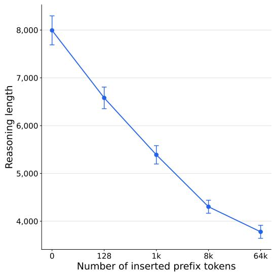
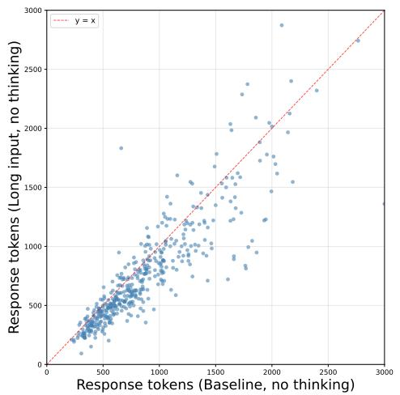
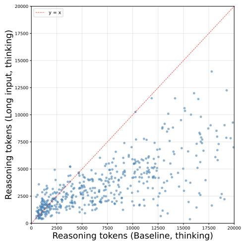
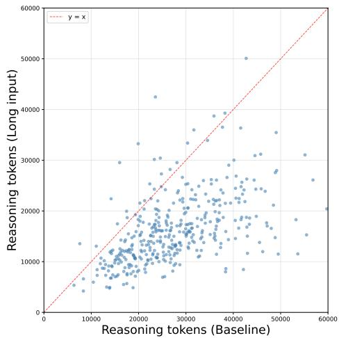
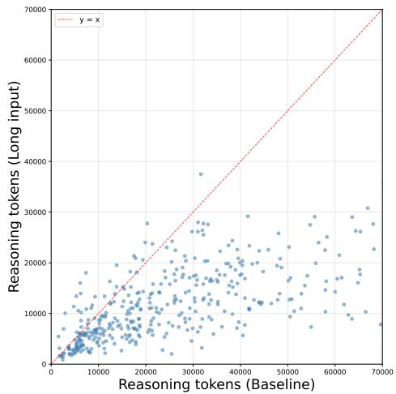
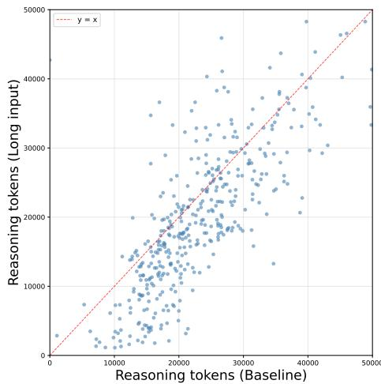
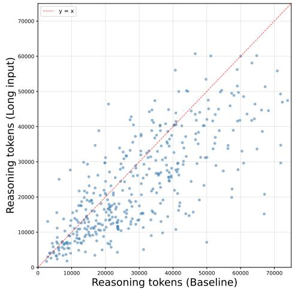
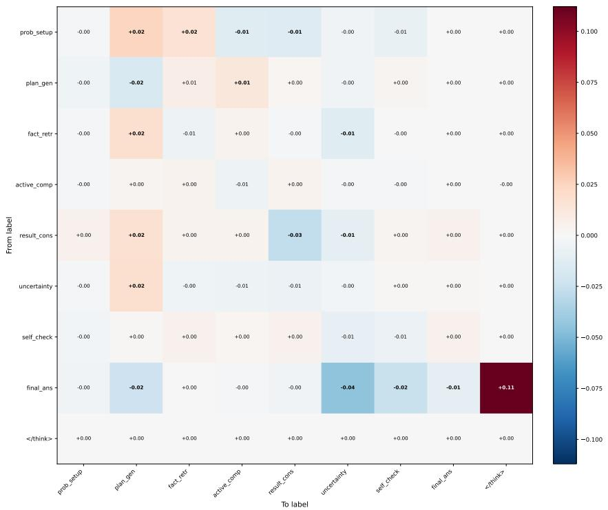

# Reasoning Shift: How Context Silently Shortens LLM Reasoning

Gleb Rodionov∗ Yandex

# Abstract

Large language models (LLMs) exhibiting test-time scaling behavior, such as extended reasoning traces and self-verification, have demonstrated remarkable performance on complex, long-term reasoning tasks. However, the robustness of these reasoning behaviors remains underexplored. To investigate this, we conduct a systematic evaluation of multiple reasoning models across three scenarios: (1) problems augmented with lengthy, irrelevant context; (2) multi-turn conversational settings with independent tasks; and (3) problems presented as a subtask within a complex task. We observe an interesting phenomenon: reasoning models tend to produce much shorter reasoning traces (up to $50 \%$) for the same problem under different context conditions compared to the traces produced when the problem is presented in isolation. A finer-grained analysis reveals that this compression is associated with a decrease in self-verification and uncertainty management behaviors, such as double-checking. While this behavioral shift does not compromise performance on straightforward problems, it might affect performance on more challenging tasks. We hope our findings draw additional attention to both the robustness of reasoning models and the problem of context management for LLMs and LLM-based agents.

# 1 Introduction

Recently, test-time scaling has emerged as a promising strategy for improving the performance of Large Language Models by allocating more compute during inference, allowing adaptation to input complexity without retraining [OpenAI et al., 2024, DeepSeek-AI et al., 2025]. A prominent example of test-time scaling is Chain-of-Thought (CoT) [Kojima et al., 2022, Wei et al., 2022]. With recent advancements in Reinforcement Learning (RL) and other post-training methods, LLMs are now equipped with a thinking mode, which enables them to produce long reasoning trajectories before providing an answer to the user’s query. Importantly, modern advancements in reasoning LLMs are often tied to the models’ ability to self-reflect on how they solve problems, as demonstrated by the presence of high-level patterns in their CoT, such as backtracking, uncertainty management, and self-verification [Gandhi et al., 2025, Venhoff et al., 2025]. These patterns typically accompany increased reasoning trace length.

In parallel, recent years have seen the rise of long-context language models, with context windows expanding to hundreds of thousands or even millions of tokens [Dubey et al., 2024, Anthropic, 2024, Google DeepMind, 2025b]. These advances provide ample space for test-time scaling, allowing models to explore, reflect, and summarize within a single context, thereby enabling complex reasoning [Liu et al., 2025a], multi-stage prover-verifier pipelines [Shao et al., 2025], and sophisticated agent workflows [Team et al., 2025]. However, multiple works have demonstrated significant limitations associated with longer contexts, such as reduced ability to retrieve relevant data from long contexts [Kamradt, 2023], to learn in context [Li et al., 2024], to recover from wrong assumptions in multi-turn conversations [Laban et al., 2026], and to perform multi-step reasoning over long inputs [Ling et al.,

2025]. Additionally, Du et al. [2025] demonstrated that the sheer length of the input alone can hurt LLM performance, independent of retrieval quality and in the absence of any distracting information.

With the rise of multiple test-time strategies and agents working on long-term tasks, natural questions emerge: "How does context length and content affect the reasoning capabilities of the models?" In particular, "If a model faces an isolated subproblem with irrelevant data in the context, will it solve it similarly as if working on it in isolation?"

In this work, we study a surprising phenomenon: we observe a significant distribution shift in how models solve the same problems under different context conditions. We explore how reasoning quality and performance change under simple distracting conditions: (1) problems augmented with lengthy, irrelevant context; (2) multi-turn conversational settings with independent tasks; and (3) problems presented as subtasks within a complex task. In particular, we find that reasoning models tend to produce significantly fewer reasoning tokens (up to $2 \times$less) when solving problems under non-isolated context conditions. An analysis of the reasoning chains shows that this compression is associated with a decrease in self-verification and uncertainty management behaviors, such as doublechecking. While this reduction in reasoning traces may reduce overthinking on easier problems without sacrificing accuracy, it leads to performance drops on more challenging tasks.

We hope our findings draw additional attention to both the robustness of reasoning models and the problem of context management for LLMs and LLM-based agents.

# 2 Background

Chain-of-Thought reasoning. Test-time scaling has brought a paradigm shift that enables long Chain-of-Thought reasoning and induces sophisticated reasoning behaviors, making models superior in competitive math and coding tasks. The central technique driving this revolution is large-scale RL, which elicits complex reasoning behaviors such as self-verification and iterative refinement [OpenAI et al., 2024, DeepSeek-AI et al., 2025, Shao et al., 2024, Yu et al., 2025, Kumar et al., 2024]. Subsequent works have explored additional approaches to achieve test-time scaling and strong reasoning performance [Muennighoff et al., 2025, Ye et al., 2025].

Additional thinking budget introduces new challenges in adjusting reasoning effort according to input problem complexity [Yang et al., 2025a]. Su et al. [2025] analyzed the relationship between reasoning length and answer correctness, finding that LLMs tend to overthink on simpler problems and underthink on harder ones, indicating that models may fail to calibrate their reasoning length accordingly. Aggarwal et al. [2025] proposed a unified benchmark that jointly evaluates overthinking and underthinking in LLMs.

To analyze how LLMs tackle hard reasoning problems within their long CoT traces, Venhoff et al. [2025] define distinct reasoning functions within a reasoning trace and use an LLM judge to classify each sentence according to its functional role. Adopting their framework, Bogdan et al. [2025] propose analyzing long reasoning traces by identifying steps that guide the trajectory of reasoning, organizing sentences into different categories and measuring their causal impact, highlighting the importance of planning or uncertainty management sentences. Muennighoff et al. [2025] also demonstrated that enforcing self-reflection by intervening in the reasoning trace when the model attempts to stop may lead to improved performance. Subsequent works have investigated the relationship between accuracy and high-level characteristics of reasoning traces, such as length, review ratio, and others [Wu et al., 2025, Hassid et al., 2025, Feng et al., 2025].

Long context and context management. Recent years have witnessed remarkable growth in model context length [Dubey et al., 2024, Anthropic, 2024, Google DeepMind, 2025b]. Despite this impressive scaling of context extension, a significant gap remains between the context length these models claim to support and the actual context length they can process effectively [Liu et al., 2025b]. Common limitations typically involve retrieval-based evaluations [Kamradt, 2023] and multi-hop tracing and aggregation [Hsieh et al., 2024]. However, Du et al. [2025] shows that long contexts may degrade performance despite perfect retrieval, even in a synthetic setting where models are forced to attend only to relevant tokens. Laban et al. [2026] demonstrates significant performance drops in multi-turn settings using sharded simulation - a set of smaller instructions that collectively convey the same information as the original instruction. In this setting, models tend to overly rely on incorrect assumptions they made in earlier turns.

Multiple methods have been proposed to overcome the limitations of long contexts and unlock further scaling of test-time compute, including context compaction, iterative summarization, and external memory modules [Anthropic, 2025, Liu et al., 2025a, Yan et al., 2025, Tekparmak and Ömer Kaya, 2025]. A parallel line of work takes advantage of problems that can be split into isolated subproblems by delegating them to recursive self-calls, which may improve efficiency and naturally allow for maintaining compact context representations [Yang et al., 2025b, Jin et al., 2025, Ning et al., 2024, Zheng et al., 2025].

# 3 Experiments

# 3.1 Setup

This section presents experiments designed to answer a key question: Can a model solve an isolated subproblem as effectively when surrounded by irrelevant context as it does in isolation? This inquiry is motivated by two observations. First, complex reasoning tasks can often be decomposed into independent subtasks that do not require global context. Second, long-running agents increasingly operate within broad, general contexts that inevitably contain details irrelevant to specific user queries or subtasks.

To evaluate model’s ability to reason about the same problems under different context conditions, we compare the following setups:

- • Baseline: model is given a single user message containing a problem with a standard prompt.
- • Subtask: model is given a single user message containing two independent problems to solve.
- • Long input: model is given a single user message containing a long chunk of irrelevant data followed by a problem with a standard prompt.
- • Multi-turn: model is given a multi-turn chat history, where each user message asks for solving the a new problem with the Baseline prompt. We only evaluate the second turn.

<table><tr><td rowspan="2">Model</td><td colspan="2">Baseline</td><td colspan="2">Subtask</td><td colspan="2">Long input</td><td colspan="2">Multi-turn</td></tr><tr><td>Acc.</td><td>Tokens</td><td>Acc.</td><td>Tokens</td><td>Acc.</td><td>Tokens</td><td>Acc.</td><td>Tokens</td></tr><tr><td>Qwen-3.5-27B</td><td>74.5</td><td>28,771</td><td>62.4</td><td>20,165</td><td>67.8</td><td>16,415</td><td>67.0</td><td>17,404</td></tr><tr><td>GPT-OSS-120B</td><td>73.8</td><td>24,180</td><td>64.0</td><td>17,408</td><td>64.0</td><td>11,876</td><td>69.3</td><td>19,831</td></tr><tr><td>Gemini 3 Flash Preview</td><td>82.8</td><td>23,090</td><td>67.0</td><td>13,653</td><td>80.3</td><td>19,879</td><td>82.5</td><td>21,693</td></tr><tr><td>Kimi K2 Thinking</td><td>74.8</td><td>29,615</td><td>65.0</td><td>19,630</td><td>70.8</td><td>23,380</td><td>72.8</td><td>30,421</td></tr></table>

*Table 1: Model performance with accuracy and average amount of generated reasoning tokens, IMOAnswerBench. Background color represents the relative change from the baseline values.*

For our main experiment, we evaluate the following models on a IMOAnswerBench [Luong et al., 2025]: Qwen3.5-27B [Qwen Team, 2026], GPT-OSS-120B [Agarwal et al., 2025], Gemini 3 Flash Preview Google DeepMind [2025a], and Kimi K2 Thinking [Moonshot AI, 2025]. For each model, we report both accuracy and the amount of reasoning tokens generated. We use Gemini 3 Pro Preview Google DeepMind [2025a] as a judge for automatic evaluation.

For Subtask scenario, model solves two independent problems within the same query - we report average accuracy of solving both problems and the amount of reasoning tokens divided by two, representing the average amount of reasoning tokens spent on a single task.

Please refer to Appendix A for further details on experiment setup.

# 3.2 Results

Results are presented in Table 1. Interestingly, we observe a slight performance drop in all Subtask and Long input scenarios: degradation of $12 \%$for Qwen-3.5-27B, $9 \%$for GPT-OSS-120B, $15 \%$for Gemini 3 Flash Preview and $9 \%$for Kimi K2 Thinking. We report a detailed evaluation of the Subtask scenario in Appendix B.

Importantly, all models covered produce much shorter reasoning traces under different non-baseline context conditions, generating up to $50 \%$fewer reasoning tokens for the same problems. Please see Figure 3 for task-wise comparison of the amount of generated tokens.

We additionally plot how the average reasoning length changes with different sizes of irrelevant data in the Long Input scenario, showing that even short distractions (hundreds of tokens) may be enough to reduce the average reasoning length by $18 \%$, while further increasing the prompt size reduces reasoning by $50 \%$(see Figure 1).

We also conduct additional experiments to determine whether this effect is specific to reasoning mode. For this purpose, we evaluate a model with integrated thinking and non-thinking modes, Qwen3.5-27B, on the MATH500 benchmark using the Long input scenario (see Figure 2 for a task-wise comparison of the amount of generated tokens). For non-thinking mode, we report the response length. Qwen3.5-27B demonstrates a $19 \%$reduction in response length in non-thinking mode (1664 tokens for Baseline vs. 1348 tokens for Long input) and a $53 \%$reduction in reasoning length (8003 vs. 3762). While both thinking and non-thinking modes exhibit statistical changes under different context conditions, we observe that the described phenomenon is markedly more pronounced in thinking mode.

*Figure 1: Average reasoning length for Qwen3.5-27B on MATH500 under varying number of inserted tokens in Long input setup.*

Focusing on reasoning mode, we analyze checkpoints from different stages of post-training to examine how they affect reasoning shifts under varying context conditions. For this purpose, we evaluate different checkpoints of the Olmo3 model Olmo et al. [2025]. In short, we observe the described phenomenon across all reasoning checkpoints. The results are presented in Table 2.

<table><tr><td rowspan="2">Model</td><td colspan="2">Baseline</td><td colspan="2">Subtask</td><td colspan="2">Long input</td><td colspan="2">Multi-turn</td></tr><tr><td>Acc.</td><td>Tokens</td><td>Acc.</td><td>Tokens</td><td>Acc.</td><td>Tokens</td><td>Acc.</td><td>Tokens</td></tr><tr><td>Olmo-3-7B-Instruct</td><td>95.5</td><td>1,522</td><td>93.0</td><td>1,487</td><td>93.1</td><td>1,635</td><td>94.5</td><td>1,266</td></tr><tr><td>Olmo-3-7B-Think-SFT</td><td>96.0</td><td>4,456</td><td>94.4</td><td>3,470</td><td>93.6</td><td>3,547</td><td>95.0</td><td>3,705</td></tr><tr><td>Olmo-3-7B-Think-DPO</td><td>97.4</td><td>4,140</td><td>94.3</td><td>3,021</td><td>94.2</td><td>3,693</td><td>93.8</td><td>3,538</td></tr><tr><td>Olmo-3-7B-Think</td><td>96.4</td><td>5,227</td><td>95.0</td><td>3,126</td><td>94.8</td><td>3,888</td><td>93.0</td><td>3,587</td></tr></table>

*Table 2: Model performance with accuracy and average amount of generated reasoning tokens, MATH-500. For Instruct model, the average amount of response tokens is reported. Background color represents the relative change from the baseline values.*

# 4 Analysis

Our experiments in Section 3 demonstrate a significant difference in the amount of reasoning tokens generated for the same problems under different context conditions. In this section, we analyze the differences between these traces, by inspecting the reasoning traces produced by Qwen3-32B for MATH500 problems under Baseline and Long input setups.

First, we manually inspect the traces to find any evidence of how the context might affect the reasoning - we did not find any indication that the model became confused by the query or failed to understand the task. Specifically, when investigating the reasoning traces produced by Qwen3-32B under Long input prompts, we find only brief references to the irrelevant prompt part; we report several examples in Appendix E. These are all brief, dismissive acknowledgments: the model notices the prefix, labels it irrelevant, and moves on immediately. We found zero evidence of the model actually engaging with or being influenced by the inserted content at a semantic level.

*(a) Number of response tokens, no thinking mode.*

*(b) Number of reasoning tokens, thinking mode. Figure 2: Number of generated tokens for Qwen3.5-27B for each MATH-500 task. X-axis: Baseline, Y-Axis: Long input.*

Then, we compare whether Basline traces need more time to arrive at the answer or are longer because they exhibit stronger verification patterns after a candidate answer is found. For this purpose, we identify the position within each trace where the first candidate answer is stated. Interestingly, despite significant differences in average reasoning lengths (3824 tokens vs 2741 tokens), the average and median positions of the first answer candidate are nearly equal (925 tokens vs 939 tokens on average, with a median near 400 tokens for both setups). We note that we did not evaluate the correctness of the first answer candidate due to the small performance differences of the model on this benchmark (96.5 vs 95.0). Analyzing this effect on less straightforward problems is of interest for future work.

To understand the nature of the significant differences in reasoning length, we adopt the framework from [Venhoff et al., 2025] to perform sentence-level analysis of long reasoning traces. We classify each sentence within the traces into the following categories: problem setup, plan generation, fact retrieval, active computation, result consolidation, uncertainty management, and final answer emission. We investigate the transition matrices of these labels within the reasoning traces. Figure 4 demonstrates the difference in transition heatmaps for the Baseline and Long input setups. We note the absolute largest value in this heatmap: the transition from final answer emission to the end of the thinking trace $5 7 \%$for Baseline vs. $68 \%$for Long input), which may indicate a significant behavioral difference: once the final answer is stated, Long input traces finish more often, whereas Baseline traces have a greater probability of initiating additional self-checks.

However, these changes might be influenced by the content of the reasoning traces themselves rather than by the context conditions. To test this, we conduct a resampling experiment: we take the traces produced under Long input conditions, remove small portion of last tokens (last 50 tokens) from the reasoning part, and resample the same amount of tokens under different context conditions: Baseline, Long input, and a condition similar to Long input but with a shorter prompt (only 128 inserted tokens). For the resampled traces, we compare the ratio of finished traces. The results are presented in Table 3. The ratio of finished traces for Long input is $46 \%$, compared to $21 \%$for Baseline, which is also accompanied by re-

<table><tr><td>Token</td><td>0 (Baseline)</td><td>128</td><td>16k</td></tr><tr><td>&lt;/think&gt;</td><td>21%</td><td>26%</td><td>46%</td></tr><tr><td>Wait</td><td>11%</td><td>10%</td><td>5%</td></tr><tr><td>Alternatively</td><td>17%</td><td>11%</td><td>5%</td></tr><tr><td>But</td><td>46%</td><td>38%</td><td>20%</td></tr><tr><td>Maybe</td><td>23%</td><td>17%</td><td>9%</td></tr></table>

*Table 3: Resampling from the same reasoning traces but under varying numbers of inserted prompt tokens in the Long Input setup. The table presents the ratio of traces containing the end of reasoning or self-verification tokens.*

duced frequencies of words used during self-verification and uncertainty management, such as "wait," "alternatively," and "but." Please refer to Appendix F for the examples of the resampled samples.

These results suggest that, for the same reasoning prefixes, different context conditions may suppress high-level reasoning patterns, such as self-verification and uncertainty management. We leave a deeper analysis of the mechanism behind this shift for future work.

# 5 Discussion

In this working paper, we find that different context conditions may affect the way reasoning LLMs tackle the same problems. In particular, we demonstrate that the distribution of high-level behavioral patterns, such as uncertainty management and self-verification, is fragile and can be suppressed by non-relevant context in the prompt. While for easier problems this may reduce overthinking, such behavioral shifts degrade performance on more challenging tasks.

Limitations and future work We wish to highlight several important limitations of the current version of this paper. First, our context conditions are relatively simple and synthetic: demonstrating and analyzing the described reasoning shift "in the wild" (using more realistic scenarios, including agentic ones) is of great interest for future work. Second, our analysis in Section 4 focuses only on a single model, the shorter reasoning of other models can be related to other reasons. Also, current version covers only math problems, omitting other reasoning-intensive domains, such as coding or natural sciences. Lastly, we do not currently cover or develop any methods to mitigate the reasoning shift, such as prompt tuning, more stable training techniques or context management methods, including those based on recursive self-calls [Yang et al., 2025b, Jin et al., 2025, Ning et al., 2024, Zheng et al., 2025, Zhang et al., 2025].

# References

- Sandhini Agarwal, Lama Ahmad, Jason Ai, Sam Altman, Andy Applebaum, Edwin Arbus, Rahul K Arora, Yu Bai, Bowen Baker, Haiming Bao, et al. gpt-oss-120b & gpt-oss-20b model card. arXiv preprint arXiv:2508.10925, 2025.
- Pranjal Aggarwal, Seungone Kim, Jack Lanchantin, Sean Welleck, Jason Weston, Ilia Kulikov, and Swarnadeep Saha. Optimalthinkingbench: Evaluating over and underthinking in llms. arXiv preprint arXiv:2508.13141, 2025.
- Anthropic. Introducing the next generation of claude, March 2024. URL https://www.anthropic. com/news/claude-3-family. Accessed: 2025-05-18.
- Anthropic. Effective context engineering for ai agents, 2025. URL https://www.anthropic.com/ engineering/effective-context-engineering-for-ai-agents.
- P. C. Bogdan, U. Macar, N. Nanda, and A. Conmy. Thought anchors: Which LLM reasoning steps matter? arXiv preprint arXiv:2506.19143, jun 2025. Preprint.
- DeepSeek-AI, Daya Guo, Dejian Yang, Haowei Zhang, Junxiao Song, Ruoyu Zhang, Runxin Xu, Qihao Zhu, Shirong Ma, Peiyi Wang, and Xiao Bi et al. Deepseek-r1: Incentivizing reasoning capability in llms via reinforcement learning, 2025. URL https://arxiv.org/abs/2501. 12948.
- Yufeng Du, Minyang Tian, Srikanth Ronanki, Subendhu Rongali, Sravan Bodapati, Aram Galstyan, Azton Wells, Roy Schwartz, Eliu A Huerta, and Hao Peng. Context length alone hurts llm performance despite perfect retrieval. arXiv preprint arXiv:2510.05381, 2025.
- Abhimanyu Dubey, Abhinav Jauhri, Abhinav Pandey, Abhishek Kadian, Ahmad Al-Dahle, Aiesha Letman, Akhil Mathur, Alan Schelten, Amy Yang, Angela Fan, et al. The llama 3 herd of models. arXiv preprint arXiv:2407.21783, 2024.
- Yunzhen Feng, Julia Kempe, Cheng Zhang, Parag Jain, and Anthony Hartshorn. What characterizes effective reasoning? revisiting length, review, and structure of cot. arXiv preprint arXiv:2509.19284, 2025.
- Kanishk Gandhi, Ayush Chakravarthy, Anikait Singh, Nathan Lile, and Noah D Goodman. Cognitive behaviors that enable self-improving reasoners, or, four habits of highly effective stars. arXiv preprint arXiv:2503.01307, 2025.

- Google DeepMind. A new era of intelligence with gemini 3, 2025a. URL https://blog.google/ products-and-platforms/products/gemini/gemini-3/#note-from-ceo.
- Google DeepMind. Gemini 2.5: Our Newest Gemini Model with Thinking. https://blog.google/ technology/google-deepmind/gemini-model-thinking-updates-march-2025/ #gemini-2-5-thinking, 2025b. Accessed: 2025-04-07.
- Michael Hassid, Gabriel Synnaeve, Yossi Adi, and Roy Schwartz. Don’t overthink it. preferring shorter thinking chains for improved llm reasoning. arXiv preprint arXiv:2505.17813, 2025.
- Cheng-Ping Hsieh, Simeng Sun, Samuel Kriman, Shantanu Acharya, Dima Rekesh, Fei Jia, and Boris Ginsburg. RULER: What’s the real context size of your long-context language models? In First Conference on Language Modeling, 2024. URL https://openreview.net/forum?id= kIoBbc76Sy.
- Tian Jin, Ellie Y. Cheng, Zack Ankner, Nikunj Saunshi, Blake M. Elias, Amir Yazdanbakhsh, Jonathan Ragan-Kelley, Suvinay Subramanian, and Michael Carbin. Learning to keep a promise: Scaling language model decoding parallelism with learned asynchronous decoding, 2025. URL https://arxiv.org/abs/2502.11517.
- Greg Kamradt. Needle in a haystack - pressure testing llms. https://github.com/gkamradt/ LLMTest_NeedleInAHaystack, 2023.
- Andrej Karpathy. char-rnn. https://github.com/karpathy/char-rnn, 2015.
- Takeshi Kojima, Shixiang Shane Gu, Machel Reid, Yutaka Matsuo, and Yusuke Iwasawa. Large language models are zero-shot reasoners. ArXiv, abs/2205.11916, 2022. URL https://api. semanticscholar.org/CorpusID:249017743.
- Aviral Kumar, Vincent Zhuang, Rishabh Agarwal, Yi Su, John D Co-Reyes, Avi Singh, Kate Baumli, Shariq Iqbal, Colton Bishop, Rebecca Roelofs, et al. Training language models to self-correct via reinforcement learning. arXiv preprint arXiv:2409.12917, 2024.
- Philippe Laban, Hiroaki Hayashi, Yingbo Zhou, and Jennifer Neville. LLMs get lost in multi-turn conversation. In The Fourteenth International Conference on Learning Representations, 2026. URL https://openreview.net/forum?id=VKGTGGcwl6.
- Tianle Li, Ge Zhang, Quy Duc Do, Xiang Yue, and Wenhu Chen. Long-context llms struggle with long in-context learning. arXiv preprint arXiv:2404.02060, 2024.
- Zhan Ling, Kang Liu, Kai Yan, Yifan Yang, Weijian Lin, Ting-Han Fan, Lingfeng Shen, Zhengyin Du, and Jiecao Chen. Longreason: A synthetic long-context reasoning benchmark via context expansion. arXiv preprint arXiv:2501.15089, 2025.
- Aixin Liu, Aoxue Mei, Bangcai Lin, Bing Xue, Bingxuan Wang, Bingzheng Xu, Bochao Wu, Bowei Zhang, Chaofan Lin, Chen Dong, et al. Deepseek-v3. 2: Pushing the frontier of open large language models. arXiv preprint arXiv:2512.02556, 2025a.
- Jiaheng Liu, Dawei Zhu, Zhiqi Bai, Yancheng He, Huanxuan Liao, Haoran Que, Zekun Wang, Chenchen Zhang, Ge Zhang, Jiebin Zhang, et al. A comprehensive survey on long context language modeling. arXiv preprint arXiv:2503.17407, 2025b.
- Minh-Thang Luong, Dawsen Hwang, Hoang H Nguyen, Golnaz Ghiasi, Yuri Chervonyi, Insuk Seo, Junsu Kim, Garrett Bingham, Jonathan Lee, Swaroop Mishra, et al. Towards robust mathematical reasoning. In Proceedings of the 2025 Conference on Empirical Methods in Natural Language Processing, pages 35406–35430, 2025.
- Moonshot AI. Introducing kimi k2 thinking, 2025. URL https://www.kimi.com/blog/ kimi-k2-thinking.
- Niklas Muennighoff, Zitong Yang, Weijia Shi, Xiang Lisa Li, Li Fei-Fei, Hannaneh Hajishirzi, Luke Zettlemoyer, Percy Liang, Emmanuel Candès, and Tatsunori Hashimoto. s1: Simple test-time scaling. arXiv preprint arXiv:2501.19393, 2025.

- Xuefei Ning, Zinan Lin, Zixuan Zhou, Zifu Wang, Huazhong Yang, and Yu Wang. Skeleton-ofthought: Prompting LLMs for efficient parallel generation. In The Twelfth International Conference on Learning Representations, 2024. URL https://openreview.net/forum?id=mqVgBbNCm9.
- Team Olmo, Allyson Ettinger, Amanda Bertsch, Bailey Kuehl, David Graham, David Heineman, Dirk Groeneveld, Faeze Brahman, Finbarr Timbers, Hamish Ivison, et al. Olmo 3. arXiv preprint arXiv:2512.13961, 2025.
- OpenAI, :, Aaron Jaech, Adam Kalai, Adam Lerer, Adam Richardson, Ahmed El-Kishky, Aiden Low, Alec Helyar, Aleksander Madry, and Alex Beutel et al. Openai o1 system card, 2024. URL https://arxiv.org/abs/2412.16720.
- Qwen Team. Qwen3.5: Accelerating productivity with native multimodal agents, February 2026. URL https://qwen.ai/blog?id=qwen3.5.
- Zhihong Shao, Peiyi Wang, Qihao Zhu, Runxin Xu, Junxiao Song, Xiao Bi, Haowei Zhang, Mingchuan Zhang, YK Li, Yang Wu, et al. Deepseekmath: Pushing the limits of mathematical reasoning in open language models. arXiv preprint arXiv:2402.03300, 2024.
- Zhihong Shao, Yuxiang Luo, Chengda Lu, ZZ Ren, Jiewen Hu, Tian Ye, Zhibin Gou, Shirong Ma, and Xiaokang Zhang. Deepseekmath-v2: Towards self-verifiable mathematical reasoning. arXiv preprint arXiv:2511.22570, 2025.
- Jinyan Su, Jennifer Healey, Preslav Nakov, and Claire Cardie. Between underthinking and overthinking: An empirical study of reasoning length and correctness in llms. arXiv preprint arXiv:2505.00127, 2025.
- Kimi Team, Yifan Bai, Yiping Bao, Y Charles, Cheng Chen, Guanduo Chen, Haiting Chen, Huarong Chen, Jiahao Chen, Ningxin Chen, et al. Kimi k2: Open agentic intelligence. arXiv preprint arXiv:2507.20534, 2025.
- Atakan Tekparmak and Ömer Kaya. mem-agent: Equipping llm agents with memory using rl, October 2025. URL https://huggingface.co/blog/driaforall/mem-agent-blog. Community Article.
- C. Venhoff, I. Arcuschin, P. Torr, A. Conmy, and N. Nanda. Understanding reasoning in thinking language models via steering vectors. In Workshop on Reasoning and Planning for Large Language Models at ICLR 2025, 2025. URL https://arxiv.org/abs/2506.18167.
- Jason Wei, Xuezhi Wang, Dale Schuurmans, Maarten Bosma, Fei Xia, Ed Chi, Quoc V Le, Denny Zhou, et al. Chain-of-thought prompting elicits reasoning in large language models. Advances in neural information processing systems, 35:24824–24837, 2022.
- Yuyang Wu, Yifei Wang, Ziyu Ye, Tianqi Du, Stefanie Jegelka, and Yisen Wang. When more is less: Understanding chain-of-thought length in llms. arXiv preprint arXiv:2502.07266, 2025.
- Yuchen Yan, Yongliang Shen, Yang Liu, Jin Jiang, Mengdi Zhang, Jian Shao, and Yueting Zhuang. Inftythink: Breaking the length limits of long-context reasoning in large language models. arXiv preprint arXiv:2503.06692, 2025.
- An Yang, Anfeng Li, Baosong Yang, Beichen Zhang, Binyuan Hui, Bo Zheng, Bowen Yu, Chang Gao, Chengen Huang, Chenxu Lv, Chujie Zheng, Dayiheng Liu, Fan Zhou, Fei Huang, Feng Hu, Hao Ge, Haoran Wei, Huan Lin, Jialong Tang, Jian Yang, Jianhong Tu, Jianwei Zhang, Jianxin Yang, Jiaxi Yang, Jing Zhou, Jingren Zhou, Junyang Lin, Kai Dang, Keqin Bao, Kexin Yang, Le Yu, Lianghao Deng, Mei Li, Mingfeng Xue, Mingze Li, Pei Zhang, Peng Wang, Qin Zhu, Rui Men, Ruize Gao, Shixuan Liu, Shuang Luo, Tianhao Li, Tianyi Tang, Wenbiao Yin, Xingzhang Ren, Xinyu Wang, Xinyu Zhang, Xuancheng Ren, Yang Fan, Yang Su, Yichang Zhang, Yinger Zhang, Yu Wan, Yuqiong Liu, Zekun Wang, Zeyu Cui, Zhenru Zhang, Zhipeng Zhou, and Zihan Qiu. Qwen3 technical report, 2025a. URL https://arxiv.org/abs/2505.09388.
- Chenxiao Yang, Nathan Srebro, David McAllester, and Zhiyuan Li. Pencil: Long thoughts with short memory. arXiv preprint arXiv:2503.14337, 2025b.

- Yixin Ye, Zhen Huang, Yang Xiao, Ethan Chern, Shijie Xia, and Pengfei Liu. Limo: Less is more for reasoning, 2025. URL https://arxiv.org/abs/2502.03387.
- Qiying Yu, Zheng Zhang, Ruofei Zhu, Yufeng Yuan, Xiaochen Zuo, Yu Yue, Weinan Dai, Tiantian Fan, Gaohong Liu, Lingjun Liu, et al. Dapo: An open-source llm reinforcement learning system at scale. arXiv preprint arXiv:2503.14476, 2025.
- Alex L Zhang, Tim Kraska, and Omar Khattab. Recursive language models. arXiv preprint arXiv:2512.24601, 2025.
- Tong Zheng, Hongming Zhang, Wenhao Yu, Xiaoyang Wang, Runpeng Dai, Rui Liu, Huiwen Bao, Chengsong Huang, Heng Huang, and Dong Yu. Parallel-r1: Towards parallel thinking via reinforcement learning, 2025. URL https://arxiv.org/abs/2509.07980.

# A Experiment details

# A.1 Prompt details

<table><tr><td>Baseline</td></tr><tr><td>Please reason step-by-step and put the final answer within \boxed{\}.</td></tr><tr><td>&lt;Problem&gt;</td></tr></table>

<table><tr><td>Subtask</td></tr><tr><td>You will be given two independent problems, solve them separately. For each problem please reason step by step, and put your final answer within \boxed{\}.</td></tr><tr><td>First Problem:</td></tr><tr><td>Second Problem:</td></tr></table>

<table><tr><td>Long input</td></tr><tr><td># Old data:</td></tr><tr><td>&lt;Shakespeare&#x27;s plays&gt;</td></tr><tr><td>Old data ends.</td></tr><tr><td>Please reason step-by-step and put the final answer within \boxed{ }.</td></tr><tr><td>&lt;Problem&gt;</td></tr></table>

For Long input setup, we insert 64000 tokens of Shakespeare’s plays from the [Karpathy, 2015] to the prompt.

# A.2 Inference details

We use OpenRouter API for running the main experiments. For each model, we use a single fixed vendor: Qwen-3.5-27B - Alibaba Cloud Int., GPT-OSS-120B - Together AI, Gemini 3 Flash Preview - Google AI Studio, Kimi K2 Thinking - Moonshot AI.

For each model, we use default sampling parameters and thinking budget of 80, 000 tokens.

# B Subtask evaluation details

To evaluate average performance in the Subtask scenario, we use two separate judge calls, evaluating the correctness of each subproblem. Results are presented in Table 4.

<table><tr><td>Model</td><td>Baseline</td><td>First subproblem</td><td>Second subproblem</td></tr><tr><td>Qwen-3.5-27B</td><td>74.5</td><td>66.8</td><td>58.0</td></tr><tr><td>GPT-OSS-120B</td><td>73.8</td><td>63.8</td><td>64.3</td></tr><tr><td>Gemini 3 Flash Preview</td><td>82.8</td><td>68.3</td><td>65.8</td></tr><tr><td>Kimi K2 Thinking</td><td>74.8</td><td>68.0</td><td>62.0</td></tr></table>

*Table 4: Model accuracy on each subproblem in the Subproblem setup. Background color represents the relative change from the baseline values.*

# C Task-wise comparison of reasoning lengths

*(a) Qwen3.5-27B*

*(b) GPT-OSS-120B*

*(c) Gemini 3 Flash Preview*

*(d) Kimi K2 Thinking Figure 3: Number of generated tokens for each IMOAnswerBench task. X-axis: Baseline, Y-Axis: Long input.*

# D Transition heatmap

Figure 4 represents the difference of transition probability matrices. Positive values mean that Long input setup has more probability of transition of this type than the Baseline.

*Figure 4: Difference of transition probabilities matrices (Long input - Baseline). Qwen3-32B, MATH500 problems.*

# E Long input references

In this section, we provide all references to the inserted prompt tokens in the Long input setup made by Qwen3-32B on MATH500 problems. We note that other models might have different patterns of prompt analysis. For example, Qwen3.5-27B usually tends to formulate the whole structure of the prompt before starting to solve the task, immediately pointing to the presence of distractor tokens. However, we did not find any examples of the model actually engaging with or being influenced by the inserted content at a semantic level.

# Task 203

<...>

Therefore, since $\operatorname { f } ( - 2 ) = 1 2$, the remainder is 12. Therefore, the answer is 12.

But let me think if there’s any trick here. The problem is from Shakespeare’s Coriolanus? Wait, no, the original problem is just a math problem. The “old data” was the play’s text, but the new task is a math problem. Maybe that was just to set the context? Anyway, regardless, the math seems straightforward.

Alternatively, perhaps there is a mistake in assuming that the exponents can be evaluated directly? <...>

# Task 264

<...>

This suggests that the construction in the Asymptote code might have an error, or "bisectorpoint" is not what I think it is. Given the time I’ve spent and the complexity, I might need to switch strategies.

Let me recall that in the problem, after the battle, Coriolanus is made consul, and the citizens are angry, leading to his exile, but this is unrelated to the geometry problem. Focus on the geometry.

Given the square CDEG with $\mathrm { C D } = 3$, and rectangle BEFH with $\mathrm { B E } = 5$, find BH.

# Task 296

<...>

Therefore, equation B has the largest x. But let me check another angle.

Wait, the problem is from the SAT or similar? Wait, the original problem is from the Coriolanus play? No, the original data is the play, but the new task is a math problem. Anyway, according to my reasoning, equation B should be the answer. But let me check once more.

Wait, equation $\mathrm { E } \colon \mathit { b a s e } _ { E } \ = \ 1 + \ 1 / r$. For r approaching 0, this goes to infinity $< . . . >$

# Task 420

$< . . . >$Alternatively, given that the answer requires boxed, maybe they want the scalar? Let me check the problem again.

Wait, in the initial problem statement, the user provided a lot of text from Shakespeare’s Coriolanus, but the actual math problem is separate. So maybe the problem is from a math textbook, and the user just included some old data. Anyway, focusing on the math problem.

Given that the problem says "projection of a onto b," and given that the dot product is given <...>

# F Examples of resampled traces

In this section, we provide several examples of resampled traces, described in Section 4.

# Task 3

# Baseline:

<...> That’s 9 combinations, which correspond to the 9 divisors. So that’s another way to see it. So that confirms it again.

Therefore, I think the answer is 9. But let me just check once more. <...>

# Long input (128 tokens inserted):

$< . . . >$That’s $3 ^ { * } 3 { = } 9$divisors, which again gives me 9. So that’s consistent. Therefore, I think 9 is the right answer.

But just to be thorough, maybe I can check another way. <...>

# Long input (16k tokens inserted):

<...> That’s nine combinations, so nine divisors. Yep, that checks out. So I think the answer is 9.

**Final Answer** The number of positive whole-number divisors of 196 is 9 . </think>

# Task 6

# Baseline:

<...> multiples of 3, 27 must be the smallest.

But let me think again. Let me check for example negative integers. <...>

# Long input (128 tokens inserted):

<...> multiples of 3, 27 is the smallest.

But wait, just to make sure, let me check if maybe 0 is considered. <...>

# Long input (16k tokens inserted):

<...> multiples of 3, 27 is the smallest.

Therefore, the answer is 27.

**Final Answer**

The smallest positive perfect cube that can be written as the sum of three consecutive integers is 27 . </think>