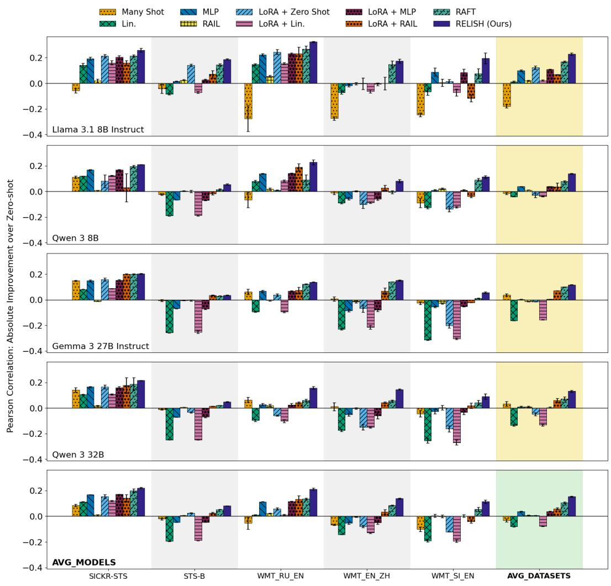
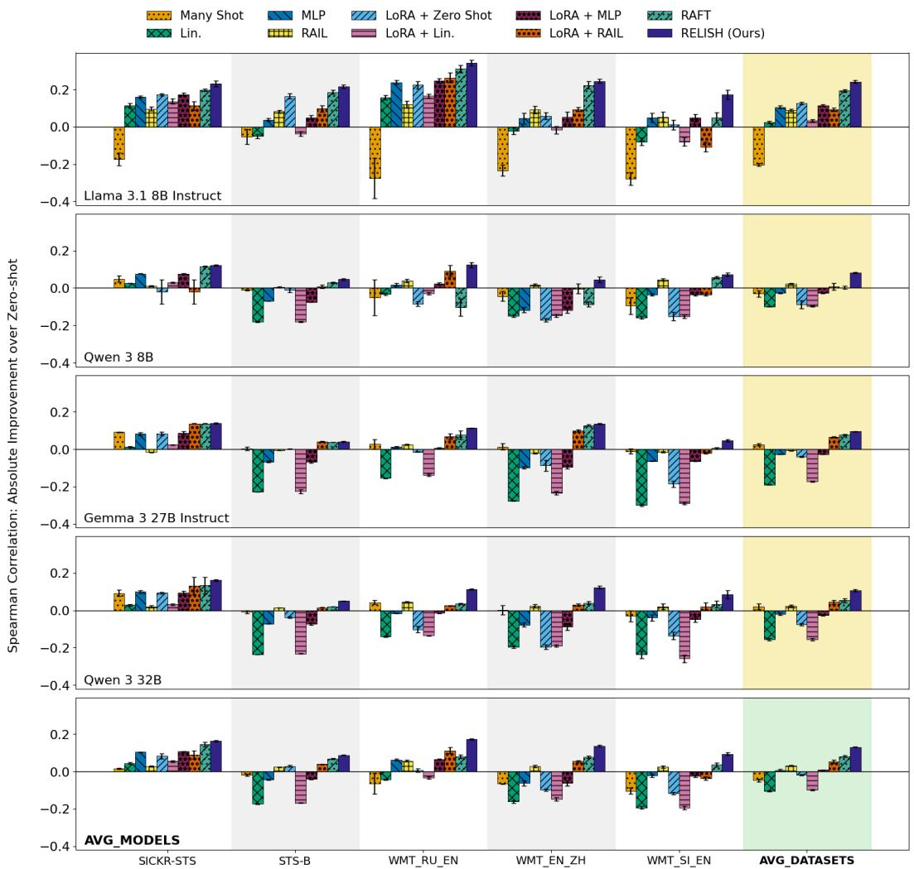
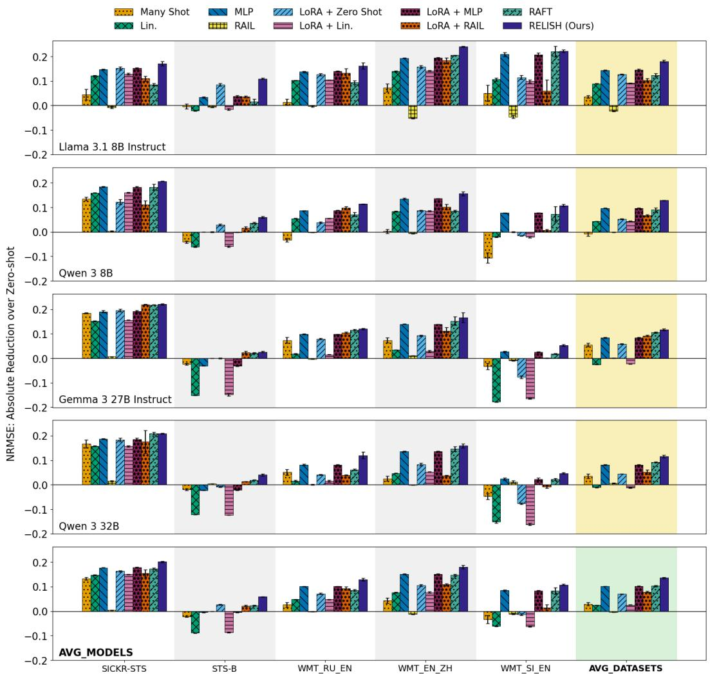
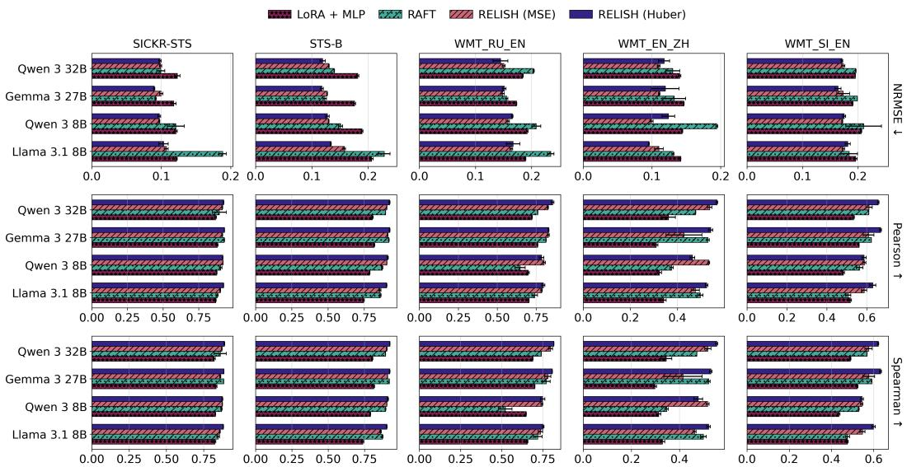
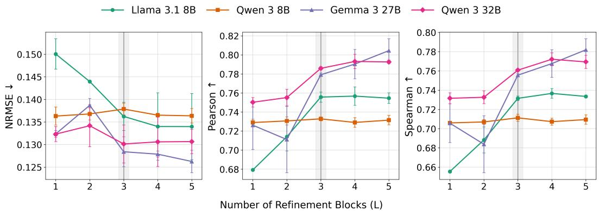

> # LLM REgression with a Latent Iterative State Head (RELISH)

**[译]**

# 基于隐式迭代状态头的大型语言模型回归方法（RELISH）

---

> Yiheng Su

**[译]**

苏一恒

---

> School of Information

**[译]**

信息学院

---

> University of Texas at Austin

**[译]**

德克萨斯大学奥斯汀分校

---

> Austin, Texas, USA

**[译]**

美国德克萨斯州奥斯汀市

---

> {sam.su}@utexas.edu

**[译]**

{sam.su}@utexas.edu

---

> Matthew Lease

**[译]**

马修·利斯

---

> School of Information

**[译]**

信息学院

---

> University of Texas at Austin

**[译]**

德克萨斯大学奥斯汀分校

---

> Austin, Texas 78703, USA

**[译]**

美国德克萨斯州奥斯汀市 78703

---

> {ml}@utexas.edu

**[译]**

{ml}@utexas.edu

---

> # Abstract

**[译]**

# 摘要

---

> We present RELISH (REgression with a Latent Iterative State Head), a novel, lightweight architecture designed for text regression with large language models. Rather than decoding numeric targets as text or aggregating multiple generated outputs, RELISH predicts scalar values directly from frozen LLM representations by iteratively refining a learned latent state through cross-attention over token-level representations, and then mapping the final state to a point estimate with a linear regressor. Across five datasets, four LLM backbones, and two LLM training regimes, RELISH consistently outperforms prior baselines from all three major LLM regression families, including autoregressive decoding, regression-aware inference, and existing predictive head methods. Despite these gains, RELISH remains highly parameter-efficient, requiring only ${ \sim } 3 . 4 { - } 3 . 7 \mathrm { { M } }$trainable parameters across frozen LLM backbones (only $0 . 0 1 { - } 0 . 0 4 \%$additional overhead), far less than LoRA-based alternatives that grow with model size $( 0 . 2 6 \mathrm { - } 0 . 4 2 \%$).

**[译]**

本文提出 RELISH（REgression with a Latent Iterative State Head，基于隐式迭代状态头的回归方法），一种专为大语言模型（LLM）文本回归任务设计的新型轻量级架构。与将数值目标解码为文本或聚合多个生成输出的方法不同，RELISH 直接从冻结的 LLM 表征中预测标量值：它通过在词元级表征上进行交叉注意力机制，迭代优化一个可学习的隐状态；最终，该隐状态经由一个线性回归器映射为点估计。在五个数据集、四种 LLM 主干网络以及两种 LLM 训练范式下，RELISH 始终优于三大主流 LLM 回归方法族中的所有基线模型，包括自回归解码法、回归感知推理法，以及现有预测头方法。尽管性能显著提升，RELISH 仍保持极高的参数效率：在各类冻结的 LLM 主干网络上，其仅需约 $ \sim 3.4\text{–}3.7\,\mathrm{M} $ 个可训练参数（仅增加 $0.01\text{–}0.04\%$ 的额外开销），远低于随模型规模增长的 LoRA 类方法（$0.26\text{–}0.42\%$）。

---

> # 1 Introduction

**[译]**

# 1 引言

---

> In the era of large language models (LLMs), most natural language processing (NLP) tasks are unified under the text-to-text paradigm, in which models consume text inputs and produce text outputs (Raffel et al., 2020; Anthropic, 2025; Singh et al., 2025; Yang et al., 2025; Google DeepMind, 2026). Theoretically, this paradigm is appealing because the same pretrained model, linguistic interface, and decoding procedure can be applied across diverse applications that traditionally required different architectures. Empirically, this paradigm has been particularly successful for intrinsically generative tasks such as question answering, summarization, translation, and code generation (Clark et al., 2018; Hendrycks et al., 2020; Chen et al., 2021; Srivastava et al., 2023; Wang et al., 2024b; Kazemi et al., 2025; Li et al., 2025b; Center for AI Safety et al., 2026). Here, the need to produce coherent, contextually appropriate text aligns naturally with the language modeling objectives used to pre-train LLMs, such as autoregressive next-token prediction (Radford et al., 2019; Brown et al., 2020).

**[译]**

在大型语言模型（LLM）时代，大多数自然语言处理（NLP）任务已统一于“文本到文本”范式之下，即模型以文本为输入，并以文本为输出（Raffel 等，2020；Anthropic，2025；Singh 等，2025；Yang 等，2025；Google DeepMind，2026）。理论上，该范式颇具吸引力，因为同一预训练模型、同一语言接口及同一解码流程可被广泛应用于传统上需依赖不同架构的多样化任务。实证表明，该范式在本质上具有生成性的任务中尤为成功，例如问答、摘要生成、机器翻译和代码生成（Clark 等，2018；Hendrycks 等，2020；Chen 等，2021；Srivastava 等，2023；Wang 等，2024b；Kazemi 等，2025；Li 等，2025b；Center for AI Safety 等，2026）。在此类任务中，生成连贯且上下文恰当的文本这一需求，天然契合 LLM 预训练所采用的语言建模目标（如自回归式的下一个词元预测）（Radford 等，2019；Brown 等，2020）。

---

> However, the text-to-text paradigm is less suited to predictive tasks such as classification and regression (Lukasik et al., 2025). Unlike generative tasks whose outputs are naturally text, predictive tasks seek discrete labels or continuous scalars. In regression, this mismatch makes text generation suboptimal because predictive quality depends on numerical error, whereas language modeling penalizes token mismatches. For example, if the target is 1.0, a regression objective like MSE prefers 0.9 to 0.1, whereas a language modeling objective like cross-entropy treats them as discrete tokens and remains agnostic to numerical proximity.

**[译]**

然而，“文本到文本”范式并不适用于分类与回归等预测型任务（Lukasik 等，2025）。与输出天然为文本的生成型任务不同，预测型任务的目标是离散标签或连续标量。在回归任务中，这种不匹配使得文本生成成为次优选择，因为预测质量取决于数值误差，而语言建模目标则惩罚词元层面的不匹配。例如，若真实目标值为 1.0，则均方误差（MSE）等回归目标更偏好预测值 0.9 而非 0.1；但交叉熵等语言建模目标却将二者视为互不相关的离散词元，对数值上的接近程度完全不敏感。

---

> Recent work has explored how to adapt LLMs to regression. Three major families have emerged (See Table 1): autoregressive decoding (Vacareanu et al., 2024; Song et al., 2024; Song & Bahri, 2025; Akhauri et al., 2025), regression-aware inference (Lukasik et al., 2024; 2025; Chiang et al., 2025), and predictive heads (Xin et al., 2021; Wang et al., 2022; Zhuang et al., 2023; Fernandes et al., 2023; Zhang & Li, 2024; Tang et al., 2025; Nguyen et al., 2024). Autoregressive methods simply prompt the LLM. Regression-aware methods complement next-token generation with regression-aware decision rules that explicitly minimize numerical error.

**[译]**

近期研究探索了如何将 LLM 适配至回归任务。目前已形成三大主流方法族（见表 1）：自回归解码法（Vacareanu 等，2024；Song 等，2024；Song & Bahri，2025；Akhauri 等，2025）、回归感知推理法（Lukasik 等，2024；2025；Chiang 等，2025）以及预测头法（Xin 等，2021；Wang 等，2022；Zhuang 等，2023；Fernandes 等，2023；Zhang & Li，2024；Tang 等，2025；Nguyen 等，2024）。自回归方法仅通过提示（prompt）驱动 LLM；回归感知方法则在下一个词元生成的基础上，引入显式最小化数值误差的回归感知决策规则。

---

> Predictive heads avoid text generation entirely by finetuning a predictive head (e.g., a linear layer) attached to the LLM to directly output numerical estimates.

**[译]**

预测头法则完全规避文本生成过程，而是通过对附加于 LLM 的预测头（例如一个线性层）进行微调，使其直接输出数值估计。

---

> Autoregressive decoding is simplest and most faithful to how LLMs are pre-trained (Vacareanu et al., 2024). Consequently, it is least aligned with the numerical nature of regression targets, since decoding is based on token probabilities rather than numerical proximity. Regression-aware inference seeks to remedy this mismatch by forming predictions from the LLM’s output distribution using Bayes-optimal decision rules to directly minimize the loss metric, such as the posterior mean under mean squared error (Lukasik et al., 2024; 2025). However, approximating this posterior often requires sampling multiple outputs or enumerating candidate targets, thereby increasing computation at inference time. Moreover, this approach only partially resolves the mismatch, since the posterior is still defined over textualized numbers (e.g., $\overline { { { ^ { \prime \prime } 3 . 5 ^ { \prime \prime } } } } )$rather than directly over the continuous output space.

**[译]**

自回归解码法最为简单，也最忠实于 LLM 的预训练方式（Vacareanu 等，2024），因此与回归目标的数值本质契合度最低——因其解码依据是词元概率，而非数值邻近性。回归感知推理法试图通过贝叶斯最优决策规则，从 LLM 的输出分布中构建预测，从而直接最小化损失函数（例如在均方误差下的后验均值）（Lukasik 等，2024；2025），以弥补上述不匹配。然而，对该后验分布的近似通常需采样多个输出或穷举候选目标值，从而显著增加推理阶段的计算开销。此外，该方法仅部分缓解了不匹配问题，因为后验分布仍定义在文本化的数字之上（例如 $\overline{{^{\prime\prime}3.5^{\prime\prime}}}$），而非直接定义于连续的输出空间。

---

> Predictive head methods instead bypass text generation at inference time by mapping LLM representations directly to numeric predictions through a task-specific regressor. This enables direct optimization in the continuous output space, yielding efficient single-pass inference. However, existing approaches (Zhuang et al., 2023; Zhang & Li, 2024; Nguyen et al., 2024; Tang et al., 2025) are limited, typically relying on basic pooling heuristics (e.g., mean pooling) over frozen hidden states. As a result, they may fail to fully extract regressionrelevant information from LLM representations and thus may underperform regressionaware inference. Can we match the predictive performance of regression-aware approaches without sacrificing the efficiency of predictive heads?

**[译]**

预测头法则在推理阶段完全绕过文本生成，转而通过一个任务专用的回归器，将 LLM 表征直接映射为数值预测。这使得模型可在连续输出空间中进行直接优化，从而实现高效的单次前向推理。然而，现有方法（Zhuang 等，2023；Zhang & Li，2024；Nguyen 等，2024；Tang 等，2025）存在明显局限，通常仅依赖对冻结隐藏状态的简单池化启发式策略（例如均值池化）。因此，它们可能无法充分提取 LLM 表征中与回归任务相关的信息，导致性能不及回归感知推理法。那么，我们能否在不牺牲预测头法推理效率的前提下，达到与回归感知方法相媲美的预测性能？

---

> In this work, we propose REgression with a Latent Iterative State Head (RELISH), a novel, lightweight yet expressive predictive head architecture for LLM-based regression. Rather than decoding numeric targets as text or aggregating across several generated outputs, RELISH predicts scalar values directly from frozen LLM representations through an iterative refinement mechanism. Concretely, RELISH repeatedly updates a learned latent state via cross-attention over the LLM’s token representations, and then maps the final state to a scalar prediction with a linear regressor. Compared with existing predictive heads based on simple pooling heuristics, RELISH provides a more robust summarization mechanism for extracting regression-relevant information without sacrificing inference efficiency.

**[译]**

本文提出了一种面向大语言模型（LLM）回归任务的新型、轻量且富有表达力的预测头架构——**基于潜在迭代状态头的回归方法**（REgression with a Latent Iterative State Head, **RELISH**）。与将数值目标解码为文本或对多个生成输出进行聚合等现有方法不同，RELISH 直接从冻结的 LLM 表征中，通过一种迭代精化机制预测标量值。具体而言，RELISH 通过在 LLM 的词元表征上执行交叉注意力操作，反复更新一个可学习的潜在状态；随后，利用一个线性回归器将最终的潜在状态映射为标量预测结果。相较于依赖简单池化启发式策略的现有预测头，RELISH 提供了一种更鲁棒的信息汇总机制，可在不牺牲推理效率的前提下，更有效地提取与回归任务相关的关键信息。

---

> RELISH consistently outperforms state-of-the-art baselines across four LLM backbones (8–32B), five datasets spanning semantic textual similarity (Marelli et al., 2014; Muennighoff et al., 2023) and machine translation quality estimation (Specia et al., 2020), and both frozen and LoRA (Hu et al., 2022) LLM training regimes. Relative to the 2nd-best method, RAFT (Lukasik et al., 2025), RELISH improves Pearson correlation $( 6 . 7 \% )$, Spearman $( 7 . 2 \% )$, and range-normalized RMSE $( 1 9 . 9 \% )$(Table 3). RELISH is also highly parameter-efficient, requiring only ${ \sim } 3 . 4 { - } 3 . 7 \mathrm { M }$trainable parameters across frozen LLM backbones (only $0 . 0 1 { - } 0 . { \dot { 0 } } 4 \%$more overhead), far less than LoRA-based alternatives (Table 4) that grow with model size $( 0 . 2 6 \mathrm { - } 0 . 4 2 \% )$. Overall, our key contributions are:

**[译]**

RELISH 在四种不同规模的 LLM 主干网络（8–32B）、涵盖语义文本相似度（Marelli 等，2014；Muennighoff 等，2023）与机器翻译质量估计（Specia 等，2020）共五个数据集、以及冻结主干与 LoRA（Hu 等，2022）两种训练范式下，始终优于当前最优基线方法。相较于排名第二的方法 RAFT（Lukasik 等，2025），RELISH 在皮尔逊相关系数上提升 $6.7\%$，斯皮尔曼相关系数提升 $7.2\%$，归一化范围均方根误差（range-normalized RMSE）降低 $19.9\%$（见表 3）。此外，RELISH 具有极高的参数效率：在冻结 LLM 主干网络时，其仅需约 ${\sim}3.4\text{–}3.7\,\mathrm{M}$ 可训练参数（仅增加 $0.01\text{–}0.04\%$ 的额外开销），远低于随模型规模增长的 LoRA 类替代方案（表 4 中为 $0.26\text{–}0.42\%$）。总体而言，本文的主要贡献如下：

---

> - 1. A novel predictive head architecture designed for text regression (§ 3).
> - 2. A unified conceptual (§ 2.2) and empirical (§ 4.2) comparison of autoregressive decoding, regression-aware inference, and predictive-head methods across five datasets, four LLM backbones, and both frozen and LoRA fine-tuned regimes, showing that RELISH achieves the strongest overall performance with a substantially smaller trainable footprint than LoRA.

**[译]**

- 1. 一种专为文本回归任务设计的新型预测头架构（§3）；  
- 2. 在五个数据集、四种 LLM 主干网络及冻结与 LoRA 微调两种训练范式下，对自回归解码、回归感知型推理与预测头方法进行统一的概念性（§2.2）与实证性（§4.2）比较，结果表明 RELISH 在整体性能上表现最强，且其可训练参数量显著少于 LoRA 方法。

---

> # 2 Background on LLM-based Regression

**[译]**

# 2 基于大语言模型的回归任务背景

---

> In this section, we begin with problem formulation (§ 2.1), then review existing methods for inference (§ 2.2) and training (§ 2.3) (see Table 1). Last, we differentiate RELISH in $\ S 2 . 4$.

**[译]**

本节首先介绍问题形式化定义（§2.1），继而回顾现有推理方法（§2.2）与训练方法（§2.3）（参见表 1）。最后，在 §2.4 中阐明 RELISH 与既有方法的本质区别。

---

<table><tr><td>Inference family</td><td>How to make predictions</td><td>Suitable training setups</td></tr><tr><td>Autoregressive decoding (Vacareanu et al., 2024)</td><td>Parse from string: 
hatyARD(x) = float(arg max y∈Y p(str(y) | x))</td><td>PEFT/SFT: Minimize token-level CE on str(y*). 
LCE = - ∑t=1|str(y*)| log p(yt | x, y&lt;t)</td></tr><tr><td>Regression-aware inference (RAIL) (Lukasik et al., 2024)</td><td>Bayes-optimal from p(· | x): 
hatyRAIL(x) = arg minv∈R Eyy~p[ℓ(float(y), v)] 
When ℓ = Lmse, same as posterior mean: 
hatyRAIL(x) ≈ ∑y∈Ygrid y · p(str(y) | x)</td><td>PEFT/SFT: 
(i) Minimize LCE. 
(ii) RAFT (Lukasik et al., 2025). 
LCRAFT = (y* - Eyy~p[float(y)])^2</td></tr><tr><td>Predictive Head (Tang et al., 2025)</td><td>Extract representations, then regress: 
hatyHEAD(x) = fREG(φ(H(x)))</td><td>Head-only: train fREG with Lmse. 
PEFT/SFT + head: fine-tune back-bone jointly with fREG.</td></tr><tr><td>RELISH (ours)</td><td>Iteratively refine a latent state, then regress: 
r(i) = Refine(r(i-1), H(x)), i = 1,..., L 
hatyRELISH(x) = w^T r(L) + b</td><td>Head-only: train r(0), w, b, and refinement modules with Lmse. 
PEFT/SFT + head: optionally fine-tune backbone jointly with REL-ISH modules.</td></tr></table>

> Table 1: Taxonomy of methods leveraging LLMs for regression. We characterize LLMbased regression along two axes: (a) how the model produces a point estimate (inference family) and (b) which parameters are trained and how (training setup). Autoregressive decoding generates $\mathsf { s t r } ( y )$and parses it. RAIL computes a Bayes-optimal estimate under $p ( \cdot \mid x )$for loss $\ell$(e.g., the posterior mean for $\mathcal { L } _ { \mathrm { M S E } } ,$), where the posterior is estimated via sampling or candidate enumeration over a grid $\mathcal { \mathrm { { y } _ { \mathrm { { g r i d } } } } }$. Predictive heads regress from pooled hidden states, whereas RELISH replaces static pooling with iterative latent-state summarization over token-level representations. Typical objectives are $\mathcal { L } _ { \mathrm { C E } }$for autoregressive decoding, $\mathcal { L } _ { \mathrm { C E } }$or $\mathcal { L } _ { \mathrm { R A F T } }$for RAIL, and $\mathcal { L } _ { \mathrm { M S E } }$for predictive-head methods.

**[译]**

表 1：利用大语言模型实现回归任务的方法分类体系。我们沿两个维度对基于 LLM 的回归方法进行刻画：（a）模型如何生成点估计（推理族类）；（b）哪些参数被训练以及如何训练（训练设置）。自回归解码生成目标值的字符串表示 $\mathsf{str}(y)$ 并对其进行解析；RAIL 方法则在给定输入 $x$ 的后验分布 $p(\cdot \mid x)$ 下，针对损失函数 $\ell$ 计算贝叶斯最优估计（例如，对于均方误差损失 $\mathcal{L}_{\mathrm{MSE}}$，即取后验均值），其中后验分布通过在网格 $\mathcal{Y}_{\mathrm{grid}}$ 上采样或枚举候选值来近似。预测头方法则通过对隐藏层状态进行池化后执行回归；而 RELISH 则以在词元级表征上进行迭代式潜在状态汇总，取代静态池化操作。各类方法常用的目标函数分别为：自回归解码使用 $\mathcal{L}_{\mathrm{CE}}$，RAIL 使用 $\mathcal{L}_{\mathrm{CE}}$ 或 $\mathcal{L}_{\mathrm{RAFT}}$，预测头方法则使用 $\mathcal{L}_{\mathrm{MSE}}$。

---

> # 2.1 Problem Formulation

**[译]**

# 2.1 问题形式化定义

---

> Following Lukasik et al. (2025), we study natural language regression. Given a dataset $\begin{array} { r } { \mathcal { D } = ( x _ { i } , \bar { y } _ { i } ^ { * } ) _ { i = 1 } ^ { N } , } \end{array}$where each $x _ { i }$is a textual input and each $y _ { i } ^ { * } \in \mathbb { R }$is a continuous target, the goal is to learn a predictor ${ \hat { y } } ( x ) \in \mathbb { R }$that minimzes some regression loss $\mathcal { L } ( y ^ { * } , \hat { y } )$.

**[译]**

遵循 Lukasik 等（2025）的研究设定，我们聚焦于自然语言回归任务。给定一个数据集 $\mathcal{D} = (x_i, \bar{y}_i^*)_{i=1}^{N}$，其中每个 $x_i$ 为文本输入，每个 $y_i^* \in \mathbb{R}$ 为连续型目标值，目标是学习一个预测器 $\hat{y}(x) \in \mathbb{R}$，使其最小化某种回归损失函数 $\mathcal{L}(y^*, \hat{y})$。

---

> LLMs offer a flexible foundation for natural language regression. They can encode rich textual inputs without manual feature engineering, transfer broad semantic knowledge from pre-training, and support a common interface across diverse tasks (Song et al., 2024; Akhauri et al., 2025). However, there is no consensus on how to best adapt LLMs for regression.

**[译]**

大语言模型为自然语言回归任务提供了灵活的基础框架：它们无需人工特征工程即可编码丰富的文本输入，能够迁移预训练阶段所习得的广泛语义知识，并支持跨多样化任务的统一接口（Song 等，2024；Akhauri 等，2025）。然而，目前尚无共识指出如何最优地将 LLM 适配于回归任务。

---

> We categorize prior work by two axes: (a) how the model produces a numeric prediction, and (b) whether (and how) the model is trained. For (a), three inference families emerge: autoregressive decoding, regression-aware inference, and predictive head methods. For (b), four training regimes emerge: no training (prompt-only), parameter-efficient fine-tuning (PEFT), full supervised fine-tuning (SFT), and training only the predictive heads while freezing the backbone. Table 1 summarizes this taxonomy, and Table 2 compares the operational costs of standard LLM regression approaches.

**[译]**

我们将既有工作按两个维度进行归类：（a）模型如何生成数值预测；（b）模型是否（以及如何）被训练。就（a）而言，可归纳出三类推理范式：自回归解码、回归感知型推理与预测头方法；就（b）而言，则可区分出四类训练范式：零训练（仅提示工程）、参数高效微调（PEFT）、全监督微调（SFT），以及仅训练预测头而冻结主干网络。表 1 总结了该分类体系，表 2 则对比了主流 LLM 回归方法的运行开销。

---

> Inference methods and training regimes are largely orthogonal. For instance, the same inference procedure (e.g., predictive heads) can be applied to either a frozen or fine-tuned LLM, while the same training regime (e.g., PEFT) can support different inference procedures. Some pairings are more natural than others, however, since certain training objectives (e.g., regression-aware objectives) better support particular inference procedures.

**[译]**

推理方法与训练范式在很大程度上相互正交。例如，同一推理流程（如预测头）既可应用于冻结的 LLM，也可应用于微调后的 LLM；而同一训练范式（如 PEFT）亦可支撑多种不同的推理流程。不过，某些组合更为自然，因为特定训练目标（如回归感知型目标）更能适配特定推理流程。

---

<table><tr><td>Method</td><td>Family</td><td>Training</td><td>Inference</td></tr><tr><td>Zero / Many Shot (Vacareanu et al., 2024)</td><td>Autoregressive</td><td>None</td><td>Single pass</td></tr><tr><td>Linear / MLP (Tang et al., 2025)</td><td>Predictive head</td><td>Low</td><td>Single pass</td></tr><tr><td>RAIL (Lukasik et al., 2024)</td><td>Regression-aware</td><td>None</td><td>Multi-sample</td></tr><tr><td>RAFT (Lukasik et al., 2025)</td><td>Regression-aware</td><td>High</td><td>Multi-sample</td></tr><tr><td>RELISH (ours)</td><td>Predictive head</td><td>Low</td><td>Single pass</td></tr></table>

> Table 2: Operational costs of common LLM regression approaches.

**[译]**

表 2：常见 LLM 回归方法的运行开销对比。

---

> # 2.2 Inference Paradigms

**[译]**

# 2.2 推理范式

---

> Autoregressive decoding (ARD). Autoregressive decoding (Vacareanu et al., 2024; Song et al., 2024; Song & Bahri, 2025; Akhauri et al., 2025) treats scalar targets as text. Given an input $x ,$a decoder LLM produces a point prediction by autoregressively generating a numeric string from vocabulary tokens $\dot { \mathcal { V } }$and then parsing it into a real value:

**[译]**

**自回归解码（ARD）**。自回归解码（Vacareanu 等，2024；Song 等，2024；Song & Bahri，2025；Akhauri 等，2025）将标量目标视为文本。给定输入 $x$，解码器型 LLM 通过自回归方式从词汇表 $\dot{\mathcal{V}}$ 中生成一个数值字符串，并将其解析为实数，从而输出点预测结果：

---

> In practice, the most common approach is direct prompting, either zero-shot or with manyshot demonstrations. Thus, ARD requires no task-specific training and only one pass during inference (Table 2). However, ARD generates the most likely numeric string rather than directly minimizing numerical error, making ARD sensitive to prompt formatting and insensitive to numerical proximity among candidate predictions (Lukasik et al., 2025).

**[译]**

在实际应用中，最常用的方法是直接提示（prompting），包括零样本（zero-shot）或含多个示例的少样本（many-shot）提示。因此，ARD 无需针对特定任务进行训练，且推理过程仅需一次前向传播（见表 2）。然而，ARD 生成的是最可能的数字字符串，而非直接最小化数值误差，这使得 ARD 对提示格式高度敏感，而对候选预测结果之间的数值邻近性不敏感（Lukasik 等，2025）。

---

> Regression-aware inference (RAIL). RAIL (Lukasik et al., 2024) addresses the representational mismatch by replacing autoregressive decoding with a loss-aware decision rule over the LLM’s predictive distribution. Formally, given an input $x _ { \mathrm { . } }$, RAIL predicts:

**[译]**

回归感知推理（Regression-aware inference, RAIL）。RAIL（Lukasik 等，2024）通过用一种基于损失的决策规则替代自回归解码，来解决表征错配问题；该决策规则作用于大语言模型（LLM）的预测分布之上。形式上，给定输入 $x _ { \mathrm { . } }$，RAIL 的预测为：

---

> This is equivalent to the Bayes-optimal decision rule for the target loss $\ell$(Kumar & Byrne, 2004). For mean squared error, the optimal prediction is the mean of the posterior. In practice, this posterior is approximated either by sampling multiple completions or, when feasible (e.g., ordinal regression), by enumerating a grid of candidate values.

**[译]**

该式等价于目标损失函数 $\ell$ 下的贝叶斯最优决策规则（Kumar & Byrne，2004）。对于均方误差（MSE），最优预测即为后验分布的均值。在实践中，该后验分布通常通过采样多个补全结果来近似；在可行的情况下（例如序数回归），也可通过对候选值网格进行穷举枚举来实现。

---

> As summarized in Table 2, RAIL thus trades higher inference cost for better alignment with numerical proximity. Lukasik et al. (2024) show that RAIL improves over greedy and selfconsistency decoding (Wang et al., 2023) on semantic text similarity and sentiment analysis tasks. Subsequent work further strengthens RAIL through regression-aware fine-tuning (Lukasik et al., 2025), which we expand in Section 2.3.

**[译]**

如表 2 所总结，RAIL 以更高的推理开销为代价，实现了与数值邻近性更好的对齐。Lukasik 等（2024）表明，RAIL 在语义文本相似度和情感分析任务上优于贪心解码（greedy decoding）与自一致性解码（self-consistency decoding）（Wang 等，2023）。后续工作进一步通过回归感知微调（regression-aware fine-tuning）（Lukasik 等，2025）增强了 RAIL 的性能，相关内容将在第 2.3 节展开阐述。

---

> Predictive heads over LLM representations. Predictive heads (Fernandes et al., 2023; Zhuang et al., 2023; Tang et al., 2025) avoid text decoding by predicting scalar values directly from internal LLM representations. Given an input $x ,$let $\mathbf { \bar { \boldsymbol { H } } } ( \boldsymbol { x } ) \in \bar { \mathbb { R } ^ { S \times d } }$denote the token-level hidden states of the LLM, where $S$is the sequence length and $d$is the LLM’s hidden dimension. Predictive head methods first summarize token representations into a fixed-sized vector, and then apply a downstream regressor:

**[译]**

基于 LLM 表征的预测头（Predictive heads over LLM representations）。预测头方法（Fernandes 等，2023；Zhuang 等，2023；Tang 等，2025）通过直接从 LLM 内部表征预测标量值，从而规避了文本解码过程。给定输入 $x$，令 $\mathbf { \bar { \boldsymbol { H } } } ( \boldsymbol { x } ) \in \bar { \mathbb { R } ^ { S \times d } }$ 表示 LLM 的词元级隐藏状态，其中 $S$ 为序列长度，$d$ 为 LLM 的隐藏维度。预测头方法首先将词元表征汇总为一个固定尺寸的向量，再施加下游回归器：

---

> Here, $\phi$typically either means-pools across token sequences (Li et al., 2020) or indexes the hidden state of a specific token, such as [CLS] (Reimers & Gurevych, 2019). The regressor $f _ { \mathrm { R E G } }$varies by implementation. Vector-based heads employ an auxiliary module, such as a dense linear layer (Zhuang et al., 2023) or a 2-layer MLP (Tang et al., 2025). Logit-based heads repurpose the LLM’s language modeling head by extracting the unnormalized logit of a specific vocabulary token (Fernandes et al., 2023; Zhuang et al., 2023).

**[译]**

此处，$\phi$ 通常采用两种方式之一：对词元序列进行均值池化（mean-pooling）（Li 等，2020），或索引某个特定词元（如 [CLS]）的隐藏状态（Reimers & Gurevych，2019）。回归器 $f _ { \mathrm { R E G } }$ 因具体实现而异。基于向量的预测头采用辅助模块，例如稠密线性层（Zhuang 等，2023）或两层多层感知机（MLP）（Tang 等，2025）；而基于 logits 的预测头则复用 LLM 的语言建模头，提取某一特定词汇表词元的未归一化 logits（Fernandes 等，2023；Zhuang 等，2023）。

---

> # 2.3 Training Regimes

**[译]**

# 2.3 训练范式

---

> Complementary to the inference mechanism, LLM regression methods also differ in which parameters are updated and which loss objective is used. As summarized in Table 1, these choices are largely separable from the inference family, though some objectives are more naturally paired with certain prediction rules.

**[译]**

除推理机制外，LLM 回归方法在待更新参数的选择以及所采用的损失目标函数方面亦存在差异。如表 1 所总结，这些选择在很大程度上可与推理方法族相互独立；尽管某些损失目标天然更适配特定的预测规则。

---

> No training. The simplest regime uses the LLM as-is, so all task adaptation occurs through the prompt rather than gradient updates. This regime is most natural for autoregressive decoding, but can also be combined with regression-aware inference by applying a regression-aware decision rule to the output distribution of a frozen model (e.g., RAIL).

**[译]**

无需训练（No training）。最简单的范式是直接使用原始 LLM，所有任务适配均通过提示完成，而非梯度更新。该范式最自然地适用于自回归解码，但也可与回归感知推理结合使用——即对冻结模型（frozen model）的输出分布施加回归感知决策规则（例如 RAIL）。

---

> Head-only training. Predictive heads typically freeze the LLM backbone and directly optimize numerical errors like MSE. Thus, only the auxiliary head parameters are trained: vector-based heads update the regressor $f _ { \mathrm { R E G } }$, while logit-based heads optimize the linear matrix $W \in \mathbb { R } ^ { d \times | \mathcal { V } | }$that projects model hidden states to the vocabulary tokens.

**[译]**

仅训练预测头（Head-only training）。预测头方法通常冻结 LLM 主干网络，并直接优化均方误差（MSE）等数值误差指标。因此，仅有辅助预测头的参数被训练：基于向量的预测头更新回归器 $f _ { \mathrm { R E G } }$，而基于 logits 的预测头则优化线性映射矩阵 $W \in \mathbb { R } ^ { d \times | \mathcal { V } | }$，该矩阵将模型隐藏状态投影至词汇表词元。

---

> Backbone adaptation: PEFT and SFT. The LLM backbone can be adapted via parameterefficient fine-tuning (e.g., LoRA (Hu et al., 2022)) or full supervised fine-tuning. For autoregressive decoding, the model is typically optimized using token-level cross-entropy to reproduce the textualized target string exactly:

**[译]**

主干网络适配：参数高效微调（PEFT）与监督微调（SFT）。LLM 主干网络可通过参数高效微调（例如 LoRA（Hu 等，2022））或完整监督微调进行适配。对于自回归解码，模型通常采用词元级交叉熵损失 $\mathcal{L}_{\mathrm{CE}}$ 进行优化，以精确复现文本化的靶标字符串：

---

> While $\mathcal { L } _ { \mathrm { C E } }$does not directly minimize numerical error, large-scale training can lift generation to match or exceed scalar alternatives (Song et al., 2024; Song & Bahri, 2025; Akhauri et al., 2025). However, these methods rely on massive proprietary datasets (e.g., telemetry logs) to learn numerical continuity and are impractical for most applications.

**[译]**

尽管 $\mathcal { L } _ { \mathrm { C E } }$ 并未直接最小化数值误差，但大规模训练仍可使生成质量匹配甚至超越标量预测方法（Song 等，2024；Song & Bahri，2025；Akhauri 等，2025）。然而，这些方法依赖海量专有数据集（例如遥测日志）来学习数值连续性，在大多数应用场景中并不实用。

---

> Regression-aware fine-tuning. For regression-aware inference, one may still fine-tune the LLM with ${ \mathcal { L } } _ { \mathrm { C E } } ,$but a more natural objective is to directly optimize the same posterior statistic used at inference. RAFT (Lukasik et al., 2025) operationalize this by minimizing: thereby aligning training with the Bayes-optimal estimator used by RAIL. This is computationally more expensive, since the posterior must be approximated during training as well, and test-time inference remains multi-sample or candidate-based (see Table 2).

**[译]**

回归感知微调（Regression-aware fine-tuning）。对于回归感知推理，人们仍可使用 $\mathcal{L}_{\mathrm{CE}}$ 对 LLM 进行微调；但更自然的目标是直接优化推理阶段所使用的同一后验统计量。RAFT（Lukasik 等，2025）即通过最小化如下目标函数来实现这一理念，从而在训练阶段与 RAIL 所采用的贝叶斯最优估计器保持一致。该方法计算开销更高，因为后验分布不仅需在测试时近似，在训练过程中也需进行近似；此外，测试时的推理仍需依赖多采样或候选值枚举（参见表 2）。

---

> # 2.4 How is RELISH different?

**[译]**

# 2.4 RELISH 有何不同？

---

> RELISH falls under the predictive head family, but differs in how it summarizes token representations. Both vector-based and logit-based heads impose a rigid bottleneck: vectorbased methods compress the sequence into a fixed-length vector (Zhuang et al., 2023; Tang et al., 2025), while logit-based methods bind predictions to designated vocabulary dimensions (Zhuang et al., 2023; Fernandes et al., 2023). This limits the regressor’s ability to selectively extract localized or distributed information from token-level representations. In contrast, RELISH replaces this rigid extraction function $\phi$with an iterative refinement mechanism. Concretely, RELISH maintains a learned latent state $r ^ { ( 0 ) }$and repeatedly refines it through cross-attention over the token representations $H ( x )$: followed by a linear regressor head:

**[译]**

RELISH 属于预测头方法家族，但在词元表征的汇总方式上有所区别。无论是基于向量还是基于 logits 的预测头，均引入了一种刚性的瓶颈约束：基于向量的方法将整个序列压缩为一个固定长度向量（Zhuang 等，2023；Tang 等，2025），而基于 logits 的方法则将预测结果绑定至预设的词汇表维度（Zhuang 等，2023；Fernandes 等，2023）。这种约束限制了回归器从词元级表征中选择性地提取局部或分布式信息的能力。相比之下，RELISH 将这种刚性的提取函数 $\phi$ 替换为一种迭代精化机制。具体而言，RELISH 维持一个可学习的潜在状态 $r ^ { ( 0 ) }$，并通过在输入词元表征 $H ( x )$ 上执行交叉注意力（cross-attention）对其进行反复精化：随后接一个线性回归头：

---

> By leveraging trainable latent queries rather than static pooling or indexing, RELISH is related in spirit to DeepMind’s Perceiver IO (Jaegle et al., 2022) and BLIP-2 architectures (Li et al., 2023). Unlike prior latent-query architectures designed for general encoding or multimodal bridging, RELISH is specifically engineered for regression by iteratively distilling token-level hidden states into a single latent state optimized for scalar prediction. As summarized in Table 2, this design preserves the single-pass efficiency and low training cost of predictive heads while providing a more robust summarization mechanism.

**[译]**

通过采用可训练的潜在查询（latent queries），而非静态池化（pooling）或索引机制，RELISH 在设计思想上与 DeepMind 的 Perceiver IO（Jaegle 等，2022）和 BLIP-2 架构（Li 等，2023）相关。然而，不同于以往面向通用编码或跨模态桥接而设计的潜在查询架构，RELISH 专为回归任务而定制：它通过迭代地将词元级（token-level）隐藏状态蒸馏为单一潜在状态，从而优化该状态以实现标量预测。如表 2 所总结，该设计在保持预测头（predictive heads）单次前向传播高效性与低训练开销的同时，提供了更为鲁棒的序列摘要机制。

---

> # 3 Method

**[译]**

# 3 方法

---

> # 3.1 Setup

**[译]**

# 3.1 实验设定

---

> We assume a frozen decoder-only LLM backbone that maps an input sequence $x$of length S to the penultimate-layer hidden states (right before the langauge modeling head):

**[译]**

我们假设采用一个冻结的、仅含解码器的大型语言模型（LLM）主干网络，该网络将长度为 $S$ 的输入序列 $x$ 映射为其倒数第二层隐藏状态（即语言建模头之前的隐藏层输出）：

---

> Following Nguyen et al. (2024), Song et al. (2024), and Tang et al. (2025), we apply ynormalization to standardize $y ^ { * }$using training-split statistics $( \mu _ { y } , \sigma _ { y } )$and train the model to predict an unbounded standardized target: where $\epsilon > 0$is a small constant for numerical stability.

**[译]**

遵循 Nguyen 等（2024）、Song 等（2024）以及 Tang 等（2025）的做法，我们对真实标签 $y ^ { * }$ 应用 y 归一化（y-normalization），即利用训练集统计量 $( \mu _ { y } , \sigma _ { y } )$ 进行标准化，并训练模型预测一个无界（unbounded）的标准化目标：其中 $\epsilon > 0$ 是一个用于保障数值稳定性的微小常数。

---

> # 3.2 Architecture

**[译]**

# 3.2 模型架构

---

> RELISH replaces static pooling with an iterative refinement mechanism over token-level LLM representations. Rather than collapsing the sequence into a fixed vector in a single step, RELISH maintains a latent task state that is repeatedly refined via cross-attention over the input tokens before being mapped to a scalar prediction.

**[译]**

RELISH 以一种迭代精炼机制替代了静态池化操作，该机制作用于词元级 LLM 表征之上。与在单步中将整个序列坍缩为固定向量的传统方法不同，RELISH 维持一个潜在任务状态（latent task state），并通过该状态与输入词元之间的交叉注意力（cross-attention）对其进行多次精炼，最终将精炼后的状态映射为标量预测结果。

---

> We first project backbone states into a head dimension $d _ { h }$: so that $\boldsymbol { X } ( \boldsymbol { x } ) \in \mathbb { R } ^ { S \times d _ { h } }$serves as the token-level memory. This projection is optional if $d _ { h } = d$. See § B.1 on why we recommend including this step.

**[译]**

我们首先将主干网络输出的隐藏状态投影至头部维度 $d _ { h }$：使得 $\boldsymbol { X } ( \boldsymbol { x } ) \in \mathbb { R } ^ { S \times d _ { h } }$ 作为词元级记忆（token-level memory）。若 $d _ { h } = d$，则该投影步骤为可选；关于为何推荐保留此步骤，请参见附录 § B.1。

---

> Let $r ^ { ( 0 ) } \in \mathbb { R } ^ { d _ { h } }$denote a learned latent task state. For $i = 1 , \ldots , L ,$RELISH updates this latent state with Transformer-style residual refinement blocks:

**[译]**

令 $r ^ { ( 0 ) } \in \mathbb { R } ^ { d _ { h } }$ 表示一个可学习的初始潜在任务状态。对于 $i = 1 , \ldots , L$，RELISH 使用类 Transformer 的残差精炼模块（residual refinement blocks）更新该潜在状态：

---

> Here, LN is a post-layer normalization (Vaswani et al., 2017), FFN is a feed-forward MLP, and $\mathrm { \ M H A ( \cdot ) }$is a multi-head cross-attention with the latent state as query and token-level representations as keys and values. For each attention head $m$out of $M$total heads,

**[译]**

此处，LN 表示层后归一化（post-layer normalization）（Vaswani 等，2017），FFN 表示前馈多层感知机（feed-forward MLP），$\mathrm { MHA ( \cdot ) }$ 表示多头交叉注意力机制（multi-head cross-attention），其中潜在状态作为查询（query），词元级表征作为键（key）与值（value）。对于全部 $M$ 个注意力头中的第 $m$ 个头，

---

> After $L$refinement steps, the final state is mapped to an unbounded standardized prediction: where $\boldsymbol { w } \in \mathbb { R } ^ { d _ { h } }$and $b \in \mathbb { R }$are trainable parameters.

**[译]**

经过 $L$ 次精炼后，最终状态被线性映射为一个无界的标准化预测：其中 $\boldsymbol { w } \in \mathbb { R } ^ { d _ { h } }$ 与 $b \in \mathbb { R }$ 为可训练参数。

---

> # 3.3 Training Objective

**[译]**

# 3.3 训练目标

---

> We train all RELISH parameters end-to-end while keeping the LLM backbone frozen, i.e., the projection W, latent state $r ^ { ( 0 ) }$, refinement blocks, and linear weights $( w , b )$. We optimize the Huber loss (Huber, 1992) on standardized targets: where $\delta > 0$is the Huber threshold.

**[译]**

我们在保持 LLM 主干网络冻结的前提下，对 RELISH 的所有参数进行端到端训练，即训练投影矩阵 $W$、初始潜在状态 $r ^ { ( 0 ) }$、精炼模块以及线性映射参数 $( w , b )$。我们对标准化后的目标变量优化 Huber 损失函数（Huber，1992）：其中 $\delta > 0$ 为 Huber 阈值。

---

> # 4 Evaluation

**[译]**

# 4 实验评估

---

> # 4.1 Experimental Setup

**[译]**

# 4.1 实验设定

---

> LLM Backbones We employ four LLM backbones: Llama 3.1 8B Instruct (Grattafiori et al., 2024), Qwen3 8, 32B (Yang et al., 2025), and Gemma 3 27B Instruct (Team et al., 2025).

**[译]**

LLM 主干网络：我们采用四种 LLM 主干网络：Llama 3.1 8B Instruct（Grattafiori 等，2024）、Qwen3 8B 与 32B（Yang 等，2025），以及 Gemma 3 27B Instruct（Team 等，2025）。

---

> Datasets We evaluate on two canonical text regression tasks: semantic textual similarity (STS) (Enevoldsen et al., 2025) and machine translation quality estimation (WMT) (Specia et al., 2020). For STS, models predict a scalar score representing the degree of semantic equivalence between two sentences. For WMT, models rate how accurately a machine translation preserves the source language’s meaning without human references. The STS-Benchmark (STS-B) (Enevoldsen et al., 2025) contains English sentence pairs from captions and forums on a 0–5 scale. The semantic relatedness subset of Sentences Involving Compositional Knowledge (SICK-R) (Marelli et al., 2014) is on a 1–5 scale. For WMT, the 2020 Multilingual Quality Estimation Task 1 (Specia et al., 2020) provides scores on a 0–100 scale for English–Chinese, Russian–English, and Sinhala–English following Wang et al. (2022).

**[译]**

数据集：我们在两类经典文本回归任务上进行评估：语义文本相似度（Semantic Textual Similarity, STS）（Enevoldsen 等，2025）与机器翻译质量估计（Machine Translation Quality Estimation, WMT）（Specia 等，2020）。在 STS 任务中，模型需预测一个标量分数，用以衡量两个句子之间语义等价的程度；在 WMT 任务中，模型需在无需人工参考译文的情况下，评估机器翻译在多大程度上准确保留了源语言的语义。STS-Benchmark（STS-B）（Enevoldsen 等，2025）包含来自图说与论坛的英文句对，评分范围为 0–5；Sentences Involving Compositional Knowledge（SICK-R）数据集中的语义关联子集（Marelli 等，2014）评分为 1–5。对于 WMT，2020 年多语言质量估计任务 1（Specia 等，2020）提供了英–中、俄–英及僧伽罗–英三个语言方向的评分，范围为 0–100，评测方式遵循 Wang 等（2022）。

---

> Metrics We report Pearson (r), Spearman $( \rho )$, and range-normalized root mean squared error (NRMSE) in Table 3. Because our datasets have different gold label ranges, raw RMSEs are not directly comparable. We therefore report $\mathrm { N R M S E } = \mathrm { \Breve { R M S E } { / } } \left( y _ { \mathrm { \mathrm { m a x } } } - y _ { \mathrm { \mathrm { m i n } } } \right) .$, which normalizes prediction error on the same scale across datasets. Tables 14, 15, 16, 17, and 18 report raw RMSE scores for each individual dataset.

**[译]**

评估指标：我们在表 3 中报告皮尔逊相关系数（Pearson $r$）、斯皮尔曼等级相关系数（Spearman $\rho$）以及范围归一化的均方根误差（Range-normalized Root Mean Squared Error, NRMSE）。由于各数据集的真实标签取值范围不同，原始 RMSE 值无法直接跨数据集比较。因此我们报告 $\mathrm{NRMSE} = \mathrm{RMSE} / \left( y_{\mathrm{max}} - y_{\mathrm{min}} \right)$，该指标将预测误差统一归一化至相同尺度。表 14–18 分别列出了各数据集上的原始 RMSE 分数。

---

> Baselines We compare RELISH against baselines from three LLM-based regression families (Table 2). For autoregressive decoding, we evaluate zero-shot and many-shot (128 demonstrations) prompting. For regression-aware inference, we evaluate RAIL (Lukasik et al., 2024) and RAFT (Lukasik et al., 2025), using 16 samples to approximate the posterior. For predictive heads, we compare to linear regression (Lin.) and a two-layer MLP, with the MLP hidden size chosen to match RELISH’s trainable parameter count for each LLM backbone. All baselines are evaluated on both frozen and LoRA fine-tuned LLM backbones, except for LoRA with many-shot prompting, since the benefits of in-context demonstrations often diminish after fine-tuning (Yin et al., 2024; Duan et al., 2024).

**[译]**

基线模型：我们将 RELISH 与三类基于 LLM 的回归方法基线模型进行对比（见表 2）。对于自回归解码类方法，我们评估零样本（zero-shot）与多样本（many-shot，128 个示例）提示；对于面向回归的推理方法，我们评估 RAIL（Lukasik 等，2024）与 RAFT（Lukasik 等，2025），并使用 16 个采样点近似后验分布；对于预测头类方法，我们对比线性回归（Lin.）与两层 MLP，其中 MLP 的隐藏层维度经调整，使其可训练参数总数与 RELISH 在对应 LLM 主干网络下的参数量一致。除多样本提示结合 LoRA 微调的情形外，所有基线模型均在冻结与 LoRA 微调两种 LLM 主干网络上进行了评估；这是因为上下文内示例（in-context demonstrations）的效果通常在微调后显著减弱（Yin 等，2024；Duan 等，2024）。

---

> We use $M = 8$, $d _ { h } = 2 5 6$and $L = 3$for RELISH. See $\ S \ B$for additional details on RELISH (§ B.1), LLM backbones (§ B.2), datasets (§ B.3), metrics (§ B.4), and baselines (§ B.5).

**[译]**

RELISH 的超参数设置为：$M = 8$，$d _ { h } = 256$，$L = 3$。有关 RELISH 的更多细节（§ B.1）、LLM 主干网络（§ B.2）、数据集（§ B.3）、评估指标（§ B.4）及基线模型（§ B.5），请参见附录。

---

> # 4.2 Results: Predictive Performance

**[译]**

# 4.2 结果：预测性能

---

> As shown in Table 3, RELISH consistently outperforms baselines across four LLM backbones and five datasets. Figure 1 shows detailed results for Pearson correlation relative to the zero-shot performance of the underlying LLM backbones. Across all four LLM backbones and five datasets, RELISH consistently achieves the largest positive gains. In contrast, the other baselines are unreliable: they may yield comparable or modest improvements in some cases, but can degrade below zero-shot performance (negative bars).

**[译]**

如表 3 所示，RELISH 在四种 LLM 主干网络与五个数据集上始终优于所有基线模型。图 1 展示了 RELISH 相对于底层 LLM 主干网络零样本性能的皮尔逊相关系数提升幅度。在全部四种 LLM 主干网络与五个数据集上，RELISH 均实现了最大且稳定的正向增益。相比之下，其余基线模型表现不稳定：其在某些情形下可能取得相近或小幅提升，但也可能显著低于零样本性能（表现为负向柱状图）。

---

> Full predictive performance tables are reported in Tables 14, 15, 16, 17, and 18 (Appendix). There, we observe that RELISH achieves the highest predictive performance in almost all

**[译]**

完整的预测性能结果见附录中的表14、表15、表16、表17和表18。从中可见，RELISH在几乎所有情况下均取得了最高的预测性能，

---

<table><tr><td rowspan="2">Metric</td><td colspan="5">Frozen Backbone</td><td colspan="5">Fine-tuned (LoRA/RAFT)</td><td>Ours</td></tr><tr><td>Zero</td><td>Many</td><td>Lin.</td><td>MLP</td><td>RAIL</td><td>L+Zero</td><td>L+Lin.</td><td>L+MLP</td><td>L+RAIL</td><td>RAFT</td><td>RELISH</td></tr><tr><td>r↑</td><td>61.0±3</td><td>57.8±9</td><td>52.9±0</td><td>64.7±0</td><td>61.6±0</td><td>61.7±2</td><td>53.4±1</td><td>64.8±1</td><td>66.9±6</td><td>71.5±4</td><td>76.3±2</td></tr><tr><td>ρ↑</td><td>60.9±3</td><td>56.1±7</td><td>50.3±0</td><td>61.7±0</td><td>64.1±1</td><td>58.9±1</td><td>51.0±1</td><td>61.7±1</td><td>66.1±6</td><td>69.0±2</td><td>74.0±1</td></tr><tr><td>NRMSE ↓</td><td>26.9±0.0</td><td>23.9±0.6</td><td>24.4±0.0</td><td>16.7±0.1</td><td>27.3±0.0</td><td>19.8±0.1</td><td>24.3±0.0</td><td>16.7±0.1</td><td>19.0±0.2</td><td>16.6±0.3</td><td>13.3±0.3</td></tr></table>

> Table 3: Predictive performance macro-averaged across five datasets, four LLMs, and three runs for each baseline. We report Pearson $\breve { ( r ) }$and Spearman $( \rho )$correlations (↑ higher is better) and range-Normalized Root Mean Squared Error (NRMSE) ( $\downarrow$lower is better), all scaled to $\%$. $\mathrm { L } +$denotes LoRA-based fine-tuning. We also report standard deviation $( \pm )$.

**[译]**

表3：在五个数据集、四种大语言模型（LLM）以及各基线方法三次独立随机种子实验上的宏平均预测性能。我们报告皮尔逊相关系数 $\breve{(r)}$ 和斯皮尔曼等级相关系数 $(\rho)$（↑ 数值越高越好），以及归一化均方根误差（NRMSE）（↓ 数值越低越好），所有指标均以百分比（%）形式呈现。$\mathrm{L}+$ 表示基于LoRA的微调方法。同时报告标准差（$\pm$）。

---

> Figure 1: Detailed results across datasets (columns) and LLMs (rows). The rightmost column averages over all datasets, and the bottom row averages over LLMs. Bars show absolute improvement in Pearson $( r )$correlation over the zero-shot baseline (the ”ground zero” line). Error bars denote variability across 3 independently-seeded runs. All metrics are computed using gold test labels. RELISH consistently performs best across all settings.

**[译]**

图1：按数据集（列）与大语言模型（行）展开的详细结果。最右一列表示对所有数据集的平均结果，最下一行为对所有LLM的平均结果。柱状图显示的是相对于零样本基线（即“基准零点”线）在皮尔逊相关系数 $(r)$ 上的绝对提升量。误差线表示三次独立随机种子实验结果的波动性。所有指标均基于真实测试标签（gold test labels）计算得出。RELISH在所有设置下均持续表现最优。

---

> cases, except for a minor case in STS-B where Spearman is comparable to LoRA + RAIL (Lukasik et al., 2024) for Gemma 3 27B Instruct. See Appendix C for extended discussions.

**[译]**

仅在STS-B数据集上存在一个微小例外：对于Gemma 3 27B Instruct模型，RELISH的斯皮尔曼相关系数与LoRA + RAIL（Lukasik等，2024）相当。详见附录C中的扩展讨论。

---

> We conduct ablations in $\ S \mathrm { E }$to further validate the design of RELISH. $\ S \mathrm { E . 1 }$compares RELISH trained with Huber and MSE to confirm that gains are primarily architectural rather than loss-dependent. $\ S \mathrm { E } . 2$examines the role of refinement depth $( L )$and shows that while attention-pooling alone is a strong baseline $( L = 1 )$), iterative latent updates $( L > 1 ) ,$) can substantially improve predictive performance. We discuss limitations in $\ S \mathrm { F }$.

**[译]**

我们在第SE节中开展消融实验，以进一步验证RELISH的设计合理性。SE.1节对比了采用Huber损失与均方误差（MSE）训练的RELISH，证实性能提升主要源于架构设计，而非损失函数选择；SE.2节考察了精炼深度 $ (L) $ 的作用，表明尽管仅使用注意力池化（$ L = 1 $）已构成强基线，但引入迭代隐状态更新（$ L > 1 $）可显著提升预测性能。我们在第SF节中讨论本工作的局限性。

---

> # 4.3 Results: Training Footprint

**[译]**

# 4.3 结果：训练开销

---

<table><tr><td>Method</td><td>Llama 3.1 8B</td><td>Qwen3 8B</td><td>Gemma3 27B</td><td>Qwen3 32B</td></tr><tr><td>LoRA / RAFT</td><td>21.0M (0.26%)</td><td>21.8M (0.27%)</td><td>116.5M (0.42%)</td><td>134.2M (0.41%)</td></tr><tr><td>RELISH</td><td>3.4M (0.04%)</td><td>3.4M (0.04%)</td><td>3.7M (0.01%)</td><td>3.7M (0.01%)</td></tr></table>

> Table 4: How trainable parameter sizes vary for different LLM backbones. We report the total trainable parameters and their $\%$relative to the underlying LLM. RAFT applies a regression-aware loss to LoRA adapters, sharing the same trainable footprint as LoRA with cross-entropy loss. While LoRA’s budgets scale with model size, RELISH remains essentially invariant to the backbone, scaling instead with the hidden dimension (Table 7).

**[译]**

表4：不同LLM主干网络下可训练参数规模的变化情况。我们报告了总可训练参数数量及其占底层LLM参数总量的百分比。RAFT将回归感知损失应用于LoRA适配器，其可训练参数规模与采用交叉熵损失的LoRA完全一致。虽然LoRA的参数预算随模型规模增长而扩大，RELISH则基本不受主干网络规模影响，其参数规模主要随隐藏层维度变化（见表7）。

---

> RELISH trains a small set of modules atop a frozen LLM backbone, yielding a small trainable footprint. Table 4 shows that RELISH consistently requires only ${ \sim } 3 . \bar { 4 } \substack { - 3 . 7 \mathbf { M } }$trainable parameters across all LLM backbones $( 0 . 0 1 { - } 0 . 0 4 \% )$, whereas LoRA’s trainable budget (and by extension RAFT’s, which utilizes the same adapter architecture) grows with model size $( \dot { 0 } . 2 6 \substack { - 0 . 4 2 \% } )$. Moreover, this gap widens as LLM backbones scale. Moving from 8B-class models to 27B–32B models increases LoRA parameters substantially, but RELISH remains nearly unchanged. Holding other parameters constant, RELISH’s trainable components scale primarily with the backbone hidden dimension (e.g., 4096 vs. 5120 units), rather than the total number of model parameters. See Table 7 and Appendix D for details.

**[译]**

RELISH在冻结的LLM主干网络之上仅训练少量模块，因而具有极小的可训练参数开销。表4显示，RELISH在所有LLM主干网络上始终仅需约 $ \sim 3.4\text{–}3.7\,\mathrm{M} $ 个可训练参数（占主干模型总参数的 $ 0.01\text{–}0.04\% $）；相比之下，LoRA（及其衍生方法RAFT，因二者共享相同的适配器架构）的可训练参数预算则随模型规模增大而增长（$ 0.26\text{–}0.42\% $）。此外，随着LLM主干网络规模扩大，这一差距将进一步拉大：从8B级模型升级至27B–32B级模型时，LoRA的可训练参数数量显著增加，而RELISH几乎保持不变。在其他参数固定的前提下，RELISH的可训练组件规模主要取决于主干网络的隐藏层维度（例如4096 vs. 5120维），而非模型总参数量。详见表7及附录D。

---

> # 5 Discussion

**[译]**

# 5 讨论

---

> # 5.1 Broader Applications

**[译]**

# 5.1 更广泛的应用场景

---

> RELISH may also benefit a broader set of use cases, such as reward modeling (RM) (Ouyang et al., 2022; Wang et al., 2024a; Xu et al., 2024; Liu et al., 2024), LLM-as-a-judge (LLMaaJ) (Zheng et al., 2023; Li et al., 2025a; Chiang et al., 2025), and confidence estimation (CE) (Kadavath et al., 2022; Tian et al., 2023; Xiong et al., 2024; Steyvers et al., 2025). For example, TRACT (Chiang et al., 2025) fine-tunes LLMaaJ to output rubric-based scalar scores alongside chain-of-thought rationales under a regression-aware objective.

**[译]**

RELISH亦可能惠及更广泛的应用场景，例如奖励建模（Reward Modeling, RM）（Ouyang等，2022；Wang等，2024a；Xu等，2024；Liu等，2024）、大语言模型即裁判（LLM-as-a-Judge, LLMaaJ）（Zheng等，2023；Li等，2025a；Chiang等，2025）以及置信度估计（Confidence Estimation, CE）（Kadavath等，2022；Tian等，2023；Xiong等，2024；Steyvers等，2025）。例如，TRACT（Chiang等，2025）针对LLMaaJ任务进行微调，使其在回归感知目标下输出基于评分准则的标量分数，并辅以思维链式推理过程。

---

> However, the supervised training underlying RELISH may represent a practical barrier for adoption in some settings. Many reference-free LLMaaJ systems leverage black-box models that rely solely on prompt steering rather than supervised training (Li et al., 2024; 2025a). Likewise, many CE methods obtain confidence scores directly from black-box models through verbalization without supervision (Kadavath et al., 2022; Tian et al., 2023; Xiong et al., 2024; Steyvers et al., 2025). RM differs more fundamentally: its scalar rewards are typically learned from pairwise preference data and are only meaningful for comparing responses under the same prompt (Ouyang et al., 2022; Wang et al., 2024a). We thus view these applications as potential extensions to this work.

**[译]**

然而，RELISH所依赖的监督式训练机制，在某些实际应用场景中可能构成采纳障碍。许多无需参考答案（reference-free）的LLMaaJ系统依赖黑盒模型，仅通过提示词引导（prompt steering）实现功能，而不依赖监督训练（Li等，2024；2025a）。类似地，多数CE方法亦不依赖监督信号，而是直接通过语言化（verbalization）方式从黑盒模型中提取置信度得分（Kadavath等，2022；Tian等，2023；Xiong等，2024；Steyvers等，2025）。RM则存在更本质的差异：其标量奖励通常从成对偏好数据中学习而来，且仅在相同提示条件下比较不同响应时才具有意义（Ouyang等，2022；Wang等，2024a）。因此，我们将上述应用视为本工作潜在的延伸方向。

---

> # 5.2 Point Prediction vs. Distribution Elicitation

**[译]**

# 5.2 点预测 vs. 分布估计

---

> This work focuses on natural language regression, where the goal is to make a point estimate given textual inputs. A complementary line of work treats LLMs as probabilistic predictors and studies how to best elicit distributions for uncertainty quantification (Requeima et al., 2024; Vedula et al., 2025; Wang et al., 2025; Hsu et al., 2026; Kambhatla et al., 2026; Piskorz et al., 2026). While conceptually related, how best to elicit distributions from LLMs is beyond the scope of this work. Nonetheless, RELISH could yield distributions by replacing the linear regressor with quantile heads trained with pinball loss.

**[译]**

本工作聚焦于自然语言回归任务，其目标是基于文本输入生成单一点估计值。另一条互补的研究路径则将LLM视为概率预测器，致力于探索如何最优地从中提取概率分布以实现不确定性量化（Requeima等，2024；Vedula等，2025；Wang等，2025；Hsu等，2026；Kambhatla等，2026；Piskorz等，2026）。尽管概念上相关，但如何最优地从LLM中提取分布并非本工作的研究范畴。不过，RELISH可通过将线性回归头替换为采用分位数损失（pinball loss）训练的分位数头（quantile heads），从而输出预测分布。

---

> # 6 Conclusion

**[译]**

# 6 结论

---

> We proposed RELISH, a novel, lightweight architecture for LLM-based natural language regression that iteratively refines a learned latent state via cross-attention. Across five datasets and four LLM backbones, RELISH consistently outperforms previous state-of-theart regression baselines. In addition, RELISH requires only ${ \stackrel { . } { \sim } } 3 . 4 { - } 3 . 7 \mathrm { M }$trainable parameters $( 0 . 0 1 { - } \breve { 0 } . 0 4 \%$additional overhead) and avoids LoRA scaling bottlenecks. Promising applications include uncertainty quantification, reward modeling, and LLM-as-a-judge tasks.

**[译]**

本文提出了RELISH——一种新颖、轻量级的基于大语言模型的自然语言回归架构，其通过跨注意力机制迭代精炼所学习的隐状态。在五个数据集与四种LLM主干网络上的实验表明，RELISH始终优于此前最先进的回归基线方法。此外，RELISH仅需约 $ \stackrel{.}{\sim} 3.4\text{–}3.7\,\mathrm{M} $ 个可训练参数（仅增加 $ 0.01\text{–}\breve{0}.04\% $ 的额外开销），并规避了LoRA随模型规模扩大而产生的参数扩展瓶颈。其潜在应用包括不确定性量化、奖励建模以及大语言模型即裁判等任务。

---

> # References

**[译]**

# 参考文献

---

> - Yash Akhauri, Bryan Lewandowski, Cheng-Hsi Lin, Adrian N Reyes, Grant C Forbes, Arissa Wongpanich, Bangding Yang, Mohamed S Abdelfattah, Sagi Perel, and Xingyou Song. Performance prediction for large systems via text-to-text regression. arXiv [cs.LG], June 2025.
> - AI Anthropic. System card: Claude opus 4 & claude sonnet 4. Claude-4 Model Card, 2025.
> - Tom Brown, Benjamin Mann, Nick Ryder, Melanie Subbiah, Jared D Kaplan, Prafulla Dhariwal, Arvind Neelakantan, Pranav Shyam, Girish Sastry, Amanda Askell, and Others. Language models are few-shot learners. Adv. Neural Inf. Process. Syst., 33:1877–1901, 2020.
> - Center for AI Safety, Scale AI, and HLE Contributors Consortium. A benchmark of expertlevel academic questions to assess AI capabilities. Nature, 649(8099):1139–1146, January 2026.
> - Daniel Cer, Mona Diab, Eneko Agirre, Inigo Lopez-Gazpio, and Lucia Specia. SemEval-2017 ˜ task 1: Semantic textual similarity multilingual and crosslingual focused evaluation. In Steven Bethard, Marine Carpuat, Marianna Apidianaki, Saif M. Mohammad, Daniel Cer, and David Jurgens (eds.), Proceedings of the 11th International Workshop on Semantic Evaluation (SemEval-2017), pp. 1–14, Vancouver, Canada, August 2017. Association for Computational Linguistics. doi: 10.18653/v1/S17-2001. URL https://aclanthology. org/S17-2001/.
> - David Chen and William Dolan. Collecting highly parallel data for paraphrase evaluation. In Dekang Lin, Yuji Matsumoto, and Rada Mihalcea (eds.), Proceedings of the 49th Annual Meeting of the Association for Computational Linguistics: Human Language Technologies, pp. 190–200, Portland, Oregon, USA, June 2011. Association for Computational Linguistics. URL https://aclanthology.org/P11-1020/.
> - Mark Chen, Jerry Tworek, Heewoo Jun, Qiming Yuan, Henrique Ponde de Oliveira Pinto, Jared Kaplan, Harri Edwards, Yuri Burda, Nicholas Joseph, Greg Brockman, Alex Ray, Raul Puri, Gretchen Krueger, Michael Petrov, Heidy Khlaaf, Girish Sastry, Pamela Mishkin, Brooke Chan, Scott Gray, Nick Ryder, Mikhail Pavlov, Alethea Power, Lukasz Kaiser, Mohammad Bavarian, Clemens Winter, Philippe Tillet, Felipe Petroski Such, Dave Cummings, Matthias Plappert, Fotios Chantzis, Elizabeth Barnes, Ariel Herbert-Voss, William Hebgen Guss, Alex Nichol, Alex Paino, Nikolas Tezak, Jie Tang, Igor Babuschkin, Suchir Balaji, Shantanu Jain, William Saunders, Christopher Hesse, Andrew N Carr, Jan Leike, Josh Achiam, Vedant Misra, Evan Morikawa, Alec Radford, Matthew Knight, Miles Brundage, Mira Murati, Katie Mayer, Peter Welinder, Bob McGrew, Dario Amodei, Sam McCandlish, Ilya Sutskever, and Wojciech Zaremba. Evaluating large language models trained on code. arXiv [cs.LG], July 2021.
> - Cheng-Han Chiang, Hung-Yi Lee, and Michal Lukasik. TRACT: Regression-aware finetuning meets chain-of-thought reasoning for LLM-as-a-judge. In Wanxiang Che, Joyce Nabende, Ekaterina Shutova, and Mohammad Taher Pilehvar (eds.), Proceedings of the 63rd Annual Meeting of the Association for Computational Linguistics (Volume 1: Long Papers), pp. 2934–2952, Stroudsburg, PA, USA, 2025. Association for Computational Linguistics.

**[译]**

- 亚什·阿克豪里（Yash Akhauri）、布莱恩·莱万多夫斯基（Bryan Lewandowski）、林承熹（Cheng-Hsi Lin）、阿德里安·N·雷耶斯（Adrian N Reyes）、格兰特·C·福布斯（Grant C Forbes）、阿里萨·翁帕尼奇（Arissa Wongpanich）、杨邦鼎（Bangding Yang）、穆罕默德·S·阿卜杜勒法塔赫（Mohamed S Abdelfattah）、萨吉·佩雷尔（Sagi Perel）和宋兴友（Xingyou Song）。《通过文本到文本回归实现大规模系统性能预测》。arXiv [cs.LG]，2025年6月。  
- AI Anthropic 公司。《系统说明卡：Claude Opus 4 与 Claude Sonnet 4》。《Claude-4 模型说明卡》，2025年。  
- 汤姆·布朗（Tom Brown）、本杰明·曼恩（Benjamin Mann）、尼克·赖德（Nick Ryder）、梅拉妮·苏比亚赫（Melanie Subbiah）、贾里德·D·卡普兰（Jared D Kaplan）、普拉富拉·达希瓦尔（Prafulla Dhariwal）、阿尔文德·尼拉坎坦（Arvind Neelakantan）、普拉纳夫·沙伊姆（Pranav Shyam）、吉里什·萨斯特里（Girish Sastry）、阿曼达·阿塞尔（Amanda Askell）等。《语言模型是少样本学习者》。《神经信息处理系统进展》（Adv. Neural Inf. Process. Syst.），第33卷，第1877–1901页，2020年。  
- 人工智能安全中心（Center for AI Safety）、Scale AI 与 HLE 贡献者联盟（HLE Contributors Consortium）。《面向专家级学术问题的基准测试：用于评估人工智能能力》。《自然》（Nature），第649卷（第8099期），第1139–1146页，2026年1月。  
- 丹尼尔·塞尔（Daniel Cer）、莫娜·迪亚布（Mona Diab）、埃内科·阿吉雷（Eneko Agirre）、伊尼戈·洛佩斯-加西奥（Inigo Lopez-Gazpio）和露西娅·斯佩恰（Lucia Specia）。《SemEval-2017 第1任务：语义文本相似度——多语种与跨语种聚焦评测》。载于史蒂文·贝瑟德（Steven Bethard）、玛丽娜·卡尔普阿特（Marine Carpuat）、玛丽安娜·阿皮迪亚纳基（Marianna Apidianaki）、赛义夫·M·穆罕默德（Saif M. Mohammad）、丹尼尔·塞尔（Daniel Cer）与大卫·尤尔根斯（David Jurgens）（编），《第11届国际语义评测研讨会（SemEval-2017）论文集》，第1–14页，加拿大温哥华，2017年8月。计算语言学协会（Association for Computational Linguistics）。DOI: 10.18653/v1/S17-2001。URL https://aclanthology.org/S17-2001/。  
- 大卫·陈（David Chen）与威廉·多兰（William Dolan）。《为释义评估收集高度平行的数据》。载于林德康（Dekang Lin）、松本裕二（Yuji Matsumoto）与拉达·米哈列察（Rada Mihalcea）（编），《第49届计算语言学协会年会：人类语言技术会议论文集》（Proceedings of the 49th Annual Meeting of the Association for Computational Linguistics: Human Language Technologies），第190–200页，美国俄勒冈州波特兰，2011年6月。计算语言学协会。URL https://aclanthology.org/P11-1020/。  
- 马克·陈（Mark Chen）、杰瑞·特沃雷克（Jerry Tworek）、许辉佑（Heewoo Jun）、袁启明（Qiming Yuan）、亨里克·庞德·德·奥利维拉·平托（Henrique Ponde de Oliveira Pinto）、贾里德·卡普兰（Jared Kaplan）、哈里·爱德华兹（Harri Edwards）、尤里·布尔达（Yuri Burda）、尼古拉斯·约瑟夫（Nicholas Joseph）、格雷格·布罗克曼（Greg Brockman）、亚历克斯·雷（Alex Ray）、劳尔·普里（Raul Puri）、格蕾琴·克吕格（Gretchen Krueger）、迈克尔·佩特罗夫（Michael Petrov）、海迪·赫拉夫（Heidy Khlaaf）、吉里什·萨斯特里（Girish Sastry）、帕梅拉·米什金（Pamela Mishkin）、布鲁克·陈（Brooke Chan）、斯科特·格雷（Scott Gray）、尼克·赖德（Nick Ryder）、米哈伊尔·帕夫洛夫（Mikhail Pavlov）、阿莱西娅·鲍尔（Alethea Power）、卢卡什·凯撒（Lukasz Kaiser）、穆罕默德·巴瓦里安（Mohammad Bavarian）、克莱门斯·温特（Clemens Winter）、菲利普·蒂莱特（Philippe Tillet）、费利佩·佩特罗斯基·苏奇（Felipe Petroski Such）、戴夫·卡明斯（Dave Cummings）、马蒂亚斯·普拉珀特（Matthias Plappert）、福提奥斯·钱齐斯（Fotios Chantzis）、伊丽莎白·巴恩斯（Elizabeth Barnes）、阿里尔·赫伯特-沃斯（Ariel Herbert-Voss）、威廉·赫布根·古斯（William Hebgen Guss）、亚历克斯·尼科尔（Alex Nichol）、亚历克斯·派诺（Alex Paino）、尼古拉斯·泰扎克（Nikolas Tezak）、唐杰（Jie Tang）、伊戈尔·巴巴什金（Igor Babuschkin）、苏希尔·巴拉吉（Suchir Balaji）、山坦努·贾因（Shantanu Jain）、威廉·桑德斯（William Saunders）、克里斯托弗·赫斯（Christopher Hesse）、安德鲁·N·卡尔（Andrew N Carr）、詹·莱克（Jan Leike）、乔什·阿希亚姆（Josh Achiam）、维丹特·米斯拉（Vedant Misra）、埃文·莫里卡瓦（Evan Morikawa）、亚历克·拉德福德（Alec Radford）、马修·奈特（Matthew Knight）、迈尔斯·布拉登纳奇（Miles Brundage）、米拉·穆拉蒂（Mira Murati）、凯蒂·梅耶（Katie Mayer）、彼得·韦林德（Peter Welinder）、鲍勃·麦格鲁（Bob McGrew）、达里奥·阿莫代伊（Dario Amodei）、萨姆·麦坎德利什（Sam McCandlish）、伊利亚·苏茨克维（Ilya Sutskever）与沃伊切赫·扎伦巴（Wojciech Zaremba）。《评估在代码上训练的大语言模型》。arXiv [cs.LG]，2021年7月。  
- 江承翰（Cheng-Han Chiang）、李宏毅（Hung-Yi Lee）与米哈尔·卢卡西克（Michal Lukasik）。《TRACT：面向回归的微调与大语言模型作为裁判中的思维链推理相结合》。载于车万翔（Wanxiang Che）、乔伊斯·纳本德（Joyce Nabende）、叶卡捷琳娜·舒托娃（Ekaterina Shutova）与穆罕默德·塔希尔·皮莱赫瓦尔（Mohammad Taher Pilehvar）（编），《第63届计算语言学协会年会论文集（第一卷：长论文）》，第2934–2952页，美国宾夕法尼亚州斯特劳兹堡，2025年。计算语言学协会。

---

> - Peter Clark, Isaac Cowhey, Oren Etzioni, Tushar Khot, Ashish Sabharwal, Carissa Schoenick, and Oyvind Tafjord. Think you have solved question answering? try ARC, the AI2 reasoning challenge. arXiv [cs.AI], March 2018.
> - Hanyu Duan, Yixuan Tang, Yi Yang, Ahmed Abbasi, and Kar Yan Tam. Exploring the relationship between in-context learning and instruction tuning. In Yaser Al-Onaizan, Mohit Bansal, and Yun-Nung Chen (eds.), Findings of the Association for Computational Linguistics: EMNLP 2024, pp. 3197–3210, Miami, Florida, USA, November 2024. Association for Computational Linguistics. doi: 10.18653/v1/2024.findings-emnlp.182. URL https://aclanthology.org/2024.findings-emnlp.182/.
> - Kenneth Enevoldsen, Isaac Chung, Imene Kerboua, Marton Kardos, Ashwin Mathur, David ´ Stap, Jay Gala, Wissam Siblini, Dominik Krzeminski, Genta Indra Winata, Saba Sturua, ´ Saiteja Utpala, Mathieu Ciancone, Marion Schaeffer, Diganta Misra, Shreeya Dhakal, Jonathan Rystrøm, Roman Solomatin, Omer Veysel ¨ C¸ agatan, Akash Kundu, Martin Bern- ˘ storff, Shitao Xiao, Akshita Sukhlecha, Bhavish Pahwa, Rafał Poswiata, Kranthi Kiran GV, ´ Shawon Ashraf, Daniel Auras, Bjorn Pl ¨ uster, Jan Philipp Harries, Lo ¨ ¨ıc Magne, Isabelle Mohr, Dawei Zhu, Hippolyte Gisserot-Boukhlef, Tom Aarsen, Jan Kostkan, Konrad Wojtasik, Taemin Lee, Marek Suppa, Crystina Zhang, Roberta Rocca, Mohammed Hamdy, Andrianos Michail, John Yang, Manuel Faysse, Aleksei Vatolin, Nandan Thakur, Manan Dey, Dipam Vasani, Pranjal A Chitale, Simone Tedeschi, Nguyen Tai, Artem Snegirev, Mariya Hendriksen, Michael Gunther, Mengzhou Xia, Weijia Shi, Xing Han L ¨ u, Jor- ` dan Clive, Gayatri K, Maksimova Anna, Silvan Wehrli, Maria Tikhonova, Henil Shalin Panchal, Aleksandr Abramov, Malte Ostendorff, Zheng Liu, Simon Clematide, Lester James Validad Miranda, Alena Fenogenova, Guangyu Song, Ruqiya Bin Safi, Wen-Ding Li, Alessia Borghini, Federico Cassano, Lasse Hansen, Sara Hooker, Chenghao Xiao, Vaibhav Adlakha, Orion Weller, Siva Reddy, and Niklas Muennighoff. MMTEB: Massive multilingual text embedding benchmark. In The Thirteenth International Conference on Learning Representations, 2025. URL https://openreview.net/forum?id=zl3pfz4VCV.
> - Patrick Fernandes, Daniel Deutsch, Mara Finkelstein, Parker Riley, Andre Martins, Graham ´ Neubig, Ankush Garg, Jonathan Clark, Markus Freitag, and Orhan Firat. The devil is in the errors: Leveraging large language models for fine-grained machine translation evaluation. In Philipp Koehn, Barry Haddow, Tom Kocmi, and Christof Monz (eds.), Proceedings of the Eighth Conference on Machine Translation, pp. 1066–1083, Stroudsburg, PA, USA, 2023. Association for Computational Linguistics.
> - Xavier Glorot, Antoine Bordes, and Yoshua Bengio. Deep sparse rectifier neural networks. In Proceedings of the fourteenth international conference on artificial intelligence and statistics, pp. 315–323. JMLR Workshop and Conference Proceedings, 2011.
> - Google DeepMind. Gemini 3.1 pro model card. Technical report, Google DeepMind, February 2026. URL https://deepmind.google/models/model-cards/gemini-3-1-pro/. Accessed: 2026-03-10.
> - Aaron Grattafiori, Abhimanyu Dubey, Abhinav Jauhri, Abhinav Pandey, Abhishek Kadian, Ahmad Al-Dahle, Aiesha Letman, Akhil Mathur, Alan Schelten, Alex Vaughan, et al. The llama 3 herd of models. arXiv preprint arXiv:2407.21783, 2024.
> - Francisco Guzman, Peng-Jen Chen, Myle Ott, Juan Pino, Guillaume Lample, Philipp Koehn, ´ Vishrav Chaudhary, and Marc’Aurelio Ranzato. The flores evaluation datasets for lowresource machine translation: Nepali–english and sinhala–english. In Proceedings of the 2019 conference on empirical methods in natural language processing and the 9th international joint conference on natural language processing (EMNLP-IJCNLP), pp. 6098–6111, 2019.
> - Lifeng Han, Alan Smeaton, and Gareth Jones. Translation quality assessment: A brief survey on manual and automatic methods. In Proceedings for the first workshop on modelling translation: Translatology in the digital age, pp. 15–33, 2021.
> - Dan Hendrycks and Kevin Gimpel. Gaussian error linear units (gelus). arXiv preprint arXiv:1606.08415, 2016.

**[译]**

- 彼得·克拉克（Peter Clark）、艾萨克·考韦（Isaac Cowhey）、奥伦·埃茨奥尼（Oren Etzioni）、图沙尔·科特（Tushar Khot）、阿希什·萨布哈尔瓦尔（Ashish Sabharwal）、卡里萨·肖尼克（Carissa Schoenick）和奥伊文德·塔夫约德（Oyvind Tafjord）。你以为已解决问答任务？不妨试试 ARC——AI2 推理挑战赛。arXiv [cs.AI]，2018 年 3 月。  
- 段涵宇（Hanyu Duan）、唐逸轩（Yixuan Tang）、杨毅（Yi Yang）、艾哈迈德·阿巴西（Ahmed Abbasi）和谭嘉彦（Kar Yan Tam）。探究上下文学习与指令微调之间的关系。载于亚瑟·阿尔-奥奈赞（Yaser Al-Onaizan）、莫希特·班萨尔（Mohit Bansal）和陈韵如（Yun-Nung Chen）主编：《计算语言学协会会议论文集：EMNLP 2024 研讨会成果》（Findings of the Association for Computational Linguistics: EMNLP 2024），第 3197–3210 页，美国佛罗里达州迈阿密，2024 年 11 月。计算语言学协会（Association for Computational Linguistics）。doi: 10.18653/v1/2024.findings-emnlp.182。URL https://aclanthology.org/2024.findings-emnlp.182/。  
- 肯尼思·埃内沃尔德森（Kenneth Enevoldsen）、艾萨克·钟（Isaac Chung）、伊梅内·克尔布瓦（Imene Kerboua）、马顿·卡尔多斯（Marton Kardos）、阿什温·马图尔（Ashwin Mathur）、大卫·斯塔普（David Stap）、杰伊·加拉（Jay Gala）、维萨姆·西布利尼（Wissam Siblini）、多米尼克·克热明斯基（Dominik Krzeminski）、金塔·因德拉·维纳塔（Genta Indra Winata）、萨巴·斯图鲁阿（Saba Sturua）、赛特贾·乌塔帕拉（Saiteja Utpala）、马蒂厄·西亚康（Mathieu Ciancone）、玛丽昂·舍费尔（Marion Schaeffer）、迪甘塔·米斯拉（Diganta Misra）、施里亚·达卡勒（Shreeya Dhakal）、乔纳森·里斯特伦（Jonathan Rystrøm）、罗曼·索洛马京（Roman Solomatin）、奥梅尔·韦塞尔·恰加坦（Omer Veysel Çagatan）、阿卡什·昆杜（Akash Kundu）、马丁·贝尔恩斯托尔夫（Martin Bernstorff）、肖世涛（Shitao Xiao）、阿克希塔·苏赫莱查（Akshita Sukhlecha）、巴维什·帕瓦（Bhavish Pahwa）、拉法尔·波斯维亚塔（Rafał Poswiata）、克拉恩蒂·基兰·GV（Kranthi Kiran GV）、肖翁·阿什拉夫（Shawon Ashraf）、丹尼尔·奥拉斯（Daniel Auras）、比约恩·普吕斯特（Bjorn Plüster）、扬·菲利普·哈里斯（Jan Philipp Harries）、洛伊克·马涅（Loïc Magne）、伊莎贝尔·莫尔（Isabelle Mohr）、朱大伟（Dawei Zhu）、希波吕忒·吉瑟罗-布克勒夫（Hippolyte Gisserot-Boukhlef）、汤姆·阿阿森（Tom Aarsen）、扬·科斯特坎（Jan Kostkan）、孔拉德·沃伊塔西克（Konrad Wojtasik）、李泰敏（Taemin Lee）、马雷克·苏帕（Marek Suppa）、克里斯蒂娜·张（Crystina Zhang）、罗贝塔·罗卡（Roberta Rocca）、穆罕默德·哈姆迪（Mohammed Hamdy）、安德里亚诺斯·米哈伊尔（Andrianos Michail）、杨约翰（John Yang）、曼努埃尔·法伊斯（Manuel Faysse）、阿列克谢·瓦托林（Aleksei Vatolin）、南丹·塔库尔（Nandan Thakur）、马南·德伊（Manan Dey）、迪帕姆·瓦萨尼（Dipam Vasani）、普兰贾尔·A·奇塔莱（Pranjal A Chitale）、西蒙尼·泰德斯基（Simone Tedeschi）、阮泰（Nguyen Tai）、阿尔捷姆·斯涅吉列夫（Artem Snegirev）、玛丽娅·亨德里克森（Mariya Hendriksen）、迈克尔·冈特（Michael Gunther）、夏梦舟（Mengzhou Xia）、史伟佳（Weijia Shi）、吕星汉（Xing Han Lü）、乔丹·克莱夫（Jordan Clive）、加亚特里·K（Gayatri K）、马克西莫娃·安娜（Maksimova Anna）、西尔万·韦尔利（Silvan Wehrli）、玛丽亚·季霍诺娃（Maria Tikhonova）、赫尼尔·沙林·潘查尔（Henil Shalin Panchal）、亚历山大·阿布拉莫夫（Aleksandr Abramov）、马尔特·奥斯滕多夫（Malte Ostendorff）、刘政（Zheng Liu）、西蒙·克莱马蒂德（Simon Clematide）、莱斯特·詹姆斯·瓦利达德·米兰达（Lester James Validad Miranda）、阿莲娜·费诺根诺娃（Alena Fenogenova）、宋广宇（Guangyu Song）、鲁齐亚·宾·萨菲（Ruqiya Bin Safi）、李文丁（Wen-Ding Li）、阿莱西娅·博尔吉尼（Alessia Borghini）、费代里科·卡萨诺（Federico Cassano）、拉斯·汉森（Lasse Hansen）、萨拉·胡克（Sara Hooker）、肖成浩（Chenghao Xiao）、瓦伊巴夫·阿德拉哈（Vaibhav Adlakha）、奥里昂·韦勒（Orion Weller）、希瓦·雷迪（Siva Reddy）和尼克拉斯·门尼戈夫（Niklas Muennighoff）。MMTEB：大规模多语言文本嵌入基准测试。载于《第十三届国际表征学习会议论文集》（The Thirteenth International Conference on Learning Representations），2025 年。URL https://openreview.net/forum?id=zl3pfz4VCV。  
- 帕特里克·费尔南德斯（Patrick Fernandes）、丹尼尔·德意志（Daniel Deutsch）、玛拉·芬克尔斯坦（Mara Finkelstein）、帕克·赖利（Parker Riley）、安德烈·马丁斯（Andre Martins）、格雷厄姆·纽比格（Graham Neubig）、安库什·加尔格（Ankush Garg）、乔纳森·克拉克（Jonathan Clark）、马库斯·弗赖塔格（Markus Freitag）和奥尔汉·菲拉特（Orhan Firat）。魔鬼藏在错误中：利用大语言模型实现细粒度机器翻译评估。载于菲利普·科恩（Philipp Koehn）、巴里·哈多（Barry Haddow）、托姆·科奇米（Tom Kocmi）和克里斯托夫·蒙茨（Christof Monz）主编：《第八届机器翻译会议论文集》（Proceedings of the Eighth Conference on Machine Translation），第 1066–1083 页，美国宾夕法尼亚州斯特劳兹堡（Stroudsburg），2023 年。计算语言学协会（Association for Computational Linguistics）。  
- 希瓦尔·格洛罗（Xavier Glorot）、安托万·博尔德斯（Antoine Bordes）和约书亚·本吉奥（Yoshua Bengio）。深度稀疏整流神经网络。载于《第十四届人工智能与统计国际会议论文集》（Proceedings of the fourteenth international conference on artificial intelligence and statistics），第 315–323 页。JMLR 研讨会与会议论文集（JMLR Workshop and Conference Proceedings），2011 年。  
- 谷歌 DeepMind。Gemini 3.1 Pro 模型卡片。技术报告，谷歌 DeepMind，2026 年 2 月。URL https://deepmind.google/models/model-cards/gemini-3-1-pro/。访问日期：2026 年 3 月 10 日。  
- 阿伦·格拉塔菲奥里（Aaron Grattafiori）、阿比曼尤·杜贝（Abhimanyu Dubey）、阿比纳夫·乔赫里（Abhinav Jauhri）、阿比纳夫·潘迪（Abhinav Pandey）、阿比舍克·卡迪安（Abhishek Kadian）、艾哈迈德·阿尔-达赫勒（Ahmad Al-Dahle）、艾莎·莱特曼（Aiesha Letman）、阿克希尔·马图尔（Akhil Mathur）、艾伦·谢尔滕（Alan Schelten）、亚历克斯·沃恩（Alex Vaughan）等。Llama 3 模型群组。arXiv 预印本 arXiv:2407.21783，2024 年。  
- 弗朗西斯科·古兹曼（Francisco Guzman）、彭-真·陈（Peng-Jen Chen）、迈尔·奥特（Myle Ott）、胡安·皮诺（Juan Pino）、纪尧姆·朗普尔（Guillaume Lample）、菲利普·科恩（Philipp Koehn）、维什拉夫·乔杜里（Vishrav Chaudhary）和马克·奥雷利奥·兰扎托（Marc’Aurelio Ranzato）。面向低资源机器翻译的 FLORES 评测数据集：尼泊尔语–英语与僧伽罗语–英语。载于《2019 年自然语言处理经验方法会议暨第九届国际联合自然语言处理会议论文集》（Proceedings of the 2019 conference on empirical methods in natural language processing and the 9th international joint conference on natural language processing, EMNLP-IJCNLP），第 6098–6111 页，2019 年。  
- 韩立峰（Lifeng Han）、艾伦·斯米顿（Alan Smeaton）和加雷斯·琼斯（Gareth Jones）。翻译质量评估：人工与自动方法简要综述。载于《首届翻译建模研讨会：数字时代的翻译学》（Proceedings for the first workshop on modelling translation: Translatology in the digital age），第 15–33 页，2021 年。  
- 丹·亨德里克斯（Dan Hendrycks）和凯文·吉姆佩尔（Kevin Gimpel）。高斯误差线性单元（GELU）。arXiv 预印本 arXiv:1606.08415，2016 年。

---

> - Dan Hendrycks, Collin Burns, Steven Basart, Andy Zou, Mantas Mazeika, Dawn Song, and Jacob Steinhardt. Measuring massive multitask language understanding. In International Conference on Learning Representations, October 2020.
> - Micah Hodosh, Peter Young, and Julia Hockenmaier. Framing image description as a ranking task: Data, models and evaluation metrics. Journal of Artificial Intelligence Research, 47:853–899, 2013.
> - Chi-Yang Hsu, Alexander Braylan, Yiheng Su, Matthew Lease, and Omar Alonso. PIE: Performance interval estimation for free-form generation tasks. arXiv [cs.CL], January 2026.
> - Edward J Hu, yelong shen, Phillip Wallis, Zeyuan Allen-Zhu, Yuanzhi Li, Shean Wang, Lu Wang, and Weizhu Chen. LoRA: Low-rank adaptation of large language models. In International Conference on Learning Representations, 2022. URL https://openreview.net/ forum?id=nZeVKeeFYf9.
> - Peter J Huber. Robust estimation of a location parameter. In Breakthroughs in statistics: Methodology and distribution, pp. 492–518. Springer, 1992.
> - Andrew Jaegle, Sebastian Borgeaud, Jean-Baptiste Alayrac, Carl Doersch, Catalin Ionescu, David Ding, Skanda Koppula, Daniel Zoran, Andrew Brock, Evan Shelhamer, Olivier J Henaff, Matthew Botvinick, Andrew Zisserman, Oriol Vinyals, and Joao Carreira. Perceiver IO: A general architecture for structured inputs & outputs. In International Conference on Learning Representations, 2022. URL https://openreview.net/forum?id=fILj7WpI-g.
> - Saurav Kadavath, Tom Conerly, Amanda Askell, Tom Henighan, Dawn Drain, Ethan Perez, Nicholas Schiefer, Zac Hatfield-Dodds, Nova DasSarma, Eli Tran-Johnson, Scott Johnston, Sheer El-Showk, Andy Jones, Nelson Elhage, Tristan Hume, Anna Chen, Yuntao Bai, Sam Bowman, Stanislav Fort, Deep Ganguli, Danny Hernandez, Josh Jacobson, Jackson Kernion, Shauna Kravec, Liane Lovitt, Kamal Ndousse, Catherine Olsson, Sam Ringer, Dario Amodei, Tom Brown, Jack Clark, Nicholas Joseph, Ben Mann, Sam McCandlish, Chris Olah, and Jared Kaplan. Language models (mostly) know what they know. arXiv [cs.CL], July 2022.
> - Gauri Kambhatla, Sanjana Gautam, Angela Zhang, Alex Liu, Ravi Srinivasan, Junyi Jessy Li, and Matthew Lease. Improving the distributional alignment of LLMs using supervision. arXiv [cs.CL], February 2026.
> - Mehran Kazemi, Bahare Fatemi, Hritik Bansal, John Palowitch, Chrysovalantis Anastasiou, Sanket Vaibhav Mehta, Lalit K Jain, Virginia Aglietti, Disha Jindal, Peter Chen, Nishanth Dikkala, Gladys Tyen, Xin Liu, Uri Shalit, Silvia Chiappa, Kate Olszewska, Yi Tay, Vinh Q. Tran, Quoc V Le, and Orhan Firat. BIG-bench extra hard. In Wanxiang Che, Joyce Nabende, Ekaterina Shutova, and Mohammad Taher Pilehvar (eds.), Proceedings of the 63rd Annual Meeting of the Association for Computational Linguistics (Volume 1: Long Papers), pp. 26473– 26501, Vienna, Austria, July 2025. Association for Computational Linguistics. ISBN 979-8-89176-251-0. doi: 10.18653/v1/2025.acl-long.1285. URL https://aclanthology. org/2025.acl-long.1285/.
> - Shankar Kumar and William Byrne. Minimum Bayes-risk decoding for statistical machine translation. In Proceedings of the Human Language Technology Conference of the North American Chapter of the Association for Computational Linguistics: HLT-NAACL 2004, pp. 169–176, Boston, Massachusetts, USA, May 2 - May 7 2004. Association for Computational Linguistics. URL https://aclanthology.org/N04-1022/.
> - Bohan Li, Hao Zhou, Junxian He, Mingxuan Wang, Yiming Yang, and Lei Li. On the sentence embeddings from pre-trained language models. In Proceedings of the 2020 conference on empirical methods in natural language processing (EMNLP), pp. 9119–9130, 2020.
> - Dawei Li, Bohan Jiang, Liangjie Huang, Alimohammad Beigi, Chengshuai Zhao, Zhen Tan, Amrita Bhattacharjee, Yuxuan Jiang, Canyu Chen, Tianhao Wu, Kai Shu, Lu Cheng, and

**[译]**

- 丹·亨德里克斯（Dan Hendrycks）、科林·伯恩斯（Collin Burns）、史蒂文·巴萨特（Steven Basart）、邹安迪（Andy Zou）、曼塔斯·梅泽卡（Mantas Mazeika）、宋 Dawn（Dawn Song）和雅各布·斯坦哈特（Jacob Steinhardt）。《大规模多任务语言理解评测》。载于《国际学习表征会议》（International Conference on Learning Representations），2020年10月。  
- 米卡·霍多什（Micah Hodosh）、彼得·杨（Peter Young）和朱莉娅·霍肯迈尔（Julia Hockenmaier）。《将图像描述建模为排序任务：数据、模型与评估指标》。《人工智能研究杂志》（Journal of Artificial Intelligence Research），第47卷，第853–899页，2013年。  
- 陈志阳（Chi-Yang Hsu）、亚历山大·布拉兰（Alexander Braylan）、苏义恒（Yiheng Su）、马修·利斯（Matthew Lease）和奥马尔·阿隆索（Omar Alonso）。《PIE：自由生成任务的性能区间估计》。arXiv [cs.CL]，2026年1月。  
- 爱德华·J·胡（Edward J Hu）、沈烨龙（yelong shen）、菲利普·沃利斯（Phillip Wallis）、泽约安·艾伦-朱（Zeyuan Allen-Zhu）、袁志（Yuanzhi Li）、王社安（Shean Wang）、王璐（Lu Wang）和陈伟舟（Weizhu Chen）。《LoRA：大型语言模型的低秩适配》。载于《国际学习表征会议》（International Conference on Learning Representations），2022年。URL https://openreview.net/forum?id=nZeVKeeFYf9。  
- 彼得·J·胡贝尔（Peter J Huber）。《位置参数的稳健估计》。载于《统计学突破：方法论与分布》（Breakthroughs in statistics: Methodology and distribution），第492–518页。施普林格出版社（Springer），1992年。  
- 安德鲁·贾格尔（Andrew Jaegle）、塞巴斯蒂安·博尔戈厄德（Sebastian Borgeaud）、让-巴蒂斯特·阿拉伊拉克（Jean-Baptiste Alayrac）、卡尔·多尔施（Carl Doersch）、卡塔琳·约内斯库（Catalin Ionescu）、大卫·丁（David Ding）、坎达·科帕拉（Skanda Koppula）、丹尼尔·佐兰（Daniel Zoran）、安德鲁·布罗克（Andrew Brock）、埃文·谢尔哈默（Evan Shelhamer）、奥利维尔·J·赫纳夫（Olivier J Henaff）、马修·博特维尼克（Matthew Botvinick）、安德鲁·齐瑟曼（Andrew Zisserman）、奥里奥尔·维尼亚尔斯（Oriol Vinyals）和若昂·卡雷拉（Joao Carreira）。《Perceiver IO：面向结构化输入与输出的通用架构》。载于《国际学习表征会议》（International Conference on Learning Representations），2022年。URL https://openreview.net/forum?id=fILj7WpI-g。  
- 苏拉夫·卡达瓦特（Saurav Kadavath）、汤姆·康纳利（Tom Conerly）、阿曼达·阿斯克尔（Amanda Askell）、汤姆·亨尼根（Tom Henighan）、道恩·德雷恩（Dawn Drain）、伊桑·佩雷斯（Ethan Perez）、尼古拉斯·希弗（Nicholas Schiefer）、扎克·哈特菲尔德-多兹（Zac Hatfield-Dodds）、诺瓦·达斯萨尔马（Nova DasSarma）、伊莱·特兰-约翰逊（Eli Tran-Johnson）、斯科特·约翰斯顿（Scott Johnston）、希尔·埃尔-肖克（Sheer El-Showk）、安迪·琼斯（Andy Jones）、尼尔森·埃尔黑奇（Nelson Elhage）、特里斯坦·休姆（Tristan Hume）、安娜·陈（Anna Chen）、云涛·白（Yuntao Bai）、萨姆·鲍曼（Sam Bowman）、斯坦尼斯拉夫·福特（Stanislav Fort）、迪普·甘古利（Deep Ganguli）、丹尼·埃尔南德斯（Danny Hernandez）、乔什·雅各布森（Josh Jacobson）、杰克逊·科尔尼翁（Jackson Kernion）、肖娜·克拉韦茨（Shauna Kravec）、莉安·洛维特（Liane Lovitt）、卡玛尔·恩杜斯（Kamal Ndousse）、凯瑟琳·奥尔森（Catherine Olsson）、萨姆·林格（Sam Ringer）、达里奥·阿莫代伊（Dario Amodei）、汤姆·布朗（Tom Brown）、杰克·克拉克（Jack Clark）、尼古拉斯·约瑟夫（Nicholas Joseph）、本·曼恩（Ben Mann）、萨姆·麦坎德利什（Sam McCandlish）、克里斯·奥拉赫（Chris Olah）和贾里德·卡普兰（Jared Kaplan）。《语言模型（基本）知晓自身所知》。arXiv [cs.CL]，2022年7月。  
- 高瑞·坎巴特拉（Gauri Kambhatla）、桑贾娜·高塔姆（Sanjana Gautam）、安吉拉·张（Angela Zhang）、亚历克斯·刘（Alex Liu）、拉维·斯里尼瓦桑（Ravi Srinivasan）、俊怡·杰西·李（Junyi Jessy Li）和马修·利斯（Matthew Lease）。《利用监督提升大语言模型的分布对齐性》。arXiv [cs.CL]，2026年2月。  
- 梅赫兰·卡泽米（Mehran Kazemi）、巴哈尔·法泰米（Bahare Fatemi）、赫里蒂克·班萨尔（Hritik Bansal）、约翰·帕洛维奇（John Palowitch）、克里斯约瓦兰蒂斯·阿纳斯塔西乌（Chrysovalantis Anastasiou）、桑克特·瓦伊巴夫·梅赫塔（Sanket Vaibhav Mehta）、拉利特·K·贾因（Lalit K Jain）、弗吉尼亚·阿吉利蒂（Virginia Aglietti）、迪沙·金达尔（Disha Jindal）、彼得·陈（Peter Chen）、尼尚特·迪卡卡拉（Nishanth Dikkala）、格拉迪斯·泰恩（Gladys Tyen）、刘欣（Xin Liu）、尤里·沙利特（Uri Shalit）、西尔维娅·基亚帕（Silvia Chiappa）、凯特·奥尔谢夫斯卡（Kate Olszewska）、伊·泰（Yi Tay）、文·Q·阮（Vinh Q. Tran）、邱锡·V·李（Quoc V Le）和奥尔汉·菲拉特（Orhan Firat）。《BIG-bench 极难子集》。载于车万翔（Wanxiang Che）、乔伊斯·纳本德（Joyce Nabende）、叶卡捷琳娜·舒托娃（Ekaterina Shutova）和穆罕默德·塔赫尔·皮莱赫瓦尔（Mohammad Taher Pilehvar）（编），《第63届计算语言学协会年会论文集（第一卷：长论文）》（Proceedings of the 63rd Annual Meeting of the Association for Computational Linguistics (Volume 1: Long Papers)），第26473–26501页，奥地利维也纳，2025年7月。计算语言学协会（Association for Computational Linguistics）。ISBN 979-8-89176-251-0。doi: 10.18653/v1/2025.acl-long.1285。URL https://aclanthology.org/2025.acl-long.1285/。  
- 沙恩卡尔·库马尔（Shankar Kumar）和威廉·伯恩（William Byrne）。《统计机器翻译中的最小贝叶斯风险解码》。载于《北美计算语言学协会人类语言技术会议论文集：HLT-NAACL 2004》（Proceedings of the Human Language Technology Conference of the North American Chapter of the Association for Computational Linguistics: HLT-NAACL 2004），第169–176页，美国马萨诸塞州波士顿，2004年5月2日至5月7日。计算语言学协会（Association for Computational Linguistics）。URL https://aclanthology.org/N04-1022/。  
- 李博涵（Bohan Li）、周浩（Hao Zhou）、何俊贤（Junxian He）、王明轩（Mingxuan Wang）、杨一鸣（Yiming Yang）和李磊（Lei Li）。《预训练语言模型所得句子嵌入研究》。载于《2020年自然语言处理经验方法会议论文集》（Proceedings of the 2020 conference on empirical methods in natural language processing, EMNLP），第9119–9130页，2020年。  
- 李大为（Dawei Li）、蒋博涵（Bohan Jiang）、黄良杰（Liangjie Huang）、阿里莫罕默德·贝吉（Alimohammad Beigi）、赵承硕（Chengshuai Zhao）、谭震（Zhen Tan）、阿米塔·巴塔查里亚（Amrita Bhattacharjee）、姜宇轩（Yuxuan Jiang）、陈灿宇（Canyu Chen）、吴天昊（Tianhao Wu）、舒凯（Kai Shu）、程路（Lu Cheng）和

---

> - Huan Liu. From generation to judgment: Opportunities and challenges of LLM-as-ajudge. In Christos Christodoulopoulos, Tanmoy Chakraborty, Carolyn Rose, and Violet Peng (eds.), Proceedings of the 2025 Conference on Empirical Methods in Natural Language Processing, pp. 2757–2791, Suzhou, China, November 2025a. Association for Computational Linguistics. ISBN 979-8-89176-332-6. doi: 10.18653/v1/2025.emnlp-main.138. URL https://aclanthology.org/2025.emnlp-main.138/.
> - Haitao Li, Qian Dong, Junjie Chen, Huixue Su, Yujia Zhou, Qingyao Ai, Ziyi Ye, and Yiqun Liu. Llms-as-judges: a comprehensive survey on llm-based evaluation methods. arXiv preprint arXiv:2412.05579, 2024.
> - Junnan Li, Dongxu Li, Silvio Savarese, and Steven Hoi. BLIP-2: Bootstrapping languageimage pre-training with frozen image encoders and large language models. In Andreas Krause, Emma Brunskill, Kyunghyun Cho, Barbara Engelhardt, Sivan Sabato, and Jonathan Scarlett (eds.), Proceedings of the 40th International Conference on Machine Learning, volume 202 of Proceedings of Machine Learning Research, pp. 19730–19742. PMLR, 23–29 Jul 2023. URL https://proceedings.mlr.press/v202/li23q.html.
> - Xiangyang Li, Xiaopeng Li, Kuicai Dong, Zhangquanhu, Rongju Ruan, Xinyi Dai, Yasheng Wang, and Ruiming Tang. Humanity’s last code exam: Can advanced LLMs conquer human’s hardest code competition? In Findings of the Association for Computational Linguistics: EMNLP 2025, pp. 21122–21137, Stroudsburg, PA, USA, 2025b. Association for Computational Linguistics.
> - Tianqi Liu, Wei Xiong, Jie Ren, Lichang Chen, Junru Wu, Rishabh Joshi, Yang Gao, Jiaming Shen, Zhen Qin, Tianhe Yu, Daniel Sohn, Anastasia Makarova, Jeremiah Zhe Liu, Yuan Liu, Bilal Piot, Abe Ittycheriah, Aviral Kumar, and Mohammad Saleh. RRM: Robust reward model training mitigates reward hacking. In The Thirteenth International Conference on Learning Representations, October 2024.
> - Michal Lukasik, Harikrishna Narasimhan, Aditya Krishna Menon, Felix Yu, and Sanjiv Kumar. Regression aware inference with LLMs. In Findings of the Association for Computational Linguistics: EMNLP 2024, pp. 13667–13678, Stroudsburg, PA, USA, November 2024. Association for Computational Linguistics.
> - Michal Lukasik, Zhao Meng, Harikrishna Narasimhan, Yin-Wen Chang, Aditya Krishna Menon, Felix Yu, and Sanjiv Kumar. Better autoregressive regression with LLMs via regression-aware fine-tuning. International Conference on Learning Representations, 2025: 69871–69901, May 2025.
> - Marco Marelli, Stefano Menini, Marco Baroni, Luisa Bentivogli, Raffaella Bernardi, and Roberto Zamparelli. A SICK cure for the evaluation of compositional distributional semantic models. In Nicoletta Calzolari, Khalid Choukri, Thierry Declerck, Hrafn Loftsson, Bente Maegaard, Joseph Mariani, Asuncion Moreno, Jan Odijk, and Stelios Piperidis (eds.), Proceedings of the Ninth International Conference on Language Resources and Evaluation (LREC’14), pp. 216–223, Reykjavik, Iceland, May 2014. European Language Resources Association (ELRA). URL https://aclanthology.org/L14-1314/.
> - Niklas Muennighoff, Nouamane Tazi, Loic Magne, and Nils Reimers. MTEB: Massive text embedding benchmark. In Andreas Vlachos and Isabelle Augenstein (eds.), Proceedings of the 17th Conference of the European Chapter of the Association for Computational Linguistics, pp. 2014–2037, Dubrovnik, Croatia, May 2023. Association for Computational Linguistics. doi: 10.18653/v1/2023.eacl-main.148. URL https://aclanthology.org/2023.eacl-main. 148/.
> - Tung Nguyen, Qiuyi Zhang, Bangding Yang, Chansoo Lee, Jorg Bornschein, Sagi Perel, Yutian Chen, and Xingyou Song. Predicting from strings: Language model embeddings for bayesian optimization, 2024. URL https://openreview.net/forum?id=L5nW2DxI5h.
> - Long Ouyang, Jeffrey Wu, Xu Jiang, Diogo Almeida, Carroll Wainwright, Pamela Mishkin, Chong Zhang, Sandhini Agarwal, Katarina Slama, Alex Ray, John Schulman, Jacob Hilton,

**[译]**

- 黄 Liu（Huan Liu）。从生成到评判：大语言模型作为评判者（LLM-as-judge）的机遇与挑战。载于 Christos Christodoulopoulos、Tanmoy Chakraborty、Carolyn Rose 与 Violet Peng（编），《2025 年自然语言处理实证方法会议论文集》（Proceedings of the 2025 Conference on Empirical Methods in Natural Language Processing），第 2757–2791 页，中国苏州，2025 年 11 月 a。计算语言学协会（Association for Computational Linguistics）。ISBN 979-8-89176-332-6。doi: 10.18653/v1/2025.emnlp-main.138。URL https://aclanthology.org/2025.emnlp-main.138/。  
- 海涛 李（Haitao Li）、倩 董（Qian Dong）、俊杰 陈（Junjie Chen）、慧雪 苏（Huixue Su）、宇佳 周（Yujia Zhou）、庆瑶 艾（Qingyao Ai）、子怡 叶（Ziyi Ye）与一群 刘（Yiqun Liu）。大语言模型作为评判者（LLMs-as-judges）：基于大语言模型的评估方法综述。arXiv 预印本 arXiv:2412.05579，2024 年。  
- 俊楠 李（Junnan Li）、东旭 李（Dongxu Li）、西尔维奥·萨瓦雷斯（Silvio Savarese）与史蒂文·霍伊（Steven Hoi）。BLIP-2：利用冻结图像编码器与大语言模型引导语言—图像预训练。载于 Andreas Krause、Emma Brunskill、Kyunghyun Cho、Barbara Engelhardt、Sivan Sabato 与 Jonathan Scarlett（编），《第 40 届国际机器学习会议论文集》（Proceedings of the 40th International Conference on Machine Learning），《机器学习研究进展》（Proceedings of Machine Learning Research）第 202 卷，第 19730–19742 页。PMLR，2023 年 7 月 23–29 日。URL https://proceedings.mlr.press/v202/li23q.html。  
- 向阳 李（Xiangyang Li）、晓鹏 李（Xiaopeng Li）、魁才 东（Kuicai Dong）、章泉虎（Zhangquanhu）、荣菊 阮（Rongju Ruan）、欣怡 戴（Xinyi Dai）、亚生 王（Yasheng Wang）与瑞明 唐（Ruiming Tang）。人类最后一场编程考试：先进大语言模型能否攻克人类最难的编程竞赛？载于《计算语言学协会会刊：EMNLP 2025 发现集》（Findings of the Association for Computational Linguistics: EMNLP 2025），第 21122–21137 页，美国宾夕法尼亚州斯特劳兹堡（Stroudsburg, PA），2025 年 b。计算语言学协会（Association for Computational Linguistics）。  
- 天琦 刘（Tianqi Liu）、伟 熊（Wei Xiong）、杰 任（Jie Ren）、立昌 陈（Lichang Chen）、俊儒 吴（Junru Wu）、里沙布·乔希（Rishabh Joshi）、阳 高（Yang Gao）、佳明 沈（Jiaming Shen）、振 秦（Zhen Qin）、天鹤 余（Tianhe Yu）、丹尼尔·索恩（Daniel Sohn）、阿纳斯塔西娅·马卡罗娃（Anastasia Makarova）、耶利米·哲·刘（Jeremiah Zhe Liu）、源 刘（Yuan Liu）、比拉尔·皮奥特（Bilal Piot）、阿贝·伊蒂切里亚（Abe Ittycheriah）、阿维拉尔·库马尔（Aviral Kumar）与穆罕默德·萨利赫（Mohammad Saleh）。RRM：鲁棒奖励模型训练缓解奖励劫持（reward hacking）。载于《第十三届国际表征学习会议论文集》（The Thirteenth International Conference on Learning Representations），2024 年 10 月。  
- 米哈尔·卢卡西克（Michal Lukasik）、哈里克里希纳·纳拉西姆汉（Harikrishna Narasimhan）、阿迪亚·克里希纳·梅农（Aditya Krishna Menon）、费利克斯·于（Felix Yu）与桑吉夫·库马尔（Sanjiv Kumar）。面向回归任务的推理：大语言模型的回归感知推断（Regression aware inference with LLMs）。载于《计算语言学协会会刊：EMNLP 2024 发现集》（Findings of the Association for Computational Linguistics: EMNLP 2024），第 13667–13678 页，美国宾夕法尼亚州斯特劳兹堡（Stroudsburg, PA），2024 年 11 月。计算语言学协会（Association for Computational Linguistics）。  
- 米哈尔·卢卡西克（Michal Lukasik）、昭 孟（Zhao Meng）、哈里克里希纳·纳拉西姆汉（Harikrishna Narasimhan）、尹雯·张（Yin-Wen Chang）、阿迪亚·克里希纳·梅农（Aditya Krishna Menon）、费利克斯·于（Felix Yu）与桑吉夫·库马尔（Sanjiv Kumar）。通过回归感知微调实现更优的自回归回归建模（Better autoregressive regression with LLMs via regression-aware fine-tuning）。《国际表征学习会议论文集》（International Conference on Learning Representations），2025 年：第 69871–69901 页，2025 年 5 月。  
- 马尔科·马雷利（Marco Marelli）、斯特凡诺·梅尼尼（Stefano Menini）、马尔科·巴罗尼（Marco Baroni）、路易莎·本蒂沃格利（Luisa Bentivogli）、拉法埃拉·贝尔纳迪（Raffaella Bernardi）与罗伯托·赞帕雷利（Roberto Zamparelli）。SICK：一种用于评估组合式分布语义模型的评测基准。载于 Nicoletta Calzolari、Khalid Choukri、Thierry Declerck、Hrafn Loftsson、Bente Maegaard、Joseph Mariani、Asuncion Moreno、Jan Odijk 与 Stelios Piperidis（编），《第九届国际语言资源与评测会议论文集》（Proceedings of the Ninth International Conference on Language Resources and Evaluation, LREC’14），第 216–223 页，冰岛雷克雅未克（Reykjavik, Iceland），2014 年 5 月。欧洲语言资源协会（European Language Resources Association, ELRA）。URL https://aclanthology.org/L14-1314/。  
- 尼克拉斯·门尼戈夫（Niklas Muennighoff）、努阿曼·塔齐（Nouamane Tazi）、洛伊克·马涅（Loic Magne）与尼尔斯·赖默斯（Nils Reimers）。MTEB：大规模文本嵌入评测基准（Massive Text Embedding Benchmark）。载于 Andreas Vlachos 与 Isabelle Augenstein（编），《欧洲计算语言学协会第 17 届大会论文集》（Proceedings of the 17th Conference of the European Chapter of the Association for Computational Linguistics），第 2014–2037 页，克罗地亚杜布罗夫尼克（Dubrovnik, Croatia），2023 年 5 月。计算语言学协会（Association for Computational Linguistics）。doi: 10.18653/v1/2023.eacl-main.148。URL https://aclanthology.org/2023.eacl-main.148/。  
- 通 阮（Tung Nguyen）、秋怡 张（Qiuyi Zhang）、邦丁 杨（Bangding Yang）、灿素 李（Chansoo Lee）、约尔格·博恩舍因（Jorg Bornschein）、萨吉·佩雷尔（Sagi Perel）、宇田 陈（Yutian Chen）与星友 宋（Xingyou Song）。从字符串中预测：面向贝叶斯优化的语言模型嵌入（Predicting from strings: Language model embeddings for Bayesian optimization），2024 年。URL https://openreview.net/forum?id=L5nW2DxI5h。  
- 隆 欧阳（Long Ouyang）、杰弗里·吴（Jeffrey Wu）、徐 江（Xu Jiang）、迪奥戈·阿尔梅达（Diogo Almeida）、卡罗尔·韦恩赖特（Carroll Wainwright）、帕梅拉·米什金（Pamela Mishkin）、冲 张（Chong Zhang）、桑德希尼·阿加瓦尔（Sandhini Agarwal）、卡塔琳娜·斯拉马（Katarina Slama）、亚历克斯·雷（Alex Ray）、约翰·舒尔曼（John Schulman）、雅各布·希尔顿（Jacob Hilton），

---

> - Fraser Kelton, Luke Miller, Maddie Simens, Amanda Askell, Peter Welinder, Paul F Christiano, Jan Leike, and Ryan Lowe. Training language models to follow instructions with human feedback. In S. Koyejo, S. Mohamed, A. Agarwal, D. Belgrave, K. Cho, and A. Oh (eds.), Advances in Neural Information Processing Systems, volume 35, pp. 27730–27744. Curran Associates, Inc., 2022. URL https://proceedings.neurips.cc/paper files/paper/ 2022/file/b1efde53be364a73914f58805a001731-Paper-Conference.pdf.
> - Julianna Piskorz, Kasia Kobalczyk, and Mihaela van der Schaar. Eliciting numerical predictive distributions of LLMs without auto-regression. In The Fourteenth International Conference on Learning Representations, 2026. URL https://openreview.net/forum?id= SsuBd46twl.
> - Alec Radford, Jeffrey Wu, Rewon Child, David Luan, Dario Amodei, Ilya Sutskever, et al. Language models are unsupervised multitask learners. OpenAI blog, 1(8):9, 2019.
> - Colin Raffel, Noam Shazeer, Adam Roberts, Katherine Lee, Sharan Narang, Michael Matena, Yanqi Zhou, Wei Li, and Peter J. Liu. Exploring the limits of transfer learning with a unified text-to-text transformer. Journal of Machine Learning Research, 21(140):1–67, 2020. URL http://jmlr.org/papers/v21/20-074.html.
> - Nils Reimers and Iryna Gurevych. Sentence-BERT: Sentence embeddings using Siamese BERT-networks. In Kentaro Inui, Jing Jiang, Vincent Ng, and Xiaojun Wan (eds.), Proceedings of the 2019 Conference on Empirical Methods in Natural Language Processing and the 9th International Joint Conference on Natural Language Processing (EMNLP-IJCNLP), pp. 3982– 3992, Hong Kong, China, November 2019. Association for Computational Linguistics. doi: 10.18653/v1/D19-1410. URL https://aclanthology.org/D19-1410/.
> - James Requeima, John F Bronskill, Dami Choi, Richard E Turner, and David Duvenaud. LLM processes: Numerical predictive distributions conditioned on natural language. In The Thirty-eighth Annual Conference on Neural Information Processing Systems, November 2024.
> - Aaditya Singh, Adam Fry, Adam Perelman, Adam Tart, Adi Ganesh, Ahmed El-Kishky, Aidan McLaughlin, Aiden Low, AJ Ostrow, Akhila Ananthram, et al. Openai gpt-5 system card. arXiv preprint arXiv:2601.03267, 2025.
> - Xingyou Song and Dara Bahri. Decoding-based regression. Transact. Mach. Learn. Res., May 2025.
> - Xingyou Song, Oscar Li, Chansoo Lee, Bangding Yang, Daiyi Peng, Sagi Perel, and Yutian Chen. OmniPred: Language models as universal regressors. Transact. Mach. Learn. Res., December 2024.
> - Lucia Specia, Fred´ eric Blain, Marina Fomicheva, Erick Fonseca, Vishrav Chaudhary, Fran- ´ cisco Guzman, and Andr ´ e F. T. Martins. Findings of the WMT 2020 shared task on ´ quality estimation. In Lo¨ıc Barrault, Ondrej Bojar, Fethi Bougares, Rajen Chatterjee, ˇ Marta R. Costa-jussa, Christian Federmann, Mark Fishel, Alexander Fraser, Yvette Gra- ` ham, Paco Guzman, Barry Haddow, Matthias Huck, Antonio Jimeno Yepes, Philipp Koehn, Andre Martins, Makoto Morishita, Christof Monz, Masaaki Nagata, Toshiaki ´ Nakazawa, and Matteo Negri (eds.), Proceedings of the Fifth Conference on Machine Translation, pp. 743–764, Online, November 2020. Association for Computational Linguistics. doi: 10.18653/v1/2020.wmt-1.79. URL https://aclanthology.org/2020.wmt-1.79/.
> - Aarohi Srivastava et al. Beyond the imitation game: Quantifying and extrapolating the capabilities of language models. Transactions on Machine Learning Research, 2023. ISSN 2835-8856. URL https://openreview.net/forum?id=uyTL5Bvosj. Featured Certification.
> - M Steyvers, Heliodoro Tejeda, Aakriti Kumar, Catarina Belem, Sheer Karny, Xinyue Hu, ´ Lukas Mayer, and P Smyth. What large language models know and what people think they know. Nature Machine Intelligence, pp. 1–11, January 2025.

**[译]**

- 弗雷泽·凯尔顿（Fraser Kelton）、卢克·米勒（Luke Miller）、玛迪·西门斯（Maddie Simens）、阿曼达·阿斯克尔（Amanda Askell）、彼得·韦林德（Peter Welinder）、保罗·F·克里斯蒂亚诺（Paul F. Christiano）、詹·莱克（Jan Leike）和瑞安·洛厄（Ryan Lowe）。利用人类反馈训练语言模型遵循指令。载于 S. 科耶霍（S. Koyejo）、S. 穆罕默德（S. Mohamed）、A. 阿加瓦尔（A. Agarwal）、D. 贝尔格雷夫（D. Belgrave）、K. 乔（K. Cho）和 A. 欧（A. Oh）主编：《神经信息处理系统进展》（Advances in Neural Information Processing Systems），第35卷，第27730–27744页。Curran Associates, Inc.，2022年。URL https://proceedings.neurips.cc/paper files/paper/2022/file/b1efde53be364a73914f58805a001731-Paper-Conference.pdf。  
- 朱莉安娜·皮斯科兹（Julianna Piskorz）、卡夏·科巴尔奇克（Kasia Kobalczyk）和米哈埃拉·范德沙尔（Mihaela van der Schaar）。无需自回归即可从大语言模型中提取数值型预测分布。载于《第十四届国际学习表征会议》（The Fourteenth International Conference on Learning Representations），2026年。URL https://openreview.net/forum?id=SsuBd46twl。  
- 亚历克·拉德福德（Alec Radford）、杰弗里·吴（Jeffrey Wu）、瑞翁·柴尔德（Rewon Child）、大卫·卢安（David Luan）、达里奥·阿莫代伊（Dario Amodei）、伊利亚·苏茨克维（Ilya Sutskever）等。语言模型是无监督的多任务学习者。OpenAI 博客，第1卷第8期，第9页，2019年。  
- 科林·拉菲尔（Colin Raffel）、诺姆·沙泽尔（Noam Shazeer）、亚当·罗伯茨（Adam Roberts）、凯瑟琳·李（Katherine Lee）、沙兰·纳朗（Sharan Narang）、迈克尔·马特纳（Michael Matena）、周彦琦（Yanqi Zhou）、李伟（Wei Li）和彼得·J·刘（Peter J. Liu）。探索统一文本到文本变换器在迁移学习中的极限。《机器学习研究期刊》（Journal of Machine Learning Research），第21卷第140期，第1–67页，2020年。URL http://jmlr.org/papers/v21/20-074.html。  
- 尼尔斯·赖默斯（Nils Reimers）和伊琳娜·古列维奇（Iryna Gurevych）。Sentence-BERT：基于孪生BERT网络的句子嵌入。载于 Kentaro Inui、Jing Jiang、Vincent Ng 和 Xiaojun Wan 主编：《2019年自然语言处理经验方法会议暨第九届国际联合自然语言处理会议论文集》（Proceedings of the 2019 Conference on Empirical Methods in Natural Language Processing and the 9th International Joint Conference on Natural Language Processing, EMNLP-IJCNLP），第3982–3992页，中国香港，2019年11月。计算语言学协会（Association for Computational Linguistics）。doi: 10.18653/v1/D19-1410。URL https://aclanthology.org/D19-1410/。  
- 詹姆斯·雷奎马（James Requeima）、约翰·F·布朗斯基尔（John F. Bronskill）、达米·崔（Dami Choi）、理查德·E·特纳（Richard E. Turner）和大卫·杜维瑙（David Duvenaud）。大语言模型过程：以自然语言为条件的数值型预测分布。载于《第三十八届神经信息处理系统年度会议》（The Thirty-eighth Annual Conference on Neural Information Processing Systems），2024年11月。  
- 阿迪蒂亚·辛格（Aaditya Singh）、亚当·弗莱（Adam Fry）、亚当·佩尔曼（Adam Perelman）、亚当·塔特（Adam Tart）、阿迪·甘尼什（Adi Ganesh）、艾哈迈德·埃尔-基什基（Ahmed El-Kishky）、艾丹·麦劳克林（Aidan McLaughlin）、艾登·洛（Aiden Low）、A.J. 奥斯特罗（AJ Ostrow）、阿希拉·阿南特拉姆（Akhila Ananthram）等。OpenAI GPT-5 系统说明卡。arXiv 预印本 arXiv:2601.03267，2025年。  
- 宋星佑（Xingyou Song）和达拉·巴赫里（Dara Bahri）。基于解码的回归。《机器学习研究汇刊》（Transactions on Machine Learning Research），2025年5月。  
- 宋星佑（Xingyou Song）、李奥（Oscar Li）、李灿洙（Chansoo Lee）、杨邦定（Bangding Yang）、彭代一（Daiyi Peng）、萨吉·佩雷尔（Sagi Perel）和陈宇天（Yutian Chen）。OmniPred：作为通用回归器的语言模型。《机器学习研究汇刊》（Transactions on Machine Learning Research），2024年12月。  
- 卢西亚·斯佩恰（Lucia Specia）、弗雷德里克·布莱恩（Frédéric Blain）、玛丽娜·福米切瓦（Marina Fomicheva）、埃里克·丰塞卡（Erick Fonseca）、维什拉夫·乔杜里（Vishrav Chaudhary）、弗朗西斯科·古兹曼（Francisco Guzman）和安德烈·F·T·马丁斯（André F. T. Martins）。WMT 2020 质量评估共享任务成果。载于 Loïc Barrault、Ondřej Bojar、Fethi Bougares、Rajen Chatterjee、Marta R. Costa-jussà、Christian Federmann、Mark Fishel、Alexander Fraser、Yvette Graham、Paco Guzman、Barry Haddow、Matthias Huck、Antonio Jimeno Yepes、Philipp Koehn、André Martins、Makoto Morishita、Christof Monz、Masaaki Nagata、Toshiaki Nakazawa 和 Matteo Negri 主编：《第五届机器翻译会议论文集》（Proceedings of the Fifth Conference on Machine Translation），第743–764页，线上会议，2020年11月。计算语言学协会（Association for Computational Linguistics）。doi: 10.18653/v1/2020.wmt-1.79。URL https://aclanthology.org/2020.wmt-1.79/。  
- 阿罗希·斯里瓦斯塔瓦（Aarohi Srivastava）等。超越模仿游戏：量化与外推语言模型的能力。《机器学习研究汇刊》（Transactions on Machine Learning Research），2023年。ISSN 2835-8856。URL https://openreview.net/forum?id=uyTL5Bvosj。获“特色认证”（Featured Certification）。  
- M. 斯泰弗斯（M. Steyvers）、赫利奥多罗·特赫达（Heliodoro Tejeda）、阿克里蒂·库马尔（Aakriti Kumar）、卡塔琳娜·贝莱姆（Catarina Belem）、希尔·卡尼（Sheer Karny）、胡欣悦（Xinyue Hu）、卢卡斯·迈耶（Lukas Mayer）和 P. 斯迈思（P. Smyth）。大语言模型实际所知与人们认为其已知的内容。《自然·机器智能》（Nature Machine Intelligence），第1–11页，2025年1月。

---

> - Eric Tang, Bangding Yang, and Xingyou Song. Understanding LLM embeddings for regression. Transactions on Machine Learning Research, 2025. ISSN 2835-8856. URL https://openreview.net/forum?id=Wt6Iz5XNIO.
> - Gemma Team et al. Gemma 3 technical report, 2025. URL https://arxiv.org/abs/2503. 19786.
> - Katherine Tian, Eric Mitchell, Allan Zhou, Archit Sharma, Rafael Rafailov, Huaxiu Yao, Chelsea Finn, and Christopher Manning. Just ask for calibration: Strategies for eliciting calibrated confidence scores from language models fine-tuned with human feedback. In Houda Bouamor, Juan Pino, and Kalika Bali (eds.), Proceedings of the 2023 Conference on Empirical Methods in Natural Language Processing, pp. 5433–5442, Stroudsburg, PA, USA, 2023. Association for Computational Linguistics.
> - Robert Vacareanu, Vlad Andrei Negru, Vasile Suciu, and Mihai Surdeanu. From words to numbers: Your large language model is secretly a capable regressor when given in-context examples. In First Conference on Language Modeling, 2024. URL https://openreview.net/ forum?id=LzpaUxcNFK.
> - Ashish Vaswani, Noam Shazeer, Niki Parmar, Jakob Uszkoreit, Llion Jones, Aidan N Gomez, Ł ukasz Kaiser, and Illia Polosukhin. Attention is all you need. In Advances in Neural Information Processing Systems, volume 30. Curran Associates, Inc., 2017. URL https://proceedings.neurips.cc/paper files/paper/2017/file/ 3f5ee243547dee91fbd053c1c4a845aa-Paper.pdf.
> - Nikhita Vedula, Dushyanta Dhyani, Laleh Jalali, Boris N Oreshkin, Mohsen Bayati, and Shervin Malmasi. Quantile regression with large language models for price prediction. In Findings of the Association for Computational Linguistics: ACL 2025, pp. 12396–12415, Stroudsburg, PA, USA, 2025. Association for Computational Linguistics.
> - Binghai Wang, Rui Zheng, Lu Chen, Yan Liu, Shihan Dou, Caishuang Huang, Wei Shen, Senjie Jin, Enyu Zhou, Chenyu Shi, et al. Secrets of rlhf in large language models part ii: Reward modeling. arXiv preprint arXiv:2401.06080, 2024a.
> - Victor Wang, Michael J Q Zhang, and Eunsol Choi. Improving LLM-as-a-judge inference with the judgment distribution. In Findings of the Association for Computational Linguistics: EMNLP 2025, pp. 23173–23199, Stroudsburg, PA, USA, November 2025. Association for Computational Linguistics.
> - Xuezhi Wang, Jason Wei, Dale Schuurmans, Quoc V Le, Ed H. Chi, Sharan Narang, Aakanksha Chowdhery, and Denny Zhou. Self-consistency improves chain of thought reasoning in language models. In The Eleventh International Conference on Learning Representations, 2023. URL https://openreview.net/forum?id=1PL1NIMMrw.
> - Yubo Wang, Xueguang Ma, Ge Zhang, Yuansheng Ni, Abhranil Chandra, Shiguang Guo, Weiming Ren, Aaran Arulraj, Xuan He, Ziyan Jiang, Tianle Li, Max Ku, Kai Wang, Alex Zhuang, Rongqi Fan, Xiang Yue, and Wenhu Chen. Mmlu-pro: A more robust and challenging multi-task language understanding benchmark. In A. Globerson, L. Mackey, D. Belgrave, A. Fan, U. Paquet, J. Tomczak, and C. Zhang (eds.), Advances in Neural Information Processing Systems, volume 37, pp. 95266–95290. Curran Associates, Inc., 2024b. doi: 10. 52202/079017-3018. URL https://proceedings.neurips.cc/paper files/paper/2024/ file/ad236edc564f3e3156e1b2feafb99a24-Paper-Datasets and Benchmarks Track.pdf.
> - Yuxia Wang, Daniel Beck, Timothy Baldwin, and Karin Verspoor. Uncertainty estimation and reduction of pre-trained models for text regression. Trans. Assoc. Comput. Linguist., 10: 680–696, June 2022.
> - Ji Xin, Raphael Tang, Yaoliang Yu, and Jimmy Lin. Berxit: Early exiting for bert with better fine-tuning and extension to regression. In Proceedings of the 16th conference of the European chapter of the association for computational linguistics: Main Volume, pp. 91–104, 2021.

**[译]**

- 埃里克·唐（Eric Tang）、杨邦定（Bangding Yang）和宋兴友（Xingyou Song）。《理解大语言模型嵌入在回归任务中的作用》。《机器学习研究汇刊》（*Transactions on Machine Learning Research*），2025年。ISSN 2835-8856。URL https://openreview.net/forum?id=Wt6Iz5XNIO。  
- Gemma 团队等。《Gemma 3 技术报告》，2025年。URL https://arxiv.org/abs/2503.19786。  
- 凯瑟琳·田（Katherine Tian）、埃里克·米切尔（Eric Mitchell）、艾伦·周（Allan Zhou）、阿奇特·夏尔马（Archit Sharma）、拉斐尔·拉法伊洛夫（Rafael Rafailov）、姚华修（Huaxiu Yao）、切尔西·芬恩（Chelsea Finn）和克里斯托弗·曼宁（Christopher Manning）。《只需请求校准：从经人类反馈微调的语言模型中提取校准后置信度分数的策略》。载于胡达·布阿莫尔（Houda Bouamor）、胡安·皮诺（Juan Pino）和卡莉卡·巴利（Kalika Bali）主编：《2023 年自然语言处理经验方法会议论文集》（*Proceedings of the 2023 Conference on Empirical Methods in Natural Language Processing*），第 5433–5442 页，美国宾夕法尼亚州斯特劳兹堡（Stroudsburg, PA, USA），2023年。计算语言学协会（Association for Computational Linguistics）。  
- 罗伯特·瓦卡雷安努（Robert Vacareanu）、弗拉德·安德烈伊·内格鲁（Vlad Andrei Negru）、瓦西莱·苏奇乌（Vasile Suciu）和米哈伊·苏尔德亚努（Mihai Surdeanu）。《从词语到数值：当提供上下文示例时，你的大语言模型实则具备出色的回归能力》。载于《首届语言建模会议》（*First Conference on Language Modeling*），2024年。URL https://openreview.net/forum?id=LzpaUxcNFK。  
- 阿希什·瓦斯瓦尼（Ashish Vaswani）、诺姆·沙泽尔（Noam Shazeer）、尼基·帕尔马尔（Niki Parmar）、雅各布·乌斯科雷特（Jakob Uszkoreit）、利亚恩·琼斯（Llion Jones）、艾丹·N·戈麦斯（Aidan N Gomez）、卢卡什·凯撒（Łukasz Kaiser）和伊利娅·波洛苏欣（Illia Polosukhin）。《注意力机制即全部所需》（*Attention is all you need*）。载于《神经信息处理系统进展》（*Advances in Neural Information Processing Systems*），第 30 卷。Curran Associates, Inc.，2017年。URL https://proceedings.neurips.cc/paper files/paper/2017/file/3f5ee243547dee91fbd053c1c4a845aa-Paper.pdf。  
- 尼赫塔·韦杜拉（Nikhita Vedula）、杜什延塔·德亚尼（Dushyanta Dhyani）、拉莱赫·贾拉利（Laleh Jalali）、鲍里斯·N·奥列什金（Boris N Oreshkin）、莫森·巴亚蒂（Mohsen Bayati）和舍文·马尔马西（Shervin Malmasi）。《面向价格预测的基于大语言模型的分位数回归》。载于《计算语言学协会成果集：ACL 2025》（*Findings of the Association for Computational Linguistics: ACL 2025*），第 12396–12415 页，美国宾夕法尼亚州斯特劳兹堡（Stroudsburg, PA, USA），2025年。计算语言学协会（Association for Computational Linguistics）。  
- 王炳海（Binghai Wang）、郑瑞（Rui Zheng）、陈璐（Lu Chen）、刘艳（Yan Liu）、窦世晗（Shihan Dou）、黄彩爽（Caishuang Huang）、沈伟（Wei Shen）、金森杰（Senjie Jin）、周恩宇（Enyu Zhou）、史晨宇（Chenyu Shi）等。《大语言模型中 RLHF 的奥秘（第二部分）：奖励建模》（*Secrets of RLHF in Large Language Models Part II: Reward Modeling*）。arXiv 预印本 arXiv:2401.06080，2024a。  
- 维克多·王（Victor Wang）、迈克尔·J·Q·张（Michael J Q Zhang）和刘恩硕（Eunsol Choi）。《利用判断分布改进“大语言模型作为评判者”的推理性能》。载于《计算语言学协会成果集：EMNLP 2025》（*Findings of the Association for Computational Linguistics: EMNLP 2025*），第 23173–23199 页，美国宾夕法尼亚州斯特劳兹堡（Stroudsburg, PA, USA），2025年11月。计算语言学协会（Association for Computational Linguistics）。  
- 王雪志（Xuezhi Wang）、魏杰（Jason Wei）、戴尔·舒尔曼斯（Dale Schuurmans）、阮越（Quoc V Le）、埃德·H·齐（Ed H. Chi）、沙兰·纳朗（Sharan Narang）、阿坎卡莎·乔德赫里（Aakanksha Chowdhery）和周丹尼（Denny Zhou）。《自洽性提升语言模型的思维链推理能力》。载于《第十一届国际学习表征会议》（*The Eleventh International Conference on Learning Representations*），2023年。URL https://openreview.net/forum?id=1PL1NIMMrw。  
- 王宇博（Yubo Wang）、马雪光（Xueguang Ma）、张歌（Ge Zhang）、倪远升（Yuansheng Ni）、阿布赫拉尼尔·钱德拉（Abhranil Chandra）、郭世广（Shiguang Guo）、任伟明（Weiming Ren）、阿兰·阿鲁拉杰（Aaran Arulraj）、何璇（Xuan He）、姜子琰（Ziyan Jiang）、李天乐（Tianle Li）、马克·库（Max Ku）、王凯（Kai Wang）、朱昂（Alex Zhuang）、范荣琦（Rongqi Fan）、岳翔（Xiang Yue）和陈文虎（Wenhu Chen）。《MMLU-Pro：一种更具鲁棒性与挑战性的多任务语言理解基准》。载于 A. 格洛伯森（A. Globerson）、L. 麦基（L. Mackey）、D. 贝尔格雷夫（D. Belgrave）、A. 范（A. Fan）、U. 帕凯（U. Paquet）、J. 托姆恰克（J. Tomczak）和 C. 张（C. Zhang）主编：《神经信息处理系统进展》（*Advances in Neural Information Processing Systems*），第 37 卷，第 95266–95290 页。Curran Associates, Inc.，2024b。DOI: 10.52202/079017-3018。URL https://proceedings.neurips.cc/paper files/paper/2024/file/ad236edc564f3e3156e1b2feafb99a24-Paper-Datasets and Benchmarks Track.pdf。  
- 王雨霞（Yuxia Wang）、丹尼尔·贝克（Daniel Beck）、蒂莫西·鲍德温（Timothy Baldwin）和卡琳·维斯珀（Karin Verspoor）。《预训练模型在文本回归任务中的不确定性估计与降低方法》。《计算语言学协会汇刊》（*Trans. Assoc. Comput. Linguist.*），第 10 卷，第 680–696 页，2022年6月。  
- 辛骥（Ji Xin）、拉斐尔·唐（Raphael Tang）、姚瑶亮（Yaoliang Yu）和吉米·林（Jimmy Lin）。《Berxit：面向 BERT 的早退出机制——更优的微调策略及其向回归任务的拓展》。载于《欧洲计算语言学协会第16届会议论文集：主卷》（*Proceedings of the 16th Conference of the European Chapter of the Association for Computational Linguistics: Main Volume*），第 91–104 页，2021年。

---

> - Miao Xiong, Zhiyuan Hu, Xinyang Lu, YIFEI LI, Jie Fu, Junxian He, and Bryan Hooi. Can LLMs express their uncertainty? an empirical evaluation of confidence elicitation in LLMs. In The Twelfth International Conference on Learning Representations, 2024. URL https://openreview.net/forum?id=gjeQKFxFpZ.
> - Dehong Xu, Liang Qiu, Minseok Kim, Faisal Ladhak, and Jaeyoung Do. Aligning large language models via fine-grained supervision. In Lun-Wei Ku, Andre Martins, and Vivek Srikumar (eds.), Proceedings of the 62nd Annual Meeting of the Association for Computational Linguistics (Volume 2: Short Papers), pp. 673–680, Bangkok, Thailand, August 2024. Association for Computational Linguistics. doi: 10.18653/v1/2024.acl-short.62. URL https://aclanthology.org/2024.acl-short.62/.
> - An Yang, Anfeng Li, Baosong Yang, Beichen Zhang, Binyuan Hui, Bo Zheng, Bowen Yu, Chang Gao, Chengen Huang, Chenxu Lv, et al. Qwen3 technical report. arXiv preprint arXiv:2505.09388, 2025.
> - Qingyu Yin, Xuzheng He, Chak Tou Leong, Fan Wang, Yanzhao Yan, Xiaoyu Shen, and Qiang Zhang. Deeper insights without updates: The power of in-context learning over fine-tuning. In Yaser Al-Onaizan, Mohit Bansal, and Yun-Nung Chen (eds.), Findings of the Association for Computational Linguistics: EMNLP 2024, pp. 4138–4151, Miami, Florida, USA, November 2024. Association for Computational Linguistics. doi: 10.18653/v1/2024. findings-emnlp.239. URL https://aclanthology.org/2024.findings-emnlp.239/.
> - Fengting Yuchi, Li Du, and Jason Eisner. LLMs know more about numbers than they can say. In Proceedings of the Conference of the European Chapter of the Association for Computational Linguistics: Human Language Technologies (EACL), Rabat, Morocco, March 2026. URL https://arxiv.org/abs/2602.07812. Oral presentation.
> - Bowen Zhang and Chunping Li. Advancing semantic textual similarity modeling: A regression framework with translated ReLU and smooth K2 loss. In Proceedings of the 2024 Conference on Empirical Methods in Natural Language Processing, pp. 11882–11893, Stroudsburg, PA, USA, November 2024. Association for Computational Linguistics.
> - Lianmin Zheng, Wei-Lin Chiang, Ying Sheng, Siyuan Zhuang, Zhanghao Wu, Yonghao Zhuang, Zi Lin, Zhuohan Li, Dacheng Li, Eric Xing, et al. Judging llm-as-a-judge with mtbench and chatbot arena. Advances in neural information processing systems, 36:46595–46623, 2023.
> - Honglei Zhuang, Zhen Qin, Rolf Jagerman, Kai Hui, Ji Ma, Jing Lu, Jianmo Ni, Xuanhui Wang, and Michael Bendersky. RankT5: Fine-tuning T5 for text ranking with ranking losses. In Proceedings of the 46th International ACM SIGIR Conference on Research and Development in Information Retrieval, pp. 2308–2313, New York, NY, USA, July 2023. ACM.

**[译]**

- 熊淼、胡志远、卢新阳、李一飞、傅杰、何俊贤、Bryan Hooi。大语言模型能否表达其不确定性？——对大语言模型置信度 elicitation 的实证评估。载于《第十二届国际学习表征会议》（ICLR 2024）。URL https://openreview.net/forum?id=gjeQKFxFpZ。  
- 徐德宏、邱亮、金敏锡、Faisal Ladhak、都在永。通过细粒度监督对齐大语言模型。载于古伦伟（Lun-Wei Ku）、Andre Martins、Vivek Srikumar（编），《第六十二届计算语言学协会年会论文集》（ACL 2024，第二卷：短文），第673–680页，泰国曼谷，2024年8月。计算语言学协会（ACL）。doi: 10.18653/v1/2024.acl-short.62。URL https://aclanthology.org/2024.acl-short.62/。  
- 杨安、李安峰、杨百松、张北辰、惠彬源、郑波、于 Bowen、高畅、黄晨旭、吕晨旭等。Qwen3 技术报告。arXiv 预印本 arXiv:2505.09388，2025年。  
- 尹庆宇、何旭正、梁泽涛（Chak Tou Leong）、王帆、闫彦昭、沈潇宇、张强。无需参数更新的深度洞察：上下文学习相较于微调的强大能力。载于Yaser Al-Onaizan、Mohit Bansal、陈韵如（Yun-Nung Chen）（编），《计算语言学协会发现集：EMNLP 2024》（Findings of ACL: EMNLP 2024），第4138–4151页，美国佛罗里达州迈阿密，2024年11月。计算语言学协会（ACL）。doi: 10.18653/v1/2024.findings-emnlp.239。URL https://aclanthology.org/2024.findings-emnlp.239/。  
- 余驰婷、杜莉、Jason Eisner。大语言模型对数字的理解远超其显式表达能力。载于《欧洲计算语言学协会大会：人类语言技术会议》（EACL 2026），摩洛哥拉巴特，2026年3月。URL https://arxiv.org/abs/2602.07812。（口头报告）  
- 张博文、李春平。推进语义文本相似度建模：一种融合平移ReLU与平滑K2损失的回归框架。载于《2024年自然语言处理经验方法会议论文集》（EMNLP 2024），第11882–11893页，美国宾夕法尼亚州斯特劳兹堡，2024年11月。计算语言学协会（ACL）。  
- 郑廉敏、蒋蔚霖、盛颖、庄思源、吴章浩、庄永浩、林子、李卓翰、李大成、Eric Xing 等。以 MT-Bench 与 Chatbot Arena 评估“大语言模型作为评判者”（LLM-as-a-judge）。《神经信息处理系统进展》（NeurIPS），36:46595–46623，2023年。  
- 庄宏磊、秦震、Rolf Jagerman、许凯、马骥、卢静、倪建谟、王轩辉、Michael Bendersky。RankT5：面向文本排序任务的 T5 微调方法——采用排序损失函数。载于《第四十六届国际 ACM SIGIR 信息检索研究与开发会议论文集》（SIGIR 2023），第2308–2313页，美国纽约州纽约市，2023年7月。ACM。

---

> # A Appendix Organization

**[译]**

# A 附录结构

---

> We organize the Appendix as follows:

**[译]**

我们按如下方式组织附录：

---

> - • Experimental Setup (§ B) Complements $\ S 4 . 1$with granular details on RELISH (§ B.1), LLM backbones (§ B.2), datasets (§ B.3), metrics (§ B.4), and baselines (§ B.5).
> - • Predictive Performance (§ C) Expands on the main results (§ 4.2) by detailing the metrics aggregation pipeline $( \ S { \bar { \mathrm { C . 1 } } } )$, providing additional tables and figures (§ C.2), and analyzing both high-level (§ C.3) and dataset-specific (§ C.4) patterns.
> - • Training Footprint (§ D) Expands on the parameter efficiency and training footprint discussion from $\ S 4 . 3$.
> - • Ablation Studies (§ E) Complements the main predictive performance results (§ 4.2) by comparing RELISH trained with Huber versus MSE loss (§ E.1), and examining the model’s sensitivity to the refinement depth L (§ E.2).
> - • Limitations (§ F): Concludes with a discussion of the method’s limitations and avenues for future work.

**[译]**

- • 实验设置（§ B）：补充 §4.1 节内容，提供 RELISH（§ B.1）、大语言模型主干网络（§ B.2）、数据集（§ B.3）、评估指标（§ B.4）及基线方法（§ B.5）的详细说明。  
- • 预测性能（§ C）：在主结果（§4.2）基础上进一步展开，详述指标聚合流程（§C.1），补充额外表格与图表（§C.2），并分别分析高层次规律（§C.3）与各数据集特异性模式（§C.4）。  
- • 训练开销（§ D）：扩展 §4.3 中关于参数效率与训练开销的讨论。  
- • 消融实验（§ E）：补充主预测性能结果（§4.2）的分析，对比采用 Huber 损失与均方误差（MSE）损失训练的 RELISH 模型（§E.1），并考察模型对精炼深度 $L$ 的敏感性（§E.2）。  
- • 局限性（§ F）：以对该方法局限性的讨论及未来工作方向作为结尾。

---

> # B Expanded Experimental Setup

**[译]**

# B 扩展的实验设置

---

> In this section, we provide further details of the experimental setup discussed in $\ S 4 . 1$on RELISH (§ B.1), LLM backbones (§ B.2), datasets (§ B.3), metrics (§ B.4) and baselines (§ B.5).

**[译]**

本节进一步阐述 §4.1 中所讨论的实验设置细节，涵盖 RELISH（§B.1）、大语言模型主干网络（§B.2）、数据集（§B.3）、评估指标（§B.4）以及基线方法（§B.5）。

---

> To ensure statistical robustness and reproducibility of our empirical results, we conduct independent runs of experiments using three different random seeds (42, 1234, and 2026) to initialize pseudo-random number generation. We then report aggregated metrics across trials to account for this natural variance. Table 6 summarizes all hyperparameters.

**[译]**

为确保实证结果的统计稳健性与可复现性，我们使用三个不同随机种子（42、1234 和 2026）独立运行实验，以初始化伪随机数生成器；随后报告各次运行结果的聚合指标，以反映该固有随机性带来的自然波动。所有超参数汇总见表6。

---

> # B.1 RELISH

**[译]**

# B.1 RELISH

---

> For RELISH, we keep the LLM backbone frozen and train only the projection matrix $W \in$$\mathbb { R } ^ { d \times d _ { h } }$, the latent state $r ^ { ( 0 ) }$, the attention module, and the linear mapout module. We use a learning rate of $1 e - 4 ,$eight attention heads, a hidden size of $\begin{array} { r } { d _ { h } ^ { \hat { \mathbf { \Gamma } } } = 2 5 6 , } \end{array}$and a Huber $\delta = 1 . 0$for all datasets and LLM backbones. Our FFN residual MLP consists of two linear layers with a hidden size of $4 * d _ { h }$interpolated by a GELU (Hendrycks & Gimpel, 2016). See Table 6 for all hyperparameters.

**[译]**

对于 RELISH，我们保持大语言模型主干网络参数冻结，仅训练投影矩阵 $W \in \mathbb{R}^{d \times d_h}$、初始隐状态 $r^{(0)}$、注意力模块以及线性输出映射模块。对所有数据集与大语言模型主干网络，统一采用学习率 $1e\text{-}4$、8 个注意力头、隐藏维度 $d_h = 256$，以及 Huber 损失函数的 $\delta = 1.0$。我们的前馈网络（FFN）残差 MLP 由两层线性变换构成，中间隐藏层维度为 $4 \times d_h$，并以 GELU 激活函数（Hendrycks & Gimpel, 2016）进行插值。全部超参数详见表6。

---

> What if the initial projection is omitted? In $\ S 3$, we noted that the initial projection from the frozen LLM backbone states $H ( x ) \in \mathbb { R } ^ { S \times d }$into a token-level summary $\dot { X ( x ) } \in  { \mathbb { R } } ^ { S \times d _ { h } }$using $W \in \mathbb { R } ^ { d \times d _ { h } }$is mathematically optional whenever the chosen head dimension matches the backbone’s hidden dimension $\hat { ( d _ { h } = d ) }$). If this optional step is not taken, the token-level memory directly utilizes the raw LLM hidden states (i.e., $X ( \dot { x } ) = H ( x ) ;$.

**[译]**

若省略初始投影步骤会如何？在 §3 中我们指出：当所选头部维度恰好等于主干网络隐藏维度（即 $d_h = d$）时，利用投影矩阵 $W \in \mathbb{R}^{d \times d_h}$ 将冻结的大语言模型主干网络状态 $H(x) \in \mathbb{R}^{S \times d}$ 映射为词元级摘要 $\dot{X}(x) \in \mathbb{R}^{S \times d_h}$ 这一操作在数学上是可选的。若跳过该可选步骤，则词元级记忆将直接使用原始大语言模型隐藏状态（即 $\dot{X}(x) = H(x)$）。

---

> Omitting this inital projection is highly parameter inefficient. By directly utilizing the raw hidden states $( \breve { X } ( x ) = H ( x ) ) .$, the model bypasses the projection matrix $W$, reducing the total parameter count by $d ^ { 2 }$initially. However, the $L$downstream refinement layers now operate at the full LLM backbone’s dimension $d$instead of $d _ { h }$. Within each refinement layer, each multi-head cross-attention block introduces at least $\approx 3 d ^ { 2 }$additional parameters, since each projection matrix for the query, value, and key $( W _ { m } ^ { Q } , W _ { m } ^ { K } , W _ { m } ^ { V } )$now operate in d. Similarly, each feed-forward network introduces $\approx 8 d ^ { 2 }$additional parameters, assuming our 2-layer setup where each layer is now of shape $d \times 4 d$. Thus, omitting the inital projection at least contributes $\mathcal { O } ( \dot { L } \cdot 1 1 d ^ { 2 } )$additional parameters. Consequently, the initial savings of $d ^ { 2 }$from dropping W are vastly overshadowed by the quadratic parameter explosion in the refinement steps.

**[译]**

省略该初始投影操作在参数使用上极不高效。若直接利用原始隐藏状态（即令 $\breve{X}(x) = H(x)$），模型将绕过投影矩阵 $W$，从而在初始阶段减少 $d^2$ 个参数。然而，此时 $L$ 个下游精调层需在大语言模型主干网络的完整维度 $d$ 上运行，而非压缩后的维度 $d_h$。在每个精调层中，每个多头交叉注意力模块至少引入约 $3d^2$ 个额外参数，这是因为查询、键与值的投影矩阵（$W_m^Q, W_m^K, W_m^V$）现在均作用于维度 $d$；类似地，在我们采用两层结构且每层形状为 $d \times 4d$ 的设定下，每个前馈网络（FFN）亦引入约 $8d^2$ 个额外参数。因此，省略初始投影至少导致 $\mathcal{O}(L \cdot 11d^2)$ 量级的额外参数增长。由此，因弃用 $W$ 而节省的 $d^2$ 个参数，远不足以抵消精调步骤中呈二次增长的参数爆炸。

---

> Empirically, this quadratic scaling no longer renders RELISH as lightweight. Under our configuration with $L = 3$, setting $d _ { h } = d$scales the trainable footprint to approximately

**[译]**

实证表明，这种二次增长已使 RELISH 不再具备轻量化特性。在本研究配置 $L = 3$ 下，若设 $d_h = d$，则可训练参数总量将扩大至约

---

<table><tr><td>Dataset Name</td><td>Train</td><td>Validation</td><td>Test</td><td>Score Range</td></tr><tr><td>STS-B</td><td>5,750</td><td>1,500</td><td>1,380</td><td>[0, 5]</td></tr><tr><td>SICKR-STS</td><td>6,948</td><td>1,985</td><td>994</td><td>[1, 5]</td></tr><tr><td>WMT_EN_ZH</td><td>7,000</td><td>1,000</td><td>1,000</td><td>[0, 100]</td></tr><tr><td>WMT_RU_EN</td><td>7,000</td><td>1,000</td><td>1,000</td><td>[0, 100]</td></tr><tr><td>WMT_SI_EN</td><td>7,000</td><td>1,000</td><td>1,000</td><td>[0, 100]</td></tr></table>

> Table 5: Dataset split statistics.

**[译]**

表 5：数据集划分统计信息。

---

> $\approx 3 2 d ^ { 2 }$. For our LLM backbones with large hidden state dimensions (e.g., $d \geq 4 0 9 6$versus $d _ { h } = 2 5 6 ,$, see Table 7), this effectively scacles overall parameters by a factor of $\approx 5 1 2$, requiring over hundreds of millions of parameters. As a result, this full-dimension configuration introduces substantially more trainable parameters than even LoRA. We suspect that this quadratic scaling will yield dimenishing returns in predictive performance that will not justify this explosive additional overhead.

**[译]**

$\approx 32d^2$。对于隐藏状态维度较大（例如 $d \geq 4096$，而 $d_h = 256$；参见表 7）的 LLM 主干网络而言，整体参数规模将因此扩大约 $512$ 倍，需动用数亿级可训练参数。结果表明，该全维配置所引入的可训练参数量甚至超过了 LoRA。我们推测，此类二次增长将带来预测性能提升的边际效应递减，难以支撑其激增的计算与存储开销。

---

> Moreover, beyond the severe parameter inefficiency, omitting this projection step forces the iterative refinement mechanism to operate directly on the raw pre-trained representation space, prohibiting the model’s ability to transform those frozen representations into a specialized, task-specific manifold before the cross-attention interactions begin. Therefore, we do not experiment with setting $d _ { h } = d$in our experiments.

**[译]**

此外，除严重的参数低效问题外，省略该投影步骤还将迫使迭代精调机制直接在原始预训练表征空间中运行，从而剥夺模型在交叉注意力交互启动前，将这些冻结表征映射至专用、任务特定流形的能力。因此，我们在实验中未尝试设置 $d_h = d$。

---

> # B.2 LLM Backbones

**[译]**

# B.2 大语言模型主干网络

---

> We source our LLM backbones directly from public Huggingface checkpoints: Llama-3.1- 8B-Instruct,1 Qwen3-8B,2 Qwen3-32B,3 and Gemma-3-27B-Instruct.4.

**[译]**

我们的大语言模型主干网络直接取自公开的 Hugging Face 检查点：Llama-3.1-8B-Instruct¹、Qwen3-8B²、Qwen3-32B³ 和 Gemma-3-27B-Instruct⁴。

---

> # B.3 Datasets

**[译]**

# B.3 数据集

---

> We further provide details on the origin, composition, annotation, and post-processing of the five natural language regression datasets used in our experiments. Table 5 summarizes the splits we adopt for each dataset.

**[译]**

我们进一步说明实验中所用五个自然语言回归数据集的来源、构成、标注方式及后处理流程。表 5 汇总了各数据集所采用的划分方案。

---

> STS-Benchmark (STS-B) STS- $\mathrm { B } ^ { 5 }$is a compilation of the English datasets used in the SemEval STS shared tasks from 2012 to 2017. Cer et al. (2017) curated STS-B to provide a standard benchmark for the STS community. Sentence pairs are sampled from three distinct domains: image captions, video captions, and news headlines. Annotations were collected via crowdsourcing (Amazon Mechanical Turk), where workers assigned scores from 0 to 5 based on the degree of semantic equivalence. We followed the split created by Enevoldsen et al. (2025).

**[译]**

STS-Benchmark（STS-B）⁵ 是对 SemEval STS 共享任务（2012–2017 年）中英文数据集的整合。Cer 等人（2017）构建 STS-B，旨在为语义文本相似度（STS）研究社区提供标准基准。句对样本来自三个不同领域：图像描述、视频描述和新闻标题。标注通过众包平台（Amazon Mechanical Turk）完成，标注者依据语义等价程度，为每对句子分配 0 至 5 分的评分。我们沿用了 Enevoldsen 等人（2025）所构建的数据划分。

---

> SICKR-STS Derived from the Sentences Involving Compositional Knowledge (SICK) dataset (Marelli et al., 2014), SICKR-STS6 focuses specifically on semantic relatedness. The sentences originated from the 8K ImageFlickr (Hodosh et al., 2013) and MSR-Video Description (Chen & Dolan, 2011) datasets and were subsequently processed to include specific linguistic variations, such as negation and passive-to-active voice transformations. Like STS-B, it was annotated by crowdsourced workers on a 5-point Likert scale. We followed the split created by Enevoldsen et al. (2025).

**[译]**

SICKR-STS⁶ 源自《涉及组合知识的句子》（Sentences Involving Compositional Knowledge, SICK）数据集（Marelli 等，2014），但聚焦于语义相关性任务。其句子主要源自 8K ImageFlickr（Hodosh 等，2013）与 MSR-Video Description（Chen & Dolan，2011）数据集，并经后续处理引入特定语言变异，如否定结构与被动语态向主动语态的转换。与 STS-B 类似，其标注亦由众包工作者在 5 点李克特量表上完成。我们同样采用 Enevoldsen 等人（2025）发布的划分方案。

---

> - 1https://huggingface.co/meta-llama/Llama-3.1-8B-Instruct
> - 2https://huggingface.co/Qwen/Qwen3-8B
> - 3https://huggingface.co/Qwen/Qwen3-32B
> - 4https://huggingface.co/google/gemma-3-27b-it
> - 5https://huggingface.co/datasets/mteb/stsbenchmark-sts
> - 6https://huggingface.co/datasets/mteb/sickr-sts

**[译]**

- ¹ https://huggingface.co/meta-llama/Llama-3.1-8B-Instruct  
- ² https://huggingface.co/Qwen/Qwen3-8B  
- ³ https://huggingface.co/Qwen/Qwen3-32B  
- ⁴ https://huggingface.co/google/gemma-3-27b-it  
- ⁵ https://huggingface.co/datasets/mteb/stsbenchmark-sts  
- ⁶ https://huggingface.co/datasets/mteb/sickr-sts

---

> WMT2020 Multilingual Quality Estimation (MLQE) Datasets The MLQE7 “Task 1: Predicting sentence-level DA” involves predicting the quality of neural machine translation (NMT) outputs, without access to human references. We select three subsets to test model performance across varying data availability: English-to-Chinese (En–Zh; highresource), Russian-to-English (Ru–En; medium-resource), and Sinhala-to-English (Si–En; low-resource). The source sentences for En–Zh and Si–En are primarily from Wikipedia, while Ru–En includes a mix of Wikipedia and Reddit content. Each machine translation was directly assessed (DA) by professional translators who scored the output on a fine-grained, ordinal 0-100 scale based on its accuracy relative to the source sentence. We directly adopt the splits created by Specia et al. (2020).

**[译]**

WMT2020 多语言质量评估（MLQE）数据集⁷ “任务 1：预测句子级直接评估（DA）分数”要求在无参考译文（human references）条件下，预测神经机器翻译（NMT）输出的质量。我们选取三个子集以测试模型在不同数据资源条件下的性能：英–中（En–Zh；高资源）、俄–英（Ru–En；中资源）及僧伽罗语–英（Si–En；低资源）。En–Zh 与 Si–En 的源句主要来自 Wikipedia，而 Ru–En 则混合了 Wikipedia 与 Reddit 内容。每条机器翻译结果均由专业译员进行直接评估（DA），依据其相对于源句的准确性，在精细的 0–100 序数尺度上打分。我们直接采用 Specia 等人（2020）所构建的数据划分。

---

> # B.4 Metrics

**[译]**

# B.4 评估指标

---

> Range-Normalized Root Mean Square Error Because our datasets use heterogeneous label scales (e.g., STS-B: 0–5, SICK-R: 1–5, WMT: 0–100), raw RMSE is not directly comparable across datasets. In addition, direct macro averaging over raw RMSE can disproportionately upweight the translation datasets, since the prediction errors are generally larger for the WMT task. In Table 3, we therefore report range-normalized RMSE (NRMSE), defined as $\mathrm { N R M S E } = \mathrm { R M S E } / ( y _ { \mathrm { { m a x } } } - y _ { \mathrm { { m i n } } } ) .$$\left( y _ { \mathrm { m a x } } - y _ { \mathrm { m i n } } \right)$, or dividing the raw RMSE by each dataset’s gold-score range. We then macro-average NRMSE across datasets, models, and runs. This yields an error metric on a common unitless scale, where lower values indicate smaller prediction error relative to the particular dataset’s full scoring range.

**[译]**

范围归一化均方根误差（Range-Normalized RMSE）：由于各数据集标签尺度异构（例如 STS-B：0–5；SICK-R：1–5；WMT：0–100），原始均方根误差（RMSE）无法跨数据集直接比较。此外，对原始 RMSE 进行宏平均（macro averaging）会不成比例地放大翻译类数据集（如 WMT）的权重，因其预测误差通常显著更大。因此，表 3 中报告的是范围归一化 RMSE（NRMSE），定义为  
$$
\mathrm{NRMSE} = \frac{\mathrm{RMSE}}{y_{\mathrm{max}} - y_{\mathrm{min}}},
$$  
即以各数据集黄金标注分数的取值范围（$y_{\mathrm{max}} - y_{\mathrm{min}}$）对原始 RMSE 进行归一化。随后，我们在数据集、模型与运行次数三个维度上对 NRMSE 进行宏平均。该指标最终呈现为无量纲统一尺度下的误差值，数值越小，表示相对于该数据集完整评分范围的预测误差越小。

---

> # B.5 Baselines

**[译]**

# B.5 基线模型

---

> This section provides further implementation details for the baseline methods (Table 2) benchmarked in our work, including specific hyperparameter configurations for both the frozen and LoRA-fine-tuned regimes.

**[译]**

本节提供了我们在工作中所评测的基线方法（见表2）的进一步实现细节，包括冻结参数（frozen）与LoRA微调两种范式下的具体超参数配置。

---

> # B.5.1 Autoregressive Decoding

**[译]**

# B.5.1 自回归解码

---

> Zero-shot Prompting We evaluate the base capabilities of the LLM backbones using the system prompts and formatting templates detailed in Table 9, 10, 11, 12, and 13. We limit model outputs to a maximum of 10 new tokens. We set temperature $= 0 . 7$across three independent seed runs to control for output variance. The numeric score is directly extracted from the generated text using Python’s FLOAT function. Note that this means the LLM could generate potentially multiple equivalent string representations of the same numeric candidate, such as $^ { \prime \prime } 1 . 0 ^ { \prime \prime }$versus $" 1 . 0 \dot { 0 } ^ { \prime \prime }$. Since we employed only instruction-following models, all LLM backbones produced valid numeric strings.

**[译]**

零样本提示（Zero-shot Prompting）：我们使用表9、表10、表11、表12和表13中详述的系统提示词与格式化模板，评估各LLM主干模型的基础能力。我们将模型输出限制为最多生成10个新token。为控制输出方差，我们在三次独立随机种子运行中统一设置温度参数 $= 0.7$。数值结果直接通过Python的`float()`函数从生成文本中提取。需注意，这意味着LLM可能生成同一数值候选者的多种等价字符串表示形式，例如 $^{\prime\prime}1.0^{\prime\prime}$ 与 $"1.0\dot{0}^{\prime\prime}$。由于我们仅采用指令遵循型（instruction-following）模型，所有LLM主干模型均能生成合法的数值字符串。

---

> Many-shot Prompting As shown in Vacareanu et al. (2024), LLMs can be capable regressors when given in-context demonstrations. We therefore also experiment with many-shot learning in addition to zero-shot prompting. We provide $k = 1 2 8$in-context demonstrations for all datasets, which already incurs a $\approx 1 0 \times$slowdown in inference across all LLM backbones, so we did not experiment with larger numbers of demonstrations. Examples are randomly sampled from the training split for each independent run, but are consistent for trials using the same random seed. We use the same formatting instructions as the zero-shot case, prefixing the user message with formatted examples before appending the test query. As noted in the main body, we do not evaluate many-shot in the LoRA fine-tuning regime because the parameter updates during fine-tuning are intended to internalize the task logic, rendering in-context demonstrations (which were already seen during training) redundant.

**[译]**

多样本提示（Many-shot Prompting）：如Vacareanu等（2024）所示，当提供上下文内示范（in-context demonstrations）时，大语言模型可具备回归建模能力。因此，除零样本提示外，我们也实验了多样本学习。对所有数据集，我们均提供 $k = 128$ 个上下文内示范；该设置已导致所有LLM主干模型推理速度下降约10倍，故未尝试更大规模的示范数量。每次独立运行中，示范样本均从训练集划分中随机采样，但对使用相同随机种子的多次试验保持一致。我们沿用零样本情形中的相同格式化指令，在用户消息前拼接格式化的示范样本，再于末尾附加测试查询。如正文所述，我们未在LoRA微调范式下评估多样本提示，因为微调过程中的参数更新旨在将任务逻辑内化，使得在训练阶段已见过的上下文示范变得冗余。

---

> # B.5.2 Regression-Aware Baselines

**[译]**

# B.5.2 面向回归的基线方法

---

> RAIL Regression-aware inference for LLMs (RAIL) (Lukasik et al., 2024) avoids text decoding by treating the numeric prediction as a decision-theoretic problem. We implement the RAIL posterior mean approach, where the model’s output distribution over numeric tokens is used to calculate an expected value. We limit the vocabulary to digits 0–9 and the decimal point, normalizing the probabilities over these tokens at each step of a fixed-length numeric sequence generation. Following Lukasik et al. (2024), we sampled 16 outputs from the LLM backbone to approximate the posterior with an effective temperature of 0.25.

**[译]**

RAIL（面向回归的LLM推理，Regression-aware Inference for LLMs）（Lukasik等，2024）通过将数值预测建模为一个决策理论问题，规避了常规文本解码过程。我们实现了RAIL的后验均值（posterior mean）方法：利用模型在数值token上的输出分布计算期望值。我们将词汇表限定为数字字符0–9及小数点，并在固定长度的数值序列生成过程中，于每一步对上述token的概率进行归一化。依照Lukasik等（2024），我们从LLM主干模型中采样16个输出，以有效温度（effective temperature）0.25近似后验分布。

---

> RAFT Regression-aware fine-tuning (RAFT) (Lukasik et al., 2025) extends RAIL by finetuning the model to minimize a regression-aware loss rather than the standard token-level cross-entropy. In our experiments, RAFT uses the same hyperparameter setup as the standard LoRA decoding baselines, but optimizes the numeric expected value computed via the RAIL procedure using mean squared error. Following Lukasik et al. (2025), we do not sample like RAIL but instead pick $\dot { \mathcal { V } } _ { \mathrm { g r i d } }$values that correspond to the gold-score range for each dataset. For STS-B, we use $\mathcal { V } _ { \mathrm { g r i d } } \bar { \mathbf { \Omega } } = \{ 0 , 1 , 2 , 3 , 4 , 5 \}$. For SICKR-STS, we use $\begin{array} { r } { \mathcal { Y } _ { \mathrm { g r i d } } = } \end{array}$$\{ 1 , 2 , 3 , 4 , 5 \}$. For WMT datasets, we use $\mathcal { V } _ { \mathrm { g r i d } } = \{ 0 , 1 0 , 2 0 , 3 0 , 4 0 , 5 0 , 6 0 , 7 0 , 8 0 , 9 0 , 1 0 0 \}$. As noted by Lukasik et al. (2025), we observe that all LLM backbones produced continuous scalars and achieved good predictive performance even with only a few grid candidates.

**[译]**

RAFT（面向回归的微调，Regression-aware Fine-Tuning）（Lukasik等，2025）在RAIL基础上进一步扩展，通过对模型进行微调以最小化一种面向回归的损失函数，而非标准的逐token交叉熵损失。在我们的实验中，RAFT采用与标准LoRA解码基线相同的超参数设置，但优化目标为经RAIL流程计算所得的数值期望值，损失函数为均方误差（MSE）。依据Lukasik等（2025），RAFT不进行采样，而是选取与各数据集真实得分范围相对应的 $\dot{\mathcal{V}}_{\mathrm{grid}}$ 值作为候选网格点。对于STS-B数据集，我们采用 $\mathcal{V}_{\mathrm{grid}} \bar{\mathbf{\Omega}} = \{0, 1, 2, 3, 4, 5\}$；对于SICKR-STS数据集，采用 $\mathcal{Y}_{\mathrm{grid}} = \{1, 2, 3, 4, 5\}$；对于WMT系列数据集，则采用 $\mathcal{V}_{\mathrm{grid}} = \{0, 10, 20, 30, 40, 50, 60, 70, 80, 90, 100\}$。如Lukasik等（2025）所指出，我们观察到所有LLM主干模型即使仅使用少量网格候选点，也能输出连续标量并取得良好的预测性能。

---

> # B.5.3 Predictive Head Baselines

**[译]**

# B.5.3 预测头基线方法

---

> Linear Regression (Lin.) We first extract token hidden states from the penultimate layer of the transformer, $H ( \boldsymbol { x } ) \in \mathbb { R } ^ { S \times d } .$, and an attention mask $m \in \{ 0 , 1 \} ^ { S }$. We then compute the masked mean-pooled representation:

**[译]**

线性回归（Lin.）：我们首先从Transformer倒数第二层提取输入序列的token隐状态表示 $H(\boldsymbol{x}) \in \mathbb{R}^{S \times d}$，以及对应的注意力掩码 $m \in \{0, 1\}^{S}$。随后计算带掩码的均值池化表示：

---

> Finally, we apply a single linear layer to predict the (standardized) scalar target:

**[译]**

最后，应用单层线性变换以预测（标准化后的）标量目标值：

---

> We omit the y-normalization and de-normalization specified in Section 3 for brevity.

**[译]**

为简洁起见，我们省略了第3节中所述的y值归一化与反归一化步骤。

---

> Multi-Layer Perceptron (MLP) We similarly first compute $\bar { h } ( x )$for the MLP predictive head. Following Tang et al. (2025), we use a 2-layer MLP regressor with RELU activations (Glorot et al., 2011) and dropout rate 0.1 after each hidden layer. To approximately match the training capacity of RELISH, we select hidden size $h$by parameter matching. This yields $h = 7 0 4$for Llama 3.1 8B Instruct and Qwen3 8B, and $\bar { h } \overset { - } { = } 6 4 0$for Gemma 3 27B Instruct and Qwen3 32B. We finetune both the linear regressor head and the 2-layer MLP using Huber loss with $\delta = 1 . 0$and a learning rate of $1 e - 4$. See Table 6 for all hyperparameters.

**[译]**

多层感知机（MLP）：我们同样首先为MLP预测头计算 $\bar{h}(x)$。参照Tang等（2025），我们采用含两层隐藏层的MLP回归器，激活函数为ReLU（Glorot等，2011），并在每一隐藏层后施加0.1的Dropout率。为大致匹配RELIISH的训练容量，我们通过参数量匹配方式选定隐藏层维度 $h$：对Llama 3.1 8B Instruct与Qwen3 8B模型，取 $h = 704$；对Gemma 3 27B Instruct与Qwen3 32B模型，则取 $\bar{h} \overset{-}{=} 640$。我们均采用Huber损失（$\delta = 1.0$）与学习率 $1e\text{-}4$ 对线性回归头与两层MLP进行微调。全部超参数详见表6。

---

> # B.5.4 LLM Training Configurations

**[译]**

# B.5.4 LLM训练配置

---

> All LLM backbones were trained using the AdamW optimizer with a linear learning rate scheduler and a warmup phase of $1 \%$of the total training steps. LLM training was conducted for 5 epochs with an effective batch size of 32 and a learning rate of $5 e - 5$. We stop the training early after 2 epochs if the validation RMSE does not improve.

**[译]**

所有LLM主干模型均采用AdamW优化器进行训练，并配合线性学习率调度器及占总训练步数 $1\%$ 的warmup阶段。LLM训练共进行5个epoch，有效批量大小（effective batch size）为32，学习率为 $5e\text{-}5$。若验证集RMSE在前2个epoch内未提升，则提前终止训练。

---

> Frozen Regime In the frozen regime, the LLM backbone parameters $\theta$are fixed. For RELISH, Linear, and MLP baselines, only the weights of the predictive heads are updated. We used a learning rate of $1 e - 4 ,$the Huber loss, and a maximum of 10 epochs, with a patience of 2 epochs to improve the validation loss.

**[译]**

冻结范式（Frozen Regime）：在该范式下，LLM主干模型参数 $\theta$ 固定不变。对于RELIISH、线性回归及MLP基线方法，仅更新预测头的权重。我们采用学习率 $1e\text{-}4$、Huber损失函数，最大训练轮数为10个epoch，并设置早停耐心值（patience）为2个epoch，以优化验证损失。

---

> LoRA Regime For fine-tuning, we apply Low-Rank Adaptation (Hu et al., 2022) to all linear projections within the transformer blocks: the attention modules (q proj, k proj, v proj, o proj) and the feed-forward network modules (gate proj, up proj, down proj). We use a learning rate of $5 \times 1 0 ^ { - 5 }$. Detailed hyperparameters are provided in Table 6.

**[译]**

LoRA范式（LoRA Regime）：在微调过程中，我们对Transformer块内所有线性投影层应用低秩自适应（Low-Rank Adaptation, LoRA）（Hu等，2022），涵盖注意力模块（q_proj、k_proj、v_proj、o_proj）及前馈网络模块（gate_proj、up_proj、down_proj）。学习率设为 $5 \times 10^{-5}$。详细超参数参见表6。

---

<table><tr><td>Hyperparameter</td><td>Value</td></tr><tr><td>Shared</td><td></td></tr><tr><td>Seed Values</td><td>42, 1234, 2026</td></tr><tr><td>Effective Batch Size</td><td>32</td></tr><tr><td>Early Stopping Patience</td><td>2</td></tr><tr><td>Warmup Ratio</td><td>0.1</td></tr><tr><td>Weight Decay</td><td>0.01</td></tr><tr><td>Dropout</td><td>0.1</td></tr><tr><td>Precision</td><td>bfloat16</td></tr><tr><td>LoRA / RAFT</td><td></td></tr><tr><td>Learning Rate</td><td>5 × 10-5</td></tr><tr><td>Max Epochs</td><td>5</td></tr><tr><td>Rank (r)</td><td>8</td></tr><tr><td>Alpha (α)</td><td>16</td></tr><tr><td>Target Modules</td><td>All Linear Layers (q, k, v, o, gate, up, down)</td></tr><tr><td>Predictive Heads / RELISH</td><td></td></tr><tr><td>Learning Rate</td><td>1 × 10-4</td></tr><tr><td>Max Epochs</td><td>10</td></tr><tr><td>RELISH dh</td><td>256</td></tr><tr><td>Predictive Head dh</td><td>704 (Llama &amp; Qwen-8B) or 640 (Gemma &amp; Qwen-32B); see § B.5.3</td></tr><tr><td>L</td><td>3</td></tr><tr><td>FFN Hidden Size</td><td>1024</td></tr><tr><td>Huber δ</td><td>1.0</td></tr></table>

> Table 6: Hyperparameter configurations.

**[译]**

表 6：超参数配置。

---

> # C Full Predictive Performance Results

**[译]**

# C 完整的预测性能结果

---

> In this section, we expand on the predictive performance results discussed in $\ S 4 . 2$. First, we discuss how we aggregated results across datasets, LLMs, and seeds in Table 3. We then introduce additional figures and tables (§ C.2). Next, we discuss the high-level trends and provide some intuition on why RELISH works so well (§ C.3). Finally, we dive into each dataset and analyze trends locally (§ C.4).

**[译]**

本节对第 4.2 节中讨论的预测性能结果进行扩展。首先，我们说明表 3 中跨数据集、大语言模型（LLM）及随机种子的结果聚合方式；随后引入额外的图表（§ C.2）；接着，我们总结高层趋势，并就 RELISH 为何表现优异提供若干直观解释（§ C.3）；最后，我们逐个分析各数据集，开展局部趋势剖析（§ C.4）。

---

> # C.1 Aggregation Pipeline for Table 3

**[译]**

# C.1 表 3 的聚合流程

---

> Table 3 reports the macro-averaged results for Pearson correlation $( r )$, Spearman correlation $( \rho )$, and range-Normalized Root Mean Squared Error (NRMSE). In this section, we specify the aggregation pipeline. Namely, we report macro-averaged means across metrics, combined with seed-to-seed standard deviations in $\pm$. We adopt this aggregation strategy to measure both the generalizability of regression-baselines across diverse tasks and LLMs and their stability across training runs.

**[译]**

表 3 报告了皮尔逊相关系数（$r$）、斯皮尔曼相关系数（$\rho$）以及范围归一化均方根误差（NRMSE）的宏平均（macro-averaged）结果。本小节详细说明该聚合流程：具体而言，我们报告各项指标在所有数据集、模型与种子上的宏平均均值，并以 $\pm$ 形式附带各随机种子之间的标准差。我们采用该聚合策略，旨在同时衡量回归基线方法在多样化任务与不同 LLM 上的泛化能力，及其在多次训练运行中的稳定性。

---

> Granular Metric Computation For each metric $\ell \in \mathsf { \Omega } \{ r , \rho , \mathrm { N R M S E } \} _ { \ r }$, we first compute the score x(k,ℓ)d,m,s $x _ { d , m , s } ^ { ( k , \ell ) }$for a given baseline $k ,$evaluated on dataset $d$, using LLM backbone m, under some random seed s. Note that NRMSE normalizes RMSE by the label range of the respective dataset $d$to ensure comparability across tasks with vastly different target scales:

**[译]**

细粒度指标计算：对于每个指标 $\ell \in \mathsf{\Omega} = \{ r,\, \rho,\, \mathrm{NRMSE} \}$，我们首先计算某一基线方法 $k$ 在数据集 $d$、LLM 主干模型 $m$ 及某随机种子 $s$ 下所取得的得分 $x_{d,m,s}^{(k,\ell)}$。需注意，NRMSE 将 RMSE 除以对应数据集 $d$ 的标签取值范围，从而确保目标尺度差异极大的任务之间具有可比性：

---

> All reported metrics are scaled by 100 to be reported as percentages.

**[译]**

所有报告的指标均乘以 100，以百分比形式呈现。

---

> Macro-averaging Across Datasets, LLM backbones, and Seeds For a given method $k$and metric $\ell ,$we compute a macro-mean $a _ { s } ^ { ( k , \ell ) }$for each seed $s$by averaging the scores across all available dataset-model pairs $\mathcal { P }$:

**[译]**

跨数据集、LLM 主干模型与随机种子的宏平均：对给定方法 $k$ 和指标 $\ell$，我们为每个种子 $s$ 计算一个宏平均值 $a_s^{(k,\ell)}$，其定义为在所有可用的数据集–模型组合对 $\mathcal{P}$ 上得分的算术平均：

---

> Table 3 then reports the mean $( \mu )$and standard deviation $( \sigma )$of $a _ { s } ^ { ( k , \ell ) }$

**[译]**

表 3 随后报告 $a_s^{(k,\ell)}$ 的均值（$\mu$）及其标准差（$\sigma$）。

---

> Why not Micro-Average? We chose to report macro-averages rather than micro-averages, which would have first pooled individual predictions across all datasets before computing the respective metric. While this can be more intuitive, micro-averaging is highly susceptible to datasets with larger samples or higher variance, which can disproportionately skew the overall result. By computing the macro-mean $a _ { s } ^ { ( k , \ell ) }$, we treat every dataset-model pair as an equal vote. Consequently, the superior predictive performance of RELISH in Table 3 reflects robust and consistent gains across diverse datasets and LLM backbones, rather than potentially lifted by a few datasets or LLM backbones with large improvements.

**[译]**

为何不采用微平均（Micro-Average）？我们选择报告宏平均而非微平均——后者会先将所有数据集上的个体预测结果合并，再统一计算相应指标。尽管微平均更符合直觉，但它极易受样本量更大或方差更高的数据集主导，从而不成比例地扭曲整体结果。而通过计算宏平均值 $a_s^{(k,\ell)}$，我们将每个数据集–模型组合对视为具有同等权重的独立投票单元。因此，表 3 中 RELISH 所展现的优越预测性能，反映的是其在各类数据集与不同 LLM 主干模型上稳健且一致的提升，而非仅由少数数据集或 LLM 主干模型上的显著改进所驱动。

---

> In addition, we highlight that our reported $\sigma$(seed-to-seed variance) is not task heterogeneity, or the variance of metrics across different datasets and models. Task heterogeneity would be much larger, since datasets inherently vary in difficulty. Instead, our reported $\pm$isolates stability across different seeds (training variance). The relatively tight $\pm$bounds shown in Table 3 confirm that the performance gains achieved by RELISH are statistically stable and not the artifact of a ”lucky” random initialization.

**[译]**

此外，我们强调：本文所报告的 $\sigma$（即种子间方差）并非任务异质性（task heterogeneity），亦非指标在不同数据集与模型间的变化方差。任务异质性通常要大得多，因为数据集本身在难度上天然存在差异。相反，我们所报告的 $\pm$ 明确刻画的是不同随机种子下的性能稳定性（即训练过程中的方差）。表 3 中相对紧凑的 $\pm$ 区间表明，RELISH 所实现的性能增益具有统计学意义上的稳定性，而非源于某次“幸运”的随机初始化。

---

> # C.2 Additional Figures and Tables

**[译]**

# C.2 额外图表与表格

---

> Like Figure 1, Figure 2, and Figure 3 report detailed results for Spearman correlation and the range-normalized root mean squared error (NRMSE) relative to the zero-shot performance of the underlying LLM backbones, respectively. Specifically, for Figure 1, Figure 2, the absolute improvement is calculated as $r _ { R E L I S H } - r _ { z e r o \_ s h o t }$and $\rho _ { R E L I S H } - \rho _ { z e r o \_ s h o t } ,$respectivefully. For Figure 3, we flip the order and compute the absolute improvement as $N R M \dot { S } E _ { z e r o \_ s h o t } \dot { - }$$N R M \breve { S } E _ { R E L I S H } ,$since lower is better.

**[译]**

与图 1 类似，图 2 和图 3 分别展示了斯皮尔曼相关系数（$\rho$）及范围归一化均方根误差（NRMSE）相对于底层 LLM 主干模型零样本（zero-shot）性能的详细结果。具体而言，图 1 和图 2 中的绝对提升量分别计算为 $r_{\text{RELISH}} - r_{\text{zero\_shot}}$ 与 $\rho_{\text{RELISH}} - \rho_{\text{zero\_shot}}$；而在图 3 中，由于 NRMSE 数值越低越好，我们调换顺序，将绝对提升量定义为 $\mathrm{NRMSE}_{\text{zero\_shot}} - \mathrm{NRMSE}_{\text{RELISH}}$。

---

> Full predictive performance tables reporting raw RMSE, Pearson, and Spearman correlation across four LLM backbones and five datasets are reported in Tables 14, 15, 16, 17, and 18. We do not report range-normalized RMSE there since each table compares baseline-LLM pairs within each dataset. Nevertheless, one may simply convert raw RMSE to NRMSE by dividing each dataset by its appropriate gold-score range (e.g., STS-B: 0–5, SICK-R: 1–5, WMT: 0–100).

**[译]**

表 14 至表 18 汇总了四种 LLM 主干模型与五个数据集组合下原始 RMSE、皮尔逊相关系数及斯皮尔曼相关系数的完整预测性能结果。这些表格未报告范围归一化 RMSE（NRMSE），因其每张表均限定于单一数据集内部比较各基线–LLM 组合对。不过，研究者仍可通过将原始 RMSE 除以对应数据集的黄金标签范围（例如：STS-B 为 0–5，SICK-R 为 1–5，WMT 为 0–100），便捷地完成向 NRMSE 的转换。

---

> # C.3 High Level Patterns

**[译]**

# C.3 高层模式

---

> # C.3.1 The Verbalization Gap: Why Prompting is Suboptimal

**[译]**

# C.3.1 表述鸿沟（Verbalization Gap）：为何提示工程（Prompting）效果欠佳

---

> Consistent with Vacareanu et al. (2024), our results confirm that LLMs are capable regressors with learned numerical reasoning capabilities. Instead, the main challenge is how to best extract numerical predictions from LLMs. Specifically, while pre-trained LLMs encode regression-relevant signals in their hidden states, existing inference methods are suboptimal at exploiting what the LLM already knows.

**[译]**

与 Vacareanu 等人（2024）的研究结论一致，我们的实验结果进一步证实：大语言模型具备作为回归器的潜力，且已习得一定的数值推理能力。真正挑战在于——如何最优地从 LLM 中提取数值型预测结果。具体而言，尽管预训练 LLM 已在其隐状态中编码了与回归任务相关的关键信号，但当前主流推理方法却未能充分挖掘 LLM 已掌握的知识。

---

> Autoregressive (prompt-based) methods are the simplest, directly modeling numeric targets as text. Zero-shot prompting establishes a reasonable baseline (see Table 3), indicating that although LLMs are not explicitly trained as regressors, the internalized scale and relational

**[译]**

自回归式（即基于提示的）方法最为直接，其将数值型目标建模为文本序列。零样本提示即构成一项合理基线（参见表 3），表明尽管 LLM 并未被显式训练为回归器，但其在预训练阶段内化形成的尺度感知与关系先验（例如，“低”与“高”的语义区分）已足以支撑其在推理阶段生成近似的数值表达（Yuchi 等，2026）。

---

> Figure 2: Spearman $( \rho )$correlation across datasets (columns) and LLMs (rows). The rightmost column averages over all datasets, and the bottom row averages over LLMs. Whereas earlier Figure 1 showed Pearson correlation, this figure shows absolute improvement in Spearman correlation over the zero-shot baseline (the ”ground zero” line). Error bars denote variability across 3 independently-seeded runs. All metrics are computed using gold test labels. RELISH consistently performs best across all settings.

**[译]**

图 2：各数据集（列）与各 LLM（行）上的斯皮尔曼相关系数（$\rho$）。最右一列表示所有数据集上的平均值，最下一行为各 LLM 上的平均值。与此前图 1 展示皮尔逊相关系数不同，本图展示的是相较于零样本基线（即“基准零点”线）的斯皮尔曼相关系数绝对提升量。误差棒表示三次独立随机种子运行结果的波动范围。所有指标均基于黄金测试标签计算得出。RELISH 在所有设置下始终表现最优。

---

> priors (e.g., “low” versus “high”) learned during pre-training are sufficient to verbalize approximate numeric values at inference time (Yuchi et al., 2026).

**[译]**

先验知识（如“低”与“高”）在预训练过程中已被习得，足以支撑模型在推理阶段以自然语言形式输出近似数值（Yuchi 等，2026）。

---

> However, autoregressive approaches are fundamentally limited by the verbalization gap (Yuchi et al., 2026): while LLM internal representations may accurately encode a scalar, the stochastic process of next-token generation often introduces noise, preventing the model from accurately translating its internal estimates into the correct string of digits. Our manyshot results (see Table 3) exemplify this gap. Contrary to expectations, adding in-context demonstration may actually degrade correlation metrics (e.g., $\bar { r } = 5 7 . 8$compared to $r = 6 1 . 0$for zero-shot). We attribute this degradation to contextual distraction: rather than calibrating the model’s internal scale, the presence of fixed exemplars introduces formatting biases and a documented tendency to regress toward the mean of the provided demonstrations (Vacareanu et al., 2024). Consequently, simply providing more context fails to bridge the verbalization gap, as the model remains limited by the autoregressive generation process, which is poorly aligned with the numerical nature of regression targets.

**[译]**

然而，自回归方法在本质上受限于“语言化鸿沟”（verbalization gap）（Yuchi 等，2026）：尽管大语言模型（LLM）的内部表征可能准确编码一个标量值，但逐词生成（next-token generation）这一随机过程往往引入噪声，导致模型无法将其内部估计精确转化为正确的数字字符串。我们的多示例（many-shot）实验结果（见表 3）凸显了这一鸿沟。与预期相反，引入上下文示例（in-context demonstration）甚至可能降低相关性指标（例如，$\bar{r} = 57.8$，而零样本设置下为 $r = 61.0$）。我们将该性能下降归因于“上下文干扰”（contextual distraction）：固定示例的存在并未校准模型内部的数值尺度，反而引入了格式偏差，并诱发一种已被文献记录的倾向——即预测结果向所提供示例的均值发生回归（Vacareanu 等，2024）。因此，单纯增加上下文信息并不能弥合语言化鸿沟，因为模型仍受制于自回归生成过程，而该过程与回归任务所要求的数值本质严重不匹配。

---

> Figure 3: NRMSE results across datasets (columns) and LLMs (rows). The rightmost column averages over all datasets, and the bottom row averages over LLMs. Whereas earlier Figure 1 showed Pearson correlation, this figure shows absolute improvement in rangenormalized root mean squared error (NRMSE) over the zero-shot baseline (the ”ground zero” line). Error bars denote variability across 3 independently-seeded runs. All metrics are computed using gold test labels. RELISH consistently performs best across all settings.

**[译]**

图 3：各数据集（列）与各 LLM（行）上的归一化均方根误差（NRMSE）结果。最右一列表示所有数据集上的平均值，最下一行为各 LLM 上的平均值。与此前图 1 展示皮尔逊相关系数不同，本图展示的是相对于零样本基线（即“基准零点”线）在范围归一化均方根误差（NRMSE）上的绝对改进量。误差条表示三次独立随机种子实验运行结果的变异性。所有指标均基于真实测试标签（gold test labels）计算得出。RELISH 在所有设置下始终表现最优。

---

> # C.3.2 The Summarization Bottleneck: Why Static Pooling for Predictive Heads is Suboptimal

**[译]**

# C.3.2 摘要瓶颈：为何为预测头采用静态池化是次优选择

---

> Predictive heads bypass the verbalization gap by treating the LLM as a feature extractor rather than a text generator. Specifically, predictive heads attach an auxiliary regressor to the model’s internal representations, aiming to directly ”read out” numeric values that the autoregressive generator often fails to articulate. However, our results indicate that standard predictive heads are constrained by a summarization bottleneck: mean-pooled representations are often too coarse to capture the fine-grained signal necessary for regression.

**[译]**

预测头通过将 LLM 视为特征提取器而非文本生成器，从而绕过语言化鸿沟。具体而言，预测头将一个辅助回归器连接至模型的内部表征，旨在直接“读出”那些自回归生成器常常难以准确表达的数值。然而，我们的实验结果表明，标准预测头受限于一种“摘要瓶颈”（summarization bottleneck）：经均值池化（mean-pooling）得到的表征通常过于粗糙，难以捕捉回归任务所需的细粒度信号。

---

> For instance, our results show that a linear regressor over mean-pooled hidden states is the weakest baseline, significantly underperforming even zero-shot prompting in terms of Pearson and Spearman correlation (e.g., $r = 5 2 . 9$versus $r = 6 1 . 0 \AA$, and $\rho \stackrel { \cdot } { = } 5 \stackrel { \sim } { 0 . 3 }$versus $\rho = 6 0 . 9 $, respectively). We attribute this to information collapse, where static averaging washes out the localized token-level features essential for precise numeric estimation (e.g., the log-magnitude signals identified by Yuchi et al. (2026)). While a non-linear MLP head

**[译]**

例如，我们的结果显示，对均值池化后的隐藏状态施加线性回归器是最弱的基线方法，在皮尔逊相关系数和斯皮尔曼相关系数上均显著劣于零样本提示（例如，$r = 52.9$ 对比零样本下的 $r = 61.0$；$\rho \stackrel{\cdot}{=} 5\stackrel{\sim}{0.3}$ 对比 $\rho = 60.9$）。我们将此归因于“信息坍缩”（information collapse）：静态平均操作抹去了对精确数值估计至关重要的局部词元级特征（例如 Yuchi 等（2026）所识别的对数幅度信号）。尽管采用非线性多层感知机（MLP）预测头

---

> $( r = 6 4 . 7 , \rho = 7 1 . 7 )$can improve predictive performance, this approach remains bottlenecked by a fixed-vector summary and thus is suboptimal compared to RELISH. In summary, while existing predictive heads avoid the noise of token generation, they introduce their own limitations by compressing high-dimensional hidden states into static vector representations that are too restrictive for regression.

**[译]**

（$r = 64.7,\ \rho = 71.7$）可提升预测性能，但该方法仍受限于固定向量摘要，因此相较于 RELISH 仍是次优方案。综上所述，尽管现有预测头规避了词元生成过程中的噪声，却因其将高维隐藏状态压缩为静态向量表征而引入自身局限性——这种表征形式对回归任务而言过于受限。

---

> # C.3.3 Regression-aware Inference Helps, but Remains Suboptimal.

**[译]**

# C.3.3 回归感知推理确有帮助，但仍属次优

---

> Regression-aware baselines such as RAIL (Lukasik et al., 2024) and RAFT (Lukasik et al., 2025) attempt to bridge the verbalization gap by aligning the decoding process with continuous scalar predictions. These methods thus implicitly assume that LLMs already possess the internal reasoning capabilities for regression, but better verbalization techniques are needed to obtain accurate numerical estimates. However, regression-aware inference remains an indirect and computationally expensive solution to the extraction problem.

**[译]**

RAIL（Lukasik 等，2024）与 RAFT（Lukasik 等，2025）等回归感知基线方法，试图通过使解码过程与连续标量预测对齐来弥合语言化鸿沟。这些方法隐含地假设：LLM 已具备执行回归任务所需的内部推理能力，仅需更优的语言化技术即可获得准确的数值估计。然而，回归感知推理仍是一种间接且计算开销高昂的提取问题解决方案。

---

> Empirically, Table 3 shows that RAIL can outperform zero-shot prompting on correlation metrics, but not on RMSE. A plausible explanation is that RAIL improves ranking without improving scale calibration. In particular, the constrained decoding procedure may preserve relative ordering across examples while shrinking predictions toward high-probability regions, clipping extreme values, or discretizing outputs too coarsely. Such effects can increase bias in the mean prediction even as they reduce variance, leading to better correlation but worse RMSE. More broadly, because RAIL still inherits the backbone LLM’s imperfect numeric calibration, averaging samples from its induced predictive distribution can stabilize outputs without correcting systematic errors in magnitude. We therefore view RAIL as a partial mitigation of the generation-regression mismatch, rather than a guaranteed improvement over zero-shot next-token prediction.

**[译]**

实证上，表 3 显示 RAIL 在相关性指标上可优于零样本提示，但在均方根误差（RMSE）上则不然。一种合理的解释是：RAIL 改善了排序性能，却未提升尺度校准能力。具体而言，其约束性解码流程可能在保持样例间相对顺序的同时，将预测值收缩至高概率区域、裁剪极端值，或过度粗粒度地离散化输出。此类效应即使降低了预测方差，也可能增大均值预测的偏差，从而导致相关性提升而 RMSE 恶化。更广泛地看，由于 RAIL 仍继承了骨干 LLM 不完善的数值校准能力，对其诱导出的预测分布进行采样并取均值虽可稳定输出，却无法修正幅度层面的系统性误差。因此，我们认为 RAIL 仅部分缓解了生成与回归之间的错配问题，而非对零样本逐词预测的确定性改进。

---

> RAFT performs best among baseline methods, consistently outperforming all autoregressive approaches. However its empirical gains are not consistent across all settings and can underperform baselines such as the MLP predictive head (e.g., see Figure 1 for Qwen 3 8B on WMT RU En). Computationally, RAFT requires an expensive pipeline: LoRA fine-tuning, regression-aware training (multiple output samples during training to form expectations), and regression-aware inference (also sampling during inference to form expectations).

**[译]**

RAFT 在所有基线方法中表现最佳，持续优于全部自回归方法。但其实证增益并非在所有设置下均保持一致，有时甚至低于某些基线方法（例如，参见图 1 中 Qwen 3 8B 在 WMT RU→En 数据集上与 MLP 预测头的对比）。在计算层面，RAFT 需要一套昂贵的流水线：LoRA 微调、回归感知训练（训练阶段需多次采样输出以构建期望）、以及回归感知推理（推理阶段同样需采样以构建期望）。

---

> In contrast, RELISH addresses the verbalization gap and summarization bottleneck more directly. Rather than forcing the generation process to behave like a regressor, RELISH learns a task-specific summarization over token-level representations to predict scores in a single pass. This approach is not only more computationally efficient but also more architecturally natural: if the log-magnitude signals are already present in the hidden states (Yuchi et al., 2026), directly learning to extract them is more intuitive than attempting to elicit them through sampled or constrained decoding.

**[译]**

相比之下，RELISH 更直接地应对语言化鸿沟与摘要瓶颈。它并不强制生成过程模拟回归器行为，而是学习一种面向任务的、在词元级表征之上的摘要机制，以单次前向传播完成分数预测。该方法不仅计算效率更高，而且架构设计更为自然：若对数幅度信号已存在于隐藏状态之中（Yuchi 等，2026），那么直接学习提取这些信号，显然比试图通过采样或约束性解码来诱发它们更具直观性。

---

> # C.3.4 RELISH Provides Architectural Gains Beyond Head Capacity Alone.

**[译]**

# C.3.4 RELISH 所提供的架构优势超越预测头容量本身

---

> The gains from RELISH cannot be explained by simply adding more trainable parameters. Our MLP baseline is parameter-matched to RELISH for each LLM backbone, yet RELISH still consistently outperforms it across five datasets. This indicates that the improvements are architectural rather than capacity alone, suggesting that iterative token-level summarization is more effective for scalar prediction than static mean pooling. This interpretation is further supported by the comparison to the LoRA $^ +$zero-shot baseline. Although LoRA updates substantially more parameters, it remains less performant than RELISH. This suggests that, for regression tasks such as semantic sentence similarity and machine translation quality estimation, the primary bottleneck is not necessarily acquiring new task-relevant knowledge through backbone adaptation, but extracting an accurate scalar prediction from representations that already encode substantial numerical signal. From this perspective, LoRA may help with task adaptation by calibrating to expected output ranges, but it is less effective than RELISH’s iterative summarization mechanism.

**[译]**

RELISH 所带来的性能提升无法单纯归因于可训练参数量的增加。我们的 MLP 基线模型在每个大语言模型（LLM）主干网络上均与 RELISH 保持参数量一致，然而 RELISH 仍能在全部五个数据集上持续超越该基线。这表明，性能提升主要源于架构设计上的优势，而非仅由模型容量驱动；换言之，迭代式的词元级摘要机制在标量预测任务中，比静态均值池化更具有效性。这一解释进一步得到了与 LoRA$^+$zero-shot 基线对比结果的支持：尽管 LoRA 更新了显著更多的参数，其性能仍不及 RELISH。这提示我们，在语义句子相似度与机器翻译质量评估等回归任务中，主要瓶颈未必在于通过主干网络适配来获取新的任务相关知识，而更可能在于如何从已蕴含丰富数值信号的表征中，准确提取出标量预测结果。由此观之，LoRA 或可通过校准输出范围辅助任务适配，但其效果仍逊于 RELISH 所采用的迭代式摘要机制。

---

> # C.3.5 RELISH Provides Structural Gains Beyond Calibration Alone.

**[译]**

# C.3.5 RELISH 提供的增益超越单纯校准层面，具有结构性优势。

---

> The gains from RELISH are not solely due to calibration. Across Figures 1, 2, and 3, RELISH consistently achieves the largest gains across Pearson, Spearman, and RMSE. This is significant because a calibration method that merely rescales predictions might lower RMSE or increase Pearson (e.g., LoRA fine-tuning), but such a method would not necessarily change the relative ranking of test queries. The consistent gains in Spearman correlation across LLM backbones and datasets demonstrate that RELISH actually improves the LLM’s ability to rank instances by similarity or quality. Thus, RELISH is not just calibrating model predictions, but also learning how to make more accurate numerical predictions using a higher-resolution regression signal that is otherwise lost to the noise of verbalization or the coarseness of static pooling.

**[译]**

RELISH 的性能增益并不仅源于预测校准。如图 1、图 2 和图 3 所示，RELISH 在皮尔逊相关系数（Pearson）、斯皮尔曼等级相关系数（Spearman）以及均方根误差（RMSE）三项指标上始终取得最大幅度的提升。这一点意义重大，因为仅对预测结果进行缩放的校准方法（例如 LoRA 微调）虽可能降低 RMSE 或提高 Pearson 相关系数，却未必能改变测试样本间的相对排序。而 RELISH 在不同 LLM 主干网络及多个数据集上均稳定提升 Spearman 相关系数，表明其确实在增强 LLM 对实例按相似度或质量进行排序的能力。因此，RELISH 并非仅对模型预测进行校准，更是在学习如何利用一种更高分辨率的回归信号——该信号通常在自回归式文本生成过程中的噪声或静态池化操作的粗粒度压缩中被掩盖——从而实现更精确的数值预测。

---

> # C.3.6 RELISH Helps Machine Translation Quality Estimation more than Semantic Textual Similarity.

**[译]**

# C.3.6 RELISH 在机器翻译质量评估任务上的助益大于语义文本相似度任务。

---

> Examining results at the task level helps clarify when RELISH’s architectural design provides the greatest benefit. Empirically, we observe that RELISH yields the largest gains on the machine translation quality estimation datasets (WMT), whereas the improvements on semantic textual similarity (STS) are more modest (see Figures 1, 2, and 3). Intuitively, this pattern aligns with the different structural requirements of the two tasks. STS generally requires only a global interpretation of relative similarity, a signal that prompting and mean-pooled heads can capture effectively. Conversely, WMT quality estimation depends on localized errors, such as omissions or subtle meaning shifts, that may be unevenly distributed across input sequences. Such fine-grained signals may be easily washed out by the summarization bottleneck from static pooling or by the noise of autoregressive verbalization. In contrast, RELISH’s can easily identify local, distributed signals via cross-attention, providing the granularity needed for complex regression.

**[译]**

从任务层级分析实验结果，有助于厘清 RELISH 架构设计在何种场景下发挥最大效用。经验表明，RELISH 在机器翻译质量评估数据集（WMT）上取得的增益最为显著，而在语义文本相似度（STS）任务上的提升则相对有限（参见图 1、图 2 和图 3）。直观来看，这一模式与两类任务不同的结构需求相吻合：STS 通常只需对全局语义相似性作出判断，而提示工程（prompting）与均值池化头部（mean-pooled heads）已足以有效捕获此类信号；相比之下，WMT 质量评估则依赖于局部性错误（如遗漏或细微语义偏移），这些错误在输入序列中分布不均。此类细粒度信号极易在静态池化的摘要瓶颈中被抹平，或被自回归式文本生成过程引入的噪声所掩盖。而 RELISH 可借助跨注意力机制轻松识别局部且分布式存在的信号，从而为复杂回归任务提供所需的精细分辨能力。

---

> # C.4 Dataset Specific Patterns

**[译]**

# C.4 各数据集特异性模式

---

> STS-B (Table 14): For STS-B, improvements over baselines are generally modest. Because STS relies on global semantic similarity, larger LLM backbones already perform quite well with standard autoregressive or regression-aware decoding methods. Consequently, as the backbone scales, the headroom for improvement shrinks. This is evident on Gemma 3 27B Instruct, where RELISH’s Spearman correlation $( \rho = 0 . 9 2 3 )$) effectively ties with the computationally heavier LoRA+RAIL baseline. Nevertheless, RELISH maintains a definite lead in both Pearson and RMSE. Thus, even where baseline methods are already strong, RELISH remains the most robust across all LLM backbones and metrics.

**[译]**

STS-B（表 14）：在 STS-B 数据集上，RELISH 相较各基线方法的提升总体较为有限。由于 STS 任务主要依赖全局语义相似性判断，较大规模的 LLM 主干网络在标准自回归解码或回归感知型解码方法下已表现出较强性能。因此，随着主干网络规模扩大，进一步提升的空间趋于收窄。这一点在 Gemma 3 27B Instruct 上尤为明显：RELISH 的斯皮尔曼相关系数（$\rho = 0.923$）几乎与计算开销更大的 LoRA+RAIL 基线持平。然而，RELISH 在皮尔逊相关系数与 RMSE 两项指标上仍保持明确领先。由此可见，即便在基线方法本身已相当强劲的情形下，RELISH 依然在所有 LLM 主干网络及各项评估指标上展现出最强的鲁棒性。

---

> SICKR-STS (Table 15): Similarly, for SICKR-STS, improvements over baselines are generally modest. However, in this dataset, predictive heads are surprisingly strong baselines, suggesting that the mean-pooled representations retained much of the information embedded in full token-level hidden states. Yet, even in this highly competitive setting, RELISH consistently squeezes additional performance across all four backbones. For instance, on Gemma 3 27B Instruct, RELISH narrowly but definitively outperforms the strongest alternatives, including RAFT and LoRA+RAIL. This demonstrates that even when existing baselines perform reasonably well, iterative latent refinement still captures valuable, task-relevant signals that are missed by verbalization and static aggregation.

**[译]**

SICKR-STS（表 15）：类似地，在 SICKR-STS 数据集上，RELISH 相较基线的提升也普遍较为温和。不过，在该数据集中，预测头（predictive heads）意外地表现出极强的基线性能，表明经均值池化后的表征仍保留了大量源自完整词元级隐藏状态的信息。即便在此类极具挑战性的竞争环境中，RELISH 仍能在全部四个主干网络上持续榨取额外性能增益。例如，在 Gemma 3 27B Instruct 上，RELISH 以微弱但确定的优势超越了包括 RAFT 与 LoRA+RAIL 在内的最强替代方案。这表明，即使现有基线已具备良好表现，迭代式潜在空间精炼机制仍能捕捉到被文本生成过程与静态聚合方式所忽略的重要且任务相关的信号。

---

> WMT Ru–En (Table 16): RELISH’s architectural advantages are especially evident on WMT RU EN. This dataset exposes the weaknesses of generation-based methods: manyshot prompting yields inconsistent gains, and RAIL frequently trails behind learned predictive heads. RELISH capitalizes on this, achieving substantial margins over RAFT and LoRA baselines across all backbones. This trend reinforces our prior hypothesis that machine translation quality estimation requires selectively analyzing localized cues spread across source-translation pairs, a task RELISH excels at with its token-level latent querying.

**[译]**

WMT Ru–En（表 16）：RELISH 的架构优势在 WMT Ru–En 数据集上尤为突出。该数据集暴露了生成式方法的固有缺陷：少样本提示（few-shot prompting）带来的增益不稳定，而 RAIL 方法则常常落后于经过学习的预测头。RELISH 充分利用了这一弱点，在所有主干网络上均大幅领先于 RAFT 与 LoRA 基线。这一趋势进一步印证了我们此前提出的假设：机器翻译质量评估需选择性地分析源文–译文对中广泛分布的局部线索，而 RELISH 凭借其词元级潜在查询机制，恰好擅长完成此类任务。

---

> WMT En–Zh (Table 17): This translation dataset poses the most difficult task in our suite, yielding significantly lower correlation metrics across all methods and LLM backbones. Under these challenging conditions, standard methods may not perform well. Notably, even LoRA-adapted methods (particularly LoRA+Zero Shot and LoRA $+$Linear) degrade sharply, struggling to maintain stability. RAFT, typically the second-best baseline, may actually underperform simpler baselines like LoRA $^ +$RAIL on Qwen 3 8B. In contrast, RELISH remains highly robust, consistently achieving the highest predictive performance.

**[译]**

WMT En–Zh（表 17）：该翻译数据集构成了我们实验体系中最具挑战性的任务，所有方法与各类 LLM 主干网络在该任务上的相关性指标均显著偏低。在此严苛条件下，标准方法往往难以维持良好性能。值得注意的是，即便是经 LoRA 适配的方法（尤其是 LoRA+Zero Shot 与 LoRA$^+$Linear）也出现急剧退化，稳定性严重受损。通常位居第二的基线方法 RAFT，在 Qwen 3 8B 上甚至可能不如更简单的 LoRA$^+$RAIL 基线。相比之下，RELISH 表现出极高的鲁棒性，始终达成最高的预测性能。

---

> WMT Si-En (Table 18): WMT SI EN is meant to test the capabilities of LLMs on a lowresource language setting, such as translating from Sinhala to English. Interestingly, the correlation scores here are higher than those in WMT EN ZH. For instance, RELISH reaches the highest Pearson correlation of $r = 0 . 6 6 9$on Gemma 3 27B Instruct here, versus a best of $r = 0 . 5 6 7$on Qwen 3 32B for WMT EN ZH. We suspect that since the translation is in English, the LLM backbones can rely on strong English priors to avoid major structural errors that often appear in low-resource translation (Guzman et al. ´ , 2019; Han et al., 2021). Nevertheless, RELISH performs best across all four backbones, suggesting that its tokenlevel summarization remains effective even under low-resource settings.

**[译]**

WMT 锡英翻译任务（表 18）：WMT SI-EN 旨在评估大语言模型（LLM）在低资源语言场景下的能力，例如从僧伽罗语（Sinhala）到英语的翻译。有趣的是，此处的相关性得分高于 WMT EN-ZH 任务中的得分。例如，RELISH 在 Gemma-3-27B-Instruct 上达到最高的皮尔逊相关系数 $r = 0.669$，而 WMT EN-ZH 任务中表现最佳的 Qwen3-32B 仅达到 $r = 0.567$。我们推测，由于目标语言为英语，LLM 主干网络可依赖其强大的英语先验知识，从而避免在低资源翻译中常出现的重大结构错误（Guzman et al., 2019；Han et al., 2021）。尽管如此，RELISH 在全部四种主干模型上均表现最优，表明其词元级摘要机制即使在低资源设定下依然有效。

---

> # D Full Training Footprint Results

**[译]**

# D 完整训练开销结果

---

> Table 7 compares the exact trainable component count across all evaluated LLM backbones for RELISH, LoRA (Hu et al., 2022), and RAFT (Lukasik et al., 2025). Notably, while Table 4 and Table 7 show that LoRA and RAFT have the same trainable parameter count, in practice, RAFT incurs a higher cost because the posterior for each training example must still be approximated via sampling.

**[译]**

表 7 对比了 RELISH、LoRA（Hu et al., 2022）与 RAFT（Lukasik et al., 2025）在所有被评估 LLM 主干模型上可训练参数的确切数量。值得注意的是，尽管表 4 与表 7 显示 LoRA 和 RAFT 的可训练参数数量相同，但在实际训练中，RAFT 的开销更高，因为每个训练样本的后验分布仍需通过采样方式进行近似。

---

> Despite being the most performant method, RELISH also finetunes significantly fewer parameters than LoRA and RAFT, which use a regression-aware loss for LoRA fine-tuning. For instance, on the 8B-class models (Llama 3.1 and Qwen3), RELISH introduces merely 3.4 million trainable parameters, or roughly $0 . 0 4 \%$of the LLM backbone. In contrast, standard LoRA and RAFT adaptation requires over 20 million parameters, or roughly $0 . 2 6 \%$of the LLM backbone, representing a roughly six-fold increase in parameter overhead. This gap is even more significant for larger models. For Qwen 3 32B, LoRA and RAFT require fine-tuning roughly 37 times as many parameters as RELISH.

**[译]**

尽管 RELISH 是性能最优的方法，其微调参数量却显著少于采用回归感知损失（regression-aware loss）进行微调的 LoRA 和 RAFT。例如，在 8B 级别模型（Llama 3.1 与 Qwen3）上，RELISH 仅引入约 340 万个可训练参数，仅占 LLM 主干参数总量的约 $0.04\%$。相比之下，标准 LoRA 与 RAFT 微调需更新超过 2000 万个参数，约占 LLM 主干参数总量的 $0.26\%$，参数开销约为 RELISH 的六倍。该差距在更大规模模型上更为显著：对于 Qwen3-32B，LoRA 与 RAFT 所需微调的参数量约为 RELISH 的 37 倍。

---

> In addition, unlike LoRA and RAFT, RELISH’s training footprint does not scale with the LLM backbone. Rather, the dominant components in RELISH are the projection matrix $W \in \mathbb { R } ^ { d \times d _ { h } }$and the iterative refinement layers consisting of the multi-head attention (MHA), the FFN, and the LayerNormalization (LN). Thus, the main hyperparameters that affect the trainable capacity of RELISH are the head dimension $d _ { h } ,$the number of refinement layers $L _ { ☉ }$, and parameter sizes within each refinement layer, such as the hidden size of the FFN $( { \dot { 4 } } * d _ { h } )$. Conversely, this means that RELISH’s training footprint does not scale with the size of the LLM backbone. In summary, RELISH is not performant merely because it fine-tunes more parameters, but by providing a more architecturally efficient summarization mechanism.

**[译]**

此外，与 LoRA 和 RAFT 不同，RELISH 的训练开销并不随 LLM 主干模型规模扩大而增长。相反，RELISH 中占主导地位的可训练组件是投影矩阵 $W \in \mathbb{R}^{d \times d_h}$，以及由多头注意力（MHA）、前馈网络（FFN）和层归一化（LN）构成的迭代精炼层。因此，影响 RELISH 可训练容量的主要超参数包括头维度 $d_h$、精炼层数 $L_{☉}$，以及各精炼层内部的参数规模（如 FFN 的隐藏层大小 $(4 \times d_h)$）。换言之，RELISH 的训练开销基本不随 LLM 主干模型尺寸变化，而主要取决于模型隐藏维度 $d$。综上所述，RELISH 的优异性能并非源于其微调了更多参数，而是得益于一种架构上更高效的摘要机制。

---

> # E Ablation Results

**[译]**

# E 消融实验结果

---

> # E.1 How sensitive is RELISH to the choice of loss function?

**[译]**

# E.1 RELISH 对损失函数选择的敏感性如何？

---

> Table 3 shows that RELISH consistently improves over prior LLM-regression baselines. But where do the gains come from? In this section, we investigate whether the improvements are due to better architectural design or simply an artifact of the Huber loss (Huber, 1992). Towards this goal, we ablate the RELISH trained with the standard mean-squared error (MSE) loss. We keep y-normalization, as we observe that training collapses without it. Specifically, without label normalization, all predictive heads will default to predicting the dataset label mean as the simplest solution to minimize numerical error.

**[译]**

表 3 表明，RELISH 在各项先前的 LLM-回归基线方法上均实现了一致提升。但这些提升究竟源自何处？本节将探究：该性能增益是否源于更优的架构设计，抑或仅仅是使用 Huber 损失（Huber, 1992）所导致的偶然效应。为此，我们对采用标准均方误差（MSE）损失函数训练的 RELISH 进行消融分析。我们保留 y-归一化（label normalization），因为我们观察到：若省略该步骤，训练过程将发生崩溃。具体而言，在无标签归一化的情况下，所有预测头均会默认输出数据集标签均值——这是最小化数值误差最简单的解。

---

> Theoretically, the Huber loss helps stabilize training by behaving like MSE near the numeric target while down-weighting occasional large residuals, which is attractive in our setting

**[译]**

理论上，Huber 损失有助于稳定训练：在接近数值目标时其行为类似 MSE，同时对偶发的大残差予以降权处理；这一特性在我们的设定中尤为有利。

---

<table><tr><td>Method</td><td>Trainable (n)</td><td>% of Model</td></tr><tr><td colspan="3">Llama 3.1 8B Instruct (d = 4096, N = 8,030,261,248)</td></tr><tr><td>LoRA/RAFT</td><td>20,971,520</td><td>0.2612%</td></tr><tr><td>RELISH</td><td>3,418,625</td><td>0.0426%</td></tr><tr><td colspan="3">Qwen3 8B (d = 4096, N = 8,190,735,360)</td></tr><tr><td>LoRA/RAFT</td><td>21,823,488</td><td>0.2664%</td></tr><tr><td>RELISH</td><td>3,418,625</td><td>0.0417%</td></tr><tr><td colspan="3">Gemma 3 27B Instruct (d = 5376, N = 27,432,406,640)</td></tr><tr><td>LoRA/RAFT</td><td>116,502,528</td><td>0.4247%</td></tr><tr><td>RELISH</td><td>3,746,305</td><td>0.0137%</td></tr><tr><td colspan="3">Qwen3 32B (d = 5120, N = 32,762,123,264)</td></tr><tr><td>LoRA/RAFT</td><td>134,217,728</td><td>0.4097%</td></tr><tr><td>RELISH</td><td>3,680,769</td><td>0.0112%</td></tr></table>

<table><tr><td rowspan="2">Metric</td><td colspan="2">Fine-tuned Baselines</td><td colspan="2">RELISH Variants</td></tr><tr><td>LoRA+MLP</td><td>RAFT</td><td>RELISH (MSE)</td><td>RELISH (Huber)</td></tr><tr><td>r↑</td><td>64.8±0.1</td><td>71.5±0.4</td><td>74.2±0.4</td><td>76.3±0.2</td></tr><tr><td>ρ↑</td><td>61.7±0.1</td><td>69.0±0.2</td><td>71.3±0.4</td><td>74.0±0.1</td></tr><tr><td>NRMSE ↓</td><td>16.7±0.1</td><td>16.6±0.3</td><td>13.5±0.1</td><td>13.3±0.3</td></tr></table>

> Table 7: Detailed parameter footprints across architectures. $N$represents the total number of backbone parameters and $d$is the model hidden dimension. Trainable $( n )$is the number of parameters updated during training, and $\%$of Model denotes $n / N$. Note that while baseline footprints scale with the total parameter count $N _ { \iota }$, RELISH’s footprint remains largely invariant to backbone size, scaling primarily as a function of $d$. Table 8: Ablating RELISH with Huber versus MSE loss. We report macro-averaged Pearson $r$and Spearman $\rho$correlation (higher is better), as well as range-normalized RMSE (NRMSE, lower is better) in $\%$. Metrics are averaged across five datasets, four LLM backbones, and three independently seeded runs. We also report standard deviation $( \pm )$.

**[译]**

表 7：跨架构的详细参数开销对比。$N$ 表示主干模型总参数量，$d$ 为模型隐藏维度。Trainable $(n)$ 表示训练过程中更新的参数数量，“% of Model”表示 $n / N$。注意：基线方法的开销随主干模型总参数量 $N_\iota$ 缩放，而 RELISH 的开销则基本不随主干模型尺寸变化，主要随 $d$ 缩放。  
表 8：采用 Huber 损失与 MSE 损失训练的 RELISH 消融对比。我们报告宏平均皮尔逊相关系数 $r$ 与斯皮尔曼等级相关系数 $\rho$（越高越好），以及范围归一化的均方根误差（NRMSE，越低越好，单位为 %）。各项指标均为五个数据集、四种 LLM 主干模型及三次独立随机种子运行结果的平均值。同时报告标准差 $(\pm)$。

---

> because our evaluation spans heterogeneous tasks with different score ranges and annotation processes. At the same time, with label normalization that already caps large residuals, we hypothesize that the performance difference between RELISH trained with Huber and with MSE will be modest.

**[译]**

这是因为我们的评估涵盖多种异构任务，其评分范围与标注流程各不相同。与此同时，由于标签归一化本身已限制了大残差的幅度，我们假设：采用 Huber 损失与 MSE 损失训练的 RELISH 之间性能差异将较为有限。

---

> Following the aggregation protocol detailed in $\ S _ { } ^ { } \ C . 1 ,$we report macro-averaged metrics and standard deviations in Table 8. For reference, we duplicate the two most performant baselines from Table 3, namely LoRA + MLP and RAFT (Lukasik et al., 2025). We then provide more fine-grained result breakdowns per dataset and LLM backbone in Figure 4.

**[译]**

依据附录 C.1 中详述的聚合协议，我们在表 8 中报告宏平均指标及其标准差。作为参照，我们复现了表 3 中性能最优的两项基线方法，即 LoRA + MLP 与 RAFT（Lukasik et al., 2025）。随后，我们在图 4 中进一步按数据集与 LLM 主干模型提供更细粒度的结果分解。

---

> Based on Table 8, on average, we observe that the improvements from RELISH are likely due to improved architectural design, and not an artifact of the Huber loss. Compared to the other baselines, both variants of RELISH yield higher overall predictive performance. Notably, on NRMSE, RELISH trained with Huber or MSE is very similar (13.5 vs. 13.3), but the Huber loss yields greater improvements on the correlation metrics (76.3 vs. 74.2, 74.0 vs. 71.3, respectively). Nevertheless, the main gains are likely from the iterative-refinement design of RELISH, and using Huber over MSE yields modest improvements in addition to the gains from the architecture.

**[译]**

根据表 8，平均而言，RELISH 的性能提升很可能源于其改进的架构设计，而非 Huber 损失带来的偶然效应。相较于其他基线方法，RELISH 的两种变体均展现出更高的整体预测性能。值得注意的是，在 NRMSE 指标上，采用 Huber 损失与 MSE 损失训练的 RELISH 结果极为接近（13.5 vs. 13.3）；但在相关性指标上，Huber 损失带来了更显著的提升（皮尔逊 $r$：76.3 vs. 74.2；斯皮尔曼 $\rho$：74.0 vs. 71.3）。然而，主要性能增益仍应归因于 RELISH 的迭代精炼架构设计；而选用 Huber 损失相较 MSE 仅带来额外的、相对有限的性能提升。

---

> Figure 4 confirms the overall pattern observed in Table 4. Across five datasets, four LLM backbones, and three metrics, the RELISH (MSE) and RELISH (Huber) bars are usually close, often nearly overlapping, indicating that RELISH is generally robust to the loss function. This affirms our prior intuition that after label normalization, extreme residual

**[译]**

图4验证了表4中观察到的整体模式。在五个数据集、四种大语言模型（LLM）主干网络以及三项评估指标下，RELISH（MSE）与RELISH（Huber）的柱状图高度接近，常常几乎重叠，表明RELISH对损失函数总体上具有较强的鲁棒性。这印证了我们先前的直觉：在标签归一化之后，极端残差的幅值影响减弱，因此Huber损失相对于MSE不再具备结构性优势。

---

> Figure 4: RELISH loss ablations. We compare LoRA + MLP, RAFT, and two RELISH variants trained with MSE or Huber across five datasets (columns) and four LLM backbones (rows). Metrics are NRMSE (lower is better), Pearson correlation (higher is better), and Spearman correlation (higher is better). Error bars show variability across 3 seeds. Overall, MSE and Huber perform similarly, but Huber is modestly better in most settings.

**[译]**

图4：RELISH损失函数消融实验。我们在五个数据集（列）和四种LLM主干网络（行）上，对比了LoRA+MLP、RAFT以及两种RELISH变体（分别采用MSE或Huber损失）的性能。评估指标包括归一化均方根误差（NRMSE，越低越好）、皮尔逊相关系数（越高越好）和斯皮尔曼相关系数（越高越好）。误差条表示三次随机种子实验结果的标准差。总体而言，MSE与Huber表现相近，但在大多数设置下Huber略优。

---

> magnitudes become less dominant, so Huber no longer has a structural advantage over MSE. Nevertheless, for the majority of panels, RELISH (Huber) outperforms RELISH (MSE), slightly scoring lower for NRMSE and higher for Pearson and Spearman. This suggests that although Huber does not help with output calibration, since labels are already normalized, it can help RELISH learn cleaner monotonic relationships when ranking test queries.

**[译]**

进一步细察图4可见，RELISH（Huber）在多数子图中优于RELISH（MSE），具体表现为NRMSE略低，皮尔逊与斯皮尔曼相关系数略高。这表明：尽管Huber损失并未提升输出校准效果（因标签已预先归一化），但它有助于RELISH在对测试查询进行排序时学习更干净的单调关系。

---

> Looking more closely at Figure 4, there are also settings where RELISH with MSE outperforms the original Huber variant. Most notably, for Llama 3.1 8B and Qwen 3 8B, RELISH (MSE) ties with or exceeds RELISH (Huber) across several translation datasets. Similar reversals occasionally appear for larger LLM backbones, but less frequently. We rarely observe any reversals for the semantic similarity datasets.

**[译]**

更细致地观察图4还可发现，某些设置下RELISH（MSE）反而优于原始的Huber变体。尤为显著的是，在Llama 3.1 8B与Qwen 3 8B上，RELISH（MSE）在多个翻译类数据集上的表现与或优于RELISH（Huber）。类似反转现象偶尔也出现在更大规模的LLM主干网络中，但频率较低；而在语义相似度类数据集上则极少出现此类反转。

---

> One possible explanation is that smaller LLM backbones are more capacity-limited, so their main bottleneck is representational expressivity rather than robustness to occasional large residuals. Hence, the fully quadratic signal from MSE may sometimes be more preferable, especially on noisier translation tasks where fitting fine-grained score variation is already difficult. In contrast, larger LLM backbones may be better able to exploit Huber’s robustness. Once the representation is sufficiently strong, down-weighting harder or noisier examples can more reliably improve ranking consistency. Of course, the main empirical trend remains unchanged: RELISH performs strongly under both losses, and Huber is better overall and in most settings, but only modestly so.

**[译]**

一种可能的解释是：较小规模的LLM主干网络受限于模型容量，其主要瓶颈在于表征表达能力，而非对偶发大幅残差的鲁棒性。因此，MSE所提供的完全二次型信号有时更具优势——尤其在噪声较大的翻译任务中，拟合细粒度分数变化本就困难。相比之下，较大规模的LLM主干网络更能有效利用Huber损失的鲁棒性；一旦表征能力足够强，对更难或更嘈杂样本的降权处理便能更可靠地提升排序一致性。当然，核心经验趋势保持不变：RELISH在两种损失函数下均表现出色，且Huber整体上及在大多数设置下略优，但优势幅度有限。

---

> Finally, we note that RELISH’s gains are not due to using a more robust objective than other regression baselines. On the contrary, the baselines we compare to in Table 3 typically employ loss functions that are at least as robust as Huber. For the predictive head methods (linear and MLP), we use the same Huber objective. For RAFT, a special regression-aware loss is employed. The only exception might be the LoRA finetuned autoregressive methods, but their capacity is larger (more trainable parameters), and yet RELISH consistently outperforms them all. Hence, the gains from RELISH cannot be explained solely by the Huber loss. The iterative architecture offers a clear advantage over existing LLM-regression methods.

**[译]**

最后需指出，RELISH的性能增益并非源于采用了比其他回归基线更鲁棒的目标函数。相反，表3中所比较的基线方法通常采用至少与Huber同样鲁棒的损失函数：对于预测头类方法（线性模型与MLP），我们使用相同的Huber目标函数；对于RAFT，则采用一种专为回归任务设计的损失函数。唯一例外可能是经LoRA微调的自回归方法，但其参数量更大（即可训练参数更多），而RELISH仍持续超越所有此类方法。因此，RELISH的增益不能仅由Huber损失解释；其迭代式架构相较现有LLM回归方法具有明确优势。

---

> Figure 5: RELISH refinement depth ablations. We systematically vary the refinement depth of RELISH from 1 to 5. We report range-normalized root mean square error (NRMSE; lower is better), Pearson correlation, and Spearman correlation (higher is better) macro-averaged across five datasets for four LLM backbones. Error bars denote the standard deviation across three random seeds. The $L = 1$configuration isolates the performance of a single-step, attention-based pooling baseline. For most LLM backbones, multiple refinement iterations $L \geq 2 )$substantially enhance predictive performance, with diminishing returns past $L = 3$(our default setting, shaded in grey). Notably, the optimal depth varies by LLM architecture: Qwen 3 8B achieves peak performance at $L \stackrel { \cdot } { = } 1 .$, while the larger Gemma 3 27B continues to benefit from refinement even at higher depths.

**[译]**

图5：RELISH精炼深度消融实验。我们系统性地将RELISH的精炼深度 $L$ 从1调整至5。报告结果为五项数据集上四项LLM主干网络的宏平均指标：范围归一化的均方根误差（NRMSE，越低越好）、皮尔逊相关系数与斯皮尔曼相关系数（越高越好）。误差条表示三次随机种子实验结果的标准差。$L = 1$ 配置对应一个单步、基于注意力机制的池化基线。对大多数LLM主干网络而言，当精炼深度 $L \geq 2$ 时，预测性能显著提升；而当 $L > 3$（即本文默认设置，灰色阴影标出）后，收益趋于递减。值得注意的是，最优精炼深度随LLM架构而异：Qwen 3 8B在 $L \stackrel{\cdot}{=} 1$ 时达到峰值性能，而规模更大的Gemma 3 27B即使在更高深度下仍能持续受益于精炼过程。

---

> # E.2 How sensitive is RELISH to the number of iterative refinement blocks (L)?

**[译]**

E.2 RELISH对迭代精炼模块数量（$L$）的敏感性如何？

---

> Previously, $\ S \mathrm { E . 1 }$demonstrated that the improvements from RELISH are primarily driven by architectural design rather than the Huber loss, which only modestly improves predictive performance. Furthermore, $\ S \ 2 . 4$highlighted two core architectural differentiations of RELISH from prior predictive head methods: learning a latent attention-based query for robust summarization, and iteratively refining this latent state. In this section, we aim to disentangle the observed gains of RELISH between the attention-pooling mechanism and the iterative nature of the refinement process.

**[译]**

此前，§E.1已表明，RELISH的性能提升主要源于其架构设计，而非Huber损失——后者仅带来有限的预测性能改善。此外，§2.4强调了RELISH相较于以往预测头类方法的两项核心架构差异：一是学习一个潜在的、基于注意力机制的查询向量以实现鲁棒摘要；二是对该潜在状态进行迭代式精炼。本节旨在解耦RELISH的性能增益，区分其来源于注意力池化机制本身，还是源于精炼过程的迭代特性。

---

> Specifically, we systematically vary the number of refinement blocks, $L ,$from 1 to 5. Notably, the $L = 1$configuration serves as a strict learned, attention-based query-pooling baseline, as the output prediction is computed in a single pass without subsequent iterations. By comparing $L \stackrel { - } { = } 1$against variants where $L \ge 2$, we can explicitly isolate the performance gains attributable to repeated latent state updates versus attention-pooling alone.

**[译]**

具体而言，我们系统性地将精炼模块数量 $L$ 从1变化至5。值得注意的是，$L = 1$ 配置构成一个严格的、可学习的、基于注意力机制的查询池化基线：此时预测输出仅通过单次前向传播生成，不涉及后续迭代。通过将 $L \stackrel{-}{=} 1$ 与 $L \geq 2$ 的变体进行对比，我们可明确分离出重复更新潜在状态所带来的性能增益，从而将其与仅依赖注意力池化的效果加以区分。

---

> Figure 5 reports LLM-specific metrics macro-averaged across five datasets, with $\pm$denoting standard deviation across seeds. The primary takeaway is that although attention-pooling alone serves as a strong baseline, multiple iteration refinement blocks substantially enhance predictive performance. While a single pass of token-level cross-attention $\left( L = \dot { 1 } \right)$) outperforms naive pooling, it remains suboptimal compared to the full RELISH architecture. Across the evaluated LLM backbones and datasets, the $L = 1$configuration generally yields the highest range-normalized root mean square error (NRMSE; lower is better) and the lowest Pearson and Spearman correlations (higher is better). This confirms that merely attending to token representations is insufficient to fully capture the regression target from the frozen latent space. As $L$increases, we observe sharp reductions in NRMSE alongside notable improvements in both correlation metrics, demonstrating that the latent state requires at least one subsequent pass to re-attend to the token sequence and properly contextualize its initial estimate.

**[译]**

图5报告了在五个数据集上宏平均的、针对大语言模型（LLM）的特定指标，其中$\pm$表示跨随机种子的标准差。主要结论是：尽管仅使用注意力池化（attention-pooling）已构成一个强劲的基线，但引入多个迭代精炼模块（refinement blocks）可显著提升预测性能。仅进行一次词元级交叉注意力操作（$L = 1$）虽优于朴素池化（naive pooling），但仍逊于完整的RELISH架构。在所评估的所有LLM主干网络与数据集上，$L = 1$配置普遍产生最高的范围归一化均方根误差（NRMSE；越低越好），以及最低的皮尔逊（Pearson）与斯皮尔曼（Spearman）相关系数（越高越好）。这表明，仅对词元表征施加注意力，尚不足以从冻结的潜在空间中充分捕获回归目标。随着$L$增大，我们观察到NRMSE急剧下降，同时两种相关性指标亦明显提升，说明潜在状态至少需要一次后续迭代，以重新关注词元序列并对其初始估计进行恰当的上下文化建模。

---

> Following the initial performance surge at $L = 2$, we observe a clear pattern of convergence and diminishing returns. The NRMSE curves rapidly flatten, and all predictive metrics become highly stable across $L = 3$through $L = \dot { 5 }$, exhibiting only marginal fluctuations.

**[译]**

在$L = 2$处出现初始性能跃升后，我们观察到清晰的收敛趋势与边际收益递减现象。NRMSE曲线迅速趋于平缓，且所有预测指标在$L = 3$至$L = 5$范围内高度稳定，仅呈现微小波动。

---

> Collectively, these patterns justify our default choice of $L = 3$. Importantly, RELISH does not exhibit optimization instabilities or degradation at these deeper refinement levels.

**[译]**

综上所述，这些模式共同支持我们将$L = 3$设为默认配置。尤为重要的是，RELISH在这些更深的精炼层级下并未表现出优化不稳定性或性能退化。

---

> However, we note distinct exceptions to these trends across model architectures. For Qwen 3 8B, iterations yield minimal benefits; the model achieves its lowest NRMSE at $L = 1$, with performance slightly degrading as refinement blocks are added. This suggests that Qwen 3 8B’s frozen representations may already encode regression features in a highly localized, accessible manner, allowing efficient extraction in a single pass, whereas subsequent iterations merely inject noise or induce overfitting. We do not observe this behavior in the larger Qwen 3 32B model. We hypothesize this discrepancy stems from the 32B model’s larger hidden dimension (5120 vs. 4096), which may dilute regression-relevant information and necessitate iterative contextualization.

**[译]**

然而，我们在不同模型架构间观察到若干显著例外。对于Qwen 3 8B模型，增加迭代次数带来的增益极小：其NRMSE在$L = 1$时已达最低，而随着精炼模块的加入，性能反而略有下降。这表明Qwen 3 8B的冻结表征可能已以高度局部化且易于访问的方式编码了回归任务所需特征，因而单次注意力操作即可高效提取；后续迭代则可能仅引入噪声或导致过拟合。我们在更大的Qwen 3 32B模型中未观察到此类行为。我们推测该差异源于32B模型更大的隐藏层维度（5120 vs. 4096），后者可能导致回归相关信息被稀释，因而需通过迭代式上下文化加以强化。

---

> Conversely, while Gemma 3 27B Instruct clearly benefits from added iterations, its predictive performance does not plateau at higher depths. Instead, all three metrics continue to improve through $L = 5 ,$suggesting further gains are possible. We suspect this is similarly tied to the model’s hidden size; Gemma 3 27B features the largest hidden dimension in our suite (5376; see Table 7), necessitating deeper iterative refinement to fully isolate taskrelevant signals. Therefore, while $L = 3$serves as a robust empirical default, the optimal refinement depth is ultimately intrinsically tied to the latent representation geometry of the specific LLM backbone.

**[译]**

相反，Gemma 3 27B Instruct模型在增加迭代次数后展现出明确的性能提升，但其预测性能在更高深度下仍未达饱和：全部三项指标持续改善至$L = 5$，暗示进一步提升仍具潜力。我们推测这一现象同样与其隐藏层维度相关：Gemma 3 27B在本研究所有模型中拥有最大的隐藏层维度（5376；见表7），因此需要更深的迭代精炼过程，以充分分离出任务相关的信号。因此，尽管$L = 3$作为一个经验性默认值具有稳健性，最优精炼深度最终本质上取决于特定LLM主干网络的潜在表征几何结构。

---

> # F Limitations

**[译]**

# F 局限性

---

> In this section, we note some limitations of RELISH.

**[译]**

本节指出RELISH存在的一些局限性。

---

> Reliance on LLM backbones. Because RELISH operates over a frozen LLM backbone, its predictive capability is inherently bounded by the quality of the LLM’s pre-trained representations. That is, RELISH is designed to robustly extract and refine regressionrelevant signals that are already embedded in model hidden states. Thus, for tasks that require novel or out-of-distribution domain knowledge, we would expect some fine-tuning of the LLM backbone to be necessary.

**[译]**

对LLM主干网络的依赖性。由于RELISH运行于冻结的LLM主干网络之上，其预测能力天然受限于该LLM预训练表征的质量。换言之，RELISH旨在鲁棒地提取并精炼已嵌入模型隐藏状态中的回归相关信号。因此，对于需要新颖知识或分布外（out-of-distribution）领域知识的任务，我们预期有必要对LLM主干网络进行一定程度的微调。

---

> Computational Scaling with Sequence Length. RELISH adds minimal trainable parameters $( \sim 3 . 4 \ – 3 . 7 \mathrm { M } )$and avoids the heavy inference costs of autoregressive generation or multi-sample posterior approximation of regression-aware inference methods. However, its attention-based pooling mechanism scales linearly with the input sequence length. For exceptionally long inputs (e.g., estimating the quality of entire research papers), cross-attention operations over token-level representations could become a computational bottleneck.

**[译]**

计算开销随序列长度的扩展性。RELISH仅引入极少的可训练参数（约3.4–3.7百万），且避免了自回归生成或回归感知型推理方法中多样本后验近似所带来的高昂推理成本。然而，其基于注意力的池化机制在输入序列长度上呈线性增长。对于极长输入（例如，评估整篇科研论文的质量），在词元级表征上执行交叉注意力操作可能成为计算瓶颈。

---

> Scope of Evaluated Tasks. Our evaluation focuses exclusively on two canonical tasks: semantic textual similarity (STS) and machine translation (MT) quality estimation. Both tasks rely on pairwise inputs, in which LLMs are expected to estimate the quality of a given text relative to a reference. Future work could also include single-input tasks, such as sentiment analysis. While sentiment has canonically been evaluated wrt. an aggregated integer rating (e.g., majority vote over annotators), rather than a continuous rating (e.g., average over annotators), one could always reframe the sentiment task as predicting a continuous average annotator rating, which would render it more suitable for RELISH.

**[译]**

所评估任务的覆盖范围。我们的实验评估仅聚焦于两类经典任务：语义文本相似度（STS）与机器翻译（MT）质量估计。这两类任务均依赖成对输入，即要求LLM根据参考文本评估给定文本的质量。未来工作还可拓展至单输入任务，例如情感分析。尽管情感分析传统上依据聚合整数评分（如标注者投票的多数结果）进行评估，而非连续评分（如标注者评分的平均值），但总可将情感分析任务重构为预测连续的平均标注者评分，从而使其更适配RELISH框架。

---

> Future work could also extend RELISH to predict product prices or average product ratings, building on the recent work by Vedula et al. (2025). While its authors were ultimately unable to release their datasets as planned, immediately prior to the submission of this work, they helpfully suggested two public datasets—Amazon Reviews $2 0 1 8 ^ { 8 }$and $2 0 2 3 ^ { 9 }$—which we are interested to extend our evaluation to include in future work.

**[译]**

未来工作还可将RELISH拓展至产品价格预测或产品平均评分预测任务，借鉴Vedula等（2025）的最新研究。尽管其作者最终未能按计划公开发布所用数据集，但在本文提交前夕，他们善意推荐了两个公开可用的数据集——Amazon Reviews 2018⁸ 与 Amazon Reviews 2023⁹——我们对此深感兴趣，并计划在未来工作中将其纳入评估范围。

---

<table><tr><td colspan="2">Dataset: STS-B</td></tr><tr><td>System Prompt</td><td>You are an expert human annotator for semantic textual similarity (STS). 
You will see English sentence pairs and judge how similar in MEANING 
they are.</td></tr><tr><td></td><td>Scoring instructions: 
- Output a real-valued similarity score from 0.000 to 5.000, inclusive. 
- 5.000 = same meaning / paraphrases. 
- 2.500 = partially similar with important differences. 
- 0.000 = completely unrelated meaning.</td></tr><tr><td></td><td>CRITICAL FORMAT RULE: 
Return ONLY the numeric score, with EXACTLY three digits after the 
decimal point (e.g., 3.000). Do NOT include any words, punctuation, 
units, labels, or explanation.</td></tr><tr><td>User Message</td><td>Sentence A: {sentence_a} 
Sentence B: {sentence_b}</td></tr><tr><td></td><td>Score (0.000 to 5.000 only):</td></tr></table>

> Table 9: Full prompt template for the STS-Benchmark dataset.

**[译]**

表9：STS-Benchmark数据集的完整提示模板。

---

<table><tr><td colspan="2">Dataset: SICKR-STS</td></tr><tr><td>System Prompt</td><td>You are an expert annotator for semantic textual similarity (STS) for Sentences Involving Compositional Knowledge. You will see sentence pairs and judge how similar in MEANING they are.</td></tr><tr><td></td><td>Scoring instructions: 
- Output a real-valued similarity score from 1.000 to 5.000, inclusive. 
- 5.000 = same meaning / paraphrases; 1.000 = completely unrelated.</td></tr><tr><td></td><td>CRITICAL FORMAT RULE: 
Return ONLY the numeric score, with EXACTLY three digits after the decimal point (e.g., 3.000). Do NOT include any words, punctuation, units, labels, or explanation.</td></tr><tr><td>User Message</td><td>Sentence A: {sentence_a} 
Sentence B: {sentence_b}</td></tr><tr><td></td><td>Score (1.000 to 5.000 only):</td></tr></table>

> Table 10: Full prompt template for the SICKR-STS dataset.

**[译]**

表10：SICKR-STS数据集的完整提示模板。

---

<table><tr><td colspan="2">Dataset: WMT_EN_ZH</td></tr><tr><td>System Prompt</td><td>You are an expert human annotator for translation quality / semantic textual similarity (STS). You will see sentence pairs where Sentence A is in English (source) and Sentence B is in Chinese (translation). You must judge how well the meaning is preserved from English to Chinese.</td></tr><tr><td></td><td>Scoring instructions: - Output a real-valued translation quality / similarity score from 0.000 to 100.000. - 100.000 = perfect meaning preservation (excellent translation / paraphrases). - 50.000 = partially similar meaning but with important differences or missing info. - 0.000 = completely unrelated or very bad translation.</td></tr><tr><td></td><td>CRITICAL FORMAT RULE: Return ONLY the numeric score with EXACTLY three digits after the decimal point. Do NOT include any words, punctuation, units, labels, or explanation.</td></tr><tr><td>User Message</td><td>Sentence A (English source): {sentence_a} Sentence B (Chinese translation): {sentence_b} Score (0.000 to 100.000 only):</td></tr></table>

> Table 11: Full prompt template for the WMT English-Chinese quality estimation task.

**[译]**

表11：WMT英–中文质量估计任务的完整提示模板。

---

<table><tr><td colspan="2">Dataset: WMT_RU_EN</td></tr><tr><td>System Prompt</td><td>You are an expert human annotator for translation quality / semantic textual similarity (STS). You will see sentence pairs where Sentence A is in Russian (source) and Sentence B is in English (translation). You must judge how well the meaning is preserved from Russian to English.</td></tr><tr><td></td><td>Scoring instructions: 
- Output a real-valued translation quality / similarity score from 0.000 to 100.000. 
- 100.000 = perfect meaning preservation (excellent translation / paraphrases). 
- 50.000 = partially similar meaning but with important differences or missing info. 
- 0.000 = completely unrelated or very bad translation.</td></tr><tr><td></td><td>CRITICAL FORMAT RULE: 
Return ONLY the numeric score with EXACTLY three digits after the decimal point. Do NOT include any words, punctuation, units, labels, or explanation.</td></tr><tr><td>User Message</td><td>Sentence A (Russian source): {sentence_a} 
Sentence B (English translation): {sentence_b}</td></tr><tr><td></td><td>Score (0.000 to 100.000 only):</td></tr></table>

> Table 12: Full prompt template for the WMT Russian-English quality estimation task.

**[译]**

表12：WMT俄–英文质量估计任务的完整提示模板。

---

<table><tr><td colspan="2">Dataset: WMT_SILEN</td></tr><tr><td>System Prompt</td><td>You are an expert human annotator for translation quality / semantic textual similarity (STS). You will see sentence pairs where Sentence A is in Sinhala (source) and Sentence B is in English (translation). You must judge how well the meaning is preserved from Sinhala to English.</td></tr><tr><td></td><td>Scoring instructions: - Output a real-valued translation quality / similarity score from 0.000 to 100.000. - 100.000 = perfect meaning preservation (excellent translation / paraphrases). - 50.000 = partially similar meaning but with important differences or missing info. - 0.000 = completely unrelated or very bad translation.</td></tr><tr><td></td><td>CRITICAL FORMAT RULE: Return ONLY the numeric score with EXACTLY three digits after the decimal point. Do NOT include any words, punctuation, units, labels, or explanation.</td></tr><tr><td>User Message</td><td>Sentence A (Sinhala source): {sentence_a} Sentence B (English translation): {sentence_b} Score (0.000 to 100.000 only):</td></tr></table>

> Table 13: Full prompt template for the WMT Sinhala-English quality estimation task.

**[译]**

表13：WMT僧伽罗–英文质量估计任务的完整提示模板。

---

<table><tr><td colspan="5">Dataset: STS-Benchmark (Semantic Textual Similarity Benchmark)</td></tr><tr><td>LLM encoder</td><td>Inference</td><td>RMSE↓</td><td>Pearson ↑</td><td>Spearman ↑</td></tr><tr><td rowspan="11">LLAMA 3.1 8B Instruct</td><td>Zero Shot</td><td>1.215±0.010</td><td>0.717±0.006</td><td>0.688±0.010</td></tr><tr><td>Many Shot</td><td>1.235±0.045</td><td>0.675±0.031</td><td>0.635±0.030</td></tr><tr><td>Linear</td><td>1.323±0.000</td><td>0.632±0.000</td><td>0.637±0.000</td></tr><tr><td>MLP</td><td>1.051±0.015</td><td>0.732±0.009</td><td>0.725±0.010</td></tr><tr><td>RAIL</td><td>1.252±0.007</td><td>0.743±0.002</td><td>0.771±0.003</td></tr><tr><td>LoRA + Zero Shot</td><td>0.788±0.032</td><td>0.858±0.014</td><td>0.853±0.017</td></tr><tr><td>LoRA + Linear</td><td>1.294±0.004</td><td>0.647±0.002</td><td>0.651±0.002</td></tr><tr><td>LoRA + MLP</td><td>1.030±0.015</td><td>0.745±0.006</td><td>0.738±0.007</td></tr><tr><td>LoRA + RAIL</td><td>1.041±0.029</td><td>0.788±0.026</td><td>0.785±0.021</td></tr><tr><td>RAFT</td><td>1.142±0.052</td><td>0.861±0.006</td><td>0.873±0.004</td></tr><tr><td>RELISH (Ours)</td><td>0.669±0.004</td><td>0.905±0.002</td><td>0.904±0.002</td></tr><tr><td rowspan="11">QWEN3 8B</td><td>Zero Shot</td><td>0.935±0.008</td><td>0.857±0.002</td><td>0.864±0.002</td></tr><tr><td>Many Shot</td><td>1.140±0.029</td><td>0.833±0.008</td><td>0.854±0.003</td></tr><tr><td>Linear</td><td>1.241±0.000</td><td>0.667±0.000</td><td>0.683±0.000</td></tr><tr><td>MLP</td><td>0.938±0.008</td><td>0.792±0.002</td><td>0.794±0.001</td></tr><tr><td>RAIL</td><td>0.941±0.000</td><td>0.861±0.000</td><td>0.868±0.000</td></tr><tr><td>LoRA + Zero Shot</td><td>0.793±0.014</td><td>0.857±0.006</td><td>0.853±0.010</td></tr><tr><td>LoRA + Linear</td><td>1.235±0.004</td><td>0.670±0.001</td><td>0.682±0.001</td></tr><tr><td>LoRA + MLP</td><td>0.945±0.008</td><td>0.788±0.002</td><td>0.790±0.003</td></tr><tr><td>LoRA + RAIL</td><td>0.857±0.032</td><td>0.841±0.011</td><td>0.872±0.010</td></tr><tr><td>RAFT</td><td>0.754±0.018</td><td>0.874±0.005</td><td>0.894±0.003</td></tr><tr><td>RELISH (Ours)</td><td>0.638±0.015</td><td>0.912±0.005</td><td>0.911±0.005</td></tr><tr><td rowspan="11">GEMMA 3 27b Instruct</td><td>Zero Shot</td><td>0.721±0.002</td><td>0.890±0.001</td><td>0.883±0.000</td></tr><tr><td>Many Shot</td><td>0.841±0.022</td><td>0.884±0.009</td><td>0.885±0.009</td></tr><tr><td>Linear</td><td>1.477±0.000</td><td>0.632±0.000</td><td>0.655±0.000</td></tr><tr><td>MLP</td><td>0.875±0.004</td><td>0.822±0.002</td><td>0.817±0.003</td></tr><tr><td>RAIL</td><td>0.719±0.000</td><td>0.884±0.000</td><td>0.878±0.000</td></tr><tr><td>LoRA + Zero Shot</td><td>0.720±0.009</td><td>0.884±0.006</td><td>0.884±0.002</td></tr><tr><td>LoRA + Linear</td><td>1.460±0.028</td><td>0.637±0.010</td><td>0.657±0.011</td></tr><tr><td>LoRA + MLP</td><td>0.878±0.010</td><td>0.818±0.005</td><td>0.814±0.005</td></tr><tr><td>LoRA + RAIL</td><td>0.603±0.025</td><td>0.924±0.003</td><td>0.923±0.003</td></tr><tr><td>RAFT</td><td>0.615±0.015</td><td>0.920±0.002</td><td>0.920±0.000</td></tr><tr><td>RELISH (Ours)</td><td>0.589±0.013</td><td>0.926±0.003</td><td>0.923±0.002</td></tr><tr><td rowspan="11">QWEN3 32B</td><td>Zero Shot</td><td>0.796±0.001</td><td>0.876±0.001</td><td>0.874±0.001</td></tr><tr><td>Many Shot</td><td>0.892±0.016</td><td>0.866±0.004</td><td>0.865±0.007</td></tr><tr><td>Linear</td><td>1.408±0.000</td><td>0.627±0.000</td><td>0.639±0.000</td></tr><tr><td>MLP</td><td>0.909±0.003</td><td>0.805±0.002</td><td>0.803±0.002</td></tr><tr><td>RAIL</td><td>0.774±0.001</td><td>0.882±0.000</td><td>0.888±0.000</td></tr><tr><td>LoRA + Zero Shot</td><td>0.838±0.012</td><td>0.842±0.004</td><td>0.837±0.005</td></tr><tr><td>LoRA + Linear</td><td>1.414±0.002</td><td>0.628±0.001</td><td>0.643±0.002</td></tr><tr><td>LoRA + MLP</td><td>0.907±0.011</td><td>0.807±0.005</td><td>0.803±0.005</td></tr><tr><td>LoRA + RAIL</td><td>0.730±0.001</td><td>0.891±0.000</td><td>0.890±0.001</td></tr><tr><td>RAFT</td><td>0.699±0.003</td><td>0.897±0.000</td><td>0.895±0.000</td></tr><tr><td>RELISH (Ours)</td><td>0.595±0.024</td><td>0.925±0.003</td><td>0.924±0.002</td></tr></table>

> Table 14: Comparison on STS-B (Semantic Textual Similarity Benchmark). Metrics are mean ± std over 3 seeds and rounded to 3 decimals. Lower is better for RMSE (↓); higher is better for correlations (↑).

**[译]**

表14：STS-B（语义文本相似度基准）上的性能对比结果。各项指标为3次随机种子实验的均值±标准差，保留三位小数。RMSE越低越好（↓）；相关系数越高越好（↑）。

---

<table><tr><td colspan="5">Dataset: SICKR_STS (Sentences Involving Compositional Knowledge, Revised)</td></tr><tr><td>LLM encoder</td><td>Inference</td><td>RMSE ↓</td><td>Pearson ↑</td><td>Spearman ↑</td></tr><tr><td rowspan="11">LLAMA 3.1 8B Instruct</td><td>Zero Shot</td><td>1.095±0.012</td><td>0.666±0.015</td><td>0.650±0.014</td></tr><tr><td>Many Shot</td><td>0.918±0.090</td><td>0.608±0.019</td><td>0.477±0.036</td></tr><tr><td>Linear</td><td>0.612±0.000</td><td>0.807±0.000</td><td>0.764±0.000</td></tr><tr><td>MLP</td><td>0.509±0.007</td><td>0.858±0.004</td><td>0.809±0.007</td></tr><tr><td>RAIL</td><td>1.126±0.003</td><td>0.686±0.002</td><td>0.746±0.002</td></tr><tr><td>LoRA + Zero Shot</td><td>0.489±0.017</td><td>0.878±0.008</td><td>0.822±0.007</td></tr><tr><td>LoRA + Linear</td><td>0.581±0.004</td><td>0.826±0.001</td><td>0.787±0.002</td></tr><tr><td>LoRA + MLP</td><td>0.488±0.005</td><td>0.869±0.004</td><td>0.824±0.007</td></tr><tr><td>LoRA + RAIL</td><td>0.656±0.045</td><td>0.825±0.011</td><td>0.762±0.015</td></tr><tr><td>RAFT</td><td>0.754±0.021</td><td>0.879±0.008</td><td>0.847±0.009</td></tr><tr><td>RELISH (Ours)</td><td>0.413±0.027</td><td>0.924±0.001</td><td>0.881±0.002</td></tr><tr><td rowspan="11">QWEN3 8B</td><td>Zero Shot</td><td>1.216±0.005</td><td>0.708±0.002</td><td>0.752±0.001</td></tr><tr><td>Many Shot</td><td>0.679±0.027</td><td>0.820±0.011</td><td>0.801±0.019</td></tr><tr><td>Linear</td><td>0.579±0.000</td><td>0.829±0.000</td><td>0.778±0.000</td></tr><tr><td>MLP</td><td>0.483±0.007</td><td>0.877±0.002</td><td>0.829±0.002</td></tr><tr><td>RAIL</td><td>1.204±0.001</td><td>0.717±0.000</td><td>0.763±0.001</td></tr><tr><td>LoRA + Zero Shot</td><td>0.727±0.034</td><td>0.789±0.050</td><td>0.732±0.064</td></tr><tr><td>LoRA + Linear</td><td>0.575±0.002</td><td>0.831±0.001</td><td>0.782±0.002</td></tr><tr><td>LoRA + MLP</td><td>0.484±0.008</td><td>0.876±0.002</td><td>0.828±0.002</td></tr><tr><td>LoRA + RAIL</td><td>0.774±0.065</td><td>0.738±0.110</td><td>0.732±0.065</td></tr><tr><td>RAFT</td><td>0.484±0.049</td><td>0.904±0.010</td><td>0.869±0.005</td></tr><tr><td>RELISH (Ours)</td><td>0.389±0.008</td><td>0.918±0.002</td><td>0.874±0.003</td></tr><tr><td rowspan="11">GEMMA 3 27b Instruct</td><td>Zero Shot</td><td>1.241±0.005</td><td>0.727±0.002</td><td>0.746±0.002</td></tr><tr><td>Many Shot</td><td>0.501±0.011</td><td>0.875±0.007</td><td>0.838±0.005</td></tr><tr><td>Linear</td><td>0.633±0.000</td><td>0.808±0.000</td><td>0.758±0.000</td></tr><tr><td>MLP</td><td>0.479±0.013</td><td>0.876±0.006</td><td>0.829±0.007</td></tr><tr><td>RAIL</td><td>1.214±0.000</td><td>0.715±0.000</td><td>0.730±0.000</td></tr><tr><td>LoRA + Zero Shot</td><td>0.458±0.017</td><td>0.886±0.011</td><td>0.830±0.008</td></tr><tr><td>LoRA + Linear</td><td>0.618±0.002</td><td>0.815±0.001</td><td>0.770±0.002</td></tr><tr><td>LoRA + MLP</td><td>0.472±0.013</td><td>0.880±0.006</td><td>0.832±0.007</td></tr><tr><td>LoRA + RAIL</td><td>0.362±0.002</td><td>0.929±0.001</td><td>0.883±0.001</td></tr><tr><td>RAFT</td><td>0.368±0.004</td><td>0.929±0.002</td><td>0.883±0.001</td></tr><tr><td>RELISH (Ours)</td><td>0.359±0.004</td><td>0.930±0.001</td><td>0.885±0.001</td></tr><tr><td rowspan="11">QWEN3 32B</td><td>Zero Shot</td><td>1.231±0.008</td><td>0.708±0.003</td><td>0.727±0.005</td></tr><tr><td>Many Shot</td><td>0.564±0.064</td><td>0.849±0.016</td><td>0.820±0.012</td></tr><tr><td>Linear</td><td>0.602±0.000</td><td>0.813±0.000</td><td>0.755±0.000</td></tr><tr><td>MLP</td><td>0.484±0.005</td><td>0.873±0.003</td><td>0.826±0.008</td></tr><tr><td>RAIL</td><td>1.170±0.000</td><td>0.726±0.001</td><td>0.747±0.001</td></tr><tr><td>LoRA + Zero Shot</td><td>0.497±0.024</td><td>0.874±0.014</td><td>0.820±0.007</td></tr><tr><td>LoRA + Linear</td><td>0.602±0.002</td><td>0.816±0.002</td><td>0.758±0.005</td></tr><tr><td>LoRA + MLP</td><td>0.493±0.016</td><td>0.868±0.006</td><td>0.820±0.008</td></tr><tr><td>LoRA + RAIL</td><td>0.528±0.180</td><td>0.885±0.060</td><td>0.859±0.041</td></tr><tr><td>RAFT</td><td>0.398±0.023</td><td>0.894±0.049</td><td>0.860±0.040</td></tr><tr><td>RELISH (Ours)</td><td>0.393±0.006</td><td>0.924±0.002</td><td>0.888±0.003</td></tr></table>

> Table 15: Comparison on SICKR STS (Sentences Involving Compositional Knowledge, Revised). Metrics are mean $\pm$std over 3 seeds and rounded to 3 decimals. Lower is better for RMSE (↓); higher is better for correlations (↑).

**[译]**

表 15：SICKR STS（涉及组合知识的句子，修订版）上的性能对比。各项指标为 3 次随机种子实验结果的均值 ± 标准差，保留三位小数。RMSE 越低越好（↓）；相关性越高越好（↑）。

---

<table><tr><td colspan="5">Dataset: WMT_RU_EN (Russian → English)</td></tr><tr><td>LLM encoder</td><td>Inference</td><td>RMSE ↓</td><td>Pearson ↑</td><td>Spearman ↑</td></tr><tr><td rowspan="11">LLAMA 3.1 8B Instruct</td><td>Zero Shot</td><td>32.853±0.160</td><td>0.473±0.008</td><td>0.409±0.012</td></tr><tr><td>Many Shot</td><td>31.481±1.342</td><td>0.198±0.106</td><td>0.133±0.098</td></tr><tr><td>Linear</td><td>22.637±0.000</td><td>0.619±0.000</td><td>0.567±0.000</td></tr><tr><td>MLP</td><td>19.161±0.045</td><td>0.695±0.001</td><td>0.646±0.004</td></tr><tr><td>RAIL</td><td>33.237±0.175</td><td>0.528±0.005</td><td>0.530±0.007</td></tr><tr><td>LoRA + Zero Shot</td><td>20.264±0.426</td><td>0.718±0.018</td><td>0.633±0.018</td></tr><tr><td>LoRA + Linear</td><td>22.385±0.101</td><td>0.627±0.001</td><td>0.575±0.001</td></tr><tr><td>LoRA + MLP</td><td>18.910±0.076</td><td>0.704±0.001</td><td>0.655±0.005</td></tr><tr><td>LoRA + RAIL</td><td>19.661±1.973</td><td>0.706±0.048</td><td>0.672±0.026</td></tr><tr><td>RAFT</td><td>23.410±0.572</td><td>0.740±0.018</td><td>0.719±0.027</td></tr><tr><td>RELISH (Ours)</td><td>16.711±1.219</td><td>0.796±0.010</td><td>0.752±0.004</td></tr><tr><td rowspan="11">QWEN3 8B</td><td>Zero Shot</td><td>27.977±0.052</td><td>0.556±0.008</td><td>0.625±0.007</td></tr><tr><td>Many Shot</td><td>31.292±0.658</td><td>0.490±0.054</td><td>0.574±0.090</td></tr><tr><td>Linear</td><td>22.492±0.000</td><td>0.636±0.000</td><td>0.592±0.000</td></tr><tr><td>MLP</td><td>19.336±0.142</td><td>0.695±0.007</td><td>0.644±0.002</td></tr><tr><td>RAIL</td><td>28.246±0.012</td><td>0.574±0.001</td><td>0.663±0.003</td></tr><tr><td>LoRA + Zero Shot</td><td>24.112±0.256</td><td>0.565±0.012</td><td>0.541±0.007</td></tr><tr><td>LoRA + Linear</td><td>22.376±0.042</td><td>0.640±0.001</td><td>0.595±0.000</td></tr><tr><td>LoRA + MLP</td><td>19.210±0.158</td><td>0.699±0.007</td><td>0.648±0.002</td></tr><tr><td>LoRA + RAIL</td><td>18.203±0.640</td><td>0.745±0.023</td><td>0.717±0.027</td></tr><tr><td>RAFT</td><td>20.834±0.809</td><td>0.647±0.033</td><td>0.522±0.041</td></tr><tr><td>RELISH (Ours)</td><td>16.560±0.144</td><td>0.785±0.015</td><td>0.749±0.013</td></tr><tr><td rowspan="11">GEMMA 3 27b Instruct</td><td>Zero Shot</td><td>27.124±0.113</td><td>0.692±0.005</td><td>0.694±0.002</td></tr><tr><td>Many Shot</td><td>19.757±1.330</td><td>0.754±0.021</td><td>0.721±0.027</td></tr><tr><td>Linear</td><td>25.315±0.000</td><td>0.599±0.000</td><td>0.539±0.000</td></tr><tr><td>MLP</td><td>17.273±0.043</td><td>0.759±0.003</td><td>0.706±0.005</td></tr><tr><td>RAIL</td><td>27.445±0.028</td><td>0.687±0.001</td><td>0.720±0.001</td></tr><tr><td>LoRA + Zero Shot</td><td>19.241±0.185</td><td>0.729±0.007</td><td>0.680±0.003</td></tr><tr><td>LoRA + Linear</td><td>25.625±0.043</td><td>0.597±0.003</td><td>0.555±0.008</td></tr><tr><td>LoRA + MLP</td><td>17.300±0.059</td><td>0.759±0.001</td><td>0.700±0.002</td></tr><tr><td>LoRA + RAIL</td><td>16.709±0.336</td><td>0.766±0.030</td><td>0.763±0.016</td></tr><tr><td>RAFT</td><td>15.545±0.223</td><td>0.813±0.002</td><td>0.771±0.023</td></tr><tr><td>RELISH (Ours)</td><td>15.126±0.320</td><td>0.830±0.003</td><td>0.807±0.001</td></tr><tr><td rowspan="11">QWEN3 32B</td><td>Zero Shot</td><td>26.487±0.220</td><td>0.699±0.009</td><td>0.703±0.003</td></tr><tr><td>Many Shot</td><td>21.403±1.086</td><td>0.763±0.014</td><td>0.746±0.012</td></tr><tr><td>Linear</td><td>24.908±0.000</td><td>0.602±0.000</td><td>0.564±0.000</td></tr><tr><td>MLP</td><td>18.346±0.036</td><td>0.725±0.002</td><td>0.687±0.003</td></tr><tr><td>RAIL</td><td>26.402±0.024</td><td>0.721±0.001</td><td>0.749±0.001</td></tr><tr><td>LoRA + Zero Shot</td><td>22.409±0.353</td><td>0.639±0.014</td><td>0.601±0.019</td></tr><tr><td>LoRA + Linear</td><td>24.970±0.114</td><td>0.597±0.003</td><td>0.569±0.002</td></tr><tr><td>LoRA + MLP</td><td>18.419±0.103</td><td>0.723±0.003</td><td>0.689±0.002</td></tr><tr><td>LoRA + RAIL</td><td>22.618±0.014</td><td>0.740±0.002</td><td>0.728±0.000</td></tr><tr><td>RAFT</td><td>20.373±0.101</td><td>0.759±0.001</td><td>0.740±0.001</td></tr><tr><td>RELISH (Ours)</td><td>14.464±1.328</td><td>0.856±0.008</td><td>0.816±0.001</td></tr></table>

> Table 16: Comparison on WMT RU EN (Russian English). Metrics are mean $\pm$std over 3 seeds and rounded to 3 decimals. Lower is better for RMSE (↓); higher is better for correlations (↑).

**[译]**

表 16：WMT RU–EN（俄语–英语）上的性能对比。各项指标为 3 次随机种子实验结果的均值 ± 标准差，保留三位小数。RMSE 越低越好（↓）；相关性越高越好（↑）。

---

<table><tr><td colspan="5">Dataset: WMT_EN_ZH (English → Chinese)</td></tr><tr><td>LLM encoder</td><td>Inference</td><td>RMSE ↓</td><td>Pearson ↑</td><td>Spearman ↑</td></tr><tr><td rowspan="11">LLAMA 3.1 8B Instruct</td><td>Zero Shot</td><td>33.543±0.217</td><td>0.348±0.013</td><td>0.276±0.018</td></tr><tr><td>Many Shot</td><td>26.312±1.674</td><td>0.075±0.010</td><td>0.042±0.013</td></tr><tr><td>Linear</td><td>19.648±0.000</td><td>0.277±0.000</td><td>0.253±0.000</td></tr><tr><td>MLP</td><td>14.198±0.057</td><td>0.331±0.012</td><td>0.321±0.011</td></tr><tr><td>RAIL</td><td>38.840±0.096</td><td>0.345±0.004</td><td>0.367±0.002</td></tr><tr><td>LoRA + Zero Shot</td><td>17.827±0.338</td><td>0.345±0.033</td><td>0.335±0.003</td></tr><tr><td>LoRA + Linear</td><td>19.434±0.034</td><td>0.285±0.001</td><td>0.259±0.001</td></tr><tr><td>LoRA + MLP</td><td>14.183±0.040</td><td>0.341±0.010</td><td>0.329±0.010</td></tr><tr><td>LoRA + RAIL</td><td>15.238±1.016</td><td>0.347±0.037</td><td>0.368±0.008</td></tr><tr><td>RAFT</td><td>13.060±0.169</td><td>0.497±0.012</td><td>0.499±0.012</td></tr><tr><td>RELISH (Ours)</td><td>9.555±0.062</td><td>0.524±0.006</td><td>0.521±0.007</td></tr><tr><td rowspan="11">QWEN3 8B</td><td>Zero Shot</td><td>28.012±0.156</td><td>0.381±0.004</td><td>0.433±0.007</td></tr><tr><td>Many Shot</td><td>27.780±0.743</td><td>0.370±0.012</td><td>0.389±0.030</td></tr><tr><td>Linear</td><td>19.608±0.000</td><td>0.291±0.000</td><td>0.283±0.000</td></tr><tr><td>MLP</td><td>14.459±0.126</td><td>0.325±0.009</td><td>0.315±0.008</td></tr><tr><td>RAIL</td><td>28.603±0.025</td><td>0.384±0.001</td><td>0.450±0.003</td></tr><tr><td>LoRA + Zero Shot</td><td>19.322±0.203</td><td>0.279±0.026</td><td>0.261±0.004</td></tr><tr><td>LoRA + Linear</td><td>19.539±0.043</td><td>0.295±0.002</td><td>0.285±0.001</td></tr><tr><td>LoRA + MLP</td><td>14.395±0.088</td><td>0.323±0.010</td><td>0.313±0.009</td></tr><tr><td>LoRA + RAIL</td><td>17.809±1.278</td><td>0.409±0.025</td><td>0.430±0.033</td></tr><tr><td>RAFT</td><td>19.431±0.139</td><td>0.376±0.007</td><td>0.346±0.007</td></tr><tr><td>RELISH (Ours)</td><td>12.386±0.921</td><td>0.464±0.010</td><td>0.478±0.018</td></tr><tr><td rowspan="11">GEMMA 3 27b Instruct</td><td>Zero Shot</td><td>28.496±0.006</td><td>0.389±0.006</td><td>0.394±0.002</td></tr><tr><td>Many Shot</td><td>21.105±0.975</td><td>0.396±0.019</td><td>0.406±0.016</td></tr><tr><td>Linear</td><td>25.082±0.000</td><td>0.160±0.000</td><td>0.116±0.000</td></tr><tr><td>MLP</td><td>14.567±0.076</td><td>0.305±0.006</td><td>0.295±0.005</td></tr><tr><td>RAIL</td><td>27.340±0.009</td><td>0.373±0.002</td><td>0.372±0.001</td></tr><tr><td>LoRA + Zero Shot</td><td>19.245±0.327</td><td>0.322±0.028</td><td>0.306±0.029</td></tr><tr><td>LoRA + Linear</td><td>25.617±0.360</td><td>0.174±0.009</td><td>0.159±0.008</td></tr><tr><td>LoRA + MLP</td><td>14.626±0.054</td><td>0.310±0.008</td><td>0.298±0.007</td></tr><tr><td>LoRA + RAIL</td><td>17.318±1.510</td><td>0.457±0.029</td><td>0.493±0.008</td></tr><tr><td>RAFT</td><td>13.242±1.656</td><td>0.529±0.006</td><td>0.521±0.006</td></tr><tr><td>RELISH (Ours)</td><td>11.941±2.003</td><td>0.541±0.009</td><td>0.530±0.005</td></tr><tr><td rowspan="11">QWEN3 32B</td><td>Zero Shot</td><td>27.628±0.056</td><td>0.421±0.006</td><td>0.432±0.007</td></tr><tr><td>Many Shot</td><td>25.149±0.998</td><td>0.433±0.025</td><td>0.434±0.018</td></tr><tr><td>Linear</td><td>22.955±0.000</td><td>0.246±0.000</td><td>0.236±0.000</td></tr><tr><td>MLP</td><td>14.048±0.134</td><td>0.372±0.015</td><td>0.354±0.011</td></tr><tr><td>RAIL</td><td>27.796±0.023</td><td>0.419±0.001</td><td>0.456±0.002</td></tr><tr><td>LoRA + Zero Shot</td><td>19.358±0.410</td><td>0.272±0.022</td><td>0.237±0.019</td></tr><tr><td>LoRA + Linear</td><td>22.394±0.086</td><td>0.270±0.002</td><td>0.241±0.001</td></tr><tr><td>LoRA + MLP</td><td>14.037±0.179</td><td>0.361±0.030</td><td>0.344±0.024</td></tr><tr><td>LoRA + RAIL</td><td>23.888±0.141</td><td>0.465±0.001</td><td>0.462±0.001</td></tr><tr><td>RAFT</td><td>13.012±1.022</td><td>0.477±0.001</td><td>0.472±0.000</td></tr><tr><td>RELISH (Ours)</td><td>11.759±0.812</td><td>0.567±0.004</td><td>0.554±0.004</td></tr></table>

> Table 17: Comparison on WMT EN ZH (English Chinese). Metrics are mean $\pm$std over 3 seeds and rounded to 3 decimals. Lower is better for RMSE (↓); higher is better for correlations (↑).

**[译]**

表 17：WMT EN–ZH（英语–中文）上的性能对比。各项指标为 3 次随机种子实验结果的均值 ± 标准差，保留三位小数。RMSE 越低越好（↓）；相关性越高越好（↑）。

---

<table><tr><td colspan="5">Dataset: WMT_SILEN (Sinhala → English)</td></tr><tr><td>LLM encoder</td><td>Inference</td><td>RMSE ↓</td><td>Pearson ↑</td><td>Spearman ↑</td></tr><tr><td rowspan="11">LLAMA 3.1 8B Instruct</td><td>Zero Shot</td><td>40.343±0.720</td><td>0.433±0.028</td><td>0.427±0.020</td></tr><tr><td>Many Shot</td><td>35.311±3.971</td><td>0.186±0.020</td><td>0.149±0.054</td></tr><tr><td>Linear</td><td>29.768±0.000</td><td>0.368±0.000</td><td>0.348±0.000</td></tr><tr><td>MLP</td><td>19.460±0.198</td><td>0.521±0.004</td><td>0.477±0.004</td></tr><tr><td>RAIL</td><td>44.966±0.055</td><td>0.438±0.001</td><td>0.481±0.010</td></tr><tr><td>LoRA + Zero Shot</td><td>28.894±1.483</td><td>0.448±0.041</td><td>0.438±0.046</td></tr><tr><td>LoRA + Linear</td><td>30.483±0.089</td><td>0.361±0.001</td><td>0.348±0.002</td></tr><tr><td>LoRA + MLP</td><td>19.570±0.275</td><td>0.518±0.006</td><td>0.475±0.004</td></tr><tr><td>LoRA + RAIL</td><td>34.396±4.982</td><td>0.315±0.018</td><td>0.319±0.021</td></tr><tr><td>RAFT</td><td>18.411±1.496</td><td>0.507±0.012</td><td>0.476±0.010</td></tr><tr><td>RELISH (Ours)</td><td>18.152±0.474</td><td>0.630±0.016</td><td>0.600±0.008</td></tr><tr><td rowspan="11">QWEN3 8B</td><td>Zero Shot</td><td>28.314±0.161</td><td>0.472±0.007</td><td>0.471±0.008</td></tr><tr><td>Many Shot</td><td>38.964±1.962</td><td>0.383±0.035</td><td>0.376±0.046</td></tr><tr><td>Linear</td><td>30.422±0.000</td><td>0.345±0.000</td><td>0.313±0.000</td></tr><tr><td>MLP</td><td>20.558±0.108</td><td>0.483±0.005</td><td>0.436±0.006</td></tr><tr><td>RAIL</td><td>28.305±0.034</td><td>0.493±0.000</td><td>0.516±0.002</td></tr><tr><td>LoRA + Zero Shot</td><td>29.880±0.190</td><td>0.334±0.021</td><td>0.319±0.023</td></tr><tr><td>LoRA + Linear</td><td>30.448±0.121</td><td>0.349±0.004</td><td>0.318±0.004</td></tr><tr><td>LoRA + MLP</td><td>20.553±0.120</td><td>0.482±0.006</td><td>0.435±0.005</td></tr><tr><td>LoRA + RAIL</td><td>27.689±0.447</td><td>0.432±0.015</td><td>0.435±0.014</td></tr><tr><td>RAFT</td><td>21.034±3.215</td><td>0.564±0.017</td><td>0.529±0.002</td></tr><tr><td>RELISH (Ours)</td><td>17.506±0.286</td><td>0.586±0.011</td><td>0.545±0.007</td></tr><tr><td rowspan="11">GEMMA 3 27b Instruct</td><td>Zero Shot</td><td>21.685±0.137</td><td>0.612±0.003</td><td>0.587±0.004</td></tr><tr><td>Many Shot</td><td>25.006±1.386</td><td>0.587±0.012</td><td>0.576±0.011</td></tr><tr><td>Linear</td><td>39.492±0.000</td><td>0.298±0.000</td><td>0.286±0.000</td></tr><tr><td>MLP</td><td>19.024±0.067</td><td>0.558±0.003</td><td>0.523±0.003</td></tr><tr><td>RAIL</td><td>22.617±0.009</td><td>0.583±0.002</td><td>0.570±0.002</td></tr><tr><td>LoRA + Zero Shot</td><td>29.368±0.522</td><td>0.410±0.017</td><td>0.401±0.014</td></tr><tr><td>LoRA + Linear</td><td>38.217±0.058</td><td>0.307±0.004</td><td>0.298±0.002</td></tr><tr><td>LoRA + MLP</td><td>19.048±0.051</td><td>0.561±0.001</td><td>0.522±0.003</td></tr><tr><td>LoRA + RAIL</td><td>21.554±0.063</td><td>0.591±0.002</td><td>0.566±0.003</td></tr><tr><td>RAFT</td><td>19.892±0.004</td><td>0.623±0.000</td><td>0.592±0.000</td></tr><tr><td>RELISH (Ours)</td><td>16.384±0.555</td><td>0.669±0.005</td><td>0.633±0.005</td></tr><tr><td rowspan="11">QWEN3 32B</td><td>Zero Shot</td><td>21.809±0.411</td><td>0.568±0.019</td><td>0.536±0.020</td></tr><tr><td>Many Shot</td><td>26.538±0.839</td><td>0.524±0.008</td><td>0.505±0.009</td></tr><tr><td>Linear</td><td>36.996±0.000</td><td>0.314±0.000</td><td>0.298±0.000</td></tr><tr><td>MLP</td><td>19.405±0.066</td><td>0.541±0.004</td><td>0.496±0.003</td></tr><tr><td>RAIL</td><td>20.587±0.031</td><td>0.570±0.001</td><td>0.556±0.004</td></tr><tr><td>LoRA + Zero Shot</td><td>29.508±0.120</td><td>0.407±0.009</td><td>0.399±0.008</td></tr><tr><td>LoRA + Linear</td><td>37.975±0.099</td><td>0.298±0.001</td><td>0.277±0.001</td></tr><tr><td>LoRA + MLP</td><td>19.504±0.025</td><td>0.533±0.005</td><td>0.489±0.003</td></tr><tr><td>LoRA + RAIL</td><td>22.659±0.117</td><td>0.587±0.002</td><td>0.557±0.001</td></tr><tr><td>RAFT</td><td>19.616±0.045</td><td>0.610±0.000</td><td>0.569±0.000</td></tr><tr><td>RELISH (Ours)</td><td>17.110±0.148</td><td>0.658±0.004</td><td>0.621±0.003</td></tr></table>

> Table 18: Comparison on WMT SI EN (Sinhala English). Metrics are mean $\pm$std over 3 seeds and rounded to 3 decimals. Lower is better for RMSE (↓); higher is better for correlations (↑).

**[译]**

表 18：WMT SI–EN（僧伽罗语–英语）上的性能对比。各项指标为 3 次随机种子实验结果的均值 ± 标准差，保留三位小数。RMSE 越低越好（↓）；相关性越高越好（↑）。

---

