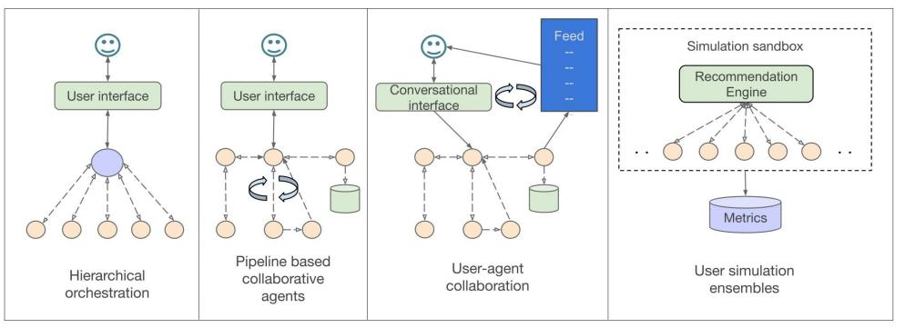
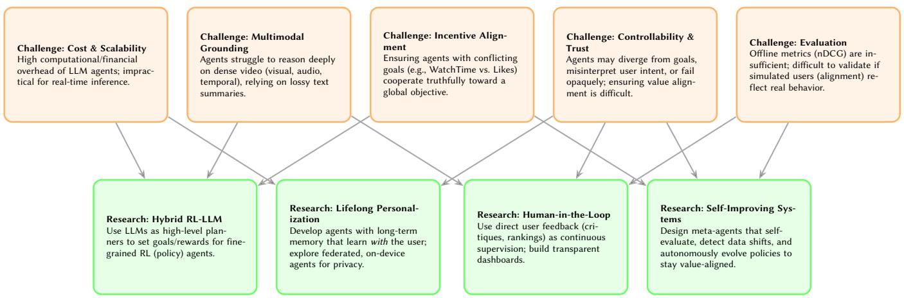

# Multi-Agent Video Recommenders: Evolution, Patterns, and Open Challenges

Srivaths Ranganathan

Google LLC

Mountain View, USA srivaths@google.com

Anushree Sinha

Google LLC

Mountain View, USA sinhaanushree@google.com

Abhishek Dharmaratnakar

Google LLC

San Bruno, USA dharmaratnakar@google.com

Debanshu Das

Google LLC

Mountain View, USA debanshu@google.com

# Abstract

Video recommender systems are among the most popular and impactful applications of AI, shaping content consumption and influencing culture for billions of users. Traditional single-model recommenders, which optimize static engagement metrics, are increasingly limited in addressing the dynamic requirements of modern platforms. In response, multi-agent architectures are redefining how video recommender systems serve, learn, and adapt to both users and datasets. These agent-based systems coordinate specialized agents responsible for video understanding, reasoning, memory, and feedback, to provide precise, explainable recommendations.

In this survey, we trace the evolution of multi-agent video recommendation systems (MAVRS). We combine ideas from multi-agent recommender systems, foundation models, and conversational AI, culminating in the emerging field of large language model (LLM)- powered MAVRS. We present a taxonomy of collaborative patterns and analyze coordination mechanisms across diverse video domains, ranging from short-form clips to educational platforms. We discuss representative frameworks, including early multi-agent reinforcement learning (MARL) systems such as MMRF and recent LLM-driven architectures like MACRec and Agent4Rec, to illustrate these patterns. We also outline open challenges in scalability, multimodal understanding, incentive alignment, and identify research directions such as hybrid reinforcement learning–LLM systems, lifelong personalization and self-improving recommender systems.

# CCS Concepts

• Information systems Recommender systems; $\bullet$Computing methodologies Multi-agent systems.

# Keywords

Recommender systems, Large language models, Multi-agent systems

This work is licensed under a Creative Commons Attribution 4.0 International License.

WSDM Companion ’26, Boise, ID, USA

© 2026 Copyright held by the owner/author(s).

ACM ISBN 979-8-4007-2358-2/2026/02 https://doi.org/10.1145/3779211.3795739

# ACM Reference Format:

Srivaths Ranganathan, Abhishek Dharmaratnakar, Anushree Sinha, and Debanshu Das. 2026. Multi-Agent Video Recommenders: Evolution, Patterns, and Open Challenges. In The Nineteenth ACM International Conference on Web Search and Data Mining (WSDM Companion ’26), February 22–26, 2026, Boise, ID, USA. ACM, New York, NY, USA, 8 pages. https://doi.org/10.1145/ 3779211.3795739

# 1 Introduction and Motivation

Recommender systems (RSs) have become essential for navigating the vast and growing landscape of video on the internet [1, 27, 39]. They curate personalized feeds, improve user satisfaction, and support the attention economy across platforms for short-form entertainment, music streaming, live broadcasts, and educational media. Conventional RS pipelines, whether collaborative filtering [24, 38], deep sequential models [23, 43], or reinforcement-learning optimizers [29, 44], operate largely as single-agent systems, optimizing one global objective (e.g., click-through rate or watch time). This paradigm not only neglects competing goals, such as diversity, fairness, and explainability [5, 63], but also hinders the system from adapting to the dynamic and complex nature of real-world environments, including heterogeneous content, evolving user intent, and complex feedback loops. [18, 34].

Recent progress in multi-agent learning has introduced decentralized and cooperative paradigms that decompose the recommendation process into interacting roles. Each agent can specialize in tasks, such as perception, reasoning, or feedback integration, jointly optimizing a shared objective through communication and coordination [48, 50]. These developments reveal that a multi-agent design can solve more complex user problems, increasing recommendation quality and user engagement [3].

Concurrently, the emergence of foundation models (FMs) [large language and multimodal models trained on vast corpora] has transformed how recommender systems can represent, reason, and interact [4, 14, 46]. FMs enable zero-shot generalization [20, 37], natural-language interfaces, and cross-modal reasoning over text, vision, and audio. When coupled with multi-agent coordination, they form the basis of agentic recommender systems which autonomously plan, reflect, use tools and coordinate with other agents to achieve their goals. [19, 48].

Despite this rapid progress, the field lacks a unified taxonomy that bridges classical multi-agent reinforcement learning with these emerging foundation-model paradigms across diverse video ecosystems [54, 60]. Prior surveys have focused either on Multi-Agent RL or on foundation models in traditional recommendation systems or collaboration in generic multi-agent systems, leaving a gap in understanding how these streams converge in modern recommender systems [65]. Overall, this work aims to build that bridge for the domain of multi-agent video recommendation systems (MAVRS), outlining a pathway toward self-improving, transparent, and trustworthy next-generation video recommenders.

# Why Video Recommenders

Although some of the underlying principles presented in this paper can be generalized to other recommendation domains, the largescale, high-impact nature of modern video recommenders makes them a perfect testbed for developing and validating LLM-powered multi-agent systems. While traditional architectures suffice for text or product IDs, video recommendation presents a unique ’modality gap’ that necessitates agentic decomposition. Unlike text, which can be tokenized directly into an LLM’s context window, video is high-dimensional, temporal, and multimodal. No single foundation model can currently ingest a user’s entire long-term video watch history at the pixel level to perform reasoning. Multi-agent systems solve this by decoupling perception from reasoning: specialized ’Perception Agents’ compress raw video into semantic summaries, while ’Reasoning Agents’ utilize these lightweight textual representations to perform logic-heavy personalization. This modularity allows MAVRS to scale video understanding without hitting the context limits that plague single-model generative approaches.

# 2 Background and Related Work

Before the advent of multi-agent and LLM-driven frameworks, the field of recommender systems was dominated by two primary paradigms: collaborative filtering and content-based filtering. Collaborative filtering (CF) operates on the principle of homophily, identifying users with similar taste profiles to make recommendations based on what analogous users have enjoyed [39]. Contentbased (CB) methods, in contrast, focus on the intrinsic properties of items and recommend content with features similar to those a user has previously rated positively [1, 24]. While often effective, these classical approaches face challenges such as the "cold start" problem for new users or items, data sparsity in user-item interaction matrices, and a limited ability to capture the dynamic, multi-faceted nature of user intent [5]. These challenges paved the way for more complex, decentralized models, which form the basis of modern multi-agent systems [18, 34, 43, 62].

# Multi-Agent Recommender Systems

Early multi-agent recommender systems (MARS) emerged from distributed AI research, where the goal was to decompose recommendation subtasks among cooperative software entities [41, 53]. Selmi et al. (2014) identified four canonical roles: interface agents that interact with users, filtering agents that match items to preferences, learning agents that update profiles, and mediator agents that resolve conflicts across heterogeneous sources. Subsequent systems incorporated negotiation, trust modeling, and content aggregation to enhance autonomy and scalability [5]. Although these designs improved modularity, they relied heavily on symbolic reasoning and rule-based communication, limiting adaptability in large-scale, dynamic video environments. The success of deep reinforcement learning (DRL)—notably the Deep Q-Network (DQN) [29]—catalyzed a wave of research towards optimizing multi-agent recommender systems using DRL [27, 44]. In MARL, multiple agents learn coordinated policies through shared or partially shared rewards. Modelbased methods such as MMRF optimize heterogeneous feedback signals (e.g., watch-time, like-rate, dwell-time) using attention-based message passing among agents for stable off-policy learning [48].

# Foundation-Model-Powered Recommendation

Foundation models (FMs),large language and multimodal transformers, have redefined how recommender systems can represent and reason about content [2, 4, 14, 35, 46]. Large Language Models (LLMs) provide enhanced generalization abilities, having trained on extensive datasets, allowing them to understand complex patterns and handle new items or user trends effectively [11, 45]. They offer improved explanation and reasoning capabilities by providing more comprehensive and context-aware justifications [32, 63]. Additionally, LLMs enhance personalization and interactivity through their natural language processing features, enabling dynamic adaptation to user feedback and preferences [7]. They can also allow users to have more fine-tuned control over the system’s understanding of user preferences and, subsequently, the recommended content [3].

LLMs have been integrated into RS through three main paradigms: (i) feature-based, using FMs as embedding extractors for user and item representations [50]; (ii) generative, treating recommendation as text or sequence generation by prompting or fine-tuning [4, 14]; and (iii) agentic, where the LLM serves as the core of autonomous reasoning that plans, memorizes, and interacts through natural language [3].

# Agentic Frameworks

Recent studies combine multi-agent coordination with LLM reasoning to create conversational and collaborative recommenders. An LLM-based recommender agent is an autonomous entity designed to perceive its environment, make decisions, and take actions within a recommendation scenario [7].

MACRec and its extension MACRS organize LLM agents into hierarchical roles—manager, analyst, searcher, reflector, and interpreter— to perform sequential and dialogue-based tasks [50]. EmotionRec and MusicAgent further incorporate multimodal affect detection, enabling personalized music and video recommendation grounded in user emotion and context [3, 58]. These systems demonstrate that emotional awareness and cooperative reasoning can significantly enhance engagement and trust [48].

# 3 Collaborative Multi-Agent Video Recommender Patterns

The collaborative interactions between LLM agents in video recommendation can be categorized into distinct architectural patterns. This taxonomy classifies systems according to the primary mechanism of agent interaction and the overarching goal of the collaboration, revealing how different structures are engineered to solve

*Figure 1: Illustration of Multi-agent Video Recommender patterns highlighting an example for each pattern in Section 3.*

specific problems. The following sections detail prominent architectures, each illustrated with a key example from recent research [48].

# 3.1. Hierarchical Orchestration

This architecture employs a central coordinating agent that directs the actions and integrates the outputs of specialized, subordinate agents to achieve a unified objective. The collaboration pattern is explicitly top-down, with the coordinating agent orchestrating the contributions of the agentic group. Subordinate agents may operate in two primary modes: (1) collaboratively, to jointly identify an optimal recommendation, or (2) competitively, proposing distinct recommendations from which the coordinating agent selects based on user signals or other optimization criteria [36, 47].

A prominent example of this model is the Model-based Multiagent Ranking Framework (MMRF), [66] designed to maximize user WatchTime on a short-video platform. In MMRF, a main agent is dedicated to the primary objective (WatchTime) and is supported by auxiliary agents, each tasked with maximizing a secondary user interaction signal (e.g., Follow, Like, Comment). Coordination is achieved via an “Attentive Collaboration Mechanism,” which permits the main agent to dynamically weigh and integrate salient information from the auxiliary agents. This hierarchical structure allows the system to optimize for a primary metric while strategically leveraging correlated signals from secondary user preferences.

The MMAgentRec system [56], applied in the tourism domain, presents a conceptual variation. It prompts a single LLM to simulate multiple expert personas from diverse domains (e.g., natural sciences, social sciences, humanities), which then provide interdisciplinary advice on a user’s request. This framework also incorporates a “reflection mechanism,” enabling the LLM to self-critique its outputs and refine its decision-making [32]. This approach leverages the LLM’s latent knowledge by structuring its reasoning process as an internal, collaborative dialogue among simulated experts [3].

This architectural pattern can be generalized to multiple, distinct agents, each parameterized with specific prompts or inputs to optimize for different objectives. In a video RS context, this could be implemented as specialized agents recommending content from different domains (e.g., News, Education, Music) or optimizing for divergent engagement goals (e.g., long-term user value vs. shortterm engagement) [8, 48].

# 3.2. Pipeline-based Modular Collaboration

In this architectural pattern, agents operate sequentially, forming a processing pipeline where each agent executes a distinct, specialized task. The output of one agent serves as the direct input for the next, establishing a modular workflow that decomposes a complex problem into manageable stages. This pattern is analogous to traditional, non-agentic industry systems where distinct engineering teams manage separate data processing pipelines (e.g., video processing and indexing, user history summarization, model training) that write intermediate outputs to offline databases [1, 12, 18, 65].

The VRAgent-R1 system demonstrates this approach, utilizing a two-stage pipeline to enhance video recommendation performance:

- (1) Item Perception (IP) Agent: This initial agent processes raw, multimodal video content. It employs a “human-like progressive thinking” process to move beyond surface-level features, generating an enhanced semantic summary that captures latent, recommendation-relevant semantics [2, 25, 35].
- (2) User Simulation (US) Agent: The semantic summary from the IP Agent enriches the base recommender model’s item representations. The US Agent leverages this enhanced understanding to simulate user decisions. This agent’s feedback is integrated into a reinforcement learning (RL) loop, with rewards for predicting the next video watched by the user and for providing Chain of Thought reasoning of whether a user would like a specific video. The resulting learned policy is better aligned with human preferences, and subsequently generates higher-quality recommendations [29, 44].

In contrast to the two-stage VRAgent-R1, the authors of MACRec propose a conversational recommender system with an alternative task decomposition [52]:

- • Manager: Assigns sub-tasks to other agents, aggregates their responses, and reasons about the task status to generate a final response to the user or instantiate new sub-agents.
- • Reflector: Evaluates the Manager’s proposed response and provides critical feedback for improvement. The Manager

uses this feedback to decide whether to share the current recommendation with the user or iterate further [32].

- • User/Item Analyst: Provides a nuanced analysis of both user preferences and item content. This role is analogous to the combined functions of the IP and US agents in VRAgent-R1.
- • Searcher: Executes search queries and summarizes the results for the Manager. This two-stage process (search-thensummarize) optimizes token consumption for the Manager agent [3].
- • Task Interpreter: Interfaces with the user, converting natural language queries into structured task descriptions for the Manager. It also maintains the conversational state and history across multiple Manager calls [15, 21].

# 3.3. User-Agent Collaboration

In this architecture, multiple agents collaborate internally to power a single, user-facing conversational interface (within a broader recommendation surface) where the primary objective is not to provide recommendations, but to empower the end-user with direct, intuitive control over their recommendation feed, thereby enhancing their “sense of agency” [16].

TKGPT [30] is a system designed around this principle. It functions as an LLM-enhanced chatbot that allows users to modify their TikTok “For You” page through natural language. This is achieved through a partnership between two internal assistants. The Recommender Assistant interprets the user’s conversational requests to generate relevant keywords for video topics. The Sorting Assistant uses the LLM to assign weights to these keywords, which determine the proportion of videos for each topic in the next batch of 32 videos. These videos are then shuffled and presented to the user. This collaboration translates a user’s natural language intent into concrete algorithmic adjustments via a proportional allocation and batch-based update mechanism, creating a direct and transparent control interface [15, 21].

# 3.4. User Simulation Agent Ensembles

This architecture uses agents not as the core recommender, but as a simulated population of users. The goal is to generate highfidelity synthetic interaction data, which can be used to evaluate system performance offline, train other models, or study complex user behavior phenomena without the cost and risk of live A/B testing [36, 48].

Agent4Rec [59] is the primary example of this pattern, creating a simulator with thousands of LLM-empowered generative agents [48]. Each agent is initialized from real-world datasets with a detailed profile, including unique tastes and social traits like activity (interaction frequency) and conformity (alignment with popular sentiment). The central goal is to achieve “agent alignment” by ensuring simulated behaviors are faithful to those of real humans, allowing the ensemble to replicate effects like the “filter bubble” [64]. The US Agent from VRAgent-R1 also serves as a simulation agent. These two systems exemplify different philosophies for achieving alignment: Agent4Rec relies on rich, static profiling initialized from real data, whereas VRAgent-R1’s US Agent uses a dynamic, in-loop training method—Reinforcement Learning with Group Relative Policy Optimization (GRPO)—to continuously align its behavior with real user decisions [10].

This simulation pattern can be used to create a sandbox for testing multi-agent systems’ insights on social norms and governance. For example, Agent4Rec’s modeling of user ensembles allows researchers to prototype various agent incentive formulations and observe emergent behaviors (like filter bubbles) without real-world risk.

# 4 Agent-centric Evaluation

Evaluating multi-agent recommender systems (MARS) differs fundamentally from classical single-model recommenders because multiple agents interact, negotiate, and learn concurrently [13, 64]. Standard metrics such as Precision@K and NDCG remain necessary to measure the quality of the recommendations [1, 18] but are insufficient to capture coordination, reasoning quality, and emergent behaviors of the agentic framework itself [21, 61]. A comprehensive evaluation must therefore be multi-dimensional, assessing not only the final output but also the internal processes of the agents [64, 65]. We propose five key dimensions for a holistic, agent-centric evaluation.

# 4.1. Task-Specific Quality

This dimension evaluates the performance of an individual agent on its specialized sub-task, separate from the final recommendation [32, 64].

- • For Perception Agents (e.g., the IP Agent in VRAgent-R1): Evaluation can involve comparing the agent-generated representation/summary for a sample of videos against humangenerated summaries or ground-truth labels using metrics like ROUGE, BERTScore, or emotion-based recognition signals [2, 6, 25, 35].
- • For Reasoning Agents (e.g., the "reflection mechanism" in MMAgentRec): Evaluation is often qualitative, assessing the logical coherence, factuality, and self-correction capability of the agent’s internal monologue or "scratchpad" [32].
- • For Specialized Recommenders (e.g., the auxiliary agents in MMRF): These can be evaluated on their own proxy metrics (e.g., can the ’Like’ agent predict ’Likes’ with high precision?).

# 4.2. Coordination & Collaboration Efficiency

This dimension assesses the interaction between agents, focusing on the overhead and effectiveness of their collaboration.

- • Communication Overhead: This is a critical metric for LLM-based systems, measured in the number of tokens, messages, or API calls exchanged between agents to reach a decision. The "Searcher" agent in MACRec is an example of a design that explicitly optimizes this [21, 64].
- • Latency: The end-to-end time from user request to final recommendation. This is vital for real-time video feeds and includes the cumulative processing and communication time of all agents in the chain [13, 22].
- • Contribution Alignment: In hierarchical systems like MMRF, this measures whether the auxiliary agents’ contributions

<table><tr><td>Pattern</td><td>Primary Evaluation Focus</td><td>Representative Metrics</td><td>Critical Failure Points &amp; Risks</td></tr><tr><td>Hierarchical Orchestration (e.g., MMRF, MMAgentRec)</td><td>Orchestration Effectiveness: How well does the central agent integrate diverse sub-goals to optimize the primary system objective?</td><td>Main objective metric (e.g., WatchTime), contribution weights (from attentive mechanism), system-wide latency.</td><td>Coordinator Bottleneck: The central agent becomes a single point of failure. Conflicting Goals: Auxiliary agents may work at cross-purposes, harming the main objective.</td></tr><tr><td>Pipeline-based Modular (e.g., VRAgent-R1, MACRec)</td><td>End-to-End Task Quality: How well does the final output perform after passing through all sequential stages?</td><td>Quality of intermediate outputs, error propagation rate, end-to-end latency.</td><td>Compounding Errors and Brittleness: An error in an early agent (e.g., IP Agent) can degrade the entire chain.</td></tr><tr><td>User-Agent Collaboration (e.g., TKGPT)</td><td>User-Perceived Agency: Does the user feel in control and satisfied with the system&#x27;s response to their natural language commands?</td><td>User satisfaction (SUS scores), task success rate (from user studies), latency from command to feed update.</td><td>Misinterpretation: The system may misunderstand the user&#x27;s (often ambiguous) intent and make drastic, undesirable changes to recommendations.</td></tr><tr><td>User Simulation Ensemble (e.g., Agent4Rec)</td><td>Behavioral Fidelity: How accurately does the simulated agent population replicate the statistical properties of real human users?</td><td>KL divergence (or similar) between simulated and real interaction distributions; replication of known macro-effects (e.g., filter bubbles).</td><td>Lack of Generalization: Agents overfit to initialization data and fail to model novel behaviors. Prohibitive Cost: High computational overhead for running thousands of LLM agents.</td></tr></table>

*Table 1: Evaluation of collaborative multi-agent video recommender architectures. Metrics emphasize coordination, user alignment, and computational feasibility.*

(e.g., ’Follow’ signal) are weighted appropriately and genuinely improve the main agent’s primary objective (’WatchTime’).

# 4.3. System-Level & Emergent Properties

This dimension evaluates the macro-behavior of the entire system, particularly its stability and adaptability [15, 64].

- • Robustness & Fault Tolerance: This tests how the system handles the failure of a single agent. Does a pipeline-based system collapse (a "brittle" failure), or can a hierarchical system’s coordinator route around the failed agent [13, 15]?
- • Adaptability: This measures how quickly the agent ensemble can adapt to new items, new user interests, or a shift in the data distribution. This is a key goal for systems using RL (like VRAgent-R1) and "lifelong personalization" [7, 29, 44].
- • Emergent Behavior Accuracy: For user simulation ensembles like Agent4Rec, this is the primary evaluation. It involves measuring the statistical divergence (e.g., KL divergence) between the simulated interaction data and real user data [61, 64].

# 4.4. Human-Alignment & User-Centric Metrics

This dimension moves beyond offline metrics to measure the system’s impact on the end-user experience, which is often the primary goal [6, 13, 61, 64].

- • Controllability & Agency: For systems like TKGPT, the core metric is the user’s "sense of agency." This is measured via user studies, assessing whether users feel their natural language commands are correctly interpreted and lead to a satisfying change in their feed [61, 64].
- • Explainability: A MARS architecture should naturally provide better explainability [62, 63]. Evaluation can involve user studies where participants rate the quality of explanations generated by the system (e.g., "The ’Education’ agent suggested this video, and the ’Sorting’ agent prioritized it because you asked for ’deep dives’") [13, 61].
- • Trustworthiness: This is a longitudinal user-study metric measuring whether users trust the system’s recommendations and explanations over time [16, 64].
- • Fairness: The quality of reasoning agents and user simulation agents strongly affects bias in the recommendations for specific slices or users or content [5, 28]. Standard fairness metrics that measure equal exposure for items, such as

Jain’s Index or Gini Index, and metrics based on user group disparity (like Equalized Odds or Demographic Parity) can be used to measure end-to-end fairness [51, 61].

# 4.5. Scalability & Economic Viability

This practical dimension assesses the cost of deploying and maintaining the MARS [9, 42, 64]. For LLM-driven agents, the total token cost per user request or per recommendation batch and the end-to-end latency for the coordinating agents to generate a recommendation [42, 64] are important to measure. For systems using RL (VRAgent-R1) or large-scale simulation (Agent4Rec), the computational resources (GPU hours, real-user data) required to train or align the agents before they produce high-fidelity results [55, 64] can be measured.

# 5 Challenges and Open Problems

Despite the rapid progress in LLM-powered multi-agent recommenders, deploying MAVRS at industry scale presents significant challenges, limiting their current utility and trustworthiness [10, 65].

# 5.1 Computational Cost and Scalability

The reliance on large language models (LLMs) as the cognitive core for agents introduces significant computational and financial overhead. Architectures like Agent4Rec, which simulate thousands of agents, are prohibitively expensive for most research labs and impractical for real-time training or inference in production RS [42]. Lightweight, "distilled" agent models or more efficient tokensharing mechanisms might offer a path forward to widespread adoption [9, 65].

# 5.2 Multimodal Grounding and Reasoning

Video is an inherently dense medium packed with informationa cross modalities: visual, audio, textual and temporal. Current agents, especially those built on text-centric LLMs, struggle to "ground" their reasoning in this rich data. While systems like VRAgent-R1 employ an Item Perception (IP) Agent to generate semantic summaries, this is often a lossy compression [25]. The challenge lies in enabling agents to perform deep, cross-modal reasoning directly on video streams, moving beyond metadata and text summaries to

*Figure 2: Challenges and Future Research Directions for Multi-Agent Video Recommendation Systems (MAVRS).*

cohesively understanding the content of the video [2, 20, 21, 35].

# 5.3 Evaluation

As discussed in the previous section, evaluating the performance of complex, collaborative agent systems is an open problem. Offline metrics (e.g., nDCG, MRR) may not capture the subjective benefits of context-aware, conversational recommendation [1, 18]. Furthermore, user simulation ensembles (Agent4Rec, VRAgent-R1) face an alignment problem: ensuring that synthetic agent behavior is a high-fidelity proxy for real human behavior, including irrationality, conformity, and drift [10, 36]. Without robust validation, it is difficult to trust simulation-based findings or offline training [61].

# 5.4 Controllability and Trustworthiness

As agents become more autonomous, ensuring they are controllable, robust, and aligned with human values becomes essential [16, 21, 61]. In hierarchical systems (MMRF), a subordinate agent could diverge and optimize its secondary metric at the expense of the primary goal [10]. In conversational systems (TKGPT), the translation of user intent into algorithmic action must be transparent and faithful [25, 63]. Agents could also fail in a silent, opaque manner, causing errors to propagate through other downstream agents [32, 36].

# 5.5 Incentive Alignment

In multi-agent systems, agents must be incentivized to collaborate effectively [36]. In current recommenders, this is implicit (e.g., optimizing a shared goal). However, as systems grow in complexity, agents with different objectives (e.g., user WatchTime vs. user Likes in MMRF) may enter into conflict. A key challenge is to design explicit coordination mechanisms, potentially borrowing from computational economics (e.g., auctions, contract theory) [31, 64]. These mechanisms can help the high-level agent ensure subordinate agents cooperate truthfully and robustly toward the global system objective, even under uncertainty or conflicting signals [21, 61]. However, unlike computational economics, incentives in LLM-based agents are configured via natural language, which allows room for the underlying LLM to interpret the prompt in ways that differ from what the developer intended. [57]

# 6 Future Directions

Addressing the challenges above requires unifying algorithmic efficiency, realistic evaluation, and human alignment [15, 61]. Future research should treat multi-agent recommendation as a sociotechnical system integrating cognition, collaboration, and ethics [16, 36]. These challenges also highlight specific directions for future research, focusing on the development of more intelligent, adaptive, and human-centric systems.

# 6.1. Hybrid RL-LLM Architectures

A promising frontier is the deeper integration of Reinforcement Learning (RL) and LLMs. LLMs excel at high-level reasoning, planning, and understanding user intent (as seen in TKGPT or the Manager MACRec), while RL excels at fine-grained policy optimization in dynamic environments (as seen in VRAgent-R1). Future systems may use an LLM as a "planner" to set high-level goals or generate reward-shaping functions for a subordinate RL agent, creating a hybrid system that is both context-aware and adaptive to user feedback [29, 44, 64]. These emerging “planner–executor” hybrid systems show promise for scaling such coordination while maintaining explainablity [17, 25].

# 6.2. Lifelong Personalization and Agent Memory

Current models largely operate on a session- or user-profile-level memory. The next step is lifelong personalization, where agents build and maintain a dynamic, long-term memory of user preferences and evolving interests. This involves moving beyond static profiles (Agent4Rec) to models where agents can reason over their interaction history, self-correct past assumptions, and proactively adapt to a user’s long-term personal journey, effectively learning with the user. This requires new designs for maintaining a summarized version of long-term user preference history [7, 26, 49].

A promising research area here is Federated Collaboration, which applies federated learning principles to the multi-agent paradigm. A local "User Profile Agent," co-located with the user (such as on the device), could perform deep, lifelong personalization using raw interaction data that never leaves the device. The local agent can interact with online RS agents while optimizing for privacy and user well-being [21, 42].

# 6.3. Human-in-the-Loop Validation

Long-term trust depends on user participation [5, 63]. Crowdsourced or platform-integrated feedback, where users critique and rank recommendations, can serve as continuous supervision [15, 21]. Interactive dashboards visualizing reasoning and fairness tradeoffs will enhance transparency and literacy among users and regulators [16, 61]. In the long term, we can derive these signals directly using optimized multimodal affect detection (e.g., facial expression or tone analysis) to enhance personalization [6].

# 6.4. Toward Self-Improving Recommenders

The next frontier is self-governing ecosystems where agents perceive, reason, and evolve collaboratively [15, 48]. Such multi-agent architectures should enable a meta-agent to evaluate reasoning quality, detect distributional shifts, and autonomously propose schema or policy updates [7, 21]. The system should understand cause and effect and evolve its strategies to achieve better outcomes than optimizing for short-term objectives like watch time [33, 40]. By self-reflecting to continuously optimizing the behavior and incentives of the modular internal agents, these multi-agent systems can evolve from content delivery tools into recommenders that are closely aligned with human values [16, 61].

# References

- [1] Gediminas Adomavicius and Alexander Tuzhilin. 2005. Toward the next generation of recommender systems: A survey of the state-of-the-art and possible extensions. IEEE Transactions on Knowledge and Data Engineering 17, 6 (2005), 734–749.
- [2] Jean-Baptiste Alayrac, Jeff Donahue, Paul Luc, Antoine Miech, Iain Barr, Yana Hasson, et al. 2022. Flamingo: a visual language model for few-shot learning. Advances in Neural Information Processing Systems 35 (2022), 23716–23730.
- [3] Ronald Carvalho Boadana, Ademir Guimarães da Costa Junior, Ricardo Rios, and F’abio Santos da Silva. 2025. LLM-based intelligent agents for music recommendation: A comparison with classical content-based filtering. arXiv preprint arXiv:2508.11671 (2025).
- [4] Tom Brown, Benjamin Mann, Nick Ryder, Melanie Subbiah, Jared D Kaplan, Prafulla Dhariwal, et al. 2020. Language models are few-shot learners. Advances in Neural Information Processing Systems 33 (2020), 1877–1901.
- [5] Robin Burke. 2017. Multisided fairness for recommendation. ACM Transactions on Recommender Systems 1, 1 (2017), 1–32.
- [6] Vikrant Chaugule, D. Abhishek, Aadheeshwar Vijayakumar, Pravin Bhaskar Ramteke, and Shashidhar G. Koolagudi. 2016. Product Review Based on Optimized Facial Expression Detection. In Proceedings of the Ninth International Conference on Contemporary Computing (IC3). IEEE, 1–6. doi:10.1109/IC3.2016.7880213
- [7] Boyu Chen, Tong Yu, and Chengkai Huang. 2024. Lifelong personalization with LLM-based agentic recommenders. arXiv preprint arXiv:2408.11567 (2024).
- [8] Chen Chen, Shoujin Wang, and Longbing Chen. 2023. Multi-Objective Recommendation: Theory, Methods, and Applications. IEEE Transactions on Knowledge and Data Engineering (2023).
- [9] Kai Chen, Dong Zhou, and Tong Yu. 2024. Efficient foundation model fine-tuning for large-scale recommender systems. arXiv preprint arXiv:2406.00132 (2024).
- [10] Siran Chen, Boyu Chen, Chenyun Yu, Yuxiao Luo, Yi Ouyang, Cheng Lei, Chengxiang Zhuo, Li Zang, and Yali Wang. 2025. VRAgent-R1: Boosting video recommendation with MLLM-based agents via reinforcement learning. arXiv preprint arXiv:2507.02626 (2025).
- [11] Aakanksha Chowdhery, Sharan Narang, Jacob Devlin, Maarten Bosma, Gaurav Mishra, Adam Roberts, Paul Barham, Hyung Won Chung, Charles Sutton, Sebastian Gehrmann, et al. 2023. Palm: Scaling language modeling with pathways. Journal of Machine Learning Research 24, 240 (2023), 1–113.
- [12] Fabio Da Silva, Leandro Marcolino, et al. 2023. A Survey on Multi-Agent Reinforcement Learning: From Decentralized to Hierarchical Architectures. IEEE Transactions on Artificial Intelligence (2023).

- [13] Allan Dafoe, Yoram Bachrach, Gillian Hadfield, Eric Horvitz, Kate Larson, and Thore Graepel. 2021. Cooperative AI: Machines must learn to find common ground. Nature 593, 7857 (2021), 33–36. doi:10.1038/d41586-021-01170-0
- [14] Jacob Devlin, Ming-Wei Chang, Kenton Lee, and Kristina Toutanova. 2019. BERT: Pre-training of deep bidirectional transformers for language understanding. In Proceedings of NAACL-HLT. 4171–4186.
- [15] Jiabao Fang, Shen Gao, Pengjie Ren, Xiuying Chen, Suzan Verberne, and Zhaochun Ren. 2024. A multi-agent conversational recommender system. arXiv preprint arXiv:2402.01135 (2024).
- [16] Luciano Floridi and Josh Cowls. 2019. Establishing the rules for building trustworthy AI. Nature Machine Intelligence 1, 6 (2019), 261–262.
- [17] Marta Garnelo and Murray Shanahan. 2019. Reconciling deep learning with symbolic artificial intelligence: representing objects and relations. Current Opinion in Behavioral Sciences 29 (2019), 17–23.
- [18] Xiangnan He, Lizi Liao, Hanwang Zhang, Liqiang Nie, Xia Hu, and Tat-Seng Chua. 2017. Neural collaborative filtering. In Proceedings of the 26th International Conference on World Wide Web (WWW). 173–182.
- [19] Zhankui He, Xiangnan Chen, Hanwang Zhang, Weizhi Ma, and Min Zhang. 2020. Multi-Module Cooperation for Recommendation via Reinforcement Learning. In Proceedings of the 14th ACM Conference on Recommender Systems (RecSys). ACM, 160–169.
- [20] Zhankui He, Zhouhang Xie, Rahul Jha, Harald Steck, Dawen Liang, Yesu Feng, Bodhisattwa Prasad Majumder, Nathan Kallus, and Julian McAuley. 2023. Large language models as zero-shot conversational recommenders. In Proceedings of the 32nd ACM international conference on information and knowledge management. 720–730.
- [21] Chengkai Huang, Hongtao Huang, Tong Yu, Kaige Xie, Junda Wu, Shuai Zhang, Julian McAuley, Dietmar Jannach, and Lina Yao. 2025. A survey of foundation model-powered recommender systems: From feature-based, generative to agentic paradigms. IEEE Transactions on Knowledge and Data Engineering (2025).
- [22] Chengkai Huang, Junda Wu, Yu Xia, Zixu Yu, Ruhan Wang, Tong Yu, Ruiyi Zhang, Ryan A Rossi, Branislav Kveton, Dongruo Zhou, Julian McAuley, and Lina Yao. 2025. Towards agentic recommender systems in the era of multimodal large language models. arXiv preprint arXiv:2503.16734 (2025).
- [23] Wang-Cheng Kang and Julian McAuley. 2018. Self-attentive sequential recommendation. In Proceedings of the 2018 IEEE International Conference on Web Search and Data Mining (WSDM). 197–206.
- [24] Yehuda Koren, Robert Bell, and Chris Volinsky. 2009. Matrix factorization techniques for recommender systems. Computer 42, 8 (2009), 30–37.
- [25] Junnan Li, Dongxu Li, Silvio Savarese, and Steven Hoi. 2023. Blip-2: Bootstrapping language-image pre-training with frozen image encoders and large language models. In International conference on machine learning. PMLR, 19730–19742.
- [26] Xiang Li, Rui Wang, and Jin Xu. 2024. P4LM: Policy learning with pretrained language models for recommender adaptation. arXiv preprint arXiv:2403.09145 (2024).
- [27] Elad Liebman, Maytal Saar-Tsechansky, and Peter Stone. 2015. DJ-MC: A reinforcement-learning agent for music playlist recommendation. In Proceedings of the 14th International Conference on Autonomous Agents and Multiagent Systems (AAMAS). Istanbul, Turkey, 591–598.
- [28] Ninareh Mehrabi, Fred Morstatter, Nripsuta Saxena, Kristina Lerman, and Aram Galstyan. 2021. A survey on bias and fairness in machine learning. Comput. Surveys 54, 6 (2021), 1–35. doi:10.1145/3457607
- [29] Volodymyr Mnih, Koray Kavukcuoglu, David Silver, Andrei A Rusu, et al. 2015. Human-level control through deep reinforcement learning. Nature 518, 7540 (2015), 529–533.
- [30] Shuo Niu, Dikshith Vishnuvardhan, and Venkata Sai Reddy Punnam. 2025. Chat with the ‘For You’Algorithm: An LLM-Enhanced Chatbot for Controlling Video Recommendation Flow. In Proceedings of the 7th ACM Conference on Conversational User Interfaces. 1–16.
- [31] Elinor Ostrom. 1990. Governing the Commons: The Evolution of Institutions for Collective Action. Cambridge University Press.
- [32] Long Ouyang, Jeffrey Wu, Xu Jiang, Diogo Almeida, Carroll Wainwright, Pamela Mishkin, Chong Zhang, Sandhini Agarwal, Katarina Slama, Alex Ray, et al. 2022. Training language models to follow instructions with human feedback. Advances in neural information processing systems 35 (2022), 27730–27744.
- [33] Jonas Peters, Dominik Janzing, and Bernhard Schölkopf. 2017. Elements of Causal Inference: Foundations and Learning Algorithms. MIT Press, Cambridge, MA.
- [34] Massimo Quadrana, Paolo Cremonesi, and Dietmar Jannach. 2018. Sequenceaware recommender systems. Comput. Surveys 51, 4 (2018), 1–36.
- [35] Alec Radford, Jong Wook Kim, Chris Hallacy, Aditya Ramesh, Gabriel Goh, Sandhini Agarwal, Girish Sastry, Amanda Askell, Pamela Mishkin, Jack Clark, et al. 2021. Learning transferable visual models from natural language supervision. In International conference on machine learning. PmLR, 8748–8763.
- [36] Iyad Rahwan, Manuel Cebrian, Nick Obradovich, Josh Bongard, Jean-François Bonnefon, Cynthia Breazeal, Jacob W Crandall, Nicholas A Christakis, Iain D Couzin, Matthew O Jackson, et al. 2019. Machine behaviour. Nature 568, 7753 (2019), 477–486.

- [37] Srivaths Ranganathan, Chieh Lo, Bernardo Cunha, Nikhil Khani, Li Wei, Aniruddh Nath, Shawn Andrews, Gergo Varady, Yanwei Song, Jochen Klingenhoefer, et al. 2025. Zero-shot Cross-domain Knowledge Distillation: A Case study on YouTube Music. In Proceedings of the Nineteenth ACM Conference on Recommender Systems. 1122–1125.
- [38] Steffen Rendle. 2010. Factorization machines. In Proceedings of the IEEE International Conference on Data Mining (ICDM). 995–1000.
- [39] Francesco Ricci, Lior Rokach, and Bracha Shapira. 2011. Recommender Systems Handbook. Springer.
- [40] Bernhard Schölkopf, Francesco Locatello, Stefan Bauer, Nan Rosemary Ke, Nal Kalchbrenner, Anirudh Goyal, and Yoshua Bengio. 2021. Toward Causal Representation Learning. Proc. IEEE 109, 5 (2021), 612–634. doi:10.1109/JPROC.2021. 3058954
- [41] Afef Selmi, Zaki Brahmi, and M Gammoudi. 2014. Multi-agent recommender system: State of the art. In Proceedings of the 16th international conference on information and communications security.
- [42] Sam Shleifer, Tri Nguyen, and Percy Liu. 2023. The cost of inference for large models and recommender deployment. arXiv preprint arXiv:2312.07110 (2023).
- [43] Fei Sun, Jun Liu, Jian Wu, Changhua Pei, Xiao Lin, Wenwu Ou, and Peng Jiang. 2019. BERT4Rec: Sequential recommendation with bidirectional encoder representations from transformer. In Proceedings of the 28th ACM International Conference on Information and Knowledge Management (CIKM). 1441–1450.
- [44] Richard S Sutton and Andrew G Barto. 2018. Reinforcement learning: An introduction. MIT Press (2018).
- [45] Hugo Touvron, Thibaut Lavril, Gautier Izacard, et al. 2023. LLaMA: Open and efficient foundation language models. arXiv preprint arXiv:2302.13971 (2023).
- [46] Ashish Vaswani, Noam Shazeer, Niki Parmar, Jakob Uszkoreit, Llion Jones, Aidan N Gomez, Lukasz Kaiser, and Illia Polosukhin. 2017. Attention is all you need. In Advances in Neural Information Processing Systems (NeurIPS). 5998–6008.
- [47] Hao Wang, Fajie Zhang, Xing Xie, and Minyi Guo. 2021. Dueling Bandit Gradient Descent for Recommender Systems. IEEE Transactions on Knowledge and Data Engineering 33, 5 (2021), 2183–2195.
- [48] Qian Wang, Ziqi Huang, Ruoxi Jia, Paul Debevec, and Ning Yu. 2025. MAViS: A multi-agent framework for long-sequence video storytelling. arXiv preprint arXiv:2508.08487 (2025).
- [49] Rui Wang, Chengkai Huang, and Junda Wu. 2025. Rec-R1: Towards reinforcementtuned recommender agents. arXiv preprint arXiv:2501.08765 (2025).
- [50] Wenjie Wang, Xinyu Lin, Fuli Feng, Xiangnan He, and Tat-Seng Chua. 2024. Generative recommendation: Towards next-generation recommender paradigm. ACM Transactions on Recommender Systems 1, 1 (2024), 1–25.
- [51] Yifan Wang, Weizhi Ma, Min Zhang, Yiqun Liu, and Shaoping Ma. 2023. A survey on the fairness of recommender systems. ACM Transactions on Information Systems 41, 3 (2023), 1–43.
- [52] Zhefan Wang, Yuanqing Yu, Wendi Zheng, Weizhi Ma, and Min Zhang. 2024. Macrec: A multi-agent collaboration framework for recommendation. In Proceedings of the 47th International ACM SIGIR Conference on Research and Development in Information Retrieval. 2760–2764.
- [53] Michael Wooldridge. 2009. An introduction to multiagent systems. John Wiley & Sons.
- [54] Junda Wu, Chengkai Huang, Tong Yu, and Lina Yao. 2023. A survey on multimodal recommender systems: Taxonomy, challenges and future directions. arXiv preprint arXiv:2304.03516 (2023).
- [55] Jun Wu, Yifeng Li, Jinhua Zhao, and Jie Tang. 2024. The Economics of Agent-Based AI Systems: Cost, Efficiency, and Market Dynamics. ACM Transactions on Recommender Systems 2, 3 (2024), 1–25. doi:10.1145/3678942 Examines cost-efficiency tradeoffs and scaling economics in multi-agent and LLM-driven recommender systems.
- [56] Xiaochen Xiao. 2025. MMAgentRec, a personalized multi-modal recommendation agent with large language model. Scientific Reports 15, 1 (2025), 12062.
- [57] Jiachen Yang, Ang Li, Mehrdad Farajtabar, Peter Sunehag, Edward Hughes, and Hongyuan Zha. 2020. Learning to incentivize other learning agents. Advances in Neural Information Processing Systems 33 (2020), 15208–15219.
- [58] Dingyao Yu, Kaitao Song, Peiling Lu, Tianyu He, Xu Tan, Wei Ye, Shikun Zhang, and Jiang Bian. 2023. MusicAgent: An AI agent for music understanding and generation with large language models. arXiv preprint arXiv:2310.11954 (2023).
- [59] An Zhang, Yuxin Chen, Leheng Sheng, Xiang Wang, and Tat-Seng Chua. 2024. On generative agents in recommendation. In Proceedings of the 47th international ACM SIGIR conference on research and development in Information Retrieval. 1807– 1817.
- [60] Kaiqing Zhang, Zhuoran Yang, and Tamer Basar. 2021. Multi-Agent Reinforcement Learning: A Selective Overview of Theories and Algorithms. IEEE Transactions on Artificial Intelligence 2, 2 (2021), 320–340.
- [61] Shuai Zhang, Chengkai Huang, Tong Yu, and Lina Yao. 2024. Trust and transparency in agentic recommender systems. arXiv preprint arXiv:2409.12021 (2024).
- [62] Shuai Zhang, Lina Yao, Aixin Sun, and Yi Tay. 2019. Deep learning based recommender system: A survey and new perspectives. Comput. Surveys 52, 1 (2019), 1–38. doi:10.1145/3285029

- [63] Yongfeng Zhang and Xu Chen. 2020. Explainable recommendation: A survey and new perspectives. Foundations and Trends in Information Retrieval 14, 1 (2020), 1–101.
- [64] Yongfeng Zhang, Xu Chen, Shoujin Wang, and Longbing Chen. 2024. Generative Agents for Recommender Systems: Challenges and Opportunities. ACM Transactions on Recommender Systems (2024).
- [65] Kun Zhou, Shuai Zhang, Tong Yu, and Lina Yao. 2024. A survey on large language model applications in recommender systems. arXiv preprint arXiv:2402.05120 (2024).
- [66] Peilun Zhou, Xiaoxiao Xu, Lantao Hu, Han Li, and Peng Jiang. 2024. A Modelbased Multi-Agent Personalized Short-Video Recommender System. arXiv preprint arXiv:2405.01847 (2024).