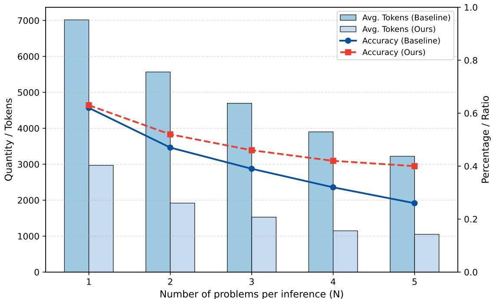
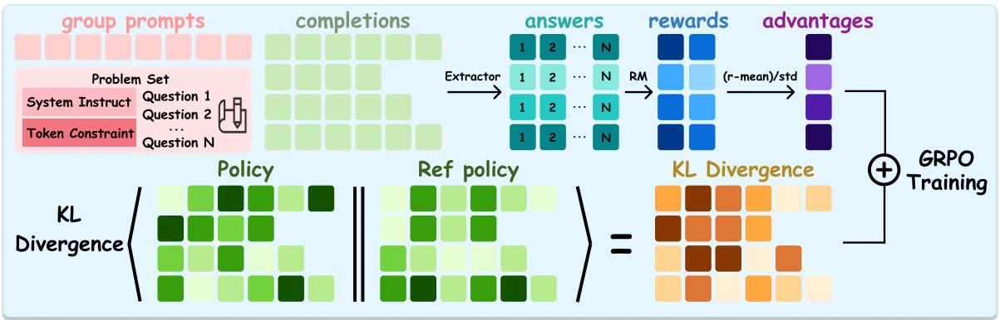
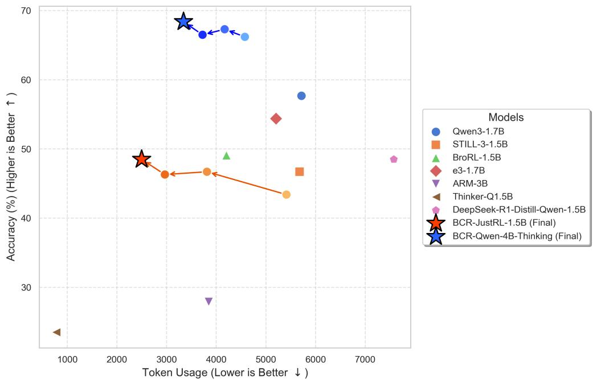
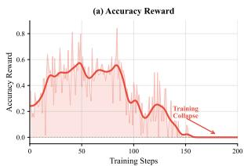
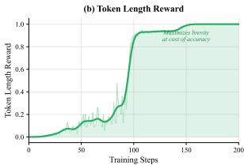
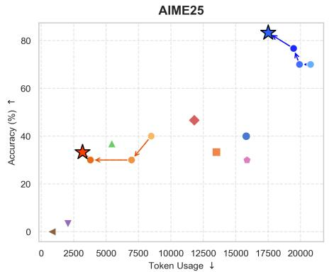
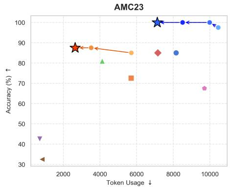
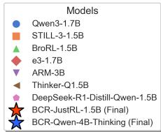
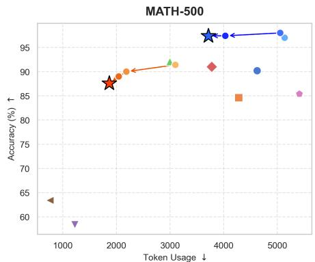
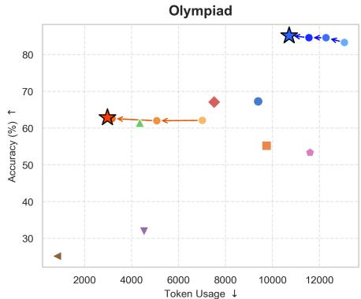

> # Batched Contextual Reinforcement: A Task-Scaling Law for Efficient Reasoning

**[译]**

# 批处理上下文强化：一种面向高效推理的任务缩放定律

---

> Bangji Yang∗1, Hongbo Ma∗2, Jiajun Fan1, Ge Liu1

**[译]**

杨邦骥∗¹，马宏波∗²，范家骏¹，刘戈¹

---

> 1University of Illinois Urbana-Champaign 2Tsinghua University

**[译]**

¹伊利诺伊大学厄巴纳-香槟分校　²清华大学

---

> # Abstract

**[译]**

# 摘要

---

> Large Language Models (LLMs) employing Chain-of-Thought reasoning achieve strong performance but suffer from excessive token consumption that inflates inference costs. Existing efficiency methods—such as explicit length penalties, difficulty estimators, or multi-stage curricula—either degrade reasoning quality or require complex training pipelines. We introduce Batched Contextual Reinforcement (BCR), a minimalist, single-stage training paradigm that unlocks efficient reasoning through a simple structural modification: training the model to solve $N$problems simultaneously within a shared context window, rewarded purely by per-instance accuracy. This formulation creates an implicit token budget that yields several key findings: (1) We identify a novel task-scaling law: as the number of concurrent problems $N$increases during inference, per-problem token usage decreases monotonically while accuracy degrades far more gracefully than baselines, establishing $N$as a controllable throughput dimension. (2) BCR challenges the traditional accuracy-efficiency trade-off by demonstrating a "free lunch" phenomenon at standard single-problem ( $N = 1$) inference. Across both 1.5B and 4B model families, BCR reduces token usage by $1 5 . 8 \%$to $6 2 . 6 \%$while consistently maintaining or improving accuracy across five major mathematical benchmarks (e.g., +13.3% on AIME25 for the 4B model). (3) Qualitative analyses reveal emergent self-regulated efficiency, where models autonomously eliminate redundant metacognitive loops without explicit length supervision. (4) Crucially, we empirically demonstrate that implicit budget constraints successfully circumvent the adversarial gradients and catastrophic optimization collapse inherent to explicit length penalties, offering a highly stable, constraint-based alternative for length control. These results establish BCR as a highly practical framework, demonstrating how simple structural training incentives can unlock latent high-density reasoning modes in LLMs.

**[译]**

采用思维链（Chain-of-Thought）推理的大型语言模型（LLMs）虽展现出强大性能，却因过度消耗 token 而显著推高推理成本。现有提升效率的方法——例如显式长度惩罚、难度估计器或多阶段课程学习——或损害推理质量，或需依赖复杂的训练流程。本文提出**批处理上下文强化（Batched Contextual Reinforcement, BCR）**，这是一种极简、单阶段的训练范式，仅通过一项简单的结构化修改即可解锁高效推理：训练模型在共享的上下文窗口内**同时求解 $N$ 个问题**，且仅以**每个实例的准确率**作为唯一奖励信号。该设定隐式引入了一种 token 预算机制，并由此导出若干关键发现：（1）我们识别出一种新颖的**任务缩放定律（task-scaling law）**：在推理阶段增大并发问题数 $N$ 时，每个问题的 token 消耗量呈现单调递减趋势，而准确率的下降远比基线方法更为平缓，从而确立 $N$ 为一个可调控的吞吐量维度。（2）BCR 挑战了传统“准确率–效率权衡”的固有认知，在标准单问题（$N = 1$）推理场景下展现出一种“免费午餐”（free lunch）现象：在 1.5B 和 4B 两类模型上，BCR 均将 token 消耗降低 $15.8\%$ 至 $62.6\%$，同时在五个主流数学基准测试中持续保持甚至提升准确率（例如，4B 模型在 AIME25 上准确率提升 +13.3%）。（3）定性分析揭示出一种**涌现式的自我调节效率机制**：模型无需显式长度监督，即可自主消除冗余的元认知循环。（4）尤为关键的是，我们通过实证表明，隐式预算约束能成功规避显式长度惩罚所固有的对抗性梯度与灾难性优化崩溃问题，为长度控制提供了一种高度稳定、基于约束的替代方案。上述结果共同确立了 BCR 作为一种高度实用的框架，阐明了如何借助简洁的结构化训练激励，激活 LLMs 中潜藏的高密度推理模式。

---

> Date: April 3, 2026 Correspondence: geliu@illinois.edu

**[译]**

日期：2026 年 4 月 3 日　通讯作者：geliu@illinois.edu

---

> # 1 Introduction

**[译]**

# 1 引言

---

> Reinforcement Learning with Verifiable Rewards (RLVR) has become the dominant paradigm for enhancing mathematical reasoning in Large Language Models [1–4]. By training against objective correctness signals, these methods elicit powerful reasoning behaviors—heuristic search, backtracking, self-correction—that enable small models to tackle competition-level mathematics [5, 6]. Yet this capability comes at a steep cost: models optimized on isolated problems develop excessive verbosity, generating redundant reasoning chains that inflate inference latency without proportional accuracy gains [7, 8]. Existing remedies—explicit length

**[译]**

基于可验证奖励的强化学习（Reinforcement Learning with Verifiable Rewards, RLVR）已成为增强大型语言模型数学推理能力的主流范式 [1–4]。通过依据客观正确性信号进行训练，此类方法激发了强大的推理行为——如启发式搜索、回溯与自我修正——使小型模型亦能应对竞赛级数学问题 [5, 6]。然而，这一能力代价高昂：针对孤立问题优化的模型往往产生过度冗长的输出，生成大量重复的推理链条，徒增推理延迟，却未带来相称的准确率提升 [7, 8]。现有改进方案——包括显式长度

---

> Figure 1 A new scaling dimension: task-level inference scaling on OLYMPIAD. We vary the number of concurrent problems $N$. Left axis (bars): per-problem tokens. Right axis (lines): accuracy. The baseline (dark blue) reduces tokens as $N$grows but suffers accuracy collapse. BCR (light blue) crystallizes this efficiency: ${ \sim } 6 0 \%$token reduction even at $N { = } 1$, with graceful accuracy degradation. This reveals a task-scaling law: more concurrent problems ⇒ more efficient reasoning.

**[译]**

图 1 新的缩放维度：OLYMPIAD 数据集上的任务级推理缩放。我们改变并发问题数 $N$。左侧纵轴（柱状图）：每个问题消耗的 token 数；右侧纵轴（折线）：准确率。基线方法（深蓝色）随 $N$ 增大而减少 token 消耗，但准确率急剧崩溃；BCR（浅蓝色）则使该效率特性得以固化：即使在 $N{=}1$ 时，token 消耗亦降低约 $60\%$，且准确率衰减极为平缓。这揭示了一条任务缩放定律：更多并发问题 ⇒ 更高效的推理。

---

> penalties [9–11], auxiliary difficulty estimators [12–14], and multi-stage curricula [15–18]—either degrade reasoning quality, introduce cumbersome pipelines, or require brittle hyperparameter tuning.

**[译]**

惩罚 [9–11]、辅助难度估计器 [12–14] 及多阶段课程学习 [15–18]——或削弱推理质量，或引入繁琐的流水线，或依赖脆弱的超参数调优。

---

> This raises a fundamental question: Can LLMs learn to reason efficiently without any explicit length supervision?

**[译]**

这引发了一个根本性问题：LLMs 是否能在**不依赖任何显式长度监督**的前提下，学会高效推理？

---

> We answer affirmatively with a strikingly simple observation. When an LLM is asked to solve multiple problems within a single context window, it spontaneously compresses its reasoning—using fewer tokens per problem as $N$increases (Figure 1, dark bars). This reveals a latent capacity for efficient reasoning that standard single-problem training never activates. However, this “passive” compression is fragile: the baseline’s accuracy collapses rapidly as $N$grows (solid blue line), indicating that the model compresses indiscriminately rather than strategically.

**[译]**

我们对此给出肯定回答，并基于一个极为简洁的观察：当 LLM 被要求在单一上下文窗口内同时求解多个问题时，它会自发压缩自身推理过程——即随着 $N$ 增大，每个问题所用 token 数减少（见图 1，深色柱状图）。这揭示出一种潜在的高效推理能力，而标准的单问题训练从未激活该能力。然而，这种“被动”压缩十分脆弱：基线模型的准确率随 $N$ 增大而迅速崩溃（实心蓝线），表明其压缩是 indiscriminate（无差别）而非 strategic（策略性）的。

---

> Building on this observation, we propose Batched Contextual Reinforcement (BCR), a method that crystallizes this latent efficiency into a robust, transferable reasoning policy. The method is minimal: we train the model with GRPO on groups of $N$problems sharing a fixed token budget, rewarded only by per-instance accuracy. No length penalties, no difficulty estimators, no curriculum scheduling. This creates an implicit information bottleneck: to maximize cumulative accuracy under a shared budget, the model must autonomously discover how to allocate reasoning depth, compress redundant deliberation, and prioritize information density.

**[译]**

基于上述观察，我们提出**批处理上下文强化（BCR）**，旨在将该潜在效率固化为一种鲁棒、可迁移的推理策略。该方法极简：我们在固定 token 预算下，以 $N$ 个问题为一组，使用 GRPO 算法训练模型，且**仅以每个实例的准确率为奖励信号**。不引入长度惩罚、不依赖难度估计器、不设计课程调度。由此形成一种**隐式信息瓶颈**：为在共享预算下最大化累计准确率，模型必须自主探索如何分配推理深度、压缩冗余审思过程，并优先提升信息密度。

---

> BCR yields five principal contributions that collectively advance both the practice and understanding of efficient reasoning:

**[译]**

BCR 共贡献五项核心成果， collectively 推动高效推理的实践发展与理论认知：

---

> 1. A task-scaling law for inference efficiency (§4.3). We discover that the number of concurrent problems $N$constitutes a new scaling dimension for reasoning efficiency. As $N$increases at inference time, BCR-trained models reduce per-problem token usage monotonically while maintaining substantially higher accuracy than baselines (Figure 1). At $N$=4, BCR uses 75% fewer tokens than the baseline on AIME25 while achieving higher accuracy. This task-scaling law establishes $N$as a controllable throughput-accuracy knob—analogous to how batch size scales throughput in classical compute—enabling practitioners to trade off per-problem cost against accuracy with predictable, graceful degradation.

**[译]**

1. **面向推理效率的任务缩放定律（§4.3）**。我们发现，并发问题数 $N$ 构成推理效率的一种全新缩放维度。在推理阶段增大 $N$ 时，经 BCR 训练的模型呈现出每个问题 token 消耗量的单调递减趋势，且其准确率始终显著高于基线方法（见图 1）。在 $N=4$ 时，BCR 在 AIME25 上的 token 消耗量比基线低 75%，同时仍实现更高准确率。该任务缩放定律确立了 $N$ 作为一个可控的“吞吐量–准确率调节旋钮”——类比于经典计算中批大小（batch size）对吞吐量的缩放作用——使实践者得以在可预测、衰减平缓的前提下，权衡单问题成本与准确率。

---

> - 2. A practical single-stage efficient reasoning method (§4.2). BCR delivers consistent efficiency gains across distinct base model architectures (1.5B and 4B) at standard single-problem ( $N$=1) evaluation. It achieves substantial token reductions (from $1 5 . 8 \%$up to $6 2 . 6 \%$) while consistently maintaining or improving accuracy across five major mathematical benchmarks. Unlike existing approaches that require explicit length penalties [9, 10], auxiliary difficulty estimators [12, 14], or cumbersome multi-stage curricula [15–17], BCR is a single-stage method that modifies only the input structure. This makes it highly accessible, orthogonal to, and composable with existing efficiency techniques.
> - 3. A “free lunch” that challenges the accuracy-efficiency trade-off (§4.2). We observe a counterintuitive “free lunch” phenomenon where accuracy actually increases across multiple major benchmarks (including AIME25, AMC23, and Minerva) despite significant token compression in both model families. This demonstrates that verbosity in standard reasoning models is not a necessary cost of accuracy but a training artifact: the implicit budget constraint acts as a regularizer that prunes unproductive deliberation loops—repetitive self-checking, redundant strategy exploration, degenerate output sequences—that can actively harm reasoning quality.
> - 4. Emergent self-regulated efficiency (§4.4). Analysis of reasoning traces reveals that the model progressively develops an intrinsic awareness of concurrent task pressure: it autonomously eliminates metacognitive loops (“wait, let me re-check. . . ”), selects optimal strategies directly, and prevents catastrophic degeneration—reducing tokens by up to $9 2 \%$on individual problems through purely syntactic compression. This emergent behavior provides evidence that LLMs possess latent high-density reasoning modes that resource competition naturally activates, without any explicit efficiency signal.
> - 5. Constraint-based length control circumvents optimization collapse (§4.5.2). We empirically demonstrate that implicit budget constraints successfully circumvent the adversarial gradients and catastrophic optimization collapse inherent to explicit length penalties. By making tokens “free” within a hard global budget rather than penalizing each generated token, BCR achieves highly stable optimization. This establishes that constraint-based alternatives are fundamentally superior to penalty-based approaches for length control in RL-based reasoning systems.

**[译]**

- 2. 一种实用的单阶段高效推理方法（§4.2）。BCR 在不同基础模型架构（1.5B 和 4B）上均展现出稳定的效率提升，适用于标准单问题（$N=1$）评估设置。它实现了显著的令牌数量削减（降幅从 $15.8\%$ 至 $62.6\%$），同时在五大主流数学基准测试中持续保持或提升准确率。与现有需显式长度惩罚 [9, 10]、辅助难度估计器 [12, 14] 或繁琐多阶段课程设计 [15–17] 的方法不同，BCR 是一种单阶段方法，仅通过修改输入结构实现优化。这使其具备高度易用性，并能与现有各类效率提升技术正交共存、灵活组合。  
- 3. 一场挑战“准确率–效率权衡”范式的“免费午餐”（§4.2）。我们观察到一种反直觉的“免费午餐”现象：尽管在两类模型家族中均施加了显著的令牌压缩，多个主流基准（包括 AIME25、AMC23 和 Minerva）上的准确率反而普遍提升。这表明，标准推理模型中的冗长输出并非准确性的必要代价，而是一种训练过程产生的副产物：隐式预算约束实质上起到正则化作用，可剪除无效的审思循环——例如重复自检、冗余策略探索、退化输出序列等——而这些行为本身即会损害推理质量。  
- 4. 涌现的自我调节式效率（§4.4）。对推理轨迹的分析揭示，模型逐步发展出对并发任务压力的内在感知能力：它能自主消除元认知循环（如“等等，让我再检查一遍……”），直接选取最优策略，并防止灾难性退化——仅通过纯语法层面的压缩，即可在单个问题上实现高达 $92\%$ 的令牌削减。这一涌现行为为如下论断提供了实证支持：大语言模型（LLM）天然具备高密度推理模式，而资源竞争机制可在无需任何显式效率信号的情况下自然激活该能力。  
- 5. 基于约束的长度控制可规避优化崩溃（§4.5.2）。我们通过实验验证，隐式预算约束能有效规避显式长度惩罚所固有的对抗性梯度与灾难性优化崩溃。BCR 将预算内令牌生成设为“零成本”，而非对每个生成令牌施加惩罚，从而实现了高度稳定的优化过程。这表明，在基于强化学习（RL）的推理系统中，基于约束的长度控制方案在根本上优于基于惩罚的方法。

---

> Core Thesis: LLMs already possess the capacity for efficient reasoning—standard single-problem training simply fails to activate it. By creating structural resource competition through multi-problem batching, BCR unlocks this latent capability without any explicit length supervision, yielding models that are dramatically more efficient while maintaining or improving accuracy.

**[译]**

核心论点：大语言模型（LLM）已具备高效推理的潜在能力；标准的单问题训练方式仅未能激活该能力。BCR 通过多问题批处理引入结构性资源竞争，无需任何显式长度监督，即可解锁这一潜在能力，从而获得在维持甚至提升准确率的同时显著提升推理效率的模型。

---

> # 2 Related Work

**[译]**

# 2 相关工作

---

> # 2.1 Reinforcement Learning for Reasoning

**[译]**

# 2.1 面向推理的强化学习

---

> RL-based alignment of LLMs has evolved from preference optimization [19, 20] to reasoning enhancement through verifiable rewards. GRPO [2] represents a pivotal advance, using objective verification—such as mathematical ground-truth checking—to compute group-relative advantages without a learned value function. Combined with Long Chain-of-Thought prompting, these methods cultivate sophisticated reasoning behaviors including heuristic search, backtracking, and self-correction [1, 5, 6]. However, optimizing for accuracy on isolated problems incentivizes verbose deliberation: models generate excessive tokens on simple tasks without proportional accuracy gains, a phenomenon termed “overthinking” [7]. The resulting low signal-to-noise ratio can actively impair problem-solving performance—extended reasoning chains introduce opportunities for self-contradiction and degenerate outputs [8, 21]. BCR addresses this root cause by restructuring the training input—from single-problem to multi-problem batches—creating natural pressure for concise reasoning without modifying the reward function or training algorithm.

**[译]**

面向大语言模型（LLM）的强化学习（RL）对齐方法，已从偏好优化 [19, 20] 发展为借助可验证奖励提升推理能力。GRPO [2] 代表了一项关键进展：它利用目标验证（例如数学真值检验）计算组相对优势（group-relative advantages），无需学习价值函数（value function）。结合长链式思维（Long Chain-of-Thought）提示技术，此类方法培育出包括启发式搜索、回溯与自我修正在内的复杂推理行为 [1, 5, 6]。然而，针对孤立问题优化准确率的训练范式会激励冗长审思：模型在简单任务上生成大量冗余令牌，却未带来相应的准确率增益，该现象被称为“过度思考”（overthinking）[7]。由此导致的低信噪比可能实质性地削弱问题求解性能——过长的推理链增加了自相矛盾与退化输出的风险 [8, 21]。BCR 通过重构训练输入结构（由单问题转向多问题批次），从根源上解决该问题，在不修改奖励函数或训练算法的前提下，自然催生简洁推理所需的内在压力。

---

> # 2.2 Efficient and Adaptive Reasoning

**[译]**

# 2.2 高效与自适应推理

---

> Several lines of work tackle the efficiency bottleneck of Long CoT reasoning, which we organize by their approach to length control.

**[译]**

已有若干研究方向致力于缓解长链式思维（Long CoT）推理的效率瓶颈，本文按其长度控制策略进行归类梳理。

---

> Explicit length penalties. L1 [9] and ShorterBetter [10] penalize token count directly in the reward function, while ALP [11] scales penalties by problem-solving rate to avoid punishing necessary reasoning. However, as we demonstrate empirically (§4.5.2), explicit penalties create adversarial gradients: the length penalty directly opposes the accuracy reward, leading to an unstable optimization landscape that collapses to degenerate policies producing truncated, incorrect outputs.

**[译]**

显式长度惩罚。L1 [9] 与 ShorterBetter [10] 直接在奖励函数中对令牌数量施加惩罚；ALP [11] 则依据问题求解速率动态缩放惩罚强度，以避免误伤必要的推理步骤。然而，如我们在实验部分（§4.5.2）所证实，显式惩罚会引发对抗性梯度：长度惩罚与准确率奖励直接冲突，导致优化景观不稳定，并最终坍缩为生成截断且错误输出的退化策略。

---

> Adaptive reasoning with auxiliary models. ARM [12, 13] and SelfBudgeter [14] train auxiliary difficulty estimators that allocate reasoning budgets per problem. Thinker [22] introduces mode-switching between fast and slow reasoning paths, while TON [23] and ADR [24] use learned routing mechanisms. While principled, these approaches introduce additional model components, human-designed difficulty taxonomies, and multi-component training procedures that limit scalability and true self-adaptation.

**[译]**

借助辅助模型的自适应推理。ARM [12, 13] 与 SelfBudgeter [14] 训练辅助难度估计器，为各问题动态分配推理预算；Thinker [22] 引入快速与慢速推理路径之间的模式切换机制；TON [23] 与 ADR [24] 则采用学习所得的路由机制。尽管上述方法原理清晰，但它们引入了额外的模型组件、人工设计的难度分类体系以及多组件协同训练流程，从而限制了其可扩展性与真正的自我适应能力。

---

> Multi-stage curricula. DeepScaleR and FastCuRL [15, 16] employ 3–5 stage curricula that progressively extend or compress CoT length. ProRL [17] uses an 8-stage pipeline with redesigned length control at each stage, and BroRL [18] extends this with aggressive sampling strategies. These approaches achieve strong results but require extensive hyperparameter tuning per stage and are sensitive to curriculum design.

**[译]**

多阶段课程学习。DeepScaleR 与 FastCuRL [15, 16] 采用包含 3–5 个阶段的课程设计，逐步延长或压缩链式思维长度；ProRL [17] 使用含 8 个阶段的流水线，在每一阶段重新设计长度控制机制；BroRL [18] 进一步结合激进采样策略拓展该框架。这些方法虽取得了优异效果，但需针对每一阶段进行大量超参数调优，且对课程设计高度敏感。

---

> In contrast, BCR requires no auxiliary models, no difficulty labels, no explicit length signal, and no multi-stage scheduling—efficiency emerges purely from inter-problem competition for shared resources. This distinction reflects a deeper insight: rather than telling the model to be efficient through reward engineering, BCR creates a training environment where efficiency is naturally selected as a consequence of resource competition.

**[译]**

相比之下，BCR 不需要辅助模型、无需难度标签、不依赖显式的长度信号，也无需多阶段调度——其效率纯粹源于不同问题之间对共享资源的竞争。这一区别揭示了一个更深层的洞见：BCR 并非通过奖励工程“告诉”模型应当高效，而是构建了一种训练环境，使效率成为资源竞争下自然被选择的结果。

---

> # 2.3 Mathematical Reasoning at Small Scale

**[译]**

# 2.3 小规模下的数学推理能力

---

> Following DeepSeek-R1’s [1] demonstration that pure RL can elicit complex reasoning, a series of methods have pursued strong mathematical performance at the ${ \sim } 1 . 5 \mathrm { B }$scale. E3 [25] exploits test-time extrapolation to improve reasoning quality. STILL-3 [26] applies distillation from larger models to compress reasoning capabilities. JustRL [27] demonstrated that a simple accuracy-only reward suffices for strong reasoning, challenging the necessity of complex training recipes. We build on JustRL’s minimalism: BCR modifies only the input structure—batching $N$problems into a single prompt—without changing the reward function, training algorithm, or model architecture. This makes BCR orthogonal to and composable with all of the above methods: one could apply BCR’s batched training to any existing pipeline to potentially unlock additional efficiency gains.

**[译]**

继 DeepSeek-R1 [1] 展示纯强化学习（RL）可激发复杂推理能力之后，一系列方法致力于在约 $ \sim 1.5\,\mathrm{B} $ 参数量级上实现强大的数学推理性能。E3 [25] 利用测试时外推（test-time extrapolation）提升推理质量；STILL-3 [26] 通过对更大模型进行知识蒸馏来压缩推理能力；JustRL [27] 则证明，仅以准确率作为唯一奖励信号已足以支撑强推理能力，从而挑战了复杂训练范式之必要性。我们在 JustRL 的极简主义基础上进一步推进：BCR 仅修改输入结构——将 $ N $ 个问题打包为单条提示（prompt）——而不改变奖励函数、训练算法或模型架构。这使得 BCR 与上述所有方法正交且可组合：人们可将 BCR 的批处理训练方式应用于任意现有流程，以期进一步释放效率增益。

---

> # 3 Method

**[译]**

# 3 方法

---

> We present Batched Contextual Reinforcement (BCR), a training paradigm that induces efficient reasoning through a single structural modification: training LLMs to solve multiple problems within a shared context window. The key insight is that when $N$problems compete for a fixed token budget, the model must autonomously discover strategies to compress reasoning—no explicit length penalties or auxiliary difficulty estimators are needed. We describe the formulation (§3.1), optimization (§3.2), reward design (§3.3), and the implicit length control mechanism that distinguishes BCR from all prior approaches (§3.4).

**[译]**

我们提出批处理上下文强化学习（Batched Contextual Reinforcement, BCR），这是一种通过单一结构化修改即可诱导高效推理的训练范式：即训练大语言模型（LLM）在共享上下文窗口内求解多个问题。其核心洞见在于：当 $ N $ 个问题共同竞争一个固定的 token 预算时，模型必须自主发现压缩推理过程的策略——无需显式的长度惩罚项，亦无需辅助的难度估计器。我们随后阐述该方法的形式化定义（§3.1）、优化过程（§3.2）、奖励设计（§3.3），以及使 BCR 区别于所有先前方法的隐式长度控制机制（§3.4）。

---

> # 3.1 Problem Formulation

**[译]**

# 3.1 问题形式化

---

> Let $\boldsymbol { \mathcal { D } } = \{ ( q _ { 1 } , a _ { 1 } ) , \dots , ( q _ { M } , a _ { M } ) \}$denote a dataset of mathematical problems where $q _ { i }$is a problem statement and $a _ { i }$its ground-truth answer. Standard RLVR approaches optimize a policy $\pi _ { \theta }$to generate responses $y \sim \pi _ { \theta } ( y | q )$for individual problems. BCR instead formulates optimization over problem groups.

**[译]**

设 $\boldsymbol{\mathcal{D}} = \{ (q_1, a_1), \dots, (q_M, a_M) \}$ 表示一个数学问题数据集，其中 $q_i$ 为问题陈述，$a_i$ 为其真实答案（ground-truth answer）。标准的 RLVR 方法旨在优化策略 $\pi_\theta$，使其对单个问题生成响应 $y \sim \pi_\theta(y \mid q)$。而 BCR 则将优化目标设定为问题组（problem groups）层面。

---

> Group Construction. We partition $\mathcal { D }$into groups ${ \mathcal { G } } = \{ G _ { 1 } , \ldots , G _ { K } \}$, where each group

**[译]**

问题组构建（Group Construction）。我们将 $\mathcal{D}$ 划分为若干组 ${\mathcal{G}} = \{ G_1, \ldots, G_K \}$，其中每组

---

> Figure 2 Overview of BCR. We package $N$questions into a problem group with a system instruction and shared token budget. The model generates a single completion solving all $N$problems sequentially. Per-problem answers are extracted via a stack-based parser for accuracy verification, combined with a format reward. Training follows standard GRPO—no length penalties or auxiliary models required.

**[译]**

图 2：BCR 概览。我们将 $N$ 个问题打包为一个问题组，并配以系统指令（system instruction）与共享 token 预算。模型生成单次完整输出（single completion），依次求解全部 $N$ 个问题。各问题答案通过基于栈的解析器（stack-based parser）提取，用于准确性验证，并结合格式奖励（format reward）。训练采用标准 GRPO 流程——无需长度惩罚项，亦无需辅助模型。

---

> contains $N$problems. We use stratified sampling based on estimated problem difficulty (proxied by the base model’s average reasoning length) to ensure approximately uniform average difficulty per group, while randomizing problem order within each group. This yields $K = M / N$groups ( $K$=3,000 in our main experiments).

**[译]**

包含 $N$ 个问题。我们依据预估的问题难度（以基线模型平均推理长度为代理指标）进行分层抽样（stratified sampling），以确保每组平均难度大致均匀，同时在每组内部随机打乱问题顺序。由此得到 $K = M / N$ 个问题组（主实验中 $K = 3{,}000$）。

---

> Prompt Construction. For each group $G _ { k }$, we construct a single prompt $\mathbf q _ { k }$that concatenates all $N$problems with structural markers: where $\bigoplus$denotes concatenation and [SYS] instructs the model to solve all problems sequentially in a single response (full template in Appendix A). The structured format enables precise per-problem answer extraction while maintaining global coherence across the completion.

**[译]**

提示构造（Prompt Construction）。对每个问题组 $G_k$，我们构造一条单一提示 $\mathbf{q}_k$，将全部 $N$ 个问题以结构化标记方式拼接而成：其中 $\bigoplus$ 表示拼接操作，[SYS] 指令要求模型在单次响应中依次求解所有问题（完整模板见附录 A）。该结构化格式既支持精确地逐题提取答案，又维持了整个生成结果的全局一致性。

---

> # 3.2 Training with GRPO

**[译]**

# 3.2 基于 GRPO 的训练

---

> We optimize the policy using Group Relative Policy Optimization (GRPO) [2]. Given a reference policy $\pi _ { \mathrm { r e f } }$(the base model), we maximize: where $R ( y , G )$is the group reward and $\beta$controls KL regularization. For each group $G$, we sample $S$candidate completions $\{ y ^ { ( 1 ) } , \ldots , y ^ { ( S ) } \}$and compute group-relative advantages:

**[译]**

我们采用分组相对策略优化（Group Relative Policy Optimization, GRPO）[2] 对策略进行优化。给定参考策略 $\pi_{\mathrm{ref}}$（即基线模型），我们最大化如下目标函数：其中 $R(y, G)$ 为问题组奖励，$\beta$ 控制 KL 正则化强度。对每个问题组 $G$，我们采样 $S$ 个候选完成结果 $\{ y^{(1)}, \ldots, y^{(S)} \}$，并计算分组相对优势（group-relative advantages）：

---

> This formulation encourages the model to discover strategies that outperform the average response quality within each group, creating natural selection pressure for efficient, high-reward completions.

**[译]**

该形式化设计促使模型探索出优于组内平均响应质量的策略，从而在训练中自然形成选择压力，推动模型生成高效且高奖励的完成结果。

---

> # 3.3 Reward Design

**[译]**

# 3.3 奖励设计

---

> The reward decomposes into accuracy and format components:

**[译]**

奖励由准确率奖励（accuracy reward）与格式奖励（format reward）两部分构成：

---

> Accuracy Reward. We extract $N$candidate answers $\{ \hat { a } _ { 1 } , \dotsc , \hat { a } _ { N } \}$from completion $y$using a stack-based parser (Appendix A.2) and verify each against the ground truth: where verify $( \cdot , \cdot )$employs symbolic equivalence checking with fallback to string and numeric comparison.

**[译]**

准确率奖励（Accuracy Reward）。我们使用基于栈的解析器（见附录 A.2）从完成结果 $y$ 中提取 $N$ 个候选答案 $\{ \hat{a}_1, \dotsc, \hat{a}_N \}$，并逐一与真实答案比对验证：其中 verify$(\cdot, \cdot)$ 采用符号等价性检验（symbolic equivalence checking），并在失败时回退至字符串及数值比较。

---

> Format Reward. We verify that each answer appears in the designated structured format: where hasFormat $( y , i )$checks that the completion contains “Answeri: \boxed{...}” in the appropriate section.

**[译]**

格式奖励（Format Reward）。我们验证每个答案是否出现在指定的结构化格式中：其中 hasFormat$(y, i)$ 检查完成结果中是否在对应位置包含形如 “Answeri: \boxed{...}” 的字段。

---

> Crucially, no length-related reward component is used. Efficiency emerges entirely from the implicit constraint described next.

**[译]**

关键之处在于：奖励中未引入任何与长度相关的成分。效率完全源自下一节所描述的隐式约束。

---

> # 3.4 Implicit Length Control via Token Budget

**[译]**

# 3.4 基于 token 预算的隐式长度控制

---

> The central mechanism of BCR is an implicit information bottleneck. We impose a fixed token budget $B _ { \mathrm { m a x } }$for the entire completion (e.g., $B _ { \mathrm { m a x } } = 5 , 1 2 0$for $N { = } 3$problems). Within this budget, the model must solve all $N$problems—verbose reasoning on early problems directly reduces the budget available for later ones, potentially truncating their solutions and yielding zero accuracy reward.

**[译]**

BCR 的核心机制是一种隐式信息瓶颈（implicit information bottleneck）。我们为整段完成结果施加一个固定 token 预算 $B_{\mathrm{max}}$（例如，当 $N = 3$ 个问题时，设 $B_{\mathrm{max}} = 5{,}120$）。在此预算限制下，模型必须完成全部 $N$ 个问题的求解——若在前序问题上使用冗长推理，将直接挤占后续问题可用的 token 预算，可能导致其解答被截断，进而导致准确率奖励为零。

---

> This creates a fundamentally different optimization landscape than explicit length penalties:

**[译]**

这构建了一种与显式长度惩罚截然不同的优化景观：

---

> - • No per-token punishment. Within the budget, every token is “free”—the model is never penalized for generating tokens, only for failing to solve problems. This avoids the adversarial gradients that cause training collapse with explicit penalties (§4.5.2).
> - • Inter-problem competition. The $N$problems compete for a shared resource, creating implicit pressure to allocate tokens strategically: use fewer tokens on easier problems to preserve budget for harder ones.
> - • Emergent adaptive reasoning. The model learns to calibrate reasoning depth to problem difficulty without any difficulty signal—the budget constraint alone induces this self-regulation.

**[译]**

- • 无逐词惩罚。在预算范围内，每个词元（token）都是“免费”的——模型仅因未能解决问题而受惩罚，从不因生成词元而受罚。这避免了显式惩罚所引发的对抗性梯度，从而防止训练崩溃（§4.5.2）。  
- • 问题间竞争。$N$ 个问题共同争夺一项共享资源，由此形成一种隐式的压力，促使模型战略性地分配词元：在较简单的问题上使用更少词元，以节省预算用于更困难的问题。  
- • 涌现的自适应推理能力。模型学会根据问题难度自动校准推理深度，而无需任何显式的难度信号——仅靠预算约束本身即可诱导出这种自我调节机制。

---

> Core Design Principle: BCR treats the token budget as a constraint, not a penalty. Within the budget, every token is free—the model is never punished for reasoning. Efficiency emerges solely from inter-problem competition for a shared, finite resource. This distinction is critical: it separates BCR from all prior length-penalty approaches and explains its training stability (§4.5.2).

**[译]**

核心设计原则：BCR 将词元预算视为一种约束条件，而非惩罚项。在预算范围内，每个词元均属“免费”——模型从不会因其推理行为而受罚。效率完全源于对共享且有限资源的问题间竞争。这一区别至关重要：它将 BCR 与所有先前基于长度惩罚的方法明确区分开来，并解释了其训练稳定性（§4.5.2）。

---

> We show in §4 that this implicit mechanism substantially outperforms explicit length penalties, and that the efficiency it induces transfers fully to single-problem (N=1) evaluation—demonstrating that BCR fundamentally reshapes the model’s reasoning policy rather than merely adapting to batched inference.

**[译]**

我们在 §4 中表明，该隐式机制在性能上显著优于显式长度惩罚方法，且其所诱导的效率可完整迁移至单问题（$N = 1$）评估场景——这证明 BCR 从根本上重塑了模型的推理策略，而不仅仅是适配于批处理推理。

---

> # 4 Experiments

**[译]**

# 4 实验

---

> We organize experiments to validate each of our five contributions. After describing the setup (§4.1), we present main results demonstrating BCR’s efficiency and the “free lunch” phenomenon at standard $N { = } 1$inference (§4.2), the task-scaling law across varying $N$(§4.3), emergent self-regulated efficiency through qualitative analysis (§4.4), and ablation studies comparing implicit vs. explicit length control (§4.5).

**[译]**

我们组织实验以逐一验证本文提出的五项贡献。在介绍实验设置（§4.1）之后，我们呈现主要结果：展示 BCR 在标准 $N = 1$ 推理下的效率表现及“免费午餐”现象（§4.2）；验证其在不同 $N$ 值下的任务扩展规律（§4.3）；通过定性分析揭示其涌现的自我调节式效率（§4.4）；并通过消融研究对比隐式与显式长度控制的效果差异（§4.5）。

---

> # 4.1 Experimental Setup

**[译]**

# 4.1 实验设置

---

> Training. We implement BCR using GRPO via the TRL library [28], extended with group prompt construction and stack-based answer extraction. Training data consists of 3,000 balanced groups from DeepMath-103K [29], each containing N =3 problems with stratified difficulty sampling. We instantiate BCR on two starting points: JustRL-DeepSeek-1.5B [27] and Qwen3-4B-Thinking-2507 [3]; this lets us test whether BCR transfer holds from a 1.5B RL baseline to a stronger 4B reasoning model. Full hyperparameters are in Appendix A.1.

**[译]**

训练过程。我们基于 TRL 库 [28] 实现 GRPO 并加以扩展，引入分组提示构造（group prompt construction）与基于栈的答案提取（stack-based answer extraction），从而实现 BCR。训练数据由 DeepMath-103K [29] 中采样的 3,000 个均衡分组构成，每组包含 $N = 3$ 个问题，并采用按难度分层抽样策略。我们在两个初始模型上实例化 BCR：JustRL-DeepSeek-1.5B [27] 和 Qwen3-4B-Thinking-2507 [3]；此举使我们能够检验 BCR 的迁移能力是否可从一个 1.5B 参数规模的强化学习基线模型，拓展至更强的 4B 规模推理模型。全部超参数详见附录 A.1。

---

> Evaluation. We evaluate on five benchmarks spanning diverse difficulty levels: AIME 2025 [30], AMC 2023 [31], Minerva Math [32], MATH-500 [33], and Olympiad [34]. All evaluations use temperature 0.6, top- $p$sampling ( $p$=0.9), and a maximum generation length of 32,768 tokens. We report accuracy ( $\%$) and average generated tokens per problem (excluding prompts).

**[译]**

评估方式。我们在五个涵盖广泛难度水平的基准测试集上进行评估：AIME 2025 [30]、AMC 2023 [31]、Minerva Math [32]、MATH-500 [33] 和 Olympiad [34]。所有评估均采用温度系数为 0.6、top-$p$ 采样（$p = 0.9$）以及最大生成长度为 32,768 词元的设置。我们报告准确率（$\%$）及每道题平均生成词元数（不含提示词元）。

---

> # 4.2 Main Results: Efficiency at Standard Inference

**[译]**

# 4.2 主要结果：标准推理下的效率表现

---

> Table 1 compares BCR against baselines at standard $N { = } 1$inference—the setting where each problem is solved independently, exactly as in conventional evaluation. This is the strictest test of whether BCR’s efficiency generalizes beyond the batched training regime.

**[译]**

表 1 展示了 BCR 与各基线模型在标准 $N = 1$ 推理设置下的对比结果——即每道题目独立求解，与常规评估方式完全一致。这是对 BCR 所学效率能否泛化至批处理训练范式之外的最严格检验。

---

> Table 1 Main results across five benchmarks at $N { = } 1$inference. We report accuracy ( $\%$) and average tokens per problem. Bold indicates best in column. BCR improves efficiency in both model families: vs. JustRL-deepseek-1.5B, token usage drops by $\mathbf { 3 9 . 8 - 6 2 . 6 \% }$with accuracy gains on 3/5 benchmarks; vs. Qwen3-4B-Thinking-2507, token usage drops by $\mathbf { 1 5 . 8 - 3 1 . 8 \% }$with accuracy gains on 5/5 benchmarks. This demonstrates that efficiency learned through multi-problem training transfers fully to standard single-problem evaluation.

**[译]**

表 1：在 $N = 1$ 推理下，BCR 在五个基准测试集上的主要结果。我们报告准确率（$\%$）与每道题平均生成词元数。加粗表示各列最优值。BCR 在两类模型家族中均提升了推理效率：相较于 JustRL-deepseek-1.5B，词元使用量下降 $\mathbf{39.8\text{–}62.6\%}$，且在 5 个基准中的 3 个上实现了准确率提升；相较于 Qwen3-4B-Thinking-2507，词元使用量下降 $\mathbf{15.8\text{–}31.8\%}$，且在全部 5 个基准上均实现准确率提升。该结果表明，通过多问题训练所习得的效率可完整迁移至标准单问题评估场景。

---

<table><tr><td rowspan="2">Model</td><td colspan="2">AIME25</td><td colspan="2">AMC23</td><td colspan="2">Minerva</td><td colspan="2">MATH-500</td><td colspan="2">Olympiad</td></tr><tr><td>Acc↑</td><td>Tok↓</td><td>Acc↑</td><td>Tok↓</td><td>Acc↑</td><td>Tok↓</td><td>Acc↑</td><td>Tok↓</td><td>Acc↑</td><td>Tok↓</td></tr><tr><td colspan="11">General LLM</td></tr><tr><td>Qwen3-1.7B</td><td>40.0</td><td>15,796</td><td>85.0</td><td>8,157</td><td>57.7</td><td>5,714</td><td>90.2</td><td>4,621</td><td>67.3</td><td>9,395</td></tr><tr><td colspan="11">Math LLM</td></tr><tr><td>STILL-3-1.5B</td><td>33.3</td><td>13,512</td><td>72.5</td><td>5,706</td><td>46.7</td><td>5,678</td><td>84.6</td><td>4,280</td><td>55.2</td><td>9,755</td></tr><tr><td colspan="11">Math LLM w/ Length Control</td></tr><tr><td>BroRL-1.5B</td><td>36.9</td><td>5,435</td><td>81.0</td><td>4,120</td><td>49.1</td><td>4,205</td><td>92.1</td><td>2,996</td><td>61.5</td><td>4,352</td></tr><tr><td>e3-1.7B</td><td>46.7</td><td>11,804</td><td>85.0</td><td>7,154</td><td>54.4</td><td>5,201</td><td>91.0</td><td>3,774</td><td>67.1</td><td>7,515</td></tr><tr><td colspan="11">Math LLM w/ Adaptive Reasoning</td></tr><tr><td>ARM-3B</td><td>3.3</td><td>2,050</td><td>42.5</td><td>703</td><td>27.9</td><td>3,849</td><td>58.4</td><td>1,222</td><td>31.9</td><td>4,534</td></tr><tr><td>Thinker-Q1.5B</td><td>0.0</td><td>812</td><td>32.5</td><td>828</td><td>23.5</td><td>777</td><td>63.4</td><td>760</td><td>25.2</td><td>813</td></tr><tr><td colspan="11">Baselines and Ours: JustRL-deepseek-1.5B</td></tr><tr><td>DeepSeek-R1-Distill-Qwen-1.5B</td><td>30.0</td><td>15,863</td><td>67.5</td><td>9,702</td><td>48.5</td><td>7,575</td><td>85.4</td><td>5,409</td><td>53.4</td><td>11,599</td></tr><tr><td>JustRL-deepseek-1.5B</td><td>40.0</td><td>8,482</td><td>85.0</td><td>5,713</td><td>43.4</td><td>5,413</td><td>91.4</td><td>3,099</td><td>62.1</td><td>7,017</td></tr><tr><td>BCR-JustRL-1.5B (Ours)</td><td>33.3</td><td>3,173</td><td>87.5</td><td>2,637</td><td>48.5</td><td>2,494</td><td>87.6</td><td>1,868</td><td>62.9</td><td>2,969</td></tr><tr><td>Δ vs. JustRL</td><td>-6.7</td><td>-62.6%</td><td>+2.5</td><td>-53.8%</td><td>+5.1</td><td>-53.9%</td><td>-3.8</td><td>-39.8%</td><td>+0.8</td><td>-58.0%</td></tr><tr><td colspan="11">Baselines and Ours: Qwen3-4B-Thinking-2507</td></tr><tr><td>Qwen3-4B-Thinking-2507</td><td>70.0</td><td>20,773</td><td>97.5</td><td>10,457</td><td>66.2</td><td>4,576</td><td>97.0</td><td>5,136</td><td>83.3</td><td>13,069</td></tr><tr><td>BCR-Qwen3-4B (Ours)</td><td>83.3</td><td>17,498</td><td>100.0</td><td>7,128</td><td>68.4</td><td>3,338</td><td>97.4</td><td>3,713</td><td>85.2</td><td>10,717</td></tr><tr><td>Δ vs. Qwen3-4B</td><td>+13.3</td><td>-15.8%</td><td>+2.5</td><td>-31.8%</td><td>+2.2</td><td>-27.1%</td><td>+0.4</td><td>-27.7%</td><td>+1.9</td><td>-18.0%</td></tr></table>

> Efficiency transfers to single-problem inference. Although BCR is trained with $N$=3, the learned efficiency generalizes fully to $N { = } 1$in both model families: compared with JustRL-deepseek-1.5B, token usage drops by $3 9 . 8 \mathrm { - } 6 2 . 6 \%$across all five benchmarks; compared with Qwen3-4B-Thinking-2507, token usage drops by $1 5 . 8 \mathrm { - } 3 1 . 8 \%$across the same benchmarks. This is not a test-time adaptation that requires batched inputs—the model has internalized a fundamentally more efficient reasoning policy that persists regardless of inference format.

**[译]**

效率可迁移至单问题推理。尽管 BCR 在训练中采用 $N = 3$ 的设定，但其所习得的效率在两类模型家族中均能完全泛化至 $N = 1$ 场景：相较于 JustRL-deepseek-1.5B，在全部五个基准测试集上词元使用量下降 $39.8\text{–}62.6\%$；相较于 Qwen3-4B-Thinking-2507，在相同基准上词元使用量下降 $15.8\text{–}31.8\%$。这并非依赖于测试时批处理输入的在线适配——模型已内化了一种本质上更高效的推理策略，该策略不受推理格式影响而持续生效。

---

> The “free lunch” phenomenon. For the JustRL-1.5B pair, the free lunch appears on two benchmarks: AMC23 (+2.5) and Minerva (+5.1), both with large token reductions. For the Qwen3-4B pair, it appears on all five benchmarks: +13.3 (AIME25), +2.5 (AMC23), +2.2 (Minerva), +0.4 (MATH-500), and +1.9 (Olympiad), while token usage decreases by 15.8–31.8% across all five. This counterintuitive result suggests that the implicit budget constraint acts as a regularizer: by pruning unproductive deliberation loops—repetitive self-checking, redundant strategy re-exploration, degenerate output sequences—the model actually reasons more reliably. Verbosity, it appears, is not merely wasteful but can be actively harmful to reasoning quality.

**[译]**

“免费午餐”现象。在 JustRL-1.5B 对比组中，“免费午餐”现象出现在两个基准上：AMC23（+2.5）和 Minerva（+5.1），二者均伴随显著的词元减少；而在 Qwen3-4B 对比组中，该现象则出现在全部五个基准上：AIME25（+13.3）、AMC23（+2.5）、Minerva（+2.2）、MATH-500（+0.4）和 Olympiad（+1.9），同时词元使用量在全部五个基准上均下降 15.8–31.8%。这一反直觉结果表明，隐式预算约束起到了正则化作用：通过剪除无效的审思循环（如重复性的自我验证、冗余的策略重探索、退化的输出序列），模型反而实现了更可靠的推理。由此可见，冗长不仅是一种浪费，甚至可能实质性损害推理质量。

---

> Comparison with existing approaches. Length-controlled models (BroRL, e3) achieve efficiency through explicit penalties or multi-stage curricula with 3–8 stages. BCR matches or exceeds their token efficiency with a single-stage approach and no length supervision whatsoever. Adaptive reasoning models (ARM, Thinker) achieve extreme brevity but suffer catastrophic accuracy drops (ARM: 3.3% on AIME25; Thinker: 0.0%), confirming that naive length minimization destroys reasoning capability. BCR avoids this failure mode because the implicit budget does not penalize token generation—it only creates competition among problems for shared resources.

**[译]**

与现有方法的对比。采用长度控制的模型（如 BroRL、e3）依赖显式惩罚或含 3–8 阶段的多阶段课程学习来实现效率提升。BCR 则仅需单阶段训练，且完全无需任何长度监督，即可达到甚至超越这些模型的词元效率。自适应推理模型（如 ARM、Thinker）虽达成极致简洁性，却遭遇灾难性的准确率下降（ARM 在 AIME25 上仅为 3.3%；Thinker 为 0.0%），证实了朴素的长度最小化会严重破坏推理能力。BCR 能规避此类失败模式，原因在于其隐式预算并不惩罚词元生成行为，而仅在多个问题之间就共享资源产生竞争。

---

> To further visualize this efficiency-accuracy trade-off, Figure 3 illustrates the Pareto frontier trajectories during training on the Minerva benchmark. Both BCR-JustRL and BCR-Qwen models consistently push the frontier towards lower token consumption without sacrificing accuracy. Trajectories for other benchmarks are provided in the Appendix.

**[译]**

为进一步可视化该效率–准确率权衡关系，图 3 展示了在 Minerva 基准上训练过程中帕累托前沿（Pareto frontier）的演化轨迹。BCR-JustRL 与 BCR-Qwen 模型均持续推动前沿向更低词元消耗方向移动，且未牺牲准确率。其余基准上的轨迹详见附录。

---

> Figure 3 Efficiency-Accuracy Pareto Frontier on Minerva. The trajectories show checkpoint evaluations during the training process. The final models (stars) demonstrate that BCR consistently pushes the Pareto frontier significantly toward higher accuracy and lower token usage for both model families.

**[译]**

图3 Minerva 数据集上的效率-准确率帕累托前沿。轨迹表示训练过程中各检查点的评估结果。最终模型（以星号标出）表明，BCR 在两个模型家族上均显著推动帕累托前沿向更高准确率与更低 token 消耗的方向移动。

---

> Finding 1: Efficiency learned through multi-problem training transfers fully to standard single-problem inference across two base model families. BCR reduces token usage by 39.8–62.6% against JustRLdeepseek-1.5B and by $1 5 . 8 \mathrm { - } 3 1 . 8 \%$against Qwen3-4B-Thinking-2507. In terms of free lunch, JustRL shows accuracy gains on two benchmarks (AMC23, Minerva), while Qwen3 shows accuracy gains on all five benchmarks, indicating robust efficiency gains across model scale rather than reliance on a single baseline.

**[译]**

发现1：通过多问题训练所习得的推理效率，可完全迁移至标准单问题推理任务中，且适用于两种基础模型家族。相较于 JustRLdeepseek-1.5B，BCR 将 token 消耗降低了 39.8–62.6%；相较于 Qwen3-4B-Thinking-2507，则降低了 $15.8\text{--}31.8\%$。就“免费午餐”（free lunch）效应而言，JustRL 在两个基准测试（AMC23、Minerva）上展现出准确率提升，而 Qwen3 则在全部五个基准测试上均实现准确率提升，表明其效率增益具有跨模型规模的鲁棒性，而非依赖于某一特定基线。

---

> # 4.3 Task-Scaling Law: More Tasks, More Efficiency

**[译]**

# 4.3 任务缩放律（Task-Scaling Law）：任务越多，效率越高

---

> A central contribution of this work is the discovery that the number of concurrent inference tasks $N$constitutes a new scaling dimension for reasoning efficiency. We evaluate both models under $N \in \{ 1 , 2 , 3 , 4 , 5 \}$, where $N$ problems are solved simultaneously in a single context window.

**[译]**

本工作的核心贡献之一，在于发现并发推理任务数量 $N$ 构成了推理效率的一个全新缩放维度。我们在 $N \in \{1, 2, 3, 4, 5\}$ 条件下对两个模型进行评估，其中 $N$ 个问题在同一上下文窗口内被并行求解。

---

<table><tr><td rowspan="2">N</td><td rowspan="2">Model</td><td colspan="2">AIME25</td><td colspan="2">AMC23</td><td colspan="2">Minerva</td></tr><tr><td>Acc↑</td><td>Tok↓</td><td>Acc↑</td><td>Tok↓</td><td>Acc↑</td><td>Tok↓</td></tr><tr><td rowspan="2">1×</td><td>JustRL-1.5B</td><td>40.0</td><td>8,482</td><td>85.0</td><td>5,713</td><td>43.4</td><td>5,413</td></tr><tr><td>BCR (Ours)</td><td>33.3</td><td>3,173</td><td>87.5</td><td>2,637</td><td>48.5</td><td>2,494</td></tr><tr><td rowspan="2">2×</td><td>JustRL-1.5B</td><td>23.3</td><td>7,495</td><td>75.0</td><td>4,697</td><td>33.8</td><td>4,141</td></tr><tr><td>BCR (Ours)</td><td>30.0</td><td>2,371</td><td>83.3</td><td>1,705</td><td>37.5</td><td>1,679</td></tr><tr><td rowspan="2">3×</td><td>JustRL-1.5B</td><td>20.0</td><td>4,095</td><td>55.0</td><td>5,429</td><td>24.6</td><td>3,885</td></tr><tr><td>BCR (Ours)</td><td>20.0</td><td>1,279</td><td>72.5</td><td>1,376</td><td>31.6</td><td>1,287</td></tr><tr><td rowspan="2">4×</td><td>JustRL-1.5B</td><td>20.0</td><td>4,618</td><td>47.5</td><td>3,000</td><td>23.5</td><td>2,880</td></tr><tr><td>BCR (Ours)</td><td>26.7</td><td>1,142</td><td>57.5</td><td>1,186</td><td>32.7</td><td>956</td></tr><tr><td rowspan="2">5×</td><td>JustRL-1.5B</td><td>26.7</td><td>2,458</td><td>22.5</td><td>4,584</td><td>19.1</td><td>3,126</td></tr><tr><td>BCR (Ours)</td><td>16.7</td><td>930</td><td>50.0</td><td>1,013</td><td>30.9</td><td>826</td></tr></table>

> Table 2 Task-scaling law: accuracy $( \% )$and per-problem tokens under $N \times$concurrent inference. BCR maintains superior efficiency across all group sizes and degrades far more gracefully than the baseline. The efficiency gap widens as $N$increases, establishing a favorable scaling relationship. See Appendix B for MATH-500 and Olympiad. Table 2 reveals a clear task-scaling law : as $N$increases, BCR-trained models become progressively more token-efficient while maintaining substantially higher accuracy than the baseline. Three specific patterns emerge.

**[译]**

表2 任务缩放律：在 $N\times$ 并发推理下的准确率（%）与每题 token 消耗量。BCR 在所有分组规模下均保持卓越效率，且性能退化远比基线模型平缓；随着 $N$ 增大，效率差距进一步扩大，体现出有利的缩放关系。MATH-500 与奥赛数据集结果见附录 B。表2 揭示了一条清晰的任务缩放律：随着 $N$ 增大，经 BCR 训练的模型在每题 token 消耗上持续降低，同时仍显著优于基线模型的准确率。具体呈现为以下三种模式。

---

> Graceful degradation under pressure. The baseline’s accuracy collapses precipitously under concurrent load: on AMC23, it drops from 85.0% (N =1) to 22.5% (N =5)—a 74% relative decline. BCR degrades far more gracefully: $8 7 . 5 \% \to 5 0 . 0 \%$, a 43% relative decline. This robustness directly reflects BCR’s training objective: the model has learned to allocate cognitive resources adaptively across concurrent problems, compressing strategically rather than indiscriminately. The baseline, never having encountered resource competition during training, lacks this adaptive capacity entirely.

**[译]**

压力下的平缓退化。基线模型在并发负载下准确率急剧崩塌：在 AMC23 上，其准确率从 $N=1$ 时的 85.0% 骤降至 $N=5$ 时的 22.5%——相对下降达 74%。而 BCR 的退化则平缓得多：从 $87.5\%$ 降至 $50.0\%$，相对下降仅为 43%。这种鲁棒性直接反映了 BCR 的训练目标：模型已学会在多个并发问题之间自适应地分配认知资源，进行有策略的压缩，而非无差别删减。基线模型在训练阶段从未遭遇过资源竞争，因而完全缺乏此类自适应能力。

---

> Widening efficiency advantage. The relative efficiency gap between BCR and the baseline grows with $N$. At $N { = } 1$, BCR uses $6 3 \%$fewer tokens on AIME25; at N=4, the gap widens to 75%. This amplification effect reveals that BCR’s learned compression strategies become increasingly valuable under tighter resource constraints—precisely the regime relevant for cost-sensitive deployment where throughput matters most.

**[译]**

效率优势持续扩大。BCR 与基线之间的相对效率差距随 $N$ 增大而不断拉大。当 $N=1$ 时，BCR 在 AIME25 上的 token 消耗比基线低 $63\%$；当 $N=4$ 时，该差距扩大至 $75\%$。这一放大效应表明，BCR 所习得的压缩策略在资源约束更趋紧张的情形下愈发重要——而这恰恰是吞吐量至关重要的成本敏感型部署场景。

---

> $N$as a controllable inference knob. These results establish $N$as a new inference-time parameter for trading throughput against accuracy. A practitioner can increase $N$to process more problems per API call with predictable, graceful accuracy trade-offs—analogous to how batch size scales throughput in classical compute. This task-scaling law is, to our knowledge, the first systematic characterization of how concurrent problem count affects reasoning efficiency, and it opens a new dimension for optimizing LLM deployment costs.

**[译]**

$N$ 作为可控的推理调节旋钮。上述结果确立了 $N$ 作为一种全新的推理时参数，可用于在吞吐量与准确率之间进行权衡。实践者可通过增大 $N$，在单次 API 调用中处理更多问题，并获得可预测、平缓的准确率折损——其作用机制类似于经典计算中批量大小（batch size）对吞吐量的调控方式。据我们所知，该任务缩放律是首次系统性刻画并发问题数量如何影响推理效率的工作，也为优化大语言模型（LLM）部署成本开辟了一个全新维度。

---

> Finding 2: The number of concurrent problems $N$constitutes a new scaling dimension for reasoning efficiency. BCR-trained models exhibit a task-scaling law: as $N$increases, per-problem token usage decreases monotonically while accuracy degrades gracefully—enabling $N$to serve as a controllable throughput-accuracy knob. The baseline lacks this property entirely: its accuracy collapses because it never learned to reason under resource competition.

**[译]**

发现2：并发问题数量 $N$ 构成了推理效率的一个全新缩放维度。经 BCR 训练的模型展现出任务缩放律：随着 $N$ 增大，每题 token 消耗单调下降，而准确率仅发生平缓退化——从而使 $N$ 可作为可控的吞吐量-准确率调节旋钮。基线模型完全不具备该特性：因其从未学习过在资源竞争条件下进行推理，故其准确率会迅速崩塌。

---

> # 4.4 Emergent Self-Regulated Efficiency

**[译]**

# 4.4 涌现的自我调节式效率

---

> The quantitative results above establish what BCR achieves; we now examine how. Analysis of individual reasoning traces reveals that BCR induces systematic compression mechanisms that operate at the syntactic level—eliminating verbose patterns without removing any mathematical reasoning steps. This section provides qualitative evidence that the model develops an intrinsic awareness of resource pressure and autonomously adapts its reasoning style.

**[译]**

上述定量结果阐明了 BCR 所达成的效果；接下来我们将探究其实现机制。对个体推理轨迹的分析表明，BCR 引导模型在句法层面形成系统性压缩机制——消除冗长表达模式，却不删减任何关键数学推理步骤。本节提供定性证据，表明模型发展出了对资源压力的内在感知能力，并能自主调整其推理风格。

---

> # 4.4.1 Qualitative Analysis

**[译]**

# 4.4.1 定性分析

---

> In this subsection (4.4.1), the analysis is based on the JustRL-DeepSeek-1.5B vs. BCR-JustRL-1.5B pair to isolate behavior changes induced by BCR under the same 1.5B backbone. More results, including BCR-Qwen3-4B-Thinking-2507 quantitative breakdowns and extended comparisons, are provided in Appendix C.3.

**[译]**

本小节（4.4.1）的分析基于 JustRL-DeepSeek-1.5B 与 BCR-JustRL-1.5B 这一对模型，以在相同 1.5B 主干网络下隔离 BCR 所引发的行为变化。更多结果（包括 BCR-Qwen3-4B-Thinking-2507 的定量分解及扩展对比）详见附录 C.3。

---

<table><tr><td colspan="2">Example 1: Sodomu-Style Counting (Qwen AIME 2025) (43.2% token reduction)
Problem: Count the valid 3 × 9 Sodomu-style fillings and write the total as pa + qb + rc + sd.
Ground Truth: 81</td></tr><tr><td>Qwen3-4B-Thinking-2507 (31,362 tokens)</td><td>BCR-Qwen3-4B (17,805 tokens)</td></tr><tr><td>Uses N = 9!·23·(3!)3 and factors this incomplete count.
Most extra tokens are spent re-describing the grid geometry and block layout before the counting argument actually starts.
The actual error is structural: the trace never explicitly counts the 56 feasible middle-block assignments, so a long derivation is built on the wrong combinatorial factor.
Concludes N = 213·37·5·7, hence 2·13+3·7+5+7 = 59.</td><td>Adds the missing structural multiplier: 56 feasible middle-block assignments.
N = 9!·56·(3!)3·(3)!3.
Thus N = 216·310·5·72, so 2·16+3·10+5+14 = 81.</td></tr><tr><td colspan="2">Answer: 59 × Answer: 81 √</td></tr><tr><td>Example 2: Number Theory — Roots of Unity (BRUMO 2025)
Problem: What is the smallest positive integer n such that z^n - 1 and (z - √3)ⁿ - 1 share a common complex root?
Ground Truth: 12 Baseline: 32,677 tokens</td><td>Ours: 2,692 tokens (-91.8%)</td></tr><tr><td>JustRL-DeepSeek-1.5B (Baseline)</td><td>BCR-JustRL-1.5B (Ours)</td></tr><tr><td>[Model generates over 32,000 tokens]
[Output degenerates into repetitive patterns:] 
... 2 2 1 11 1 1 1 0, , 11 1, (1 1 ... 
[No valid answer extracted]</td><td>Let α be a common root. Then αⁿ = 1 and (α - √3)ⁿ = 1.
If α = eiπ/6, then α - √3 = ei·5π/6.
Order of eiπ/6 is 12. Order of ei·5π/6 is also 12.
Verify: α12 = ei·2π = 1 √
Smallest such n is 12.</td></tr><tr><td colspan="2">Answer: None × Answer: 12 √</td></tr></table>

> Table 3 Qualitative comparison. BCR eliminates verbose metacognitive loops and missing structured logic while preserving all essential reasoning steps. Green highlights efficient reasoning; red marks verbose or failed patterns. See Appendix C for seven additional examples with detailed analysis. Table 3 presents two representative examples that illustrate the systematic compression mechanisms BCR induces. Our full qualitative analysis (Appendix C) identifies four distinct mechanisms across seven examples:

**[译]**

表3 定性对比。BCR 消除了冗长的元认知循环与缺失的结构化逻辑，同时保留全部关键推理步骤。绿色高亮表示高效推理；红色标记表示冗长或失败的模式。另含七个附加案例及其详细分析，参见附录 C。表3 展示了两个典型示例，用以说明 BCR 所诱导的系统性压缩机制。我们的完整定性分析（见附录 C）在七个案例中识别出四种不同的压缩机制：

---

> Metacognitive loop elimination. The baseline frequently interrupts correct reasoning with self-verification spirals—“Wait wait wait. . . ” consumes thousands of tokens without contributing new mathematical content. These loops represent the model second-guessing calculations that were already correct. BCR-trained models proceed linearly: once a valid approach is identified, reasoning flows to the conclusion without unnecessary self-doubt. Crucially, BCR models still verify when mathematically necessary (e.g., checking boundary conditions); they simply avoid redundant re-verification of already-correct steps.

**[译]**

元认知循环消除。基线模型常在正确推理过程中插入自我验证式循环（如“等等等等……”），耗费数千 token 却未引入任何新的数学内容。此类循环反映模型对原本已正确的计算步骤反复质疑。而经 BCR 训练的模型则采用线性推理路径：一旦确定有效解法，即直接推导至结论，避免不必要的自我怀疑。关键在于，BCR 模型在数学上确有必要时（例如检验边界条件）仍会执行验证；它仅规避对已确认正确步骤的重复验证。

---

> Direct strategy selection. Baseline models often explore multiple solution strategies before committing, even when the first approach is correct. BCR models apply the most effective strategy immediately, suggesting that multi-problem training sharpens problem recognition: the model learns to identify optimal solution paths faster because wasting tokens on suboptimal strategies for one problem reduces the budget available for subsequent problems.

**[译]**

直接策略选择。基线模型在最终确定解题路径前，往往需尝试多种求解策略，即使首个策略即为正确解法。BCR 模型则能立即采用最有效的策略，表明多问题联合训练可显著提升问题识别能力：模型因学习到更优的解题路径而加快决策速度；而在某一问题上将 token 浪费于次优策略，会压缩后续问题可用的 token 预算，从而形成跨问题的资源约束压力。

---

<table><tr><td>N</td><td colspan="2">AIME25</td><td colspan="2">AMC23</td><td colspan="2">Minerva</td></tr><tr><td></td><td>acc.</td><td>tok.</td><td>acc.</td><td>tok.</td><td>acc.</td><td>tok.</td></tr><tr><td>3</td><td>30.0</td><td>5408</td><td>87.5</td><td>2722</td><td>46.3</td><td>2967</td></tr><tr><td>4</td><td>33.3</td><td>4447</td><td>77.5</td><td>3466</td><td>44.5</td><td>3107</td></tr><tr><td>5</td><td>30.0</td><td>5852</td><td>87.5</td><td>2671</td><td>41.9</td><td>3040</td></tr></table>

> Table 4 Training group size ablation. All models trained for 300 steps and evaluated at $N { = } 1$. $N { = } 3$provides the best accuracy-efficiency trade-off. See Appendix B for MATH-500 and Olympiad.

**[译]**

表 4 训练组规模消融实验。所有模型均训练 300 步，并在 $N { = } 1$ 下进行评估。$N { = } 3$ 在准确率与效率之间取得最佳权衡。MATH-500 与奥赛数据集结果详见附录 B。

---

> Figure 4 Implicit vs. Explicit length control. The explicit length penalty settings (both 2-1-1 and 5-1-1) exhibit catastrophic training collapse with rapidly negative accuracy rewards while maximizing length rewards. Our Acc+Format setting (implicit budget) achieves stable optimization, confirming that hard constraints outperform soft penalties.

**[译]**

图 4 隐式 vs. 显式长度控制。显式长度惩罚设置（2-1-1 与 5-1-1）均出现灾难性训练崩溃：准确率奖励迅速转为负值，而长度奖励被最大化。相比之下，我们的 Acc+Format 设置（隐式预算）实现了稳定优化，证实硬性约束优于软性惩罚。

---

> Prevention of catastrophic degeneration. On hard problems (Example 2), the baseline exhausts its 32K token budget and degenerates into repetitive, non-mathematical character sequences—a known failure mode of extended autoregressive generation [7]. BCR solves the same problem in 2,692 tokens $( 9 1 . 8 \%$reduction) with a direct, insightful solution. The implicit budget constraint trains the model to commit to promising approaches rather than engaging in unbounded exploration that leads to degenerate outputs.

**[译]**

灾难性退化现象的预防。在困难问题（例 2）上，基线模型耗尽其 32K token 预算后，退化为重复、非数学性的字符序列——这是长程自回归生成中已知的一种失效模式 [7]。BCR 则以仅 2,692 个 token（减少 91.8%）完成同一问题的求解，且解法直接、富有洞察力。隐式预算约束促使模型主动采纳有前景的解题路径，而非陷入无限制探索，从而避免生成退化输出。

---

> These patterns reveal that BCR induces an intrinsic awareness of resource pressure: the model autonomously learns that tokens are scarce and must be allocated to high-value reasoning steps. No prompt mentions efficiency; no reward penalizes verbosity. This self-regulation emerges purely from the structural incentive of multi-problem competition—evidence that LLMs possess latent high-density reasoning modes that resource competition naturally activates.

**[译]**

这些模式揭示：BCR 赋予模型一种内在的资源压力感知能力——模型自主习得“token 是稀缺资源”这一认知，并学会将其优先分配给高价值的推理步骤。提示词中未提及任何关于效率的要求，奖励函数亦未对冗余表达施加惩罚。这种自我调节能力纯粹源于多问题竞争所构建的结构化激励机制——这表明大语言模型本身即蕴含高密度推理模式，而资源竞争可自然激活该潜在能力。

---

> Finding 3: BCR induces emergent self-regulated efficiency without any explicit length supervision. The model autonomously learns to eliminate metacognitive loops, select optimal strategies directly, and prevent catastrophic degeneration—compressing reasoning by up to 92% through purely syntactic elimination. The compression is syntactic, not semantic: no mathematical reasoning steps are removed, only verbose patterns that consume tokens without contributing to problem-solving.

**[译]**

发现 3：BCR 在无需任何显式长度监督的前提下，诱导出涌现式的自我调节式高效推理能力。模型自主习得消除元认知循环、直接选取最优策略、防止灾难性退化等能力——仅通过纯语法层面的精简，即可实现最高达 92% 的推理压缩。该压缩属于语法层面，而非语义层面：所有数学推理步骤均被完整保留，仅剔除那些消耗 token 却不贡献于问题求解的冗余表达模式。

---

> # 4.5 Ablation Studies

**[译]**

# 4.5 消融实验

---

> We conduct ablations along two axes: training group size (§4.5.1), the comparison between implicit and explicit length control (§4.5.2). More axes are provided in the Appendix.

**[译]**

我们沿两个维度开展消融研究：训练组规模（§4.5.1）、隐式与显式长度控制的对比（§4.5.2）。更多消融维度见附录。

---

> # 4.5.1 Training Group Size (N Sweep)

**[译]**

# 4.5.1 训练组规模（$N$ 扫描）

---

> Table 4 evaluates models trained with $N \in \{ 3 , 4 , 5 \}$, all evaluated at $N$=1. Performance is remarkably stable across training group sizes, with accuracy varying by ${ < } 6 \%$and token usage by $<$<20%. This robustness confirms that the implicit competition mechanism operates effectively across group sizes and that practitioners can select $N$based on infrastructure constraints without risking significant performance degradation.

**[译]**

表 4 评估了在 $N \in \{ 3 , 4 , 5 \}$ 条件下训练的模型，所有模型均在 $N=1$ 下进行评估。各训练组规模下的性能表现极为稳健：准确率波动小于 $6\%$，token 使用量波动小于 $20\%$。该鲁棒性证实：隐式竞争机制在不同组规模下均能有效运作；实践者可根据基础设施约束灵活选择 $N$，而无需担忧显著的性能下降。

---

> Optimal group size depends on benchmark difficulty. On the easier AMC23 benchmark, both $N { = } 3$and $N { = } 5$achieve $8 7 . 5 \%$accuracy with similar token efficiency. On the harder AIME25 benchmark, N=4 achieves the best accuracy (33.3%) and lowest token count (4,447), suggesting that moderate compression pressure benefits harder tasks by encouraging more focused reasoning. On Minerva, $N { = } 3$achieves both the highest accuracy (46.3%) and lowest token usage (2,967). The complete five-benchmark analysis (Appendix B) confirms these patterns: $N { = } 3$provides the most consistently strong accuracy-efficiency balance, which we adopt as our default. Importantly, the stability across $N$values means that suboptimal choices of $N$incur only minor performance costs, making BCR practical to deploy without extensive hyperparameter search.

**[译]**

最优组规模取决于基准测试的难度。在较简单的 AMC23 基准上，$N { = } 3$ 与 $N { = } 5$ 均达到 $87.5\%$ 的准确率，且 token 效率相近。在更具挑战性的 AIME25 基准上，$N=4$ 实现了最高准确率（33.3%）与最低 token 消耗量（4,447），表明适度的压缩压力有助于困难任务，促使其推理更为聚焦。在 Minerva 数据集上，$N { = } 3$ 同时取得最高准确率（46.3%）与最低 token 使用量（2,967）。完整的五基准分析（附录 B）进一步验证上述规律：$N { = } 3$ 在准确率与效率之间展现出最为一致且强劲的平衡性，因此被我们设为默认配置。尤为重要的是，$N$ 取值的稳定性意味着即便选择了次优的 $N$，性能损失也微乎其微，从而使 BCR 具备高度实用性，无需耗费大量资源进行超参数调优。

---

> # 4.5.2 Implicit vs. Explicit Length Control

**[译]**

# 4.5.2 隐式 vs. 显式长度控制

---

> A critical question is whether the implicit budget mechanism is truly necessary, or whether a simpler explicit length penalty would suffice. We compare our implicit budget approach against explicit length penalty configurations:

**[译]**

一个关键问题是：隐式预算机制是否确属必要？抑或更简单的显式长度惩罚即已足够？我们将在隐式预算方法与若干显式长度惩罚配置之间展开对比：

---

> - • Acc+Format (ours): ${ w _ { \mathrm { a c c } } } \mathrm { = } 2 . 0$, $w _ { \mathrm { f m t } } { = } 1 . 0$; implicit length control via fixed token budget.
> - • Explicit Penalty (2-1-1 & 5-1-1): We append an explicit penalty $r _ { \mathrm { l e n } } = - | y | / \mathrm { m a x \_ l e n }$with weight $w _ { \mathrm { l e n } } { = } 1 . 0$, evaluating both standard ( ${ w _ { \mathrm { a c c } } } \mathrm { = } 2 . 0$) and high ( $w _ { \mathrm { a c c } }$=5.0) accuracy weights to ensure robust comparison.

**[译]**

- • Acc+Format（本文方法）：${ w _ { \mathrm { a c c } } } \mathrm { = } 2 . 0$，$w _ { \mathrm { f m t } } { = } 1 . 0$；通过固定 token 预算实现隐式长度控制。  
- • 显式惩罚（2-1-1 与 5-1-1）：我们在奖励中额外引入显式惩罚项 $r _ { \mathrm { l e n } } = - | y | / \mathrm { m a x \_ l e n }$，其权重设为 $w _ { \mathrm { l e n } } { = } 1 . 0$；并分别采用标准准确率权重（${ w _ { \mathrm { a c c } } } \mathrm { = } 2 . 0$）与高准确率权重（$w _ { \mathrm { a c c } } = 5.0$）进行评估，以确保对比的稳健性。

---

> Figure 4 reveals a stark divergence. Both explicit penalty settings (2-1-1 and 5-1-1) induce catastrophic training collapse: the model learns to minimize tokens aggressively, maximizing the length reward but driving accuracy to zero and producing truncated, degenerate outputs. This occurs because explicit penalties create adversarial gradients—every generated token incurs punishment, even tokens essential for correct reasoning. The gradient signal from the length penalty directly opposes the gradient from the accuracy reward, creating an unstable optimization landscape that collapses to a degenerate policy.

**[译]**

图 4 揭示了显著分化的训练行为。两种显式惩罚设置（2-1-1 与 5-1-1）均引发灾难性训练崩溃：模型趋于激进地最小化 token 数量，在最大化长度奖励的同时，却使准确率趋近于零，并生成截断、退化的输出。其根本原因在于：显式惩罚制造了对抗性梯度——每个生成的 token 均招致惩罚，包括那些对正确推理至关重要的 token；长度惩罚所产生的梯度信号与准确率奖励的梯度信号直接冲突，导致优化景观失稳，最终坍缩至退化策略。

---

> Our implicit approach avoids this entirely: rewards improve monotonically throughout training because the model is never punished for generating tokens within the budget. Efficiency emerges as a byproduct of accuracy optimization under resource constraints, not as a competing objective. The key distinction is fundamental: a fixed budget is a constraint on the optimization problem, not an additional penalty term in the reward function.

**[译]**

我们的隐式方法则完全规避了这一问题：在整个训练过程中，奖励值单调提升，因为只要 token 生成未超出预算，模型便不会受到任何惩罚。效率由此成为在资源约束下追求准确率最大化的自然副产品，而非与之竞争的独立目标。二者的关键区别具有根本性：固定预算是对优化问题施加的约束条件，而非奖励函数中新增的惩罚项。

---

> Finding 4: Hard constraints fundamentally outperform soft penalties for controlling generation length in RL-based reasoning. Explicit length penalties create adversarial gradients that cause catastrophic training collapse; implicit budget constraints preserve optimization stability by making tokens “free” within the budget while naturally inducing compression through inter-problem competition. This result has implications beyond BCR: it suggests that constraint-based approaches to efficiency should be preferred over penalty-based approaches in RL for reasoning.

**[译]**

发现4：在基于强化学习（RL）的推理中，硬性约束（hard constraints）在控制生成长度方面本质上优于软性惩罚（soft penalties）。显式的长度惩罚会引发对抗性梯度，导致灾难性的训练崩溃；而隐式的预算约束则通过在预算范围内使 token “免费” 使用，同时借助问题间的竞争自然诱导压缩行为，从而保持优化过程的稳定性。该结果的意义不仅限于BCR框架：它表明，在面向推理任务的强化学习中，应优先采用基于约束的效率优化方法，而非基于惩罚的方法。

---

> # 5 Conclusion

**[译]**

# 5 结论

---

> We present Batched Contextual Reinforcement (BCR), a minimalist training paradigm that induces efficient reasoning through a purely structural modification: training LLMs to solve multiple problems within a shared token budget. BCR requires no length penalties, no difficulty estimators, and no multi-stage curricula—efficiency emerges from implicit resource competition alone.

**[译]**

我们提出了批处理上下文强化学习（Batched Contextual Reinforcement, BCR），这是一种极简主义的训练范式，仅通过一种纯粹的结构化修改——训练大语言模型（LLM）在共享的 token 预算内同时求解多个问题——即可诱导出高效的推理能力。BCR无需引入长度惩罚、难度估计器或多阶段课程设计；其效率完全源于隐式的资源竞争机制。

---

> Our work makes five contributions. First, we discover a task-scaling law: the number of concurrent inference problems $N$constitutes a new scaling dimension where increasing $N$monotonically improves per-problem token efficiency, with BCR-trained models maintaining substantially higher accuracy than baselines across all $N$—establishing a controllable throughput-accuracy knob for deployment. Second, BCR provides a practical single-stage method with consistent $N$=1 efficiency gains across two base models: $3 9 . 8 \substack { - 6 2 . 6 \% }$token reduction vs. JustRL-deepseek-1.5B and 15.8–31.8% token reduction vs. Qwen3-4B-Thinking-2507, without any length supervision, making it orthogonal to and composable with existing efficiency techniques. Third, we observe a “free lunch” in both model families: for JustRL-1.5B, accuracy improves on two benchmarks (AMC23 and Minerva); for Qwen3-4B, accuracy improves on all five benchmarks, while token usage is reduced throughout, challenging the prevailing assumption that efficiency and accuracy are inherently at odds and suggesting that verbosity in standard reasoning models is a training artifact rather than a cost of accuracy. Fourth, we observe emergent self-regulated efficiency: the model autonomously develops intrinsic awareness of resource pressure, eliminating metacognitive loops, selecting strategies directly, and preventing catastrophic degeneration—all without any explicit efficiency signal—providing evidence that LLMs possess latent high-density reasoning modes activated by structural incentives. Fifth, we establish that implicit budget constraints fundamentally outperform explicit length penalties, which cause catastrophic training collapse due to adversarial gradients—a finding with broad implications for RL-based reasoning systems.

**[译]**

本研究共作出五项贡献。第一，我们发现了一条任务缩放律（task-scaling law）：并发推理问题数量 $N$ 构成一个新的缩放维度；随着 $N$ 的单调增加，单个问题的 token 效率持续提升，且经BCR训练的模型在所有 $N$ 值下均显著优于基线模型的准确率——由此确立了一个可在部署中可控调节的“吞吐量–准确率”权衡旋钮。第二，BCR提供了一种实用的单阶段方法，在两种基础模型上均实现了稳定的 $N=1$ 效率增益：相较于 JustRL-deepseek-1.5B，token 使用量减少 $39.8 \substack{-62.6\%}$；相较于 Qwen3-4B-Thinking-2507，token 使用量减少 15.8–31.8%，且全程无需任何长度监督信号，因而与现有各类效率优化技术正交兼容、可组合叠加。第三，我们在两类模型中均观察到一种“免费午餐”（free lunch）现象：对于 JustRL-1.5B，其在 AMC23 和 Minerva 两个基准测试上的准确率有所提升；对于 Qwen3-4B，其在全部五个基准测试上的准确率均得到提升，同时 token 消耗全面下降——这一现象挑战了当前主流观点所认为的“效率与准确率天然互斥”的假设，并提示标准推理模型中的冗余表达实为训练过程的副产品，而非实现高准确率所必须付出的成本。第四，我们观察到一种涌现式的自我调控效率（emergent self-regulated efficiency）：模型自主发展出对资源压力的内在感知能力，从而消除了元认知循环、直接选择最优策略、并防止灾难性退化——整个过程未依赖任何显式的效率监督信号，为“大语言模型具备潜在高密度推理模式，且该模式可由结构性激励激活”这一论断提供了实证支持。第五，我们证实隐式预算约束在根本上优于显式长度惩罚；后者因诱发对抗性梯度而导致灾难性训练崩溃——该发现对基于强化学习的推理系统具有广泛启示意义。

---

> Overarching Insight: Efficient reasoning does not require explicit length supervision. LLMs possess latent high-density reasoning modes that standard single-problem training fails to activate. BCR unlocks these modes through a purely structural modification—multi-problem resource competition—revealing that the bottleneck for efficient reasoning is not model capability, but the training paradigm.

**[译]**

核心洞见：高效推理并不依赖显式的长度监督。大语言模型本身即具备潜在的高密度推理模式，而标准的单问题训练范式却无法激活这些模式。BCR 仅通过一种纯粹的结构化调整——多问题资源竞争——便解锁了这些模式，揭示出高效推理的瓶颈并非模型能力本身，而是当前的训练范式。

---

> Limitations and future work. BCR has been validated on mathematical reasoning at both the 1.5B and 4B scales. Extending to larger models (7B–70B), other reasoning domains (code generation, scientific reasoning, multi-modal tasks), and different RL algorithms (PPO, DAPO) are natural next steps. The task-scaling law warrants further investigation: understanding its theoretical foundations and whether it extends to heterogeneous task mixtures could yield new insights into multi-task learning and inference optimization. Additionally, combining BCR with complementary efficiency techniques—such as adaptive token allocation or speculative decoding—may unlock further gains.

**[译]**

局限性与未来工作：BCR 已在数学推理任务上于 1.5B 和 4B 两个参数规模上完成验证。下一步自然延伸包括：拓展至更大规模模型（7B–70B）、其他推理领域（代码生成、科学推理、多模态任务）以及不同强化学习算法（如 PPO、DAPO）。任务缩放律值得进一步深入探究：厘清其理论基础，并检验其是否适用于异构任务混合场景，或将为多任务学习与推理优化带来全新洞见。此外，将 BCR 与互补性效率技术（例如自适应 token 分配或推测解码）相结合，有望释放更显著的性能增益。

---

> More broadly, our findings suggest that many capabilities currently elicited through complex training procedures may be latent properties accessible via simple structural modifications to the training environment. We believe this principle—that environmental structure can substitute for explicit supervision—will prove increasingly important as reasoning models scale.

**[译]**

更广泛地看，我们的研究结果表明：当前许多需借助复杂训练流程才能激发的能力，可能本质上是模型固有的潜在属性，仅需对训练环境施加简单的结构性修改即可激活。我们相信，“环境结构可替代显式监督”这一原则，将在推理模型持续规模化的过程中日益凸显其重要性。

---

> # References

**[译]**

# 参考文献

---

> - [1] Daya Guo, Dejian Yang, Haowei Zhang, Junxiao Song, Peiyi Wang, Qihao Zhu, Runxin Xu, Ruoyu Zhang, Shirong Ma, Xiao Bi, Xiaokang Zhang, Xingkai Yu, Yu Wu, Z. F. Wu, Zhibin Gou, Zhihong Shao, Zhuoshu Li, Ziyi Gao, Aixin Liu, Bing Xue, Bingxuan Wang, Bochao Wu, Bei Feng, Chengda Lu, Chenggang Zhao, Chengqi Deng, Chong Ruan, Damai Dai, Deli Chen, Dongjie Ji, Erhang Li, Fangyun Lin, Fucong Dai, Fuli Luo, Guangbo Hao, Guanting Chen, Guowei Li, H. Zhang, Hanwei Xu, Honghui Ding, Huazuo Gao, Hui Qu, Hui Li, Jianzhong Guo, Jiashi Li, Jingchang Chen, Jingyang Yuan, Jinhao Tu, Junjie Qiu, Junlong Li, J. L. Cai, Jiaqi Ni, Jian Liang, Jin Chen, Kai Dong, Kai Hu, Kaichao You, Kaige Gao, Kang Guan, Kexin Huang, Kuai Yu, Lean Wang, Lecong Zhang, Liang Zhao, Litong Wang, Liyue Zhang, Lei Xu, Leyi Xia, Mingchuan Zhang, Minghua Zhang, Minghui Tang, Mingxu Zhou, Meng Li, Miaojun Wang, Mingming Li, Ning Tian, Panpan Huang, Peng Zhang, Qiancheng Wang, Qinyu Chen, Qiushi Du, Ruiqi Ge, Ruisong Zhang, Ruizhe Pan, Runji Wang, R. J. Chen, R. L. Jin, Ruyi Chen, Shanghao Lu, Shangyan Zhou, Shanhuang Chen, Shengfeng Ye, Shiyu Wang, Shuiping Yu, Shunfeng Zhou, Shuting Pan, S. S. Li, Shuang Zhou, Shaoqing Wu, Tao Yun, Tian Pei, Tianyu Sun, T. Wang, Wangding Zeng, Wen Liu, Wenfeng Liang, Wenjun Gao, Wenqin Yu, Wentao Zhang, W. L. Xiao, Wei An, Xiaodong Liu, Xiaohan Wang, Xiaokang Chen, Xiaotao Nie, Xin Cheng, Xin Liu, Xin Xie, Xingchao Liu, Xinyu Yang, Xinyuan Li, Xuecheng Su, Xuheng Lin, X. Q. Li, Xiangyue Jin, Xiaojin Shen, Xiaosha Chen, Xiaowen Sun, Xiaoxiang Wang, Xinnan Song, Xinyi Zhou, Xianzu Wang, Xinxia Shan, Y. K. Li, Y. Q. Wang, Y. X. Wei, Yang Zhang, Yanhong Xu, Yao Li, Yao Zhao, Yaofeng Sun, Yaohui Wang, Yi Yu, Yichao Zhang, Yifan Shi, Yiliang Xiong, Ying He, Yishi Piao, Yisong Wang, Yixuan Tan, Yiyang Ma, Yiyuan Liu, Yongqiang Guo, Yuan Ou, Yuduan Wang, Yue Gong, Yuheng Zou, Yujia He, Yunfan Xiong, Yuxiang Luo, Yuxiang You, Yuxuan Liu, Yuyang Zhou, Y. X. Zhu, Yanping Huang, Yaohui Li, Yi Zheng, Yuchen Zhu, Yunxian Ma, Ying Tang, Yukun Zha, Yuting Yan, Z. Z. Ren, Zehui Ren, Zhangli Sha, Zhe Fu, Zhean Xu, Zhenda Xie, Zhengyan Zhang, Zhewen Hao, Zhicheng Ma, Zhigang Yan, Zhiyu Wu, Zihui Gu, Zijia Zhu, Zijun Liu, Zilin Li, Ziwei Xie, Ziyang Song, Zizheng Pan, Zhen Huang, Zhipeng Xu, Zhongyu Zhang, and Zhen Zhang. Deepseek-r1 incentivizes reasoning in llms through reinforcement learning. Nature, 645(8081):633–638, September 2025.
> - [2] Zhihong Shao, Peiyi Wang, Qihao Zhu, Runxin Xu, Junxiao Song, Xiao Bi, Haowei Zhang, Mingchuan Zhang, YK Li, Yang Wu, et al. Deepseekmath: Pushing the limits of mathematical reasoning in open language models. arXiv preprint arXiv:2402.03300, 2024.
> - [3] An Yang, Anfeng Li, Baosong Yang, Beichen Zhang, Binyuan Hui, Bo Zheng, Bowen Yu, Chang Gao, Chengen Huang, Chenxu Lv, Chujie Zheng, Dayiheng Liu, Fan Zhou, Fei Huang, Feng Hu, Hao Ge, Haoran Wei, Huan Lin, Jialong Tang, Jian Yang, Jianhong Tu, Jianwei Zhang, Jianxin Yang, Jiaxi Yang, Jing Zhou, Jingren Zhou, Junyang Lin, Kai Dang, Keqin Bao, Kexin Yang, Le Yu, Lianghao Deng, Mei Li, Mingfeng Xue, Mingze Li, Pei Zhang, Peng Wang, Qin Zhu, Rui Men, Ruize Gao, Shixuan Liu, Shuang Luo, Tianhao Li, Tianyi Tang, Wenbiao Yin, Xingzhang Ren, Xinyu Wang, Xinyu Zhang, Xuancheng Ren, Yang Fan, Yang Su, Yichang Zhang, Yinger Zhang, Yu Wan, Yuqiong Liu, Zekun Wang, Zeyu Cui, Zhenru Zhang, Zhipeng Zhou, and Zihan Qiu. Qwen3 technical report, 2025.

**[译]**

- [1] 多雅·郭、德健·杨、浩玮·张、俊潇·宋、培毅·王、启浩·朱、润鑫·徐、若宇·张、世荣·马、晓·毕、小康·张、星凯·于、宇·吴、Z. F. 吴、志斌·苟、志宏·邵、卓硕·李、子怡·高、爱欣·刘、冰·薛、冰轩·王、博超·吴、蓓·冯、成达·卢、成刚·赵、成琦·邓、崇·阮、大麦·戴、德力·陈、东杰·纪、尔航·李、芳芸·林、福聪·戴、富立·罗、光博·郝、冠廷·陈、国威·李、H. 张、汉威·徐、红辉·丁、华佐·高、慧·曲、慧·李、建中·郭、佳石·李、景昌·陈、景阳·袁、金浩·涂、俊杰·邱、俊龙·李、J. L. 蔡、佳琦·倪、健·梁、 Jin 陈、凯·董、凯·胡、开超·尤、凯歌·高、康·关、克鑫·黄、快·于、磊臣·王、乐聪·张、亮·赵、立彤·王、丽玥·张、磊·徐、乐怡·夏、明川·张、明华·张、明辉·唐、明旭·周、萌·李、苗军·王、明明·李、宁·田、盼盼·黄、鹏·张、千城·王、钦宇·陈、秋实·杜、瑞琪·葛、瑞松·张、瑞哲·潘、润骥·王、R. J. 陈、R. L. 金、睿仪·陈、尚浩·卢、尚岩·周、山煌·陈、盛峰·叶、世宇·王、水萍·于、顺峰·周、舒婷·潘、S. S. 李、双·周、绍青·吴、涛·云、天·裴、天宇·孙、T. 王、旺丁·曾、文·刘、文峰·梁、文军·高、文钦·于、文涛·张、W. L. 萧、伟·安、晓东·刘、晓涵·王、小康·陈、晓涛·聂、鑫·程、鑫·刘、鑫·谢、兴超·刘、新宇·杨、新源·李、学成·苏、旭恒·林、X. Q. 李、向月·金、晓 Jin 沈、晓莎·陈、晓雯·孙、晓翔·王、新楠·宋、新怡·周、先祖·王、欣霞·单、Y. K. 李、Y. Q. 王、Y. X. 魏、阳·张、艳红·徐、瑶·李、瑶·赵、耀峰·孙、耀辉·王、毅·余、义超·张、一帆·史、义亮·熊、颖·何、一石·朴、一松·王、亦轩·谭、一洋·马、一源·刘、永强·郭、源·欧、玉端·王、悦·龚、宇恒·邹、宇佳·贺、云帆·熊、宇翔·罗、宇翔·尤、宇轩·刘、宇阳·周、Y. X. 朱、艳萍·黄、耀辉·李、毅·郑、宇晨·朱、云仙·马、英·唐、玉坤·查、雨婷·颜、Z. Z. 任、泽辉·任、章立·沙、哲·傅、哲安·徐、振达·谢、正言·张、哲文·郝、志诚·马、志刚·闫、志宇·吴、子辉·顾、子嘉·朱、子骏·刘、子霖·李、子威·谢、子阳·宋、子政·潘、震·黄、志鹏·徐、仲宇·张、震·张。Deepseek-R1 通过强化学习激励大语言模型进行推理。《自然》，645(8081):633–638，2025 年 9 月。  
- [2] 志宏·邵、培毅·王、启浩·朱、润鑫·徐、俊潇·宋、晓·毕、浩玮·张、明川·张、YK 李、阳·吴 等。DeepseekMath：在开源语言模型中推进数学推理能力的极限。arXiv 预印本 arXiv:2402.03300，2024 年。  
- [3] 安·杨、安峰·李、宝松·杨、北辰·张、彬源·惠、博·郑、 Bowen Yu（卜文·于）、昌·高、成恩·黄、晨旭·吕、初杰·郑、代益恒·刘、帆·周、飞·黄、峰·胡、浩·葛、浩然·魏、焕·林、家龙·唐、健·杨、建宏·涂、建伟·张、建鑫·杨、佳鑫·杨、 Jing Zhou（靖·周）、景仁·周、俊阳·林、凯·党、可钦·包、克鑫·杨、乐·余、亮豪·邓、梅·李、明峰·薛、明泽·李、沛·张、鹏·王、 Qin Zhu（钦·朱）、瑞·门、瑞泽·高、世轩·刘、双·罗、天浩·李、天翊·唐、文彪·尹、兴章·任、新宇·王、新宇·张、轩成·任、阳·范、阳·苏、义昌·张、英儿·张、宇·万、宇琼·刘、泽坤·王、泽宇·崔、振儒·张、志鹏·周、子涵·邱。Qwen3 技术报告，2025 年。

---

> - [4] OpenAI, :, Aaron Jaech, Adam Kalai, Adam Lerer, Adam Richardson, Ahmed El-Kishky, Aiden Low, Alec Helyar, Aleksander Madry, Alex Beutel, Alex Carney, Alex Iftimie, Alex Karpenko, Alex Tachard Passos, Alexander Neitz, Alexander Prokofiev, Alexander Wei, Allison Tam, Ally Bennett, Ananya Kumar, Andre Saraiva, Andrea Vallone, Andrew Duberstein, Andrew Kondrich, Andrey Mishchenko, Andy Applebaum, Angela Jiang, Ashvin Nair, Barret Zoph, Behrooz Ghorbani, Ben Rossen, Benjamin Sokolowsky, Boaz Barak, Bob McGrew, Borys Minaiev, Botao Hao, Bowen Baker, Brandon Houghton, Brandon McKinzie, Brydon Eastman, Camillo Lugaresi, Cary Bassin, Cary Hudson, Chak Ming Li, Charles de Bourcy, Chelsea Voss, Chen Shen, Chong Zhang, Chris Koch, Chris Orsinger, Christopher Hesse, Claudia Fischer, Clive Chan, Dan Roberts, Daniel Kappler, Daniel Levy, Daniel Selsam, David Dohan, David Farhi, David Mely, David Robinson, Dimitris Tsipras, Doug Li, Dragos Oprica, Eben Freeman, Eddie Zhang, Edmund Wong, Elizabeth Proehl, Enoch Cheung, Eric Mitchell, Eric Wallace, Erik Ritter, Evan Mays, Fan Wang, Felipe Petroski Such, Filippo Raso, Florencia Leoni, Foivos Tsimpourlas, Francis Song, Fred von Lohmann, Freddie Sulit, Geoff Salmon, Giambattista Parascandolo, Gildas Chabot, Grace Zhao, Greg Brockman, Guillaume Leclerc, Hadi Salman, Haiming Bao, Hao Sheng, Hart Andrin, Hessam Bagherinezhad, Hongyu Ren, Hunter Lightman, Hyung Won Chung, Ian Kivlichan, Ian O’Connell, Ian Osband, Ignasi Clavera Gilaberte, Ilge Akkaya, Ilya Kostrikov, Ilya Sutskever, Irina Kofman, Jakub Pachocki, James Lennon, Jason Wei, Jean Harb, Jerry Twore, Jiacheng Feng, Jiahui Yu, Jiayi Weng, Jie Tang, Jieqi Yu, Joaquin Quiñonero Candela, Joe Palermo, Joel Parish, Johannes Heidecke, John Hallman, John Rizzo, Jonathan Gordon, Jonathan Uesato, Jonathan Ward, Joost Huizinga, Julie Wang, Kai Chen, Kai Xiao, Karan Singhal, Karina Nguyen, Karl Cobbe, Katy Shi, Kayla Wood, Kendra Rimbach, Keren Gu-Lemberg, Kevin Liu, Kevin Lu, Kevin Stone, Kevin Yu, Lama Ahmad, Lauren Yang, Leo Liu, Leon Maksin, Leyton Ho, Liam Fedus, Lilian Weng, Linden Li, Lindsay McCallum, Lindsey Held, Lorenz Kuhn, Lukas Kondraciuk, Lukasz Kaiser, Luke Metz, Madelaine Boyd, Maja Trebacz, Manas Joglekar, Mark Chen, Marko Tintor, Mason Meyer, Matt Jones, Matt Kaufer, Max Schwarzer, Meghan Shah, Mehmet Yatbaz, Melody Y. Guan, Mengyuan Xu, Mengyuan Yan, Mia Glaese, Mianna Chen, Michael Lampe, Michael Malek, Michele Wang, Michelle Fradin, Mike McClay, Mikhail Pavlov, Miles Wang, Mingxuan Wang, Mira Murati, Mo Bavarian, Mostafa Rohaninejad, Nat McAleese, Neil Chowdhury, Neil Chowdhury, Nick Ryder, Nikolas Tezak, Noam Brown, Ofir Nachum, Oleg Boiko, Oleg Murk, Olivia Watkins, Patrick Chao, Paul Ashbourne, Pavel Izmailov, Peter Zhokhov, Rachel Dias, Rahul Arora, Randall Lin, Rapha Gontijo Lopes, Raz Gaon, Reah Miyara, Reimar Leike, Renny Hwang, Rhythm Garg, Robin Brown, Roshan James, Rui Shu, Ryan Cheu, Ryan Greene, Saachi Jain, Sam Altman, Sam Toizer, Sam Toyer, Samuel Miserendino, Sandhini Agarwal, Santiago Hernandez, Sasha Baker, Scott McKinney, Scottie Yan, Shengjia Zhao, Shengli Hu, Shibani Santurkar, Shraman Ray Chaudhuri, Shuyuan Zhang, Siyuan Fu, Spencer Papay, Steph Lin, Suchir Balaji, Suvansh Sanjeev, Szymon Sidor, Tal Broda, Aidan Clark, Tao Wang, Taylor Gordon, Ted Sanders, Tejal Patwardhan, Thibault Sottiaux, Thomas Degry, Thomas Dimson, Tianhao Zheng, Timur Garipov, Tom Stasi, Trapit Bansal, Trevor Creech, Troy Peterson, Tyna Eloundou, Valerie Qi, Vineet Kosaraju, Vinnie Monaco, Vitchyr Pong, Vlad Fomenko, Weiyi Zheng, Wenda Zhou, Wes McCabe, Wojciech Zaremba, Yann Dubois, Yinghai Lu, Yining Chen, Young Cha, Yu Bai, Yuchen He, Yuchen Zhang, Yunyun Wang, Zheng Shao, and Zhuohan Li. Openai o1 system card, 2024.
> - [5] Nathan Lambert, Jacob Morrison, Valentina Pyatkin, Shengyi Huang, Hamish Ivison, Faeze Brahman, Lester James V. Miranda, Alisa Liu, Nouha Dziri, Shane Lyu, Yuling Gu, Saumya Malik, Victoria Graf, Jena D. Hwang, Jiangjiang Yang, Ronan Le Bras, Oyvind Tafjord, Chris Wilhelm, Luca Soldaini, Noah A. Smith, Yizhong Wang, Pradeep Dasigi, and Hannaneh Hajishirzi. Tulu 3: Pushing frontiers in open language model post-training, 2025.
> - [6] Zhong-Zhi Li, Duzhen Zhang, Ming-Liang Zhang, Jiaxin Zhang, Zengyan Liu, Yuxuan Yao, Haotian Xu, Junhao Zheng, Pei-Jie Wang, Xiuyi Chen, Yingying Zhang, Fei Yin, Jiahua Dong, Zhiwei Li, Bao-Long Bi, Ling-Rui Mei, Junfeng Fang, Xiao Liang, Zhijiang Guo, Le Song, and Cheng-Lin Liu. From system 1 to system 2: A survey of reasoning large language models, 2025.
> - [7] Xingyu Chen, Jiahao Xu, Tian Liang, Zhiwei He, Jianhui Pang, Dian Yu, Linfeng Song, Qiuzhi Liu, Mengfei Zhou, Zhuosheng Zhang, Rui Wang, Zhaopeng Tu, Haitao Mi, and Dong Yu. Do not think that much for 2+3=? on the overthinking of o1-like llms, 2025.
> - [8] Parshin Shojaee, Iman Mirzadeh, Keivan Alizadeh, Maxwell Horton, Samy Bengio, and Mehrdad Farajtabar. The illusion of thinking: Understanding the strengths and limitations of reasoning models via the lens of problem complexity, 2025.
> - [9] Pranjal Aggarwal and Sean Welleck. L1: Controlling how long a reasoning model thinks with reinforcement learning, 2025.
> - [10] Jingyang Yi, Jiazheng Wang, and Sida Li. Shorterbetter: Guiding reasoning models to find optimal inference length for efficient reasoning, 2025.

**[译]**

- [4] OpenAI，：，Aaron Jaech，Adam Kalai，Adam Lerer，Adam Richardson，Ahmed El-Kishky，Aiden Low，Alec Helyar，Aleksander Madry，Alex Beutel，Alex Carney，Alex Iftimie，Alex Karpenko，Alex Tachard Passos，Alexander Neitz，Alexander Prokofiev，Alexander Wei，Allison Tam，Ally Bennett，Ananya Kumar，Andre Saraiva，Andrea Vallone，Andrew Duberstein，Andrew Kondrich，Andrey Mishchenko，Andy Applebaum，Angela Jiang，Ashvin Nair，Barret Zoph，Behrooz Ghorbani，Ben Rossen，Benjamin Sokolowsky，Boaz Barak，Bob McGrew，Borys Minaiev，Botao Hao，Bowen Baker，Brandon Houghton，Brandon McKinzie，Brydon Eastman，Camillo Lugaresi，Cary Bassin，Cary Hudson，Chak Ming Li，Charles de Bourcy，Chelsea Voss，Chen Shen，Chong Zhang，Chris Koch，Chris Orsinger，Christopher Hesse，Claudia Fischer，Clive Chan，Dan Roberts，Daniel Kappler，Daniel Levy，Daniel Selsam，David Dohan，David Farhi，David Mely，David Robinson，Dimitris Tsipras，Doug Li，Dragos Oprica，Eben Freeman，Eddie Zhang，Edmund Wong，Elizabeth Proehl，Enoch Cheung，Eric Mitchell，Eric Wallace，Erik Ritter，Evan Mays，Fan Wang，Felipe Petroski Such，Filippo Raso，Florencia Leoni，Foivos Tsimpourlas，Francis Song，Fred von Lohmann，Freddie Sulit，Geoff Salmon，Giambattista Parascandolo，Gildas Chabot，Grace Zhao，Greg Brockman，Guillaume Leclerc，Hadi Salman，Haiming Bao，Hao Sheng，Hart Andrin，Hessam Bagherinezhad，Hongyu Ren，Hunter Lightman，Hyung Won Chung，Ian Kivlichan，Ian O’Connell，Ian Osband，Ignasi Clavera Gilaberte，Ilge Akkaya，Ilya Kostrikov，Ilya Sutskever，Irina Kofman，Jakub Pachocki，James Lennon，Jason Wei，Jean Harb，Jerry Twore，Jiacheng Feng，Jiahui Yu，Jiayi Weng，Jie Tang，Jieqi Yu，Joaquin Quiñonero Candela，Joe Palermo，Joel Parish，Johannes Heidecke，John Hallman，John Rizzo，Jonathan Gordon，Jonathan Uesato，Jonathan Ward，Joost Huizinga，Julie Wang，Kai Chen，Kai Xiao，Karan Singhal，Karina Nguyen，Karl Cobbe，Katy Shi，Kayla Wood，Kendra Rimbach，Keren Gu-Lemberg，Kevin Liu，Kevin Lu，Kevin Stone，Kevin Yu，Lama Ahmad，Lauren Yang，Leo Liu，Leon Maksin，Leyton Ho，Liam Fedus，Lilian Weng，Linden Li，Lindsay McCallum，Lindsey Held，Lorenz Kuhn，Lukas Kondraciuk，Lukasz Kaiser，Luke Metz，Madelaine Boyd，Maja Trebacz，Manas Joglekar，Mark Chen，Marko Tintor，Mason Meyer，Matt Jones，Matt Kaufer，Max Schwarzer，Meghan Shah，Mehmet Yatbaz，Melody Y. Guan，Mengyuan Xu，Mengyuan Yan，Mia Glaese，Mianna Chen，Michael Lampe，Michael Malek，Michele Wang，Michelle Fradin，Mike McClay，Mikhail Pavlov，Miles Wang，Mingxuan Wang，Mira Murati，Mo Bavarian，Mostafa Rohaninejad，Nat McAleese，Neil Chowdhury，Neil Chowdhury，Nick Ryder，Nikolas Tezak，Noam Brown，Ofir Nachum，Oleg Boiko，Oleg Murk，Olivia Watkins，Patrick Chao，Paul Ashbourne，Pavel Izmailov，Peter Zhokhov，Rachel Dias，Rahul Arora，Randall Lin，Rapha Gontijo Lopes，Raz Gaon，Reah Miyara，Reimar Leike，Renny Hwang，Rhythm Garg，Robin Brown，Roshan James，Rui Shu，Ryan Cheu，Ryan Greene，Saachi Jain，Sam Altman，Sam Toizer，Sam Toyer，Samuel Miserendino，Sandhini Agarwal，Santiago Hernandez，Sasha Baker，Scott McKinney，Scottie Yan，Shengjia Zhao，Shengli Hu，Shibani Santurkar，Shraman Ray Chaudhuri，Shuyuan Zhang，Siyuan Fu，Spencer Papay，Steph Lin，Suchir Balaji，Suvansh Sanjeev，Szymon Sidor，Tal Broda，Aidan Clark，Tao Wang，Taylor Gordon，Ted Sanders，Tejal Patwardhan，Thibault Sottiaux，Thomas Degry，Thomas Dimson，Tianhao Zheng，Timur Garipov，Tom Stasi，Trapit Bansal，Trevor Creech，Troy Peterson，Tyna Eloundou，Valerie Qi，Vineet Kosaraju，Vinnie Monaco，Vitchyr Pong，Vlad Fomenko，Weiyi Zheng，Wenda Zhou，Wes McCabe，Wojciech Zaremba，Yann Dubois，Yinghai Lu，Yining Chen，Young Cha，Yu Bai，Yuchen He，Yuchen Zhang，Yunyun Wang，Zheng Shao，Zhuohan Li。OpenAI o1 系统说明文档，2024年。
- [5] Nathan Lambert，Jacob Morrison，Valentina Pyatkin，Shengyi Huang，Hamish Ivison，Faeze Brahman，Lester James V. Miranda，Alisa Liu，Nouha Dziri，Shane Lyu，Yuling Gu，Saumya Malik，Victoria Graf，Jena D. Hwang，Jiangjiang Yang，Ronan Le Bras，Oyvind Tafjord，Chris Wilhelm，Luca Soldaini，Noah A. Smith，Yizhong Wang，Pradeep Dasigi，Hannaneh Hajishirzi。Tulu 3：推动开源语言模型后训练的前沿进展，2025年。
- [6] 李中志，张铎臻，张明良，张家鑫，刘增岩，姚宇轩，徐浩天，郑俊豪，王培杰，陈秀怡，张莹莹，尹飞，董佳华，李志伟，毕宝龙，梅凌瑞，方俊峰，梁晓，郭志江，宋乐，刘成林。从系统1到系统2：推理型大语言模型综述，2025年。
- [7] 陈星宇，徐嘉豪，梁天，何志伟，庞建辉，于典，宋林峰，刘秋芝，周梦菲，张卓升，王睿，涂兆鹏，米海涛，俞栋。勿为“2+3=？”过度思考：论类o1大语言模型的过度推理问题，2025年。
- [8] Parshin Shojaee，Iman Mirzadeh，Keivan Alizadeh，Maxwell Horton，Samy Bengio，Mehrdad Farajtabar。思考的幻象：透过问题复杂性视角理解推理模型的优势与局限，2025年。
- [9] Pranjal Aggarwal，Sean Welleck。L1：利用强化学习控制推理模型的思考时长，2025年。
- [10] 易景阳，王佳峥，李思达。Shorterbetter：引导推理模型寻找最优推理长度以实现高效推理，2025年。

---

> - [11] Violet Xiang, Chase Blagden, Rafael Rafailov, Nathan Lile, Sang Truong, Chelsea Finn, and Nick Haber. Just enough thinking: Efficient reasoning with adaptive length penalties reinforcement learning, 2025.
> - [12] Siye Wu, Jian Xie, Yikai Zhang, Aili Chen, Kai Zhang, Yu Su, and Yanghua Xiao. Arm: Adaptive reasoning model, 2025.
> - [13] Jian Xie, Zhendong Chu, Aoxiao Zhong, Kai Zhang, Mingzhe Han, Xing Fan, Jialie Shen, and Qingsong Wen. Arm2: Adaptive reasoning model with vision understanding and executable code, 2025.
> - [14] Zheng Li, Qingxiu Dong, Jingyuan Ma, Di Zhang, Kai Jia, and Zhifang Sui. Selfbudgeter: Adaptive token allocation for efficient llm reasoning, 2026.
> - [15] Michael Luo, Sijun Tan, Justin Wong, Xiaoxiang Shi, William Y. Tang, Manan Roongta, Colin Cai, Jeffrey Luo, Li Erran Li, Raluca Ada Popa, and Ion Stoica. Deepscaler: Surpassing o1-preview with a 1.5b model by scaling rl, 2025.
> - [16] Mingyang Song, Mao Zheng, Zheng Li, Wenjie Yang, Xuan Luo, Yue Pan, and Feng Zhang. Fastcurl: Curriculum reinforcement learning with stage-wise context scaling for efficient training r1-like reasoning models, 2025.
> - [17] Mingjie Liu, Shizhe Diao, Ximing Lu, Jian Hu, Xin Dong, Yejin Choi, Jan Kautz, and Yi Dong. Prorl: Prolonged reinforcement learning expands reasoning boundaries in large language models, 2025.
> - [18] Jian Hu, Mingjie Liu, Ximing Lu, Fang Wu, Zaid Harchaoui, Shizhe Diao, Yejin Choi, Pavlo Molchanov, Jun Yang, Jan Kautz, and Yi Dong. Brorl: Scaling reinforcement learning via broadened exploration, 2025.
> - [19] John Schulman, Filip Wolski, Prafulla Dhariwal, Alec Radford, and Oleg Klimov. Proximal policy optimization algorithms, 2017.
> - [20] Rafael Rafailov, Archit Sharma, Eric Mitchell, Stefano Ermon, Christopher D. Manning, and Chelsea Finn. Direct preference optimization: Your language model is secretly a reward model, 2024.
> - [21] Yiping Wang, Qing Yang, Zhiyuan Zeng, Liliang Ren, Liyuan Liu, Baolin Peng, Hao Cheng, Xuehai He, Kuan Wang, Jianfeng Gao, Weizhu Chen, Shuohang Wang, Simon Shaolei Du, and Yelong Shen. Reinforcement learning for reasoning in large language models with one training example, 2025.
> - [22] Stephen Chung, Wenyu Du, and Jie Fu. Thinker: Learning to think fast and slow, 2025.
> - [23] Jiaqi Wang, Kevin Qinghong Lin, James Cheng, and Mike Zheng Shou. Think or not? selective reasoning via reinforcement learning for vision-language models, 2025.
> - [24] Yujian Zhang, Keyu Chen, Zhifeng Shen, Ruizhi Qiao, and Xing Sun. Adaptive dual reasoner: Large reasoning models can think efficiently by hybrid reasoning, 2025.
> - [25] Amrith Setlur, Matthew Y. R. Yang, Charlie Snell, Jeremy Greer, Ian Wu, Virginia Smith, Max Simchowitz, and Aviral Kumar. e3: Learning to explore enables extrapolation of test-time compute for llms, 2025.
> - [26] Yifei Zhang, Zhaozhuo Xu, Sihang Xie, and Dawn Song. Still-3: Learning to compress reasoning in small language models. arXiv preprint arXiv:2505.01867, 2025.
> - [27] Bingxiang He, Zekai Qu, Zeyuan Liu, Yinghao Chen, Yuxin Zuo, Cheng Qian, Kaiyan Zhang, Weize Chen, Chaojun Xiao, Ganqu Cui, Ning Ding, and Zhiyuan Liu. Justrl: Scaling a 1.5b llm with a simple rl recipe, 2025.
> - [28] Leandro von Werra, Younes Belkada, Lewis Tunstall, Edward Beeching, Tristan Thrush, Nathan Lambert, Shengyi Huang, Kashif Rasul, and Quentin Gallouédec. TRL: Transformers Reinforcement Learning, 2020.
> - [29] Zhiwei He, Tian Liang, Jiahao Xu, Qiuzhi Liu, Xingyu Chen, Yue Wang, Linfeng Song, Dian Yu, Zhenwen Liang, Wenxuan Wang, Zhuosheng Zhang, Rui Wang, Zhaopeng Tu, Haitao Mi, and Dong Yu. Deepmath-103k: A large-scale, challenging, decontaminated, and verifiable mathematical dataset for advancing reasoning, 2025.
> - [30] Mislav Balunović, Jasper Dekoninck, Ivo Petrov, Nikola Jovanović, and Martin Vechev. Matharena: Evaluating llms on uncontaminated math competitions. arXiv preprint arXiv:2505.23281, 2025.
> - [31] Jia Li, Edward Beeching, Lewis Tunstall, Ben Lipkin, Roman Soletskyi, Shengyi Huang, Kashif Rasul, Longhui Yu, Albert Q Jiang, Ziju Shen, et al. Numinamath: The largest public dataset in ai4maths with 860k pairs of competition math problems and solutions. Hugging Face repository, 13(9):9, 2024.

**[译]**

- [11] Violet Xiang、Chase Blagden、Rafael Rafailov、Nathan Lile、Sang Truong、Chelsea Finn 和 Nick Haber。《恰如其分的思考：基于自适应长度惩罚的强化学习实现高效推理》，2025 年。  
- [12] Siye Wu、Jian Xie、Yikai Zhang、Aili Chen、Kai Zhang、Yu Su 和 Yanghua Xiao。《ARM：自适应推理模型》，2025 年。  
- [13] Jian Xie、Zhendong Chu、Aoxiao Zhong、Kai Zhang、Mingzhe Han、Xing Fan、Jialie Shen 和 Qingsong Wen。《ARM2：具备视觉理解与可执行代码能力的自适应推理模型》，2025 年。  
- [14] Zheng Li、Qingxiu Dong、Jingyuan Ma、Di Zhang、Kai Jia 和 Zhifang Sui。《SelfBudgeter：面向大语言模型高效推理的自适应 Token 分配机制》，2026 年。  
- [15] Michael Luo、Sijun Tan、Justin Wong、Xiaoxiang Shi、William Y. Tang、Manan Roongta、Colin Cai、Jeffrey Luo、Li Erran Li、Raluca Ada Popa 和 Ion Stoica。《DeepScaler：通过扩展强化学习，以 1.5B 参数模型超越 O1-Preview》，2025 年。  
- [16] Mingyang Song、Mao Zheng、Zheng Li、Wenjie Yang、Xuan Luo、Yue Pan 和 Feng Zhang。《FastCurl：面向 R1 类推理模型高效训练的阶段性上下文缩放课程式强化学习》，2025 年。  
- [17] Mingjie Liu、Shizhe Diao、Ximing Lu、Jian Hu、Xin Dong、Yejin Choi、Jan Kautz 和 Yi Dong。《ProRL：延长式强化学习拓展大语言模型的推理边界》，2025 年。  
- [18] Jian Hu、Mingjie Liu、Ximing Lu、Fang Wu、Zaid Harchaoui、Shizhe Diao、Yejin Choi、Pavlo Molchanov、Jun Yang、Jan Kautz 和 Yi Dong。《BroRL：通过拓宽探索范围实现强化学习规模化》，2025 年。  
- [19] John Schulman、Filip Wolski、Prafulla Dhariwal、Alec Radford 和 Oleg Klimov。《近端策略优化算法》，2017 年。  
- [20] Rafael Rafailov、Archit Sharma、Eric Mitchell、Stefano Ermon、Christopher D. Manning 和 Chelsea Finn。《直接偏好优化：你的语言模型本质上是一个奖励模型》，2024 年。  
- [21] Yiping Wang、Qing Yang、Zhiyuan Zeng、Liliang Ren、Liyuan Liu、Baolin Peng、Hao Cheng、Xuehai He、Kuan Wang、Jianfeng Gao、Weizhu Chen、Shuohang Wang、Simon Shaolei Du 和 Yelong Shen。《仅需一个训练样本的大语言模型推理强化学习》，2025 年。  
- [22] Stephen Chung、Wenyu Du 和 Jie Fu。《Thinker：学习快思与慢想》，2025 年。  
- [23] Jiaqi Wang、Kevin Qinghong Lin、James Cheng 和 Mike Zheng Shou。《思考还是不思考？——面向视觉-语言模型的选择性推理强化学习》，2025 年。  
- [24] Yujian Zhang、Keyu Chen、Zhifeng Shen、Ruizhi Qiao 和 Xing Sun。《自适应双推理器：大型推理模型可通过混合推理实现高效思考》，2025 年。  
- [25] Amrith Setlur、Matthew Y. R. Yang、Charlie Snell、Jeremy Greer、Ian Wu、Virginia Smith、Max Simchowitz 和 Aviral Kumar。《E³：学会探索，从而实现大语言模型测试时计算资源的外推扩展》，2025 年。  
- [26] Yifei Zhang、Zhaozhuo Xu、Sihang Xie 和 Dawn Song。《STILL-3：面向小语言模型的推理压缩学习》。arXiv 预印本 arXiv:2505.01867，2025 年。  
- [27] Bingxiang He、Zekai Qu、Zeyuan Liu、Yinghao Chen、Yuxin Zuo、Cheng Qian、Kaiyan Zhang、Weize Chen、Chaojun Xiao、Ganqu Cui、Ning Ding 和 Zhiyuan Liu。《JustRL：以简洁强化学习方案扩展 1.5B 参数大语言模型》，2025 年。  
- [28] Leandro von Werra、Younes Belkada、Lewis Tunstall、Edward Beeching、Tristan Thrush、Nathan Lambert、Shengyi Huang、Kashif Rasul 和 Quentin Gallouédec。《TRL：Transformer 强化学习库》，2020 年。  
- [29] Zhiwei He、Tian Liang、Jiahao Xu、Qiuzhi Liu、Xingyu Chen、Yue Wang、Linfeng Song、Dian Yu、Zhenwen Liang、Wenxuan Wang、Zhuosheng Zhang、Rui Wang、Zhaopeng Tu、Haitao Mi 和 Dong Yu。《DeepMath-103K：一个大规模、高挑战性、去污染且可验证的数学数据集，旨在推动推理能力发展》，2025 年。  
- [30] Mislav Balunović、Jasper Dekoninck、Ivo Petrov、Nikola Jovanović 和 Martin Vechev。《MathArena：在未受污染的数学竞赛题目上评估大语言模型》。arXiv 预印本 arXiv:2505.23281，2025 年。  
- [31] Jia Li、Edward Beeching、Lewis Tunstall、Ben Lipkin、Roman Soletskyi、Shengyi Huang、Kashif Rasul、Longhui Yu、Albert Q Jiang、Ziju Shen 等。《NuminaMath：AI4Maths 领域迄今最大的公开数据集，包含 86 万对竞赛级数学问题与解答》。Hugging Face 仓库，13(9):9，2024 年。

---

> - [32] Aitor Lewkowycz, Anders Andreassen, David Dohan, Ethan Dyer, Henryk Michalewski, Vinay Ramasesh, Ambrose Slone, Cem Anil, Imanol Schlag, Theo Gutman-Solo, et al. Solving quantitative reasoning problems with language models. Advances in neural information processing systems, 35:3843–3857, 2022.
> - [33] Dan Hendrycks, Collin Burns, Saurav Kadavath, Akul Arora, Steven Basart, Eric Tang, Dawn Song, and Jacob Steinhardt. Measuring mathematical problem solving with the math dataset. arXiv preprint arXiv:2103.03874, 2021.
> - [34] Chaoqun He, Renjie Luo, Yuzhuo Bai, Shengding Hu, Zhen Thai, Junhao Shen, Jinyi Hu, Xu Han, Yujie Huang, Yuxiang Zhang, et al. Olympiadbench: A challenging benchmark for promoting agi with olympiad-level bilingual multimodal scientific problems. In Proceedings of the 62nd Annual Meeting of the Association for Computational Linguistics (Volume 1: Long Papers), pages 3828–3850, 2024.

**[译]**

- [32] Aitor Lewkowycz、Anders Andreassen、David Dohan、Ethan Dyer、Henryk Michalewski、Vinay Ramasesh、Ambrose Slone、Cem Anil、Imanol Schlag、Theo Gutman-Solo 等。《利用语言模型求解定量推理问题》。《神经信息处理系统进展》（NeurIPS），35:3843–3857，2022 年。  
- [33] Dan Hendrycks、Collin Burns、Saurav Kadavath、Akul Arora、Steven Basart、Eric Tang、Dawn Song 和 Jacob Steinhardt。《使用 MATH 数据集评测数学问题求解能力》。arXiv 预印本 arXiv:2103.03874，2021 年。  
- [34] Chaoqun He、Renjie Luo、Yuzhuo Bai、Shengding Hu、Zhen Thai、Junhao Shen、Jinyi Hu、Xu Han、Yujie Huang、Yuxiang Zhang 等。《OlympiadBench：一个具有挑战性的基准测试集，旨在通过奥林匹克级别双语多模态科学问题推动通用人工智能发展》。载于《第 62 届计算语言学协会年会论文集（第一卷：长论文）》，第 3828–3850 页，2024 年。

---

> # A Implementation Details

**[译]**

# A 实现细节

---

> # A.1 Training Configuration

**[译]**

# A.1 训练配置

---

> Base Model. We initialize from JustRL-DeepSeek-1.5B, a 1.5B parameter model pretrained with standard GRPO [2] on mathematical reasoning tasks. This baseline derives from DeepSeek-R1-Distill-Qwen-1.5B and exhibits strong reasoning capabilities but lacks efficiency optimization—making it an ideal testbed for studying whether BCR can induce efficiency without sacrificing existing reasoning ability. Importantly, JustRL was itself trained with a pure accuracy reward (no length penalties), which means any efficiency gains from BCR cannot be attributed to residual length supervision in the base model. We additionally train BCR from Qwen3-4B-Thinking-2507. The reward formulation, grouped-prompt construction, answer extraction, and evaluation pipeline remain the same as in the JustRL-based setting for direct comparability. In our logged Qwen3 runs, we keep the same learning-rate scale $( 5 \times 1 0 ^ { - 6 }$) and use max_completion_length=8000 to better accommodate longer intermediate traces from the 4B model under grouped reasoning.

**[译]**

基础模型。我们以 JustRL-DeepSeek-1.5B 为起点进行初始化，该模型是一个参数量为 1.5B 的模型，已在数学推理任务上使用标准 GRPO [2] 进行预训练。该基线模型源自 DeepSeek-R1-Distill-Qwen-1.5B，展现出强大的推理能力，但未经过效率优化——这使其成为研究 BCR 是否能在不损害既有推理能力的前提下提升效率的理想测试平台。尤为重要的是，JustRL 本身仅采用纯准确率奖励（无长度惩罚）进行训练，这意味着 BCR 所带来的任何效率提升均不能归因于基础模型中残留的长度监督信号。此外，我们还基于 Qwen3-4B-Thinking-2507 训练了 BCR 模型。奖励函数设计、分组提示构建、答案提取及评估流程均与 JustRL 基准设置保持一致，以确保直接可比性。在我们记录的 Qwen3 实验中，我们维持相同的初始学习率尺度（$5 \times 10^{-6}$），并设置 `max_completion_length=8000`，以便更好地容纳该 4B 模型在分组推理下生成的更长中间推理轨迹。

---

> System Prompt. During grouped training, we prepend the following system instruction:

**[译]**

系统提示（System Prompt）。在分组训练过程中，我们在输入前添加如下系统指令：

---

> [system]

**[译]**

[system]

---

> You are an expert mathematics tutor.

**[译]**

你是一位专业的数学导师。

---

> Your task is to solve **multiple** math problems sequentially in a single response.

**[译]**

你的任务是在单次响应中依次求解**多个**数学问题。

---

> Please strictly follow these rules:

**[译]**

请严格遵守以下规则：

---

> - 1. Use Markdown headers (### Problem X) to separate each problem.
> - 2. For each problem, show detailed step-by-step reasoning, then immediately put the final answer right after the reasoning.
> - 3. Put the final answer for each problem immediately after solving it, in the following format:

**[译]**

- 1. 使用 Markdown 标题（如 `### Problem X`）分隔每个问题；  
- 2. 对每个问题，需展示详尽的分步推理过程，并在推理结束后立即给出最终答案；  
- 3. 每个问题的最终答案须紧随其推理之后，格式如下：

---

> - After Problem 1: Answer1: \boxed{...}
> - After Problem 2: Answer2: \boxed{...}
> - After Problem 3: Answer3: \boxed{...}

**[译]**

- 问题 1 后：Answer1: \boxed{...}  
- 问题 2 后：Answer2: \boxed{...}  
- 问题 3 后：Answer3: \boxed{...}

---

> - 4. Each answer should appear right after its corresponding problem’s reasoning, before moving to the next problem.
> - 5. Do not include any other text in your response.

**[译]**

- 4. 每个答案必须紧接在其对应问题的推理之后，在转向下一问题前即完成输出；  
- 5. 回答中不得包含任何其他额外文本。

---

> Prompt Template. The model produces answers in a structured format that enables precise per-problem extraction while maintaining global coherence:

**[译]**

提示模板（Prompt Template）。模型以一种结构化格式生成答案，既支持精确到题的自动答案提取，又维持整体响应的逻辑连贯性：

---

> ### Problem 1

**[译]**

### Problem 1

---

> [detailed reasoning steps]

**[译]**

[详细推理步骤]

---

> Answer1: \boxed{...}

**[译]**

Answer1: \boxed{...}

---

> ### Problem 2

**[译]**

### Problem 2

---

> [detailed reasoning steps]

**[译]**

[详细推理步骤]

---

> Answer2: \boxed{...}

**[译]**

Answer2: \boxed{...}

---

> ### Problem N

**[译]**

### Problem N

---

> [detailed reasoning steps]

**[译]**

[详细推理步骤]

---

> AnswerN: \boxed{...}

**[译]**

AnswerN: \boxed{...}

---

> This template serves two purposes: (1) the explicit section markers (### Problem i) enable our stackbased parser to reliably segment the completion into per-problem reasoning traces, and (2) the Answeri: \boxed{...} format ensures answers are unambiguously demarcated for verification. During training, the format reward $r _ { \mathrm { f m t } }$enforces adherence to this structure. We chose the markdown-style headers (###) because preliminary experiments showed higher format compliance compared to alternatives such as numbered lists or XML-style tags. The model quickly learns to produce well-structured outputs, with format compliance reaching ${ > } 9 8 \%$within the first 50 training steps.

**[译]**

该模板具有双重作用：（1）显式的章节标记（如 `### Problem i`）使我们基于栈的解析器能够可靠地将模型输出分割为逐题的推理轨迹；（2）`Answeri: \boxed{...}` 的格式确保答案被无歧义地标记，便于后续验证。在训练过程中，格式奖励 $r_{\mathrm{fmt}}$ 强制模型遵循此结构。我们选用 Markdown 风格的三级标题（`###`）而非编号列表或类 XML 标签等替代方案，是因为初步实验表明其格式合规率更高。模型能快速学会生成结构良好的输出，格式合规率在前 50 步训练内即达到 ${>}\,98\%$。

---

> Hyperparameters. Our main experiments use the following configuration:

**[译]**

超参数设置。我们的主实验采用如下配置：

---

> - • Training duration: 3 epochs over 3,000 groups
> - • Learning rate: $5 \times 1 0 ^ { - 6 }$with cosine annealing
> - • Batch configuration: 2 samples per device, 4 gradient accumulation steps
> - • Generation: $M = 4$candidate completions per group for advantage estimation (Eq. 3)
> - • KL penalty: $\beta = 0 . 0 1$
> - • Reward weights: $w _ { \mathrm { a c c } } = 2 . 0$, $w _ { \mathrm { f m t } } = 1 . 0$
> - • Token budget: max_completion_length = 5120 tokens for $N = 3$problems
> - • Qwen3-4B token budget: max_completion_length = 8000 (other reward and optimization settings unchanged unless otherwise stated)
> - • Precision: Mixed-precision (bfloat16) on NVIDIA RTX PRO 6000 GPUs

**[译]**

- • 训练时长：共 3 轮（epochs），覆盖 3,000 个分组；  
- • 学习率：$5 \times 10^{-6}$，采用余弦退火调度；  
- • 批处理配置：每设备 2 个样本，梯度累积步数为 4；  
- • 推理采样：每组生成 $M = 4$ 个候选完成结果，用于优势估计（见公式 (3)）；  
- • KL 惩罚系数：$\beta = 0.01$；  
- • 奖励权重：$w_{\mathrm{acc}} = 2.0$，$w_{\mathrm{fmt}} = 1.0$；  
- • Token 预算：当 $N = 3$ 个问题时，`max_completion_length = 5120`；  
- • Qwen3-4B 的 Token 预算：`max_completion_length = 8000`（其余奖励与优化设置保持不变，除非另有说明）；  
- • 精度：在 NVIDIA RTX PRO 6000 GPU 上采用混合精度（bfloat16）训练。

---

> Token Budget Design. The token budget of 5120 for $N { = } 3$problems corresponds to approximately 1,707 tokens per problem—roughly one-third of the baseline’s average usage (5,000+ tokens). This aggressive budget is intentional: it forces the model to discover compression strategies early in training rather than gradually. For each base model, we select $B _ { \mathrm { m a x } }$by first estimating the average output length on a small probe set of questions ( $L _ { \mathrm { a v g } }$), then applying a target compression ratio $\lambda$(default $\lambda \approx 0 . 5$):

**[译]**

Token 预算设计。针对 $N = 3$ 个问题设定的 5120 token 预算，相当于平均每题约 1707 个 token——约为基线模型平均消耗量（5000+ tokens）的三分之一。这一激进预算设定是刻意为之：它迫使模型在训练早期即探索压缩策略，而非缓慢渐进式调整。对每个基础模型，我们通过如下方式确定最大预算 $B_{\mathrm{max}}$：首先在一小批探针问题集上估算模型平均输出长度 $L_{\mathrm{avg}}$（基于 4 次 rollout 的均值），再应用目标压缩比 $\lambda$（默认 $\lambda \approx 0.5$）：

---

> Algorithm 1 summarizes the procedure. For the JustRL-1.5B setting with $N { = } 3$, this estimate leads to the default budget of 5120. The main-text ablation in §B.3 compares 4096, 5120, and 6144 and shows a clear trade-off: 4096 is too restrictive and hurts accuracy, while 6144 relaxes the budget pressure and weakens token-efficiency gains. Unless otherwise specified, the analyses in this paper use the JustRL-1.5B run with 5120 tokens; the Qwen3-4B configuration follows the same procedure with an 8000-token budget.

**[译]**

算法 1 总结了该流程。对于 $N = 3$ 的 JustRL-1.5B 设置，该估算得出默认预算为 5120。正文附录 §B.3 中的消融实验对比了 4096、5120 和 6144 三种预算设定，结果清晰揭示了一种权衡关系：4096 过于严苛，损害准确率；而 6144 则削弱预算约束压力，导致 token 效率增益减弱。除非特别说明，本文所有分析均基于 JustRL-1.5B 在 5120 token 预算下的运行结果；Qwen3-4B 的配置则依相同流程确定，预算设为 8000 tokens。

---

> Data Construction. Our training data comprises 3,000 groups constructed from DeepMath-103K [29]. For each group, we use stratified sampling based on estimated problem difficulty. Difficulty is proxied by the base model’s average reasoning length on each problem (computed from 4 rollouts): problems requiring more tokens are considered harder. Each group is constructed to have approximately the same average difficulty, ensuring that the model encounters a balanced mix of easy and hard problems in every training example. Within each group, problem order is randomized to prevent the model from learning position-dependent strategies (e.g., always allocating more tokens to the last problem).

**[译]**

数据构建。我们的训练数据由来自 DeepMath-103K [29] 的 3,000 个分组构成。对每个分组，我们依据预估的问题难度进行分层抽样。问题难度以基础模型在各题上的平均推理长度（基于 4 次 rollout 计算所得）作为代理指标：所需 token 数越多的问题被视为越难。每个分组均被构造为具有近似相等的平均难度，从而确保模型在每个训练样本中均能均衡接触简单与困难问题。在每个分组内部，问题顺序经随机打乱，以防止模型习得位置依赖型策略（例如始终为最后一个问题分配更多 token）。

---

> Training Infrastructure. All experiments were conducted on a single node with 4× NVIDIA RTX PRO 6000 GPUs (48GB VRAM each). Training time is a key practical result: for the JustRL-1.5B setting, the full 3-epoch run over 1,000 groups with $M { = } 4$rollouts takes approximately 50 hours wall-clock. This corresponds to about 200 GPU-hours, computed as $4 \times 5 0$(number of GPUs $\times$wall-clock hours). For BCR-Qwen3-4B-Thinking-2507, the corresponding run takes approximately 180 hours wall-clock on the same 4-GPU node, i.e., about 720 GPU-hours $4 \times 1 8 0$). Despite the increased runtime for the larger backbone, both settings remain single-stage, single-node training jobs and still avoid multi-stage scheduling overhead. This remains substantially lighter than pipelines such as ProRL (8 stages) or FastCuRL (5 stages), which require multiple sequential runs with different configurations.

**[译]**

训练基础设施。所有实验均在单节点上进行，配备 4 块 NVIDIA RTX PRO 6000 GPU（每卡显存 48 GB）。训练耗时是一项关键的实际指标：在 JustRL-1.5B 设置下，对 1,000 个组、每组 $M { = } 4$ 次 rollout 进行共 3 轮的完整训练，实际耗时约为 50 小时（挂钟时间）。据此计算，总 GPU 小时数约为 200 小时，即 $4 \times 50$（GPU 数量 × 挂钟小时数）。对于 BCR-Qwen3-4B-Thinking-2507，相同 4-GPU 节点上的对应训练耗时约为 180 小时（挂钟时间），即约 720 GPU 小时（$4 \times 180$）。尽管更大规模骨干网络带来了更高的运行开销，但两种设置仍均为单阶段、单节点的训练任务，因而完全避免了多阶段调度所带来的额外开销。该设计相较 ProRL（8 个阶段）或 FastCuRL（5 个阶段）等需多次按不同配置顺序执行的流水线，仍显著更轻量。

---

> # A.2 Answer Extraction Algorithm

**[译]**

# A.2 答案提取算法

---

> Reliable answer extraction from multi-problem completions is non-trivial. Mathematical expressions frequently contain nested braces (e.g., \boxed{\dfrac{1}{5}}), which naive regex-based approaches fail to parse correctly. We implement a stack-based parser (Algorithms 2–3) with a three-stage fallback strategy.

**[译]**

从多问题生成结果中可靠地提取答案并非易事。数学表达式常包含嵌套花括号（例如 \boxed{\dfrac{1}{5}}），而基于正则表达式的朴素方法往往无法正确解析此类结构。我们实现了一种基于栈的解析器（算法 2–3），并辅以三阶段回退策略。

---

> Three-Stage Fallback Strategy. The extraction pipeline employs three stages of decreasing specificity to maximize answer recovery:

**[译]**

三阶段回退策略。该提取流程采用三个逐步降低特异性的阶段，以最大化答案召回率：

---

> Stage 1: Section-specific pattern matching. The primary strategy splits the completion by ### Problem headers and searches for the exact pattern “Answeri: \boxed{...}” within each section. This is the most reliable strategy and succeeds on $>$95% of completions. The stack-based parser correctly handles arbitrarily nested braces, ensuring that expressions like $\frac { a ^ { 2 } + b ^ { 2 } } { c \cdot ( d + e ) }$a 2 + b 2 are extracted in full.

**[译]**

第一阶段：面向章节的模式匹配。主要策略是依据 `### Problem` 标题将生成文本分段，并在每一段内精确搜索形如 “Answeri: \boxed{...}” 的模式。这是最可靠的策略，在超过 95% 的生成结果中均能成功提取。该基于栈的解析器可正确处理任意深度嵌套的花括号，从而确保诸如 $\frac { a ^ { 2 } + b ^ { 2 } } { c \cdot ( d + e ) }$ 等复杂表达式被完整提取。

---

> Stage 2: Global pattern search. When section headers are missing or malformed (which occurs more frequently under tight token budgets where the model may skip formatting), the parser searches for all “Answeri:” patterns globally in the completion text, regardless of section boundaries. This stage recovers answers from approximately 3% of completions.

**[译]**

第二阶段：全局模式搜索。当章节标题缺失或格式异常时（此类情况在 token 预算紧张时更为常见，此时模型可能跳过格式化），解析器将在整个生成文本中全局搜索所有 “Answeri:” 模式，而不受章节边界的限制。该阶段可从约 3% 的生成结果中恢复答案。

---

> Stage 3: Position-based ordering. As a last resort, the parser collects all \boxed{...} expressions in the completion and assigns them to problems by position (first boxed expression Problem 1, etc.). This heuristic is imperfect—it can fail when models produce intermediate boxed expressions during reasoning—but it recovers answers from approximately 1% of completions that would otherwise yield no output.

**[译]**

第三阶段：基于位置的排序。作为最终回退手段，解析器收集生成文本中所有 `\boxed{...}` 表达式，并按其出现顺序依次分配给各问题（首个 boxed 表达式对应问题 1，依此类推）。该启发式方法并不完美——当模型在推理过程中生成中间 boxed 表达式时可能失效——但仍可从约 1% 的原本无法输出任何答案的生成结果中恢复答案。

---

> Verification Pipeline. After extraction, each candidate answer $\hat { a } _ { i }$is verified against the ground truth $a _ { i }$using a multi-stage verification process: (1) symbolic equivalence checking via SymPy when both expressions are parseable, (2) numeric comparison with tolerance $\epsilon = 1 0 ^ { - 6 }$for numeric answers, and (3) string matching after LaTeX normalization (removing whitespace, standardizing fraction notation, etc.) as a final fallback. This multi-stage verification ensures that mathematically equivalent but syntactically different answers (e.g., $\textstyle { \frac { 1 } { 2 } }$vs. 0.5 vs. $\frac { 2 } { 4 }$) are correctly recognized.

**[译]**

验证流程。提取完成后，每个候选答案 $\hat { a } _ { i }$ 均需与真实答案 $a _ { i }$ 进行多阶段验证：(1) 当两个表达式均可被解析时，使用 SymPy 进行符号等价性检验；(2) 对数值型答案，在容差 $\epsilon = 10 ^ { - 6 }$ 下进行数值比对；(3) 作为最终回退手段，对 LaTeX 归一化后的字符串进行匹配（归一化操作包括去除空格、统一分数表示法等）。该多阶段验证机制确保了在数学意义上等价但语法形式不同的答案（例如 $\textstyle { \frac { 1 } { 2 } }$、0.5 和 $\frac { 2 } { 4 }$）均能被正确识别。

---

> Extraction Reliability. Across all training runs and evaluations, our extraction pipeline achieves a 99.2% answer recovery rate (i.e., successfully extracting a parseable answer from the completion). The remaining $0 . 8 \%$of failures are predominantly caused by severely truncated completions where the model runs out of tokens before producing any boxed answer for the last problem in a group. These cases receive zero accuracy reward, which naturally incentivizes the model to budget tokens appropriately.

**[译]**

提取可靠性。在全部训练轮次与评估过程中，本提取流程实现了 99.2% 的答案召回率（即成功从生成文本中提取出可解析的答案）。剩余 0.8% 的失败案例主要源于严重截断的生成结果——模型在完成一组中最后一个问题的答案前即耗尽 token，因而未能输出任何 `\boxed{...}` 表达式。此类样本在奖励计算中获得零准确率奖励，从而自然激励模型合理规划 token 使用。

---

> # B Extended Experimental Results

**[译]**

# B 扩展实验结果

---

> # B.1 Complete Group Size Ablation

**[译]**

# B.1 完整的组大小消融实验

---

> Table 5 extends the group size ablation from the main paper (Table 4) to the remaining two benchmarks: MATH-500 and Olympiad. Combined with the main paper results, this provides a comprehensive view of how training group size affects the learned efficiency policy across all five benchmarks.

**[译]**

表 5 将主论文中（表 4）的组大小消融实验进一步扩展至其余两个基准数据集：MATH-500 和 Olympiad。结合主论文中的结果，本表提供了关于训练组大小如何影响所有五个基准数据集上所学效率策略的全面分析视角。

---

<table><tr><td rowspan="2">N</td><td colspan="2">MATH-500</td><td colspan="2">Olympiad</td></tr><tr><td>acc. (%)</td><td>tokens</td><td>acc. (%)</td><td>tokens</td></tr><tr><td>3</td><td>90.0</td><td>2185</td><td>61.4</td><td>4052</td></tr><tr><td>4</td><td>89.4</td><td>2386</td><td>62.0</td><td>4594</td></tr><tr><td>5</td><td>89.2</td><td>2001</td><td>64.4</td><td>3873</td></tr></table>

> Table 5 Group size ablation on MATH-500 and Olympiad (extending Table 4). All models trained for 300 steps with the specified $N$and evaluated at $N { = } 1$.

**[译]**

表 5 MATH-500 和 Olympiad 上的组大小消融实验（扩展自表 4）。所有模型均按指定的 $N$ 值训练 300 步，并在 $N { = } 1$ 条件下进行评估。

---

> Detailed Analysis. The results on these two additional benchmarks complement and nuance the findings from the main paper. We organize our analysis around four key observations.

**[译]**

详细分析。这两个新增基准上的实验结果补充并细化了主论文中的发现。我们的分析围绕以下四个关键观察展开。

---

> - (1) Difficulty-dependent optimal group size. The most striking finding is that the optimal $N$depends on benchmark difficulty. On MATH-500—a benchmark where the baseline already achieves $9 1 . 4 \%$accuracy, indicating relatively moderate difficulty— $N$=3 yields the best accuracy (90.0%). However, on Olympiad—the most challenging benchmark in our suite, where the baseline achieves only 62.1%— $N { = } 5$achieves the best accuracy (64.4%) and the lowest token count (3,873). This counterintuitive result suggests that for harder problems, stronger implicit pressure from larger $N$may actually help the model focus on essential reasoning steps by more aggressively pruning the verbose exploration that characterizes baseline models on difficult tasks.
> - (2) Accuracy stability across configurations. Across all five benchmarks (combining Table 4 and Table 5), accuracy varies by less than 6% across group sizes. On MATH-500, the range is 89.2–90.0%; on Olympiad, it is $6 1 . 4 \substack { - 6 4 . 4 \% }$. This robustness is practically important: it means that BCR’s benefits are not critically sensitive to the choice of $N$, and practitioners can select $N$based on infrastructure constraints without risking significant accuracy degradation.
> - (3) Token efficiency patterns. Token usage shows more variation across $N$than accuracy, but the patterns are consistent. On MATH-500, N=5 achieves the lowest token count (2,001) followed by N=3 (2,185) and $N$=4 (2,386). The non-monotonic relationship between $N$and token usage on MATH-500 (where N=4 uses more tokens than $N { = } 3$) may reflect the interaction between optimization difficulty and compression pressure: at $N$=4, the model faces harder optimization than $N { = } 3$but less aggressive pressure than N =5, potentially leading to suboptimal convergence in 300 training steps. On Olympiad, the pattern is also non-monotonic, with $N { = } 4$yielding the highest token count (4,594). This suggests that training for more steps could resolve these non-monotonicities.
> - (4) Comparison with baseline. To contextualize these results, recall that the JustRL baseline uses 3,099 tokens on MATH-500 and 7,017 tokens on Olympiad. All BCR configurations achieve substantial reductions: even the least efficient configuration ( $N$=4 on MATH-500) uses only 2,386 tokens—a 23% reduction. The most efficient ( $N$=5 on MATH-500) achieves a 35% reduction. On Olympiad, reductions range from 35% ( $N$=4) to 45% ( $N$=3). These gains are achieved with <2% accuracy loss on MATH-500 and with accuracy improvements on Olympiad, reinforcing the “free lunch” phenomenon described in the main paper.

**[译]**

- （1）依赖难度的最优组规模。最显著的发现是，最优的 $N$ 取决于基准测试的难度。在 MATH-500 上——该基准中基线模型已达到 $91.4\%$ 的准确率，表明其难度相对适中——$N=3$ 取得最高准确率（90.0%）。然而，在 Olympiad 上——我们实验套件中最具挑战性的基准，基线模型仅达到 62.1% 的准确率——$N{=}5$ 实现了最佳准确率（64.4%）和最低的 token 数量（3,873）。这一反直觉的结果表明：对于更困难的问题，更大的 $N$ 所带来的更强隐式压力，实际上可能有助于模型聚焦于关键推理步骤，通过更激进地剪枝基线模型在难题上表现出的冗长探索行为。

- （2）不同配置下的准确率稳定性。在全部五个基准测试中（综合表 4 与表 5），各组规模下的准确率波动幅度均小于 6%。在 MATH-500 上，准确率范围为 89.2–90.0%；在 Olympiad 上，为 $61.4\text{–}64.4\%$。这种鲁棒性具有实际重要性：它意味着 BCR 的优势并不高度敏感于 $N$ 的具体取值，实践者可根据基础设施约束灵活选择 $N$，而无需担忧显著的准确率下降。

- （3）Token 效率模式。Token 消耗量随 $N$ 的变化比准确率更为显著，但变化模式具有一致性。在 MATH-500 上，$N=5$ 实现最低 token 数（2,001），其次为 $N=3$（2,185）和 $N=4$（2,386）。MATH-500 上 $N$ 与 token 消耗量之间呈现非单调关系（其中 $N=4$ 的 token 消耗量高于 $N{=}3$），可能反映了优化难度与压缩压力之间的交互作用：当 $N=4$ 时，模型面临的优化难度高于 $N{=}3$，但所受压缩压力又弱于 $N=5$，从而可能在 300 步训练内导致次优收敛。在 Olympiad 上，该模式同样呈非单调性，其中 $N{=}4$ 产生最高的 token 消耗量（4,594）。这表明增加训练步数或可缓解此类非单调现象。

- （4）与基线模型的对比。为更好地理解上述结果，需回顾 JustRL 基线模型在 MATH-500 和 Olympiad 上分别消耗 3,099 和 7,017 个 token。所有 BCR 配置均实现了显著的 token 节省：即使效率最低的配置（MATH-500 上的 $N=4$）也仅使用 2,386 个 token，降幅达 23%；而效率最高的配置（MATH-500 上的 $N=5$）则实现 35% 的降幅。在 Olympiad 上，token 节省幅度介于 35%（$N=4$）至 45%（$N=3$）之间。这些收益是在 MATH-500 上准确率损失不足 2%、而在 Olympiad 上准确率反而提升的前提下达成的，进一步印证了主论文中所述的“免费午餐”（free lunch）现象。

---

> Recommendation. Based on the comprehensive five-benchmark analysis, we recommend N=3 as the default group size for general use. It provides the most consistent accuracy-efficiency trade-off, avoids the optimization challenges of larger $N$, and achieves strong compression on both easy and hard benchmarks. For deployment scenarios that prioritize maximum efficiency on challenging problems, N=5 may be preferred, but with the caveat that extended training may be necessary to fully realize its potential.

**[译]**

推荐方案。基于涵盖全部五个基准的综合分析，我们推荐将 $N=3$ 作为通用场景下的默认组规模。该取值在准确率与效率之间提供了最为均衡的权衡，规避了较大 $N$ 带来的优化挑战，并在简单与困难基准上均展现出强劲的压缩能力。若部署场景特别强调在高难度问题上的极致效率，则可优先考虑 $N=5$，但需注意：为充分释放其潜力，可能需要延长训练步数。

---

> # B.2 Complete Multi-Problem Inference Results

**[译]**

# B.2 完整的多问题推理结果

---

> Table 6 extends the task-scaling analysis from the main paper (Table 2) to the MATH-500 and Olympiad benchmarks, providing a complete picture of how both models behave under varying inference-time concurrency.

**[译]**

表 6 将主论文中（表 2）的任务扩展性分析延伸至 MATH-500 和 Olympiad 基准，全面刻画了两种模型在不同推理时并发度下的行为表现。

---

<table><tr><td rowspan="2">N</td><td rowspan="2">Model</td><td colspan="2">MATH-500</td><td colspan="2">Olympiad</td></tr><tr><td>acc. (%)</td><td>tokens</td><td>acc. (%)</td><td>tokens</td></tr><tr><td rowspan="2">1×</td><td>JustRL-1.5B</td><td>91.4</td><td>3099</td><td>62.1</td><td>7017</td></tr><tr><td>BCR (ours)</td><td>87.6</td><td>1868</td><td>62.9</td><td>2969</td></tr><tr><td rowspan="2">2×</td><td>JustRL-1.5B</td><td>83.0</td><td>2033</td><td>47.3</td><td>5567</td></tr><tr><td>BCR (ours)</td><td>85.6</td><td>1290</td><td>52.0</td><td>1919</td></tr><tr><td rowspan="2">3×</td><td>JustRL-1.5B</td><td>73.6</td><td>2544</td><td>38.7</td><td>4696</td></tr><tr><td>BCR (ours)</td><td>82.4</td><td>1063</td><td>45.7</td><td>1528</td></tr><tr><td rowspan="2">4×</td><td>JustRL-1.5B</td><td>65.8</td><td>1957</td><td>31.6</td><td>3902</td></tr><tr><td>BCR (ours)</td><td>79.6</td><td>878</td><td>41.7</td><td>1148</td></tr><tr><td rowspan="2">5×</td><td>JustRL-1.5B</td><td>63.2</td><td>2205</td><td>26.1</td><td>3222</td></tr><tr><td>BCR (ours)</td><td>79.0</td><td>839</td><td>40.0</td><td>1051</td></tr></table>

> Table 6 Task-scaling law on MATH-500 and Olympiad (extending Table 2). Both models evaluated under $N \times$concurrent inference. Bold indicates best within each $N$.

**[译]**

表 6 MATH-500 与 Olympiad 上的任务扩展律（扩展自表 2）。两种模型均在 $N \times$ 并发推理条件下进行评估。加粗项表示对应 $N$ 下各项指标的最优值。

---

> Detailed Analysis. The MATH-500 and Olympiad results confirm and strengthen the task-scaling law described in the main paper. We present a comprehensive analysis organized around five key findings.

**[译]**

详细分析。MATH-500 与 Olympiad 的实验结果不仅验证了主论文中提出的数据扩展律，且进一步强化了其结论。我们围绕五项核心发现展开系统性分析。

---

> (1) BCR dominates across all $N$on both benchmarks. Starting from N=2, BCR achieves both higher accuracy and lower token usage on every benchmark. At N =1, BCR trails the baseline by 3.8% on MATH-500 accuracy (87.6% vs. 91.4%) but compensates with a 40% token reduction (1,868 vs. 3,099). On Olympiad, BCR leads on both metrics even at N=1 (62.9% vs. $6 2 . 1 \%$accuracy, with 58% fewer tokens). This demonstrates that the efficiency learned during batched training transfers fully to standard single-problem inference.

**[译]**

（1）BCR 在两个基准的所有 $N$ 值下均占据主导地位。自 $N=2$ 起，BCR 在每个基准上均同时实现更高准确率与更低 token 消耗量。在 $N=1$ 时，BCR 在 MATH-500 上的准确率略低于基线模型 3.8 个百分点（87.6% 对比 91.4%），但以 40% 的 token 节省（1,868 对比 3,099）予以补偿；在 Olympiad 上，BCR 即使在 $N=1$ 时亦在两项指标上全面领先（准确率 62.9% 对比 $62.1\%$，token 消耗量减少 58%）。这表明：批量训练过程中习得的效率特性可完整迁移至标准单问题推理场景。

---

> (2) The accuracy gap widens dramatically with $N$. This is the most compelling evidence for BCR’s adaptive resource allocation capability. On MATH-500, as $N$increases from 1 to 5:

**[译]**

（2）准确率差距随 $N$ 增大而急剧扩大。这是体现 BCR 自适应资源分配能力的最强有力证据。在 MATH-500 上，当 $N$ 从 1 增至 5 时：

---

> - • The baseline drops from 91.4% to 63.2%—a 31% relative decline.
> - • BCR drops from 87.6% to 79.0%—only a 10% relative decline.

**[译]**

- • 基线模型准确率由 91.4% 降至 63.2%，相对下降达 31%；  
- • BCR 准确率由 87.6% 降至 79.0%，相对下降仅为 10%。

---

> On Olympiad, the contrast is even more dramatic:

**[译]**

在 Olympiad 上，两者的对比更为悬殊：

---

> - • The baseline drops from $6 2 . 1 \%$to 26.1%—a 58% relative decline.
> - • BCR drops from 62.9% to 40.0%—only a 36% relative decline.

**[译]**

- • 基线模型准确率由 $62.1\%$ 降至 26.1%，相对下降达 58%；  
- • BCR 准确率由 62.9% 降至 40.0%，相对下降仅为 36%。

---

> The baseline’s accuracy on Olympiad at N=5 (26.1%) is barely above random guessing on many competition problems, while BCR retains $4 0 . 0 \%$—demonstrating that BCR trains the model to allocate resources adaptively under pressure rather than simply truncating reasoning uniformly.

**[译]**

基线模型在 Olympiad 上 $N=5$ 时的准确率（26.1%）仅略高于许多竞赛题目的随机猜测水平，而 BCR 仍维持 $40.0\%$ 的准确率——这表明 BCR 训练模型在压力下自适应地分配计算资源，而非简单地对推理过程进行统一截断。

---

> - (3) Token efficiency follows a smooth, predictable curve for BCR. An important practical finding is that BCR’s per-problem token usage decreases monotonically with $N$on both benchmarks: 1,868 → 1,290 → 1,063 → 878 $ 8 3 9$on MATH-500, and 2,969 → 1,919 → 1,528 → 1,148 → 1,051 on Olympiad. In contrast, the baseline’s token usage is erratic—on Olympiad, it decreases from $N { = } 1$to $N { = } 4$(7,017 → 3,902) but then increases at N=5 (3,222), and on MATH-500 it similarly shows non-monotonic behavior. BCR’s smooth scaling curve means that $N$can be reliably used as a throughput-accuracy knob in deployment: doubling $N$from 1 to 2 roughly halves per-problem cost while maintaining accuracy, with further diminishing returns at higher $N$.
> - (4) BCR achieves greater absolute accuracy gains on harder benchmarks. At $N$=3, BCR outperforms the

**[译]**

- （3）BCR 的 token 效率呈现平滑、可预测的变化趋势。一项重要的实践性发现是：BCR 在两个基准上每题 token 消耗量均随 $N$ 单调递减：在 MATH-500 上为 1,868 → 1,290 → 1,063 → 878 → 839；在 Olympiad 上为 2,969 → 1,919 → 1,528 → 1,148 → 1,051。相比之下，基线模型的 token 消耗量则呈现不规则波动：在 Olympiad 上，其值从 $N{=}1$ 至 $N{=}4$ 递减（7,017 → 3,902），却在 $N=5$ 时反弹上升（3,222）；在 MATH-500 上亦表现出类似非单调行为。BCR 的平滑扩展曲线意味着 $N$ 可被可靠地用作部署中吞吐量—准确率的调节旋钮：将 $N$ 从 1 提升至 2 可大致将单题成本减半，同时保持准确率稳定；而继续增大 $N$ 则带来边际收益递减效应。  
- （4）BCR 在更困难的基准上实现更大的绝对准确率提升。在 $N=3$ 时，BCR 相较于

---

> baseline by 8.8% on MATH-500 (82.4% vs. 73.6%) and by 7.0% on Olympiad (45.7% vs. 38.7%). At N=5, the gaps widen to 15.8% on MATH-500 and 13.9% on Olympiad. This pattern—larger absolute accuracy advantages under higher concurrency—suggests that BCR’s learned compression strategies become increasingly valuable as resource constraints tighten. In practical deployment scenarios where batching is used to improve throughput, BCR offers substantial accuracy advantages over baseline models.

**[译]**

在 MATH-500 数据集上，BCR 相较基线模型准确率提升 8.8%（82.4% 对比 73.6%），在 Olympiad 数据集上提升 7.0%（45.7% 对比 38.7%）。当并发数 $N=5$ 时，两者的差距进一步扩大至 MATH-500 上 15.8%、Olympiad 上 13.9%。这一模式——即在更高并发度下展现出更大的绝对准确率优势——表明：随着资源约束日益收紧，BCR 所学习到的压缩策略变得愈发重要。在实际部署场景中，若采用批处理（batching）以提升吞吐量，BCR 相较基线模型可提供显著的准确率优势。

---

> (5) Implications for cost-efficient deployment. Combining the efficiency and accuracy results, BCR enables favorable cost-accuracy trade-offs. For example, a practitioner could solve 5 problems per API call using BCR at $N { = } 5$and achieve 79.0% accuracy on MATH-500 with only 839 tokens per problem. The baseline at $N { = } 1$achieves 91.4% accuracy but requires 3,099 tokens—a 3.7 $\times$higher per-problem cost. For applications where 79% accuracy is acceptable, BCR at N=5 provides a 3.7 $\times$cost reduction while processing 5 $\times$more problems per call—an 18.5× improvement in cost-adjusted throughput.

**[译]**

（5）对成本高效部署的启示。综合效率与准确率结果可见，BCR 能够实现更有利的成本–准确率权衡。例如，实践者可在单次 API 调用中使用 BCR（$N = 5$）并行求解 5 道题目，在 MATH-500 上达到 79.0% 的准确率，且每题仅消耗 839 个 token；而基线模型在 $N = 1$ 下虽能达到 91.4% 的准确率，但每题需消耗 3,099 个 token，即单位问题成本高出 3.7 倍。对于可接受 79% 准确率的应用场景，BCR 在 $N=5$ 下不仅实现了 3.7× 的成本降低，还使每次调用处理的问题数量提升至 5×，从而带来高达 18.5× 的“成本校正后吞吐量”（cost-adjusted throughput）提升。

---

> # B.3 Complete Token Budget Ablation Results

**[译]**

# B.3 完整的 Token 预算消融实验结果

---

> Table 7 consolidates the complete token-budget ablation across all five benchmarks, reporting accuracy ( $\%$) and average generated tokens per problem in the same grouped format as the main tables.

**[译]**

表 7 汇总了全部五个基准数据集上的完整 token 预算消融实验结果，以与主文表格一致的分组格式报告准确率（%）及每道题目的平均生成 token 数。

---

<table><tr><td rowspan="2">Bmax</td><td colspan="2">AIME25</td><td colspan="2">AMC23</td><td colspan="2">Minerva</td><td colspan="2">MATH-500</td><td colspan="2">Olympiad</td></tr><tr><td>acc. (%)</td><td>tokens</td><td>acc. (%)</td><td>tokens</td><td>acc. (%)</td><td>tokens</td><td>acc. (%)</td><td>tokens</td><td>acc. (%)</td><td>tokens</td></tr><tr><td>4096</td><td>26.7</td><td>2561</td><td>82.5</td><td>2135</td><td>46.0</td><td>2085</td><td>86.6</td><td>1524</td><td>61.1</td><td>2711</td></tr><tr><td>5120 (Ours)</td><td>33.3</td><td>3173</td><td>87.5</td><td>2637</td><td>48.5</td><td>2494</td><td>87.6</td><td>1868</td><td>62.9</td><td>2969</td></tr><tr><td>6144</td><td>30.0</td><td>3527</td><td>80.0</td><td>2701</td><td>44.9</td><td>2875</td><td>88.8</td><td>1874</td><td>63.4</td><td>3116</td></tr></table>

> Table 7 Complete token budget ablation across all five benchmarks. The 1.5B model is trained with N=3. We report accuracy $( \% )$) and average generated tokens per problem.

**[译]**

表 7 所有五个基准数据集上的完整 token 预算消融实验结果。该 1.5B 模型在 $N=3$ 条件下训练。我们报告准确率（%）及每道题目的平均生成 token 数。

---

> Detailed Analysis. The MATH-500 and Olympiad columns refine the budget-selection story from the main paper rather than changing it. We summarize the main takeaways below.

**[译]**

详细分析。MATH-500 和 Olympiad 两列的结果并未改变主文中关于预算选择的核心结论，而是对其进行了细化与补充。我们在此总结主要发现如下：

---

> - (1) 4096 is consistently too restrictive. On both benchmarks, the most aggressive budget yields the lowest token usage, but this comes with the weakest accuracy: 86.6% on MATH-500 and 61.1% on Olympiad. This confirms the same pattern seen on AIME25, AMC23, and Minerva in the main paper: when the budget is too tight, the model begins sacrificing completeness for compression, which directly hurts final-answer quality.
> - (2) 6144 slightly improves accuracy on these two benchmarks, but only at higher token cost. Relative to 5120, the looser 6144 budget improves MATH-500 from 87.6% to 88.8% and Olympiad from $6 2 . 9 \%$to $6 3 . 4 \%$. However, it also increases token usage from 1,868 to 1,874 on MATH-500 and from 2,969 to 3,116 on Olympiad. The gain is therefore modest in accuracy and negative in efficiency, especially on Olympiad where the per-problem token cost rises by 147 tokens.
> - (3) The cross-benchmark optimum is still 5120. The key point is that these two benchmarks should be interpreted jointly with the main-paper results. On AIME25, AMC23, and Minerva, 5120 clearly outperforms 6144. On MATH-500 and Olympiad, 6144 recovers a small amount of extra accuracy, but not enough to offset its weaker efficiency and its regressions on the other three benchmarks. This is exactly the behavior we want from a default hyperparameter: 5120 is not always the single best point on every benchmark, but it is the most reliable setting across the full evaluation suite.
> - (4) Harder benchmarks benefit somewhat more from relaxed budgets. Compared with AMC23 and Minerva, Olympiad is more tolerant of a looser budget, which is consistent with its longer and less forgiving reasoning chains. This suggests a practical deployment interpretation: if one were optimizing only for a harder benchmark family and cared less about token efficiency, a slightly larger budget could be reasonable. For the paper’s main goal—a single efficient setting with strong performance across diverse benchmarks—5120 remains the better choice.
> - Recommendation. We retain $B _ { \mathrm { m a x } }$=5120 as the default. It is the best overall compromise between compression pressure and retained accuracy across all five benchmarks, while 4096 is too restrictive and 6144 is too permissive for the general setting considered in this work.

**[译]**

- （1）4096 的预算始终过于严苛。在两个基准上，最激进的预算（4096）确实带来了最低的 token 消耗，但其准确率也最弱：MATH-500 上为 86.6%，Olympiad 上为 61.1%。这与主文中 AIME25、AMC23 和 Minerva 上观察到的模式一致：当预算过紧时，模型开始以牺牲推理完整性为代价进行压缩，从而直接损害最终答案质量。  
- （2）6144 的预算在上述两个基准上仅略微提升了准确率，却伴随更高的 token 成本。相较于 5120，更宽松的 6144 预算使 MATH-500 准确率从 87.6% 提升至 88.8%，Olympiad 从 $62.9\%$ 提升至 $63.4\%$；但其 token 消耗亦随之上升：MATH-500 上由 1,868 增至 1,874，Olympiad 上由 2,969 增至 3,116。因此，该提升在准确率上微乎其微，而在效率上则呈负向影响——尤其在 Olympiad 上，单位问题 token 成本增加了 147 个。  
- （3）跨基准的最优预算仍为 5120。关键在于，这两个新基准应与主文结果联合解读。在 AIME25、AMC23 和 Minerva 上，5120 明显优于 6144；而在 MATH-500 和 Olympiad 上，6144 虽能挽回少量额外准确率，却不足以弥补其更低的效率以及在其余三个基准上的性能退化。这恰恰符合我们对默认超参数的预期行为：5120 并非在每个基准上都取得单一最优值，但它在整个评估套件中表现最为稳健可靠。  
- （4）更具挑战性的基准在一定程度上更能从更宽松的预算中获益。相较于 AMC23 和 Minerva，Olympiad 对更宽松预算的容忍度更高，这与其更长、容错性更低的推理链特征一致。该现象提示一种实用部署视角：若仅针对更困难的基准族进行优化，且对 token 效率要求不高，则略大的预算可能是合理的选择。然而，就本文核心目标——寻找一个在多样化基准上兼具高效率与强性能的统一设置而言，5120 仍是更优之选。  
- 推荐方案：我们仍将 $B_{\mathrm{max}} = 5120$ 作为默认预算。它是在全部五个基准上兼顾压缩压力与保留准确率的最佳折中点；而 4096 过于严苛，6144 则对本文所考虑的一般性设定而言过于宽松。

---

> # B.4 Extended Efficiency-Accuracy Pareto Frontiers

**[译]**

# B.4 扩展的效率–准确率帕累托前沿

---

> Building upon the efficiency analysis presented in the main text, Figure 5 visualizes the training trajectories and the resulting Pareto frontiers for the remaining four mathematical reasoning benchmarks: AIME25, AMC23, MATH-500, and Olympiad.

**[译]**

在主文所呈现的效率分析基础上，图 5 可视化展示了其余四个数学推理基准（AIME25、AMC23、MATH-500 和 Olympiad）上的训练轨迹及其最终形成的帕累托前沿。

---

> The scatter plots map the average token usage (x-axis, lower is better) against task accuracy (y-axis, higher is better). For both model families, we plot the intermediate checkpoints during BCR training, indicated by the connected trajectories with arrows. The final converged models are marked with prominent stars (orange for BCR-JustRL-1.5B, blue for BCR-Qwen3-4B). For context, we also plot various efficiency-agnostic and length-controlled baseline models as isolated points.

**[译]**

散点图以横轴表示平均 token 消耗量（越低越好），纵轴表示任务准确率（越高越好）。对于两类模型家族，我们绘制了 BCR 训练过程中各中间检查点（checkpoint），并以带箭头的连线标示其演化轨迹。最终收敛模型以醒目的星号标记（橙色代表 BCR-JustRL-1.5B，蓝色代表 BCR-Qwen3-4B）。为便于参照，我们还将若干不考虑效率因素或仅受长度控制的基线模型作为孤立点一并绘出。

---

> Across all four benchmarks, the training dynamics exhibit a consistent and highly stable pattern: BCR optimization systematically pushes the models toward the top-left quadrant. The arrows demonstrate that the models successfully learn to compress their reasoning traces (moving left) while strictly preserving or even enhancing their problem-solving capabilities (moving up or remaining stable). The final BCR models establish a superior Pareto frontier compared to existing methods, confirming that the implicit budget constraint effectively crystallizes latent reasoning efficiency without the severe accuracy degradation often associated with naive length-minimization approaches.

**[译]**

在全部四个基准上，训练动态均展现出一致且高度稳定的模式：BCR 优化持续将模型推向左上象限。箭头表明，模型成功习得了对推理过程的压缩能力（向左移动），同时严格保持甚至增强其问题求解能力（向上移动或维持稳定）。最终的 BCR 模型所确立的帕累托前沿显著优于现有方法，证实了隐式预算约束能够有效激发模型内在的推理效率，且避免了朴素长度最小化方法常伴随的严重准确率下降问题。

---

> Figure 5 Extended Efficiency-Accuracy Pareto Frontiers. Training trajectories on AIME25, AMC23, MATH-500, and Olympiad. The arrows track intermediate model checkpoints during BCR optimization, demonstrating a continuous, stable shift toward lower token consumption and competitive accuracy. The final BCR models (stars) consistently dominate the Pareto frontier relative to baseline models of comparable or larger scale.

**[译]**

图 5 扩展的效率–准确率帕累托前沿。AIME25、AMC23、MATH-500 和 Olympiad 上的训练轨迹。箭头追踪 BCR 优化过程中各中间模型检查点，展示其持续、稳定的演化趋势：token 消耗持续降低，同时保持具有竞争力的准确率。最终 BCR 模型（星号）在所有基准上均持续主导帕累托前沿，相较同等规模或更大规模的基线模型展现出明显优势。

---

> # C Qualitative Analysis

**[译]**

# C 定性分析

---

> # C.1 Overview and Methodology

**[译]**

# C.1 概述与方法论

---

> To understand how BCR achieves token efficiency without sacrificing reasoning quality, we present detailed case studies from AIME 2025 (§C.2.1), AMC 2023 (§C.2.2), and BRUMO 2025 (§C.2.3). Our qualitative analysis examines seven representative problems selected to illustrate the diversity of BCR’s compression mechanisms.

**[译]**

为理解BCR如何在不牺牲推理质量的前提下实现令牌效率提升，我们分别从AIME 2025（§C.2.1）、AMC 2023（§C.2.2）和BRUMO 2025（§C.2.3）中选取典型案例展开深入分析。我们的定性分析聚焦于七个具有代表性的题目，旨在全面展现BCR压缩机制的多样性。

---

> Selection Methodology. We selected examples according to three criteria: (1) diversity of mathematical domains—spanning algebra, geometry, number theory, complex analysis, and arithmetic; (2) diversity of compression mechanisms—covering metacognitive loop elimination, strategy exploration reduction, pedagogical narration removal, and catastrophic degeneration prevention; and (3) diversity of outcomes—including cases where both models succeed (to isolate style differences), cases where BCR succeeds and the baseline fails (to illustrate accuracy benefits), and cases with varying degrees of token reduction (37–92%).

**[译]**

**选例方法论**。我们依据以下三项标准遴选样例：（1）数学领域多样性——涵盖代数、几何、数论、复分析与算术；（2）压缩机制多样性——包括元认知循环消除、策略探索缩减、教学式叙述剔除以及灾难性退化预防；（3）结果多样性——既包含两个模型均成功求解的案例（用于凸显风格差异），也包含BCR成功而基线模型失败的案例（用于说明准确性优势），还包括令牌削减幅度各异（37%–92%）的案例。

---

> Comparison Protocol. For each example, we show excerpts from both models’ reasoning traces, highlighting key differences. We use green to mark efficient, information-dense reasoning in BCR outputs and red to mark verbose or failed patterns in baseline outputs. Token counts are measured as total generated tokens (excluding the prompt) for each model’s complete response on the given problem.

**[译]**

**对比协议**。对每个样例，我们展示两模型推理轨迹的关键片段，并突出其核心差异。我们以绿色标出BCR输出中高效且信息密度高的推理步骤，以红色标出基线模型输出中冗长或失效的推理模式。令牌计数定义为：针对给定题目，各模型完整响应所生成的总令牌数（不含提示词部分）。

---

> Taxonomy of Compression Mechanisms. Our analysis reveals four systematic compression mechanisms that BCR induces:

**[译]**

**压缩机制分类体系**。我们的分析揭示了BCR所诱发的四种系统性压缩机制：

---

> - 1. Metacognitive Loop Elimination. The baseline model frequently interrupts correct reasoning with self-verification phrases: “Wait, wait, wait. . . ”, “let me check if this makes sense”, “let me double-check. . . ” These loops consume 200–500 tokens per instance without contributing new mathematical content—they revisit calculations that were already correct. BCR-trained models proceed linearly: once a valid approach is identified, reasoning flows to the conclusion without unnecessary self-doubt. Importantly, BCR models still verify edge cases and boundary conditions when mathematically necessary (e.g., checking that solutions fall within specified ranges); they simply avoid redundant verification of already-correct intermediate results.
> - 2. Strategy Exploration Reduction. Baseline models often explore multiple solution strategies before committing to one, even when the first approach is correct. For instance, on a factorization problem, the baseline might attempt both polynomial long division and the Remainder Theorem before selecting one. BCR models apply the most direct strategy immediately, suggesting that batched training improves problem recognition—the model learns to identify the most efficient solution path faster, likely because time spent on suboptimal strategies for one problem directly reduces the budget available for subsequent problems.
> - 3. Pedagogical Narration Removal. Baseline models sometimes explain basic mathematical concepts (e.g., “when you raise a power to a power, you multiply the exponents”) that are unnecessary given the model’s demonstrated competence. This “teaching mode” behavior likely arises from instruction-tuning data that includes step-by-step explanations. BCR suppresses this tendency because pedagogical narration consumes tokens without improving accuracy.
> - 4. Catastrophic Degeneration Prevention. On hard problems requiring long reasoning chains, baseline models sometimes exhaust their 32K token budget and degenerate into repetitive, non-mathematical character sequences. BCR’s implicit budget constraint trains the model to commit to an answer before entering these degenerate generation regimes, effectively preventing a failure mode that the baseline is susceptible to.

**[译]**

- 1. **元认知循环消除**：基线模型常在正确推理过程中插入自我验证短语，例如“等等，等等，等等……”、“让我检查一下这是否合理”、“让我再核对一遍……”。此类循环每次消耗200–500个令牌，却未引入任何新的数学内容——它们仅重复检验原本已正确的计算步骤。而经BCR训练的模型则采用线性推理路径：一旦确认某条解题路径有效，便直接推进至结论，避免不必要的自我怀疑。需强调的是，BCR模型在数学上确有必要时（例如验证解是否落在指定取值范围内），仍会检验边界情形与特殊条件；它仅规避对已确认正确的中间结果进行冗余验证。  
- 2. **策略探索缩减**：基线模型常在锁定最终解法前尝试多种解题策略，即便首个策略本身即为正确。例如，在一道因式分解题中，基线模型可能先后尝试多项式长除法与余数定理，再择一采用。而BCR模型则能立即应用最直接的策略，表明批量训练提升了问题识别能力——模型得以更快识别出最优解题路径；其潜在原因在于：某一问题上耗费于次优策略的时间，将直接挤占后续问题的可用推理预算。  
- 3. **教学式叙述剔除**：基线模型有时会解释一些基础数学概念（例如“幂的幂运算，指数相乘”），而这些解释在其已展现出充分数学能力的前提下实属多余。此类“教学模式”行为很可能源于指令微调数据中广泛存在的分步讲解范式。BCR则抑制了这一倾向，因其教学式叙述虽消耗令牌，却无助于提升准确性。  
- 4. **灾难性退化预防**：在需长链推理的难题上，基线模型有时耗尽其32K令牌预算，进而退化为重复、非数学性质的字符序列。BCR所施加的隐式预算约束，则促使模型在进入此类退化生成状态前即果断得出答案，从而有效规避了基线模型易陷入的一种失效模式。

---

> Crucially, all four mechanisms represent syntactic rather than semantic compression. BCR does not teach models to skip reasoning steps; it teaches them to execute each step once and move forward. This distinction is critical: it explains why BCR can achieve large token reductions without sacrificing—and sometimes improving—accuracy.

**[译]**

关键在于，上述全部四种机制均属于**句法层面**而非**语义层面**的压缩。BCR并未教导模型跳过推理步骤；它所训练的是：对每一步推理仅执行一次，并持续向前推进。这一区别至关重要：它解释了为何BCR能在实现大幅令牌削减的同时，不仅不损害、甚至有时还能提升推理准确性。

---

> # C.2 BCR-JustRL-1.5B Case Studies

**[译]**

# C.2 BCR-JustRL-1.5B 案例研究

---

> # C.2.1 AIME 2025 Examples

**[译]**

# C.2.1 AIME 2025 示例

---

> We present three AIME 2025 examples spanning algebra, geometry, and number theory. AIME problems are competition-level and require multi-step mathematical reasoning, making them ideal for studying the quality of BCR’s compression.

**[译]**

我们呈现三道源自AIME 2025的例题，分别覆盖代数、几何与数论领域。AIME题目属竞赛级难度，要求多步骤数学推理，因而极为适合考察BCR压缩机制的质量。

---

> Example 1 (Table 8): Equation Factorization (49.5% reduction). This example best illustrates metacognitive verbosity. The problem asks for ordered pairs $( x , y )$satisfying $1 2 x ^ { 2 } - x y - 6 y ^ { 2 } = 0$. Both models correctly factorize this as $( 3 x + 2 y ) ( 4 x - 3 y ) = 0$and identify the two solution families. However, their reasoning diverges sharply after this point.

**[译]**

**例1（表8）：方程因式分解（令牌减少49.5%）**。本例最典型地体现了元认知层面的冗余表达。题目要求找出满足方程 $12x^{2} - xy - 6y^{2} = 0$ 的有序整数对 $(x, y)$。两个模型均正确将其因式分解为 $(3x + 2y)(4x - 3y) = 0$，并识别出两类解族。然而，自此之后，二者推理路径出现显著分化。

---

> The baseline model, having correctly identified that $y$must be divisible by 4 for the first family and by 3 for the second, enters a prolonged self-interruption spiral. The phrase “Wait wait wait” appears multiple times, and the model re-derives the divisibility constraints, re-counts the solutions, and even temporarily arrives at an incorrect intermediate answer ( $N = 2 0 1 6$) before correcting itself. This metacognitive churning consumes over 3,500 tokens—nearly half the total output—without introducing any new mathematical content.

**[译]**

基线模型在正确推断出第一类解族中 $y$ 必须被4整除、第二类解族中 $y$ 必须被3整除后，陷入漫长的自我中断循环。“等等等等”等短语多次出现；模型反复重新推导整除性约束、重复计数解的数量，甚至一度得出错误的中间结果（$N = 2016$），随后才予以修正。此类元认知内耗消耗了逾3500个令牌——接近其总输出量的一半——却未引入任何新的数学内容。

---

> The BCR model, in contrast, executes a clean four-step solution: (1) factor the equation, (2) enumerate the integer solutions for each family, (3) identify the overlap at $( 0 , 0 )$, and (4) apply inclusion-exclusion. Each step is executed once. The $4 9 . 5 \%$token reduction comes entirely from eliminating redundant verification, not from shortcutting any mathematical reasoning.

**[译]**

相比之下，BCR模型执行了一套清晰的四步解法：（1）对方程进行因式分解；（2）分别枚举两类解族中的整数解；（3）识别重合解 $(0, 0)$；（4）应用容斥原理。每一步均仅执行一次。其 $49.5\%$ 的令牌削减完全源于剔除冗余验证环节，而非省略任何必要的数学推理步骤。

---

> Example 2 (Table 9): Coordinate Geometry (37.6% reduction). This problem involves computing the area of a heptagon using the shoelace formula. Both models correctly set up and compute the formula. The key difference is in post-computation behavior: the baseline model, having obtained the correct answer of 588, immediately questions its own result (“Wait, but let me check if this makes sense”) and proceeds to re-verify individual terms of the shoelace formula. It revisits term6 and term7 explicitly, confirming values it had already computed correctly.

**[译]**

例2（表9）：坐标几何（减少37.6%）。本题要求使用鞋带公式（shoelace formula）计算一个七边形的面积。两个模型均正确列出了该公式并完成了计算。关键差异体现在计算完成后的后续行为上：基线模型在得到正确答案588后，立即质疑自身结果（“等等，让我再检查一下这个结果是否合理”），并进而重新逐项验证鞋带公式的各项；它特别回溯了第6项和第7项，再次确认了此前已正确算出的数值。

---

> The BCR model lists all seven terms in a single enumeration, computes the sum in one line, and terminates. This pattern—compute once, trust the result—is a hallmark of BCR-trained models. The moderate $3 7 . 6 \%$reduction reflects that the baseline’s redundancy on this geometric problem is less severe than on Example 1, as the shoelace computation is more mechanical and offers fewer opportunities for self-doubt spirals.

**[译]**

BCR模型则将全部七项在单次枚举中列出，仅用一行完成求和，并随即终止推理。这种“仅计算一次、即信任结果”的模式，是经BCR训练所得模型的典型特征。中等程度的$37.6\%$缩减率表明，基线模型在此类几何问题上的冗余程度低于例1，因为鞋带公式的计算过程更具机械性，较少诱发自我怀疑式的推理循环。

---

> Example 3 (Table 10): Divisibility Analysis (37.2% reduction). This example highlights strategy exploration reduction. The problem asks for integers $n$such that $n + 2$divides $3 ( n + 3 ) ( n ^ { 2 } + 9 )$. The baseline begins with informal deliberation (“Hmm, let us break this down step by step”), considers using polynomial division, attempts to simplify the expression, then discovers—after considerable exploration—that the Remainder Theorem provides the cleanest approach. Only after this exploration does it compute the remainder (39) and enumerate the divisors.

**[译]**

例3（表10）：整除性分析（减少37.2%）。本例凸显了策略探索环节的缩减效果。题目要求找出所有满足$n+2$整除$3(n+3)(n^{2}+9)$的整数$n$。基线模型以非正式的思考开场（“嗯，我们逐步拆解这个问题”），考虑采用多项式除法，尝试化简表达式，最终在经历了大量探索之后，才意识到余数定理（Remainder Theorem）是最简洁的解法。只有在完成这一系列探索之后，它才计算出余数（39），并枚举其所有因数。

---

> The BCR model skips this exploration entirely. It opens with “The condition is that $n { \mathrel { + { 2 } } }$divides $3 ( n + 3 ) ( n ^ { 2 } + 9 ) ^ { 2 }$” and immediately applies the Remainder Theorem. Within five lines, it has the answer. The $3 7 . 2 \%$reduction reflects the elimination of the exploratory preamble. This example suggests that BCR training improves problem recognition: the model learns to identify the most efficient solution strategy faster, likely because wasting tokens on suboptimal strategies for one problem reduces the budget available for subsequent problems in the training batch.

**[译]**

BCR模型则完全跳过了上述探索过程。它开篇即指出：“条件是$n+2$整除$3(n+3)(n^{2}+9)^{2}$”，并立即应用余数定理。仅用五行推导即得出答案。$37.2\%$的缩减率正体现了对探索性前导步骤的彻底消除。本例表明，BCR训练提升了模型的问题识别能力：模型能更快识别出最高效的解题策略，其潜在机制可能是——在某一问题上浪费token于次优策略，会压缩同一批次训练中后续问题可用的token预算。

---

<table><tr><td>JustRL-DeepSeek-1.5B (7,211 tokens)</td><td>BCR-JustRL-1.5B (3,639 tokens)</td></tr><tr><td colspan="2">Problem: Find the number of ordered pairs (x,y) with x,y ∈ [−100,100] such that 12x2−xy−6y2=0. 
Ground Truth: 117</td></tr><tr><td>So the solutions are x = (3y)/4 or x = (−2y)/3. 
But since x and y are integers, these expressions must result in integers. So for x = (3y)/4 to be integer, 3y must be divisible by 4, which implies that y must be divisible by 4, since 3 and 4 are coprime. Similarly... 
Wait wait wait, wait. Wait wait, wait wait... 
[Extensive rechecking of calculations] 
Wait the final answer is N = 2016... Wait wait wait let me double-check...</td><td>The equation factors as (3x+2y)(4x−3y)=0. 
Therefore, either 3x+2y=0 or 4x−3y=0. 
For 3x+2y=0: x=2k, y=-3k, with k ∈ [−33,33]. This gives 67 solutions. 
For 4x−3y=0: x=3k, y=4k, with k ∈ [−25,25]. 
This gives 51 solutions. 
Overlap is only (0,0), so total = 67+51−1=117.</td></tr><tr><td>Answer: 117 √</td><td>Answer: 117 √</td></tr></table>

> Table 8 AIME 2025, Example 1: Equation Factorization ( $4 9 . 5 \%$token reduction). Both models reach the correct answer via factorization, but the baseline wastes $> 3 , 5 0 0$tokens on self-interruption loops that revisit already-correct calculations.

**[译]**

表8　AIME 2025，例1：方程因式分解（$49.5\%$的token缩减）。两个模型均通过因式分解得到正确答案，但基线模型耗费了超过3,500个token，陷入反复自我中断的循环，不断重审那些早已正确的计算步骤。

---

<table><tr><td>JustRL-DeepSeek-1.5B (6,676 tokens)</td><td>BCR-JustRL-1.5B (4,164 tokens)</td></tr><tr><td colspan="2">Problem: In △ABC, points on sides with given lengths. M, N are reflections. Area of DEGF is 288.
Find area of heptagon AFNBCEM.
Ground Truth: 588</td></tr><tr><td>The shoelace formula applied to the heptagon gave
1/2 × 1176 = 588.
So the area is 588. Wait, but let me check if this
makes sense.
Given that the area of triangle ABC is 588, and the
heptagon AFNBCEM is covering most of it, but the
calculation gives 588.
Wait, but let me think again.
But wait, let me check the coordinates again. Wait,
when I calculated term6... Yes, that is correct. And
term7... So the sum is indeed...</td><td>Now compute the sum:
Term1=0, Term2=-240, Term3=+840, 
Term4=+1176, Term5=-840, Term6=+240, 
Term7=0.
Total sum = 0 - 240 + 840 + 1176 - 840 + 240 + 0 = 
1176.
Area = 1/2 × |1176| = 588.
So the area of the heptagon is 588.</td></tr><tr><td>Answer: 588 √</td><td>Answer: 588 √</td></tr></table>

> Table 9 AIME 2025, Example 2: Coordinate Geometry $3 7 . 6 \%$token reduction). The baseline re-verifies each shoelace term individually despite having computed them correctly; BCR computes once and terminates.

**[译]**

表9　AIME 2025，例2：坐标几何（$37.6\%$的token缩减）。基线模型尽管已正确计算出鞋带公式的每一项，仍逐一重新验证；而BCR模型仅计算一次即终止。

---

<table><tr><td>JustRL-DeepSeek-1.5B (3,530 tokens)</td><td>BCR-JustRL-1.5B (2,216 tokens)</td></tr><tr><td colspan="2">Problem: Find the sum of all positive integers n such that n+2 divides 3(n+3)(n2+9). 
Ground Truth: 49</td></tr><tr><td>Okay, so I have got this math problem here... Hmm, 
let us break this down step by step. First, let us 
write down what is given... To tackle this, maybe I 
can use polynomial division or factor the expression 
somehow. Let me try to see if I can simplify... 
Alternatively, since n+2 divides the product, by 
the Factor Theorem, if we substitute n = -2... 
Wait, but actually, if n+2 divides the product, then 
substituting n = -2 should give zero. Let us test 
that. 
[Performs explicit polynomial long division] 
So the remainder is 39. Therefore... 39 must be 
divisible by (n+2).</td><td>The condition is that n+2 divides 3(n+3)(n2+9). 
Using the Remainder Theorem: substituting 
n = -2 into the numerator gives 3(1)(13) = 39. 
So n+2 must be a divisor of 39. 
Divisors of 39: 1, 3, 13, 39. 
Since n is positive, n+2 ≥ 3, so n ∈ {1,11,37}. 
Sum: 1+11+37 = 49.</td></tr><tr><td>Answer: 49 √</td><td>Answer: 49 √</td></tr></table>

> Table 10 AIME 2025, Example 3: Divisibility Analysis ( $3 7 . 2 \%$token reduction). The baseline explores multiple strategies before finding the Remainder Theorem approach; BCR applies it directly without exploration.

**[译]**

表10　AIME 2025，例3：整除性分析（$37.2\%$的token缩减）。基线模型尝试多种解题策略后才找到余数定理路径；BCR模型则直接应用该定理，无需任何策略探索。

---

> # C.2.2 AMC 2023 Examples

**[译]**

# C.2.2　AMC 2023 示例

---

> Tables 11–13 present three AMC 2023 examples spanning complex analysis, arithmetic, and geometry. AMC problems are generally easier than AIME, which allows us to observe how BCR handles problems of varying difficulty.

**[译]**

表11–13展示了三道来自AMC 2023的例题，涵盖复分析、算术与几何三个领域。AMC题目整体难度低于AIME，这使我们得以观察BCR在不同难度问题上的表现。

---

> Example 4 (Table 11): Complex Analysis (67.8% reduction). This is the most striking example in our entire analysis, demonstrating that BCR’s efficiency can also lead to higher accuracy—a direct illustration of the “free lunch” phenomenon reported in the main results. The problem asks for the maximum imaginary part of $z$satisfying $| 1 + z + z ^ { 2 } | = 4$.

**[译]**

例4（表11）：复分析（减少67.8%）。这是本研究全部分析中最显著的案例，表明BCR的效率提升亦可带来准确率上升——这正是主结果中所报告的“免费午餐”（free lunch）现象的直接体现。题目要求找出满足$|1+z+z^{2}|=4$的所有复数$z$中虚部的最大值。

---

> The baseline model generates over 10,000 tokens of verbose exploration but arrives at an incorrect answer ( $m + n = 5$). Post-hoc analysis reveals the failure mechanism: the model’s extended deliberation leads it through multiple possible approaches, and in the process it confuses the constraint satisfaction conditions.√ Specifically, it considers a candidate $y = { \sqrt { 3 } } / 2$but incorrectly evaluates whether the constraint $| 1 + z + z ^ { 2 } | = 4$is satisfied at this point, ultimately concluding with the wrong values $m = 3 , n = 2$.

**[译]**

基线模型生成了逾10,000个token的冗长探索过程，却得出了错误答案（$m+n=5$）。事后分析揭示了其失败机制：模型过度延展的推理过程引导其尝试多种可能路径，过程中混淆了约束条件的满足判定。具体而言，它曾考虑候选值$y=\sqrt{3}/2$，却错误评估了该点是否满足约束条件$|1+z+z^{2}|=4$，最终得出错误的$m=3,n=2$。

---

> The BCR model, by contrast, identifies the key algebraic insight immediately: to maximize $\operatorname { I m } ( z )$, set $1 + z + z ^ { 2 } = - 4$(the point on the circle $| w | = 4$that is farthest from the real axis when mapped back). This√ yields the quadratic $z ^ { 2 } + z + 5 = 0$, whose discriminant gives $\operatorname { I m } ( z ) = { \sqrt { 1 9 } } / 2$, producing the correct answer $m + n = 1 9 + 2 = 2 1$. The entire solution takes only 3,261 tokens.

**[译]**

相比之下，BCR模型立即抓住了关键代数洞见：为最大化$\operatorname{Im}(z)$，应令$1+z+z^{2}=-4$（即圆$|w|=4$上，在反向映射回$z$平面时距实轴最远的点）。由此导出二次方程$z^{2}+z+5=0$，其判别式给出$\operatorname{Im}(z)=\sqrt{19}/2$，从而得出正确答案$m+n=19+2=21$。整个解答仅耗用3,261个token。

---

> This example supports a key hypothesis: by eliminating unproductive deliberation loops, BCR reduces the probability of the model “reasoning itself into an error.” When the baseline explores multiple approaches, it creates more opportunities for confusion and incorrect intermediate conclusions. BCR’s implicit budget pressure forces the model to commit to the most promising strategy early, which paradoxically leads to more reliable reasoning.

**[译]**

本例支持一项核心假设：通过消除无效的推理循环，BCR降低了模型“在推理过程中自行陷入错误”的概率。当基线模型尝试多种路径时，中间步骤增多，混淆与错误结论出现的可能性也随之上升。而BCR所施加的隐式预算压力，迫使模型早期即锚定最具前景的策略——这一看似受限的做法，反而促成了更可靠的推理。

---

> Example 5 (Table 12): Digit Counting (58.9% reduction). This simpler problem asks for the number of digits in $8 ^ { 5 } \cdot 5 ^ { 1 0 } \cdot 1 5 ^ { 5 }$. The baseline’s verbosity here takes a different form: rather than self-doubt, it engages in pedagogical narration, explaining basic mathematical concepts. For instance, it states “When you raise a power to a power, you multiply the exponents”—a rule that the model clearly already knows and applies correctly. This “teaching mode” behavior likely arises from instruction-tuning data that contains step-by-step explanations designed for human learners. BCR suppresses this tendency because pedagogical tokens consume budget without improving accuracy.

**[译]**

例5（表12）：位数计数（减少58.9%）。这是一道较简单的问题，要求计算$8^{5}\cdot5^{10}\cdot15^{5}$的十进制表示中包含多少位数字。基线模型在此处的冗余表现为另一种形式：并非源于自我怀疑，而是陷入教学式叙述，对基础数学概念进行解释。例如，它明确陈述：“幂的幂运算，需将指数相乘”——这一规则显然为其所熟知且应用无误。此类“教学模式”行为很可能源自指令微调（instruction-tuning）数据中面向人类学习者设计的分步讲解范式。BCR则抑制了该倾向，因为教学性token消耗预算却无助于提升准确率。

---

> The BCR model produces a concise algebraic chain: $8 ^ { 5 } = 2 ^ { 1 5 }$, $1 5 ^ { 5 } = 3 ^ { 5 } \cdot 5 ^ { 5 }$, combine to get $1 0 ^ { 1 5 } \cdot 2 4 3$, count digits: $3 + 1 5 = 1 8$. The entire reasoning fits in 1,425 tokens—less than half the baseline’s 3,464. The 58.9% reduction is driven almost entirely by eliminating unnecessary narration, not by skipping any computational steps.

**[译]**

BCR 模型生成了一条简洁的代数推导链：$8 ^ { 5 } = 2 ^ { 1 5 }$，$1 5 ^ { 5 } = 3 ^ { 5 } \cdot 5 ^ { 5 }$，合并得 $1 0 ^ { 1 5 } \cdot 2 4 3$，再计算位数：$3 + 1 5 = 1 8$。整个推理过程仅占用 1,425 个 token——不足基线模型 3,464 个 token 的一半。这 58.9% 的压缩率几乎完全源于消除了不必要的叙述性内容，而非跳过任何计算步骤。

---

> Example 6 (Table 13): Triangle Area (49.6% reduction). This geometry problem requires applying the Law of Cosines to find a triangle’s sides, then computing its area. The baseline arrives at the correct answer but wastes tokens on two distinct self-doubt episodes: first, “Wait, wait, wait a second ” after finding $d = 4$(despite having correctly derived this from a quadratic), and second, “Let me verify if these satisfy triangle inequality” (a valid check, but the triangle inequality is trivially satisfied for sides 6, 10, 14 and could be verified mentally).

**[译]**

例 6（表 13）：三角形面积（压缩率 49.6%）。该几何问题需先应用余弦定理求出三角形各边长，再计算其面积。基线模型虽最终得出正确答案，却在两个明显不同的自我怀疑环节中浪费了大量 token：其一，在已通过二次方程正确解出 $d = 4$ 后，仍插入“等等，等等，稍等一下”；其二，在已知三边为 6、10、14 的情况下，额外进行“让我验证这些边长是否满足三角不等式”的检查（该验证虽合理，但对给定边长而言显然成立，且可心算完成）。

---

> The BCR model presents a linear derivation: set up Law of Cosines solve quadratic for $d $compute area using sin 120◦ → identify $m$and $n $answer. Each step follows naturally from the previous one, with no backtracking or re-verification. The resulting 49.6% token reduction illustrates that even on problems where the baseline reasons correctly, BCR produces substantially more concise output by eliminating redundant verification that adds no mathematical value.

**[译]**

BCR 模型则呈现一条线性推导路径：建立余弦定理 → 解二次方程求 $d$ → 利用 $\sin 120^\circ$ 计算面积 → 确定 $m$ 与 $n$ → 给出答案。每一步均自然承接前一步，无回溯、无重复验证。这一 49.6% 的 token 压缩率表明：即使在基线模型推理本身正确的题目上，BCR 仍能通过剔除那些不具数学价值的冗余验证，显著提升输出的简洁性。

---

<table><tr><td>JustRL-DeepSeek-1.5B (10,122 tokens)</td><td>BCR-JustRL-1.5B (3,261 tokens)</td></tr><tr><td colspan="2">Problem: Consider the set of complex numbers z satisfying |1 + z + z2| = 4. The maximum value of the imaginary part of z can be written as √m/n. What is m + n?</td></tr><tr><td>Ground Truth: 21</td><td></td></tr><tr><td>... So the maximum y occurs when y = √3/2 and the condition is not satisfied, so the maximum y is √3/2, and the m + n = 3 + 2 = 5. [Incorrect analysis: confuses constraint satisfaction] [Concludes with wrong answer]</td><td>Set 1 + z + z2 = -4, giving z2 + z + 5 = 0. Solutions: z = -1±i√19/2
Thus Im(z) = ±√19/2, maximum is √19/2.
So m = 19, n = 2, thus m + n = 21.</td></tr><tr><td>Answer: 5 ×</td><td>Answer: 21 √</td></tr></table>

> Table 11 AMC 2023, Example 4: Complex Analysis ( $6 7 . 8 \%$token reduction). BCR correct, baseline incorrect. The baseline’s verbose exploration leads to a reasoning error through constraint confusion.

**[译]**

表 11 AMC 2023，例 4：复分析（token 压缩率 $6 7 . 8 \%$）。BCR 结果正确，基线模型结果错误。基线模型因冗长的探索性推理导致约束条件混淆，进而引发推理错误。

---

<table><tr><td>JustRL-DeepSeek-1.5B (3,464 tokens)</td><td>BCR-JustRL-1.5B (1,425 tokens)</td></tr><tr><td colspan="2">Problem: How many digits are in the base-ten representation of 85·510·155? 
Ground Truth: 18</td></tr><tr><td>Alright, so I have this math problem here... Hmm, 
okay. Let me break this down step by step.</td><td>85 = (23)5 = 215
155 = (3·5)5 = 35·55</td></tr><tr><td>Starting with 85. I know that 8 is 2 cubed, so 8 = 23.</td><td>Combined: 215·515·35 = 1015·243</td></tr><tr><td>Therefore, 85 = (23)5. When you raise a power to a 
power, you multiply the exponents. So that would 
be 215...</td><td>243 × 1015 is 243 followed by 15 zeros. 
Digits: 3 + 15 = 18</td></tr><tr><td colspan="2">[Extensive explanation of basic exponent rules] 
So 1015 would have 16 digits. But let me confirm 
that. Yes, 10n is a 1 followed by n zeros...</td></tr><tr><td>Answer: 18 √</td><td>Answer: 18 √</td></tr></table>

> Table 12 AMC 2023, Example 5: Digit Counting (58.9% token reduction). The baseline narrates basic exponent rules that it already knows; BCR computes directly without unnecessary explanation.

**[译]**

表 12 AMC 2023，例 5：数字位数计数（token 压缩率 58.9%）。基线模型对其早已掌握的基本指数运算法则进行冗余叙述；BCR 则直接执行计算，省略一切非必要解释。

---

<table><tr><td>JustRL-DeepSeek-1.5B (4,329 tokens)</td><td>BCR-JustRL-1.5B (2,182 tokens)</td></tr><tr><td colspan="2">Problem: Triangle ABC has side lengths in arithmetic progression, smallest side 6, and an angle of 120°.
Find the area in form m√n. What is m+n?</td></tr><tr><td>Ground Truth: 18</td><td></td></tr><tr><td>... So d=4, sides are 6, 10, 14.
Wait, wait, wait a second. Wait, the sides are 6, 6 + d, 6 + 2d. If d=4, then sides are 6,10,14.
Let me verify if these satisfy triangle inequality... 
Wait, wait, wait, wait. Let me double-check the sides.
Area = 1/2·6·10·sin(120°) = 15√3</td><td>Sides: a=6, b=6+d, c=6+2d
Law of Cosines with cos(120°)=-1/2:
(6+2d)2=36+(6+d)2+6(6+d)
Solving: 3d2+6d-72=0⇒d=4
Sides: 6, 10, 14. Area = 1/2(6)(10) sin 120° = 15√3
So m=15, n=3, m+n=18</td></tr><tr><td>Answer: 18 √</td><td>Answer: 18 √</td></tr></table>

> Table 13 AMC 2023, Example 6: Triangle Area (49.6% token reduction). The baseline rechecks valid intermediate results with two distinct self-doubt episodes; BCR follows a linear derivation from setup to answer.

**[译]**

表 13 AMC 2023，例 6：三角形面积（token 压缩率 49.6%）。基线模型对有效的中间结果进行了两次彼此独立的自我怀疑式复核；BCR 则从问题建模到最终答案全程遵循单向线性推导。

---

> # C.2.3 BRUMO 2025 Example

**[译]**

# C.2.3 BRUMO 2025 示例

---

> Table 14 presents the most extreme case in our analysis: the baseline generates over 32,000 tokens and fails entirely, while BCR solves the problem in 2,692 tokens—a 91.8% reduction that also converts a failure into a success.

**[译]**

表 14 展示了我们分析中最极端的案例：基线模型生成超过 32,000 个 token 却完全失败；而 BCR 仅用 2,692 个 token 即成功解题——token 压缩率达 91.8%，同时将失败转化为成功。

---

> Example 7 (Table 14): Roots of Unity (91.8% reduction). This problem requires finding the smallest√ positive integer $n$such that $z ^ { \pi } - 1$and $( z - { \sqrt { 3 } } ) ^ { n } - 1$share a common complex root. The mathematical insight is that both $\alpha$and $\alpha - \sqrt { 3 }$must be $n$-th roots of unity, and the key is to find a root $\alpha$on the unit circle such that $\alpha - \sqrt { 3 }$also has unit modulus.

**[译]**

例 7（表 14）：单位根（压缩率 91.8%）。本题要求找出最小的正整数 $n$，使得多项式 $z ^ { \pi } - 1$ 与 $( z - { \sqrt { 3 } } ) ^ { n } - 1$ 具有公共复根。关键数学洞见在于：若 $\alpha$ 是两式的公共根，则 $\alpha$ 与 $\alpha - \sqrt{3}$ 均须为 $n$ 次单位根；核心任务即寻找单位圆上的某点 $\alpha$，使其平移 $\sqrt{3}$ 后仍落在单位圆上。

---

> The baseline attempts to reason about this systematically but quickly becomes trapped in a repetitive computational loop. It considers various candidate values of $n$, attempts to enumerate roots of unity for each, and frequently backtracks (“Wait, that doesn’t work, let me try...”). As the reasoning chain grows beyond approximately 15,000 tokens, the model’s coherence degrades. Beyond 25,000 tokens, the output degenerates into non-mathematical character sequences: “2 2 1 11 1 1 1 0, , 11 1”. This degeneration pattern— where extended autoregressive generation causes loss of coherence—is a known failure mode documented in the overthinking literature [7]. The model exhausts its full 32,768-token budget without producing any valid answer.

**[译]**

基线模型试图系统性地推理该问题，却迅速陷入重复性的计算循环：它逐一尝试若干候选 $n$ 值，对每个值枚举其对应的单位根，并频繁回溯（如“等等，这行不通，让我再试……”）。当推理链长度超过约 15,000 个 token 时，模型的逻辑连贯性开始下降；当 token 数突破 25,000 后，输出彻底退化为非数学性质的字符序列：“2 2 1 11 1 1 1 0, , 11 1”。这种因过长自回归生成而导致连贯性丧失的退化模式，是“过度思考”（overthinking）文献中已有记载的一类典型失效模式 [7]。该模型耗尽全部 32,768 个 token 预算，仍未给出任何有效答案。

---

> The BCR model avoids this failure entirely through a remarkably direct solution. It identifies the key geometric√ insight: if $\alpha = e ^ { i \pi / 6 }$, then $\alpha$lies on the unit circle at angle $\pi / 6$, and $\alpha - \sqrt { 3 } = e ^ { i \cdot 5 \pi / 6 }$also lies on the unit circle (this can be verified by computing the modulus). Both $e ^ { i \pi / 6 }$and $e ^ { i \cdot 5 \pi / 6 }$have order 12 (since $1 2 \cdot \pi / 6 = 2 \pi$and $1 2 \cdot 5 \pi / 6 = 1 0 \pi = 5 \cdot 2 \pi$). The model verifies both conditions explicitly and terminates, consuming only 2,692 tokens.

**[译]**

BCR 模型则凭借一种极为直接的解法，完全规避了此类失败。它精准识别出关键的几何洞见：若取 $\alpha = e ^ { i \pi / 6 }$，则 $\alpha$ 位于单位圆上、辐角为 $\pi / 6$；此时 $\alpha - \sqrt { 3 } = e ^ { i \cdot 5 \pi / 6 }$ 同样位于单位圆上（可通过模长计算验证）。而 $e ^ { i \pi / 6 }$ 与 $e ^ { i \cdot 5 \pi / 6 }$ 的阶均为 12（因 $1 2 \cdot \pi / 6 = 2 \pi$，且 $1 2 \cdot 5 \pi / 6 = 1 0 \pi = 5 \cdot 2 \pi$）。模型显式验证了上述两个条件后即终止推理，总计仅消耗 2,692 个 token。

---

> This example demonstrates three important properties of BCR:

**[译]**

本例揭示了 BCR 的三项重要特性：

---

> - • Efficiency prevents catastrophic failure. The baseline’s 32K-token degeneration is not merely an efficiency problem—it is a correctness problem. BCR’s implicit budget constraint trains the model to commit to promising approaches rather than endlessly exploring, effectively preventing a class of failure that the baseline is susceptible to.
> - • Conciseness correlates with insight. The BCR model’s solution is not just shorter—it demonstrates deeper mathematical insight. Rather than brute-forcing through candidate values of $n$, it identifies the geometric structure of the problem and solves it in a single step. This suggests that BCR training may encourage models to search for elegant solutions rather than exhaustive ones.
> - • Order-of-magnitude compression is possible. The 91.8% reduction (32,677 → 2,692 tokens) demonstrates that the gap between verbose and efficient reasoning can be enormous. This extreme case, while not representative of average performance, illustrates the upper bound of BCR’s compression potential.

**[译]**

- • **效率可防止灾难性失败**。基线模型在 32K token 处发生的退化，绝非单纯的效率问题，而本质上是正确性问题。BCR 所隐含的 token 预算约束，促使模型果断采纳有希望的解题路径，而非无休止地试探，从而有效规避了基线模型易陷其中的一类失效模式。  
- • **简洁性与洞察力正相关**。BCR 模型的解法不仅更短，更体现出更深层的数学洞察力。它并未暴力枚举 $n$ 的候选值，而是识别出问题内在的几何结构，并以单步推导完成求解。这表明 BCR 训练可能引导模型主动搜寻优雅解法，而非穷举式方案。  
- • **数量级级别的压缩切实可行**。91.8% 的压缩率（32,677 → 2,692 个 token）表明，冗长推理与高效推理之间的鸿沟可能极其巨大。尽管该极端案例不能代表平均性能，但它清晰刻画了 BCR 压缩潜力的理论上限。

---

<table><tr><td>JustRL-DeepSeek-1.5B (32,677 tokens)</td><td>BCR-JustRL-1.5B (2,692 tokens)</td></tr><tr><td colspan="2">Problem: What is the smallest positive integer n such that z^n - 1 and (z - √3)^n - 1 share a common complex root?Ground Truth: 12</td></tr><tr><td>[Model generates over 32,000 tokens]Output degenerates into repetitive patterns:]... 2 2 1 11 1 1 1 0, , 11 1, (1 1 ... /No valid answer extracted]</td><td>Let α be a common root. Then α^n = 1 and (α - √3)^n = 1.If α = eiπ/6, then |α| = 1 and α - √3 = ei·5π/6.Order of eiπ/6 is 12. Order of ei·5π/6 is also 12.Verify: α12 = ei·2π = 1 √(α - √3)12 = ei·10π = 1 √Smallest such n is 12.</td></tr><tr><td>Answer: None ×</td><td>Answer: 12 √</td></tr></table>

> Table 14 BRUMO 2025: Roots of Unity (91.8% token reduction). The baseline generates 32K tokens and degenerates into non-mathematical character sequences; BCR identifies the key geometric insight and terminates in 2,692 tokens with the correct answer.

**[译]**

表 14 BRUMO 2025：单位根（token 压缩率 91.8%）。基线模型生成 32K 个 token 后退化为非数学字符序列；BCR 准确识别关键几何洞见，仅用 2,692 个 token 即终止推理并给出正确答案。

---

> # C.3 BCR-Qwen-4B Case Studies

**[译]**

# C.3 BCR-Qwen-4B 案例研究

---

> # C.3.1 AIME 2025 Examples

**[译]**

# C.3.1 AIME 2025 示例

---

> We present three AIME 2025 examples spanning combinatorial enumeration, telescoping algebra, and geometry on the nine-point circle. Compared with the 1.5B case studies in Appendix C.2, the qualitative question for the 4B model is slightly different: Qwen3-4B already solves many difficult problems, so the issue is not simply whether BCR can enforce brevity, but whether it can selectively remove the parts of long-form reasoning that are least coupled to correctness. The three examples below show all of the main regimes. In one case, BCR repairs a missing combinatorial factor and flips the answer from incorrect to correct; in another, both models are correct but BCR compresses away a large amount of interpretive hesitation; and in the third, BCR still reasons at length, but unlike the baseline it commits to a coherent final answer before the trace drifts into unresolved geometric speculation.

**[译]**

我们呈现了三道涵盖组合计数、望远镜代数与九点圆几何的 AIME 2025 例题。相较于附录 C.2 中 1.5B 模型的案例研究，针对 4B 模型所提出的定性问题略有不同：Qwen3-4B 已能求解大量难题，因此关键问题已不再是 BCR 是否能够强制实现简洁性，而在于它能否有选择地删去长篇推理中与正确性关联最弱的部分。以下三个例子涵盖了所有主要情形：其一，BCR 修复了一个缺失的组合因子，使答案由错误转为正确；其二，两个模型均得出正确答案，但 BCR 压缩掉了大量解释性犹豫；其三，BCR 仍进行较长篇幅的推理，但不同于基线模型，它在推理轨迹偏离至未决的几何猜想之前，便已确立了一个逻辑自洽的最终答案。

---

> Example 8 (Table 15): Sudoku-Style Counting (43.2% reduction, incorrect correct). This is the clearest AIME free-lunch example for the Qwen family. The baseline correctly recognizes the puzzle as a constrained counting problem over row permutations and block structure, but it prematurely compresses the middle-block combinatorics into a much smaller factor. The result is a superficially plausible but incomplete count, which propagates directly into the wrong prime exponents and final score 59. The main token cost comes before the mistake: the model spends a long prefix repeatedly re-describing the grid and block layout instead of isolating the single missing combinatorial multiplier.

**[译]**

例 8（表 15）：类数独计数问题（token 减少 43.2%，错误 → 正确）。这是 Qwen 系列模型中最清晰的一道 AIME “免费午餐”例题。基线模型正确识别出该题为一个受行排列与分块结构约束的计数问题，却过早地将中间区块的组合结构压缩为一个远小于实际值的因子。结果得到一个表面合理但不完整的计数值，进而直接导致素因子指数错误及最终得分 59 的错误答案。主要 token 开销发生在错误出现之前：模型在很长的前缀中反复重述网格与分块布局，而非聚焦于识别那个唯一缺失的组合乘子。

---

> The BCR model follows the same high-level route but inserts the missing structural object: the feasible assignments of the middle $3 \times 3$block. Once this multiplier (56) is made explicit, the rest of the derivation becomes mechanical. The important qualitative point is that BCR is not “shorter because it skips detail”; it is shorter because it allocates detail to the only place where it matters. In this example, concision and correctness align because BCR eliminates interpretive chatter while preserving the crucial combinatorial factor that the baseline overlooked.

**[译]**

BCR 模型沿用相同的高层解题路径，但插入了缺失的结构性对象：中间 $3 \times 3$ 区块的可行赋值方案。一旦该乘子（56）被显式写出，后续推导即变为机械过程。关键的定性要点在于：BCR 的简洁性并非源于“跳过细节”，而是源于将细节分配至唯一真正重要的位置。在此例中，简洁性与正确性达成一致，因为 BCR 在消除解释性冗余的同时，保留了基线模型所忽略的关键组合因子。

---

> Example 9 (Table 16): Telescoping Log Product (65.3% reduction, correct correct). This example isolates pure compression without any accuracy change. Both models eventually discover the same decomposition: use the power rule for logarithms, separate the product into a rational term and a logarithmic term, telescope both pieces, and multiply the results. What differs is the amount of meta-reasoning expended before the derivation begins. Nearly all of the extra baseline tokens are spent on interpretation loops about notation and product structure rather than on the telescoping algebra itself.

**[译]**

例 9（表 16）：望远镜对数乘积（token 减少 65.3%，正确 → 正确）。本例纯粹体现压缩效果，且准确率未发生任何变化。两个模型最终均发现相同的分解策略：运用对数的幂律法则，将乘积拆分为一个有理项与一个对数项，分别对两部分实施望远镜求和，再将结果相乘。二者差异仅在于推导启动前所耗费的元推理量。基线模型额外消耗的 token 几乎全部用于围绕符号记法与乘积结构展开的解释性循环，而非望远镜代数本身。

---

> The baseline repeatedly re-parses the statement, questions whether the expanded product is merely illustrative or structurally important, and spends a long prefix of the trace deciding how to interpret notation that does not actually change the solution strategy. BCR still contains some setup language, but it commits much earlier to the right abstraction. This suggests that on already-solved problems, BCR’s main benefit is not discovering new mathematics; it is reducing “problem-understanding overhead” that contributes many tokens while adding no new information once the telescoping structure is recognized.

**[译]**

基线模型反复重新解析题干，质疑展开后的乘积仅为示意性示例抑或具有结构性重要性，并在推理轨迹的漫长前缀中持续纠结于如何解读那些实际上并不影响解题策略的符号记法。BCR 虽仍包含一定量的铺垫语言，但更早地确立了正确的抽象层级。这表明：对于已被成功求解的问题，BCR 的主要优势并非发现新的数学知识，而是降低“问题理解开销”——此类开销贡献大量 token，但在望远镜结构已被识别之后，并未提供任何新信息。

---

> Example 10 (Table 17): Nine-Point Circle Arc Geometry (23.2% reduction, no answer correct). The third AIME example is useful because it shows that BCR can help even when the token reduction is moderate rather than dramatic. The problem asks for a weighted combination of arc lengths on the circumcircle of the medial triangle. The baseline correctly recognizes the nine-point-circle setting and recalls several relevant angle-to-arc relationships, but it never stabilizes these local facts into a single consistent set of target arcs. The trace ends in unresolved discussion about whether arcs such as $\acute { D G }$and $\Dot { D } E$should coincide, and no valid boxed answer is produced. The token-heavy failure mode here is theorem accumulation without binding: the model keeps generating related geometric facts, but never commits them to the exact variables in the question.

**[译]**

例 10（表 17）：九点圆弧长几何（token 减少 23.2%，无有效答案 → 正确）。第三道 AIME 例题颇具价值，因为它表明：即使 token 压缩幅度适中而非显著，BCR 依然可发挥助益。本题要求计算中点三角形外接圆上若干弧长的加权组合。基线模型正确识别出九点圆背景，并回忆起若干相关的角–弧关系，却始终未能将这些局部事实整合为一组统一、自洽的目标弧。推理轨迹最终陷入未决讨论：例如 $\acute{D G}$ 与 $\Dot{D} E$ 所指弧段是否重合？最终未能生成任何有效的带框答案。此处 token 密集型失败模式表现为“定理堆砌而无绑定”：模型持续生成相关几何事实，却从未将其锚定至题目所要求的确切变量。

---

> The BCR trace is not perfectly elegant here; it still mixes theorem recall with approximate geometric estimation. But unlike the baseline, it does something qualitatively crucial: it commits. After identifying ${ \\Dot { D } } { \Dot { E } } = 7 2 ^ { \circ }$, it settles on ${ \hat { H } } { \bar { J } } = 2 4 ^ { \circ }$and ${ \hat { F } } { \hat { G } } = 7 2 ^ { \circ }$, then cleanly evaluates the requested linear combination to obtain 336.

**[译]**

BCR 的推理轨迹在此处并非尽善尽美；它仍混合了定理回忆与近似几何估算。但与基线模型不同，它完成了一项定性上至关重要的操作：作出承诺。在确认 ${\Dot{D}}{\Dot{E}} = 72^\circ$ 后，它明确采纳 ${\hat{H}}{\bar{J}} = 24^\circ$ 与 ${\hat{F}}{\hat{G}} = 72^\circ$，随后干净利落地计算所求线性组合，得出结果 336。

---

> This example therefore illustrates a different Qwen-side compression mechanism from the previous two: BCR is not merely shortening successful derivations, but helping the model exit a long geometric deliberation with a coherent final synthesis.

**[译]**

因此，本例揭示了 Qwen 系统中一种不同于前两例的压缩机制：BCR 并非仅缩短已成功的推导过程，而是协助模型从漫长的几何思辨中退出，并完成一次逻辑自洽的最终综合。

---

<table><tr><td>Qwen3-4B-Thinking-2507 (31,362 tokens)</td><td>BCR-Qwen3-4B (17,805 tokens)</td></tr><tr><td>Problem: Count the valid 3 × 9 S日上午 3 pm 5 pm 6 pm 7 pm 8 pm 9 pm 10 pm 11 pm 12 pm 13 pm 14 pm 15 pm 16 pm 17 pm 18 pm 19 pm 20 pm 21 pm 22 pm 23 pm 24 pm 25 pm 26 pm 27 pm 28 pm 29 pm 30 pm 31 pm 32 pm 33 pm 34 pm 35 pm 36 pm 37 pm 38 pm 39 pm 40 pm 41 pm 42 pm 43 pm 44 pm 45 pm 46 pm 47 pm 48 pm 49 pm 50 pm 51 pm 52 pm 53 pm 54 pm 55 pm 56 pm 57 pm 58 pm 59.</td><td>Adds the missing structural multiplier: 56 feasible middle-block assignments.
N = 9! · 56 · (3!)3 · (3!)3.
Thus N = 216·310·5·72, so 2·16+3·10+5+14 = 81.</td></tr><tr><td colspan="2">Answer: [59] × Answer: [81] ✓</td></tr></table>

> Table 15 Qwen AIME 2025, Example 8: Sudoku-Style Counting (43.2% token reduction). The baseline omits a key combinatorial factor; BCR restores it and obtains the correct answer.

**[译]**

表 15 Qwen AIME 2025，例 8：类数独计数问题（token 减少 43.2%）。基线模型遗漏关键组合因子；BCR 恢复该因子并获得正确答案。

---

<table><tr><td>Qwen3-4B-Thinking-2507 (22,817 tokens)</td><td>BCR-Qwen3-4B (7,921 tokens)</td></tr><tr><td colspan="2">Problem: Evaluate Πk=463 logk(5k2-1)/logk+1(5k2-4) = m/n and find m+n. 
Ground Truth: 106</td></tr><tr><td>Long re-parsing preamble with repeated “wait-/no/hold on” cycles before simplification. 
The token overhead comes mainly from notation interpretation loops, not from the telescoping algebra itself. 
Eventually derives Πk2-1/k2-4 = 31/13 and Π logk5/logk+15 = 3.</td><td>Directly applies logb(ac) = c logb(a) and splits the product into: 
(i) rational telescoping → 31/13, (ii) logarithmic telescoping → 3. 
Combines to 93/13 and returns 106.</td></tr><tr><td>Answer: 106 √</td><td>Answer: 106 √</td></tr></table>

> Table 16 Qwen AIME 2025, Example 9: Telescoping Log Product $6 5 . 3 \%$token reduction). Both models are correct; BCR removes prolonged setup chatter and preserves only the core derivation.

**[译]**

表 16 Qwen AIME 2025，例 9：望远镜对数乘积（token 减少 65.3%）。两个模型均正确；BCR 去除冗长的铺垫性解释，仅保留核心推导过程。

---

<table><tr><td>Qwen3-4B-Thinking-2507 (32,215 tokens)</td><td>BCR-Qwen3-4B (24,754 tokens)</td></tr><tr><td colspan="2">Problem: In △ABC with angles 84°, 60°, 36°, let D, E, F be side midpoints and G, H, J be additional intersections on the circumcircle of △DEF. Compute DE + 2HJ + 3FG.</td></tr><tr><td colspan="2">Ground Truth: 336</td></tr><tr><td>Recognizes the nine-point-circle setting and pro-poses identities such asDG = 72°, EH = 120°, FJ = 168°Most extra tokens come from theorem-recall and arc-matching loops: the model keeps generating related geometric facts without consolidating them into the three arcs actually required.It gets stuck on whether these are the same arcs the problem asks for, and no boxed final answer appears.</td><td>Settles on DE = 72°, HJ = 24°, FG = 72° and then computes 72 + 2 · 24 + 3 · 72 = 336.</td></tr><tr><td>Answer: None ×</td><td>Answer: 336 √</td></tr></table>

> Table 17 Qwen AIME 2025, Example 10: Nine-Point Circle Arc Geometry (23.2% token reduction). The baseline recalls relevant geometric facts but never consolidates them into a final answer; BCR commits to a coherent arc decomposition and finishes.

**[译]**

表 17 Qwen AIME 2025，例 10：九点圆弧长几何（token 减少 23.2%）。基线模型回忆相关几何事实，却始终未能将其整合为最终答案；BCR 则确立一致的弧分解方案并完成求解。

---

> # C.3.2 AMC 2023 Examples

**[译]**

# C.3.2 AMC 2023 例题

---

> We next present three AMC 2023 examples spanning recurrence extraction, sign analysis, and complex numbers. Because AMC problems are typically shorter than AIME or BRUMO, the qualitative contrast here is less about discovering entirely different solution paths and more about whether the model drifts into a “teaching mode” that is useful for a human audience but unnecessary for reward optimization. The Qwen-based examples show that BCR consistently suppresses this tendency. On the hardest AMC case, it prevents full degeneration; on the other two, it compresses long explanatory traces into short, invariant-driven arguments.

**[译]**

接下来，我们呈现三道来自2023年美国数学竞赛（AMC）的例题，分别涵盖递推关系提取、符号分析与复数运算。由于AMC题目通常比AIME或BRUMO题目更短，此处定性差异的重点并不在于发现截然不同的解题路径，而在于模型是否会陷入一种对人类读者有益、但对奖励优化而言并无必要的“教学模式”。基于Qwen的示例表明，BCR始终能有效抑制这一倾向：在最难的AMC例题中，它防止了推理过程的完全退化；而在其余两道题中，则将冗长的解释性推理压缩为简短、以不变量驱动的论证。

---

> Example 11 (Table 18): Triangular Array Sum (69.0% reduction, no answer $\longrightarrow$correct). This is the AMC analogue of the long-failure cases in C.2. The baseline begins sensibly by tabulating the first few row sums and looking for a pattern, but it never transitions to a stable closed-form derivation. Instead, the trace eventually degenerates into long repeated digit strings and ends without a valid boxed answer. The token increase is driven by repeated small-case recomputation after the recurrence structure is already recoverable.

**[译]**

例11（表18）：三角形数组求和（token减少69.0%，无答案 → 正确答案）。本题是C.2节中长期失败案例在AMC语境下的对应版本。基线模型起初合理地列出了前几行的行和并尝试寻找规律，却始终未能过渡到稳定、封闭形式的推导。相反，其推理轨迹最终退化为大量重复的数字串，并以未给出有效带框答案而告终。token增长主要源于：在递推结构已可恢复之后，仍反复进行小规模重计算。

---

> BCR keeps the same initial instinct but compresses it into a mathematically sufficient derivation. Once the row-sum recurrence $S ( k ) = 2 S ( k - 1 ) + ( k - 2 )$is identified, the model moves immediately to the closed form $S ( k ) = 2 ^ { k } - k$and reduces the task to a one-line modular arithmetic computation. The important point is that the savings do not come from omitting the recurrence; they come from refusing to continue generating after the recurrence has already solved the problem.

**[译]**

BCR保留了相同的初始直觉，但将其压缩为数学上充分的推导过程。一旦识别出行和递推式 $S(k) = 2S(k-1) + (k-2)$，模型即刻转向闭式解 $S(k) = 2^k - k$，并将整个任务简化为一行模运算计算。关键在于，节省的token并非来自省略递推关系本身，而是源于拒绝在递推关系已足以解决问题后继续生成冗余内容。

---

> Example 12 (Table 19): Sign of a High-Multiplicity Polynomial (54.1% reduction, correct → correct). In this problem, both models are correct and use the same underlying fact: crossing a root of odd multiplicity flips sign, while crossing an even-multiplicity root preserves sign. The baseline, however, expresses this insight in a verbose interval-by-interval narration that repeatedly restates the same invariant. This is a textbook token-overhead case: once parity is known, the remaining narration is almost entirely redundant bookkeeping.

**[译]**

例12（表19）：高重数多项式的符号判定（token减少54.1%，正确 → 正确）。本题中，两个模型均得出正确结果，且均依赖同一核心事实：穿过奇重数根时函数值变号，而穿过偶重数根时符号保持不变。然而，基线模型以冗长的逐区间叙述方式表达该洞见，反复重申同一不变量。这正是典型的token冗余案例：一旦奇偶性确定，后续叙述几乎全属冗余的簿记操作。

---

> BCR compresses the argument into exactly the right state representation: a parity table over the roots. Once the initial sign on $( - \infty , 1 )$is fixed, the rest of the solution is a deterministic scan over odd and even multiplicities. This is a good example of what “syntactic compression” means for a stronger model: the mathematics is unchanged, but the surface realization becomes much denser because repeated verbal bookkeeping is replaced by a compact structural summary.

**[译]**

BCR将论证压缩为恰如其分的状态表示：一张按根排序的奇偶性表格。一旦确定区间 $(-\infty, 1)$ 上的初始符号，其余解法即转化为对奇重数与偶重数根的确定性扫描。这是对更强模型而言“句法压缩”含义的绝佳示例：数学本质未变，但表层表达显著致密化——重复性的语言化簿记被紧凑的结构性概要所取代。

---

> Example 13 (Table 20): Complex Equation with Conjugation (56.2% reduction, correct → correct). The final AMC example shows a cleaner version of pedagogical narration removal. Both models solve $z ^ { 5 } = { \overline { { z } } }$by moving to polar form, isolating the modulus cases $r = 0$and $r = 1$, and then recognizing that the unit-modulus branch reduces to the sixth roots of unity. The baseline is correct, but it spends many tokens restating familiar facts about conjugates, arguments, and distinctness of the resulting roots. Here the extra tokens come almost entirely from tutorial-style explanation rather than from mathematical search.

**[译]**

例13（表20）：含共轭的复数方程（token减少56.2%，正确 → 正确）。本道AMC例题展示了更为清晰的“教学式叙述剔除”效果。两个模型均通过转至极坐标形式求解方程 $z^5 = \overline{z}$：先分离模长情形 $r = 0$ 与 $r = 1$，再认识到单位模长分支等价于六次单位根。基线模型虽正确，却耗费大量token反复陈述关于共轭、辐角及所得根互异性的常识性事实。此处额外token几乎全部源自教程风格的解释，而非数学搜索过程。

---

> The BCR model reaches the same conclusion with much tighter exposition. After deriving $\overline { { z } } = 1 / z$on the unit circle, it immediately reduces the problem to $z ^ { 6 } = 1$and counts the six roots together with $z = 0$. The value of this example is that it shows BCR’s effect even when the task is already easy for the base model: the learned compression policy suppresses explanatory surplus without weakening the actual mathematical chain of reasoning.

**[译]**

BCR模型以高度凝练的表述达成相同结论。在推导出单位圆上 $\overline{z} = 1/z$ 后，它立即简化问题为 $z^6 = 1$，并连同 $z = 0$ 一并计数六个根。本例的价值在于：即使任务对基线模型而言已足够简单，BCR的效果依然显著——所习得的压缩策略在不削弱实际数学推理链条的前提下，有效抑制了说明性冗余。

---

<table><tr><td>Qwen3-4B-Thinking-2507 (32,577 tokens)</td><td>BCR-Qwen3-4B (10,096 tokens)</td></tr><tr><td colspan="2">Problem: In a modified Pascal-like triangular array, find the units digit of the sum of the 2023 numbers in row 2023. 
Ground Truth: 5</td></tr><tr><td>Starts correctly with row-sum exploration, then 
the trace keeps recomputing small rows instead of 
collapsing early to a recurrence, so token usage grows 
before any real progress is made. 
output collapses into extremely long repeated digit 
sequences 
and no valid final boxed answer is produced.</td><td>Derives S(k) = 2S(k-1) + (k-2) and solves it as 
S(k) = 2^k - k. 
Then computes 2^{2023} ≡ 8 (mod 10) and (8-3) mod 
10 = 5.</td></tr><tr><td>Answer: None ×</td><td>Answer: 5 √</td></tr></table>

> Table 18 Qwen AMC 2023, Example 11: Triangular Array Sum (69.0% token reduction). The baseline degenerates without a valid answer; BCR solves the recurrence and finishes normally.

**[译]**

表18 Qwen AMC 2023，例11：三角形数组求和（token减少69.0%）。基线模型推理退化，未给出有效答案；BCR成功求解递推关系并正常完成解答。

---

<table><tr><td>Qwen3-4B-Thinking-2507 (21,987 tokens)</td><td>BCR-Qwen3-4B (10,082 tokens)</td></tr><tr><td>Problem: For P(x) = ∏k=110(x-k)k, on how many of the 11 open intervals between roots is P(x) positive? 
Ground Truth: 6</td><td></td></tr><tr><td>Narrates each interval separately, repeatedly restating which root crossings flip the sign and which do not. 
The token-heavy part is not the mathematics; it is the repeated interval-by-interval bookkeeping after the odd/even multiplicity invariant is already known.</td><td>Builds the sign pattern directly from multiplicity parity: 
odd multiplicity roots flip sign; even multiplicity roots preserve sign. 
Positive intervals are (1,2), (2,3), (5,6), (6,7), (9,10), (10,∞), so the count is 6.</td></tr><tr><td>Answer: 6✓</td><td>Answer: 6✓</td></tr></table>

> Table 19 Qwen AMC 2023, Example 12: Polynomial Sign Counting (54.1% token reduction). BCR condenses interval-by-interval narration into a short parity-based sign table.

**[译]**

表19 Qwen AMC 2023，例12：多项式符号计数（token减少54.1%）。BCR将逐区间叙述压缩为一张简明的基于奇偶性的符号表。

---

<table><tr><td>Qwen3-4B-Thinking-2507 (11,599 tokens)</td><td>BCR-Qwen3-4B (5,082 tokens)</td></tr><tr><td colspan="2">Problem: How many complex numbers satisfy the equation z5 = z? 
Ground Truth: 7</td></tr><tr><td>Uses polar form correctly but spends many tokens 
re-explaining conjugates, arguments, and why the 
sixth roots are distinct. 
This is mostly pedagogical overhead: once the prob-
lem is reduced to r = 0 or z6 = 1, the remaining 
narration adds cost without changing the solution.</td><td>Moves quickly to the two modulus cases: 
r = 0 ⇒ z = 0, and r = 1 ⇒ z = 1/z, so z6 = 1. 
Thus there are 1 + 6 = 7 solutions.</td></tr><tr><td>Answer: 7 √</td><td>Answer: 7 √</td></tr></table>

> Table 20 Qwen AMC 2023, Example 13: Complex Equation with Conjugation (56.2% token reduction). Both models are correct; BCR strips away pedagogical narration and keeps only the polar-form argument.

**[译]**

表20 Qwen AMC 2023，例13：含共轭的复数方程（token减少56.2%）。两个模型均正确；BCR剔除了教学式叙述，仅保留极坐标形式的核心论证。

---

> # C.3.3 BRUMO 2025 Examples

**[译]**

# C.3.3 BRUMO 2025例题

---

> The BRUMO 2025 examples are the most informative for the 4B model because they separate three qualitatively distinct gains. First, BCR avoids catastrophic overthinking on long expectation problems. Second, it finds cleaner structural decompositions on graph-style reasoning tasks. Third, even when both models are correct, it substantially shortens epistemic elimination chains by organizing the candidate set earlier. Together, these examples show that the Qwen-based “free lunch” is not confined to one problem type: it appears in probability, graph structure, and logic-heavy deduction.

**[译]**

BRUMO 2025例题对4B模型最具信息价值，因其清晰区分了三种性质迥异的提升：第一，BCR避免了在长期望值问题上的灾难性过度推理；第二，它在图结构类推理任务中找到了更简洁的结构性分解；第三，即便两个模型均得出正确答案，BCR仍能通过更早组织候选集合，显著缩短认知排除链。综上，这些例题表明：基于Qwen的“免费午餐”效应并非局限于单一题型，而是广泛出现在概率、图结构及逻辑密集型演绎等各类问题中。

---

> Example 14 (Table 21): Card-Draw Stopping Time (66.3% reduction, no answer correct). This is the strongest BRUMO failure-to-success transition in the Qwen section. The baseline starts from a natural but dangerous strategy: enumerate states or relative orderings of first Ace/King/Queen appearances and try to average over them explicitly. That approach is mathematically viable in principle, but in practice it expands into a very long case analysis that never converges to a finished expression. The token explosion is therefore combinatorial: explicit order enumeration grows much faster than the compact expectation identity needed for the final answer.

**[译]**

例14（表21）：抽牌停止时间（token减少66.3%，无答案 → 正确答案）。这是Qwen部分中从失败到成功的最强跃迁案例。基线模型始于一种自然但危险的策略：枚举首张A/K/Q出现的状态或相对顺序，并试图显式对其取平均。该方法原则上数学可行，但在实践中迅速膨胀为极其冗长的分类讨论，始终无法收敛至一个完整的解析表达式。因此，token激增具有组合爆炸特性：显式枚举排列顺序的增长速度远超最终答案所需的紧凑期望恒等式。

---

> BCR replaces this with a much more stable abstraction. By reasoning in terms of first-hit positions for nested target sets, it can write the stopping time expectation directly as an inclusion-exclusion expression over expected minima. Once this representation is adopted, the computation becomes short and linear. The example therefore illustrates a recurring 4B pattern: BCR does not merely “stop early”; it steers the model toward representations whose solution length is intrinsically shorter.

**[译]**

BCR 用一种稳定得多的抽象替换了这一做法。通过以嵌套目标集合的首次命中位置（first-hit positions）为基本推理单元，BCR 可直接将停时期望值（stopping time expectation）表示为关于各最小值期望的容斥表达式（inclusion-exclusion expression）。一旦采用该表示形式，计算过程便变得简短且线性。因此，本例体现了一种反复出现的“4B”模式：BCR 并非仅仅“提早终止”，而是引导模型朝向那些其解法长度本质上更短的表征进行演化。

---

> Example 15 (Table 22): Party Friend/Enemy Graph (45.9% reduction, incorrect correct). The baseline understands that the condition “the friend of an enemy is an enemy” imposes strong global structure, but it never fully crystallizes what that structure is. Instead, it reasons with degree bounds and tests candidate values of $n$, eventually concluding too early that only 13 and 24 are feasible. Most of the wasted tokens come from local case testing before the global clique decomposition is made explicit.

**[译]**

例 15（表 22）：派对中的朋友/敌人图（token 减少 45.9%，错误 → 正确）。基线模型理解条件“敌人的朋友即为敌人”蕴含强烈的全局结构，却始终未能完全厘清该结构的具体形式。相反，它依赖度数界（degree bounds）进行推理，并逐一检验候选的 $n$ 值，最终过早地断定仅有 $n = 13$ 和 $n = 24$ 可行。大部分冗余 token 源于在全局团分解（clique decomposition）被显式提出之前，就已展开的局部情形检验。

---

> cliques. Once this is stated, the rest of the problem collapses to the divisor identity single structural move converts a diffuse graph search into a finite arithmetic enumerati The BCR solution makes the hidden invariant explicit: the friendship graph must decompose into equal $\begin{array} { r } { n = 1 2 + \frac { 1 2 } { k - 1 } } \end{array}$. That of the cleanest examples in the appendix where shorter reasoning is not only cheaper but also conceptually sharper.

**[译]**

团（cliques）。一旦该结构被明确陈述，问题其余部分便迅速坍缩为一个除数恒等式（divisor identity）；单次结构性操作即可将原本弥散的图搜索转化为有限的算术枚举。BCR 的解法揭示了隐藏的不变量：友谊图必须分解为大小相等的团，从而导出关系式  
$$
n = 12 + \frac{12}{k - 1}
$$  
这是附录中最为清晰的范例之一——此处更短的推理不仅成本更低，而且在概念上也更为精准。

---

> Example 16 (Table 23): Multi-Agent Deduction with Four Bears (59.6% reduction, correct → correct). The final BRUMO case is included to show that BCR also compresses successful long-form elimination. Both models solve the puzzle by propagating the sequence of public statements and shrinking the feasible set of tuples $( A , B , C , D )$. The baseline is correct, but it revisits several candidate sets multiple times and only late in the trace organizes them around Druno’s final uniqueness requirement. The dominant token cost is repeated regeneration of the same small candidate family rather than new logical progress.

**[译]**

例 16（表 23）：四只熊参与的多智能体演绎推理（token 减少 59.6%，正确 → 正确）。本例作为最终的 BRUMO 案例被纳入，旨在说明 BCR 同样可压缩成功但冗长的消去式推理。两个模型均通过传播一系列公开声明、逐步缩小可行元组 $(A, B, C, D)$ 的集合来求解该谜题。基线模型虽得出了正确答案，却多次重复考察若干候选集合，且直至推理轨迹后期才围绕 Druno 的最终唯一性要求对这些集合加以组织。其主要 token 开销并非源于新的逻辑进展，而是反复再生同一组规模较小的候选集合。

---

> BCR reaches the same answer by turning the remaining ambiguity into a compact table much earlier. After fixing $C = 2$, it enumerates the five viable $( A , B , D )$combinations and observes that only one gives a unique value of $D$. This is exactly the kind of reasoning that benefits from BCR’s training setup: once the candidate space has been compressed to a small table, any additional prose is pure overhead, so the learned policy is to stop.

**[译]**

BCR 则更早地将剩余歧义转化为一张紧凑表格，从而得到相同答案。在固定 $C = 2$ 后，它枚举全部五个可行的 $(A, B, D)$ 组合，并观察到其中仅有一个组合能给出唯一的 $D$ 值。这正是 BCR 训练机制最能发挥优势的典型推理类型：一旦候选空间已被压缩至一张小型表格，任何额外的文字叙述都纯属冗余开销，因此所学习到的策略即为立即终止。

---

> Taken together, these nine Qwen-based examples show a section-wide pattern closely paralleling Appendix C.2: BCR-Qwen is not simply more terse, but systematically better at converting long exploratory reasoning into compact structural arguments. On the easiest cases, this appears as narration removal; on mid-difficulty cases, as earlier commitment to the correct abstraction; and on the hardest cases, as outright prevention of unfinished or degenerate traces.

**[译]**

综上所述，这九个基于 Qwen 的示例共同展现出一种贯穿本节的系统性模式，与附录 C.2 中的观察高度一致：BCR-Qwen 并非简单地更为简洁，而是系统性地更善于将冗长的探索式推理转化为紧凑的结构性论证。在最简单的案例中，这一优势体现为叙述性内容的删减；在中等难度案例中，则体现为更早地锚定正确的抽象层次；而在最难的案例中，则体现为彻底避免未完成或退化（degenerate）的推理轨迹。

---

<table><tr><td>Qwen3-4B-Thinking-2507 (32,645 tokens)</td><td>BCR-Qwen3-4B (11,007 tokens)</td></tr><tr><td colspan="2">Problem: In a 54-card deck with two jokers, find the expected number of draws until at least one Ace, one King, and one Queen have appeared. 
Ground Truth: 737/39</td></tr><tr><td>Large state and permutation enumeration expands to 32K tokens and never yields a valid boxed answer. 
The token explosion is caused by explicit order/case enumeration over first-hit events, which grows much faster than the final inclusion-exclusion formula actually requires.</td><td>Introduces first-hit positions for progressively larger target sets and applies E[T] = 3E[M] - 3E[L] + E[R]. 
With E[M] = 55/5, E[L] = 55/9, and E[R] = 55/13, E[T] = 737/39.</td></tr><tr><td>Answer: None ×</td><td>Answer: 737/39 √</td></tr></table>

> Table 21 Qwen BRUMO 2025, Example 14: Card-Draw Stopping Time ( $6 6 . 3 \%$token reduction). The baseline stalls in state enumeration; BCR switches to a first-hit formulation and reaches the exact expectation.

**[译]**

表 21 Qwen BRUMO 2025，例 14：抽卡停时问题（token 减少 $66.3\%$）。基线模型困于状态枚举；BCR 转而采用首次命中（first-hit）建模方式，直接得出精确的期望值。

---

<table><tr><td>Qwen3-4B-Thinking-2507 (26,146 tokens)</td><td>BCR-Qwen3-4B (14,139 tokens)</td></tr><tr><td colspan="2">Problem: Each guest has exactly 12 enemies and “the friend of an enemy is an enemy.” Find the sum of all possible values of n. 
Ground Truth: 100</td></tr><tr><td>Builds graph-theoretic constraints but concludes 
only n = 13 and n = 24, so the final answer is 37.</td><td>Represents the friend graph as a disjoint union of k 
equal cliques of size s: n = ks and n - s = 12, so 
n = 12k/k-1 = 12 + 12/k-1.</td></tr><tr><td>Most extra tokens come from testing local degree 
bounds and candidate sizes one by one instead of 
identifying the global clique decomposition early.</td><td>Since k - 1 must divide 12, the feasible values 
are 13, 14, 15, 16, 18, 24, whose sum is 100.</td></tr><tr><td>Answer: 37 ×</td><td>Answer: 100 √</td></tr></table>

> Table 22 Qwen BRUMO 2025, Example 15: Party Friend/Enemy Graph $4 5 . 9 \%$token reduction). BCR uses clique decomposition to enumerate all feasible values of $n$; the baseline undercounts the solution set.

**[译]**

表 22 Qwen BRUMO 2025，例 15：派对朋友/敌人图（token 减少 $45.9\%$）。BCR 利用团分解（clique decomposition）枚举所有可行的 $n$ 值；基线模型则低估了解集规模。

---

<table><tr><td>Qwen3-4B-Thinking-2507 (28,830 tokens)</td><td>BCR-Qwen3-4B (11,648 tokens)</td></tr><tr><td colspan="2">Problem: Four bears hold positive integers summing to 17 and make sequential public statements; determine the product of their four numbers. 
Ground Truth: 160</td></tr><tr><td>Eventually identifies the valid tuple (2,5,2,8) but spends many tokens repeatedly rebuilding the remaining candidate sets before testing Druno&#x27;s uniqueness condition. 
The token-heavy step is repeated candidate-set reconstruction: the same small family of tuples is regenerated several times instead of being frozen into one compact table.</td><td>After deducing C = 2, quickly tabulates the surviving possibilities: 
(2,5,8), (2,8,5), (5,5,5), (5,8,2), (8,5,2) 
and observes that only D = 8 is unique, yielding 
(A,B,C,D) = (2,5,2,8) and product 160.</td></tr><tr><td>Answer: 160 √</td><td>Answer: 160 √</td></tr></table>

> Table 23 Qwen BRUMO 2025, Example 16: Four-Bear Deduction Puzzle $5 9 . 6 \%$token reduction). Both models are correct; BCR organizes the surviving candidate tuples into a compact uniqueness table much earlier.

**[译]**

表 23 Qwen BRUMO 2025，例 16：四只熊演绎谜题（token 减少 $59.6\%$）。两个模型均得出正确答案；BCR 更早地将剩余可行元组组织成一张紧凑的唯一性表格。

---

> # C.4 Summary of Qualitative Patterns

**[译]**

# C.4 定性模式总结

---

> We conclude the qualitative analysis with a systematic summary of the compression patterns observed across all seven examples, synthesizing the individual findings into broader insights about BCR’s effect on reasoning behavior.

**[译]**

我们以系统性总结全部七个示例中所观察到的压缩模式作为定性分析的收尾，将各独立发现整合为关于 BCR 对推理行为影响的更普适性洞见。

---

> Summary Table. Table 24 aggregates the token counts, compression ratios, and dominant mechanisms for each example.

**[译]**

汇总表。表 24 汇总了每个示例的 token 数量、压缩比率及主导压缩机制。

---

<table><tr><td>Ex.</td><td>Source</td><td>Base Tok</td><td>BCR Tok</td><td>Reduction</td><td>Dominant Mechanism</td></tr><tr><td>1</td><td>AIME 2025</td><td>7,211</td><td>3,639</td><td>49.5%</td><td>Metacognitive loop elimination</td></tr><tr><td>2</td><td>AIME 2025</td><td>6,676</td><td>4,164</td><td>37.6%</td><td>Redundant verification removal</td></tr><tr><td>3</td><td>AIME 2025</td><td>3,530</td><td>2,216</td><td>37.2%</td><td>Strategy exploration reduction</td></tr><tr><td>4</td><td>AMC 2023</td><td>10,122</td><td>3,261</td><td>67.8%</td><td>Error prevention via conciseness</td></tr><tr><td>5</td><td>AMC 2023</td><td>3,464</td><td>1,425</td><td>58.9%</td><td>Pedagogical narration removal</td></tr><tr><td>6</td><td>AMC 2023</td><td>4,329</td><td>2,182</td><td>49.6%</td><td>Redundant verification removal</td></tr><tr><td>7</td><td>BRUMO 2025</td><td>32,677</td><td>2,692</td><td>91.8%</td><td>Catastrophic degeneration prevention</td></tr><tr><td colspan="2">Average</td><td>9,716</td><td>2,797</td><td>56.1%</td><td>—</td></tr></table>

> Table 24 Summary of qualitative examples across three benchmarks and four compression mechanisms. Reductions measured as percentage decrease in token usage relative to the baseline.

**[译]**

表 24 跨越三个基准测试、涵盖四种压缩机制的定性示例汇总。压缩率定义为相对于基线模型的 token 使用量下降百分比。

---

> Key Insights. Several patterns emerge from the cross-example analysis:

**[译]**

关键洞见。跨示例分析揭示出若干显著模式：

---

> - (1) Compression scales with baseline verbosity. The token reduction percentage correlates strongly with the baseline’s absolute token count. Examples where the baseline is most verbose (Ex. 7: 32,677 tokens; Ex. 4: 10,122 tokens) show the largest reductions (91.8% and $6 7 . 8 \%$respectively), while examples where the baseline is already relatively concise (Ex. 3: 3,530 tokens) show more modest reductions (37.2%). This suggests that BCR is particularly effective at compressing the “tail” of verbose outputs—the extreme cases that dominate inference costs in practice.
> - (2) All compression is syntactic, not semantic. Across all seven examples, the mathematical content of BCR’s solutions is identical to or richer than the baseline’s. BCR never skips a necessary factorization, omits a boundary check, or shortcuts a logical deduction. The compression operates exclusively at the syntactic level: eliminating self-doubt phrases, removing pedagogical narration, avoiding strategy exploration dead ends, and preventing degenerate generation. This syntactic-only compression explains why BCR can achieve large token reductions without sacrificing accuracy.
> - (3) Efficiency can improve accuracy (Ex. 4). The complex analysis example demonstrates that verbosity is not merely wasteful—it can be actively harmful. When the baseline explores multiple approaches over 10,000 tokens, it creates more opportunities to confuse itself, ultimately arriving at an incorrect answer. BCR’s concise, committed reasoning avoids this failure mode. While this is a single example, the quantitative results in the main paper (accuracy improvements on 3/5 benchmarks, with only modest decreases on the other two) confirm that this pattern generalizes beyond individual examples.
> - (4) Different mathematical domains trigger different compression mechanisms. Algebra problems primarily trigger metacognitive loop elimination (the model stops second-guessing its factorizations). Geometry problems primarily trigger redundant verification removal (the model stops re-checking coordinate computations). Number theory problems trigger strategy exploration reduction (the model identifies the correct approach faster). This diversity suggests that BCR learns a general principle of token economy rather than domainspecific compression heuristics.
> - (5) The average reduction $( 5 6 . 1 \% )$is consistent with quantitative results. The mean token reduction across our seven examples (56.1%) falls squarely within the range reported in the main paper (39.8–62.6% across five benchmarks). This consistency between qualitative examples and quantitative results reinforces our confidence that the examples are representative of BCR’s general behavior, not cherry-picked outliers.

**[译]**

- （1）压缩效果随基线输出的冗余程度而变化。令牌削减百分比与基线输出的绝对令牌数量呈强相关性。在基线最为冗长的示例中（例7：32,677个令牌；例4：10,122个令牌），削减幅度最大（分别为91.8%和$67.8\%$）；而在基线本身已相对简洁的示例中（例3：3,530个令牌），削减幅度则较为适中（37.2%）。这表明，BCR尤其擅长压缩冗长输出的“尾部”——即那些在实际推理成本中占据主导地位的极端冗余情形。  
- （2）所有压缩均为句法层面，而非语义层面。在全部七个示例中，BCR所生成解法的数学内容均等同于或优于基线方案。BCR从不跳过必要的因式分解步骤、遗漏边界检查，亦不绕过逻辑推导过程。其压缩操作完全发生于句法层面：消除自我质疑类表述、删减教学性叙述、避免策略探索中的无效分支，并防止退化性生成。这种仅限句法的压缩机制解释了为何BCR能在不牺牲准确率的前提下实现大幅度的令牌削减。  
- （3）效率提升可带来准确率提升（例4）。该复杂数学分析示例表明，冗长并非仅是低效表现，更可能具有实质性危害。当基线模型在逾10,000个令牌内反复尝试多种解题路径时，反而增加了自我混淆的风险，最终得出错误答案。而BCR采用简洁且目标明确的推理路径，成功规避了此类失败模式。尽管此为单一样本，主论文中的量化结果（在五项基准测试中，三项准确率提升，另两项仅出现小幅下降）证实该现象具有普适性，超越了个别案例的偶然性。  
- （4）不同数学领域触发不同的压缩机制。代数问题主要触发元认知循环的消除（模型停止对其因式分解步骤的反复质疑）；几何问题主要触发冗余验证步骤的剔除（模型不再重复核对坐标计算）；数论问题则主要触发策略探索过程的精简（模型能更快识别出正确解题路径）。这种多样性表明，BCR习得的是一种通用的“令牌经济性”原则，而非针对特定领域的压缩启发式规则。  
- （5）平均削减率（$56.1\%$）与量化结果一致。我们在七个示例中观测到的平均令牌削减率为56.1%，恰好落在主论文所报告的五项基准测试范围之内（39.8%–62.6%）。定性示例与定量结果之间的一致性进一步增强了我们的信心：这些示例真实反映了BCR的普遍行为特征，而非刻意挑选的异常值。

---

> Broader Implications. These qualitative findings support our central thesis: LLMs possess latent highdensity reasoning modes that are normally suppressed by single-problem training. Standard RL training with accuracy-only rewards inadvertently incentivizes verbose deliberation—the model learns that “showing work” correlates with higher reward, even when much of that work is redundant. BCR’s multi-problem training breaks this spurious correlation by creating a setting where redundant tokens impose a real cost (reduced budget for subsequent problems), naturally selecting for information-dense reasoning strategies.

**[译]**

更广泛的启示。上述定性发现支持本文的核心论点：大语言模型（LLM）内在具备高密度推理能力，但该能力在单问题训练范式下通常被抑制。标准的仅以准确率为奖励信号的强化学习训练，无意中鼓励了冗长的审慎推理——模型习得了“展示解题过程”与更高奖励之间的关联，即便其中大量内容实属冗余。而BCR所采用的多问题联合训练范式打破了这一虚假关联：在此设定下，冗余令牌将直接导致后续问题可用预算减少，从而自然地筛选并强化信息密度更高的推理策略。

---

