# 用于生成式推荐中语言模型新词表的基于语义锚定的词元初始化方法

戴伟·陈¹,²∗ 卓彤·傅²，程明·蒋²，海超·张³，然·周²，坦·王²，春南·姚²，国耀·李²，瑞·蔡⁴，一涵·曹²，瑞杰·蒋²，费奥多尔·博里斯尤克²，建强·沈²，景威·吴²，拉姆亚·科尔拉凯·维纳亚克¹

¹威斯康星大学麦迪逊分校　²LinkedIn 公司　³东北大学　⁴加州大学戴维斯分校

# 摘要

语言模型（LMs）正越来越多地通过引入新的可学习词元来扩展其词表，以适配特定领域任务，例如生成式推荐中的语义 ID（Semantic-ID）词元。当前主流做法是将这些新词元的嵌入向量初始化为现有词表嵌入的均值，再依赖监督微调来学习其表征。本文对这一策略进行了系统性分析：通过谱分析与几何诊断，我们发现均值初始化会将所有新词元坍缩至一个退化子空间，抹除词元之间的区分性结构，而后续微调难以完全恢复这些关键差异。上述结果表明，词元初始化已成为在语言模型中扩展新词表时的关键瓶颈。受此诊断启发，我们提出“基于语义锚定的词元初始化假说”（Grounded Token Initialization Hypothesis）：在微调前，将新词元在预训练嵌入空间中进行语言学意义上的锚定，有助于模型更有效地将其通用知识迁移至新词元所表征的领域。我们将该假说具体实现为 GTI（Grounded Token Initialization，基于语义锚定的词元初始化）——一种轻量级锚定阶段：在微调之前，仅利用成对的语言学监督信号（即自然语言描述与对应新词元之间的双向映射），将新词元映射至预训练嵌入空间中彼此分离且语义明确的位置。尽管设计简洁，GTI 在多个生成式推荐基准（涵盖工业级与公开数据集）的绝大多数评估设置中，性能均优于均值初始化及现有基于辅助任务的适配方法。进一步分析表明，经锚定所得的嵌入具备更丰富的词元间结构，并能在整个微调过程中保持稳定，从而验证了“初始化质量是词表扩展关键瓶颈”这一核心假设。

# 1 引言

预训练语言模型（LMs）正日益通过向其词表中添加新的可学习词元，以适配专业化领域任务。一个典型范例是生成式检索（generative retrieval）：其中物品（Rajput 等，2023；Deldjoo 等，2024）或文档（Tay 等，2022）被赋予离散化的语义编码（semantic codes），并由语言模型以自回归方式生成；类似挑战亦普遍出现在需将领域专属符号整合进预训练词表的各类场景中。此类系统往往向模型词表中引入数千个新词元，而一个根本性挑战在于：如何将这些新词元合理纳入预训练嵌入空间，从而使语言模型能够将其通用知识有效迁移至新词元所表征的领域。

当前主流实践是将新词元嵌入初始化为现有词表嵌入的均值（Hewitt，2021）。该启发式方法被广泛采用，因其简单易行、能确保新词元落于预训练嵌入流形之上，并可在输出概率分布上提供更紧致的 KL 散度上界。然而，该方法会将所有新词元坍缩至嵌入空间中的同一点，从而抹除词元间的区分性，剥离其在领域层面的语义信息。一种已有替代方案（Zheng 等，2024）则通过对整个语言模型施加辅助任务进行适配，以诱导新词元的语言学信号；但多任务训练引入了目标不一致问题：辅助任务的损失函数与下游目标任务并不对齐，因而仅带来有限且不稳定的性能提升。

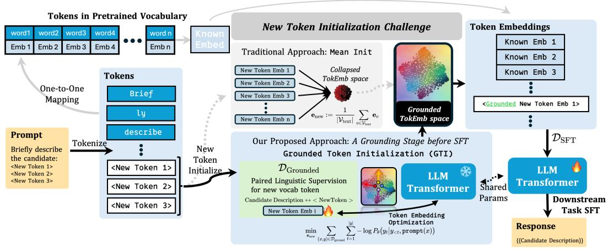

图 1：GTI 锚定阶段概览。语言模型主干网络与原始词表嵌入被冻结（雪花图标）；仅训练新引入的语义 ID（SID）词元嵌入（共 $|\mathcal{V}_{\mathrm{SID}}| \times D$ 个参数，火焰图标）。成对提示（paired prompts）在自然语言描述与 SID 词元之间建立双向映射，从而将新词元锚定于预训练嵌入空间之中。该阶段插入于标准端到端微调之前（参见第 3 节）。

本文中，我们将词元嵌入错位（token-embedding misalignment）识别为在预训练语言模型中扩展新词表时的一项根本性局限，并提出“基于语义锚定的词元初始化假说”：在微调之前，将新词元在语言模型的预训练嵌入空间中进行语言学意义上的锚定，可更有效地促使模型将其通用知识迁移至新词元所表征的领域。其直觉依据在于：预训练语言模型的嵌入向量编码了丰富的语言学结构，语义相近的词元在嵌入空间中彼此邻近（Levy & Goldberg，2014），且模型的注意力机制与前馈网络已习得如何利用该几何结构（Gao 等，2019）。若新词元被置于该结构中具有明确语义意义的位置，则语言模型即可立即借助其既有的表征能力，在上下文中处理这些新词元，而不必仅依赖微调从一个退化的初始状态中艰难恢复。由此，我们将词表扩展问题重新建模为一项词元锚定（token-grounding）任务：新词元嵌入应在保持与预训练语言模型嵌入几何结构一致的前提下，被锚定于具有语言学意义的表征位置。

基于上述假说，我们提出了 GTI —— 一种简洁而高效的新词元锚定初始化方法。在下游任务微调之前，GTI 冻结语言模型主干网络，并利用自然语言描述与对应新词元之间的成对监督信号，对新引入的词元嵌入进行锚定（图 1）。该锚定阶段弥合了高度优化的原始词表嵌入与随机/均值初始化的新词元嵌入之间的鸿沟，为后续面向下游任务的全模型端到端微调提供了具备语义结构的高质量起点。

我们在生成式推荐（Generative Recommendation, GR）（Rajput 等，2023；Zhai 等，2024）这一具有挑战性且实际意义重大的词汇扩展应用场景中验证了 GTI。GR 近年来在学术界与工业界均受到日益增长的关注（Ding 等，2026；Han 等，2025；Chen 等，2025a；Deng 等，2025），因其通过基于用户交互历史的自回归方式、逐 token 地生成物品标识符，从而极大简化了检索过程，取代了传统稠密嵌入方法（Koren 等，2009；He 等，2017；2020；Wang 等，2019）所必需的昂贵用户–物品内积计算。此外，GR 还可进一步利用模型规模与数据量扩大所带来的缩放律（scaling-law）行为（Han 等，2025），为持续性能提升提供了明确路径。GR 场景对“具身化 token 初始化”（grounded token initialization）提出了尤为严苛的要求：大量新型可学习语义标识符（Semantic-ID, SID）token 必须被注入预训练语言模型（LM）中，每个 SID token 需编码细粒度的物品级语义及层级化码本结构；而该结构必须恰当地锚定（grounded）于 LM 的嵌入空间中，方能支撑高效检索。

# 贡献

- 1. 诊断分析。通过谱分析与几何分析，我们刻画了由均值初始化所引发的 token 嵌入错位现象：所有新增可学习 token 均坍缩至一个退化的低秩子空间中，且在后续微调过程中无法充分恢复。这一发现催生了“具身化 token 初始化假说”（Grounded Token Initialization Hypothesis）：在微调前对新 token 进行语言学意义上的具身化（linguistic grounding），有助于语言模型更有效地迁移其预训练知识以适配新领域。  
- 2. 方法论。我们提出 GTI——一种简洁而有效的具身化阶段：在标准微调之前，冻结语言模型主干网络（backbone），仅通过成对的语言学监督信号学习新 token 的嵌入表示，从而为下游任务适配提供语义结构清晰的初始起点。  
- 3. 实证发现。在涵盖工业级与公开数据集的生成式推荐基准测试中，GTI 始终优于直接监督微调（direct supervised fine-tuning）以及 LC-Rec（Zheng 等，2024）——后者是一种通过辅助任务联合调整整个模型的现有方法。这些结果表明，token 初始化是词汇扩展中的关键瓶颈。

# 2 Token 嵌入错位

我们在生成式检索（generative retrieval）这一主要应用背景下形式化地定义词汇扩展问题，并随后借助谱分析与几何诊断手段，刻画标准初始化策略在向预训练语言模型引入新 token 时所引发的一种系统性 token 嵌入错位现象。

生成式检索。我们采用 Rajput 等（2023）提出的框架。每个物品 $I _ { i } \in \mathcal { I }$ 具有内容特征（标题、描述等），由一个预训练文本编码器映射为其语义嵌入 $\mathbf { z } _ { i } \in \mathbb { R } ^ { d }$。一个具有 $L$ 层码本、每层含 $K$ 个条目的残差量化变分自编码器（RQ-VAE）（Lee 等，2022）通过递归残差量化，将 $\mathbf { z } _ { i }$ 离散化为一个语义标识符（Semantic ID）$\left( c _ { 1 } , \dots , c _ { L } \right)$，其中 $\dot { c } _ { l } \in \{ 1 , \dots , K \}$；此处 $\{ \mathbf { q } _ { k } ^ { ( l ) } \} _ { k = 1 } ^ { K } \subset \mathbb { R } ^ { d }$ 表示第 $l$ 层码本。共计 $K \times L$ 个 SID 码被追加至文本词表 $\mathcal { V } _ { \mathrm { t e x t } }$ 中；$\gamma _ { \mathrm { S I D } }$ 则表示 SID token 序列。给定用户交互历史（检索任务）或自然语言查询（搜索任务）$\mathbf { x }$，语言模型以自回归方式生成目标 Semantic ID：

词表均值初始化（Mean-of-Vocabulary Initialization）。标准做法是将所有新 token 的嵌入向量初始化为现有词表嵌入向量的均值（Hewitt，2021）：其中 $\mathbf { e } _ { v }$ 表示 token $v$ 的输入嵌入。

错位现象的诊断。在词表均值初始化（式 (1)）下，每个新 token 均被赋予完全相同的嵌入向量：1) 导致所有 token 之间的区分性彻底丧失；2) 同时抹除了每个 token 本应承载的语义结构（图 2，左）。尽管如此，该启发式策略仍被广泛采用（Wolf 等，2020），因其可将新 token 置于预训练流形（pretrained manifold）之上，并相较于随机初始化（Hewitt，2021）在输出概率上给出更紧致的 KL 散度上界。相反，随机初始化

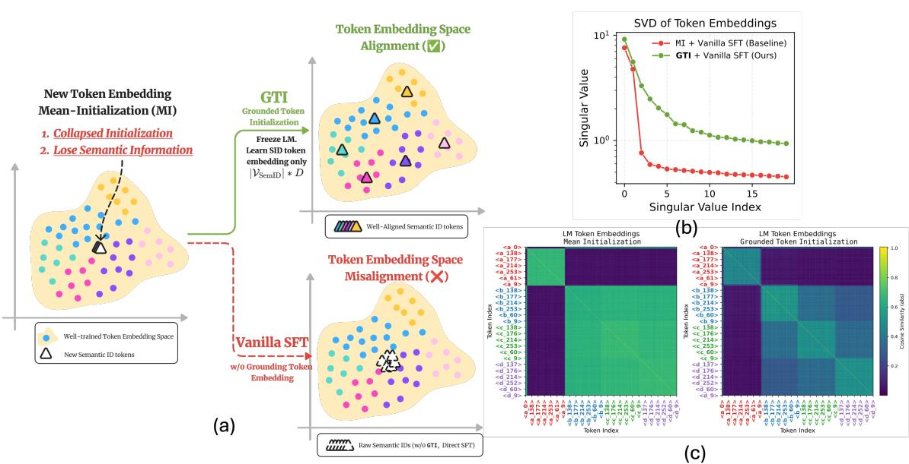

图 2：均值初始化下的 token 嵌入坍缩现象及其具身化效果。（a）左：均值初始化将所有 SID token（白色三角形）映射至同一点，导致 token 间区分性完全坍缩；右上：GTI 仅训练 $| \mathcal { V } _ { \mathrm { S I D } } | \times d$ 维嵌入参数并冻结主干网络，从而将 SID token（彩色三角形）具身化至不同区域；右下：未经过具身化的微调过程无法完全缓解该坍缩现象（参见图 7）。（b）与（c）：经下游任务监督微调后，GTI 初始化所得嵌入具有更高的有效秩（effective rank），并更好地保持了 SID token 之间分块式的层级结构。

为每个 token 分配互不相同的向量，但这些向量与预训练流形之间缺乏一致的结构关联，因而无法为模型提供任何可资利用的语言学先验。token 嵌入之间的成对余弦相似度（图 5）证实：均值初始化在全部 SID token 上产生近乎均匀的相似度块（uniform similarity block），而随机初始化则导致无结构的噪声模式。

我们考察监督微调是否能够恢复在均值初始化下丢失的结构。在监督微调后，SID 嵌入之间的成对相似性（图2(c)及图6左、中）以及 SID 嵌入矩阵 $E _ { \mathrm { S I D } } \in \mathbb { R } ^ { | \mathcal { V } _ { \mathrm { S I D } } | \times d }$ 的奇异值分解（图2(b)及图7）均显示出快速的谱衰减与较低的有效秩，这证实：仅靠监督微调无法恢复在均值或随机初始化阶段所丢失的词元间结构。综上所述，这些分析表明：两种初始化策略均非理想起点——均值初始化虽将词元置于预训练流形之上，却抹除了判别能力；而随机初始化虽保留了判别性，却缺乏语言学意义上的语义锚定。

**基于语言学锚定的词元初始化（GTI）假说**。上述观察促使我们提出核心假说：在下游微调之前，将新词元以语言学方式锚定于大语言模型（LM）的预训练嵌入空间中，可更有效地使模型将其通用知识迁移至新词元所对应的领域任务中。我们并不依赖微调本身来从退化初始化状态中恢复，而是提出在标准端到端微调之前，插入一个简单且高效的锚定阶段：该阶段在冻结 LM 主干网络的前提下，仅通过语言学监督信号学习新词元嵌入。我们在第3节对该假说进行形式化实现，并在第4节通过实证方式验证其有效性。

# 3 GTI：基于语言学锚定的词元初始化阶段

第2节中的诊断结果启发我们对标准训练流程进行一项直接修改：在下游微调之前，插入一个锚定阶段，该阶段冻结 LM 主干网络，仅通过配对式语言学监督信号学习新词元嵌入。该设计建立在“在冻结的 LM 中训练新词元嵌入”这一已被广泛采用的原则之上（Hao 等，2024；Nguyen 等，2024）。我们将由此产生的流程命名为 GTI。尽管其设计极为简洁，我们仍证明该额外阶段在多个基准测试（包括公开数据集与工业级数据集）上均带来一致性能提升（第4节），表明词元初始化是词汇扩展过程中的关键瓶颈。

**算法**。令 $\nu = \nu _ { \mathrm { t e x t } } \cup \nu _ { \mathrm { n e w } }$ 表示扩展后的词表，其中 $\mathcal { V } _ { \mathrm { n e w } }$ 为新增的领域专属词元。给定一个具有输入嵌入矩阵 $\boldsymbol { E } \in \mathbb { R } ^ { | \nu | \times d }$ 的预训练自回归语言模型，我们将 $E$ 划分为预训练部分的行 $E _ { \mathrm { t e x t } }$ 与新增部分的行 $E _ { \mathrm { n e w } } \in \mathbb { R } ^ { | \mathcal { V } _ { \mathrm { n e w } } | \times d }$。每个领域实体均关联一段自然语言描述 $x _ { i }$（例如标题或定义）及其对应的标准新词元序列 $y _ { i } = ( c _ { i , 1 } , \cdots , \overline{c}_{i , L } )$。我们在生成式推荐场景中实例化 GTI，其中 $\mathcal { V } _ { \mathrm { n e w } } = \mathcal { V } _ { \mathrm { S I D } } $，$x _ { i }$ 为物品标题/描述，$y _ { i }$ 为其对应的 SID 序列。

我们构建锚定语料库 $\mathcal { D } _ { \mathrm { g r o u n d } } = \{ ( x _ { i } , y _ { i } ) \} _ { i = 1 } ^ { n }$，将每段描述与其对应的新词元序列配对，并补充反向配对 $\left\{ \left( y _ { i } , x _ { i } \right) \right\}$，以要求模型从新词元生成自然语言描述²。我们采用指令式提示模板 $\text{prompt}(x)$（如下所示），并在 $\tilde{E_{\mathrm{new}}}$ 上最小化负对数似然：其中 $\theta$ 表示语言模型的所有参数。在此阶段，除 $E_{\mathrm{new}}$ 外，所有参数均保持固定，包括 $E_{\mathrm{text}}$ 及共享嵌入权重的 LM 输出头（依据标准的权值绑定参数化方式）。这种权值绑定机制意味着锚定阶段同步塑造模型对新词元的读取与生成能力。锚定完成后，我们将习得的 $E_{\mathrm{new}}$ 作为初始化嵌入，并继续对全部模型参数 $\theta$ 进行标准监督微调。具体实现细节见算法1。

# 4 实验

我们在生成式推荐这一极具挑战性的领域中评估 GTI 方法。该领域是检验初始化瓶颈的理想试验场，因其需将数千个新的语义 ID（SID）词元融入预训练语言模型。为实证验证：将这些新词元与模型既有的语言学几何结构对齐，是否可防止语义坍缩，我们在两类差异显著的环境中开展评估：一个工业级候选检索系统，以及公开的 Vibrent 服装租赁基准数据集。

# 4.1 实验设置

**数据集**。我们在两个不同规模与领域的数据集上进行评估。

（1）**工业级候选检索数据集**³。该数据集来源于一家全球领先的招聘平台，包含职位需求–候选人配对样本。每对样本由内部大语言模型评估器根据候选人满足职位需求的数量，划分为三类相关性等级（良好、良好且可能、不匹配）。受限于数据共享约束，本数据集仅报告相对于监督微调（SFT）基线的相对性能提升。

（2）**Vibrent 服装租赁数据集**。为验证方法泛化能力，我们将公开的 Vibrent 服装租赁数据集（Borgersen，2024）适配为生成式检索任务：以用户历史租借行为为依据，将用户视为查询，服装商品视为候选。

**基线方法**。为严格隔离初始化瓶颈的影响，所有方法均采用完全相同的 Qwen3-0.6B 主干网络与 RQ-VAE 分词结构，唯一区别在于引入新词元的方式。

- （1）标准监督微调（Vanilla SFT）：新引入的语义 ID（SID）词元采用均值初始化（公式 1），导致语义坍缩。模型完全依赖下游微调，从这一退化起点出发来区分各词元。  
- （2）LC-Rec（Zheng 等，2024）：一种近期提出的多任务方法，同样始于该坍缩状态，但在微调阶段通过引入辅助的自然语言对齐目标，尝试恢复语义结构。  
- （3）GTI（本文方法）：利用第 3 节所述的“接地”（grounding）阶段，我们将新 SID 词元锚定至冻结语言模型嵌入空间中彼此分离、语义明确的不同区域，从而为后续监督微调（SFT）提供结构丰富、语义清晰的初始起点。

评估指标。我们采用 Top-K 准确率（Precision）、召回率（Recall）和归一化折损累计增益（NDCG）衡量检索性能。在工业数据集上，我们随机采样 200 个职位作为评估查询（每个查询检索 200 个候选结果）。为满足数据共享限制，我们仅报告接地阶段带来的直接性能提升，并严格以相对于标准 SFT 基线的百分比增益形式呈现，计算公式为 $\left( M _ { \mathrm { m e t h o d } } - M _ { \mathrm { B a s e l i n e } } \right) / M _ { \mathrm { B a s e l i n e } }$。在公开的 Vibrent 数据集上，我们采用标准的“留一序列”（leave-one-out sequence）划分策略（Kang & McAuley，2018；Geng 等，2023）。

实现细节。在两个数据集上，我们均以 Qwen3-0.6B 作为主干语言模型。语义 ID（SID）依据 Rajput 等（2023）提出的方案，通过残差量化变分自编码器（RQ-VAE）构建。对于 GTI 方法，接地阶段仅冻结除 $E _ { \mathrm { n e w } }$ 外的所有参数，以批大小 128 训练 8,000 步；随后解冻全部参数，在相同批大小下再训练 8,000 步，最后执行与基线一致的标准 SFT 流程。所有实验均在四块 NVIDIA H100 GPU 上运行。

<table><tr><td rowspan="2">Methodology</td><td colspan="5">Precision@K (Good Match)</td><td colspan="5">Precision@K (Good &amp; Maybe Match)</td></tr><tr><td>P@5</td><td>P@10</td><td>P@20</td><td>P@50</td><td>P@100</td><td>P@5</td><td>P@10</td><td>P@20</td><td>P@50</td><td>P@100</td></tr><tr><td>MI+Vanilla SFT (Baseline)</td><td>0.00%</td><td>0.00%</td><td>0.00%</td><td>0.00%</td><td>0.00%</td><td>0.00%</td><td>0.00%</td><td>0.00%</td><td>0.00%</td><td>0.00%</td></tr><tr><td>MI+Multi-task SFT (LC-Rec)</td><td>+6.38%</td><td>+5.20%</td><td>+3.87%</td><td>+3.00%</td><td>+3.47%</td><td>+5.63%</td><td>+5.35%</td><td>+2.98%</td><td>+3.32%</td><td>+3.05%</td></tr><tr><td>GTI+Multi-task SFT (Ours)</td><td>+21.63%</td><td>+13.59%</td><td>+8.16%</td><td>+6.35%</td><td>+4.25%</td><td>+15.83%</td><td>+10.89%</td><td>+5.74%</td><td>+5.87%</td><td>+4.10%</td></tr><tr><td>GTI: extra gain over LC-Rec (Δ)</td><td>+15.25%</td><td>+8.39%</td><td>+4.29%</td><td>+3.35%</td><td>+0.78%</td><td>+10.20%</td><td>+5.54%</td><td>+2.76%</td><td>+2.55%</td><td>+1.05%</td></tr></table>

表 1：在真实世界候选人检索数据集上，相对于 SFT 基线的 Precision@K 相对提升（%）。加粗与下划线标示最优结果。

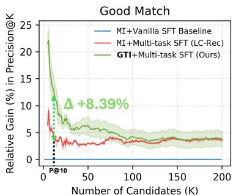

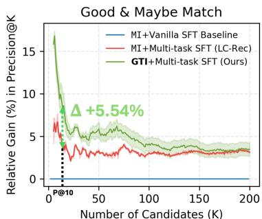

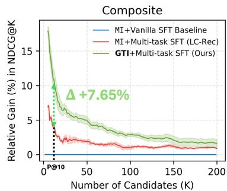

图 3：相对增益随候选池规模的变化趋势。左/中图：在“良好匹配”（Good Match）与“良好及可能匹配”（Good & Maybe Match）两种相关性判定标准下的 Precision@K 相对增益；右图：复合 NDCG@K 相对增益。GTI 在所有候选池规模下均持续优于两类基线方法，且在较小 K 值时增益最为显著。阴影区域表示多次运行结果的波动范围。

<table><tr><td rowspan="2">Methodology</td><td colspan="5">NDCG@K (Composite)</td></tr><tr><td>@5</td><td>@10</td><td>@20</td><td>@50</td><td>@100</td></tr><tr><td>MI+Vanilla SFT (Baseline)</td><td>0.00%</td><td>0.00%</td><td>0.00%</td><td>0.00%</td><td>0.00%</td></tr><tr><td>MI+Multi-task SFT (LC-Rec)</td><td>+6.94%</td><td>+4.38%</td><td>+1.94%</td><td>+1.95%</td><td>+1.01%</td></tr><tr><td>GTI+Multi-task SFT (Ours)</td><td>+17.88%</td><td>+12.03%</td><td>+6.90%</td><td>+4.99%</td><td>+2.89%</td></tr><tr><td>GTI: extra gain over LC-Rec (Δ)</td><td>+10.94%</td><td>+7.65%</td><td>+4.96%</td><td>+3.04%</td><td>+1.88%</td></tr></table>

表 2：在真实世界候选人检索数据集上，相对于 SFT 基线的复合 NDCG@K 相对提升（%）。加粗与下划线标示最优结果。

工业数据集。候选对象级别的语义表征通过在双塔架构中，利用招聘方互动信号对 Mistral-E5 进行微调获得，输出维度为 1024 的嵌入向量。RQ-VAE 使用 $L = 3$ 层码本，每层含 $\dot{K} = 8{,}192$ 个码字。后续 SFT 基线以批大小 512 训练 1,600 步。

公开数据集。物品级别语义表征由现成的 Qwen3-Embedding-0.6B 编码器提取，生成 1024 维向量。RQ-VAE 采用含 ReLU 激活函数的三层 MLP 编码器–解码器结构，使用 $L = 4$ 层码本，每层含 $K = 256$ 个码字（每个码字维度为 32），并引入 Wang 等（2024）提出的多样性正则项，以促进码本各码字的均衡使用。RQ-VAE 共训练 20,000 轮。SFT 基线以批大小 512 训练 1,600 步。

# 4.2 整体性能分析

表 1 与表 2 及图 3 详细展示了 GTI 在工业级数据集上的整体性能表现。

GTI 初始化的有效性。在所有截断阈值（cutoffs）、评估指标以及相关性判定标准（“良好匹配”与“良好及可能匹配”）下，GTI 均显著优于两类基线方法。在更严格的“良好匹配”标准下，GTI 在 P@5 上相较标准 SFT 基线取得 $\mathbf{+21.63\%}$ 的相对提升，而 LC-Rec 仅为 $+6.38\%$，二者差距 $\Delta$ 达 $15.25\%$，可明确归因于接地阶段的贡献。该优势模式在各类评估设置中保持一致：在“良好及可能匹配”标准下，GTI 在 P@5 上仍具明显优势（$+15.83\%$ vs. $+5.63\%$）；NDCG@5 同样呈现相似趋势（$\mathbf{+17.88\%}$ vs. $+6.94\%$）。进一步地，将候选池规模从 5 扫描至 200（见图 3），结果表明该性能提升在不同检索规模下均具有稳健性。

GTI 假说的实证支持。LC-Rec 与 GTI 的对比构成了一项受控实验，用以验证本文核心假说：二者均在新词元上引入语言学监督信号，但施加时机不同——LC-Rec 在微调阶段通过辅助语言建模目标引入监督，同时维持均值初始化；而 GTI 则在微调前，通过专门的接地阶段直接优化词元初始化方式。尽管二者共享完全相同的下游 SFT 流程，其性能差距（即额外增益 $\Delta$）却始终稳定存在，这表明：相较于仅依赖微调阶段的辅助目标，预先对新词元进行语义接地能提供更优的初始起点，从而有力支持了“接地式词元初始化”（Grounded Token Initialization）假说。

<table><tr><td rowspan="2">Methodology</td><td colspan="5">Recall@K</td><td colspan="5">NDCG@K</td></tr><tr><td>@5</td><td>@10</td><td>@20</td><td>@50</td><td>@100</td><td>@5</td><td>@10</td><td>@20</td><td>@50</td><td>@100</td></tr><tr><td>MI+Vanilla SFT (Baseline)</td><td>0.00%</td><td>0.00%</td><td>0.00%</td><td>0.00%</td><td>0.00%</td><td>0.00%</td><td>0.00%</td><td>0.00%</td><td>0.00%</td><td>0.00%</td></tr><tr><td>MI+Multi-task SFT (LC-Rec)</td><td>+7.69%</td><td>+11.86%</td><td>+13.41%</td><td>+12.03%</td><td>+15.73%</td><td>+8.47%</td><td>+10.74%</td><td>+11.30%</td><td>+11.18%</td><td>+13.26%</td></tr><tr><td>GTI+Vanilla SFT (Ours)</td><td>+1.71%</td><td>+22.03%</td><td>+26.02%</td><td>+21.55%</td><td>+18.54%</td><td>-5.19%</td><td>+8.02%</td><td>+12.23%</td><td>+12.83%</td><td>+12.46%</td></tr></table>

表 3：在 Vibrent 数据集上，相对于 SFT 基线的 Recall@K 与 NDCG@K 相对提升（%）。

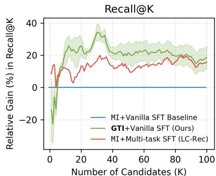

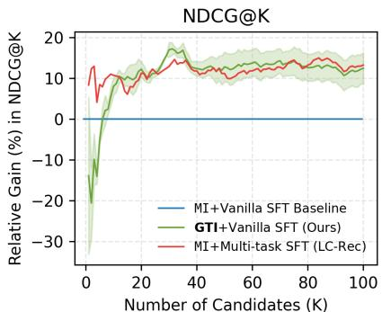

图 4：相对增益随候选池规模的变化趋势。左图：Recall@K 相对增益；右图：NDCG@K 相对增益。阴影区域表示多次运行结果的波动范围。

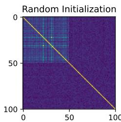

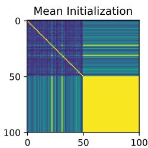

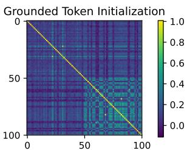

图 5：三种初始化策略下的成对余弦相似度矩阵。每个矩阵展示 50 个预训练词元（左上角子块）与 50 个 SID 词元（右下角子块）之间的相似度关系⁵。随机初始化（左图）产生的 SID 嵌入缺乏信息性；均值初始化（中图）导致所有 SID 词元坍缩为近似均匀的块状结构；GTI（右图）则生成具有内部区分度的 SID 结构，且 SID 词元与预训练词元之间展现出有意义的语义亲和关系。

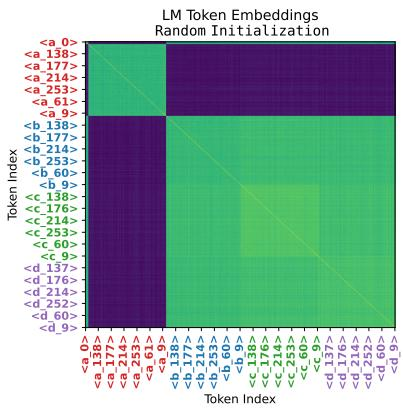

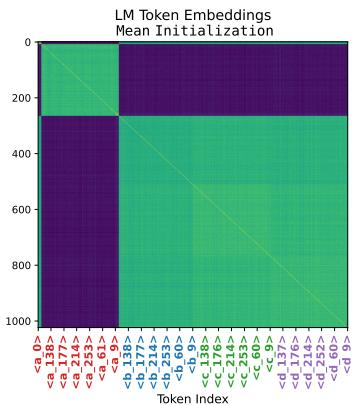

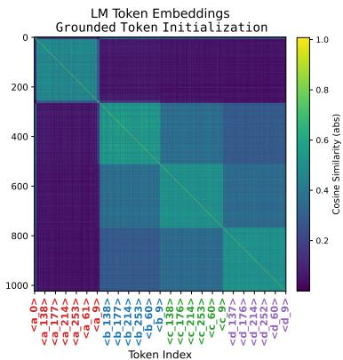

图6：微调后的成对SID相似度（公开数据集）。我们在微调检查点处可视化SID嵌入的成对余弦相似度矩阵。GTI是唯一一种能在SID词元间保持清晰分块式层次语义的初始化策略，表明其对语义几何结构的保持能力更优。相比之下，均值初始化与随机初始化即使在监督微调（SFT）阶段之后，仍产生平坦或噪声显著的相似度模式。

在公开数据集上的受控对比实验。为将基于具身化（grounded）初始化的效果与多任务适配的效果解耦，并评估本方法在专有数据集之外的泛化能力，我们在公开的Vibrent数据集上将GTI+标准SFT与LC-Rec（多任务SFT）进行对比（见表4与图4）。即便在微调阶段未引入任何辅助目标，GTI仍实现了显著更高的$K \geq 10$时的召回率（例如，在Recall@20指标上提升$+26.02\%$，而LC-Rec仅提升$+13.41\%$），且NDCG指标相当。这表明，仅靠具身化初始化阶段即能解释下游性能提升的大部分贡献。

# 4.3 进一步分析

前述结果证实具身化初始化可提升下游任务性能；接下来我们探究其内在机制。我们在SID嵌入子空间上，分别于初始化阶段和微调后阶段，开展谱分析（spectral analysis）与几何诊断（geometric diagnostics）。这些分析为“具身化词元初始化假说”（第2节）提供了直接证据。

具身化初始化生成具有区分度的嵌入几何结构。图5展示了三种初始化策略下预训练词表词元与SID词元之间的成对余弦相似度。随机初始化虽避免了均匀性，却导致无结构的噪声，且与预训练流形之间缺乏一致的亲和关系；均值初始化则生成一个均匀的SID块，印证了第2节中所诊断出的坍缩现象；相比之下，GTI在SID块内部生成丰富且具有区分度的结构，同时在跨块层面与相关词汇词元保持一致的亲和关系。

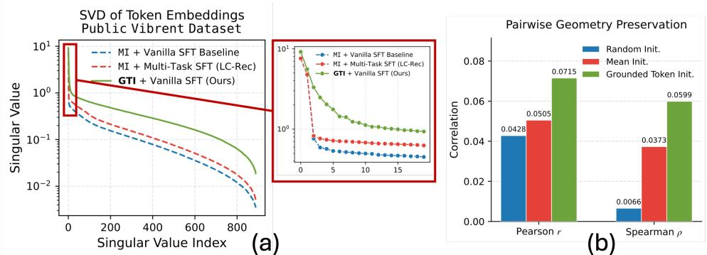

图7：（a）SFT后SID嵌入矩阵的奇异值谱：GTI初始化相较于均值初始化展现出更缓慢的谱衰减与更高的有效秩。（b）SFT后SID嵌入的表征相似性分析（RSA）：我们使用皮尔逊相关系数$r$与斯皮尔曼等级相关系数$\rho$，比较真实RQ-VAE码本向量与所学SID嵌入之间的成对几何结构。GTI初始化在两种指标下均取得最高相关性，表明其相较于均值或随机初始化，更能有效保持SID嵌入间的原始语义结构。

具身化结构在微调过程中持续存在。我们进一步检验由具身化所诱导的结构是否能在微调过程中得以保留。（1）在公开数据集上完成微调后，SID嵌入间的成对余弦相似度（图6）显示：仅有GTI初始化模型能保留RQ-VAE所编码的分块式层次结构；而均值与随机初始化则产生平坦或噪声主导的相似度模式。（2）在工业数据集上完成微调后，SID嵌入矩阵$E_{\mathrm{SID}} \in \mathbb{R}^{|\mathcal{V}_{\mathrm{SID}}| \times d}$的奇异值谱（图7a）表明：均值初始化导致快速谱衰减与低有效秩；而具身化初始化则呈现更缓慢的衰减与更高有效秩，说明其嵌入子空间非退化，且存在多个活跃方向，沿这些方向物品彼此可区分（工业数据集的扩展SVD分析详见附录）。（3）所学SID嵌入与真实RQ-VAE码本向量之间的表征相似性分析（RSA）（图7b）表明：GTI初始化的嵌入在训练过程中对原始语义结构的保持效果更优。综上，这些结果表明，具身化阶段所植入的嵌入结构能够贯穿整个微调过程持续存在，从而为下游性能提升提供支撑。

# 5 相关工作

语言模型中的词表扩展。向预训练语言模型（LM）词表中添加新词元是一项反复出现的挑战。常规方法通常将新嵌入初始化为词表均值（Hewitt, 2021）或随机初始化，再依赖后续微调。ToolkenGPT（Hao等，2024）与Yo’LLaVA（Nguyen等，2024）分别表明：仅对新词元嵌入进行训练，同时冻结其余LM参数，在工具调用与视觉概念具身化任务中均可取得良好效果。GTI将该机制重新定义为一种初始化策略：通过在微调前对新词元进行具身化，所习得的结构便成为适用于任意下游任务的优质起点，而非局限于某一特定终端用途。

生成式推荐。我们以生成式推荐作为主要评估领域，因其需向预训练LM注入数千个全新词元，构成词表扩展任务中极具挑战性的测试平台。该范式将检索建模为对经RQ-VAE（van den Oord等，2018；Lee等，2022；Rajput等，2023；Zheng等，2024）离散化的语义ID（SID）的自回归解码过程。附录7.5中对此范式进行了扩展讨论。

# 6 结论

通过谱分析与几何诊断，我们发现词表均值初始化（mean-of-vocabulary initialization）会导致新增词元坍缩至一个退化的子空间中，而后续的微调无法完全恢复其结构。受该诊断结果启发，我们提出了**GTI**（Grounded Token Initialization，基于语义锚定的词元初始化），一种轻量级的预接地阶段：在标准微调之前，仅利用成对的语言监督信号学习新增词元的嵌入表示。在涵盖工业级与公开数据集的生成式推荐基准测试中，GTI 始终优于词表均值初始化与辅助任务自适应方法；进一步分析证实，这种经语义锚定所构建的结构在微调过程中得以保持。上述发现为“**语义锚定词元初始化假说**”（Grounded Token Initialization Hypothesis）提供了实证支持。由于该锚定机制不依赖于下游任务的具体假设，未来一项重要工作方向是检验其在推荐之外更广泛的词表扩展场景中的普适性。

# 参考文献

- Karl Audun Kagnes Borgersen. Vibrent 衣物租赁数据集. https://www.kaggle.com/datasets/kaborg15/vibrent-clothes-rental-dataset, 2024. Kaggle 数据集，访问日期：2026 年 3 月 22 日。  
- Rui Cai, Chao Wang, Qianyi Cai, Dazhong Shen, 和 Hui Xiong. 利用大语言模型进行置信度感知增强以提升基于知识图谱的推荐效果. arXiv 预印本 arXiv:2502.03715, 2025.  
- Ben Chen, Xian Guo, Siyuan Wang, Zihan Liang, Yue Lv, Yufei Ma, Xinlong Xiao, Bowen Xue, Xuxin Zhang, Ying Yang, Huangyu Dai, Xing Xu, Tong Zhao, Mingcan Peng, Xiaoyang Zheng, Chao Wang, Qihang Zhao, Zhixin Zhai, Yang Zhao, Bochao Liu, Jingshan Lv, Jing Chen, Xiao Liang, Yuqing Ding, Chenyi Lei, Wenwu Ou, Han Li, 和 Kun Gai. OneSearch：面向电商搜索的统一端到端生成式框架初步探索, 2025a. URL https://arxiv.org/abs/2509.03236.  
- Daiwei Chen, Yi Chen, Aniket Rege, Zhi Wang, 和 Ramya Korlakai Vinayak. PAL：面向多元对齐的样本高效个性化奖励建模. 载于《第十三届国际学习表征会议》（ICLR 2025），2025b. URL https://openreview.net/forum?id=1kFDrYCuSu.  
- Yashar Deldjoo, Zhankui He, Julian McAuley, Anton Korikov, Scott Sanner, Arnau Ramisa, Rene Vidal, Maheswaran Sathiamoorthy, Atoosa Kasirzadeh, 和 Silvia Milano. 利用生成模型的现代推荐系统综述（Gen-RecSys）, 2024. URL https://arxiv.org/abs/2404.00579.  
- Jiaxin Deng, Shiyao Wang, Kuo Cai, Lejian Ren, Qigen Hu, Weifeng Ding, Qiang Luo, 和 Guorui Zhou. OneRec：通过生成式推荐器与迭代偏好对齐实现检索与排序的统一. arXiv 预印本 arXiv:2502.18965, 2025. URL https://arxiv.org/abs/2502.18965.  
- Yijie Ding, Zitian Guo, Jiacheng Li, Letian Peng, Shuai Shao, Wei Shao, Xiaoqiang Luo, Luke Simon, Jingbo Shang, Julian McAuley, 和 Yupeng Hou. 生成式推荐的泛化能力究竟如何？, 2026. URL https://arxiv.org/abs/2603.19809.  
- Jun Gao, Di He, Xu Tan, Tao Qin, Liwei Wang, 和 Tie-Yan Liu. 自然语言生成模型训练中的表征退化问题. 载于《国际学习表征会议》（ICLR 2019）.  
- Shijie Geng, Shuchang Liu, Zuohui Fu, Yingqiang Ge, 和 Yongfeng Zhang. 推荐即语言处理（RLP）：一种统一的预训练、个性化提示与预测范式（P5）, 2023. URL https://arxiv.org/abs/2203.13366.  
- Ruidong Han, Bin Yin, Shangyu Chen, He Jiang, Fei Jiang, Xiang Li, Chi Ma, Mincong Huang, Xiaoguang Li, Chunzhen Jing, 等. MTGR：美团工业级生成式推荐框架. arXiv 预印本 arXiv:2505.18654, 2025.  
- Shibo Hao, Tianyang Liu, Zhen Wang, 和 Zhiting Hu. ToolkenGPT：通过工具嵌入为冻结语言模型大规模接入外部工具, 2024. URL https://arxiv.org/abs/2305.11554.  
- Xiangnan He, Lizi Liao, Hanwang Zhang, Liqiang Nie, Xia Hu, 和 Tat-Seng Chua. 神经协同过滤. 载于《第 26 届国际万维网大会论文集》（WWW ’17），第 173–182 页，2017. doi: 10.1145/3038912.3052569.

- 项南何、坤邓、翔王、岩李、永东张、猛王。LightGCN：面向推荐任务的图卷积网络简化与增强，2020年。URL https://arxiv.org/abs/2002.02126。  
- 约翰·休伊特。为预训练语言模型初始化新词嵌入。https://nlp.stanford.edu/~johnhew/vocab-expansion.html，2021年。  
- HuggingFace。TRL 文档：快速入门。https://huggingface.co/docs/trl/en/quickstart，2025年。访问日期：2025年9月23日。  
- 锐杰蒋、川阮、树钦艾伦、普拉卡什·伊什瓦尔。对比学习中的难负样本采样：最优表征几何结构及神经坍缩与维度坍缩。《机器学习研究汇刊》（Transactions on Machine Learning Research），2024年。  
- 丽景、帕斯卡尔·文森特、杨立昆、远东田。理解对比式自监督学习中的维度坍缩。arXiv 预印本 arXiv:2110.09348，2021年。  
- 王成康、朱利安·麦考利。基于自注意力机制的序列化推荐方法。载于《2018年IEEE国际数据挖掘会议论文集》（ICDM 2018），第197–206页，2018年。doi: 10.1109/ICDM.2018.00035。  
- 叶胡达·科伦、罗伯特·贝尔、克里斯·沃林斯基。推荐系统中的矩阵分解技术。《计算机》（Computer），42(8):30–37，2009年。doi: 10.1109/MC.2009.263。  
- 多煜李、池宪金、世勋金、敏秀赵、旭信韩。利用残差量化实现自回归图像生成，2022年。URL https://arxiv.org/abs/2203.01941。  
- 奥默·莱维、约阿夫·戈德贝格。神经词嵌入作为隐式矩阵分解。载于《神经信息处理系统进展》（NeurIPS），第27卷，2014年。  
- 涛阮、浩天刘、宇恒李、穆蔡、乌特卡尔什·奥贾、永杰李。YoLLaVA：您的个性化语言与视觉助手，2024年。URL https://arxiv.org/abs/2406.09400。  
- 沙尚克·拉吉普特、尼基尔·梅赫塔、阿尼玛·辛格、拉古纳丹·H·凯沙万、仲武阮、卢卡什·赫尔特、李晨洪、泰·毅、振乾陈、乔纳·萨莫斯特、马切伊·库拉、爱德·H·奇、马赫什瓦兰·萨蒂亚莫尔蒂。采用生成式检索的推荐系统，2023年。URL https://arxiv.org/abs/2305.05065。  
- 阿尼凯特·雷格、阿迪蒂亚·库苏帕蒂、沙兰·拉吉特·S、艾伦·范、青青曹、沙姆·卡卡德、普拉提克·贾因、阿里·法尔哈迪。AdaNNs：一种自适应语义搜索框架。载于A. Oh、T. Naumann、A. Globerson、K. Saenko、M. Hardt、S. Levine（编），《神经信息处理系统进展》（NeurIPS），第36卷，第76311–76335页。Curran Associates, Inc.，2023年。URL https://proceedings.neurips.cc/paper/files/paper/2023/file/f062da1973ac9ac61fc6d44dd7fa309f-Paper-Conference.pdf。  
- 泰·毅、振乾陈、莫斯塔法·德赫加尼、建谟倪、达拉·巴赫里、哈什·梅赫塔、振秦、凯辉、哲赵、佳源顾等。将Transformer记忆建模为可微分的搜索索引。载于《神经信息处理系统进展》（NeurIPS），2022年。  
- 亚伦·范登奥尔德、奥里奥尔·维尼亚尔斯、科雷·卡武库楚格鲁。神经离散表征学习，2018年。URL https://arxiv.org/abs/1711.00937。  
- 文杰王、红辉鲍、欣宇林、继志张、永琪李、福力冯、思健吴、塔特-盛蔡。面向生成式推荐的可学习物品标记化方法，2024年。URL https://arxiv.org/abs/2405.07314。  
- 翔王、项南何、猛王、福力冯、塔特-盛蔡。神经图协同过滤。载于《第42届国际ACM SIGIR信息检索研究与开发会议论文集》（SIGIR ’19），第165–174页，2019年。doi: 10.1145/3331184.3331267。

- 托马斯·沃尔夫、莱桑德·德布特、维克多·桑、朱利安·肖蒙、克莱芒·德拉恩格、安东尼·莫伊、皮埃尔里克·西斯塔克、蒂姆·罗尔特、雷米·卢夫、摩根·丰托维茨、乔·戴维森、萨姆·什莱弗、帕特里克·冯·普拉滕、克拉拉·马、亚辛·杰尔尼特、朱利安·普吕、岑文徐、特文·勒斯高、西尔万·古格、玛丽亚马·德拉梅、昆汀·洛埃斯特、亚历山大·拉什。Transformers：最先进的自然语言处理技术。载于《2020年经验方法自然语言处理会议：系统演示论文集》，第38–45页，2020年。  
- 佳琦翟、露西·廖、星刘、跃明王、瑞李、轩曹、莱昂·高、昭杰龚、方达顾、嘉源何、英海陆、宇石。行动胜于言语：面向生成式推荐的万亿参数序列化换能器。载于Ruslan Salakhutdinov、Zico Kolter、Katherine Heller、Adrian Weller、Nuria Oliver、Jonathan Scarlett、Felix Berkenkamp（编），《第41届国际机器学习会议论文集》，机器学习研究进展（Proceedings of Machine Learning Research）第235卷，第58484–58509页。PMLR，2024年7月21–27日。URL https://proceedings.mlr.press/v235/zhai24a.html。  
- 海超张、云傅。VQToken：面向视频大语言模型极致标记压缩的神经离散标记表征学习。载于《第三十九届神经信息处理系统年会》（NeurIPS 2025）。URL https://openreview.net/forum?id=X8oEu4Gs3W。  
- 海超张、尧卢、立晨王、云哲李、代伟陈、云鹏徐、云傅。LinkedOut：从视频大语言模型中解耦世界知识表征以赋能下一代视频推荐。arXiv 预印本 arXiv:2512.16891，2025年。  
- 博文郑、宇鹏侯、宏宇卢、宇陈、文鑫赵、明陈、继荣温。通过融合协同语义适配大语言模型以用于推荐任务，2024年。URL https://arxiv.org/abs/2311.09049。  
- 国瑞周、家鑫邓、景豪张、阔蔡、乐健任、强罗、启根王、倩倩胡、瑞黄、世尧王等。OneRec 技术报告。arXiv 预印本 arXiv:2506.13695，2025年。URL https://arxiv.org/abs/2506.13695。

# 7 附录

# 7.1 数据集

# 7.1.1 检索数据集

工业级候选集检索数据集。该工业规模的候选集检索数据集⁶采集自2025年一家全球领先的职场社交平台，覆盖全球用户，由我方内部大语言模型（LLM）裁判进行标注。依据产品策略——即衡量候选人满足岗位需求的数量——每一对“岗位需求–候选人”被划分为以下三类相关性等级之一：高度匹配（good match）、高度匹配且可能存在其他可能性（good&maybe match）、不匹配（not match）。我们仅使用“高度匹配”样本进行监督微调（SFT）。

会员档案数据集包含提供以下至少一项属性的用户档案：地理位置、职位信息、教育经历或技能信息。

Vibrent 数据集。Vibrent 服装租赁数据集是 Kaggle 平台上公开可用的数据集。为补充我们的工业数据集，并引入一个公开基准，我们亦在该数据集上评估所提出方法。该数据集包含来自某服装租赁平台的匿名化用户–物品租赁交易记录。我们构建了一个候选集检索任务：将用户视为查询（queries），将服装物品视为候选（candidates）；其中已观测到的租赁交互行为被视为正向相关性信号，而未发生交互的物品在训练阶段则被视作负样本。

# 7.2 提示模板

7.2.1 提示模板：辅助任务（物品标题/描述中新词汇标记）

# 7.2.2 提示模板：搜索查询任务

⁷大部分物品标题/描述语义 ID 提示（Item Title/Description Semantic IDs prompts）与检索提示（retrieval prompts）均改编自（Zheng 等，2024）。

# 7.2.3 提示模板：检索任务

# 7.3 实现细节

我们采用预训练的 Qwen3-Embedding-0.6B 编码器提取物品的语义表征。该编码器处理包括标题和描述在内的物品元数据，生成维度为 1024 的稠密向量，以刻画物品之间的语义相似性。我们通过拼接方式处理商品的文本特征，格式为：[TITLE] [DESCRIPTION]。最大输入序列长度设为 2048。最终输出为稠密语义嵌入向量：对物品 $i$，其嵌入表示为 $z _ { i } \in \mathbb { R } ^ { 1 0 2 4 }$。

我们的残差量化变分自编码器（RQ-VAE）遵循 TIGER 框架（Rajput 等，2023），并经过精心设计的架构配置，以确保语义表征的有效量化。编码器结构由三层多层感知机（MLP）组成，各隐藏层维度分别为 [1024, 512, 256]，采用 ReLU 激活函数，并在层间应用 0.1 的 Dropout 率。残差量化机制采用四层码本（codebook），每层包含 256 个条目，每个条目为 32 维编码向量。这种层级化量化方法可在保持语言模型集成所需离散标记化特性的前提下，实现对语义信息的细粒度表征。我们对该模型训练了 20,000 轮，以达成较高的码本利用率并最小化碰撞率。为进一步防止多个物品映射至完全相同的语义 ID 序列所引发的碰撞问题，我们采用了 LC-Rec（Zheng 等，2024）中使用的 Sinkhorn-Knopp 技巧，从而确保最终层中物品语义在码本嵌入空间内呈均匀分布。

基础语言模型采用 Qwen3-0.6B，其隐藏层维度为 1024。该模型架构共包含 28 层 Transformer 结构，支持最大上下文长度达 32,768 个 token。该配置足以支撑序列推荐任务的处理需求，同时兼顾计算效率。参数高效微调通过量化低秩适配（QLoRA）实现，秩（rank）设为 8，缩放系数（alpha）设为 32。LoRA 适配模块采用 0.05 的 Dropout 率，并作用于关键投影矩阵，包括 q_proj、k_proj、v_proj、o_proj、gate_proj、up_proj 和 down_proj。此外，我们将 LoRA 模块设定为仅保存嵌入标记（embed tokens）与语言建模头（lm head），从而在训练过程中仅保留嵌入层与语言建模头，其余模块保持冻结。该配置可在高效适配的同时，最大程度保留预训练知识。

我们通过扩展 Hugging Face TRL（HuggingFace，2025）中的 SFTTrainer 来实现 GTI 的标记嵌入锚定（token-embedding grounding）阶段：仅更新语义 ID（Semantic-ID）嵌入矩阵，同时冻结语言模型主干网络；该训练器接收成对的（标题/描述，SemID）样本，并依据下方伪代码所述方式优化嵌入向量。除非另有说明，我们统一训练 10 轮，学习率为 $1 \times 10^{-3}$，批大小（batch size）为 16。

# 7.4 分析细节

表征相似性分析（RSA）。为定量评估所学表征是否保留了 SID 新词汇标记的语义结构，我们开展表征相似性分析。给定已充分训练的 RQ-VAE 码本——其对 SID 新词汇标记进行了压缩编码——我们将理想语义嵌入定义为 $\mathbf { \bar { \phi } } _ { X } = \{ x _ { 1 } , . . . , x _ { n } \} , x _ { i } \in \mathbf { R } ^ { 3 2 }$；并将语言模型中对应学习得到的标记嵌入记为 $\hat { X } = \{ \hat { x } _ { 1 } , . . . , \hat { x } _ { n } \} , \hat { x } _ { i } \in \mathbb { R } ^ { d } $，其中 $d$ 取决于所用语言模型的隐层维度。我们据此构建两组成对标记相似性矩阵 $S _ { X } , S _ { \hat { X } } \in \tilde { \mathbf { R } ^ { n \times n } } $，其定义如下：

随后，我们对 $S _ { X }$ 和 $S _ { \hat { X } }$ 的上三角部分元素进行向量化，并计算其相关性（我们同时实现了 Spearman 相关性与 Pearson 相关性，以捕捉表征对齐的互补方面）。由此得到一个 RSA（表征相似性分析）得分，用于量化所学习表征空间在多大程度上保留了理想表征空间中的成对语义关系。由于 RSA 比较的是表征几何结构而非坐标本身，因此特别适用于本研究场景——其中理想表征与学习所得嵌入处于不同环境维度（32 维 vs. $d$ 维）。

工业数据集上的扩展 SVD 分析。GTI 初始化所表现出的更缓慢的谱衰减与更高的有效秩表明，该方法在整个监督微调（SFT）过程中维持了一个更具表达力且更多样化的特征空间，从而避免了均值初始化常导致的维度坍缩现象。

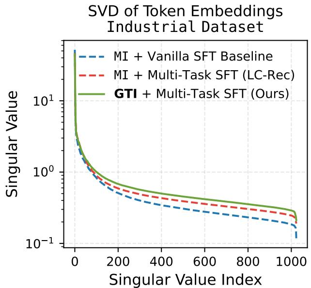

图 8：工业数据集经 SFT 后 SID 嵌入矩阵的奇异值谱。

# 7.5 完整的相关工作综述

RQ-VAE 与语义 ID（Semantic IDs）。向量量化自编码器（van den Oord 等，2018；Zhang & Fu，2025）通过将连续嵌入映射至码本条目，学习离散化物品表征。残差量化变分自编码器（RQ-VAE）（Lee 等，2022）在此基础上进一步扩展，

<table><tr><td rowspan="2">Methodology</td><td colspan="5">Recall@K</td><td colspan="5">NDCG@K</td></tr><tr><td>@5</td><td>@10</td><td>@20</td><td>@50</td><td>@100</td><td>@5</td><td>@10</td><td>@20</td><td>@50</td><td>@100</td></tr><tr><td>MI+Vanilla SFT (Baseline)</td><td>0.0226</td><td>0.0342</td><td>0.0475</td><td>0.0771</td><td>0.1031</td><td>0.0150</td><td>0.0188</td><td>0.0222</td><td>0.0280</td><td>0.0322</td></tr><tr><td>MI+Multi-task SFT (LC-Rec)</td><td>0.0243</td><td>0.0382</td><td>0.0539</td><td>0.0863</td><td>0.1194</td><td>0.0163</td><td>0.0208</td><td>0.0247</td><td>0.0311</td><td>0.0365</td></tr><tr><td>GTI+Vanilla SFT (Ours)</td><td>0.0230</td><td>0.0417</td><td>0.0599</td><td>0.0937</td><td>0.1222</td><td>0.0143</td><td>0.0203</td><td>0.0249</td><td>0.0316</td><td>0.0362</td></tr></table>

表 4：Vibrent 数据集上的额外检索结果。我们报告了基线方法（MI + Vanilla SFT）、LC-Rec（MI + 多任务 SFT）以及我们提出的方法（GTI + Vanilla SFT）在 Recall@K 和 NDCG@K 上的性能。GTI + Vanilla SFT 在大多数 Recall@K 指标上取得最优性能，在 NDCG@K 上亦保持较强竞争力，进一步验证了基于真实世界锚点的词元初始化策略在生成式检索任务中的有效性。

引入层级化的残差码本结构，生成多层级语义 ID（SIDs），逐级捕获更为精细的语义区分。与传统物品 ID 不同，SIDs 具备可组合结构，适于自回归生成，因而已成为生成式推荐系统中的标准组件（Rajput 等，2023；Zheng 等，2024；Han 等，2025）。尤为关键的是，每个码本条目均成为语言模型（LM）词汇表中的一个新词元；而这些新词元应如何初始化，正是本工作所聚焦并着力解决的核心瓶颈问题。

生成式推荐。生成式检索将推荐任务重构为对物品标识符的自回归解码过程，而非在嵌入空间中执行最近邻搜索（Rege 等，2023；Chen 等，2025b）。TIGER（Rajput 等，2023）率先将 RQ-VAE 学习所得的 SIDs 作为生成目标；LC-Rec（Zheng 等，2024）则在微调阶段引入辅助语言学目标，以提升 SIDs 的表征质量。若干系统已实现工业级部署：MTGR（Han 等，2025）将生成式检索与 DLRM 的跨特征信号相融合；OneSearch（Chen 等，2025a）结合关键词增强的量化机制与偏好感知奖励；OneRec（Deng 等，2025；Zhou 等，2025）则通过会话级生成统一检索与排序任务。其他互补方向还包括：由大语言模型驱动的知识图谱推荐器（Cai 等，2025），以及基于多模态大语言模型（MLLM）的世界知识整合方法（Zhang 等，2025）。所有上述系统均需将新型词元注入预训练语言模型；本工作所解决的问题位于其上游，且与其贡献互为补充，即：这些新词元应如何进行初始化。

与维度坍缩现象的关联。我们所诊断出的初始化坍缩现象，与对比学习及自监督学习中的维度坍缩（Jing 等，2021；Jiang 等，2024）密切相关——在后者中，所学习的表征被限制于低维子空间，从而丧失细粒度区分能力（见图 2）。词汇表均值初始化会引发类似效应：所有新词元初始位置完全相同，形成秩亏配置。Jiang 等（2024）指出，恰当的初始化策略可缓解对比学习中的维度坍缩；这与我们的发现高度一致——即：在微调前对新词元进行真实世界锚定（grounding），有助于维持更高秩、更具区分性的嵌入子空间。