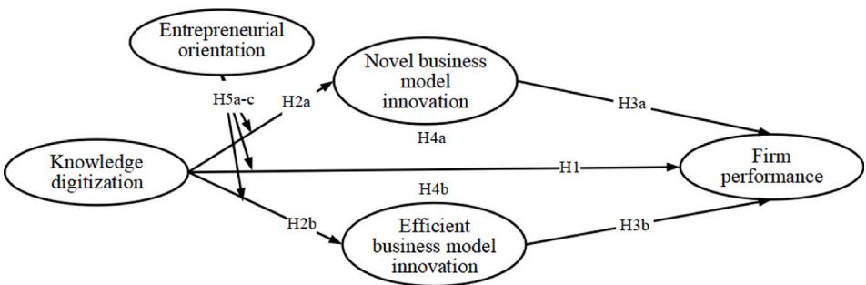
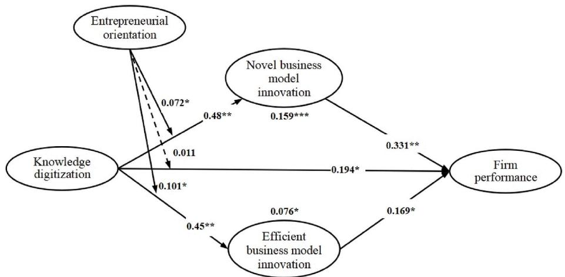
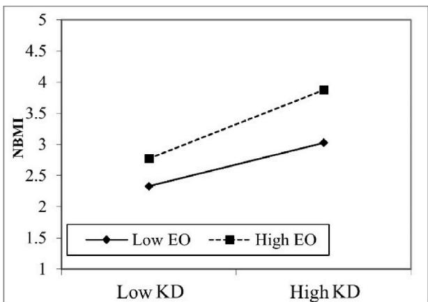
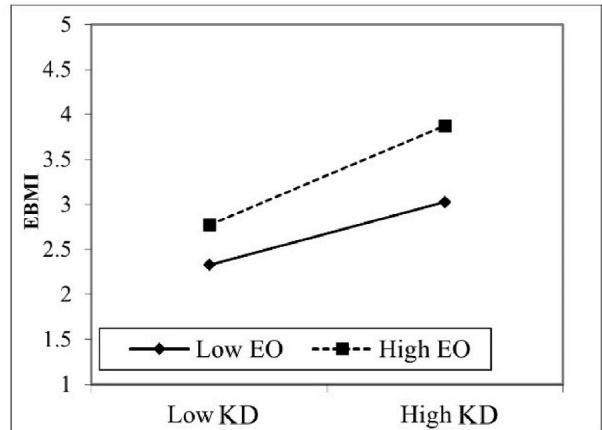

# 知识数字化与高科技企业绩效：一个整合商业模式创新与创业导向的有调节的中介模型

韩武成a,1，李晓宇b,1，朱伟杰a,1，卢若羽a，祖旭c,* 

- a 电子科技大学经济与管理学院，中国成都  
- b 中国人民大学商学院，中国北京  
- c 四川农业大学商旅学院，中国成都

# 文章信息

关键词：

知识数字化

商业模式创新

企业绩效

创业导向

高科技企业

# 摘要

在当今快速演进的数字环境中，人工智能、大数据、区块链与云计算等先进技术所推动的知识数字化进程，已引起学界广泛关注。为全面探究这一知识数字化趋势的影响与后果，本研究深入考察其对高科技企业绩效的作用机制。基于知识基础观，我们构建了一个有调节的中介模型，以检验商业模式创新在知识数字化与企业绩效之间的中介作用，以及创业导向在该关系中的调节效应。为验证研究假设，我们采用偏最小二乘结构方程模型（PLS-SEM）方法，对来自中国291家高科技企业的样本数据进行了分析。研究结果表明：知识数字化对企业绩效具有显著正向影响；两类商业模式创新——新颖型与高效型——均在该正向关系中发挥部分中介作用；创业导向显著强化了知识数字化与商业模式创新之间的关系，但并未显著调节知识数字化与企业绩效之间的关联。本研究为数字时代下的企业战略发展提供了可操作的实践启示，并对该领域现有理论体系作出了重要贡献。

# 1. 引言

传统的知识传递、存储与管理模式依赖于单一渠道，致使企业在快速获取信息及有效利用知识资源方面面临严峻挑战[1]。以人工智能、大数据、区块链与云计算融合为特征的数字革命，催生了一个动态化、可及性强且持续迭代优化的全新知识时代。这一演进不仅使组织得以突破传统边界，更营造出有利于提升数字化知识管理水平的环境[2]。在此背景下，高科技企业作为知识数字化的战略先行者脱颖而出，通过战略性采纳数字化知识实践，展现出显著的运营改善与卓越绩效表现[3]。

知识数字化依托先进的信息与通信技术——包括数字系统、传感器及机器视觉等——将涵盖企业经营、生产、营销与技术等各维度的综合性知识，转化为可被数字平台访问与处理的形式[1]。这一转化过程不仅促进了知识的生成、存储、传播与获取，更推动了数字技术与知识资源的深度融合[4]。此类融合深刻改变了传统知识的存在形态，并对知识的载体、分布方式及流动速度产生根本性影响；同时亦有助于企业对外部多样化知识的快速吸收与转化，进而促进跨部门协同，并推动新产品、新技术与新服务的开发[5]，预示着企业借由数字化知识构建竞争优势的方式可能发生范式转变[6–8]。

然而，随着企业业务规模扩张与用户数量激增，企业需处理的数据量呈指数级增长。如何保障数据与知识的准确性与质量，并将海量数据与知识切实转化为企业的竞争优势与实际效益，已成为亟待解决的重大挑战[9]。这些挑战不仅凸显了知识数字化实施过程的复杂性，更引发了一个关键问题：知识数字化究竟如何影响企业绩效？目前，知识数字化仍属新兴概念，关于其与企业绩效之间关系的实证研究尚十分匮乏。因此，首要任务是厘清知识数字化提升企业绩效的潜在能力；继而，亟需深入剖析其作用机制，并系统考察可能调节该关系的边界条件。唯有如此，方能丰富该领域的理论框架，并弥合我们对“数字化知识资产如何驱动竞争优势与组织成功”这一核心问题的认知鸿沟[8]。

此外，学者们已认识到企业创新在知识数字化促进企业绩效提升过程中所发挥的重要作用，并着重探讨其对技术创新与流程创新的影响[1,10]。然而，尽管技术创新对市场成功至关重要，单靠技术创新可能尚不足以保障企业的长期存续。这些企业还需开展商业模式创新，以充分释放知识数字化所蕴含的经济价值[11]。因此，商业模式创新——即对企业商业模式的关键要素和/或联结这些要素的整体架构所进行的经设计、新颖且非平凡的变革[12]——提供了一个关键的理论框架。该框架有助于理解数字化的知识资产如何被转化为新的价值主张、收入来源及成本结构，从而可能带来显著的绩效提升[13]。知识数字化广泛影响着高科技企业的运营方式及其商业模式支撑机制，深刻改变了产品、流程与战略的本质[14]，并推动高科技企业形成新颖而高效的商业模式[15]。基于上述考量，本研究旨在通过系统考察知识数字化如何经由商业模式创新这一路径影响企业绩效，以弥合现有文献中的理论缺口。

此外，探究知识数字化影响企业绩效的边界条件，对于深入理解二者关系具有关键意义。为有效将数字知识转化为企业绩效，企业必须迅速将其转化为契合客户需求的产品、技术与服务，并借此获取先动竞争优势[16]。创业导向被定义为一系列促进新市场进入的过程、实践与决策活动[17]；其强调企业对创新的倾向性、对产品与服务的持续改进、对利基市场机会的挖掘，以及承担不确定性项目相关风险的意愿[18]。具体而言，具备较强创业导向的企业更善于应对数字市场的复杂性，适应快速的技术变革，并实施能够充分利用数字化知识的创新型商业模式[19]。创业导向所具有的前瞻性、风险承担性与创新性，有助于识别并开发数字化转型所催生的新价值主张、新客户群体与新收入来源[14]，从而强化知识数字化与企业绩效之间的正向关系。本研究将创业导向作为调节变量加以考察，旨在厘清知识数字化经由商业模式创新而最有效地提升企业绩效的具体情境与条件。

为弥补上述理论缺口，本文构建了一个理论框架，用以系统探究知识数字化影响企业绩效的作用机制及其边界条件。本研究的实证分析聚焦于高科技企业。这类企业通常处于动态变化的商业环境中，具有技术进步迅速、运营复杂度高以及不确定性加剧等典型特征[11]。

其知识管理实践的多样性与创新性，为识别差异化的知识数字化策略提供了有益洞见。鉴于高科技企业在驱动数字经济进程中的核心地位，以及其在数字基础设施应用方面的先进性，该类企业尤为适合作为本研究的实证对象[3]。本研究采用偏最小二乘法结构方程模型（PLS-SEM）对来自291家中国高科技企业的调查数据进行分析。

本研究在知识数字化领域具有重要的理论与实践贡献。第一，本研究深入这一新兴领域，系统考察知识数字化对企业绩效的影响，不仅丰富了既有学术讨论，也为后续的理论建构与实证探索奠定了基础[1]。第二，本研究通过实证检验商业模式创新在知识数字化与企业绩效关系间的中介效应，回应了该领域当前亟待解决的理论挑战。鉴于该新兴领域内实证研究仍十分匮乏，此项贡献尤为宝贵，为揭示二者间内在作用机制提供了全新见解[20]。第三，本研究识别出创业导向在知识数字化效应中所发挥的调节作用，从而拓展了学界对创业导向作为数字情境下关键赋能因素的理解[21,22]。

本文结构安排如下：第二部分阐述理论基础并提出研究假设；第三部分说明研究方法，包括数据收集与抽样过程、测量工具设计以及数据分析策略；第四部分呈现实证结果，涵盖共同方法偏差检验、测量模型与结构模型评估，以及假设检验结果；最后一部分为讨论，综合阐释本研究的主要发现，阐明其理论意义与实践启示，并指出研究局限性及未来研究方向。

# 2. 理论基础与研究假设的提出

# 2.1 基于知识的观（Knowledge-Based View）

基于知识观认为，知识是组织内部的一种战略性资源，驱动着创新、竞争优势与价值创造 [23,24]。与该观点一致，企业通过优化其知识管理流程，以增强知识的多样性与异质性，同时强化利益相关者之间的互动，从而拓展信息与知识来源 [25]。此外，企业还培育动态能力，以持续吸收、整合并利用知识；这种能力直接且显著地影响知识相关绩效 [26]。

在数字时代，数字技术与知识管理的融合已彻底变革了知识管理的过程及其有效性 [27]。知识数字化促进了知识的自动、广泛检索，推动隐性知识向显性化、数字化存储信息的转化，并赋能知识价值的生成 [1]。基于知识基础观的基本原理，这一过程可增强企业的知识基础，进而提升其绩效 [28]。数字化知识管理平台突破物理边界，支持大规模的知识存储、检索、共享与应用。数字技术通过实现全球范围内的知识获取、协作以及对外部知识源的利用，促进价值共创 [29]。此外，数字技术还可借助实时、结构化与非结构化的数据，赋能数据驱动型决策，从而提升机会识别能力与决策质量 [30]。

尽管知识数字化为运营效能提升带来了机遇，但它也为基于知识观带来了显著的理论与实践挑战。其中一项主要关切在于数字化知识数量激增，致使知识整合与分析过程日趋复杂。

此外，若数字化过程中缺乏健全的有效性评估机制，则可能削弱知识管理实践的实际成效 [31]。另一项挑战在于数字化过程高度依赖显性知识，可能导致以人为中心的显性知识所固有的深度被稀释。这种依赖亦可能弱化组织内部人机交互的质量 [32]。最后，知识数字化还引发数据安全与隐私方面的担忧；此类问题将限制知识的存储与传播，危及组织知识资产的独特性与保密性 [33,34]。

尽管存在上述挑战，数字化知识所蕴含的内在战略价值仍不容忽视。当代企业正日益将知识数字化纳入其战略框架之中，认可其作为数字时代关键资产的巨大潜力 [35]。鉴于该动态现象的重要性及其内在复杂性，亟需厘清知识数字化对企业绩效所产生的直接影响、间接影响及权变效应 [27]。

# 2.2 知识数字化与企业绩效

知识数字化是指运用信息与通信技术（ICT）、信息系统、传感器、机器视觉及各类数字技术，将组织在业务、生产、营销与技术等多领域中的知识，转化为便于存储、计算与分析的数字格式 [36]。该过程使组织得以借助数字工具与平台，高效地存储、检索与分析知识资源，具备三个显著特征：可编码性（codability）、融合性（convergence）与生成性（generativity）[1]。可编码性指组织通过数字技术处理数据的能力，使信息得以脱离特定技术设备、存储介质与传输格式的束缚；该能力支持将信息以结构化数据库形式进行编码与存储，从而提升其可访问性与可用性 [37]。融合性意味着产业、组织、部门乃至产品之间的边界趋于模糊，知识逐步呈现透明化与集中化趋势 [5]。生成性则体现为数字技术所具有的动态性、自指性、可扩展性与可编辑性，使其能够对知识开展实时追踪与分析，从而确保最新、最有效的知识始终可用，进而支撑持续改进，并推动创新活动的灵活调整 [30]。

我们认为，知识数字化可通过以下路径促进企业绩效提升。首先，知识数字化的可编码性使得知识得以系统化编纂并存入数据库，从而便于与组织内部既有知识相整合；这种整合提升了组织成员对知识的获取效率与使用便利性，进而提高劳动生产率 [36]。此外，此类编码化过程大幅降低了实体存储与人工检索所需的成本 [38]。通过改善知识可及性并简化检索流程，这一转型策略不仅提升了组织运行效率，也实现了显著的成本节约，从而整体增强企业绩效 [39]。

其次，融合性通过数字方式连接供应商、制造商与分销商，显著优化了供应链的整合与协作水平。不同利益相关方之间无缝的信息流动与协调机制，提升了整条供应链的运营效率 [40]。此外，融合性亦推动跨部门协作，进而催生新产品、新技术与新服务，为企业构建可持续的竞争优势 [41]。

第三，数字技术的“生成性”（generativity）特征有助于新知识与新技能的创造。新知识与既有知识的融合丰富了企业的知识库，从而提升了知识的多样性、深度与广度 [42]。依托实时数据与分析工具支撑的数字平台，提高了知识获取的智能化水平与时效性 [43]。数字技术所提供的适应性与灵活性，使企业能够有效应对外部环境变化，进而提升企业绩效 [6,44]。因此，我们提出如下假设。

假设 1：知识数字化对企业绩效具有正向影响。

# 2.3 知识数字化、商业模式创新与企业绩效

Bucherer 等人 [45] 将商业模式创新定义为一种有意识地改变企业核心要素与商业逻辑的过程，强调对商业模式关键要素和/或连接这些要素的整体架构所进行的、经过精心设计、具有新颖性且非平凡的变革 [12]。Zott 与 Amit [15] 将商业模式创新划分为两种截然不同的类型：一是“新颖型商业模式创新”（novel business model innovation），聚焦于引入创新的交易内容与方法；二是“高效型商业模式创新”（efficient business model innovation），旨在降低交易成本并提升运营效率。新颖型商业模式创新致力于重新定义企业与合作伙伴之间的经济交易关系，通过引入新的方法或价值主张来实现突破 [46,47]；而高效型商业模式创新则以最小化交易成本为目标，从而提升整体效率 [48,49]。

知识数字化有助于推动新颖型商业模式创新。首先，“可编码性”（codability）使组织得以借助数字技术整合内外部知识资源，进而构建独特价值主张并形成差异化的市场战略 [50]。数字化的知识资源支持创新型商业模式的迭代开发与持续优化，有助于组织识别并应对潜在风险与不确定性，从而提高创新成功的可能性 [16]。其次，“融合性”（convergence）促进了多种技术、服务与平台的集成，推动协作型生态系统与价值网络的形成，进而驱动商业模式创新 [51]。借助数字平台与互联互通能力，组织可获取互补性知识与能力，将新兴技术融入自身商业模式，并开发出新颖的价值主张与收入来源 [52]。第三，“生成性”（generativity）支持对知识进行实时追踪、分析与应用，为企业提供及时的洞察力与适应能力 [30,53]。通过对市场演进轨迹、消费者行为倾向以及新兴技术发展的持续监测与精细分析，企业得以吸纳前沿技术、把握市场趋势、借鉴行业最佳实践，从而不断迭代优化其商业模式，确保其与动态变化的市场需求保持一致，并充分把握新兴机遇 [90,91]。

知识数字化同样有利于高效型商业模式的构建与完善。首先，“可编码性”使组织可通过知识的数字化与结构化编码实现流程自动化与优化，从而降低成本、提升生产率并增强流程效率 [47]。数字化的知识资源可提供数据驱动的洞见与决策支持能力，有助于提升企业运营效率 [54]。其次，“融合性”促进了供应链与价值链内部的整合与协同 [55]，实现不同利益相关方之间信息流的无缝衔接与高效协调，进而优化供应链运作、简化交易流程、促进资源共享与协同创新，全面提升整体运营效率 [8,13]。此外，“生成性”使组织能够借助实时数据与反馈机制识别运营低效环节，快速响应市场环境与客户需求的变化，并推行精益管理实践，最终实现卓越运营 [40]。基于上述分析，我们提出如下假设。

假设 2：知识数字化对企业绩效具有正向影响，具体体现为：(a) 对新颖型商业模式创新具有正向影响；(b) 对高效型商业模式创新具有正向影响。

商业模式创新在价值创造、竞争优势获取、企业绩效提升以及创业成长驱动等方面发挥着关键作用 [16]。首先，新颖型商业模式创新聚焦于通过推出新产品或服务、开拓新市场空间，以探索并满足市场需求与消费者需求，从而触达潜在客户、合作伙伴及供应商 [56]。企业若能在原有市场中高效配置资源并捕获增值环节，即可实现跨组织边界的财富积累与收入增长 [57]。此外，新颖型商业模式创新还可助力企业构建新型交易机制与激励机制，改善客户体验、革新交易方式、优化价值创造流程，从而提升现有市场中潜在资源的价值，并实现更高水平的绩效表现 [58]。经济学与管理学领域的实证研究与理论基础均支持如下观点：新颖型商业模式创新有助于提升企业绩效 [19]。

其次，高效的商业模式创新通过两个主要原因显著提升企业绩效。首先，它强化了企业与各类利益相关者之间的联系。企业与其合作伙伴之间联系越紧密，就越能促成更多、规模更大的交易；同时，企业与合作伙伴之间相互依赖程度的提高以及对合作伙伴依赖性的增强，也抬高了转换成本，从而赋予企业更强的谈判与议价能力[59]。此外，高效的商业模式有助于参与者之间更顺畅地交换信息，加快信息共享速度，降低合作伙伴间的信息不对称程度。这减少了合作伙伴在产品与需求信息上的失真，使企业能够更有效地聚合市场需求，进而降低交易成本并提升企业绩效[47]。据此，我们提出如下假设。

假设3：新颖型商业模式创新（a）和高效型商业模式创新（b）对企业绩效具有正向影响。

通过构建契合知识数字化特征的商业模式，企业可战略性地重构或创设更有利于自身生存的新环境，从而增强其对市场动态变化的适应能力以及应对创新风险的韧性[60,61]。知识数字化所具有的可编码性（codability）、融合性（convergence）与生成性（generativity）等内在特性，在推动商业模式创新进而影响企业绩效方面发挥着重要作用。就新颖型商业模式创新而言，可编码性使企业能够高效采集与分析客户数据，精准识别客户需求，并推出差异化的产品与服务，从而提升企业绩效[49]；融合性则借助数字技术实现跨领域知识的交叉渗透，促进企业快速进行战略调整，形成响应市场环境变化、持续保持竞争优势的新颖商业模式[60]；而生成性则通过数字技术增强企业创造新知识与新信息的能力，驱动产品开发、设计与制造环节的创新，催生具备竞争力的新产品与新服务，进而提升企业绩效[62]。

为推动高效型商业模式创新，可编码性使企业能够将复杂的业务流程与知识转化为可执行的数字代码，大幅减少人工干预并降低操作误差；依托已编码的数据与流程，组织可更精确地把握资源配置状况，实现资源利用的最优化。这些进步显著提升了资源利用效率与工作生产率，最终增强企业绩效[36]。融合性则促进企业内部的知识流动与协同合作，助力组织打破信息孤岛、改善跨部门协作，并加快商业模式的响应速度与适应能力；这种整合降低了运营成本，增强了企业绩效[5]。生成性则促使企业持续探索并采纳新型数字工具与方法，例如人工智能工具及自动化分析仪器的开发与应用；这些技术进步有助于员工高效完成任务，提升创新速度与运营效率，最终增强运营绩效[28]。因此，本研究认为，新颖型与高效型商业模式创新均在知识数字化与企业绩效之间发挥中介作用。据此，提出如下假设。

假设4：新颖型商业模式创新（a）和高效型商业模式创新（b）在知识数字化与企业绩效之间起中介作用。

# 2.4. 企业家导向的调节作用

企业家导向（entrepreneurial orientation）由Covin与Slevin[63]提出，指企业在所属行业中的整体竞争取向，其核心特征在于愿意承担风险，并将创新与变革视为获取竞争优势的重要途径。企业家导向包含三个核心维度：创新性（innovativeness）、主动性（proactiveness）与风险承担倾向（risk-taking）。其中，创新性体现为企业积极寻求成长机会，并在发展过程中聚焦于产品创新与技术进步[64]；主动性强调企业主动预见其所处行业细分市场的需求变化，从而迅速识别并把握市场机遇，以获取先动优势[17]；风险承担倾向则体现为企业愿意投入高风险、高成本的项目，将资源配置于不确定性较高的事业中，并勇于探索未知领域[65,66]。

在动态竞争环境中秉持创业导向的企业更有可能调整其商业实践 [16]。创新性在激发企业内部的创新意识与创新行为方面发挥着关键作用，引导企业主动把握机会、创造新价值，并寻求创新型解决方案。具有创业导向的企业更倾向于积极利用知识数字化所带来的机遇，开展各类创新活动，例如获取新产品、新技术与新理念，以及探索新型商业模式创新 [22]。前瞻性强调企业快速响应环境变化与市场需求的能力。在知识数字化背景下，具备创业导向的企业能够主动识别市场空白与潜在需求，积极发掘市场机会，并借助数字工具与平台灵活地获取、整合与应用知识资源，从而将新兴商业机会及持续优化的运营效率转化为切实可测的绩效成果 [67]。风险承担则推动企业与外部合作伙伴开展协同创新与资源整合，在拓展知识与技术资源的同时降低运营风险。具备创业导向的企业可依托数字平台与合作伙伴共享知识、开展协同创新，并将资源投入高风险但前景可观的项目之中 [53,68]。基于上述分析，本文提出如下假设。

假设5：创业导向正向调节知识数字化与（a）新型商业模式创新、（b）高效型商业模式创新、（c）企业绩效之间的关系，即创业导向水平越高，上述关系越强。

假设6：创业导向正向调节知识数字化通过（a）新型商业模式创新与（b）高效型商业模式创新对组织绩效所产生的间接效应，即创业导向水平越高，上述间接关系越强。

本研究的理论概念框架如图1所示。

# 3. 研究方法

# 3.1 数据收集与样本

本研究旨在考察知识数字化、商业模式创新、企业绩效与创业导向四者之间的关系，研究情境设定为中国高新技术企业。选择中国高新技术企业作为本研究对象，主要基于以下多重因素。首先，中国数字经济的迅猛崛起已使其成为全球数字经济发展的重要引领者之一，这凸显了在中国高新技术产业背景下探讨上述关系的重要现实意义。麦肯锡（McKinsey）的相关研究亦指出，中国企业在数字化进程中所面临的挑战，进一步强化了本研究聚焦于中国地理情境的合理性 [69]。其次，高新技术企业天然处于数字创新与转型的前沿，其对先进技术的深度参与使其成为探究知识数字化内涵及其对商业模式创新与企业绩效影响的理想研究对象；本研究所获洞见有望反映该领域最前沿的发展趋势与实践模式 [5]。最后，高新技术产业固有的高度竞争动态性与快速演进特征，要求企业在知识管理方面采取多维度、创新型策略，这一特性进一步印证了高新技术企业作为研究场域的适切性——它为深入探究多样化的知识数字化路径及其对企业组织创新与绩效的差异化影响提供了丰沃土壤 [3,11]。

我们设计了一份面向成都高新技术产业开发区内高新技术企业高层管理人员的问卷调查。成都高新区是中国国家级经济技术开发区，汇聚了涵盖信息技术、生物医药、软件开发、航空航天、新材料以及广义数字经济等领域的多样化高科技产业园区。该区目前集聚了逾3000家经国家认证的高新技术企业，构成了一个充满活力的创新生态系统。这些企业的认证标准突显了该区域对技术进步的高度重视：申请企业须成立一年以上，拥有大量自主知识产权，并实质性地从事高新技术领域业务；此外，还明确要求研发人员占企业总员工数的比例不低于 $10\%$，进一步彰显了区内企业对创新的坚定承诺。

问卷分为两个部分。第一部分用于采集受访者的个人基本信息（包括性别、年龄与教育程度）以及组织层面的基本情况（如企业成立年限、员工总数、知识管理中数字技术的应用状况等）。第二部分则围绕本研究关注的核心构念展开测量，包括知识数字化、创新型商业模式实施、创业导向以及企业绩效。

2023年4月，在地方政府支持下，我们向区内500余家经认证的高新技术企业高管发送了共计521份电子问卷。经剔除填写不完整或不符合纳入标准的无效问卷后，最终获得有效问卷291份，回收率约为 $56\%$。受访者及其所在企业的描述性统计结果汇总于表1，全面呈现了本样本的基本特征。

# 3.2 测量

我们从既往研究中借鉴并调整了所有变量的测量题项。测量题项详见附录。本研究中所有变量均采用五点李克特量表（Likert scale）进行测量，量表范围为1（非常不同意）至5（非常同意）。为测量知识

<table><tr><td>Characteristics</td><td>Types</td><td>Number</td><td>Percentage (%)</td></tr><tr><td rowspan="2">Gender</td><td>Male</td><td>216</td><td>74.23</td></tr><tr><td>Female</td><td>75</td><td>25.77</td></tr><tr><td rowspan="4">Age</td><td>≤25 years old</td><td>18</td><td>6.19</td></tr><tr><td>26–35 years old</td><td>167</td><td>57.39</td></tr><tr><td>36–45 years old</td><td>88</td><td>30.24</td></tr><tr><td>&gt;46 years old</td><td>18</td><td>6.19</td></tr><tr><td rowspan="4">Education</td><td>Junior college and below</td><td>28</td><td>9.62</td></tr><tr><td>Undergraduate</td><td>132</td><td>45.36</td></tr><tr><td>Master degree</td><td>128</td><td>43.99</td></tr><tr><td>Doctoral and Postdoctoral</td><td>3</td><td>1.03</td></tr><tr><td rowspan="6">Industry</td><td>Information technology</td><td>92</td><td>31.62</td></tr><tr><td>Biomedicine</td><td>57</td><td>19.59</td></tr><tr><td>Equipment manufacturing</td><td>17</td><td>5.84</td></tr><tr><td>Artificial intelligence</td><td>48</td><td>16.49</td></tr><tr><td>Big data analysis</td><td>65</td><td>22.34</td></tr><tr><td>Others</td><td>12</td><td>4.12</td></tr><tr><td rowspan="4">Established years</td><td>&lt;3 years</td><td>30</td><td>10.31</td></tr><tr><td>3–5 years</td><td>21</td><td>7.22</td></tr><tr><td>5–10 years</td><td>45</td><td>15.46</td></tr><tr><td>&gt;10 years</td><td>195</td><td>67.01</td></tr><tr><td rowspan="5">Number of employees</td><td>≤100</td><td>57</td><td>19.59</td></tr><tr><td>101–300</td><td>54</td><td>18.56</td></tr><tr><td>301–500</td><td>81</td><td>27.84</td></tr><tr><td>501–1000</td><td>28</td><td>9.62</td></tr><tr><td>≥1001</td><td>71</td><td>24.4</td></tr><tr><td rowspan="5">Digital Technology in Knowledge Management</td><td>Artificial Intelligence</td><td>96</td><td>32.99</td></tr><tr><td>Big Data</td><td>201</td><td>69.07</td></tr><tr><td>Cloud Computing</td><td>117</td><td>40.21</td></tr><tr><td>Blockchain</td><td>24</td><td>8.25</td></tr><tr><td>Other</td><td>72</td><td>24.74</td></tr></table>

表1 受访者基本信息的描述性统计结果。

图1 研究模型。

数字化程度，我们采用了Cheng等学者[1]开发的七题项量表。商业模式创新被划分为“新颖型”与“高效型”两类[15]，并依据Zott与Amit[47]提出的分类框架及测量量表，分别使用四个题项进行评估。企业绩效通过四个题项进行测量，参考了Klassen与McLaughlin[70]以及Collins与Smith[71]的实证研究。企业家导向则采用五题项量表进行量化，整合了Jambulingam等[72]与Han等[16]的研究方法。在本研究中，控制变量分为两大类：第一类涉及受访者的性别、年龄与教育程度；第二类包括其所在企业的成立年限、员工人数、所属行业以及所采用的数字技术类型。

# 3.3 数据分析

本研究采用偏最小二乘法结构方程模型（PLS-SEM）进行数据分析与假设检验。该方法因其在管理学研究中的灵活性与稳健性而广受认可[73,74]。PLS-SEM尤其适用于本研究所构建的复杂结构模型——该模型共包含五个潜变量[74]。此外，该方法亦适用于中介效应与调节效应的检验，有助于深入揭示本研究模型背后的内在作用机制[75]。再者，PLS-SEM对样本量要求相对宽松，既适用于大样本研究，也适用于小样本研究[76]。为进一步验证模型中中介效应的稳健性，我们采用含5000个子样本的Bootstrap法，以确保研究结论的可靠性与稳定性。路径模型分析借助SmartPLS 4软件完成。依据Henseler等学者[77]提出的操作指南，我们将PLS-SEM结果的解释划分为两个阶段：首先，评估测量模型，以确认各构念是否能准确、恰当地反映其对应的理论概念；随后，评估结构模型，以检验本研究各项研究假设的成立与否。

# 4. 研究结果

# 4.1 共同方法偏差

为提升数据可靠性并进一步降低共同方法偏差（common method bias），本研究问卷设计为匿名填写，并对题项顺序进行了随机化处理，以避免顺序效应[78]。为检验潜在的多重共线性问题，我们计算了方差膨胀因子（VIF），当VIF值超过5时提示可能存在多重共线性风险[76]。结果显示，所有变量的VIF值均低于该阈值，表明不存在显著的多重共线性问题。此外，我们还应用了未测潜在共同方法因子（ULCMF）方法，结果表明共同方法变异量极小[79]。验证性因子分析（CFA）支持五因子模型（$\chi^2 / df = 2.055$，$\mathrm{CFI} = 0.950$，$\mathrm{TLI} = 0.943$，$\mathrm{RMSEA} = 0.030$），其拟合优度显著优于单因子模型（$\Delta \chi^2 = 901.881$，$\Delta df = 10$，$p < 0.001$），且与ULCMF模型相比仅存在微小差异（$\Delta \chi^2 / df = 1.955$，$\Delta \mathrm{CFI} = 0.009$，$\Delta \mathrm{TLI} = 0.006$，$\Delta \mathrm{RMSEA} = 0.003$），说明本研究的测量具有良好的抗共同方法偏差能力。共同方法偏差分析结果详见表2。

<table><tr><td>Model</td><td>χ2</td><td>df</td><td>CFI</td><td>TLI</td><td>RMSEA</td></tr><tr><td>Single-factor model</td><td>1399.231</td><td>252</td><td>0.776</td><td>0.755</td><td>0.125</td></tr><tr><td>Five-factor model</td><td>497.350</td><td>242</td><td>0.950</td><td>0.943</td><td>0.030</td></tr><tr><td>ULCMF</td><td>428.119</td><td>219</td><td>0.959</td><td>0.949</td><td>0.027</td></tr></table>

表2 共同方法偏差分析结果。

# 4.2 测量模型

如表3所示，本研究模型结构的信度与效度均得到了检验。首先，五个变量的所有测量题项因子载荷均大于0.7，表明各指标具有良好的信度[74]。其次，所有变量的Cronbach’s α系数均高于0.8，符合通常要求高于0.7的标准；同时，组合信度（CR）值均高于0.8，远超最低可接受标准0.5，表明量表构念具有优异的构念信度[76]。第三，所有变量的平均方差抽取量（AVE）均大于0.6，说明观测变量能够有效反映其所对应的潜变量，具备良好的信度与效度，从而支持量表构念的聚合效度（convergent validity）[77]。

最后，本文依据表4考察了各变量之间的区分效度（discriminant validity）。具体而言，需将每个构念的AVE值与其自身与其他所有构念之间的平方相关系数（即共享方差的度量）进行比较；此外，所有模型构念间的共享方差均不应超过其各自的AVE值[76]。异质—单质比（HTMT）相关系数均低于0.85的判定阈值[80]，表明量表具有良好的区分效度。

# 4.3 结构模型

本文以 $\mathbb{R}^2$ 和 $\mathrm{f}^2$ 值衡量内生构念（endogenous building blocks）的样本内预测力（in-sample predictive power）[81]，其中 $\mathbb{R}^2$ 值为 0.75、0.50 和 0.25 分别被视为具有实质性、中等程度和较弱的解释力 [77]。$\mathrm{R}_{\mathrm{NBMI}}^2 = 0.627$，$\mathrm{R}_{\mathrm{EBMI}}^2 = 0.487$，$\mathrm{R}_{\mathrm{FP}}^2 = 0.485$，表明该模型具有较高的解释力 [82]。同时，$\mathbb{Q}^2$ 是一个综合反映样本外预测力与样本内解释力的指标（Hair & Sarstedt 等，2019），在遗漏距离（omission distance）为 7 的盲法检验（blinded results）中，各构念的 $\mathbb{Q}^2$ 值均显著高于零（$\mathrm{Q}_{\mathrm{FP}}^2 = 0.345$；$\mathrm{Q}_{\mathrm{EBMI}}^2 = 0.353$；$\mathrm{Q}_{\mathrm{NBMI}}^2 = 0.451$），表明所构建的结构模型具有较高的预测准确性 [73]。

# 4.4. 假设检验

假设检验结果见表 5 和图 2。结果表明，知识数字化对企业绩效具有正向影响，

<table><tr><td>Variables</td><td>Item</td><td>Factor loading</td><td>T-Value</td><td>α</td><td>CR</td><td>AVE</td></tr><tr><td rowspan="7">Knowledge digitization (KD)</td><td>KD1</td><td>0.889</td><td>65.397</td><td>0.944</td><td>0.954</td><td>0.748</td></tr><tr><td>KD2</td><td>0.871</td><td>50.074</td><td></td><td></td><td></td></tr><tr><td>KD3</td><td>0.879</td><td>57.449</td><td></td><td></td><td></td></tr><tr><td>KD4</td><td>0.886</td><td>65.846</td><td></td><td></td><td></td></tr><tr><td>KD5</td><td>0.879</td><td>56.496</td><td></td><td></td><td></td></tr><tr><td>KD6</td><td>0.836</td><td>40.717</td><td></td><td></td><td></td></tr><tr><td>KD7</td><td>0.811</td><td>30.471</td><td></td><td></td><td></td></tr><tr><td rowspan="4">Novel business model innovation (NBMI)</td><td>NBM1</td><td>0.878</td><td>39.704</td><td>0.878</td><td>0.916</td><td>0.732</td></tr><tr><td>NBM2</td><td>0.851</td><td>60.527</td><td></td><td></td><td></td></tr><tr><td>NBM3</td><td>0.856</td><td>37.376</td><td></td><td></td><td></td></tr><tr><td>NBM4</td><td>0.85</td><td>50.325</td><td></td><td></td><td></td></tr><tr><td rowspan="4">Efficient business model innovation (EBMI)</td><td>EBM1</td><td>0.826</td><td>31.728</td><td>0.885</td><td>0.920</td><td>0.743</td></tr><tr><td>EBM2</td><td>0.885</td><td>54.972</td><td></td><td></td><td></td></tr><tr><td>EBM3</td><td>0.873</td><td>53.237</td><td></td><td></td><td></td></tr><tr><td>EBM4</td><td>0.836</td><td>54.091</td><td></td><td></td><td></td></tr><tr><td rowspan="4">Firm performance (FP)</td><td>FP1</td><td>0.865</td><td>53.78</td><td>0.882</td><td>0.918</td><td>0.738</td></tr><tr><td>FP2</td><td>0.846</td><td>36.378</td><td></td><td></td><td></td></tr><tr><td>FP3</td><td>0.854</td><td>37.681</td><td></td><td></td><td></td></tr><tr><td>FP4</td><td>0.87</td><td>55.704</td><td></td><td></td><td></td></tr><tr><td rowspan="5">Entrepreneurial orientation (EO)</td><td>EO1</td><td>0.777</td><td>26.565</td><td>0.840</td><td>0.886</td><td>0.610</td></tr><tr><td>EO2</td><td>0.787</td><td>27.13</td><td></td><td></td><td></td></tr><tr><td>EO3</td><td>0.798</td><td>28.943</td><td></td><td></td><td></td></tr><tr><td>EO4</td><td>0.809</td><td>29.514</td><td></td><td></td><td></td></tr><tr><td>EO5</td><td>0.828</td><td>44.856</td><td></td><td></td><td></td></tr></table>

表 3 测量模型检验结果。

<table><tr><td></td><td>FP</td><td>EBMI</td><td>KD</td><td>EO</td><td>NBMI</td></tr><tr><td>FP</td><td>0.859</td><td>0.669</td><td>0.659</td><td>0.625</td><td>0.749</td></tr><tr><td>EBMI</td><td>0.595</td><td>0.862</td><td>0.708</td><td>0.686</td><td>0.846</td></tr><tr><td>KD</td><td>0.603</td><td>0.648</td><td>0.865</td><td>0.734</td><td>0.804</td></tr><tr><td>EO</td><td>0.546</td><td>0.597</td><td>0.658</td><td>0.781</td><td>0.808</td></tr><tr><td>NBMI</td><td>0.661</td><td>0.747</td><td>0.732</td><td>0.699</td><td>0.855</td></tr></table>

表 4 区分效度检验结果。

注：对角线以上为 HTMT 比率（斜体）；Fornell-Larcker 准则：对角线上为各构念 AVE 的平方根（加粗），对角线以下为构念间相关系数。

$(\beta = 0.194,\, t = 2.468,\, p < 0.05)$，因此 H1 得到支持。知识数字化对新型商业模式创新的路径系数为 0.48（$t = 9.874$），表明知识数字化对新型商业模式创新具有显著正向影响，从而支持 H2a；知识数字化对高效型商业模式创新的路径系数为 0.45，$t$ 值为 7.349，表明知识数字化对高效型商业模式创新亦具显著正向影响，H2b 得到支持。新型商业模式创新对企业绩效的路径系数为 0.331，$t$ 值为 3.868，支持 H3a；高效型商业模式创新对企业绩效的路径系数为 0.169（$t = 1.99,\, p < 0.05$），表明高效型商业模式创新对企业绩效具有显著正向影响，因而 H3b 得到验证。

本研究采用基于 5000 个子样本的 Bootstrap 法检验新型商业模式创新与高效型商业模式创新在知识数字化与企业绩效之间的中介效应。结果显示，知识数字化经由新型商业模式创新影响企业绩效的间接路径系数为 0.159（$t = 3.546$）；VAF 值为 0.641（介于 0.2 与 0.8 之间），表明新型商业模式创新在知识数字化与企业绩效之间起部分中介作用 [56]，故 H4a 得到证实。知识数字化经由高效型商业模式创新影响企业绩效的间接路径系数为 0.76，$t$ 值为 1.961（$p < 0.05$），VAF 值为 0.461（同样介于 0.2 与 0.8 之间），结果符合 H4b 的预期，即高效型商业模式创新在知识数字化与企业绩效之间亦起部分中介作用 [56]。

调节效应检验结果表明，创业导向正向调节知识数字化与新型商业模式创新之间的关系（$\beta = 0.072$，$t = 2.076$，$p < 0.05$），以及知识数字化与高效型商业模式创新之间的关系（$\beta = 0.101$，$t = 2.327$，$p < 0.05$），从而支持 H5a 与 H5b。然而，创业导向在知识数字化与企业绩效之间的调节效应系数仅为 0.011，$t$ 值为 0.3，未达统计显著性水平，因此 H5c 未获支持。图 3 展示了创业导向在知识数字化与新型商业模式创新、高效型商业模式创新之间关系中的调节效应。

本研究进一步采用 Bootstrap 法估计置信区间（CI），分析创业导向对“知识数字化→商业模式创新→企业绩效”这一间接效应的条件性影响 [92]。第一条被调节的中介路径指数为 0.055（95% CI = [0.009, 0.109]），表明存在显著的被调节中介效应，即创业导向强化了知识数字化通过新型商业模式创新对企业绩效产生的间接影响。类似地，

<table><tr><td></td><td>path</td><td>T-value</td><td>f2</td><td>95%CI</td><td>H</td><td>Supported</td><td></td></tr><tr><td colspan="7">Direct effects</td><td></td></tr><tr><td>KD→FP</td><td>0.194</td><td>2.468*</td><td>0.029</td><td>[0.042, 0.348]</td><td>2.478</td><td>H1</td><td>YES</td></tr><tr><td>KD→NBMI</td><td>0.48</td><td>9.874***</td><td>0.351</td><td>[0.384, 0.573]</td><td>1.764</td><td>H2a</td><td>YES</td></tr><tr><td>KD→EBMI</td><td>0.45</td><td>7.349***</td><td>0.223</td><td>[0.326, 0.568]</td><td>1.764</td><td>H2b</td><td>YES</td></tr><tr><td>NBMI→FP</td><td>0.331</td><td>3.868***</td><td>0.063</td><td>[0.158, 0.497]</td><td>3.355</td><td>H3a</td><td>YES</td></tr><tr><td>EBMI→FP</td><td>0.169</td><td>1.99*</td><td>0.023</td><td>[0.002, 0.337]</td><td>2.436</td><td>H3b</td><td>YES</td></tr><tr><td colspan="7">Moderating effects</td><td></td></tr><tr><td>Moderating effects→NBMI</td><td>0.072</td><td>2.076*</td><td>0.021</td><td>[0.011, 0.143]</td><td>1.030</td><td>H5a</td><td>YES</td></tr><tr><td>Moderating effects→EBMI</td><td>0.101</td><td>2.327*</td><td>0.031</td><td>[0.005, 0.174]</td><td>1.030</td><td>H5b</td><td>YES</td></tr><tr><td>Moderating effects→FP</td><td>0.011</td><td>0.3</td><td>0.001</td><td>[-0.061, 0.081]</td><td>1.068</td><td>H5c</td><td>NO</td></tr><tr><td colspan="7">Indirect effects</td><td></td></tr><tr><td>KD→NBMI→FP</td><td>0.159</td><td>3.546***</td><td></td><td>[0.074,0.249]</td><td>0.641</td><td>H4a</td><td>YES</td></tr><tr><td>KD→EBMI→FP</td><td>0.076</td><td>1.961*</td><td></td><td>[0.001,0.154]</td><td>0.461</td><td>H4b</td><td>YES</td></tr></table>

表 5 结构模型与假设检验结果。

注：$\mathrm{N} = 291$；${}^{*}\mathrm{p} < 0.05$，${}^{**}\mathrm{p} < 0.01$，${}^{***}\mathrm{p} < 0.001$。

图 2. 路径检验结果。

图 3. 创业导向的调节效应。

第二条被调节的中介路径指数为 0.034（95% CI = [0.002, 0.069]），同样表明存在显著的被调节中介效应，即创业导向增强了知识数字化经由高效型商业模式创新对企业绩效所产生的间接影响，因而 H6a 与 H6b 均获得支持。

# 5. 讨论

本研究揭示了若干关键发现。首先，知识数字化与企业绩效之间存在显著的正向关联。其次，本研究依据 Zott 与 Amit [15] 的分类框架证实：新型与高效型两类商业模式创新均在知识数字化与企业绩效的关系中发挥部分中介作用。此外，研究还证实创业导向能够增强知识数字化对商业模式创新的影响效应。

然而，与Niemand等学者[83]所提出的观点相反，本研究结果表明，创业导向在知识数字化与企业绩效之间的调节作用并不显著。这一分歧可归因于若干因素：其一，知识数字化所产生的知识在数量与多样性上的激增，可能加剧知识创造、吸收与整合过程的复杂性[9]，从而引发“多样性困境”，削弱创业导向的影响效应[28]；其二，以创业方式开发新产品、新技术与新服务所伴随的风险承担行为，可能引入不确定性，进而弱化知识数字化对企业绩效所具有的优势[17]。

# 5.1 理论启示

首先，作为知识数字化领域内为数不多的开创性实证研究之一，本研究系统考察了知识数字化对企业绩效的影响，丰富了该新兴领域的学术讨论，并为后续理论建构与实证探索奠定了基础。鉴于学界普遍认可知识数字化在借助技术手段开展数字知识创造与管理过程中的关键地位[1]，本研究致力于弥补当前管理学研究中关于知识数字化对企业绩效直接影响这一议题尚显不足的现状——而企业绩效正是衡量企业战略成效的核心指标。本研究深入探究知识数字化影响企业绩效的“作用机制”（how）与“边界条件”（when），从而深化了我们对数字化转型背景下知识管理的理解[27]。此外，本研究通过构建并检验一个理论假设模型，将知识基础观（Knowledge-Based View）的应用拓展至高科技产业情境，为现有研究提供了有益补充[35]。

其次，本研究揭示了知识数字化—企业绩效关系中商业模式创新这一“黑箱”，拓展了企业如何依托知识数字化开展创新以获取竞争优势的研究深度。以往学者多强调技术创新与流程创新在知识数字化与企业绩效关系中的中介或调节作用[1,10]，但针对商业模式创新的相关研究仍相对匮乏。本研究借鉴Zott与Amit[15]对商业模式创新的分类框架，分别考察知识数字化对“新颖型”与“高效型”两类商业模式创新的影响，并验证二者在知识数字化与企业绩效之间所发挥的中介作用。此举不仅拓宽了知识数字化对企业创新影响的研究广度，也为知识数字化如何驱动商业模式创新、进而提升企业竞争优势提供了坚实的理论支撑[20]。

第三，本研究将创业导向引入为边界条件，凸显其在知识数字化与商业模式创新之间的调节效应，从而拓展了数字情境下对创业导向内涵与作用机制的理解[21]。研究结果证实，创业导向正向强化了知识数字化与两种类型商业模式创新（即高效型与新颖型）之间的关系。进一步地，经由有调节的中介效应模型分析可见，创业导向通过增强商业模式创新对知识数字化向企业绩效转化的促进作用，从而提升了知识数字化对企业绩效的整体效应。这一关于知识数字化与企业绩效间复杂动态关系的探索，深化了我们对知识管理与创业导向交互机制的认识[84]。研究成果推动了创业研究领域的理论进展，既呼应又拓展了该领域奠基性文献的核心观点[17]，明确界定了创业导向在“数字知识→企业绩效”转化过程中发挥催化作用的具体情境条件。

# 5.2 实践启示

首先，在当代知识经济背景下，企业必须充分认识知识数字化所蕴含的变革潜力。该过程对于优化资源配置、提升决策质量、推动产品创新以及增强市场竞争力具有关键意义[85]。对高科技企业而言，要切实释放上述效益，亟需构建一套战略性框架，将知识视为核心资产加以管理，并明确认识到数字化在驱动组织成长过程中的中枢地位。投资建设坚实可靠的数字基础设施尤为关键。高科技企业应积极部署云计算、大数据分析及人工智能等前沿技术，以提升知识获取、整合、分析与应用的效率与效能[86]。此外，随着数字知识规模持续扩大、结构日趋复杂，建立健全的数据安全与隐私保护体系已刻不容缓，以确保企业信息的机密性、完整性与可访问性。为保障知识数字化实践的长期有效性，企业须定期评估相关举措，包括审视数字化战略与整体业务目标的一致性、评估各类数字项目实施成效，并据此动态调整优化战略执行路径。

其次，在高科技企业领域，可持续发展路径日益依赖于商业模式的创新演进，而知识数字化的战略应用则显著推动了这一进程。商业模式创新已成为企业获取竞争优势、实现可持续发展及价值最大化的关键基石。通过知识数字化，企业得以深入洞察市场动态与消费者偏好，从而持续优化并差异化其商业模式 [87]。例如，数字技术的应用有助于构建敏捷供应链，支撑个性化定制与快速交付机制；此外，大数据分析与人工智能技术的融合，对于优化营销策略、提供个性化服务至关重要。这种高度定制化的方法显著提升了客户参与度，并增强了客户忠诚度 [86]。在实施上述数字化战略的过程中，高科技企业亟需培育一种崇尚知识共享与创新的组织文化；鼓励员工积极参与知识交流与创新驱动型活动，对于打破传统知识孤岛、促进知识在整个组织内的传播与丰富具有决定性意义。

第三，将数字知识与创业导向相融合，对高科技企业识别新兴机遇、加速数字化转型并赢得竞争优势具有关键作用。首先，企业须着力培育一种以开放性、包容性与协作性为特征的创业导向型组织文化。此类文化鼓励员工挑战既有范式、勇于创新，并致力于新构想的落地实践 [88]。其次，组建一支融合多元专业背景与技能的跨学科团队，有助于催生兼具创新性与可行性的解决方案。这种跨学科协作不仅促进不同知识领域的有机整合，亦能增强团队凝聚力与创造力。此外，为保障创新的持续性与竞争响应的敏捷性，企业须对自身创新战略开展持续评估与动态调适。系统性地收集并分析来自市场反馈、客户需求及技术演进趋势等方面的数据，可助力企业及时识别新兴创新机会，并据此适时校准其战略目标。同时，积极拓展与科技初创企业、高等院校及行业专家等外部主体的合作关系，将进一步拓宽新型知识资源的获取渠道，并深化对前沿数字发展趋势的理解与把握。

# 5.3 研究局限性与未来研究方向

本研究存在若干局限性，有待后续研究予以完善。首先，研究主要依赖自陈式问卷，可能存在共同方法偏差（common method bias），从而影响研究结果的信度。未来研究可通过采用混合研究方法加以改进，即综合运用定量与定性数据，并引入多元数据来源，如客观绩效指标及独立观察者的评估结果。该方法将有助于丰富分析维度，提升研究效度。

其次，本研究样本限定于中国高科技企业，可能限制研究结论在不同行业或地理区域间的普适性。未来研究应力求纳入更广泛行业背景与全球地域分布的参与者，以增强研究发现的适用范围与现实相关性。

第三，本研究的概念框架尚未涵盖多层次组织因素及外部环境变量对知识数字化过程的影响 [89]。后续研究应深入探讨调节知识数字化对企业绩效影响的多重作用机制与情境因素，包括但不限于领导力特质、组织文化、员工技能水平，以及更宏观的产业环境与市场条件。

# 基金来源

本研究受国家自然科学基金委员会（中国）资助（项目编号：72272023、72091311、L2124026）。

# CRediT作者贡献声明

韩武成：概念化设计、方法论构建、初稿撰写、审阅与修改。  
李晓宇：方法论构建、初稿撰写、审阅与修改。  
朱伟杰：形式化分析、实证调查、初稿撰写、审阅与修改。  
卢若瑜：经费获取、项目管理、审阅与修改。  
祖旭：概念化设计、研究监督、审阅与修改。

# 利益冲突声明

无。

# 数据可用性声明

数据可根据要求提供。

# 致谢

感谢南京理工大学范晓敏教授为本文提出的宝贵建议。

<table><tr><td>Variables</td><td>Items</td><td>Contents</td><td>Source</td></tr><tr><td rowspan="7">Knowledge digitization</td><td>KD1</td><td>Our company has the ability to release knowledge using digital technology</td><td rowspan="7">[1]</td></tr><tr><td>KD2</td><td>Our company has the ability to achieve network management using digital technology</td></tr><tr><td>KD3</td><td>Our company has the information technology level of encoding and storing knowledge</td></tr><tr><td>KD4</td><td>Our company has utilized digital technology to enhance knowledge collaboration</td></tr><tr><td>KD5</td><td>Our company has utilized digital technologies to enhance the boundaries of knowledge integration and assimilation</td></tr><tr><td>KD6</td><td>Our company has utilized digital technology to facilitate user participation in knowledge generation</td></tr><tr><td>KD7</td><td>Our company has utilized digital technology to achieve continuous trial and error and iteration of knowledge</td></tr><tr><td rowspan="4">Novel business model innovation</td><td>NBM1</td><td>The business model of the corporation can reintegrate the output services and products</td><td>[47]</td></tr><tr><td>NBM2</td><td>The corporation would use innovative incentive measures to increase the enthusiasm of business model participants</td><td></td></tr><tr><td>NBM3</td><td>The business model of the corporation has the most significant number of products or the most styled participants in history</td><td></td></tr><tr><td>NBM4</td><td>The focal firm has continuously introduced innovations in its business model</td><td></td></tr><tr><td rowspan="4">Efficient business model innovation</td><td>EBM1</td><td>The business model of the corporation can avoid errors in the transaction process as much as possible</td><td>[47]</td></tr><tr><td>EBM2</td><td>The business model of the corporation is highly applicable, able to handle large-scale or small-scale transaction activities</td><td></td></tr><tr><td>EBM3</td><td>The business model of the corporation can summarize the information, participants and services of the corporation in a larger area</td><td></td></tr><tr><td>EBM4</td><td>Overall, our business model can enable us to attain faster transaction efficiency</td><td></td></tr><tr><td rowspan="4">Firm performance</td><td>FP1</td><td>Compared with competitors in the industry, the corporation has better profitability</td><td rowspan="2">[70, 71]</td></tr><tr><td>FP2</td><td>Compared with competitors in the industry, the corporation has higher profit margins</td></tr><tr><td>FP3</td><td>Compared with competitors in the industry, the corporation has a higher market share</td><td></td></tr><tr><td>FP4</td><td>Compared with competitors in the industry, the corporation has a higher sales growth rate</td><td></td></tr><tr><td rowspan="5">Entrepreneurial orientation</td><td>EO1</td><td>The corporation encouraged and introduced innovative ideas, products and services</td><td rowspan="2">[16, 72]</td></tr><tr><td>EO2</td><td>The corporate leaders emphasized scientific research, technology leadership and innovation</td></tr><tr><td>EO3</td><td>The corporation strongly supported high-risk projects</td><td></td></tr><tr><td>EO4</td><td>The executives have introduced new ideas and products ahead of others</td><td></td></tr><tr><td>EO5</td><td>Facing competitors, the corporation took the lead in introducing new products, services, management and operation technologies</td><td></td></tr></table>

附录：研究量表

(table)

# 参考文献

- [1] Q. Cheng, Y. Liu, C. Peng, X.S. He, Z.Q. Qu, Q.Y. Dong, 知识数字化：特征、知识优势与创新绩效，《商业研究杂志》（*Journal of Business Research*）163 (2023)，https://doi.org/10.1016/j.jbusres.2023.113915。  
- [2] J.G. Martínez-Navalón, V. Gelashvili, N. DeMatos, G. Herrera-Enriquez, 数字化知识管理对技术压力与可持续性的影响探究，《知识管理杂志》（*Journal of Knowledge Management*）27 (8) (2023) 2194–2216，https://doi.org/10.1108/JKM-07-2022-0544。  
- [3] Y. Duan, S. Liu, C. Mu, X. Liu, E. Cheng, Y. Liu, 管理自主权对跨境知识搜寻与高科技企业在突发全球公共卫生危机中创新质量的调节作用：来自中国的证据，《知识管理杂志》（*Journal of Knowledge Management*）27 (1) (2023) 121–155。  
- [4] H. Jiao, J.F. Yang, Y. Cui, 制度压力与开放式创新：数字化知识与经验型知识的调节作用，《知识管理杂志》（*Journal of Knowledge Management*）26 (10) (2022) 2499–2527，https://doi.org/10.1108/JKM-01-2021-0046。  
- [5] S. Nambisan, K. Lyytinen, A. Majchrzak, M. Song, 数字化创新管理：在数字世界中重构创新管理研究，《信息系统季刊》（*MIS Quarterly*）41 (1) (2017) 223–238，https://doi.org/10.25300/MISQ/2017/41:1.03。  
- [6] A. Ali, X. Jiang, A. Ali, 提升企业可持续发展能力：组织学习、社会关系与环境战略，《商业战略与环境》（*Business Strategy and the Environment*）(2022)，https://doi.org/10.1002/bse.3184。  
- [7] N. Karia, 物流服务提供商的知识资源、技术资源与竞争优势，《知识管理研究与实践》（*Knowledge Management Research & Practice*）16 (4) (2018) 451–463，https://doi.org/10.1080/14778238.2018.1521541。  
- [8] F. Olan, E. Ogiemwonyi Arakpogun, J. Suklan, F. Nakpodia, N. Damij, U. Jayawickrama, 人工智能与知识共享：影响组织绩效的关键因素，《商业研究杂志》（*Journal of Business Research*）(2022) 605–615，https://doi.org/10.1016/j.jbusres.2022.03.008。  
- [9] J. Olivo, J.G. Guzman, R. Colomo-Palacios, V. Stantchev, IT创新战略：通过使用ICT工具来管理实施沟通及其所生成的知识，《知识管理杂志》（*Journal of Knowledge Management*）20 (3) (2016) 512–533，https://doi.org/10.1108/JKM-06-2015-0217。  
- [10] J.K. Nwankpa, Y. Roumani, P. Datta, 数字化时代的企业流程创新：数字化业务强度与知识管理的作用，《知识管理杂志》（*Journal of Knowledge Management*）26 (5) (2022) 1319–1341，https://doi.org/10.1108/JKM-04-2021-0277。  
- [11] P. Spieth, S.M. Laudien, S. Meissner, 战略联盟中的商业模式创新：一种多层级视角，《研发管理》（*R&D Management*）51 (1) (2021) 24–39，https://doi.org/10.1111/radm.12410。  
- [12] N.J. Foss, T. Saebi, 商业模式创新研究十五年：我们已走多远？未来应向何处去？《管理学杂志》（*Journal of Management*）43 (1) (2017) 200–227，https://doi.org/10.1177/0149206316675927。  
- [13] D.J. Teece, 商业模式、商业战略与创新，《长期规划》（*Long Range Planning*）43 (2–3) (2010) 172–194，https://doi.org/10.1016/j.lrp.2009.07.003。  
- [14] S. Lamperti, A. Cavallo, C. Sassanelli, 中小企业的数字化服务化与商业模式创新：一种规避市场颠覆的模型，《IEEE工程管理汇刊》（*IEEE Transactions on Engineering Management*）(2023)，https://doi.org/10.1109/TEM.2022.3233132。  
- [15] C. Zott, R. Amit, 商业模式设计与创业企业绩效，《组织科学》（*Organization Science*）18 (2) (2007) 181–199，https://doi.org/10.1287/orsc.1060.0232。  
- [16] W. Han, Y. Zhou, R. Lu, 战略导向、商业模式创新与企业绩效——来自建筑业的证据，《心理学前沿》（*Frontiers in Psychology*）13 (2022)，https://doi.org/10.3389/fpsyg.2022.971654。

- [17] J.G. 科文，W.J. 威尔士，《打造高影响力的企业家导向研究：若干建议性指南》，《创业理论与实践》第43卷第1期（2019年），第3–18页，https://doi.org/10.1177/1042258718773181。  
- [18] I. 伯诺斯特，J. 穆克吉，R. 图里克，《情感在企业家导向中的作用》，《小型企业经济学》第54卷第1期（2020年），第235–256页，https://doi.org/10.1007/s11187-018-0116-3。  
- [19] A. 格赫齐，A. 卡瓦洛，《数字创业中的敏捷商业模式创新：精益创业方法》，《商业研究杂志》第110卷（2020年），第519–537页，https://doi.org/10.1016/j.jbusres.2018.06.013。  
- [20] Y. 周，C. 杨，Z. 刘，L. 龚，《数字技术采纳与创新绩效：一个有调节的中介模型》，《技术分析与战略管理》（2023年），https://doi.org/10.1080/09537325.2023.2209203。  
- [21] W. 刘，Y. 刘，X. 朱，P. 内斯波利，F. 普罗菲塔，L. 黄，Y. 徐，《数字创业：迈向知识管理视角》，《知识管理杂志》（2023年），https://doi.org/10.1108/JKM-12-2022-0977。  
- [22] W.J. 威尔士，J.G. 科文，E. 蒙森，《企业家导向：多层级概念化的必要性》，《战略创业杂志》第14卷第4期（2020年），第639–660页，https://doi.org/10.1002/sej.1344。  
- [23] R.M. 格兰特，《迈向企业的知识基础理论》，《战略管理杂志》第17卷增刊2（1996年），第109–122页。  
- [24] J.C. 斯彭德，R.M. 格兰特，《企业中的知识：概览》，《战略管理杂志》第17卷增刊2（1996年），第5–9页，https://doi.org/10.1002/smj.4250171103。  
- [25] D. 麦伊弗，C.A. 伦尼克-霍尔，M.L. 伦尼克-霍尔，I. 拉马钱德兰，《从“实践中的知识”视角理解工作与知识管理》，《美国管理学会评论》第38卷第4期（2013年），第597–620页。  
- [26] D.J. 蒂斯，G. 皮萨诺，A. 舒恩，《动态能力与战略管理》，《战略管理杂志》第18卷第7期（1997年），第509–533页，https://doi.org/10.1002/(SICI)1097-0266(199708)18:7<509::AID-SMJ882>3.0.CO;2-Z。  
- [27] K. 特兰托普洛斯，G. 冯·克罗格，M.W. 瓦林，M. 沃尔特，《外部知识与信息技术：对流程创新绩效的影响》，《管理信息系统季刊》第41卷第1期（2017年），第287页，https://doi.org/10.25300/MISQ/2017/41.1.15。  
- [28] H. 张，X. 张，M. 宋，《知识管理是促进还是阻碍创新速度？》，《知识管理杂志》第24卷第6期（2020年），第1393–1424页。  
- [29] S. 伦卡，V. 帕里达，J. 温森特，《数字化能力作为服务化企业价值共创的赋能因素》，《心理学与市场营销》第34卷第1期（2017年），第92–100页，https://doi.org/10.1002/mar.20975。  
- [30] K. 乔纳松，L. 马蒂亚森，J. 霍尔姆斯特罗姆，《数字化工作中的表征与中介：来自矿山机械维护的实证证据》，《信息技术杂志》第33卷第3期（2018年），第216–232页，https://doi.org/10.1057/s41265-017-0050-x。  
- [31] J.Y. 李，M.X. 李，X.C. 王，J.B. 泰切特，《人工智能的战略方向：首席信息官与董事会的作用》，《管理信息系统季刊》第45卷第3期（2021年），第1603–1644页，https://doi.org/10.25300/MISQ/2021/16523。  
- [32] D. 希斯洛普，R. 博苏阿，R. 赫尔姆斯，《组织中的知识管理：批判性导论》，牛津大学出版社，2018年。  
- [33] K.D. 马丁，P.E. 墨菲，《数据隐私在营销中的作用》，《学术营销科学杂志》第45卷（2017年），第135–155页。  
- [34] E. 拉古塞奥，《大数据技术：对企业采纳、收益与风险的实证考察》，《国际信息管理杂志》第38卷第1期（2018年），第187–195页。  
- [35] S.U. 拉赫曼，S. 布雷斯恰尼，K. 阿什法克，G.M. 阿拉姆，《智力资本、知识管理与竞争优势：一种资源编排视角》，《知识管理杂志》第26卷第7期（2022年），第1705–1731页，https://doi.org/10.1108/JKM-06-2021-0453。  
- [36] S. 古普塔，T. 图南宁，A.K. 卡尔，S. 莫迪吉尔，《管理数字知识以保障企业运营效率与连续性》，《知识管理杂志》第27卷第2期（2023年），第245–263页，https://doi.org/10.1108/JKM-09-2021-0703。  
- [37] N. 海夫纳，J. 文森特，V. 帕里达，O. 加斯曼，《人工智能与创新管理：综述、框架与研究议程》，《技术……》

- 《技术预测与社会变革》（*Technological Forecasting and Social Change*）第162卷（2021年），https://doi.org/10.1016/j.techfore.2020.120392。  
- [38] D.J. 基斯，知识资产的管理策略：企业结构与产业背景的作用，《长期规划》（*Long Range Planning*）第33卷第1期（2000年），第35–54页。  
- [39] F. 奥兰、S. 刘、I. 尼阿加、H. 陈、F. 纳克波迪亚，文化对知识共享的影响如何促进组织绩效：基于模糊集定性比较分析（fsQCA）方法的研究，《商业研究杂志》（*Journal of Business Research*）第94卷（2019年），第313–319页。  
- [40] K.M. 艾森哈特、N.R. 弗尔、C.B. 宾厄姆，绩效的微观基础：在动态环境中平衡效率与灵活性，《组织科学》（*Organization Science*）第21卷第6期（2010年），第1263–1273页，https://doi.org/10.1287/orsc.1100.0564。  
- [41] J.P. 戴维斯、V.A. 阿加瓦尔，模仿情境下的知识动员：知识聚合与企业层面创新的微观基础，《战略管理杂志》（*Strategic Management Journal*）第41卷第11期（2020年），第1983–2014页，https://doi.org/10.1002/smj.3187。  
- [42] C. 安东内利，数字知识生成与可占有性权衡，《电信政策》（*Telecommunications Policy*）第41卷第10期（2017年），第991–1002页，https://doi.org/10.1016/j.telpol.2016.12.002。  
- [43] L. 刘、Q. 范、R. 刘、G. 张、W. 万、J. 龙，如何从数字平台能力中获益？知识基础与组织惯例更新作用的考察，《欧洲创新管理杂志》（*European Journal of Innovation Management*）（2022年），https://doi.org/10.1108/EJIM-10-2021-0532。  
- [44] L. 李、Y. 佟、L. 魏、S. 杨，数字技术赋能的动态能力及其对企业绩效的影响：来自新冠疫情的实证证据，《信息与管理》（*Information & Management*）第59卷第8期（2022年），103689。  
- [45] E. 布赫勒、U. 艾瑟特、O. 加斯曼，迈向系统化的商业模式创新：源自产品创新管理的经验启示，《创造力与创新管理》（*Creativity and Innovation Management*）第21卷第2期（2012年），第183–198页，https://doi.org/10.1111/j.1467-8691.2012.00637.x。  
- [46] Y.Q. 易、Y.H. 王、C.L. 舒，中国的商业模式创新：聚焦价值主张，《商业视野》（*Business Horizons*）第63卷第6期（2020年），第787–799页，https://doi.org/10.1016/j.bushor.2020.07.002。  
- [47] C. 佐特、R. 阿米特，产品市场战略与商业模式之间的匹配：对企业绩效的影响，《战略管理杂志》（*Strategic Management Journal*）第29卷第1期（2008年），第1–26页，https://doi.org/10.1002/smj.642。  
- [48] P. 施佩特、P. 布赖滕莫泽、T. 罗特，商业模式创新：整合性综述、理论框架及未来创新管理研究议程，《产品创新管理杂志》（*Journal of Product Innovation Management*）（2023年），https://doi.org/10.1111/jpim.12704。  
- [49] Y.Q. 易、Y. 陈、D. 李，利益相关者联结、组织学习与商业模式创新：一种商业生态系统视角，《技术创新》（*Technovation*）第114卷（2022年），https://doi.org/10.1016/j.technovation.2021.102445。  
- [50] D.J. 基斯，商业模式与动态能力，《长期规划》（*Long Range Planning*）第51卷第1期（2018年），第40–49页，https://doi.org/10.1016/j.lrp.2017.06.007。  
- [51] C. 佐特、R. 阿米特、L. 马萨，商业模式：最新进展与未来研究方向，《管理学杂志》（*Journal of Management*）第37卷第4期（2011年），第1019–1042页，https://doi.org/10.1177/0149206311406265。  
- [52] P. 莱帕宁、G. 乔治、O. 阿莱克西，新颖商业模式何时能带来高绩效？一种关于价值驱动因素、竞争战略与企业环境的构型化方法，《美国管理学会期刊》（*Academy of Management Journal*）第66卷第1期（2023年），第164–194页。  
- [53] F. 奇安皮、S. 德米、A. 马格里尼、G. 马尔齐、A. 帕帕，大数据分析能力对商业模式创新的影响：创业导向的中介作用，《商业研究杂志》（*Journal of Business Research*）第123卷（2021年），第1–13页，https://doi.org/10.1016/j.jbusres.2020.09.023。  
- [54] T. 里特尔、C.L. 佩德森，数字化能力与B2B企业商业模式的数字化：过去、现状与未来，《工业市场营销管理》（*Industrial Marketing Management*）第86卷（2020年），https://doi.org/10.1016/j.indmarman.2019.11.019。  
- [55] A. 卡普托、S. 皮齐、M.M. 佩莱格里尼、M. 达比奇，数字化与商业模式：我们正走向何方？该领域的科学图谱分析，《商业研究杂志》（*Journal of Business Research*）第123卷（2021年），第489–501页，https://doi.org/10.1016/j.jbusres.2020.09.053。  
- [56] R. 辛格、D. 钦德拉谢卡尔、B.S.M. 希勒马内、A. 苏库马尔、V. 贾法里-萨代吉，网络合作与中小企业经济绩效：创新与国际化带来的直接影响及中介影响，《商业研究杂志》（*Journal of Business Research*）第148卷（2022年），第116–130页，https://doi.org/10.1016/j.jbusres.2022.04.032。  
- [57] M.N. 科蒂米利亚、A. 盖齐、A.G. 弗兰克，商业模式创新与战略制定的关联：一项跨行业的混合方法研究证据，《研发管理》（*R&D Management*）第46卷第3期（2016年），第414–432页，https://doi.org/10.1111/radm.12113。  
- [58] H. 郭、A.Q. 郭、H.J. 马，黑箱之内：商业模式创新如何促进数字初创企业的绩效，《创新与知识杂志》（*Journal of Innovation & Knowledge*）第7卷第2期（2022年），https://doi.org/10.1016/j.jik.2022.100188。  
- [59] T. 克劳斯、M. 阿贝贝、C. 唐蓬、M. 霍克，战略敏捷性、商业模式创新与企业绩效：一项实证研究，《IEEE工程管理汇刊》（*IEEE Transactions on Engineering Management*）第68卷第3期（2021年），第767–784页，https://doi.org/10.1109/TEM.2019.2910381。  
- [60] N.K. 迈、T.T. 都、D.T. 霍·阮根，领导力胜任力、组织学习与组织创新对商业绩效的影响，《业务流程管理杂志》（*Business Process Management Journal*）第28卷第5/6期（2022年），第1391–1411页，https://doi.org/10.1108/BPMJ-10-2021-0659。  
- [61] G.P. 韦斯特、R.M. 杰梅尔，新创企业在各层级的学习行为与创新成果，《小型企业管理杂志》（*Journal of Small Business Management*）第59卷第1期（2021年），第73–106页，https://doi.org/10.1111/jsbm.12484。  
- [62] C.R. 李、C.H. 叶，利用探索式学习与利用式学习提升新产品开发绩效：创新领域导向的作用，《研发管理》（*R&D Management*）第47卷第3期（2017年），第484–497页，https://doi.org/10.1111/radm.12148。  
- [63] J.G. 科文、D.P. 斯莱文，作为企业行为的企业家精神概念模型，《创业理论与实践》（*Entrepreneurship Theory and Practice*）第16卷第1期（1991年），第7–26页，https://doi.org/10.1177/104225879101600102。  
- [64] T. 科尔曼、C. 斯托克曼、Y. 梅韦斯、J.M. 肯斯博克，当创业团队成员存在差异时：个体层面企业家精神多样性与……

- 面向团队绩效的导向，《小型企业经济学》（*Small Bus. Econ.*）48卷第4期（2017年），第843–859页，https://doi.org/10.1007/s11187-016-9818-6。  
- [65] J.G. Covin, J. Rigtering, M. Hughes, S. Kraus, C.F. Cheng, R.B. Bouncken，《个体与团队层面的企业家导向：量表开发及其成功构型》，《商业研究杂志》（*J. Bus. Res.*）112卷（2020年），第1–12页，https://doi.org/10.1016/j.jbusres.2020.02.023。  
- [66] J. Wiklund, D. Shepherd，《企业家导向与小企业绩效：一种构型视角》，《创业风险投资杂志》（*J. Bus. Ventur.*）20卷第1期（2005年），第71–91页，https://doi.org/10.1016/j.jbusvent.2004.01.001。  
- [67] A. Fernandez-Mesa, J. Alegre，《企业家导向与出口强度：组织学习与创新交互作用的检验》，《国际商务评论》（*Int. Bus. Rev.*）24卷第1期（2015年），第148–156页，https://doi.org/10.1016/j.ibusrev.2014.07.004。  
- [68] R. Seo, J.H. Park，《组织间学习何时有利于新创企业的内向型开放式创新？企业家导向的权变作用》，《技术创新》（*Technovation*）116卷（2022年），https://doi.org/10.1016/j.technovation.2022.102514。  
- [69] Y. Gong, Y.H. Yao, A. Zan，《数字化能力对激进式创新的“过犹不及”效应：知识积累与知识整合能力的作用》，《知识管理杂志》（*J. Knowl. Manag.*）27卷第6期（2023年），第1680–1701页，https://doi.org/10.1108/JKM-05-2022-0352。  
- [70] R.D. Klassen, C.P. McLaughlin，《环境管理对企业绩效的影响》，《管理科学》（*Manag. Sci.*）42卷第8期（1996年），第1199–1214页，https://doi.org/10.1287/mnsc.42.8.1199。  
- [71] C.J. Collins, K.G. Smith，《知识交换与整合：人力资源实践在高科技企业绩效中的作用》，《美国管理学会期刊》（*Acad. Manag. J.*）49卷第3期（2006年），第544–560页，https://doi.org/10.5465/amj.2006.21794671。  
- [72] T. Jambulingam, R. Kathuria, W.R. Doucette，《企业家导向作为服务行业内部分类的基础：以零售药房行业为例》，《运营管理杂志》（*J. Oper. Manag.*）23卷第1期（2005年），第23–42页，https://doi.org/10.1016/j.jom.2004.09.003。  
- [73] G. Cepeda-Carrion, J.G. Cegarra-Navarro, V. Cillo，《在知识管理中应用偏最小二乘结构方程模型（PLS-SEM）的实用建议》，《知识管理杂志》（*J. Knowl. Manag.*）23卷第1期（2019年），第67–89页，https://doi.org/10.1108/JRM-05-2018-0322。  
- [74] J.F. Hair, C.M. Ringle, M. Sarstedt，《偏最小二乘法：结构方程建模的更优方法？》，《长期规划》（*Long. Range Plan.*）45卷第5–6期（2012年），第312–319页，https://doi.org/10.1016/j.lrp.2012.09.011。  
- [75] I. Hashi, N. Stojcic，《基于多阶段模型的创新活动对企业绩效的影响：来自第四次欧盟社区创新调查（CIS 4）的证据》，《研究政策》（*Res. Pol.*）42卷第2期（2013年），第353–366页，https://doi.org/10.1016/j.respol.2012.09.011。  
- [76] J.F. Hair, J.J. Risher, M. Sarstedt, C.M. Ringle，《何时使用以及如何报告PLS-SEM的结果》，《欧洲商业评论》（*Eur. Bus. Rev.*）31卷第1期（2019年），第2–24页，https://doi.org/10.1108/ebr-11-2018-0203。  
- [77] J. Henseler, C.M. Ringle, M. Sarstedt，《利用偏最小二乘法检验构念组合的测量不变性》，《国际营销评论》（*Int. Market. Rev.*）33卷第3期（2016年），第405–431页，https://doi.org/10.1108/IMR-09-2014-0304。  
- [78] M. Palacios-Manzano, A. Leon-Gomez, J.M. Santos-Jaén，《企业社会责任作为保障建筑行业中小企业的生存路径：工作满意度与创新的中介作用》，《IEEE工程管理汇刊》（*IEEE Trans. Eng. Manag.*）71卷（2021年），第168–181页。  
- [79] P.M. Podsakoff, S.B. MacKenzie, J. Lee, N.P. Podsakoff，《行为研究中的共同方法偏差：文献批判性综述及推荐补救措施》，美国：美国心理学会（American Psychological Association），2003年。  
- [80] C.M. Voorhees, M.K. Brady, R. Calantone, E. Ramirez，《市场营销中的区分效度检验：一项分析、问题成因探讨及建议补救方案》，《学术市场营销科学杂志》（*J. Acad. Market. Sci.*）44卷第1期（2016年），第119–134页，https://doi.org/10.1007/s11747-015-0455-4。  
- [81] E.E. Rigdon，《重新思考偏最小二乘路径建模：为简明方法喝彩》，《长期规划》（*Long. Range Plan.*）45卷第5–6期（2012年），第341–358页，https://doi.org/10.1016/j.lrp.2012.09.010。  
- [82] G. Shmueli, O.R. Koppius，《信息系统研究中的预测分析》，《管理信息系统季刊》（*MIS Q.*）35卷第3期（2011年），第553–572页。  
- [83] T. Niemand, J.P.C. Rigtering, A. Kallmunzer, S. Kraus, A. Maalaoui，《金融行业的数字化：企业家导向与战略愿景对数字化影响的权变视角》，《欧洲管理杂志》（*Eur. Manag. J.*）39卷第3期（2021年），第317–326页，https://doi.org/10.1016/j.emj.2020.04.008。  
- [84] A. Colombelli, E. Paolucci, E. Raguseo, G. Elia，《数字创新型初创企业的创建：数字知识溢出与数字技能禀赋的作用》，《小型企业经济学》（*Small Bus. Econ.*）（2023年），https://doi.org/10.1007/s11187-023-00789-9。  
- [85] M.T. Hansen, N. Nohria, T. Tierney，《您管理知识的战略是什么？》，《哈佛商业评论》（*Harv. Bus. Rev.*）77卷第2期（1999年），第106–187页。  
- [86] T. Fountainine, B. McCarthy, T. Saleh，《构建人工智能驱动型组织》，《哈佛商业评论》（*Harv. Bus. Rev.*）97卷第4期（2019年），第62–73页。  
- [87] Y. Snihur, C. Zott，《新颖性印记的起源与嬗变：年轻新创企业中商业模式创新的涌现机制》，《美国管理学会期刊》（*Acad. Manag. J.*）63卷第2期（2020年），第554–583页，https://doi.org/10.5465/amj.2017.0706。  
- [88] C.S. Mishra，《企业家导向》，《创业研究杂志》（*Enterpren. Res. J.*）7卷第4期（2017年），https://doi.org/10.1515/erj-2017-0112。  
- [89] X.M. Xie, H.L. Zou, G.Y. Qi，《高科技企业的知识吸收能力与创新绩效：一种多重中介分析》，《商业研究杂志》（*J. Bus. Res.*）88卷（2018年），第289–297页，https://doi.org/10.1016/j.jbusres.2018.01.019。

- [90] N. Kim, K. Atuahene-Gima，《运用探索性与利用性市场学习开展新产品开发》，《产品创新管理杂志》（*J. Prod. Innov. Manage.*）27卷第4期（2010年），第519–536页，http://doi.org/10.1111/j.1540-5885.2010.00733.x。  
- [91] G. Song, S. Min, S. Lee, Y. Seo，《网络依赖性对机会识别的影响：知识获取与……的有调节中介模型》，

- 企业家导向，《技术预测与社会变革》（Technol. Forecast. Soc. Change）117（2017）：98–107。http://doi.org/10.1016/j.techfore.2017.01.004。  
- [92] 王涛，高洁，贾毅，王春雷，“适应策略对绩效的双刃剑效应：合法性与协同作用的中介机制”，《商业研究杂志》（J. Bus. Res.）139（2022）：448–456。