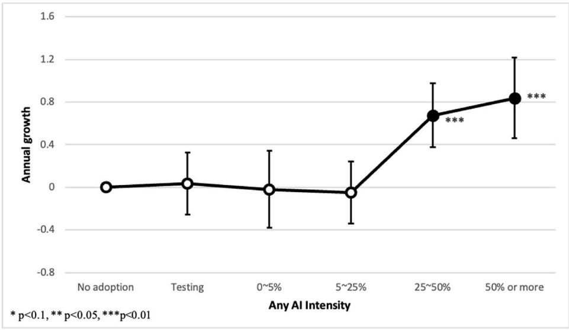
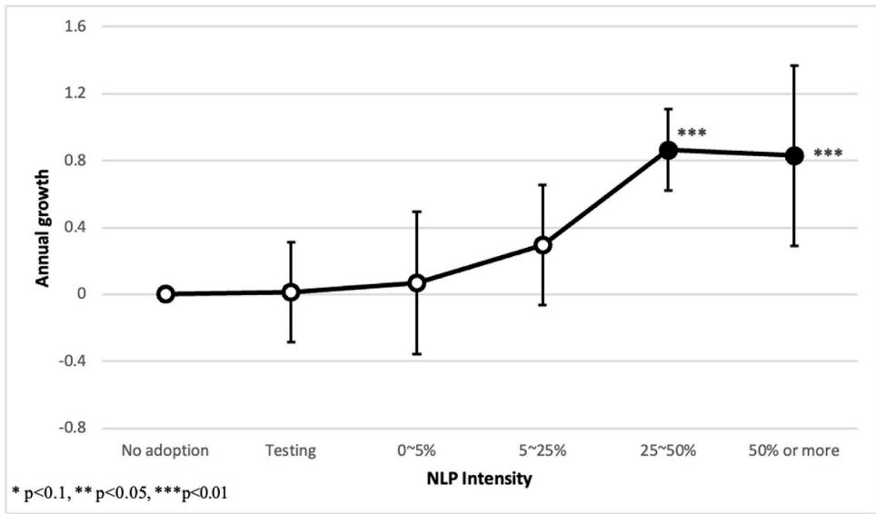
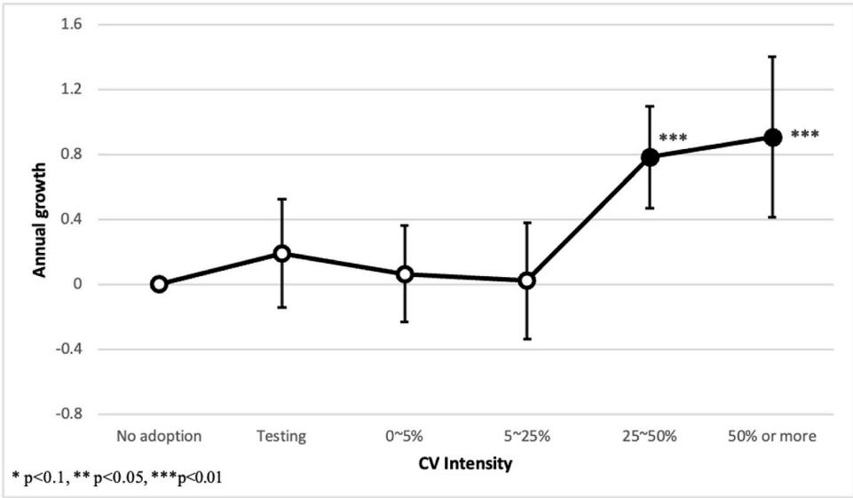
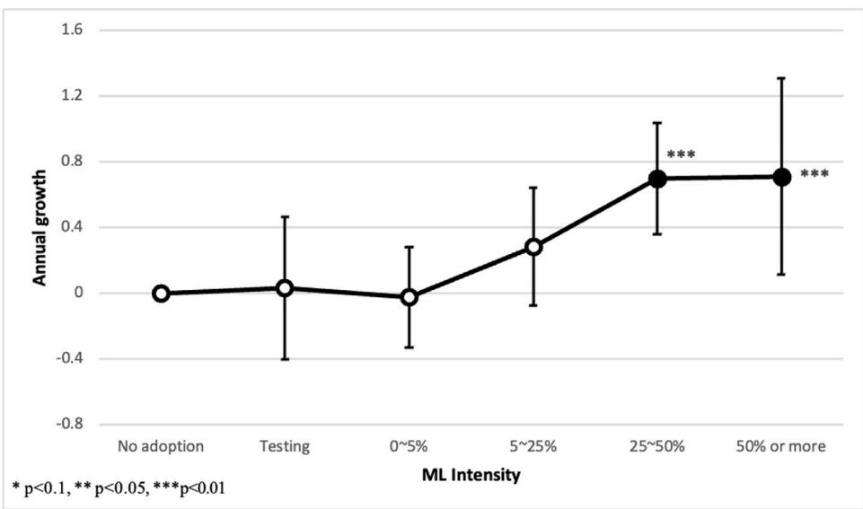
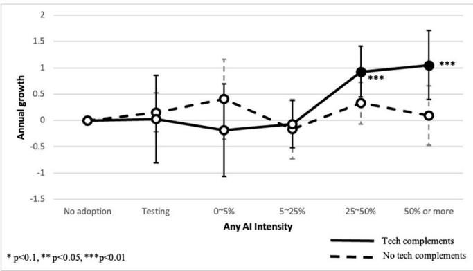
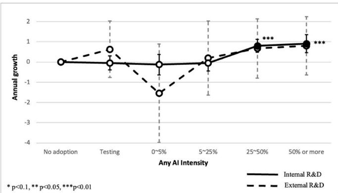

# 人工智能何时产生回报？AI采纳强度、互补性投资与研发战略

李永锡a,\*，金泰均b，崔硕宇c，金元俊d

- a 美国圣母大学凯奥格全球事务学院  
- b 韩国科学技术院（KAIST）创新与技术管理研究生院  
- c 美国麻省理工学院斯隆管理学院  
- d 韩国科学技术院（KAIST）商业与技术管理学院

# 文章信息

关键词：

人工智能

高科技新创企业

企业绩效

互补性投资

研发战略

# 摘要

本文考察高科技新创企业的绩效如何随人工智能（AI）采纳强度的变化而变化。研究发现，企业收入仅在对AI投入达到充分水平后才出现增长；且当企业同时投资于互补性技术并采取内部化研发战略时，AI采纳所带来的收益更大。具体而言，低水平的AI采纳并未带来显著的收入增长，但随着AI采纳强度的提升，收入增长开始显现。我们进一步发现，在那些同时投资于云计算和数据库系统等互补性技术的企业中，由AI采纳所驱动的绩效提升更为明显。此外，对于更专注于自身特有研发战略的新创企业而言，AI采纳强度与收入增长之间的正向关系也更为显著。

# 1. 引言

人工智能（AI）正日益被全球各类企业所采纳，其普及程度预计还将持续上升。事实上，AI已被广泛视为继信息技术（IT）、计算机和电力等重大技术创新之后的最新一代通用目的技术（General-Purpose Technology, GPT）（Goldfarb et al., 2020；Trajtenberg, 2019）。尽管AI自20世纪中叶起便已在计算机科学领域确立基础，但其发展与应用的迅猛扩张主要发生于过去十年间。近期，针对AI的大规模投资不断涌现，各类组织正处于积极采纳AI并探索其最优应用路径的过程中。因此，AI具备重塑创新方式、商业模式及组织形态的潜力，并将影响经济的方方面面（Cockburn et al., 2019）。

越来越多的研究探讨AI可能对经济产生的影响（Acemoglu et al., 2020；Brynjolfsson et al., 2019, 2021；Chalmers et al., 2020；Farboodi et al., 2019；Mihet and Philippon, 2019）。然而，数据匮乏是该领域文献中的主要制约因素，因而许多研究聚焦于AI的概念性影响分析（Brynjolfsson and Mitchell, 2017；Seamans and Raj, 2018）。为数不多的经验研究则主要集中于三大方向：（1）AI对劳动力市场的影响（Alekseeva et al., 2021；Webb, 2020）；（2）AI是否具备通用目的技术的特征（Goldfarb et al., 2020）；以及（3）AI采纳与上市公司的企业或行业层面绩效之间的关系（Seamans and Raj, 2018）。尽管新创企业在经济增长中具有关键作用（Lee, 2018），而技术进步又为创业机会提供了重要基础（Eckhardt and Shane, 2011），但我们对AI是否提升了高科技新创企业的生产率，以及若确有提升，其发生时机与内在机制为何，仍知之甚少。此外，鉴于互补性资产对于新技术的成功采纳与价值实现至关重要（Rothaermel, 2001；Thomke & Kuemmerle, 2002），目前关于这些互补性资产如何调节高科技新创企业AI采纳与其绩效之间关系的研究仍十分有限（Kim et al., 2021）。

本文旨在填补上述研究空白，通过实证证据揭示AI采纳对高科技新创企业绩效的影响。具体而言，本文提出以下研究问题：AI采纳是否与高科技新创企业绩效呈正向关联？若是，互补性技术与研发（R&D）战略又如何调节这一关系？为回答这些问题，我们首先从理论上阐释AI采纳可能提升企业绩效的机制，并实证检验高科技新创企业AI采纳强度与其绩效之间的关系。鉴于互补性投资与组织变革在新技术成功赋能企业绩效过程中发挥着关键作用，互补性技术与研发战略亦很可能成为企业充分获取AI采纳收益的重要前提（Felten et al., 2019）。据此，我们进一步检验企业对各类AI相关技术的投资及其研发战略是否与AI采纳形成协同效应。

本研究采用韩国高科技新创企业的新型调查数据与行政数据。在韩国，AI采纳进程正在加速，但不同企业间的采纳程度存在显著差异。我们基于自然语言处理（NLP）、计算机视觉（CV）和机器学习（ML）在产品或服务生产与开发过程中的应用比例，构建了AI采纳程度的测度指标。此外，我们的调查数据还涵盖了企业在数据库系统、云计算等各类技术上的投资情况，以及企业在调查时点（2019年）及基准年份的战略选择与企业特征信息。

我们发现，人工智能（AI）的采用与更高的收入增长率相关，但这种正向关系仅在采用程度较高时才显著。在采用程度较低的情况下——无论是企业仅处于技术试用阶段，还是采用率低于 $25\%$——我们均未观测到AI采用对企业绩效的提升效应。此外，我们还发现，在那些同时投资于互补性技术（如数据库系统和云计算）的企业中，高水平AI采用与收入增长之间的正向关系具有统计显著性。与以往的通用目的技术（GPTs）不同，AI本质上是一种用于数据分析的软件算法，其效用不可避免地取决于数据规模以及处理数据的能力。因此，数据库或云计算等技术构成了AI采用的重要互补条件。此外，我们还发现，在采取企业专属型内部研发（R&D）战略的企业中，高水平AI采用与收入增长之间的正向关系同样显著。这一结果表明，企业可通过开展专门针对自身独特商业环境与实际需求的AI相关研发活动而获益。

我们认为，本文提供了支持AI绩效收益存在滞后性的初步实证证据。尽管我们仅能测度AI采用的强度（intensity），而该指标未必直接反映采用的时间节点，但采用强度与采用时间很可能高度相关，因为AI采用通常在初期阶段强度较低，并随时间推移而逐步增强。尽管已有研究探讨过电力、汽车、计算机、信息技术及机器人等新技术所带来的生产率收益滞后现象（Brynolfsson, 1993；David, 1990；Brynjolfsson et al., 2019；Chung and Lee, 2022），但本文是最早揭示AI亦呈现类似滞后模式的研究之一。

本文结构安排如下：第2节梳理相关文献并提出关于AI采用潜在效益及互补性投资的假设；第3节介绍所用数据、调查方法、变量定义及描述性统计结果；第4节阐述实证策略；第5节报告主要实证结果，并检验潜在的作用机制；第6节总结全文，讨论研究结论的理论与实践启示、研究局限性以及未来研究方向。

# 2. 文献综述与研究假设

# 2.1 AI采用与企业绩效

人工智能（AI）是一类广泛计算技术的统称，其核心能力在于执行通常需依赖人类智能方可完成的任务。这些任务涵盖自然语言处理（NLP）、计算机视觉（CV）和机器学习（ML）等技术的具体应用，包括但不限于聊天机器人、文本生成、物体与人脸识别、自动驾驶以及推荐引擎。正如Agrawal等（2018）所强调，AI的关键特征在于其预测结果可被人类直接采纳并接受，或经适当调整后融入组织的决策流程。因此，AI的潜在效益主要体现为对分类、感知与问题求解等认知型任务的自动化，此类应用在各类工商与政府场景中具有广泛适用性。此外，AI算法具备通过反复训练不断提升自身预测能力的独特优势，最终可胜任高度复杂的认知任务。例如，制药企业已将AI技术引入早期药物研发环节，辅助提出可能的分子合成路径（Lou and Wu, 2020）；银行则运用AI技术改进风险管理，包括欺诈行为识别与贷款违约概率预测（Deloitte, 2018；Manser Payne et al., 2021）。由此，AI至少可通过以下三种重要机制提升企业生产率：（1）释放常规性任务负担；（2）降低人为错误与偏差；（3）助力发掘新的商业机会。

首先，AI可使劳动者摆脱重复性任务，转而从事更具生产力、更专业化及更具创新性的新任务。通过承担重复性的认知工作，AI有助于劳动者聚焦于人类具备比较优势的任务领域（Acemoglu and Restrepo, 2018）。例如，聊天机器人与语音机器人已在零售、银行、医疗保健及众多其他行业中替代了传统客服人员（Brynjolfsson et al., 2021；Cao, 2021；Chatterjee et al., 2020a,b；Deloitte, 2018；Manser Payne et al., 2021）。在某些情形下，企业甚至可能选择以AI系统全面替代人力，以控制劳动力成本并提升整体生产率。此类劳动力替代效应可促使企业将更多资源投入核心能力建设，从而潜在增强企业竞争力。

其次，AI可减少人类判断过程中常伴有的错误与偏差。由于错误与偏差往往会对生产率产生负面影响，AI的引入可在一定程度上弥补人类判断的不足，进而提升生产率（Tversky and Kahneman, 1974；Cowgill, 2019）。例如，计算机视觉（CV）技术在诊断某些疾病时的误差率低于人类医生，可辅助医生做出更精准的诊断并提供更优治疗方案（Gulshan et al., 2016）。与此相关，基于AI的系统目前已在医学多个专科领域显著提升了诊疗的准确性与效率（Wang et al., 2019）。尽管AI所依赖的数据本身可能存在偏差（因其源于人类决策过程），Cowgill（2019）指出：当人类决策噪声较大且不一致时，AI反而能够提供比人类更少偏差、更优的决策建议。

最后，通过处理复杂且庞大的数据集，人工智能（AI）能够提供解决难题的新方法，并催生新的商业机遇。例如，AlphaGo 在接受了海量棋手数据的训练后，通过实施全新的行棋序列，超越了人类棋手——而后者数百年来一直认为传统行棋序列更优（Singh 等，2017）。换言之，AI 能够从大量结构化与非结构化数据中识别出人类单凭启发式方法难以发现的模式，从而最终助力决策者发掘全新解决方案（Choi 等）。与此相关，零售商正利用 AI 提供个性化产品推荐；物流公司在使用机器学习（ML）算法以最小化库存积压并加快配送速度；银行则借助基于 AI 的风险评估算法，向新客户扩大信贷投放（Chatterjee，2020；Chatterjee 等，2020a,b；Hentzen 等，2021）。因此，AI 的数据驱动型算法降低了企业进入新市场的边际成本（Aghion 等，2019），并使其更易跨不同市场拓展业务（Goldfarb 等，2019；Klinger 等，2018；Trajtenberg，2019）。

简言之，AI 可通过多种机制提升生产率，例如使员工更专注于核心任务、减少错误与偏见，以及发掘新的商业机遇。因此，我们预测：AI 的采用与企业绩效的提升呈正相关关系。

假设 1a：AI 的采用与企业绩效呈正相关关系。

然而，仅在现有业务中引入 AI 并不能自动带来生产率提升。诸如 AI 之类的新技术，只有在同时进行有形投资（如设备、软件和基础设施）与无形投资（如业务与技术研发流程、组织重构及员工培训）时，才能实现其潜在的市场生产力（Brynjolfsson 等，2019）。既有研究表明，在通用目的技术（GPTs）引入之后，各行业曾因各类调整成本与学习滞后而出现产出下降（Atkeson 和 Kehoe，1993；Hornstein 和 Krusell，1996；Jovanovic 和 Nyarko，1994；Greenwood 和 Yorukoglu，1997；

Jovanovic 和 Rousseau，2005）。就 AI 而言，企业需投入大量研究时间，方能在自身业务、运营、技术研发及生产流程中识别出 AI 应用机会（McKinsey，2017）。此外，采用 AI 的企业须先完成组织层面的适应或变革，继而才能改造其业务的核心或外围环节。例如，企业在将 AI 应用于商业实践的过程中，需要人与机器之间频繁互动（Ransbotham 等，2020），因为多数商业流程涉及复杂任务，而现成可用的算法尚不充分（Raisch 和 Krakowski，2021）。这种人机协同学习的迭代过程，要求企业投入大量努力与资源，方能切实提升 AI 应用所带来的生产率增益。

此外，在 GPT 采纳初期，熟练劳动力供需之间的市场错配也可能阻碍生产率提升（Jovanovic 和 Rousseau，2005）。大量既有研究指出，物质资本与熟练劳动力之间的互补性，强于物质资本与非熟练劳动力之间的互补性（Griliches，1969；Duffy 等，2004；Goldin 和 Katz，1998；Franck 和 Galor，2017）。新技术会提高熟练劳动力的相对报酬，因为在采纳初期，其需求增长快于供给增长——电力化（1890–1918 年）与信息技术（IT）的发展历程即为此类例证（Jovanovic 和 Rousseau，2005）。就 AI 而言，当前企业面临的关键挑战之一，正是难以招募到具备 AI 实施能力的熟练人才（McKinsey，2017）；而 AI 领域熟练人才供需之间的错配，很可能延缓企业获得生产率收益的时间进程。

因此，要使 AI 的采用真正转化为生产力，企业必须在有形资产与无形资产两方面进行大量互补性投资，包括共同开发新产品与新型商业模式，以及人力资本投资。初期的生产率增长可能被低估，而相应的生产率收益将在必要且配套的业务转型完成后才逐步显现。这一现象曾在先前的通用目的技术演进过程中反复出现（Bresnahan 和 Trajtenberg，1996；Brynjolfsson，1993；David，1990），预计 AI 的发展也将遵循类似规律（Brynjolfsson 等，2019）。据此，我们提出如下假设：

假设 1b：AI 采用率与企业绩效之间的正向关联存在时滞效应。即，在采用初期，当采用率较低时，AI 可能尚未带来生产率收益；但随着采用率不断提高，相关收益将逐步显现。

# 2.2 AI 的采用与对互补技术的投资

Hitt 和 Brynjolfsson（1997）强调，互补性资产对于解释企业在采用新创新时所获回报的巨大差异具有关键意义。他们指出，绩效更高的企业不仅采纳新技术，同时也同步采用互补性技术及组织实践。与此一致，既有研究已证实，采纳互补性要素可带来生产率与绩效溢价（Aral 等，2012；Tambe 等，2012）。互补性资产对新技术采纳至关重要这一观点并非新论（Felten 等，2019）。但不同类型的技术，可能要求不同类型的互补性要素。

信息技术（IT）已被发现，在不同技术组件之间存在需求上的互补性（Arora 等，2010），而这种技术互补性塑造了企业的战略选择，并提高了市场进入壁垒（Bresnahan 和 Greenstein，1999）。例如，操作系统与企业软件之间的互补性（Kretschmer，2005）、路由器与交换机之间的互补性（Chen 和 Forman，2006）、互联网服务提供商（ISP）推出的 $56\mathrm{K}$ 模型与综合业务数字网（ISDN）采用之间的互补性（Augereau 和 Greenstein，2001）、文字处理软件与电子表格软件之间的互补性（Scott，1997），以及 IT 基础设施与电子商务能力之间的互补性（Zhu，2004），均表明：某项 IT 技术的使用会影响另一项 IT 技术投资的回报率（Arora 等，2010）。其中一项 IT 技术通过协调集成系统内部的信息流与资源流，从而促进另一项技术的有效应用，进而影响企业的市场绩效。换言之，技术互补性可影响企业调整或增强创新技术使用的能力，并最终影响其市场绩效。同样地，那些在采纳互补性产品或技术方面行动迟缓的企业，将在技术采纳与实施方面落后于前沿水平（David，1991）。

在此背景下，由于人工智能（AI）本质上是基于大型数据库中训练数据所构建的算法，其输出结果的质量高度依赖于数据采集、数据管理及计算能力。新颖且规模庞大的数据集能够催生新型 AI 业务。例如，当政府公开发布包含人物图像的数据集后，商用 AI 人脸识别软件得以开发（Beraja 等，2020）。许多高科技公司亦借助亚马逊云服务（AWS）、IBM Cloud 和微软 Azure 等云计算资源，获取足以处理大数据并运行 AI 算法的高性能计算能力。因此，AI 的实际应用需要配套的技术投资（Brynjolfsson 等，2019），而配套技术投资的水平与质量，将直接影响企业从 AI 采纳中获得的生产率收益。若一家企业为其 AI 应用配备了海量数据及高性能计算系统，则其更有可能高效地从 AI 采纳中获益。

假设 2：AI 采纳与企业生产率之间的正向关系，在企业对互补性技术（尤其是与大数据处理和高性能计算相关技术）进行投资时更为显著。

# 2.3. AI 采纳与研发（R&D）战略

研发（R&D）是新技术采纳与应用的基础。部分企业通过聘用研究人员并投资开展研发所需的资本，来推进内部自主研发；另一些企业则选择与科研院所或高校合作开展研发活动，甚至将研发工作外包。企业所采取的研发战略，体现了其整体业务战略的性质，并直接影响企业绩效。尽管学界普遍认为内部研发与外部研发具有互补性（Cassiman 和 Veugelers，2006），但侧重内部研发尤其有助于构建企业独有的专业知识体系，并促进知识与知识产权的持续积累。Cohen 与 Levinthal（1989）在其“吸收能力”理论中强调：企业内部知识的持续积累，对于有效识别、筛选并吸收外部知识至关重要（Griffith 等，2004）。简言之，开展内部研发可形成充足的吸收能力，从而扩大企业采纳外部技术或知识的空间；这对企业维护数据隐私与商业机密、保护专有算法而言尤为关键。

然而，就技术发展及其在企业业务、组织、运营与生产流程中的嵌入程度而言，AI 目前仍处于相对早期阶段。因此，企业特有的内部资源与能力可能尚不成熟，尚不足以与外部 AI 知识外包形成有效互补。麦肯锡全球研究院（2018）调查发现，仅有 $21\%$ 的受访企业表示 AI 已嵌入其业务部门或职能单元，而许多企业仍缺乏将 AI 映射至具体商业机会、数据来源及具备 AI 技能人才等基础性战略。

当企业引入 AI 等新兴技术时，该技术本身的特性将影响其研发模式的选择。如前所述，AI 的成功落地不仅依赖于持续维护大规模数据集，还需具备分析此类数据的高性能计算能力。企业可能倾向于自主部署 AI，自行构建训练数据库，并优化其内部流程（例如市场营销与销售、IT 运维等）。企业使用自有数据往往引发隐私与保密问题，尤其当这些数据可能被其他企业或机构访问时（Chatterjee 和 Sreenivasulu，2019；Tucker，2019）。因此，企业通常不愿将自身数据库暴露给外部组织，亦不愿与其共享，而更倾向于在内部完成数据分析。

此外，通过专利与版权对支撑企业 AI 系统的算法加以保护十分困难（Trippe，2020），而复制这些算法却相对容易。因此，自主开发 AI 系统的企业往往不愿披露专有信息，也不愿分享或公开其算法的具体运作机制。故而，具备相应能力的企业更倾向于招聘优秀的 AI 专家与科学家，以开展内部研发。事实上，麦肯锡（2017）指出，亚马逊、苹果、百度与谷歌等大型科技公司，将其 AI 相关预算的 $90\%$ 投入于内部研发及 AI 人才引进，仅 $10\%$ 用于 AI 相关并购。因此我们认为，相较于协作式或外部化的研发战略，企业专属的内部研发战略更能有效提升 AI 采纳所带来的生产率收益。

假设3：当企业采取内部研发战略时，人工智能采用与企业生产率之间的正向关系更强。

# 3. 数据

# 3.1. 数据与样本

我们基于中小企业和初创企业部提供的一个由1248家企业组成的随机抽样名单，对高科技初创企业开展了一项问卷调查。我们向名单中的所有企业发放了问卷，并于2019年历时三个月共回收300份有效问卷（即应答率约为 $24\%$）。根据中小企业和初创企业部的数据，受访企业的地理分布具有全国高科技初创企业的代表性。此外，依据韩国统计信息服务中心（KOSIS）的统计数据，本样本中受访企业在各地区营业收入方面的分布也具有全国高科技初创企业的代表性。

该问卷涵盖企业人工智能采用情况及商业战略的多个维度，共分为六个部分：（1）企业概况；（2）商业战略；（3）创新与技术采用；（4）人工智能采用；（5）融资状况；（6）企业所有者的人口统计特征。尤其值得注意的是，该问卷详细考察了企业在产品与服务的生产或开发过程中采用人工智能技术的程度——这一信息在大多数其他数据来源中难以获取。问卷还进一步询问了企业在自然语言处理（NLP）、计算机视觉（CV）和机器学习（ML）三类人工智能技术上的采用程度，以及企业在数据库系统、云计算等前期信息技术上的采用水平。此外，问卷还设置了一系列问题，用以评估企业对人工智能在研发、市场营销及客户服务等各类业务流程中所带来效益的主观认知。另一项极具价值的内容是关于企业研发战略的信息：我们请受访者对其企业更倾向于采用内部自主研发策略还是外部协作策略的程度进行评分。

在全部300家企业中，我们的核心实证样本聚焦于2015年及以前成立的企业。我们施加这一限制，是因为仅能观测到2019年（即问卷调查年份）的人工智能采用强度，而企业普遍自2015年起才开始采用人工智能技术，因此我们假定其2015年的人工智能采用率为 $0\%$。据中小企业和初创企业部数据显示，

在全部初创企业中，人工智能与大数据类初创企业在2013–2016年间仅占432家（占全部高科技初创企业的1.6%），但随后在2017–2020年间激增至2376家（占全部高科技初创企业的8.8%）。类似地，风险资本对人工智能初创企业的投资占比亦从2017年的1.7%（4000万美元）上升至2020年的18.5%（3.16亿美元）。这一增长趋势与韩国政府于2016年决定投入9.4亿美元发展人工智能及相关信息技术的战略决策相一致（OECD，2019）3。此外，《斯坦福人工智能指数报告2021》指出，自2016年以来，全球对人工智能领域劳动力的需求显著增长（Zhang et al., 2021）。上述趋势表明，将2015年人工智能采用率设定为零的假设是一个合理的近似。不过，在稳健性检验中，我们也进行了不施加该限制的分析。

将样本限定为2015年及以前成立的企业后，样本规模缩减至211家；随后又因部分企业未回答有关企业特征（如企业估值、人工智能采用强度）的问题，剔除37个观测值。除问卷数据外，我们还从中小企业现状信息系统（SMINFO，http://sminfo.mss.go.kr）——由中小企业和初创企业部运营的政府数据库——收集了相关企业的财务数据，包括营业收入数据。该数据库提供行业分类、成立年份、首席执行官信息、所在地、认证历史，以及最近五年来的财务数据（如营业收入、流动资产、负债等）。因此，该数据不仅有助于我们准确衡量企业财务绩效，还可用于交叉核验问卷中提供的基本信息。我们进一步剔除了14家因已停业而在SMINFO中无法查得营业收入数据的企业。经上述筛选后，最终样本包含160家企业。为确保最终样本的代表性，我们采用柯尔莫哥洛夫-斯米尔诺夫（K-S）双样本检验方法，将该160家企业的样本与全样本进行比较（Westphal and Bednar, 2005; Petrenko et al., 2019）。检验结果表明，两组样本在企业层面变量（如营收增长率、企业年龄、发展阶段、估值、融资额）和首席执行官层面变量（如年龄、性别、先前从业经验），以及行业与地区分布方面均无统计上显著差异。

# 3.2. 变量说明

表1列示了关键变量的描述性统计结果。就行业分布而言，约 $26\%$ 的企业属于软件行业，$17\%$ 属于制药行业（含医疗器械），$10\%$ 属于移动信息技术行业。这三类企业合计占全部样本的 $50\%$ 以上。企业平均年龄约为3.6年，总体处于“早期盈利阶段”与“成长阶段”之间。约 $54\%$ 的企业已采用至少一种人工智能技术（即NLP、CV或ML中的一种或多种）。

# 3.2.1. 自变量

人工智能采用强度。本研究的关键解释变量为企业在产品与服务的生产或开发等业务流程中所采用的人工智能技术，具体包括三类：（1）自然语言处理（NLP，即语音与模式识别、聊天机器人）；（2）计算机视觉（CV，即图像标注、图像识别）；（3）机器学习（ML，即推荐系统与预测模型）。为避免歧义，我们在问卷中对每类技术均作了明确解释并辅以实例说明。随后，请受访者就企业在上述三类人工智能技术中的采用程度分别打分（$1 = \text{未采用}$，$2 = \text{测试阶段}$，$3 =$

<table><tr><td>Variable</td><td>Obs.</td><td>Mean</td><td>Std. Dev.</td><td>Min.</td><td>Max.</td><td>1</td><td>2</td><td>3</td><td>4</td><td>5</td><td>6</td><td>7</td><td>8</td><td>9</td><td>10</td><td>11</td><td>12</td><td>13</td><td>14</td><td>15</td><td>16</td><td>17</td><td>18</td><td>19</td></tr><tr><td>1. Annual growth</td><td>160</td><td>1.458</td><td>.565</td><td>-.248</td><td>3.222</td><td>1</td><td></td><td></td><td></td><td></td><td></td><td></td><td></td><td></td><td></td><td></td><td></td><td></td><td></td><td></td><td></td><td></td><td></td><td></td></tr><tr><td>2. AI intensity</td><td>160</td><td>2.856</td><td>1.984</td><td>1</td><td>6</td><td>0.54*</td><td>1</td><td></td><td></td><td></td><td></td><td></td><td></td><td></td><td></td><td></td><td></td><td></td><td></td><td></td><td></td><td></td><td></td><td></td></tr><tr><td>3. NLP intensity</td><td>160</td><td>2.081</td><td>1.682</td><td>1</td><td>6</td><td>0.52*</td><td>0.70*</td><td>1</td><td></td><td></td><td></td><td></td><td></td><td></td><td></td><td></td><td></td><td></td><td></td><td></td><td></td><td></td><td></td><td></td></tr><tr><td>4. CV intensity</td><td>160</td><td>2.144</td><td>1.697</td><td>1</td><td>6</td><td>0.49*</td><td>0.74*</td><td>0.42*</td><td>1</td><td></td><td></td><td></td><td></td><td></td><td></td><td></td><td></td><td></td><td></td><td></td><td></td><td></td><td></td><td></td></tr><tr><td>5. ML intensity</td><td>160</td><td>2.188</td><td>1.687</td><td>1</td><td>6</td><td>0.51*</td><td>0.74*</td><td>0.64*</td><td>0.54*</td><td>1</td><td></td><td></td><td></td><td></td><td></td><td></td><td></td><td></td><td></td><td></td><td></td><td></td><td></td><td></td></tr><tr><td>6. Business stage</td><td>160</td><td>2.487</td><td>.761</td><td>1</td><td>4</td><td>-0.02</td><td>-0.03</td><td>-0.01</td><td>-0.01</td><td>-0.05</td><td>1</td><td></td><td></td><td></td><td></td><td></td><td></td><td></td><td></td><td></td><td></td><td></td><td></td><td></td></tr><tr><td>7. Firm valuation</td><td>160</td><td>3.894</td><td>1.452</td><td>2</td><td>6</td><td>0.12</td><td>0.10</td><td>0.02</td><td>0.07</td><td>0.19*</td><td>-0.03</td><td>1</td><td></td><td></td><td></td><td></td><td></td><td></td><td></td><td></td><td></td><td></td><td></td><td></td></tr><tr><td>8. Business model</td><td>160</td><td>1.681</td><td>.628</td><td>1</td><td>4</td><td>-0.04</td><td>0.02</td><td>-0.01</td><td>0.10</td><td>0.09</td><td>-0.04</td><td>0.07</td><td>1</td><td></td><td></td><td></td><td></td><td></td><td></td><td></td><td></td><td></td><td></td><td></td></tr><tr><td>9. Firm size</td><td>160</td><td>1.925</td><td>1.226</td><td>1</td><td>5</td><td>-0.08</td><td>-0.11</td><td>-0.13</td><td>-0.10</td><td>-0.01</td><td>0.34*</td><td>0.40*</td><td>0.12</td><td>1</td><td></td><td></td><td></td><td></td><td></td><td></td><td></td><td></td><td></td><td></td></tr><tr><td>10. Firm age</td><td>160</td><td>3.612</td><td>4.41</td><td>1</td><td>22</td><td>-0.20*</td><td>-0.13</td><td>-0.06</td><td>-0.10</td><td>-0.14</td><td>0.36*</td><td>0.05</td><td>0.09</td><td>0.33*</td><td>1</td><td></td><td></td><td></td><td></td><td></td><td></td><td></td><td></td><td></td></tr><tr><td>11. CEO gender</td><td>160</td><td>.912</td><td>.283</td><td>0</td><td>1</td><td>0.12</td><td>0.11</td><td>0.02</td><td>0.17*</td><td>0.07</td><td>0.02</td><td>0.21</td><td>-0.02</td><td>-0.06</td><td>0.04</td><td>1</td><td></td><td></td><td></td><td></td><td></td><td></td><td></td><td></td></tr><tr><td>12. CEO age</td><td>160</td><td>38.794</td><td>8.143</td><td>20</td><td>63</td><td>-0.18*</td><td>-0.24*</td><td>-0.23*</td><td>-0.12</td><td>-0.25*</td><td>-0.06</td><td>0.01</td><td>0.13</td><td>0.01</td><td>-0.11</td><td>0.03</td><td>1</td><td></td><td></td><td></td><td></td><td></td><td></td><td></td></tr><tr><td>13. CEO&#x27;s prior experience</td><td>160</td><td>.256</td><td>.438</td><td>0</td><td>1</td><td>0.10</td><td>0.06</td><td>0.07</td><td>0.02</td><td>0.10</td><td>-0.17*</td><td>0.09</td><td>-0.02</td><td>-0.20*</td><td>-0.22*</td><td>0.13</td><td>0.06</td><td>1</td><td></td><td></td><td></td><td></td><td></td><td></td></tr><tr><td>14. Firm type</td><td>160</td><td>1.3</td><td>.815</td><td>1</td><td>4</td><td>-0.17*</td><td>-0.07</td><td>-0.12</td><td>-0.06</td><td>0.01</td><td>-0.19*</td><td>0.21*</td><td>0.00</td><td>0.17*</td><td>0.03</td><td>0.01</td><td>0.23*</td><td>-0.18*</td><td>1</td><td></td><td></td><td></td><td></td><td></td></tr><tr><td>15. Ln (Funding)</td><td>160</td><td>.154</td><td>.524</td><td>0</td><td>3.600</td><td>0.15</td><td>-0.00</td><td>-0.11</td><td>0.08</td><td>0.04</td><td>-0.15</td><td>0.12</td><td>0.10</td><td>0.11</td><td>-0.11</td><td>0.04</td><td>0.05</td><td>-0.08</td><td>0.21*</td><td>1</td><td></td><td></td><td></td><td></td></tr><tr><td>16. Database adoption</td><td>160</td><td>.594</td><td>.493</td><td>0</td><td>1</td><td>0.29*</td><td>0.40*</td><td>0.34*</td><td>0.30*</td><td>0.36</td><td>0.18*</td><td>-0.05</td><td>-0.08</td><td>-0.07</td><td>0.03</td><td>0.06</td><td>-0.30*</td><td>-0.01</td><td>-0.15</td><td>-0.00</td><td>1</td><td></td><td></td><td></td></tr><tr><td>17. Cloud-computing adoption</td><td>160</td><td>.506</td><td>.502</td><td>0</td><td>1</td><td>0.18*</td><td>0.44*</td><td>0.38*</td><td>0.33*</td><td>0.33</td><td>-0.09</td><td>-0.00</td><td>-0.02</td><td>-0.17*</td><td>-0.06</td><td>0.00</td><td>-0.14</td><td>0.12</td><td>-0.07</td><td>-0.05</td><td>0.56*</td><td>1</td><td></td><td></td></tr><tr><td>18. ERP adoption</td><td>160</td><td>0.575</td><td>0.496</td><td>0</td><td>1</td><td>0.19*</td><td>0.10</td><td>0.16</td><td>0.18*</td><td>0.12</td><td>0.30*</td><td>-0.05</td><td>-0.07</td><td>0.12</td><td>0.09</td><td>0.09</td><td>-0.02</td><td>-0.07</td><td>-0.03</td><td>-0.05</td><td>0.27*</td><td>0.04</td><td>1</td><td></td></tr><tr><td>19. R&amp;D strategy</td><td>160</td><td>3.788</td><td>1.746</td><td>1</td><td>7</td><td>0.02</td><td>0.23*</td><td>0.07</td><td>0.17*</td><td>0.19*</td><td>-0.08</td><td>-0.01</td><td>0.10</td><td>-0.07</td><td>-0.03</td><td>0.04</td><td>-0.06</td><td>-0.07</td><td>0.04</td><td>-0.01</td><td>0.08</td><td>0.27*</td><td>-0.10</td><td>1</td></tr></table>

表1 描述性统计结果。

注：* 表示在5%水平上具有统计显著性。

$= 0\% \text{–}5\%$，$4 = 5\% \text{–}25\%$，$5 = 25\% \text{–}50\%$，且 $6 = 50\%$ 及以上）。由于企业通常将这三类人工智能技术协同使用，我们以三者中采用程度的最高值构建核心的人工智能采用强度指标。此外，我们还构建了一个二元变量用以标识“任何人工智能技术的采用”，即只要企业在任一技术上的采用水平属于第3、4、5或6类，该变量即取值为1，否则为0。

# 3.2.2. 调节变量

互补性技术。正如文献所述（Brynjolfsson 等，2019），其他技术的采用可能通过技术互补性影响人工智能采用所带来的收益，从而造成收益差异。据此，我们要求受访者报告其企业在产品与服务的生产或开发业务流程中，数据库系统与云计算技术的采用程度，其分类方式与前述人工智能采用强度的六类别划分一致。随后，我们分别为这两项技术构建了二元变量：若企业在某项技术上的采用程度超过 $0\%$（即对应第3、4、5或6类），则该变量取值为1；否则为0。

研发战略。为衡量企业的研发战略，我们请管理者在七点量表上指出其企业研发战略所处的位置：其中1表示以企业内部为导向的研发战略，强调由内部人才独立开展研发；7则表示与外部合作伙伴（如高校和公共研究机构）协作开展的研发战略。我们将该量表得分转化为一个二元变量，用于标识“内部研发战略”：得分1至4编码为1，其余情况编码为0。

# 3.2.3. 因变量

我们采用平均营业收入增长率作为企业绩效的衡量指标。经济学文献中常使用多种指标评估企业绩效，包括劳动生产率（人均营业收入）、盈利能力（营业净利润/投入资本）、托宾Q值（企业股票市值与其资本存量之比）以及营业收入增长率（Bloom 和 Van Reenen，2010）。鉴于本研究聚焦于中小型高科技创业企业——其中许多尚未上市，亦不对外公开财务报表——我们选用营业收入增长率作为主要结果变量，因其数据对新兴企业而言更易获取。如前所述，我们已从SMINFO数据库中成功获取相关企业的营业收入数据，特别是最近五年（2015–2019年）的营业收入。平均年营业收入增长率计算公式为 $\frac{\log\mathrm{Y}_{2019} - \log\mathrm{Y}_t}{2019 - t}$，其中 $t$ 表示企业成立年份（若企业成立于2015年之后）；若企业成立于2015年或更早，则 $t = 2015$。因此，$\log \mathrm{Y}_{2019}$ 表示企业2019年的营业收入，而 $\log \mathrm{Y}_t$ 则表示：对于2015年后成立的企业，为其成立当年 $t$ 的营业收入；对于2015年及以前成立的企业，则为其2015年的营业收入。

# 3.2.4. 控制变量

我们控制了一系列已被文献证实与企业绩效相关的公司及所有者特征变量。首先，我们控制企业年龄，即自成立年起至今的年限。其次，我们控制不同类型商业模式的影响：我们请受访者说明企业当前的商业模式（如B2C、B2B、B2G等），并将这些回答作为虚拟变量纳入模型。为控制企业所处不同成长阶段的影响，我们引入当前业务发展阶段这一变量，并设置如下虚拟变量：尚未盈利、早期盈利、成长期、临近IPO、已IPO。此外，我们还纳入企业估值这一控制变量，具体划分为若干档位的虚拟变量：约 $0\text{–}\$0.5$百万、$\$0.5\text{–}\$1$百万、$\$1\text{–}\$2$百万、$\$2\text{–}\$5$百万、$\$5\text{–}\$10$百万，以及 $\$10$ 百万以上。对于未上市企业，估值依据风险投资机构及其他金融机构的评估结果；对于已上市企业，则依据其股票市场价格确定。最后，为控制前期信息技术资本投入的影响，我们纳入企业是否在其业务中部署企业资源计划（ERP）系统这一变量，并构建一个二元变量：若企业ERP技术采用程度超过 $5\%$，则该变量取值为1；否则为0。

此外，研究表明，所有者特征对企业绩效具有显著影响（Lindquist 等，2015；Eesley 和 Lee，2020）。我们通过多个所有者相关变量来捕捉此类效应，包括所有者的性别、先前从业经验及其年龄。此外，我们还控制了特定企业类型之间的差异，设置了如下虚拟变量：独立创办企业、源自国内企业的衍生企业、源自国外企业的衍生企业、实验室衍生企业，以及合资企业。

考虑到企业特征随时间变化，我们还控制了企业在成立当年（若早于2014年，则统一取2014年）的一组变量。我们控制创业初期规模，以企业成立时员工总数为衡量标准，并设置如下虚拟变量：5–10人、11–15人、15–20人、21–30人，以及30人以上。企业绩效也可能因后续融资获取程度不同而存在差异，对此我们通过企业在成立时从各类渠道获得的融资金额予以控制。我们特别要求受访者填写每笔融资的发生年份及对应金额。最后，我们在所有回归设定中均加入了行业虚拟变量及创业企业所在地变量。

# 3.3. 描述性统计

表2按人工智能（AI）采用程度分组列示了描述性统计结果。AI采用程度较高的企业，通常比尚未采用AI技术的企业规模更小、成立时间更短。此外，估值更高的企业更倾向于更深入地采用AI技术。这一差异在未采用AI的企业与AI采用率超过$50\%$的企业之间尤为显著。由年龄较轻的首席执行官（CEO）或具有先前创业经历的CEO所创立的企业，更可能更深入地采用AI技术。值得注意的是，在所有采用水平上，AI采用均与数据库及云计算技术的采用呈正相关。最后，就本文的核心被解释变量——平均营业收入增长率而言，我们观察到：已采用AI技术的企业与未采用AI技术的企业在业绩表现上存在显著差异，尤其是AI采用率达到$25\%$及以上的企业。

# 4. 实证框架

我们介绍实证分析中所使用的营业收入增长率回归模型框架。考虑如下方程，该方程刻画了AI采用强度与企业绩效之间的一般关系：其中，$y_{it}$ 表示企业在第 $t$ 年的营业收入，$\mathrm{AI}_{it}$ 表示企业在第 $t$ 年的AI采用强度。控制变量向量 $\mathbf{X}_{\mathrm{it}}$ 包含一系列企业层面与所有者层面的变量，例如企业年龄、企业规模、企业发展阶段、企业估值、所属行业与地理位置，以及各类所有者特征（如年龄、性别、连续创业者身份）。尽管我们已纳入大量控制变量，但仍可能存在某些被遗漏变量，这些变量同时影响企业的AI采用强度与企业绩效。若存在此类遗漏变量，则方程（1）中AI采用系数的估计值将产生偏误。为缓解这一问题，我们通过在企业层面进行一阶差分回归，以控制不可观测的企业固定效应，具体形式如下：

$\Delta y_{i,2015-2019}$ 表示企业 $i$ 在2015年至2019年期间对数营业收入的变化值；$AI_{i,2019}^{k}$ 是一个虚拟变量，表示企业 $i$ 在2019年的AI采用强度，其中 $k$ 代表不同的采用水平：仅处于测试阶段但尚未正式采用、$0\%$–$5\%$、$5\%$–$25\%$、$25\%$–$50\%$，或 $50\%$ 及以上。$\mathbf{X}_i$ 表示企业与所有者特征；$\mathbf{W}_{i,2015}$ 表示企业在2015年的特征集合，其数据来源于我们在调查中设置的回溯性问题。$AI_{i,2019}^{k}$ 变量旨在捕捉AI采用程度的变化；正如我们在数据部分所讨论的，我们基于一个高度可信的假设，即企业在2015年或更早时期AI采用率为$0\%$。因此，2019年的AI采用水平可被视为AI采用程度的变化量。该假设具有合理性，因为韩国高科技创业企业的AI采用整体起步较晚：相较于美国，韩国的AI采用进程略为滞后，普遍始于2016年之后。该假设将样本限定于2015年或之前成立的企业。我们亦在在线附录表A2与A3中，分别以2014年和2016年作为时间节点，检验了不同年份设定下的稳健性结果。

方程（2）呈现了本分析所采用的增长率回归模型，其中AI采用变量的系数估计值（即 $\beta_{1}$ 至 $\beta_{5}$）表示：相较于未采用AI的企业，不同AI采用水平下企业平均年营业收入增长率的差异。若AI采用确实提升了企业绩效，则我们预期高AI采用强度水平（例如 $\beta_{4}$ 和 $\beta_{5}$）的系数估计值应大于零采用或低采用水平下的估计值。若如我们所假设的那样，AI带来的收益存在滞后效应，则低采用水平下的系数估计值可能不显著异于零，但在更高采用水平下则转为正值且显著。若存在类似所谓“J型曲线”效应（即AI采用初期因调整成本导致绩效暂时下降），则我们可能发现低采用水平下的部分系数估计值为负。尽管增长率回归模型无法完全消除所有潜在的内生性来源，但在控制变量体系较为丰富的情况下，所得结果仍能为AI采用如何影响企业绩效提供具有说服力的实证洞见。

# 5. 实证结果

# 5.1. AI采用强度的影响因素

我们首先在表3中考察与AI采用相关的企业及所有者特征。我们采用有序Logit回归，其中被解释变量为取值1至6的有序变量，对应六类AI采用水平：未采用、处于测试阶段、$0\%$–$5\%$、$5\%$–$25\%$、$25\%$–$50\%$，以及$50\%$及以上（见第（1）列）。此外，我们还进行了普通最小二乘法（OLS）回归，其中各被解释变量分别表示AI采用的累计水平（见第（2）至（5）列）。若干有趣模式由此浮现。第一，估值较高的企业更可能更深入地采用AI，但估值的影响未必呈线性关系。如第（4）列与第（5）列所示，估值相对较低（100万–500万美元）与估值较高（1000万美元及以上）的企业，均显著更可能以$25\%$及以上的强度采用AI。该结果表明，兼具高增长潜力的新兴企业与更为成熟的企业均倾向于高强度采用AI。然而，这种U型模式未必源于企业规模效应：第（1）列中所有企业规模虚拟变量的系数估计值均为负值。需注意，基准组（参照组）为企业规模为10人及以下的企业。因此，相较于小型企业，大型企业更不可能高强度采用AI。此外，关于企业……

<table><tr><td></td><td>No adoption</td><td>Testing stage</td><td>0–5%</td><td>5–25%</td><td>25–50%</td><td>50%</td><td>Total</td></tr><tr><td>Annual growth</td><td>1.221 (0.040)</td><td>1.276 (0.144)</td><td>1.340 (0.175)</td><td>1.205 (0.103)</td><td>1.902 (0.102)</td><td>2.070 (0.132)</td><td>1.458 (0.045)</td></tr><tr><td>Business stage</td><td>2.500 (0.089)</td><td>2.615 (0.241)</td><td>2.000 (0.447)</td><td>2.526 (0.177)</td><td>2.536 (0.120)</td><td>2.381 (0.176)</td><td>2.488 (0.060)</td></tr><tr><td>Firm valuation</td><td>3.851 (0.176)</td><td>3.462 (0.386)</td><td>4.200 (0.917)</td><td>3.579 (0.345)</td><td>3.929 (0.257)</td><td>4.476 (0.289)</td><td>3.894 (0.115)</td></tr><tr><td>Business model</td><td>1.689 (0.072)</td><td>1.538 (0.144)</td><td>1.600 (0.245)</td><td>1.579 (0.116)</td><td>1.857 (0.152)</td><td>1.619 (0.129)</td><td>1.681 (0.050)</td></tr><tr><td>Firm size</td><td>4.041 (1.232)</td><td>4.000 (1.581)</td><td>4.400 (1.140)</td><td>3.684 (1.157)</td><td>3.857 (1.146)</td><td>3.667 (1.197)</td><td>3.925 (1.226)</td></tr><tr><td>Firm age</td><td>4.284 (0.574)</td><td>3.000 (0.734)</td><td>3.400 (0.927)</td><td>3.632 (1.117)</td><td>2.214 (0.444)</td><td>3.524 (1.139)</td><td>3.613 (0.349)</td></tr><tr><td>CEO gender</td><td>0.892 (0.036)</td><td>0.846 (0.104)</td><td>1.000 (0.000)</td><td>0.895 (0.072)</td><td>0.929 (0.050)</td><td>1.000 (0.000)</td><td>0.913 (0.022)</td></tr><tr><td>CEO age</td><td>41.014 (0.992)</td><td>40.231 (2.453)</td><td>32.200 (2.478)</td><td>36.632 (1.734)</td><td>34.929 (1.324)</td><td>38.762 (1.285)</td><td>38.794 (0.644)</td></tr><tr><td>CEO&#x27;s prior experience</td><td>0.216 (0.048)</td><td>0.385 (0.140)</td><td>0.400 (0.245)</td><td>0.211 (0.096)</td><td>0.214 (0.079)</td><td>0.381 (0.109)</td><td>0.256 (0.035)</td></tr><tr><td>Firm type</td><td>1.392 (0.105)</td><td>1.077 (0.077)</td><td>1.600 (0.600)</td><td>1.263 (0.168)</td><td>1.036 (0.036)</td><td>1.429 (0.235)</td><td>1.300 (0.064)</td></tr><tr><td>Ln (Funding)</td><td>0.171 (0.069)</td><td>0.043 (0.036)</td><td>0.000 (0.000)</td><td>0.093 (0.052)</td><td>0.302 (0.142)</td><td>0.055 (0.029)</td><td>0.154 (0.041)</td></tr><tr><td>Database adoption</td><td>0.392 (0.057)</td><td>0.538 (0.144)</td><td>0.600 (0.245)</td><td>0.895 (0.072)</td><td>0.750 (0.083)</td><td>0.857 (0.078)</td><td>0.594 (0.039)</td></tr><tr><td>Cloud-computing adoption</td><td>0.270 (0.052)</td><td>0.462 (0.144)</td><td>0.600 (0.245)</td><td>0.789 (0.096)</td><td>0.786 (0.079)</td><td>0.714 (0.101)</td><td>0.506 (0.040)</td></tr><tr><td>ERP adoption</td><td>0.514 (0.058)</td><td>0.615 (0.140)</td><td>1.000 (0.000)</td><td>0.526 (0.118)</td><td>0.607 (0.094)</td><td>0.667 (0.105)</td><td>0.575 (0.039)</td></tr><tr><td>R&amp;D strategy</td><td>3.392 (0.194)</td><td>3.769 (0.469)</td><td>3.200 (0.583)</td><td>4.263 (0.404)</td><td>4.214 (0.335)</td><td>4.333 (0.410)</td><td>3.788 (0.138)</td></tr></table>

表2 描述性统计结果（按任意AI采用强度分组）。

注：标准误置于括号内。

规模为41或更大的系数在整个区间内均为负值且显著（在10%水平上），见第(5)列。

企业类型与人工智能（AI）采纳强度显著相关。源自其他公司的衍生企业采纳AI的可能性较低，而源自实验室的衍生企业则更可能高强度采纳AI。具有先前创业经历的首席执行官（即连续创业者）更可能高强度采纳AI。我们未发现年轻CEO更可能高强度采纳AI，这可能源于CEO年龄与企业估值或规模之间的相关性。最后，已采纳数据库系统和云计算的企业更可能更高强度地采纳AI。[8]

# 5.2 AI采纳强度与企业绩效

我们考察收入增长率与AI采纳之间的关系，重点关注任意程度的AI采纳。表4第(1)列考察任意AI技术，第(2)至(4)列则分别考察各类具体AI技术（自然语言处理NLP、计算机视觉CV及机器学习ML）。所有回归均控制了全部变量，包括基础控制变量（企业年龄、业务发展阶段、财务水平、前期技术采纳情况及所有者特征）、初始年份控制变量、行业固定效应以及地区固定效应。

结果表明，AI采纳企业的平均年收入增长率比非采纳企业高出约30个百分点。若分项考察各类AI技术，其效应介于32.4个百分点（ML）至45.8个百分点（NLP）之间。所有效应在1%统计水平上均显著，各回归的R²值均维持在0.5左右。第(2)至(4)列中效应量更大，可能源于多数企业往往同时采纳多种AI技术。[9]

接下来，我们考察AI采纳强度与企业绩效之间的关系。表5呈现了回归结果，图1则绘制了系数估计值。这些估计值表示：相较于未采纳AI的企业，不同采纳强度下企业年增长率的差异。如图1a–d所示，企业平均年收入增长率总体随AI采纳强度提升而上升，且该关系在较高采纳水平（即25%–50%或50%及以上）下变得显著。

然而，低水平的AI采纳或AI技术尚处于测试阶段时，并不能带来收入增长。上述发现与假设1a和1b一致，表明AI采纳可能带来延迟性的生产率提升。[10] 延迟性生产率提升背后可能存在多重原因：在AI采纳初期，企业往往需调整或重构其业务实践，以实现AI的有效应用；企业也可能在早期即意识到需进行互补性投资，例如研发投入、AI专用人力资本、数据基础设施及云计算能力。待互补性投资与组织重构完成后，企业方能开始收获AI带来的收益。

# 5.3 AI采纳与互补性投资

接下来，我们检验AI采纳与收入增长之间的关系是否在进行了互补性投资的企业中更为显著。如第2节所述，AI作为一种算法型技术所具有的独特属性，促使我们将分析聚焦于两类潜在的互补性技术投资：数据库与云计算，以及研发（R&D）战略。

表6展示了依据是否采纳数据库与云计算技术对企业样本进行划分后的回归结果。我们发现，在160家企业中，有83家投资了上述技术。表5中所呈现的AI采纳强度与收入增长之间的模式，仅存在于采纳了这些技术的企业中。图2通过绘制两组样本中任意AI技术采纳（对应表5第(1)列结果）的系数估计值，直观呈现了该结果。仅在投资了上述技术的企业中，才可观察到采纳强度达25%及以上时的明显跃升。

在表7中，我们进一步检验图2与表6中所呈现的差异是否具有统计显著性。我们将两组样本合并，并构建一个包含以下变量的回归模型：一个指示AI采纳强度是否达25%及以上的虚拟变量、一个指示企业是否采纳数据库与云计算的虚拟变量，以及二者之间的交互项。如第(1)列所示，该交互项系数为正，数值为0.637，标准误为0.175。收入增长率提高63.7个百分点。

<table><tr><td rowspan="3">Variables</td><td>(1)</td><td>(2)</td><td>(3)</td><td>(4)</td><td>(5)</td></tr><tr><td colspan="5">Any AI adoption (OLS)</td></tr><tr><td>Ologit</td><td>0% or more</td><td>5% or more</td><td>25% or more</td><td>50% or more</td></tr><tr><td rowspan="2">Firm age</td><td>0.004</td><td>0.001</td><td>-0.001</td><td>-0.005</td><td>0.009</td></tr><tr><td>(0.046)</td><td>(0.008)</td><td>(0.008)</td><td>(0.007)</td><td>(0.006)</td></tr><tr><td rowspan="2">Firm valuation ($1–2 million)</td><td>0.695</td><td>0.009</td><td>0.036</td><td>0.170**</td><td>0.118**</td></tr><tr><td>(0.469)</td><td>(0.087)</td><td>(0.086)</td><td>(0.077)</td><td>(0.052)</td></tr><tr><td rowspan="2">Firm valuation ($2–5 million)</td><td>0.333</td><td>0.038</td><td>0.039</td><td>0.102</td><td>0.109*</td></tr><tr><td>(0.413)</td><td>(0.082)</td><td>(0.084)</td><td>(0.081)</td><td>(0.057)</td></tr><tr><td rowspan="2">Firm valuation ($5–10 million)</td><td>0.397</td><td>-0.019</td><td>-0.002</td><td>0.114</td><td>0.102*</td></tr><tr><td>(0.456)</td><td>(0.081)</td><td>(0.081)</td><td>(0.081)</td><td>(0.058)</td></tr><tr><td rowspan="2">Firm valuation ($10 million and up)</td><td>1.631***</td><td>0.174</td><td>0.140</td><td>0.198*</td><td>0.269***</td></tr><tr><td>(0.602)</td><td>(0.110)</td><td>(0.094)</td><td>(0.103)</td><td>(0.074)</td></tr><tr><td rowspan="2">Firm size (11–20)</td><td>-0.653*</td><td>-0.068</td><td>-0.085</td><td>-0.046</td><td>-0.125***</td></tr><tr><td>(0.380)</td><td>(0.070)</td><td>(0.071)</td><td>(0.075)</td><td>(0.046)</td></tr><tr><td rowspan="2">Firm size (21–30)</td><td>-0.503</td><td>-0.079</td><td>-0.106</td><td>-0.070</td><td>-0.061</td></tr><tr><td>(0.607)</td><td>(0.105)</td><td>(0.100)</td><td>(0.099)</td><td>(0.066)</td></tr><tr><td rowspan="2">Firm size (31–40)</td><td>-0.287</td><td>0.043</td><td>-0.057</td><td>0.009</td><td>0.027</td></tr><tr><td>(0.670)</td><td>(0.122)</td><td>(0.123)</td><td>(0.122)</td><td>(0.092)</td></tr><tr><td rowspan="2">Firm size (41 or more)</td><td>-0.875</td><td>-0.136</td><td>-0.135</td><td>-0.079</td><td>-0.201*</td></tr><tr><td>(1.156)</td><td>(0.149)</td><td>(0.155)</td><td>(0.149)</td><td>(0.113)</td></tr><tr><td rowspan="2">CEO gender</td><td>0.309</td><td>0.092</td><td>0.070</td><td>0.103</td><td>0.064</td></tr><tr><td>(0.499)</td><td>(0.094)</td><td>(0.094)</td><td>(0.079)</td><td>(0.045)</td></tr><tr><td rowspan="2">CEO age</td><td>0.005</td><td>-0.004</td><td>0.001</td><td>-0.001</td><td>0.003</td></tr><tr><td>(0.022)</td><td>(0.003)</td><td>(0.003)</td><td>(0.003)</td><td>(0.002)</td></tr><tr><td rowspan="2">CEO&#x27;s prior experience</td><td>0.620*</td><td>0.054</td><td>0.025</td><td>0.035</td><td>0.095*</td></tr><tr><td>(0.372)</td><td>(0.070)</td><td>(0.070)</td><td>(0.068)</td><td>(0.053)</td></tr><tr><td rowspan="2">Firm type (spinoffs)</td><td>-1.525**</td><td>-0.119</td><td>-0.099</td><td>-0.176**</td><td>-0.056</td></tr><tr><td>(0.723)</td><td>(0.099)</td><td>(0.094)</td><td>(0.082)</td><td>(0.057)</td></tr><tr><td rowspan="2">Firm type (lab-based)</td><td>-0.190</td><td>0.001</td><td>-0.051</td><td>-0.045</td><td>0.134*</td></tr><tr><td>(0.565)</td><td>(0.094)</td><td>(0.090)</td><td>(0.093)</td><td>(0.077)</td></tr><tr><td rowspan="2">ln (Funding)</td><td>-0.427</td><td>-0.019</td><td>-0.009</td><td>-0.022</td><td>-0.060*</td></tr><tr><td>(0.371)</td><td>(0.045)</td><td>(0.045)</td><td>(0.048)</td><td>(0.033)</td></tr><tr><td rowspan="2">Database system adoption</td><td>0.730*</td><td>0.164**</td><td>0.193***</td><td>0.006</td><td>0.036</td></tr><tr><td>(0.408)</td><td>(0.072)</td><td>(0.074)</td><td>(0.069)</td><td>(0.047)</td></tr><tr><td rowspan="2">Cloud-computing adoption</td><td>1.197***</td><td>0.191***</td><td>0.193***</td><td>0.163**</td><td>-0.003</td></tr><tr><td>(0.389)</td><td>(0.073)</td><td>(0.072)</td><td>(0.066)</td><td>(0.046)</td></tr><tr><td rowspan="2">ERP adoption</td><td>0.088</td><td>0.046</td><td>-0.006</td><td>0.034</td><td>-0.003</td></tr><tr><td>(0.322)</td><td>(0.061)</td><td>(0.060)</td><td>(0.056)</td><td>(0.043)</td></tr><tr><td rowspan="2">Constant cut 1</td><td>1.425</td><td></td><td></td><td></td><td></td></tr><tr><td>(1.295)</td><td></td><td></td><td></td><td></td></tr><tr><td rowspan="2">Constant cut 2</td><td>1.870</td><td></td><td></td><td></td><td></td></tr><tr><td>(1.290)</td><td></td><td></td><td></td><td></td></tr><tr><td rowspan="2">Constant cut 3</td><td>2.065</td><td></td><td></td><td></td><td></td></tr><tr><td>(1.289)</td><td></td><td></td><td></td><td></td></tr><tr><td rowspan="2">Constant cut 4</td><td>2.842**</td><td></td><td></td><td></td><td></td></tr><tr><td>(1.292)</td><td></td><td></td><td></td><td></td></tr><tr><td rowspan="2">Constant cut 5</td><td>4.646***</td><td></td><td></td><td></td><td></td></tr><tr><td>(1.306)</td><td></td><td></td><td></td><td></td></tr><tr><td rowspan="2">Constant</td><td></td><td>0.255</td><td>0.0856</td><td>0.0793</td><td>-0.222*</td></tr><tr><td></td><td>(0.218)</td><td>(0.215)</td><td>(0.215)</td><td>(0.132)</td></tr><tr><td>Observations</td><td>253</td><td>253</td><td>253</td><td>253</td><td>253</td></tr><tr><td>R-squared</td><td>0.221</td><td>0.453</td><td>0.436</td><td>0.390</td><td>0.360</td></tr><tr><td>Pseudo R-squared</td><td></td><td></td><td></td><td></td><td></td></tr><tr><td>Business model</td><td>Yes</td><td>Yes</td><td>Yes</td><td>Yes</td><td>Yes</td></tr><tr><td>Current business stages</td><td>Yes</td><td>Yes</td><td>Yes</td><td>Yes</td><td>Yes</td></tr><tr><td>Industry-fixed effects</td><td>Yes</td><td>Yes</td><td>Yes</td><td>Yes</td><td>Yes</td></tr><tr><td>Region-fixed effects</td><td>Yes</td><td>Yes</td><td>Yes</td><td>Yes</td><td>Yes</td></tr></table>

表3 按采纳强度划分的人工智能采纳决定因素。

注：所有回归均控制了企业发展阶段、企业估值、商业模式、企业年龄、企业规模、CEO性别、CEO年龄、CEO先前经验、企业类型、融资金额、数据库系统、云计算采纳情况、ERP系统采纳情况，以及行业与地区固定效应。当前发展阶段与商业模式的回归结果未在表中列出。括号内为稳健标准误。***、** 和 * 分别表示在1%、5% 和10% 水平上的统计显著性。

<table><tr><td></td><td>(1)</td><td>(2)</td><td>(3)</td><td>(4)</td></tr><tr><td></td><td>Any AI</td><td>NLP</td><td>CV</td><td>ML</td></tr><tr><td></td><td>revenue growth</td><td>revenue growth</td><td>revenue growth</td><td>revenue growth</td></tr><tr><td>AI adoption</td><td>0.288**</td><td>0.458***</td><td>0.354***</td><td>0.324***</td></tr><tr><td></td><td>(0.120)</td><td>(0.109)</td><td>(0.113)</td><td>(0.113)</td></tr><tr><td>Observations</td><td>160</td><td>160</td><td>160</td><td>160</td></tr><tr><td>R-squared</td><td>0.491</td><td>0.548</td><td>0.511</td><td>0.507</td></tr><tr><td>Base control variables</td><td>Yes</td><td>Yes</td><td>Yes</td><td>Yes</td></tr><tr><td>Initial year controls</td><td>Yes</td><td>Yes</td><td>Yes</td><td>Yes</td></tr><tr><td>Industry-fixed effects</td><td>Yes</td><td>Yes</td><td>Yes</td><td>Yes</td></tr><tr><td>Region-fixed effects</td><td>Yes</td><td>Yes</td><td>Yes</td><td>Yes</td></tr></table>

表4 人工智能采纳与企业绩效。

注：基础控制变量包括企业发展阶段、企业估值、商业模式、企业年龄、CEO性别、CEO年龄、CEO先前经验、企业类型、数据库系统、云计算采纳情况及ERP系统采纳情况；初始年份控制变量包括企业规模与融资金额；控制变量还包括12个行业的固定效应与3个地区的固定效应。括号内为稳健标准误。***、** 和 * 分别表示在1%、5% 和10% 水平上的统计显著性。

<table><tr><td></td><td>(1)</td><td>(2)</td><td>(3)</td><td>(4)</td></tr><tr><td></td><td>Any AI</td><td>NLP</td><td>CV</td><td>ML</td></tr><tr><td></td><td>revenue growth</td><td>revenue growth</td><td>revenue growth</td><td>revenue growth</td></tr><tr><td>Testing</td><td>0.035</td><td>0.013</td><td>0.192</td><td>0.031</td></tr><tr><td></td><td>(0.148)</td><td>(0.151)</td><td>(0.170)</td><td>(0.222)</td></tr><tr><td>Adopt 0%–5%</td><td>-0.018</td><td>0.069</td><td>0.065</td><td>-0.023</td></tr><tr><td></td><td>(0.185)</td><td>(0.217)</td><td>(0.152)</td><td>(0.156)</td></tr><tr><td>Adopt 5%–25%</td><td>-0.049</td><td>0.296</td><td>0.024</td><td>0.284</td></tr><tr><td></td><td>(0.149)</td><td>(0.184)</td><td>(0.183)</td><td>(0.182)</td></tr><tr><td>Adopt 25%–50%</td><td>0.675***</td><td>0.866***</td><td>0.783***</td><td>0.700***</td></tr><tr><td></td><td>(0.153)</td><td>(0.124)</td><td>(0.161)</td><td>(0.173)</td></tr><tr><td>Adopt 50% or more</td><td>0.839***</td><td>0.829***</td><td>0.908***</td><td>0.711**</td></tr><tr><td></td><td>(0.193)</td><td>(0.275)</td><td>(0.253)</td><td>(0.305)</td></tr><tr><td>Observations</td><td>160</td><td>160</td><td>160</td><td>160</td></tr><tr><td>R-squared</td><td>0.658</td><td>0.647</td><td>0.614</td><td>0.573</td></tr><tr><td>Base control variables</td><td>Yes</td><td>Yes</td><td>Yes</td><td>Yes</td></tr><tr><td>Initial year controls</td><td>Yes</td><td>Yes</td><td>Yes</td><td>Yes</td></tr><tr><td>Industry-fixed effects</td><td>Yes</td><td>Yes</td><td>Yes</td><td>Yes</td></tr><tr><td>Region-fixed effects</td><td>Yes</td><td>Yes</td><td>Yes</td><td>Yes</td></tr></table>

表5 人工智能采纳强度与企业绩效。

注：基础控制变量包括企业发展阶段、企业估值、商业模式、企业年龄、CEO性别、CEO年龄、CEO先前经验、企业类型、数据库系统、云计算采纳情况及ERP系统采纳情况；初始年份控制变量包括企业规模与融资金额；控制变量还包括12个行业的固定效应与3个地区的固定效应。括号内为稳健标准误。***、** 和 * 分别表示在1%、5% 和10% 水平上的统计显著性。

在那些除人工智能（AI）技术外，还额外投资于数据库与云计算等互补技术的企业中，其绩效得分显著更高；相比之下，在AI采用强度较高（即达25%或以上）但未同步投资数据库与云计算技术的企业中，该绩效优势则不明显。上述发现与假设2一致。AI是一种基于算法的技术，其训练依赖于大规模数据库，而AI的性能表现则与数据采集、数据管理及计算能力密切相关。

图1a. 任意AI技术。

图1b. 自然语言处理（NLP）。

事实上，我们的研究结果表明：那些拥有海量数据资源并配备高性能计算系统以支撑其AI应用的企业，能更有效地从AI采用中获益。这一模式在各类具体AI技术中总体保持一致，其中机器学习（ML）所表现出的互补性最强，其次为计算机视觉（CV），再次为自然语言处理（NLP）。NLP与数据库系统及云计算之间较弱的交互效应可能意味着NLP需要不同类型的互补技术。例如，一些学者指出，当前NLP算法可通过引入其他机器学习算法以及开发新型优化方法进一步提升性能（Landola等，2020）。

接下来，我们考察AI采用与研发（R&D）战略之间的互补关系。部分企业采取更为开放、协作式的研发模式，而另一些企业则倾向于实施更具保密性、更强调企业自身特性的内部研发战略。后者可能更契合专有数据库与算法的应用需求，并更能响应企业独特生产工艺与商业战略所引发的组织重构需要。表8展示了将样本按“企业专属型内部研发战略”与“更开放协作型外部研发战略”两类划分后的回归结果。对比第(1)至(4)列可见，在采用企业专属型内部研发战略的企业中，AI采用程度越高，其营收增长率也越高，且该正向关系具有统计显著性。第(5)至(8)列的估计结果显示，在采取外部研发协作战略的企业中同样存在正向关联，但估计精度较低。图3亦印证了这一点：两组企业的系数估计值相近，但仅在内部研发战略子样本中达到统计显著水平。此外，当我们分AI技术类型考察时，内部研发战略企业的相关关系更为稳健。表9中的交互项分析进一步支持该结论：第(1)列显示，AI采用率达25%及以上的企业，其营收增长率平均高出53.9个百分点；而在采用内部研发战略的企业中，该增幅为39.9个百分点。当分别考察各AI技术时，所有交互项均为正值，且以ML的估计值最大。这些发现与假设3一致，表明倾向于实施内部研发战略的企业，更有可能高效利用那些通常具有专有性与企业特异性的算法与数据。

最后，我们探讨AI

图1c. 计算机视觉（CV）。

图1d. 机器学习（ML）。

高水平采用可能通过何种机制促进企业营收增长，结果见表10。我们向企业高管询问其公司计划如何运用AI来提升产品与服务。结果显示，AI采用程度较高的企业高管普遍预期，AI将在产品与服务改进、市场营销与销售、以及客户服务等方面带来显著提升——而这些方面均是影响企业营收的关键环节。尽管我们尚无法实证检验上述各维度在AI采用前后的实际变化情况，但表10的结果表明：AI的采用，尤其是更高强度的AI采用，可能通过提升企业的产品与服务质量、营销与销售能力以及客户服务效能，从而推动营收增长。

# 6. 讨论与结论

尽管企业层面的AI采用率正迅速上升，但关于AI采用如何影响企业绩效的实证证据仍相对匮乏。此外，近年来在技术持续进步的背景下，生产率却呈现下降趋势，这一现象令从事技术与生产率研究的学者深感困惑。本文聚焦于高科技创业企业，考察AI采用对其企业绩效的影响机制；尤其关注企业绩效如何随AI采用强度而变化，以及哪些企业战略能够与AI采用强度形成有效互补。

我们发现：低水平AI采用初期与营收增长并无显著关联；但随着AI采用强度提升，营收增长率显著上升。此外，此类延迟显现的生产率提升主要出现在两类企业中：一是投资于云计算、数据库系统等互补技术的企业；二是采取企业专属型内部研发战略的企业。后一点表明，只有当AI相关的研发活动被精准定制并深度嵌入企业业务体系时，AI才能切实提升企业绩效。综上所述，我们的研究结果表明：企业绩效确实随AI采用强度提升而提高，但前提是企业已对AI技术进行了充分投入；并且，当企业同步开展互补技术投资与适配性研发时，AI带来的绩效收益将更加显著。

随着AI采用程度持续深化，其带来的生产率提升效应有望进一步凸显。本研究结果提示：不同企业在AI采用后的绩效改善程度可能存在显著差异，关键取决于其是否投资于各类互补要素——既包括数据库系统、云计算等技术层面的互补性，也涵盖研发战略层面的互补性。许多企业，尤其是缺乏大型企业所具备技术能力的中小企业，仍在积极探索如何将AI融入自身业务体系。与此同时，

<table><tr><td rowspan="2">Variables</td><td>(1)</td><td>(2)</td><td>(3)</td><td>(4)</td><td>(5)</td><td>(6)</td><td>(7)</td><td>(8)</td></tr><tr><td>Any AI revenue growth</td><td>NLP revenue growth</td><td>CV revenue growth</td><td>ML revenue growth</td><td>Any AI revenue growth</td><td>NLP revenue growth</td><td>CV revenue growth</td><td>ML revenue growth</td></tr><tr><td></td><td colspan="4">No prior complementary technology</td><td colspan="4">Prior complementary technology</td></tr><tr><td>Testing</td><td>0.153 (0.186)</td><td>0.336 (0.198)</td><td>0.064 (0.217)</td><td>0.333 (0.219)</td><td>0.025 (0.423)</td><td>-0.328 (0.426)</td><td>0.724 (0.454)</td><td>-0.050 (0.627)</td></tr><tr><td>Adopt 0–5%</td><td>0.405 (0.388)</td><td>0.687 (0.482)</td><td>0.537 (0.433)</td><td>0.278 (0.339)</td><td>-0.185 (0.447)</td><td>-0.085 (0.471)</td><td>-0.049 (0.407)</td><td>0.198 (0.329)</td></tr><tr><td>Adopt 5–25%</td><td>-0.166 (0.287)</td><td>0.495 (0.380)</td><td>0.793 (0.601)</td><td>0.330 (0.364)</td><td>-0.072 (0.229)</td><td>0.505 (0.305)</td><td>-0.074 (0.251)</td><td>0.293 (0.229)</td></tr><tr><td>Adopt 25–50%</td><td>0.328 (0.203)</td><td>0.484 (0.435)</td><td>0.355 (0.307)</td><td>0.194 (0.254)</td><td>0.926*** (0.247)</td><td>0.972*** (0.253)</td><td>0.963*** (0.295)</td><td>1.047*** (0.295)</td></tr><tr><td>Adopt 50% or more</td><td>0.094 (0.288)</td><td>0.499 (0.514)</td><td>-0.107 (0.359)</td><td>-0.263 (0.436)</td><td>1.049*** (0.334)</td><td>1.111*** (0.403)</td><td>1.338*** (0.479)</td><td>1.681*** (0.517)</td></tr><tr><td>Observations</td><td>77</td><td>77</td><td>77</td><td>77</td><td>83</td><td>83</td><td>83</td><td>83</td></tr><tr><td>R-squared</td><td>0.766</td><td>0.797</td><td>0.788</td><td>0.764</td><td>0.790</td><td>0.733</td><td>0.750</td><td>0.731</td></tr><tr><td>Base control variables</td><td>Yes</td><td>Yes</td><td>Yes</td><td>Yes</td><td>Yes</td><td>Yes</td><td>Yes</td><td>Yes</td></tr><tr><td>Initial-year controls</td><td>Yes</td><td>Yes</td><td>Yes</td><td>Yes</td><td>Yes</td><td>Yes</td><td>Yes</td><td>Yes</td></tr><tr><td>Industry-fixed effects</td><td>Yes</td><td>Yes</td><td>Yes</td><td>Yes</td><td>Yes</td><td>Yes</td><td>Yes</td><td>Yes</td></tr><tr><td>Region-fixed effects</td><td>Yes</td><td>Yes</td><td>Yes</td><td>Yes</td><td>Yes</td><td>Yes</td><td>Yes</td><td>Yes</td></tr></table>

表6 假设2（AI采用强度与技术互补性）的异质性分析。

注：基础控制变量包括企业所处发展阶段、公司估值、商业模式、企业成立年限、CEO性别、CEO年龄、CEO先前从业经验、企业类型以及ERP系统采用情况。初始年份控制变量包括企业规模和融资金额。控制变量还包括12个行业的固定效应与3个地区的固定效应。括号内为稳健标准误。***、** 和 * 分别表示在1%、5% 和 10% 水平上具有统计显著性。

图2. 技术互补性。

全球各国政府正积极推动人工智能（AI）的发展与应用。2016年，美国宣布启动其人工智能倡议，旨在制定相关政策以扩大人工智能相关研发人员队伍并增加资金投入（Agrawal等，2016）；2019年，美国总统签署关于国家人工智能战略的行政命令，以维持本国在全球范围内的竞争力。[11] 类似举措亦正在中国、韩国以及欧盟各成员国等众多国家和地区持续推进。尽管此类人工智能倡议层出不穷，但鲜有研究具体探讨企业在人工智能采纳过程中所面临的现实挑战，以及人工智能所能带来的实际生产率提升效果。本研究的发现有助于企业界与政策制定者理解：哪些企业特征与较高水平的人工智能采纳率密切相关，以及企业应在何时、以何种方式实现人工智能采纳所带来的生产率收益。

更具体而言，推行人工智能政策的国家应同步推进云计算发展战略，并扩大及便利企业与创业者对云计算资源的获取渠道。云计算部署成本高昂，尤其对小型与初创企业而言负担沉重，而接入限制则可能阻碍人工智能的采纳及其高效发展。美国主要云服务提供商（如亚马逊云科技AWS与微软Azure）已面向初创企业和高校研究人员提供免费云积分支持（Marks，2018）。通过将

<table><tr><td rowspan="3">Variables</td><td>(1)</td><td>(2)</td><td>(3)</td><td>(4)</td></tr><tr><td>Any AI</td><td>NLP</td><td>CV</td><td>ML</td></tr><tr><td>revenue growth</td><td>revenue growth</td><td>revenue growth</td><td>revenue growth</td></tr><tr><td rowspan="2">Complementary tech</td><td>0.015</td><td>0.102</td><td>0.175</td><td>0.047</td></tr><tr><td>(0.102)</td><td>(0.103)</td><td>(0.106)</td><td>(0.110)</td></tr><tr><td rowspan="2">Any AI (25% or more)</td><td>0.281*</td><td></td><td></td><td></td></tr><tr><td>(0.153)</td><td></td><td></td><td></td></tr><tr><td rowspan="2">Any AI (25% or more) X Complementary tech</td><td>0.637***</td><td></td><td></td><td></td></tr><tr><td>(0.175)</td><td></td><td></td><td></td></tr><tr><td rowspan="2">NLP (25% or more)</td><td></td><td>0.535**</td><td></td><td></td></tr><tr><td></td><td>(0.267)</td><td></td><td></td></tr><tr><td rowspan="2">NLP (25% or more) X Complementary tech</td><td></td><td>0.284</td><td></td><td></td></tr><tr><td></td><td>(0.294)</td><td></td><td></td></tr><tr><td rowspan="2">CV (25% or more)</td><td></td><td></td><td>0.444*</td><td></td></tr><tr><td></td><td></td><td>(0.230)</td><td></td></tr><tr><td rowspan="2">CV (25% or more) X Complementary tech</td><td></td><td></td><td>0.464*</td><td></td></tr><tr><td></td><td></td><td>(0.250)</td><td></td></tr><tr><td rowspan="2">ML (25% or more)</td><td></td><td></td><td></td><td>0.011</td></tr><tr><td></td><td></td><td></td><td>(0.249)</td></tr><tr><td rowspan="2">ML (25% or more) X Complementary tech</td><td></td><td></td><td></td><td>0.798***</td></tr><tr><td></td><td></td><td></td><td>(0.275)</td></tr><tr><td>Observations</td><td>160</td><td>160</td><td>160</td><td>160</td></tr><tr><td>R-squared</td><td>0.700</td><td>0.641</td><td>0.638</td><td>0.597</td></tr><tr><td>Base control variables</td><td>Yes</td><td>Yes</td><td>Yes</td><td>Yes</td></tr><tr><td>Initial-year controls</td><td>Yes</td><td>Yes</td><td>Yes</td><td>Yes</td></tr><tr><td>Industry-fixed effects</td><td>Yes</td><td>Yes</td><td>Yes</td><td>Yes</td></tr><tr><td>Region-fixed effects</td><td>Yes</td><td>Yes</td><td>Yes</td><td>Yes</td></tr></table>

表7 假设2（人工智能强度与技术互补性）交互效应检验结果。

注：基础控制变量包括企业所处发展阶段、公司估值、商业模式、企业成立年限、CEO性别、CEO年龄、CEO先前从业经验、企业类型以及ERP系统采用情况。初始年份控制变量包括企业规模和融资金额。控制变量还包括12个行业的固定效应与3个地区的固定效应。括号内为稳健标准误。***、** 和 * 分别表示在1%、5% 和 10% 水平上具有统计显著性。

云计算纳入国家人工智能战略，各国可助力构建一个支持人工智能高效落地与应用的生态系统。

另一项关键政策内容是人工智能教育与人才培养。当前，人工智能研究人员的需求远超供给，且为数不多的人工智能研究人员大多被大型科技公司以高额薪酬招揽（Metz，2017；Tilley，2017）。而规模较小、资历较浅的企业由于难以提供同等水平的薪资待遇，在人工智能采纳与商业化进程方面明显滞后。尤其当企业内部研发战略与人工智能采纳呈现互补关系时（正如本研究所揭示），具备扎实人工智能技术背景的专业人才供给，对于中小企业实现人工智能的高效应用至关重要。

<table><tr><td rowspan="2">Variables</td><td>(1)</td><td>(2)</td><td>(3)</td><td>(4)</td><td>(5)</td><td>(6)</td><td>(7)</td><td>(8)</td></tr><tr><td>Any AI revenue growth</td><td>NLP revenue growth</td><td>CV revenue growth</td><td>ML revenue growth</td><td>Any AI revenue growth</td><td>NLP revenue growth</td><td>CV revenue growth</td><td>ML revenue growth</td></tr><tr><td></td><td colspan="4">Internal development</td><td colspan="4">External collaboration</td></tr><tr><td>Testing</td><td>-0.046(0.177)</td><td>-0.068(0.159)</td><td>0.124(0.249)</td><td>-0.190(0.204)</td><td>0.630(0.709)</td><td>0.037(1.084)</td><td>0.583(0.410)</td><td>-2.003(1.004)</td></tr><tr><td>Adopt 0–5%</td><td>-0.129(0.258)</td><td>0.212(0.309)</td><td>-0.048(0.388)</td><td>-0.038(0.183)</td><td>-1.549(1.243)</td><td>-0.956(0.538)</td><td>0.796(0.446)</td><td>-1.045(0.656)</td></tr><tr><td>Adopt 5–25%</td><td>-0.060(0.193)</td><td>-0.114(0.264)</td><td>0.083(0.206)</td><td>0.242(0.208)</td><td>0.194(0.933)</td><td>-0.457(0.513)</td><td>1.276**(0.450)</td><td>0.972(0.462)</td></tr><tr><td>Adopt 25–50%</td><td>0.805***(0.163)</td><td>0.804***(0.145)</td><td>0.732***(0.215)</td><td>0.763***(0.196)</td><td>0.669(0.747)</td><td>1.374**(0.382)</td><td>1.176**(0.391)</td><td>0.769(0.483)</td></tr><tr><td>Adopt 50% or more</td><td>0.904***(0.227)</td><td>1.095***(0.214)</td><td>1.027**(0.489)</td><td>1.399***(0.494)</td><td>0.795(0.733)</td><td>-2.518*(1.110)</td><td>2.145***(0.369)</td><td>0.836(0.518)</td></tr><tr><td>Observations</td><td>100</td><td>100</td><td>100</td><td>100</td><td>60</td><td>60</td><td>60</td><td>60</td></tr><tr><td>R-squared</td><td>0.850</td><td>0.860</td><td>0.781</td><td>0.820</td><td>0.948</td><td>0.975</td><td>0.989</td><td>0.978</td></tr><tr><td>Base control variables</td><td>Yes</td><td>Yes</td><td>Yes</td><td>Yes</td><td>Yes</td><td>Yes</td><td>Yes</td><td>Yes</td></tr><tr><td>Initial year controls</td><td>Yes</td><td>Yes</td><td>Yes</td><td>Yes</td><td>Yes</td><td>Yes</td><td>Yes</td><td>Yes</td></tr><tr><td>Industry-fixed effects</td><td>Yes</td><td>Yes</td><td>Yes</td><td>Yes</td><td>Yes</td><td>Yes</td><td>Yes</td><td>Yes</td></tr><tr><td>Region-fixed effects</td><td>Yes</td><td>Yes</td><td>Yes</td><td>Yes</td><td>Yes</td><td>Yes</td><td>Yes</td><td>Yes</td></tr></table>

表8 假设3（人工智能强度与研发投入）异质性分析结果。

注：基础控制变量包括企业所处发展阶段、公司估值、商业模式、企业成立年限、CEO性别、CEO年龄、CEO先前从业经验、企业类型、数据库系统、云计算采用情况以及ERP系统采用情况。初始年份控制变量包括企业规模和融资金额。控制变量还包括12个行业的固定效应与3个地区的固定效应。括号内为稳健标准误。***、** 和 * 分别表示在 $1\%$、$5\%$ 和 $10\%$ 水平上具有统计显著性。

图3. 研发互补性。

无法承担同类高薪的小型与初创企业，在人工智能采纳与商业化进程中正逐渐落后。尤其当企业内部研发战略与人工智能采纳之间存在互补关系（如本研究所发现）时，具备扎实人工智能技术背景的专业人才供给，对于中小企业实现人工智能的高效应用至关重要。

# 6.1 理论贡献与管理启示

本研究对学术文献作出了若干重要贡献。首先，本文拓展了有关人工智能影响的日益丰富的研究文献。现有大量人工智能相关文献聚焦于人工智能对劳动力市场的影响（Brynjolfsson等，2019；Felten等，2019；Webb，2020）。学者们虽已开始关注企业及管理者在人工智能采纳方面的响应行为，但该领域研究仍处于起步阶段（Cuellar等，2022）。此外，既有文献多采取行业特定视角，其中若干论文集中探讨金融行业（Fuster等，2019，2020；Bartlett等，2019）与医疗健康行业（Goldfarb等，2020；Eggleston等，2021）。本文则从企业层面切入，考察人工智能采纳行为及其对企业绩效的影响，并聚焦于多个高科技领域的初创企业，从而丰富并拓展了该研究脉络。

其次，本研究发现进一步深化了关于新技术应用后生产率提升存在滞后现象（即“J型曲线效应”）

<table><tr><td rowspan="3">Variables</td><td>(1)</td><td>(2)</td><td>(3)</td><td>(4)</td></tr><tr><td>Any AI</td><td>NLP</td><td>CV</td><td>ML</td></tr><tr><td>revenue growth</td><td>revenue growth</td><td>revenue growth</td><td>revenue growth</td></tr><tr><td rowspan="2">R&amp;D</td><td>0.037</td><td>-0.013</td><td>0.106</td><td>0.100</td></tr><tr><td>(0.133)</td><td>(0.095)</td><td>(0.095)</td><td>(0.100)</td></tr><tr><td rowspan="2">Any AI (25% or more)</td><td>0.539***</td><td></td><td></td><td></td></tr><tr><td>(0.133)</td><td></td><td></td><td></td></tr><tr><td rowspan="2">Any AI (25% or more) X R&amp;D</td><td>0.399**</td><td></td><td></td><td></td></tr><tr><td>(0.167)</td><td></td><td></td><td></td></tr><tr><td rowspan="2">NLP (25% or more)</td><td></td><td>0.561***</td><td></td><td></td></tr><tr><td></td><td>(0.180)</td><td></td><td></td></tr><tr><td rowspan="2">NLP (25% or more) X R&amp;D</td><td></td><td>0.357</td><td></td><td></td></tr><tr><td></td><td>(0.219)</td><td></td><td></td></tr><tr><td rowspan="2">CV (25% or more)</td><td></td><td></td><td>0.734***</td><td></td></tr><tr><td></td><td></td><td>(0.172)</td><td></td></tr><tr><td rowspan="2">CV (25% or more) X R&amp;D</td><td></td><td></td><td>0.140</td><td></td></tr><tr><td></td><td></td><td>(0.225)</td><td></td></tr><tr><td rowspan="2">ML (25% or more)</td><td></td><td></td><td></td><td>0.386**</td></tr><tr><td></td><td></td><td></td><td>(0.184)</td></tr><tr><td rowspan="2">ML (25% or more) X R&amp;D</td><td></td><td></td><td></td><td>0.588**</td></tr><tr><td></td><td></td><td></td><td>(0.239)</td></tr><tr><td>Observations</td><td>160</td><td>160</td><td>160</td><td>160</td></tr><tr><td>R-squared</td><td>0.682</td><td>0.644</td><td>0.616</td><td>0.594</td></tr><tr><td>Base control variables</td><td>Yes</td><td>Yes</td><td>Yes</td><td>Yes</td></tr><tr><td>Initial-year controls</td><td>Yes</td><td>Yes</td><td>Yes</td><td>Yes</td></tr><tr><td>Industry-fixed effects</td><td>Yes</td><td>Yes</td><td>Yes</td><td>Yes</td></tr><tr><td>Region-fixed effects</td><td>Yes</td><td>Yes</td><td>Yes</td><td>Yes</td></tr></table>

表9 假设3（人工智能强度与研发投入）交互效应检验结果。

注：基础控制变量包括企业所处发展阶段、公司估值、商业模式、企业成立年限、CEO性别、CEO年龄、CEO先前从业经验、企业类型、数据库系统、云计算采用情况以及ERP系统采用情况。初始年份控制变量包括企业规模和融资金额。控制变量还包括12个行业的固定效应与3个地区的固定效应。括号内为稳健标准误。***、** 和 * 分别表示在1%、5% 和 10% 水平上具有统计显著性。

以及新技术采纳过程中互补性要素重要性的经典文献（Brynjolfsson，1993；David，1990；Brynjolfsson等，2019；Chung与Lee，2022）。本文表明，作为最新一代通用目的技术（GPT），人工智能同样呈现出类似模式；而人工智能所引发的生产率提升滞后现象，可通过配套技术（如云计算）与研发战略予以缓解。这一结论

<table><tr><td rowspan="2">Variables</td><td>(1)</td><td>(2)</td><td>(3)</td></tr><tr><td>Improvement of service or products</td><td>Improvement of marketing and sales</td><td>Improvement of customer support</td></tr><tr><td>Testing</td><td>-</td><td>-</td><td>-</td></tr><tr><td rowspan="2">Adopt 0%–5%</td><td>0.232</td><td>0.275</td><td>0.490</td></tr><tr><td>(0.681)</td><td>(0.716)</td><td>(0.626)</td></tr><tr><td rowspan="2">Adopt 5%–25%</td><td>0.638</td><td>0.688</td><td>1.089**</td></tr><tr><td>(0.461)</td><td>(0.490)</td><td>(0.425)</td></tr><tr><td rowspan="2">Adopt 25%–50%</td><td>0.806*</td><td>0.881*</td><td>0.967**</td></tr><tr><td>(0.423)</td><td>(0.457)</td><td>(0.391)</td></tr><tr><td rowspan="2">Adopt 50% or more</td><td>0.857*</td><td>0.999*</td><td>0.994**</td></tr><tr><td>(0.493)</td><td>(0.529)</td><td>(0.451)</td></tr><tr><td>Observations</td><td>123</td><td>123</td><td>123</td></tr><tr><td>R-squared</td><td>0.290</td><td>0.348</td><td>0.284</td></tr><tr><td>Base control variables</td><td>Yes</td><td>Yes</td><td>Yes</td></tr><tr><td>Industry-fixed effects</td><td>Yes</td><td>Yes</td><td>Yes</td></tr><tr><td>Region-fixed effects</td><td>Yes</td><td>Yes</td><td>Yes</td></tr></table>

表10 可能的作用机制。

注：基础控制变量包括企业所处发展阶段、企业估值、商业模式、企业成立年限、CEO性别、CEO年龄、CEO先前从业经验、企业类型、数据库系统、云计算采纳情况以及ERP系统采纳情况；初始年份控制变量包括企业规模与融资金额。控制变量还包括12个行业的固定效应和3个地区的固定效应。括号内为稳健标准误。***、** 和 * 分别表示在1%、5% 和10% 水平上具有统计显著性。

这与既有文献一致，相关研究指出，通用目的技术（GPT）在采纳初期往往难以显现生产率提升效应，而需待后续阶段——当企业同步开展互补性技术投资，或进行无形资产层面的研发战略调整与组织变革时，其生产率收益才逐步显现（Jovanovic and Rousseau, 2005; Bresnahan, 2010; Majumdar et al., 2010）。鉴于当前众多企业仍处于人工智能采纳的相对早期阶段，人工智能带来的生产率提升尚未在统计数据中显现，实属意料之中。

与此相关，本研究亦具有重要的管理实践启示意义。我们的研究结果表明，管理者在引入并应用人工智能技术时，可能无法立即观察到技术所带来的效益，而更可能经历一段滞后期后方能收获切实的生产率提升。因此，管理者需具备一定耐心，以最终实现人工智能投资的实质性回报。此外，管理者还需认识到，仅对人工智能本身进行投资可能并不充分；他们还需统筹考虑在数据系统与云计算等领域的互补性投入，并相应调整研发方向，使之与人工智能投资战略相协同。本研究结果可为面临预算约束、亟需决策应优先配置哪些互补性资源的管理者提供实践指导。

# 6.2 局限性与未来研究方向

本研究并非毫无局限，未来研究可在本研究基础上进一步拓展。首先，受限于本研究问题的性质，我们在技术维度上将人工智能界定为若干特定学习算法（自然语言处理NLP、计算机视觉CV与机器学习ML）的组合。然而，未来研究可深入探讨人工智能不同维度的影响；例如，可辨析哪些类型的人工智能属于“增强人类能力的创新”，而哪些则属于“替代人类功能的创新”（Trajtenberg, 2019）。又或者，未来研究可考察人工智能在不同行业中的差异化应用场景。事实上，商业领域中人工智能的重大创新，并不在于持续精炼既有算法以使其性能略优于前代，而在于如何将这些算法创造性地应用于具体商业实践。正如此，与人工智能相关的大多数专利，其核心内容均聚焦于技术的具体应用方式（Webb, 2020）。因此，未来研究可基于不同行业背景，围绕人工智能的不同应用场景（如Simon, 2019），系统评估其生产率提升效应。目前，部分领域（如金融行业）已有一定进展（Fuster et al., 2019, 2020; Bartlett et al., 2019），但针对更多人工智能应用领域的实证分析仍显不足。

其次，在本研究样本中，我们发现技术投资与研发战略是人工智能采纳最具相关性的互补性因素。然而，本研究所采用的基于问卷调查的人工智能采纳测量方法存在固有局限，难以全面涵盖人工智能实施的全部内涵。理想的人工智能实施测量应同时涵盖数据质量、数据管理、数据治理及网络能力等多个维度。因此，若采用更为精细的人工智能测量指标，或许还能识别出其他类型的互补性因素。我们将此列为未来研究亟待改进的方向之一。此外，其他无形资产投资——尤其是与人力资源管理、企业组织架构、生产战略等相关方面的投资——在不同情境下也可能展现出更强的互补性。一个富有前景的后续研究方向是：面向其他类型企业（例如上市公司、发展中国家的企业）开展研究，并考察诸如财务能力、人力资源管理与组织结构、企业文化与实践等潜在互补性因素（Chatterjee et al., 2020a,b; Powell and Dent-Micallef, 1997; Bennett and Levinthal, 2017）。

最后，人工智能的影响将随时间推移而不断演化，并日趋复杂化。作为一项通用目的技术（GPT），人工智能尚处于发展初期。本文聚焦于韩国高科技创业企业的绩效收益分析。正如Agrawal等（2018）所强调，人工智能本质上是一种“预测机器”，而本文的分析亦建立在这样一种前提之上：即人工智能在企业中的主要作用是通过提升预测能力来辅助管理者与员工决策。然而，人工智能的应用范围正日益广泛且多样化，并已开始渗透至非商业领域，例如政府机构、学校与医院等。因此，未来针对人工智能在非商业部门影响的研究，将进一步深化我们对人工智能整体社会经济影响的系统性理解。

# 作者贡献

所有作者均同等参与了本研究的设计、分析与论文撰写工作。

# 利益声明

本文作者无任何需要声明的利益关系。

# 致谢

我们衷心感谢Scott Stern与Chuck Eesley在本项目早期阶段提出的宝贵意见。感谢韩科院（Hankook Research）的金贤洙（Hyun Soo Kim）协助开展问卷调查工作。金圭贞（Guijung Kim）提供了出色的研究支持。本研究获得以下机构资助：美国圣母大学凯奥赫全球事务学院（Keough School of Global Affairs at University of Notre Dame）、斯坦福大学弗里曼·斯波格利国际问题研究所（Freeman Spogli Institute for International Studies at Stanford University）、韩国教育部（Ministry of Education of the Republic of Korea）以及韩国国家研究基金会（National Research Foundation of Korea, NRF-2021R1A6A1A14045741）。

# 附录A：补充数据

本文的补充数据可在线获取：https://doi.org/10.1016/j.technovation.2022.102590。

# 参考文献

- Acemoglu, D., Autor, D., Hazell, J., Restrepo, P., 2020. 人工智能与就业：来自在线招聘启事的证据。NBER 工作论文第 28257 号。  
- Acemoglu, D., Restrepo, P., 2018. 人工智能、自动化与工作。工作论文编号 W24196。美国国家经济研究局（NBER）。  
- Aghion, P., Antonin, C., Bunel, S., 2019. 人工智能、增长与就业：政策的作用。《经济与统计》第 510 卷第 1 期，第 149–164 页。  
- Agrawal, A., Gans, J., Goldfarb, A., 2016. 奥巴马政府的人工智能政策路线图。《哈佛商业评论》。https://hbr.org/2016/12/the-obama-administrations-roadmap-for-ai-policy/  
- Agrawal, A., Gans, J., Goldfarb, A., 2018. 预测机器：人工智能的简单经济学。哈佛商业出版社，波士顿。

- 阿格拉瓦尔（Agrawal, A.）、甘斯（Gans, J.S.）、戈德法布（Goldfarb, A.），2019。《人工智能：自动化预测对劳动力市场的模糊影响》。《经济展望杂志》（*Journal of Economic Perspectives*）第33卷第2期，第31–50页。  
- 阿列克谢耶娃（Alekseeva, L.）、阿扎尔（Azar, J.）、希内（Gine, M.）、萨米拉（Samila, S.）、塔斯卡（Taska, B.），2021。《劳动力市场对人工智能技能的需求》。《劳动经济学》（*Labour Economics*）第71卷，102002。  
- 阿拉尔（Aral, Sinan）、布林约尔松（Brynjolfsson, Erik）、吴（Wu, Lynn），2012。《三方互补性：绩效薪酬、人力资源分析与信息技术》。《管理科学》（*Management Science*）第58卷第5期，第913–931页。  
- 阿罗拉（Arora, A.）、福尔曼（Forman, C.）、尹（Yoon, J.W.），2010。《互补性与信息技术采纳：局域网与互联网》。《信息经济学与政策》（*Information Economics and Policy*）第22卷第3期，第228–242页。  
- 阿特金森（Atkeson, A.）、凯霍（Kehoe, P.），1993。《产业演化与转型：信息资本的作用》。明尼阿波利斯联邦储备银行工作人员报告第162号（Staff Report No. 162）。  
- 奥热罗（Augereau, A.）、格林斯坦（Greenstein, S.），2001。《新兴通信市场对速度的需求：互联网服务提供商向先进技术的升级》。《产业组织国际杂志》（*International Journal of Industrial Organization*）第19卷第7期，第1085–1102页。  
- 巴特利特（Bartlett, R.）、莫尔斯（Morse, A.）、斯坦顿（Stanton, R.）、华莱士（Wallace, N.），2019。《金融科技时代的消费者信贷歧视》。美国国家经济研究局工作论文第w25943号（NBER Working Paper No. w25943）。  
- 比德（Beede, D.）等，2020。《在企业级调查中衡量技术采纳：年度商业调查》（*Measuring Technology Adoption in Enterprise-Level Surveys: the Annual Business Survey*）。美国经济学会（American Economic Association），圣地亚哥。  
- 本内特（Bennett, V.M.）、莱文塔尔（Levinthal, D.A.），2017。《企业生命周期：连接员工激励与企业增长动态》。《战略管理杂志》（*Strategic Management Journal*）第38卷第10期，第2005–2018页。  
- 贝拉哈（Beraja, M.）、杨（Yang, D.Y.）、博（Bó, E.D.）、恩尼科洛波夫（Enikolopov, R.）、弗里曼（Freeman, R.）、纽迈耶（Neumeyer, A.）、尼科利尼（Nicolini, J.P.）、佩特罗娃（Petrova, M.），2020。《数据密集型创新与国家：来自中国人工智能企业的证据》。美国国家经济研究局工作论文第27723号（NBER Working Paper 27723）。  
- 布鲁姆（Bloom, N.）、范·雷南（Van Reenen, J.），2010。《为何企业管理实践在不同企业与国家间存在差异？》。《经济展望杂志》（*Journal of Economic Perspectives*）第24卷第1期，第203–224页。  
- 布雷斯纳汉（Bresnahan, T.），2010。《通用目的技术》。载于：《创新经济学手册》（*Handbook of the Economics of Innovation*）第2卷，北荷兰出版社（North-Holland），阿姆斯特丹，第761–791页。  
- 布雷斯纳汉（Bresnahan, T.F.）、格林斯坦（Greenstein, S.），1999。《技术竞争与计算机产业的结构》。《产业经济学杂志》（*Journal of Industrial Economics*）第47卷第1期，第1–40页。  
- 布雷斯纳汉（Bresnahan, T.F.）、特拉滕贝格（Trajtenberg, M.），1996。《通用目的技术：“增长引擎”》。《计量经济学杂志》（*Journal of Econometrics*）第65卷第1期，第83–108页。  
- 布林约尔松（Brynolfsson, E.），1993。《信息技术的生产率悖论》。《美国计算机学会通讯》（*Communications of the ACM*）第36卷第12期，第66–77页。  
- 布林约尔松（Brynolfsson, E.）、米切尔（Mitchell, T.），2017。《机器学习能做什么？对劳动力的影响》。《科学》（*Science*）第358卷第6370期，第1530–1534页。  
- 布林约尔松（Brynolfsson, E.）、洛克（Rock, D.）、西弗森（Syverson, C.），2019。《人工智能与现代生产率悖论：期望与统计之间的冲突》。美国国家经济研究局工作论文第W24001号（NBER Working Paper No. W24001）。  
- 布林约尔松（Brynolfsson, E.）、洛克（Rock, D.）、西弗森（Syverson, C.），2021。《生产率J型曲线：无形资产如何补充通用目的技术》。《美国经济杂志：宏观经济学》（*American Economic Journal: Macroeconomics*）第13卷第1期，第333–372页。  
- 曹（Cao, L.），2021。《人工智能在零售业中的应用及价值创造逻辑》。《国际零售与分销管理杂志》（*International Journal of Retail & Distribution Management*）第49卷，第958–976页。  
- 卡西曼（Cassiman, B.）、韦格尔尔斯（Veugelers, R.），2006。《创新战略中互补性的探索：内部研发与外部知识获取》。《管理科学》（*Management Science*）第52卷第1期，第68–82页。  
- 查尔默斯（Chalmers, D.）、麦肯齐（MacKenzie, N.G.）、卡特（Carter, S.），2020。《人工智能与创业：第四次工业革命中创业活动的启示》。《创业理论与实践》（*Entrepreneurship Theory and Practice*），第1–26页。  
- 查特吉（Chatterjee, S.），2020。《印度的人工智能战略：政策框架、采纳挑战与政府行动》。《变革型治理：人、流程与政策》（*Transforming Government: People, Process and Policy*）第14卷，第757–775页。  
- 查特吉（Chatterjee, S.）、乔杜里（Chaudhuri, R.）、弗罗尼斯（Vronis, A.），2020a。《数据驱动型文化是否影响企业的创新与绩效？一项实证检验》。《运筹学年刊》（*Annals of Operations Research*）。https://doi.org/10.1007/s10479-020-03887-z（即将出版）。  
- 查特吉（Chatterjee, S.）、高什（Ghosh, S.K.）、乔杜里（Chaudhuri, R.）、乔杜里（Chaudhuri, S.），2020b。《印度产业对人工智能集成客户关系管理系统（CRM）的采纳：基于安全与隐私视角的分析》。《信息与计算机安全》（*Information and Computer Security*）第29卷，第1–24页。https://doi.org/10.1108/ICS-02-2019-0029。  
- 查特吉（Chatterjee, S.）、斯瑞尼瓦苏鲁（Sreenivasulu, N.S.），2019。《人工智能时代下的个人数据共享与人权法律问题：政府监管的调节效应》。《电子政务研究国际杂志》（*International Journal of Electronic Governance*）第15卷第3期，第21–36页。  
- 陈（Chen, P.Y.）、福尔曼（Forman, C.），2006。《在开放标准环境下，供应商能否影响转换成本与兼容性？》。《管理信息系统季刊》（*MIS Quarterly*）第30卷，第541–562页，2006。  
- 崔（Chung, J.）、李（Lee, Y.），2022。《机器人对就业的演变性影响》。基奥奇学院工作论文（Keough School Working Paper）。  
- 崔（Choi, S.）、金（Kim, N.）、金（Kim, J.）、康（Kang, H.）。《人工智能如何提升人类决策能力？来自人工智能驱动围棋程序的证据》（2021年7月26日）。SSRN 可获取：http://ssrn.com/abstract=3893835。  
- 科克伯恩（Cockburn, I.）、亨德森（Henderson, R.）、斯特恩（Stern, S.），2019。《人工智能对创新的影响：一项探索性分析》。载于：阿格拉瓦尔（Agrawal, A.）、甘斯（Gans, J.）、戈德法布（Goldfarb, A.）（编）：《人工智能经济学：一项议程》（*The Economics of Artificial Intelligence: an Agenda*），芝加哥大学出版社（University of Chicago Press），芝加哥，第115–148页。https://doi.org/10.7208/9780226613475-006。  
- 科恩（Cohen, W.M.）、莱文塔尔（Levinthal, D.A.），1989。《创新与学习：研发的双重面向》。《经济杂志》（*Economic Journal*）第99卷第397期，第569–596页。  
- 科格威尔（Cowgill, B.），2019。《人类与机器中的偏见与生产率》。哥伦比亚商学院研究论文（Columbia Business School Research Paper）。  
- 奎利亚尔（Cuéllar, M-F.）、拉尔森（Larsen, B.）、李（Lee, Y.S.）、韦伯（Webb, M.），2022。《有关人工智能监管的信息是否会改变管理者对伦理问题的评估及其采用人工智能的意愿？》。《法律、经济学与组织杂志》（*Journal of Law, Economics, and Organization*）。https://doi.org/10.1093/jleo/ewac004。  
- 戴维（David, P.），1990。《发电机与计算机：现代生产率悖论的历史视角》。《美国经济评论》（*American Economic Review*）第80卷第2期，第355–361页。  
- 戴维（David, P.），1991。《计算机与发电机：一面并不遥远的镜子中的现代生产率悖论》。载于：《技术与生产率：经济政策面临的挑战》（*Technology and Productivity: the Challenge for Economic Policy*），经合组织（OECD），巴黎，第315–347页。  
- 德勤（Deloitte），2018。《企业中人工智能现状》，第二版。网址：www.deloitte.com/insights/stateofai/。

- 达菲（Duffy, J.）、帕帕乔治乌（Papageorgiou, C.）、佩雷斯-塞巴斯蒂安（Perez-Sebastian, F.），2004。《资本—技能互补性？基于多国面板数据的证据》。《经济统计评论》（*Review of Economics and Statistics*）第86卷第1期，第327–344页。  
- 埃克哈特（Eckhardt, J.T.）、谢恩（Shane, S.A.），2011。《行业技术变革与互补性资产对高增长企业创建的影响》。《创业学杂志》（*Journal of Business Venturing*）第26卷第4期，第412–430页。  
- 埃斯利（Eesley, C.）、李永硕（Lee, Y.S.），2020。《大学创业教育项目是否促进创业？》。《战略管理杂志》（*Strategic Management Journal*）第42卷第4期，第833–861页。  
- 埃格尔斯顿（Eggleston, K.）、李永硕（Lee, Y.S.）、饭塚俊（Iizuka, T.），2021。《机器人技术与服务业劳动力：来自养老院的证据》。美国国家经济研究局工作论文（NBER Working Paper）第28322号。  
- 法尔博迪（Farboodi, M.）、米赫特（Mihet, R.）、菲利蓬（Philippon, T.）、菲尔德坎普（Veldkamp, L.），2019。《大数据与企业动态》。载于《美国经济学会论文与会议录》（*AEA Papers and Proceedings*）第109卷，第38–42页。  
- 费尔滕（Felten, E.W.）、拉吉（Raj, M.）、西曼斯（Seamans, R.），2019。《人工智能的职业影响：劳动力、技能与极化》。纽约大学斯特恩商学院（NYU Stern School of Business）。SSRN 可获取：https://ssrn.com/abstract=3368605。  
- 弗兰克（Franck, R.）、加洛尔（Galor, O.），2017。《工业化早期阶段的技术—技能互补性》。美国国家经济研究局（National Bureau of Economic Research），工作论文编号 w23197。  
- 富斯特（Fuster, A.）、戈德史密斯-平克汉姆（Goldsmith-Pinkham, P.）、拉马多赖（Ramadorai, T.）、瓦尔特（Walther, A.），2020。《可预测的不平等？机器学习对信贷市场的影响：机器学习对信贷市场的影响》。工作论文。  
- 富斯特（Fuster, A.）、普洛瑟（Plosser, M.）、施纳布尔（Schnabl, P.）、维克里（Vickery, J.），2019。《技术在住房抵押贷款中的作用》。《金融研究评论》（*Review of Financial Studies*）第32卷第5期，第1854–1899页。  
- 戈德法布（Goldfarb, A.）、塔斯卡（Taska, B.）、特奥多里迪斯（Teodoridis, F.），2019。《机器学习能否成为通用技术？——基于在线招聘启事数据对新兴技术的比较分析》（工作论文编号 w29767）。美国国家经济研究局（National Bureau of Economic Research）。  
- 戈德法布（Goldfarb, A.）、塔斯卡（Taska, B.）、特奥多里迪斯（Teodoridis, F.），2020。《人工智能在医疗保健领域的应用？——来自在线招聘启事的证据》。《美国经济学会论文与会议录》（*AEA Papers and Proceedings*）第110卷，第400–404页。  
- 戈尔丁（Goldin, C.）、卡茨（Katz, L.F.），1998。《技术—技能互补性的起源》。《经济学季刊》（*Quarterly Journal of Economics*）第113卷第3期，第693–732页。  
- 格林伍德（Greenwood, J.）、约鲁科古鲁（Yorukoglu, M.），1997年6月。载于《卡内基—罗切斯特公共政策会议系列》（*Carnegie-Rochester Conference Series on Public Policy*）第46卷。北荷兰出版社（North-Holland），阿姆斯特丹，第49–95页。  
- 格里菲思（Griffith, R.）、雷丁（Redding, S.）、范·雷嫩（Reenen, J.V.），2004。《描绘研发的双重面孔：经合组织（OECD）各产业面板中的生产率增长》。《经济统计评论》（*Review of Economics and Statistics*）第86卷第4期，第883–895页。  
- 格里利切斯（Griliches, Z.），1969。《资本—技能互补性》。《经济统计评论》（*Review of Economics and Statistics*）第51卷第4期，第465–468页。  
- 古尔尚（Gulshan, V.）、彭磊（Peng, L.）、科拉姆（Coram, M.）、斯图姆佩（Stumpe, M.C.）、吴笛（Wu, D.）、纳拉亚纳斯瓦米（Narayanaswamy, A.）等，2016。《用于视网膜眼底照片中糖尿病视网膜病变检测的深度学习算法的开发与验证》。《美国医学会杂志》（*JAMA*）第316卷第22期，第2402–2410页。  
- 亨岑（Hentzen, J.K.）、霍夫曼（Hoffmann, A.）、多兰（Dolan, R.）、帕拉（Pala, E.），2021。《面向客户的金融服务中的人工智能：系统性文献综述与未来研究议程》。《国际银行营销杂志》（*International Journal of Bank Marketing*）。https://doi.org/10.1108/JBM-09-2021-0417。  
- 希特（Hitt, L.M.）、布林约尔松（Brynjolfsson, E.），1997。《信息技术与企业内部组织：一项探索性分析》。《管理信息系统杂志》（*Journal of Management Information Systems*）第14卷第2期，第81–101页。  
- 霍恩斯坦（Hornstein, A.）、克鲁塞尔（Krusell, P.），1996。《技术进步是否可能导致生产率放缓？》。《NBER宏观经济学年会》（*NBER Macroeconomics Annual*）第11卷，第209–259页。  
- 伊安多拉（Iandola, F.N.）、肖（Shaw, A.E.）、克里希纳（Krishna, R.）、凯策尔（Keutzer, K.W.），2020。《SqueezeBERT：计算机视觉能为自然语言处理提供哪些关于高效神经网络的启示？》。arXiv 预印本 arXiv:2006.11316。  
- 乔瓦诺维奇（Jovanovic, B.）、尼亚尔科（Nyarko, Y.），1994。《干中学与技术选择》。美国国家经济研究局（National Bureau of Economic Research），工作论文编号 w4739。  
- 乔瓦诺维奇（Jovanovic, B.）、鲁索（Rousseau, P.L.），2005。《通用技术》。载于阿吉翁（Aghion, P.）、杜尔劳夫（Durlauf, S.）主编：《经济增长手册》（*Handbook of Economic Growth*）第1卷。爱思唯尔（Elsevier），阿姆斯特丹，第1181–1224页。  
- 金泰勋（Kim, T.）、朴妍（Park, Y.）、金武（Kim, W.），2021。《人工智能与企业绩效（一）》。载于《管理学会年会论文集》（*Academy of Management Proceedings*）第2021卷。管理学会（Academy of Management），编号14361。纽约州布赖阿克利夫庄园（Briarcliff Manor, NY 10510）。  
- 克林格（Klinger, J.）、马特奥斯-加西亚（Mateos-Garcia, J.C.）、斯塔苏洛普洛斯（Stathoulopoulos, K.），2018。《深度学习，深度变革？——人工智能作为通用技术的发展图谱》。SSRN 可获取：https://ssrn.com/abstract=3233463。  
- 克雷奇默（Kretschmer, T.），2005。《数据库管理系统市场中的竞争性技术》。SSRN 可获取：https://ssrn.com/abstract=850505。  
- 李永硕（Lee, Y.），2018。《政府担保的小企业贷款与区域增长》。《创业学杂志》（*Journal of Business Venturing*）第33卷第1期，第70–83页。  
- 林奎斯特（Lindquist, M.J.）、索尔（Sol, J.）、范·普拉格（Van Praag, M.），2015。《为何创业型父母更可能养育出创业型子女？》。《劳动经济学杂志》（*Journal of Labor Economics*）第33卷第2期，第269–296页。  
- 楼波（Lou, B.）、吴琳（Wu, Lynn），2020。《人工智能赋能药物研发：人工智能与药物创新的大规模实证考察》。SSRN 可获取：https://ssrn.com/abstract=3524985。  
- 马朱姆达尔（Majumdar, S.K.）、卡拉雷（Carare, O.）、张浩（Chang, H.），2010。《宽带采纳与企业生产率：通用技术效益评估》。《产业与公司变革》（*Industrial and Corporate Change*）第19卷第3期，第641–674页。  
- 曼瑟·佩恩（Manser Payne, E.H.）、达尔（Dahl, A.J.）、佩尔蒂埃（Peltier, J.），2021。《面向人工智能服务的数字服务化价值共创框架：金融服务业生态系统数字化转型的研究议程》。《互动营销研究杂志》（*Journal of Research in Interactive Marketing*）第15卷，第200–222页。  
- 马克斯（Marks, G.），2018。《微软免费赠送云存储空间……及其他本周小型企业科技新闻》。《福布斯》（*Forbes*），2月11日。https://www.forbes.com/sites/quickerbettertech/2018/02/11/microsoft-is-giving-away-free-cloud-storage-and-other-small-business-tech-news-this-week/?sh=618c95bcaa6e/。  
- 麦肯锡公司（McKinsey），2017。《人工智能：下一个数字前沿？》。可获取于：https://www.mckinsey.com/\~/media/McKinsey/Industries/Advanced%20Electronics/Our%20Insights/How%20artificial%20intelligence%20can%20deliver%20real%20value%20to%20companies/MGI-Artificial-Intelligence-Discussion-paper.shx。  
- 麦肯锡公司（McKinsey），2018。《人工智能采纳持续推进，但基础性障碍依然存在》。可获取于：https://www.mckinsey.com/features-insights/artificial-intelligence/ai-adoption-advances-but-foundational-barriers-remain。  
- 梅茨（Metz, C.），2017。《科技巨头正为稀缺的人工智能人才支付巨额薪资》。《纽约时报》（*The New York Times*），10月22日。https://www.nytimes.com/2017/10/22/technology/artificial-intelligence-experts-salaries.html。

- 米赫特，R.，菲利普松，T.，2019。大数据与人工智能的经济学。载于：崔，J.，奥兹坎，B.（编），《数字世界中的商业与金融颠覆性创新》，第108卷。爱默瑞尔德出版有限公司，第29–43页。  
- 经济合作与发展组织（OECD），2019。《人工智能在社会中的应用》。OECD出版，巴黎。https://doi.org/10.1787/eedfee77-en。  
- 彼得连科，O.V.，艾梅，F.，雷森德斯，T.，钱德勒，J.A.，2019。谦逊预期之主张：首席执行官的谦逊与市场绩效。《战略管理杂志》40（12），1938–1964。  
- 鲍威尔，T.C.，登特-米卡尔莱夫，A.，1997。信息技术作为竞争优势：人力、业务与技术资源的作用。《战略管理杂志》18（5），375–405。  
- 拉伊施，S.，克拉科夫斯基，S.，2021。人工智能与管理：自动化与增强之间的悖论。《美国管理学会评论》46（1），192–210。  
- 兰斯博瑟姆，S.，霍达班德，S.，基龙，D.，坎德隆，F.，朱，M.，拉方丹，B.，2020。通过组织学习拓展人工智能的影响。《麻省理工学院斯隆管理评论》。https://sloanreview.mit.edu/projects/expanding-ais-impact-with-organizational-learning/?utm_medium=pr&utm_source=release&utm_campaign=ReportBCGAI2020。  
- 罗萨赫尔姆，F.T.，2001。既有企业的优势：通过企业间合作开发互补性资产。《战略管理杂志》22（6–7），687–699。  
- 希曼斯，R.，拉吉，M.，2018。人工智能、劳动力与生产率：对微观企业层面数据的需求。美国国家经济研究局工作论文，编号 w24239。  
- 西蒙，J.P.，2019。人工智能：范围、参与主体、市场与地理分布。《数字政策、监管与治理》21，208–237。https://doi.org/10.1108/DPRG-08-2018-0039。  
- 辛格，S.，奥昆，A.，杰克逊，A.，2017。人工智能：从零开始学习围棋。《自然》550（7676），336–337。  
- 斯科特，A.，1997。《创新与技术路径依赖的持续性》。斯坦福大学博士论文。  
- 坦布尔，P.，希特，L.M.，布林约尔松，E.，2012。外向型公司：外部信息实践如何影响创新与生产率。《管理科学》58（5），843–859。  
- 托梅克，S.，库默勒，W.，2002。资产积累、相互依赖性与技术变革：来自制药领域新药研发的证据。《战略管理杂志》23（7），619–635。

- 蒂利，A.，2017。《人工智能人才争夺大战：亚马逊居首，苹果几乎不见踪影》。《福布斯》（4月18日）。https://www.forbes.com/sites/aaronttilley/2017/04/18/the-great-ai-recruitment-war-amazon-is-on-top-and-apple-is-almost-nowhere-to-be-seen/?sh=abaacba61e5d/。  
- 特拉伊滕贝格，M.，2019。人工智能作为下一代通用目的技术（GPT）。载于：《人工智能经济学：一项议程》。芝加哥大学出版社，第175–186页。  
- 特里普，A.，2020。人工智能是当今最热门的技术，因此首席信息官必须学会如何防范模仿者。《福布斯》（7月6日）。https://www.forbes.com/sites/anthonytrippe/2020/07/06/ai-is-todays-hottest-technology-so-cios-need-to-learn-how-to-protect-it-from-copycats/#36639d537dba/。  
- 塔克，C.，2019。第17章：隐私、算法与人工智能。载于：阿格拉瓦尔，A.，甘斯，J.，戈德法布，A.（编），《人工智能经济学：一项议程》。芝加哥大学出版社，芝加哥，第423–438页。https://doi.org/10.7208/9780226613475-019。  
- 特沃斯基，A.，卡尼曼，D.，1974。不确定性下的判断：启发式与偏差。《科学》185（4157），1124–1131。  
- 王炜，高国光，阿加瓦尔，R.，2019。朋友还是对手？人工智能对医疗病历编码中人类绩效的影响。工作论文。SSRN可获取：https://ssrn.com/abstract=3405759。  
- 韦布，M.，2020。《人工智能对劳动力市场的影响》。工作论文。SSRN可获取：https://ssrn.com/abstract=3482150。  
- 韦斯特法尔，J.D.，贝德纳，M.K.，2005。董事会中的多元无知现象及其对企业在低绩效下战略惯性的助长作用。《行政科学季刊》50（2），262–298。  
- 张丹，米什拉，S.，布林约尔松，E.，埃切门迪，J.，甘古利，D.，格罗斯，B.，等，2021。《2021年人工智能指数年度报告》。人工智能指数指导委员会，以人为本的人工智能研究所，斯坦福大学，斯坦福。  
- 朱坤，2004。信息技术基础设施与电子商务能力的互补性：基于资源观对其商业价值的评估。《管理信息系统杂志》21（1），167–202。  
- 佐拉斯，N.，克罗夫，Z.，布林约尔松，E.，麦克埃尔赫兰，K.，比德，D.N.，巴芬顿，C.，等，2021。《美国企业对先进技术的采纳与使用：来自年度商业调查（编号 W28290）的证据》。美国国家经济研究局。