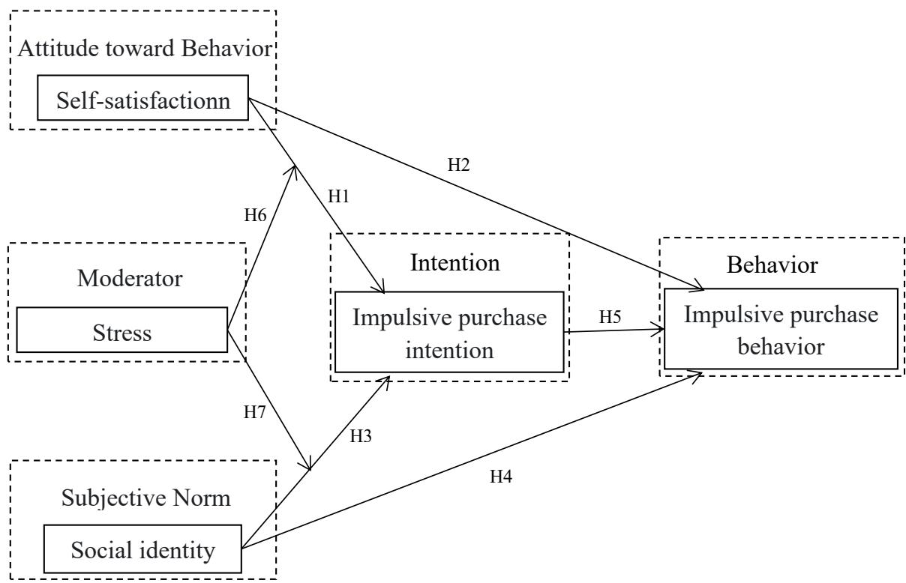
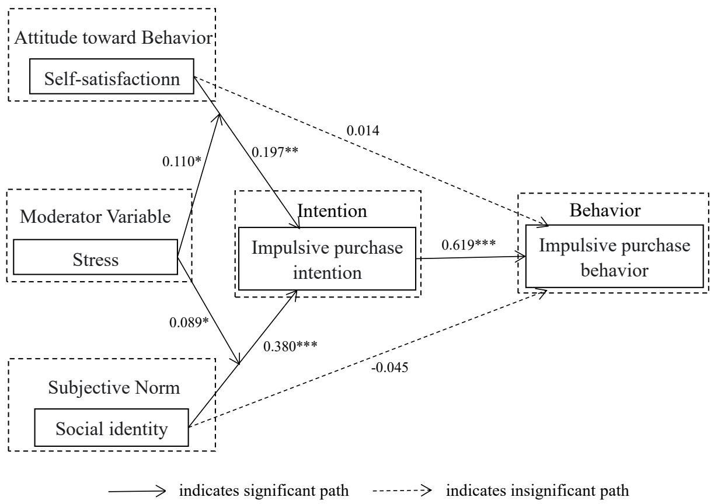
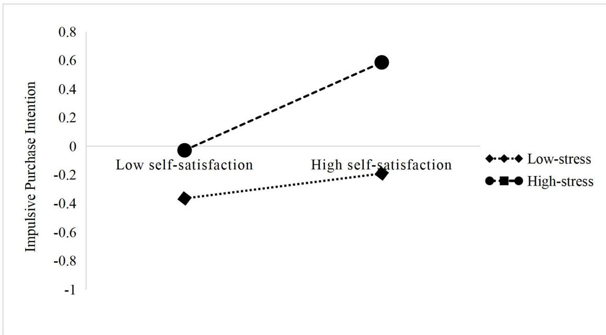
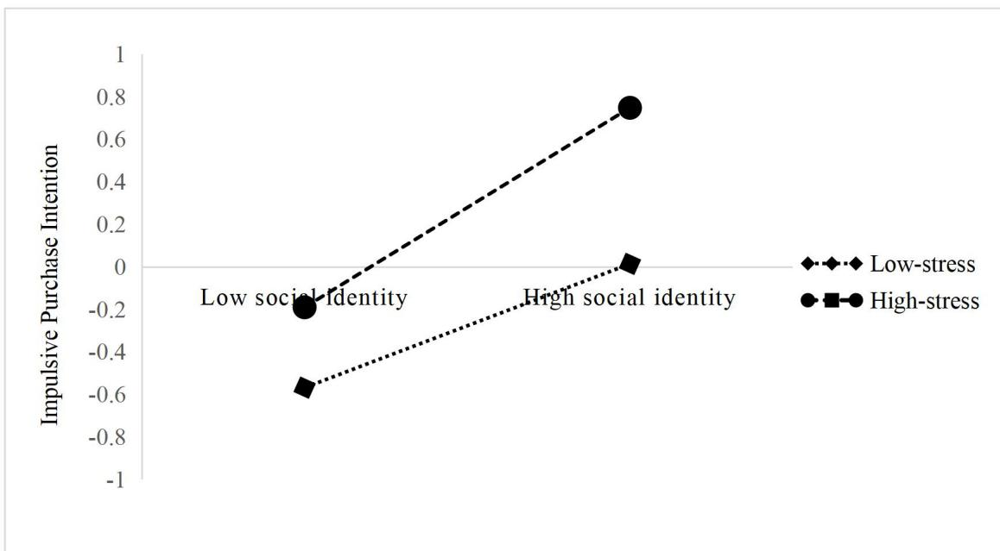

> # Self-pleasure, pleasing others, and impulsive consumption: Consumer decision-making under stress

**[译]**

# 自我取悦、取悦他人与冲动消费：压力情境下的消费者决策

---

> # Abstract

**[译]**

# 摘要

---

> Based on the Theory of Symbolic Consumption and the Theory of Reasoned Action, this study explores how “self-pleasure” (self-satisfaction) and “pleasing others” (social identity) influence impulsive consumption within the context of “Guzi” consumption in anime and manga culture, while examining the moderating role of stress. Using structural equation modeling on data from 543 consumers with “Guzi” consumption experience, this study reveals that both self-satisfaction and social identity have positive impacts on impulsive purchase intention, with social identity exerting a stronger influence. Impulsive purchase intention significantly and fully mediates the effects of self-satisfaction and social identity on impulsive purchase behavior. Additionally, stress exhibits varying moderating effects across different paths. Specifically, it significantly strengthens the impact of self-satisfaction on purchase intention only in high-stress situations. Social identity, however, has significant effects on impulsive purchase intention in both high- and low-stress situations, with its impact being more intense under high stress. This study not only offers a new perspective for understanding the psychological motivation mechanism of impulsive spending under the anime and manga culture but also provides practical insights for precise marketing and market guidance in relevant consumption scenarios.

**[译]**

本研究基于符号消费理论与理性行为理论，探讨在动漫文化语境下的“谷子”消费中，“自我取悦”（即自我满足）与“取悦他人”（即社会认同）如何影响冲动性消费行为，并考察压力在其中所起的调节作用。本研究基于543名具有“谷子”消费经历的消费者问卷数据，采用结构方程模型进行分析。结果表明：自我满足与社会认同均对冲动购买意向具有显著正向影响，且社会认同的影响强度更大；冲动购买意向在自我满足、社会认同对冲动购买行为的影响过程中起着显著且完全的中介作用；压力在不同路径上表现出差异化的调节效应：具体而言，压力仅在高压力情境下显著增强自我满足对购买意向的影响；而社会认同对冲动购买意向的影响在高、低压力情境下均显著，且其影响强度在高压力情境下更为突出。本研究不仅为理解动漫文化背景下冲动消费的心理动机机制提供了新视角，也为相关消费场景中的精准营销与市场引导提供了实践启示。

---

> Keywords: self-satisfaction, social identity, stress, impulsive consumption, “Guzi” consumption

**[译]**

关键词：自我满足；社会认同；压力；冲动消费；“谷子”消费

---

> # Introduction

**[译]**

# 引言

---

> As the living standards of young people in China continue to rise and their spiritual needs become increasingly diverse, anime and manga culture, a major subculture form, is spreading rapidly in China (Yu, Kwong, & Bannasilp, 2023). It has successfully evolved from a niche culture to permeating mainstream life, consequently driving the expansion of the general anime and manga culture user base (Chen, 2021). According to statistics, the number of extended anime and manga culture users in China reached 460 million in 2021 (Zhang, 2024). In 2024, China’s anime and manga industry was valued at nearly 600 billion yuan, making it the world’s largest market for anime, manga, and related products (Shao, 2025). In China, the post-1995 generation, also known as Generation Z and the first “digital natives,” has emerged as a dominant force in cultural consumption, particularly in the Intellectual Property (IP) consumption sector (Lei et al., 2024). This massive consumer group has provided a solid foundation for the emergence of “Guzi” consumption.

**[译]**

随着中国青年生活水平持续提升，其精神需求日益多元，作为主流亚文化形态之一的动漫文化正在中国迅速传播（Yu, Kwong, & Bannasilp, 2023）。该文化已成功由小众圈层走向主流生活，进而推动了泛动漫文化用户群体的持续扩容（Chen, 2021）。统计数据显示，2021年中国泛动漫文化用户规模已达4.6亿人（Zhang, 2024）。至2024年，中国动漫产业总值接近6000亿元人民币，成为全球规模最大的动漫及相关产品市场（Shao, 2025）。在中国，出生于1995年之后的“Z世代”——亦即首批“数字原住民”——已成为文化消费，尤其是知识产权（IP）消费领域中的主导力量（Lei et al., 2024）。这一庞大的消费群体为“谷子”消费现象的兴起奠定了坚实基础。

---

> “Guzi,” derived from the phonetic translation of “goods” in English, refers to anime and manga memorabilia authorized by official IP holders, such as tin badges and acrylic figures. Some of these items are sold in blind boxes, with original prices mostly ranging from a dozen to a few dozen yuan. Similar to the global popularity of IPs like Jellycat, characters from Labubu, Chiikawa, and Molly, as well as the latest cinematic sensations Ne Zha and Ao Bing, are gaining prominence through dedicated "Guzi" shops. In 2024 alone, China’s “Guzi economy” reached 168.9 billion yuan (US$23.5 billion), and this figure is expected to nearly double to 300 billion yuan (US$42 billion) by 2029, reshaping China’s consumption patterns and retail landscape (Li, 2025). This reflects the rapid rise of “Guzi” consumption as a consumer trend in China, as well as its popularity as an impulsive consumption model among young people.

**[译]**

“谷子”一词源自英文“goods”的音译，特指由官方IP持有方授权生产的动漫周边商品，如金属徽章、亚克力立牌等。其中部分商品以盲盒形式销售，原始售价多在十余元至数十元不等。与全球范围内Jellycat等IP广受欢迎类似，Labubu、Chiikawa、Molly等IP角色，以及最新影视爆款《哪吒》《敖丙》等形象，正通过专营“谷子”的实体店铺快速走红。仅2024年一年，中国“谷子经济”规模已达1689亿元人民币（约合23.5亿美元），预计到2029年将接近翻倍，达3000亿元人民币（约合42亿美元），深刻重塑中国的消费模式与零售格局（Li, 2025）。这既反映出“谷子”消费作为新兴消费潮流在中国的迅猛崛起，也凸显其作为青年群体典型冲动消费模式的广泛吸引力。

---

> In today’s highly competitive and stressful society, “Guzi” consumption enables young people to escape the worries of the real world and serves as an emotional expression outlet (Shao, 2025). Through social practices like “showing off Guzi” and

**[译]**

在当今竞争激烈、压力高度集中的社会环境中，“谷子”消费为青年提供了逃离现实焦虑的出口，并成为其情感表达的重要渠道（Shao, 2025）。通过“晒谷子”“拼单购谷”等社交实践，年轻消费者亦在粉丝社群中构建起归属感（Li, 2025）。这种冲动性“谷子”消费揭示出当代青年在自我满足与社会认同两方面的双重心理诉求，体现出消费行为与情感需求之间复杂的交互关系。在某种程度上，“谷子”已成为动漫爱好者的精神给养：它既是彰显个人身份认同与审美品位的社会符号，亦是承载情感价值与心理慰藉的意义载体。

---

> “group buying,” young consumers also build a sense of belonging within the fan community (Li, 2025). The impulsive consumption of “Guzi” reveals the dual psychological needs of self-satisfaction and social identity, demonstrating the complex interplay between spending and emotional needs among contemporary youth. To some extent, “Guzi” has become spiritual sustenance for anime and manga enthusiasts. It functions both as a social symbol of personal identity and taste, as well as a carrier of emotional value and psychological comfort.

**[译]**

既有针对冲动消费的研究主要集中于电子商务场景（Gulfraz et al., 2022；Zhang, Zhang, & Yan, 2024）；然而，尚无研究系统探讨中国本土兴起的“谷子”消费新趋势。作为动漫符号化消费的典型媒介，“谷子”集中体现了消费者兼顾自我取悦与取悦他者的双重诉求。为弥补现有文献空白，本研究基于符号消费理论（Theory of Symbolic Consumption）与理性行为理论（Theory of Reasoned Action），构建概念框架，旨在探究在“谷子”消费情境下，自我满足与社会认同如何共同影响个体在压力状态下的冲动购买意向与实际购买行为。

---

> Previous studies on impulsive consumption have primarily focused on e-commerce scenarios (Gulfraz et al., 2022; Zhang, Zhang, & Yan, 2024); however, no research has yet explored the emerging “Guzi” consumption trend in China. As a typical medium for anime and manga symbolic consumption, “Guzi” embodies the dual consumers’ needs of self-pleasure and pleasing others. To fill the literature gap, this study develops a conceptual framework grounded in the Theory of Symbolic Consumption and the Theory of Reasoned Action to explore how self-satisfaction and social identity influence impulsive purchase intention and behavior under stress within the “Guzi” consumption context.

**[译]**

本研究对学术文献具有三方面重要贡献：第一，通过比较自我满足与社会认同对冲动购买意向的影响强度，本研究旨在识别情感驱动与社会从众二者中，何者对消费者冲动购买意向具有更强的主导作用；第二，本研究检验自我满足与社会认同对冲动购买行为的直接影响，揭示消费者是否可能跳过意向形成阶段，直接进入“谷子”购买行为；第三，本研究考察压力在自我满足、社会认同与冲动购买意向三者关系间的调节效应，并进一步分析不同压力水平下各路径系数的差异，从而为理解高压力与低压力情境下消费者对情感补偿与社会规范的不同偏好提供实证依据。

---

> This study makes several important contributions to the literature. First, by comparing how self-satisfaction and social identity affect impulsive purchase intentions, the study aims to identify whether emotional drive or social conformity exerts a stronger impact on consumers' impulsive purchase intentions. Second, this study examines the direct impacts of self-satisfaction and social identity on impulsive purchase behavior, revealing whether consumers might skip the intention stage and proceed directly to purchasing within the “Guzi” consumption context. Finally, this study explores how stress moderates the relationship between self-satisfaction, social identity, and impulsive purchase intentions, and investigates the differences in path coefficients under varying stress levels, offering insights into consumers’ preferences for emotional compensation and social norms in high-versus low-stress situations.

**[译]**

本研究结果对学术界具有重要价值：一方面深化了学界对动漫消费领域冲动购买行为的理解，尤其凸显了压力作为关键调节变量的作用机制；另一方面，也为相关行业的零售商与管理者提供了切实可行的营销策略建议，助力其更精准地回应消费者的情感需求与社会认同诉求。

---

> The findings of this study are beneficial to researchers by providing a deeper understanding of impulsive buying in anime and manga consumption, particularly the role of stress as a moderator. Moreover, this study offers recommendations to help

**[译]**

（翻译缺失）

---

> retailers and managers in related industries develop effective marketing strategies, enabling them to better meet consumers’ emotional and social needs.

**[译]**

（翻译缺失）

---

> # Literature Review

**[译]**

# 文献综述

---

> # Theory of Symbolic Consumption

**[译]**

# 符号消费理论

---

> The Theory of Symbolic Consumption, proposed by Baudrillard (1998), posits that modern consumption focuses on the cultural significance symbolized by products. As Zhang and Zhao (2019) stated, consumers often prioritize the symbolic value of goods over their utilitarian value when making purchases. This shift in consumption motives is closely linked to the growth of social wealth and the increasing diversity of products. Maslow’s hierarchy of needs theory suggests that once basic needs are satisfied, individuals seek to fulfill higher-level needs such as self-actualization (Rojas, Méndez, & Watkins-Fassler, 2023). In this context, the absence of self-worth may drive individuals to compensate for disappointments in life through symbolic consumption (Kim & Gal, 2014). When real-life frustrations intertwine with a lack of self-identity, symbolic consumption becomes a means of achieving self-satisfaction (Yu et al., 2020).

**[译]**

符号消费理论由鲍德里亚（Baudrillard，1998）提出，认为现代消费行为的核心在于商品所承载的文化意涵与象征意义。正如张与赵（Zhang & Zhao，2019）所指出，消费者在购买决策中往往更重视商品的象征价值，而非其实用功能。这种消费动因的转变，与社会财富的增长及产品种类的日益丰富密切相关。马斯洛的需求层次理论表明，当基本需求得到满足后，个体便会转向追求更高层次的需求，例如自我实现（Rojas, Méndez, & Watkins-Fassler, 2023）。在此背景下，自我价值感的缺失可能促使个体通过符号消费来弥补现实生活中的失落与挫败（Kim & Gal, 2014）。当现实困境与自我认同危机相互交织时，符号消费便成为实现自我满足的重要途径（Yu et al., 2020）。

---

> Baudrillard (1998) also underscores the significant role of social identity in symbolic consumption. Consumers often view products as symbols of and extensions of their social identity (Wang, Sarkar, & Sarkar, 2019). The symbolic value of goods can enhance the bond between individuals and specific social groups (Zhang et al., 2023). Symbolic consumption strengthens individuals’ sense of social belonging and fosters recognition among group members (Barbosa & Rincón, 2022). To maintain social status and avoid exclusion, consumers adjust their consumption patterns to align with their social identity (Rawat, Dewani, & Kulashri, 2022). Building on these insights, this study delves into the specific context of “Guzi” consumption, exploring how self-satisfaction and social identity jointly influence consumers’ purchase intention and behavior. By examining these dual motivations, this study aims to reveal which has a greater impact on consumers’ impulsive purchasing decisions in this unique cultural consumption context.

**[译]**

鲍德里亚（1998）还强调了社会身份在符号消费过程中的关键作用。消费者常将商品视作自身社会身份的象征与延伸（Wang, Sarkar, & Sarkar, 2019）。商品的象征价值有助于强化个体与特定社会群体之间的联结（Zhang et al., 2023）。符号消费不仅增强了个体的社会归属感，也促进了群体成员间的相互认同（Barbosa & Rincón, 2022）。为维系社会地位并规避被边缘化的风险，消费者会主动调整其消费模式，使之与其社会身份保持一致（Rawat, Dewani, & Kulashri, 2022）。基于上述理论洞见，本研究聚焦于“古着”（Guzi）消费这一具体情境，深入探讨自我满足与社会身份如何共同影响消费者的购买意愿与行为。通过考察这两种动机的交互作用，本研究旨在揭示：在此独特的文化消费语境下，哪一因素对消费者冲动购买决策具有更强的驱动效应。

---

> # Theory of Reasoned Action

**[译]**

# 理性行为理论

---

> The Theory of Reasoned Action (TRA), proposed by Fishbein and Ajzen in 1975, is a well-established framework for studying individual behavior and has been validated across various consumption fields (Mishra, Akman, & Mishra, 2014; Paul, Modi, & Patel, 2016). It outlines the causal relationships among attitude toward behavior, subjective norms, behavioral intentions, and actual behaviors. Behavioral intention, jointly determined by an individual’s attitude toward behavior and subjective norms, strongly predicts actual behavior (Ajzen, 1991; Sok et al., 2021; Zhang, Cude & Zhao, 2020). TRA is particularly suitable for analyzing nonroutine decisions that require critical thinking (Oppermann, 1995), making it an appropriate model for understanding impulsive consumption in this study.

**[译]**

理性行为理论（Theory of Reasoned Action, TRA）由Fishbein与Ajzen于1975年提出，是研究个体行为的一个成熟理论框架，并已在多种消费领域中得到实证检验（Mishra, Akman, & Mishra, 2014；Paul, Modi, & Patel, 2016）。该理论阐明了行为态度、主观规范、行为意向与实际行为之间的因果关系。其中，行为意向由个体对某行为的态度与主观规范共同决定，并能强有力地预测其实际行为（Ajzen, 1991；Sok et al., 2021；Zhang, Cude & Zhao, 2020）。TRA尤其适用于分析需经审慎思考的非例行性决策（Oppermann, 1995），因此成为本研究理解冲动消费行为的恰当理论模型。

---

> Impulsive consumption, often viewed as an immediate emotional reaction, still involves an individual’s cognitive processing (Alam et al., 2023; Parboteeah, Valacich, & Wells, 2009). However, it is also considered a disorder related to emotional and behavioral self-control, rooted in stress and tension (Rindfleisch, Burroughs, & Denton, 1997). When stressed, individuals with low self-control struggle more to resist the temptation of impulse buying. Conversely, impulse buying has also become a means of coping with stress. Hsu, Lee, and Zheng (2024) found that $67 \%$ of respondents admitted to stress-induced impulsive consumption, showing that stress heightens impulsivity. Research has found that financial pressure and time pressure can directly stimulate impulsive purchase intentions (Kong, Zhan, & Zhu, 2023; Liu et al., 2022). Therefore, incorporating stress into the framework is essential for understanding impulsive buying behavior (see Figure 1).

**[译]**

冲动消费虽常被视为一种即时的情绪反应，但仍涉及个体的认知加工过程（Alam et al., 2023；Parboteeah, Valacich, & Wells, 2009）。然而，它亦被视作一种与情绪调节及行为自我控制能力相关的障碍，其根源在于压力与紧张感（Rindfleisch, Burroughs, & Denton, 1997）。当个体处于压力状态时，自我控制能力较弱者更难抵制冲动购买的诱惑；反之，冲动购买本身也已成为一种应对压力的策略。Hsu、Lee与Zheng（2024）发现，67%的受访者承认曾因压力而发生冲动消费，表明压力会加剧个体的冲动性。已有研究表明，经济压力与时间压力可直接激发冲动购买意向（Kong, Zhan, & Zhu, 2023；Liu et al., 2022）。因此，在理论框架中纳入压力变量，对于深入理解冲动购买行为至关重要（见图1）。

---

> # [Insert Figure 1 about here]

**[译]**

# [此处插入图1]

---

> The proposed framework integrates the Theory of Symbolic Consumption and the Theory of Reasoned Action. In this framework, attitude toward behavior specifically refers to individuals’ attitude toward the impact of impulsive “Guzi” consumption, operationalized as self-satisfaction, i.e., the positive psychological experience and emotional state experienced when consumption needs are met. Subjective norms refer to the social norms perceived by individuals during impulsive “Guzi” consumption, operationalized as social identity, i.e., the expectations of key

**[译]**

本研究所提出的理论框架整合了象征性消费理论（Theory of Symbolic Consumption）与理性行为理论（Theory of Reasoned Action）。在该框架中，“对行为的态度”特指个体对冲动型“谷子”消费所产生影响的态度，其操作化定义为自我满足感，即当消费需求得到满足时，个体所体验到的积极心理感受与情绪状态。“主观规范”则指个体在进行冲动型“谷子”消费过程中所感知到的社会规范，其操作化定义为社会认同，即关键社会参照群体对个体进行冲动型“谷子”消费所抱持的期望。

---

> social reference groups regarding impulsive “Guzi” consumption.

**[译]**

（翻译缺失）

---

> # Self-satisfaction

**[译]**

# 自我满足

---

> Self-satisfaction stems from consumers’ inner feelings of self-fulfillment and self-actualization (Truong, McColl, & Kitchen, 2010), which originate from their subjective experiences. Self-Completion Theory posits that the possession and use of symbols play a significant role in constructing and maintaining an individual’s self-image or sense of fulfillment (Deeter-Schmelz, Moore, & Goebel, 2000).

**[译]**

自我满足源于消费者内在的自我实现感与自我完满感（Truong, McColl, & Kitchen, 2010），其根源在于消费者的主观体验。自我补全理论（Self-Completion Theory）指出，符号的拥有与使用在个体自我形象建构及自我满足感维系过程中发挥着重要作用（Deeter-Schmelz, Moore, & Goebel, 2000）。

---

> Consumers are increasingly prioritizing the hedonic value of products over their utilitarian value when making purchases (Zhang & Zhao, 2019). As a hedonistic motive, self-satisfaction is closely associated with prolonging positive emotions and alleviating negative emotions (Li, Phang, & Ling, 2019). Both positive factors, such as self-actualization, and negative factors, such as a bad mood and low self-esteem, can drive emotional shopping (Narwal, Saini, & Bhaker, 2020). Impulse buying, a typical form of emotional shopping, is characterized by a lack of thoughtful consideration (Redine et al., 2023). Previous studies have shown that positive emotions can significantly enhance impulsive purchase intentions (Liu et al., 2022) and directly lead to impulsive purchase behavior (Saran, Roy, & Sethuraman, 2016; Yi & Jai, 2020), while negative emotions may prompt individuals to improve their mood through impulsive purchases (Cai et al., 2021; Yu, 2022). Wei et al. (2025) further noted that positive emotions are more effective than negative emotions in triggering impulsive consumption. Thus, it is proposed that

**[译]**

消费者在购物决策中日益重视产品的享乐价值，而非其实用价值（Zhang & Zhao, 2019）。作为一种享乐动机，自我满足与延长积极情绪、缓解消极情绪密切相关（Li, Phang, & Ling, 2019）。既包括自我实现等积极因素，也涵盖情绪低落、自尊水平偏低等消极因素，均可驱动情绪化购物行为（Narwal, Saini, & Bhaker, 2020）。冲动性购买作为情绪化购物的典型形式，其特征在于缺乏审慎思考（Redine et al., 2023）。既有研究表明，积极情绪可显著增强消费者的冲动购买意愿（Liu et al., 2022），并直接引发冲动购买行为（Saran, Roy, & Sethuraman, 2016; Yi & Jai, 2020）；而消极情绪则可能促使个体通过冲动购买来改善自身情绪状态（Cai et al., 2021; Yu, 2022）。Wei 等人（2025）进一步指出，相较于消极情绪，积极情绪在激发冲动消费方面更具效力。因此，本文提出如下假设：

---

> Hypothesis 1 (H1): Self-satisfaction has a significant positive impact on consumers’ impulsive purchase intention.

**[译]**

假设 1（H1）：自我满足对消费者的冲动购买意愿具有显著正向影响。

假设 2（H2）：自我满足对消费者的冲动购买行为具有显著正向影响。

---

> Hypothesis 2 (H2): Self-satisfaction has a significant positive impact on consumers’ impulsive purchase behavior.

**[译]**

（翻译缺失）

---

> # Social Identity

**[译]**

# 社会认同

---

> The Social Identity Theory, proposed by Tajfel and Turner in the 1970s, explains how individuals construct their identities through the social groups to which they belong, and how this sense of belonging influences behaviors and attitudes. Social identity is defined as an individual’s cognitive awareness of their membership in a

**[译]**

社会认同理论（Social Identity Theory）由泰弗尔（Tajfel）和特纳（Turner）于20世纪70年代提出，用以解释个体如何通过其所归属的社会群体来建构自我身份，以及这种归属感如何影响其行为与态度。社会认同被定义为个体对其所属特定群体的认知性觉知（Tajfel，1972）。社会认同赋予个体群体归属感，并促使其产生对某一社会群体的认同感（Valaei & Nikhashemi，2017）。

---

> specific group (Tajfel, 1972). Social identity endows individuals with group identification and a sense of belonging to a social group (Valaei & Nikhashemi, 2017).

**[译]**

既有研究表明，社会认同在消费者行为研究中具有重要的解释力（Zheng, Ling, & Cho, 2023）。当消费者具备较强的社会认同感时，其参与程度与行为意向将受到显著影响（Yu, Tang, & Gao, 2025）。Li 等人（2025）在直播电商情境下识别出社会认同的两个关键维度，并证实这两个维度均正向驱动消费者的冲动购买意向。社会认同对消费者冲动购买行为的影响已日益受到学界关注，诸多研究均验证了二者之间存在显著的正向关联（Chen, Min, & Xu, 2021；Yu, Tang, & Gao, 2025）。Wilcox 与 Stephen（2013）指出，个体倾向于遵从所属群体的消费规范，而这种从众心态会削弱其自我控制能力，从而导致更频繁的冲动购买行为。因此，本文提出如下假设：

---

> Previous research has concluded that social identity has significant explanatory value in consumer behavior (Zheng, Ling, & Cho, 2023). When consumers have a strong sense of social identity, their engagement and behavioral intentions are significantly influenced (Yu, Tang, & Gao, 2025). Li et al. (2025) identified two key dimensions of social identity in live-streaming scenarios and confirmed that both dimensions positively drive consumers’ impulsive purchase intention. The influence of social identity on consumers’ impulsive purchase behavior has received more attention in the literature, with many researchers confirming a significant positive association between the two (Chen, Min, & Xu, 2021; Yu, Tang, & Gao, 2025). Wilcox and Stephen (2013) highlighted that individuals tend to follow to the consumption norms of their groups, and this confirmty mindset weakens self-control, resulting in more frequent impulsive purchase behavior. Thus, it is proposed that

**[译]**

假设3（H3）：社会认同对消费者的冲动购买意向具有显著正向影响。

假设4（H4）：社会认同对消费者的冲动购买行为具有显著正向影响。

---

> Hypothesis 3 (H3): Social identity has a significant positive impact on consumers’ impulsive purchase intention.

**[译]**

（翻译缺失）

---

> Hypothesis 4 (H4): Social identity has a significant positive impact on consumers’ impulsive purchase behavior.

**[译]**

（翻译缺失）

---

> # Impulsive Purchase Intention

**[译]**

# 冲动购买意向

---

> Impulsive purchase intention is a sudden and intense desire to purchase, reflecting consumers’ immediate urge to possess a product or service (Lin & Lo, 2016). This intention arises from a complex interplay of environmental and psychological factors, and can be influenced by both positive and negative emotions (Iyer et al., 2020). Individuals with lower emotional control are more susceptible to making impulsive, emotion-driven choices (Goel et al., 2022).

**[译]**

冲动购买意向是一种突发且强烈的购买欲望，反映了消费者对某一产品或服务即刻拥有的迫切愿望（Lin & Lo，2016）。该意向源于环境因素与心理因素之间复杂的交互作用，并可能同时受到积极情绪与消极情绪的影响（Iyer 等，2020）。情绪调控能力较低的个体更易做出受情绪驱动的冲动性决策（Goel 等，2022）。

---

> Previous research indicates that while impulsive purchase intention is a key predictor of impulsive buying behavior, the relationship between the two is not universal. Although some studies (Harmancioglu, Zachary Finney, & Joseph, 2009) highlight instances where impulsive purchase intentions don’t translate into actual

**[译]**

既有研究表明，尽管冲动购买意向是预测冲动购买行为的关键前因变量，但二者之间的关系并非普遍存在。尽管部分研究（Harmancioglu、Zachary Finney 与 Joseph，2009）指出，在某些情形下冲动购买意向并未转化为实际购买行为；但多数研究仍证实，冲动购买意向与冲动购买行为之间存在显著的正向关系（Bandyopadhyay 等，2021；Liang & Lin，2023；Zhang & Benyoucef，2016）。本研究据此提出如下假设：

---

> purchases, the majority of research confirms a significant positive relationship between impulsive purchase intention and behavior (Bandyopadhyay et al., 2021; Liang & Lin, 2023; Zhang & Benyoucef, 2016). In this study, it is proposed that

**[译]**

假设 5（H5）：消费者的冲动购买意向对其冲动购买行为具有显著的正向影响。

---

> Hypothesis 5 (H5): Consumers’ impulsive purchase intention has a significant positive impact on their impulsive purchase behavior.

**[译]**

（翻译缺失）

---

> # Stress

**[译]**

# 压力

---

> Stress is a common issue in people’s daily lives, with stressors present in multiple areas such as work, interpersonal relationships, and finances, which may lead to individuals facing severe pressure (Ruvio, Somer, & Rindfleisch, 2014). Other researchers (Hermes et al., 2022; Lissitsa & Kol, 2021) argued that stress is a powerful personality trait that may influence the formation of consumer purchasing motives.

**[译]**

压力是人们日常生活中普遍存在的问题，其来源广泛分布于工作、人际关系、财务等多个领域，可能导致个体承受巨大压力（Ruvio, Somer, & Rindfleisch, 2014）。另有学者（Hermes 等，2022；Lissitsa & Kol, 2021）指出，压力是一种强有力的人格特质，可能影响消费者购买动机的形成。

---

> From a consumer psychology perspective, external expectations or stress may create a “discrepancy” between the ideal and real self; the greater this discrepancy, the more intense the inner conflict and the more severe the lack of self-satisfaction (Nor, Iqbal, & Shaari, 2025). In such cases, consumers are more likely to develop impulsive purchase intentions to achieve self-satisfaction. Additionally, hedonistic consumers under stress tend to seek quick comfort through impulsive purchases (Liu et al., 2022). In online shopping, fear of missing out, as a special stressor, can exacerbate impulsive consumption to alleviate negative emotions and obtain satisfaction (Flack, Burton, & Caudwell, 2024; Li et al., 2020). Thus, it is proposed that

**[译]**

从消费心理学视角来看，外部期望或压力可能在“理想自我”与“现实自我”之间制造一种“差距”；该差距越大，个体内心的冲突越强烈，自我满意度缺失也越严重（Nor, Iqbal, & Shaari, 2025）。在此情形下，消费者更易产生冲动性购买意图，以期实现自我满足。此外，处于压力状态下的享乐型消费者往往倾向于通过冲动性购买迅速获取心理慰藉（Liu 等，2022）。在网络购物情境中，“错失恐惧”（FOMO）作为一种特殊压力源，会加剧冲动性消费行为，以缓解负面情绪并获得满足感（Flack, Burton, & Caudwell, 2024；Li 等，2020）。因此，提出如下假设：

---

> Hypothesis 6 (H6): Stress significantly positively moderates the relationship between self-satisfaction and consumers’ impulsive purchase intention.

**[译]**

假设6（H6）：压力对自我满意度与消费者冲动性购买意愿之间的关系具有显著正向调节作用。

既往研究表明，社会认同可有效削弱压力源对个体的负面影响（Cruwys 等，2014）。当个体缺乏群体认同时，易遭遇排斥并产生负面情绪，从而在压力情境下进一步强化其对社会认同的渴求（Haslam 等，2005）。此外，同伴影响被广泛证实会影响消费者的购买结果（Badgaiyan & Verma, 2015）。在社会或群体压力下，个体可能出于寻求归属感与身份认同的目的而产生冲动性购买意图。人际影响作为一种压力源，亦可诱发负面情绪（Eberhart & Hammen, 2010）。而从众压力则通过社会比较与群体期望机制，促使个体进行冲动性购买，以规避被孤立的风险（Lin & Chen, 2012）。因此，提出如下假设：

---

> Previous studies have shown that social identity can effectively reduce the negative impact of stressors on individuals (Cruwys et al., 2014). When lacking group recognition, individuals face exclusion and negative emotions, intensifying their desire for social identity under stress (Haslam et al., 2005). In addition, peer influence is widely recognized to affect purchase outcomes (Badgaiyan & Verma, 2015). Under social or group stress, individuals may develop impulsive purchase intentions to gain

**[译]**

假设7（H7）：压力对社会认同与消费者冲动性购买意愿之间的关系具有显著正向调节作用。

---

> belonging and identity. Interpersonal influence, a stressor, can trigger negative emotions (Eberhart & Hammen, 2010). Conformity stress, through social comparison and group expectations, can prompt impulsive purchases to avoid isolation (Lin & Chen, 2012). Thus, it is proposed that

**[译]**

（翻译缺失）

---

> Hypothesis 7 (H7): Stress significantly positively moderates the relationship between social identity and consumers’ impulsive purchase intention.

**[译]**

（翻译缺失）

---

> # Methodology

**[译]**

# 方法论

---

> # Sample and Data Collection

**[译]**

# 样本与数据收集

---

> The data for this study were collected through the “sample service” provided by WJX, a leading data collection company in China, during the period from March to April 2025. WJX boasts an impressive monthly reach of nearly 300 million Chinese users and provides precise questionnaire targeting based on the intended population. To ensure the randomness and representativeness of the sample, respondents were randomly selected from WJX’s extensive user library. The researchers paid US$2 to the company for each “qualified” response, specifically targeting individuals with previous “Guzi” purchase experience. Within a one-week timeframe, a total of 543 usable responses were successfully obtained.

**[译]**

本研究的数据于2025年3月至4月期间，通过中国领先的数据采集公司问卷星（WJX）所提供的“样本服务”进行收集。问卷星每月触达中国用户近3亿人次，并可根据目标人群精准投放问卷。为确保样本的随机性与代表性，受访者系从问卷星庞大的用户数据库中随机抽取。研究人员向该公司为每份“合格”问卷支付2美元费用，且明确限定受访对象为具有过往“谷子”购买经历的个体。在为期一周的时间内，共成功获取543份有效问卷。

---

> # Measurement

**[译]**

# 测量

---

> Before proceeding to the survey, respondents were screened using the question, “Have you ever purchased or consumed products related to ‘Guzi’?” to determine their eligibility. Only those who answered “yes” were selected as the study’s subjects, while samples lacking purchase experience were excluded as invalid questionnaires.

**[译]**

在开展正式问卷调查之前，首先对受访者进行筛选，所用问题为：“您是否曾购买或消费过与‘古子’（Guzi）相关的产品？”以此判断其是否符合研究资格。仅回答“是”的受访者被纳入本研究样本；而无相关购买经历者则被视为无效问卷予以剔除。

---

> The survey instrument was carefully designed and comprised two main parts. The first part focused on measuring key variables adapted from previous research. All measurement items were rated on a 5-point Likert-type scale ( $1 =$ strongly disagree; 5 $=$ strongly agree). Self-satisfaction was assessed using a modified 3-item scale derived from Arnold & Reynolds (2003), adjusted to align with the

**[译]**

调查问卷经过精心设计，包含两个主要部分。第一部分聚焦于测量关键变量，所采用的量表均源自既有研究。所有测量题项均采用5点李克特量表（$1 =$ 非常不同意；$5 =$ 非常同意）。自我满意度（self-satisfaction）采用经修订的3题项量表，该量表改编自Arnold与Reynolds（2003）的研究，并针对“古子消费”情境进行了适配调整。社会认同（social identity）则借鉴了以往研究中广泛采用的经典量表，包括Dholakia、Bagozzi与Pearo（2004）、Zhou（2011）以及Shen等（2011）所使用的量表。压力（stress）的测量依据受访者在过去一个月内所经历的生理或心理反应，采用Remor（2006）及Yılmaz Koğar与Koğar（2024）所采纳的PSS-10压力量表。冲动性购买意愿（impulsive purchase intention）基于Beatty与Ferrell（1998）的研究，并结合“古子”的具体消费情境进行了相应调整。冲动性购买行为（impulsive purchase behavior）则采用Rook与Fisher（1995）以及Wells、Parboteeah与Valacich（2011）所验证过的成熟量表进行测量。

---

> “Guzi-consuming” context. Social identity drew on the classic scales widely adopted in previous studies, including those by Dholakia, Bagozzi, and Pearo (2004), Zhou (2011), and Shen et al. (2011). Stress was measured by the physiological or

**[译]**

问卷第二部分旨在收集受访者的社会人口统计学信息，包括性别、年龄、教育程度、职业、收入水平、每月“古子”平均支出金额，以及“古子”消费频率。

---

> psychological responses that respondents had experienced in the past month using the PSS-10 scale, as adopted by Remor (2006) and Yılmaz Koğar and Koğar (2024). Impulsive purchase intention was based on the research of Beatty and Ferrell (1998) and adapted to fit the specific consumption context of “Guzi”. Impulsive purchase behavior was assessed using validated scales from Rook and Fisher (1995) and Wells, Parboteeah, and Valacich (2011).

**[译]**

在将英文量表翻译为中文的过程中，特别注重语言表达的准确性与文化适应性。问卷的信度与效度通过专家评审与预测试得以保障。初版问卷设计完成后，进一步优化了各题项的措辞，以避免使用晦涩难懂或带有引导性的表述。此外，还对若干名“古子”消费者进行了访谈，收集其反馈意见，并据此对问卷内容进行进一步完善。本研究所采用的具体量表题项详见表1。

---

> The second part of the survey instrument was designed to collect demographic information about the respondents. This included questions on gender, age, education level, occupation, income level, average monthly expenditure on “Guzi”, and the frequency of “Guzi” consumption.

**[译]**

（翻译缺失）

---

> When translating English scales to Chinese, careful attention was given to both linguistic accuracy and cultural adaptability. The reliability and validity of the questionnaire were ensured through expert review and a pre-test. After the initial questionnaire was designed, the wording of the items was refined to avoid obscure and leading expressions. Interviews were conducted with “Guzi” consumers to gather feedback, which was then used to further optimize the content. Detailed scale items used in the survey are presented in Table 1.

**[译]**

（翻译缺失）

---

> # [Insert Table 1 about here]

**[译]**

# [此处插入表1]

---

> # Results

**[译]**

# 结果

---

> # Descriptive Statistics

**[译]**

# 描述性统计

---

> Table 2 presents the descriptive statistics for the 543 “Guzi” consumers in the sample. Females accounted for nearly two-thirds $( 6 2 . 4 \% )$ of the respondents. Around two-thirds $( 6 7 . 2 \% )$ of the respondents were aged between 18 and 30, followed by the 31 to 40 age group $( 2 2 . 7 \% )$ . Nearly three-quarters $( 7 7 . 2 \% )$ held a bachelor’s degree or higher, and almost half $( 4 6 . 6 \% )$ were company employees. In terms of monthly income, the majority $( 3 9 . 6 \% )$ earned between 5,000 and 8,000 yuan per month, followed by $2 8 . 0 \%$ who earned between 3,000 and 5,000 yuan per month, and $2 2 . 3 \%$ who earned over 8,000 yuan per month. Regarding monthly “Guzi” consumption, about two-thirds $( 6 2 . 1 \% )$ of the respondents spent between 100 and 500 yuan per month, while only $1 5 . 5 \%$ spent over 500 yuan. In addition, approximately two in five

**[译]**

表2展示了样本中543名“谷子”消费者的基本描述性统计结果。女性受访者占比近三分之二（62.4%）。约三分之二（67.2%）的受访者年龄在18至30岁之间，其次为31至40岁年龄段（22.7%）。近四分之三（77.2%）的受访者拥有学士及以上学位，近一半（46.6%）为公司职员。就月收入而言，大多数受访者（39.6%）月收入为5,000至8,000元，其次为28.0%的受访者月收入为3,000至5,000元，22.3%的受访者月收入超过8,000元。在每月“谷子”消费支出方面，约三分之二（62.1%）的受访者每月支出介于100至500元之间，仅有15.5%的受访者每月支出超过500元。此外，约五分之二（37.0%）的受访者购买频率不固定，三分之一（31.7%）每月购买一次，27.4%每周购买一次。

---

> of the respondents $( 3 7 . 0 \% )$ purchased irregularly, one-third $( 3 1 . 7 \% )$ purchased monthly, and $2 7 . 4 \%$ purchased weekly.

**[译]**

（翻译缺失）

---

> # [Insert Table 2 about here]

**[译]**

# [此处插入表2]

---

> # Reliability and Validity Tests

**[译]**

# 信度与效度检验

---

> To assess the reliability of the scales adapted from previous studies, Cronbach’s α coefficients were calculated to ensure that multiple items accurately reflected the intended construct. This method is widely recognized for evaluating internal consistency of multi-item measures, with Cronbach’s $\alpha$ coefficients above .70 considered as acceptable (Tavakol & Dennick, 2011). As shown in Table 1, the Cronbach’s $\alpha$ coefficients for all constructs in this study ranged from .750 to .873, confirming their reliability.

**[译]**

为评估本研究中借鉴自先前研究的量表的信度，计算了克朗巴哈系数（Cronbach’s α），以确保多个题项能够准确反映所要测量的构念。该方法被广泛用于评估多题项测量工具的内部一致性，通常认为克朗巴哈α系数高于0.70即达到可接受水平（Tavakol & Dennick, 2011）。如表1所示，本研究中各构念的克朗巴哈α系数介于0.750至0.873之间，表明其具有良好的信度。

---

> Validity tests were performed by conducting confirmatory factor analysis (CFA) on the full measurement model. Convergent validity assesses whether different items of the same construct converge on the target latent variable. This is supported if all standard factor loadings exceed .50, composite reliability (CR) exceeds .70, and average variance extracted (AVE) exceeds .50 (Fornell & Larcker, 1981).

**[译]**

效度检验通过针对完整测量模型进行验证性因子分析（CFA）来实施。聚合效度（convergent validity）用于考察同一构念下的不同题项是否共同指向目标潜变量。若所有标准化因子载荷均超过0.50、组合信度（CR）大于0.70、平均方差抽取量（AVE）大于0.50，则可认为聚合效度得到支持（Fornell & Larcker, 1981）。

---

> Discriminant validity verifies whether items across different constructs can be clearly distinguished. According to Fornell and Larcker (1981), this is achieved when the square root of the AVE of any two constructs is greater than the correlation between them, ensuring the construct explains its own indicators better than other constructs. As shown in Table 3 and Table 4, all measures in this study meet both convergent and discriminant validity requirements.

**[译]**

区分效度（discriminant validity）用于检验不同构念之间的题项是否能够被清晰区分开来。依据Fornell与Larcker（1981）的标准，当任意两个构念的AVE平方根均大于它们之间的相关系数时，即可确认区分效度成立，这表明该构念对其自身观测指标的解释力强于其他构念。如表3与表4所示，本研究中所有测量指标均满足聚合效度与区分效度的要求。

---

> # [Insert Table 3 and Table 4 about here]

**[译]**

# [在此处插入表3和表4]

---

> # Structural Equation Modeling

**[译]**

# 结构方程模型

---

> This study employed structural equation modeling (SEM) for hypothesis testing. SEM was chosen because it can estimate and eliminate measurement errors, ensuring measurement reliability (Russell et al., 1998). It also allows for the simultaneous estimation of multiple latent variable relationships and can effectively handle complex theoretical structures, such as mediation and moderation. Finally, SEM enables hypothesis testing at the construct level, which prevents incorrect conclusions

**[译]**

本研究采用结构方程模型（SEM）进行假设检验。选择SEM的原因在于，该方法能够估计并校正测量误差，从而保障测量的信度（Russell等，1998）。此外，SEM可同时估计多个潜变量之间的关系，并能有效处理诸如中介效应与调节效应等复杂的理论结构。最后，SEM支持在构念层面开展假设检验，从而避免因假设与分析层次不匹配而导致错误结论（Jodie & Ullman，2006）。

---

> that may arise from mismatches between hypotheses and analysis levels (Jodie & Ullman, 2006).

**[译]**

数据分析结果显示，所有题项的偏度值介于−0.853至−0.330之间，峰度值介于−0.917至0.448之间。这些数值满足Kline（2011）所提出的正态性判据，即绝对偏度小于3、绝对峰度小于10。为检验共同方法偏差（CMB），本研究采用Harman单因子检验法。结果表明，单一因子所解释的总方差为31.81%，低于50%的经验阈值，说明本研究不存在显著的共同方法偏差（Howard，2024；Conway & Lance，2010）。鉴于数据呈正态分布且未发现共同方法偏差迹象，后续分析采用基于协方差的结构方程模型（CB-SEM）。假设检验采用Bootstrap法，设定置信水平为95%，重复抽样5,000次；若某条路径的置信区间不包含零，则判定该路径效应显著。

---

> The data analysis showed that the skewness values of all items were between -0.853 and -0.330, and the kurtosis values were between -0.917 and 0.448. These values met the normality criteria set by Kline (2011), which are absolute skewness less than 3 and absolute kurtosis less than 10. Harman’s single-factor test was used to assess common method bias (CMB). The analysis showed that the total variance for one factor was $3 1 . 8 1 \%$ , below the $50 \%$ threshold. This suggests that there was no significant CMB in this study (Howard, 2024; Conway & Lance, 2010). Given that the data were normally distributed and showed no signs of CMB, covariance-based structural equation modeling (CB-SEM) was used for further analysis. The Bootstrap method was used for hypothesis testing by setting a $9 5 \%$ confidence level and performing 5,000 repeated samples. The path is considered significant if the confidence interval does not include zero.

**[译]**

模型整体拟合优度通过多项指标综合评估：卡方值与自由度之比（CMIN/DF）为1.57，在可接受范围（1–3）之内；标准化均方根残差（SRMR）为0.06，低于0.08的阈值；近似误差均方根（RMSEA）为0.032，亦低于0.08的阈值；Tucker-Lewis指数（TLI）达0.973，比较拟合指数（CFI）达0.978，二者均超过各自0.95的推荐阈值（Xia & Yang，2019）；此外，拟合优度指数（GFI）、调整拟合优度指数（AGFI）及规范拟合指数（NFI）均高于0.90，表明模型与数据之间具有可接受的拟合程度（Um等，2023）。

---

> The overall fit of the model was evaluated using multiple indices. The chi-square/degree of freedom (CMIN/DF) was 1.57, within the acceptable range of 1-3. The standardized root mean square residual (SRMR) was .06, below the threshold of .08. The root mean square error of approximation (RMSEA) was .032, also below the .08 threshold. Both the Tucker-Lewis index (TLI) at .973 and the comparative fit index (CFI) at .978 exceeded their respective thresholds of .95 (Xia & Yang, 2019). Additionally, the goodness-of-fit index (GFI), adjusted goodness-of-fit index (AGFI), and normed fit index (NFI) were all above .90, indicating acceptable model-data fit (Um et al., 2023).

**[译]**

结果表明，自我满意度（$\beta = .197,\ p = .002$）与社会认同（$\beta = .380,\ p = .000$）均对冲动购买意向具有显著正向影响；而冲动购买意向又对冲动购买行为具有显著正向影响（$\beta = .619,\ p = .000$）。因此，假设H1、H3与H5获得支持（见表5与图2）。然而，自我满意度（$\beta = .014,\ p = .806$）与社会认同（$\beta = .045,\ p = .429$）对冲动购买行为均无显著直接影响，故假设H2与H4未获支持。此外，压力被证实显著调节自我满意度与冲动购买意向之间的关系（$\beta = .110,\ p = .015$），以及社会认同与冲动购买意向之间的关系（$\beta = .089,\ p = .040$），因此假设H6与H7得到支持。

---

> The results showed that self-satisfaction $( \beta = . 1 9 7 , p = . 0 0 2 )$ and social identity $( \beta = . 3 8 0 , p = . 0 0 0 )$ both had a significant positive impact on impulsive purchase intention, which in turn also had a significant positive impact on impulsive purchase behavior $( \beta = . 6 1 9 , p = . 0 0 0 )$ . Therefore, hypotheses H1, H3, and H5 were supported (see Table 5 and Figure 2). However, self-satisfaction $( \beta = . 0 1 4 , p = . 8 0 6 )$ and social identity $( \beta = . 0 4 5 , p = . 4 2 9 )$ had no significant direct impact on impulsive purchase behavior. Thus, hypotheses H2 and H4 were not supported. In addition, stress was

**[译]**

（翻译缺失）

---

> found to significantly moderate the relationship between self-satisfaction and impulsive purchase intention $( \beta = . 1 1 0 , p = . 0 1 5 )$ , and between social identity and impulsive purchase intention $( \beta = . 0 8 9 , p = . 0 4 0 )$ . Hence, hypotheses H6 and H7 are supported.

**[译]**

（翻译缺失）

---

> # [Insert Table 5 and Figure 2 about here]

**[译]**

# [此处插入表5和图2]

---

> # Mediating Ef ect

**[译]**

# 中介效应

---

> To determine whether impulsive purchase intention fully mediates the model, specific analyses were conducted. A full mediating effect is confirmed when the direct effect of the independent variable on the dependent variable is insignificant, while the indirect effect is significant. This indicates the independent variable’s influence is entirely transmitted through the mediator. In contrast, a partial mediating effect exists when both direct and indirect effects are significant, meaning the independent variable affects the dependent variable both directly and indirectly.

**[译]**

为检验冲动性购买意愿是否在模型中起完全中介作用，本研究进行了专门的分析。当自变量对因变量的直接效应不显著，而其通过中介变量产生的间接效应显著时，即可确认存在完全中介效应；这表明自变量对因变量的影响完全经由中介变量传递。相反，若直接效应与间接效应均显著，则表明存在部分中介效应，即自变量既直接影响因变量，又通过中介变量产生间接影响。

---

> As shown in Table 6, self-satisfaction has a significant total effect on impulsive purchase behavior $( \beta = . 1 3 6 , p = . 0 3 2 )$ , but the direct effect is insignificant $( \beta = . 0 1 4$ , $p = . 8 3 1 )$ ). Meanwhile, the indirect effect through impulsive purchase intention is significant $( \beta = . 1 2 2 , p = . 0 0 4 , 9 5 \% \mathrm { C I } = [ . 0 4 0 , . 2 1 2 ] )$ . Similarly, social identity shows a significant total effect $( \beta = . 1 9 0 , p = . 0 0 2 )$ , with an insignificant direct effect $( \beta = . 0 4 5 , p = . 4 7 2 )$ and a significant indirect effect via impulsive purchase intention $( \beta = . 2 3 5 , p = . 0 0 0 , 9 5 \% \mathrm { C I } = [ . 1 6 3 , . 3 2 2 ] )$ . The results indicate that the influence of self-satisfaction and social identity on impulsive purchase behavior is fully mediated by impulsive purchase intention.

**[译]**

如表6所示，自我满意度对冲动性购买行为具有显著的总效应（$\beta = .136$，$p = .032$），但其直接效应不显著（$\beta = .014$，$p = .831$）；与此同时，通过冲动性购买意愿产生的间接效应显著（$\beta = .122$，$p = .004$，95% CI = $[.040, .212]$）。类似地，社会认同亦表现出显著的总效应（$\beta = .190$，$p = .002$），其直接效应不显著（$\beta = .045$，$p = .472$），而经由冲动性购买意愿的间接效应显著（$\beta = .235$，$p = .000$，95% CI = $[.163, .322]$）。结果表明，自我满意度与社会认同对冲动性购买行为的影响完全由冲动性购买意愿所中介。

---

> # [Insert Table 6 about here]

**[译]**

# [此处插入表6]

---

> # Moderating Ef ect

**[译]**

# 调节效应

---

> To gain a deeper understanding of the moderating role of stress, further analysis was performed. As shown in Table 7 and Figure 3, in high-stress situations, self-satisfaction has a significant positive impact on impulsive purchase intention (β $= . 2 9 3 , p = . 0 0 2 , 9 5 \% \mathrm { C I } = [ . 1 1 1 , . 4 6 5 ] ) .$ $p = . 0 0 2$ $9 5 \%$ . The steep slope for the high-stress group indicates that as self-satisfaction increases from “low” to “high”, impulsive purchase intention rises considerably. However, in low-stress situations, the positive impact of

**[译]**

为深入理解压力的调节作用，本文进一步开展了调节效应分析。如表7与图3所示，在高压力情境下，自我满意度对冲动购买意愿具有显著的正向影响（β = .293，p = .002，95% CI = [.111, .465]）。p = .002，95%置信区间表明该效应具有统计显著性。高压力组的回归斜率较陡峭，说明当自我满意度从“低”提升至“高”时，冲动购买意愿显著上升。然而，在低压力情境下，自我满意度的正向影响并不显著（β = .101，p = .112，95% CI = [−.023, .227]），表明当压力水平较低时，自我满意度无法有效驱动冲动购买意愿。

---

> self-satisfaction is not significant $( \beta = . 1 0 1 , p = . 1 1 2 , 9 5 \% \mathrm { C I } = [ - . 0 2 3 , . 2 2 7 ] ) ,$ indicating that self-satisfaction does not effectively drive impulsive purchase intention when stress is low. Table 7 and Figure 4 show that the positive influence of social identity on impulsive purchase intention is significant in both high-stress $\boldsymbol { \beta }$ $= . 4 6 2 , p = . 0 0 0 , 9 5 \% \mathrm { C I } = [ . 3 0 2 , . 6 2 2 ] )$ and low-stress situations $( \beta = . 2 9 7 , p = . 0 0 0 .$ 、 $9 5 \% \mathrm { C I } = [ . 1 8 5 , . 4 0 8 ] )$ , yet the effect is more pronounced under high stress situations.

**[译]**

表7与图4显示，社会认同对冲动购买意愿的正向影响在高压力情境（β = .462，p = .000，95% CI = [.302, .622]）和低压力情境（β = .297，p = .000，95% CI = [.185, .408]）下均达到统计显著水平；但该效应在高压力情境下的强度更为突出。

---

> # [Insert Table 7, Figure 3 and Figure 4 about here]

**[译]**

# [此处插入表7、图3和图4]

---

> # Discussion and Implications

**[译]**

# 讨论与启示

---

> Against the backdrop of the expanding anime and manga user base and the booming anime and manga economy, the “Guzi” consumption phenomenon has drawn significant attention. This study, based on Theory of Symbolic Consumption and an extended TRA model, explores the relationships between self-satisfaction, social identity, impulsive purchase intention, and impulsive purchase behavior, with stress examined as a moderator. The results show that both self-satisfaction and social identity enhance impulsive purchase intention, but social identity has a stronger impact. Impulsive purchase intention is a key driver of impulsive purchase behavior and fully mediates the influence of self-satisfaction and social identity on impulsive purchase behavior. Stress only moderates the association between self-satisfaction and impulsive purchase intention under high-stress conditions. However, it moderates the relationship between social identity and impulsive purchase intention at both high and low stress levels, with a more pronounced effect under high-stress conditions. The findings enhance the understanding of “Guzi” consumption and provide valuable practical insights.

**[译]**

在动漫及漫画用户群体持续扩大、相关产业经济蓬勃发展的背景下，“谷子”消费现象引发了广泛关注。本研究基于符号消费理论（Theory of Symbolic Consumption）并拓展计划行为理论（TRA）模型，探讨了自我满足感、社会认同感、冲动购买意向与冲动购买行为之间的关系，并将压力作为调节变量加以考察。结果表明：自我满足感与社会认同感均能显著提升冲动购买意向，但社会认同感的影响更强；冲动购买意向是驱动冲动购买行为的关键因素，并完全中介了自我满足感与社会认同感对冲动购买行为的作用；压力仅在高压力情境下调节自我满足感与冲动购买意向之间的关系；而对社会认同感与冲动购买意向的关系，则在高、低两种压力水平下均具有调节作用，且在高压力条件下调节效应更为显著。本研究的发现深化了对“谷子”消费行为的理解，并提供了具有实践价值的启示。

---

> This study reveals that self-satisfaction and social identity both have significant positive effects on impulsive purchase intentions. In the context of “Guzi” consumption, consumers pursue self-satisfaction driven by their passion for anime and manga culture and the pleasure derived from collecting “Guzi”. Social identity is demonstrated by the ability to integrate into the anime and manga community and showcases one’s identity as a fan through owning specific “Guzi”. These findings confirm the effectiveness of the Theory of Symbolic Consumption in explaining

**[译]**

本研究揭示，自我满足感与社会认同感均对冲动购买意向具有显著的正向影响。在“谷子”消费语境中，消费者出于对动漫及漫画文化的热爱，以及从收藏“谷子”过程中获得的愉悦体验，进而追求自我满足；而社会认同则体现为通过拥有特定“谷子”融入动漫及漫画社群，并借此彰显自身作为粉丝的身份标识。这些发现验证了符号消费理论在解释特定文化消费行为方面的有效性。研究结果表明，消费者对“谷子”的冲动购买意向源于双重驱动力：一是个体层面的情感需求，二是对社群身份认同的渴求。对企业而言，关键在于将产品设计与营销策略同时兼顾自我实现与社会认同两方面的需求——例如开发富含动漫及漫画文化元素的产品，并突出粉丝身份属性，从而有效激发消费者的冲动购买意向，推动销售增长。消费者自身亦应意识到自我满足感与社会认同感对其购买意向的影响机制，避免仅因短暂情绪波动或盲目迎合社群期待而产生非理性消费行为。此外，动漫及漫画社群可发挥积极引导作用，倡导理性收藏理念，分享理性消费经验，并强调“谷子”收藏应以个人兴趣与偏好为基础，而非一味追随潮流或单纯寻求社群认可。

---

> specific cultural consumption behaviors. The results indicate that consumers’ impulsive purchase intentions for “Guzi” stem from a dual driving force of personal emotional needs and the desire for community identity recognition. For businesses, it is crucial to integrate product design and marketing strategies that cater to both self-fulfillment and social recognition needs. This can be achieved by creating products rich in anime and manga cultural elements and emphasizing fan identity, thereby boosting impulsive purchase intentions and driving sales. “Guzi” consumers should be aware of how self-satisfaction and social identity influence their purchase intentions and avoid impulsive behavior driven solely by temporary emotions or the desire to conform to the community. Additionally, the anime and manga community can play a positive role by advocating rational collecting behavior, sharing rational collecting experiences, and emphasizing that collecting “Guzi” should be based on personal interests and preferences rather than blindly following trends or seeking community recognition.

**[译]**

本研究还发现，相较于自我满足感，社会认同感对冲动购买意向的影响强度明显更高。这反映出，在高度沉浸式的“谷子”消费文化中，消费者更倾向于通过购买行为主动融入动漫及漫画社交圈层，以获取群体归属感与认同感。该发现深化了我们对特定文化消费领域内不同消费动因作用差异的理解，并为计划行为理论（TRA）在文化消费情境中的适用性提供了实证支持。因此，企业应在营销实践中着重凸显产品的社会认同象征意义，强化消费者通过购买行为所获得的社会归属感与身份认同感。例如，组织线下粉丝活动即可增强群体认同，进而提升冲动购买意向。另一方面，“谷子”消费者亦需警惕过度受社群影响，确保购买行为建立在真实偏好基础之上，而非仅为获取社群认同。动漫及漫画社群亦可制定相应规范，倡导尊重多元化的收藏取向，引导消费者更多关注自身真实需求。

---

> This study also shows that social identity has a much stronger impact on impulsive purchase intention than self-satisfaction. This reflects that, in the highly engaged “Guzi” consumption culture, consumers place greater emphasis on integrating into anime and manga social circles through purchasing behavior to gain group recognition. This deepens the understanding of the varying influences of different consumption motives within specific cultural consumption domains and provides empirical evidence for applying the TRA model in cultural consumption contexts. Therefore, businesses should highlight the social identity symbolism of their products in marketing efforts to reinforce consumers’ sense of social belonging and identity through purchasing. For instance, organizing offline fan events can enhance group identity and increase impulsive purchase intention. On the other hand, “Guzi” consumers should avoid being overly influenced by the community, ensuring that purchasing behavior is based on genuine preferences rather than just pursuing community recognition. The anime and manga community can establish guidelines to encourage respect for diverse collection preferences, guiding consumers to focus more on their own genuine needs.

**[译]**

本研究结果进一步表明，自我满足感与社会认同感对冲动购买行为并无显著的直接影响；相反，冲动购买意向在“谷子”消费中发挥了完全中介作用。这意味着，消费者须经由“冲动购买意向”这一关键中介环节，方能完成从动机形成到实际购买行为的转化过程。该发现厘清了冲动购买意向在特定文化消费行为中的核心中介地位，细化了冲动消费行为形成机制的理论解释，并为后续相关研究提供了精准的概念框架。对企业而言，激发消费者的冲动购买意向应成为营销工作的重中之重。企业可通过营造紧迫感与稀缺感等营销策略，促使消费者将自我满足与社会认同等内在动因转化为切实的冲动购买意向，最终促成实际购买行为。对“谷子”消费者而言，认识到冲动购买意向的关键中介作用，有助于其更加审慎地审视自身的购买决策过程，并主动设置“冷静期”，以规避非理性消费行为。与此同时，动漫及漫画社群亦可搭建交流平台，鼓励“谷子”爱好者分享成功管理冲动购买意向的经验，引导其作出更为理性的购买决策。

---

> The findings of this study indicate that self-satisfaction and social identity do not have a significant direct impact on impulsive purchase behavior. Instead, impulsive purchase intention plays a full mediating role in “Guzi” consumption. This means that consumers must go through the crucial mediation stage of impulsive purchase intention from establishing motivation to implementing purchase behavior. The finding clarifies the core mediating role of impulsive purchase intention in specific cultural consumption behaviors, refines the explanation of the formation mechanism of impulsive consumption behavior, and provides a precise framework for subsequent related research. For businesses, stimulating consumers’ impulsive purchase intentions should be a marketing priority. By creating a sense of urgency and scarcity in campaigns, companies can prompt consumers to transition from self-satisfaction and social identity motives to actual impulsive purchase intention, ultimately driving purchasing behavior. For “Guzi” consumers, recognizing the key mediating role of impulsive purchase intention can help them pay closer attention to their purchasing decision-making process and set a “cooling-off period” to avoid impulsive consumption behavior. Meanwhile, the anime and manga community can provide communication opportunities, encouraging “Guzi” enthusiasts to share successful experiences in managing impulsive purchase intention and guiding wiser purchasing decisions.

**[译]**

（翻译缺失）

---

> Stress is found to act as a moderator in the relationship between self-satisfaction and impulsive purchase intention only under high-stress conditions. When consumers are highly stressed, self-satisfaction becomes a means of stress relief, thereby increasing its influence on impulsive purchase intention. This finding adds to the Theory of Symbolic Consumption by elucidating how stress alters the formation process of consumption intention through self-satisfaction. To target high-stress consumers, companies can launch “Guzi” with stress-relieving and emotionally comforting attributes. They should also emphasize the product’s role in alleviating stress and satisfying emotional needs in marketing campaigns. This strategy can attract high-stress consumers and enhance their impulsive purchase intentions. Meanwhile, “Guzi” enthusiasts should be aware of how stress can affect their

**[译]**

研究发现，压力仅在高压力条件下对自我满意度与冲动购买意愿之间的关系起调节作用。当消费者处于高度压力状态时，自我满意度会转化为一种减压手段，从而增强其对冲动购买意愿的影响。这一发现丰富了符号消费理论，阐明了压力如何通过自我满意度改变消费意愿的形成过程。为精准触达高压力消费者，企业可推出兼具减压与情感抚慰功能的“谷子”（Guzi）产品，并在营销活动中着重强调该产品在缓解压力、满足情感需求方面的价值。此类策略有助于吸引高压力消费者，并提升其冲动购买意愿。与此同时，“谷子”爱好者也应意识到压力可能如何影响其自我满意度与冲动购买意愿之间的关系。在高压时期，他们应主动寻求更为健康的减压方式，例如运动、阅读或与朋友社交互动，从而避免将压力转化为冲动消费的驱动力；此外，还应通过调整心态、正确看待压力，以预防冲动性购买行为的发生。

---

> relationship between self-satisfaction and impulsive purchase intentions. During high-stress periods, they should seek healthier ways to relieve stress, such as exercising, reading, or socializing with friends. By doing so, they can avoid converting stress into a driver of impulsive consumption. Additionally, by adjusting their mindset and perceiving stress appropriately, they can prevent impulsive purchasing behaviors.

**[译]**

本研究结果进一步表明，无论压力水平高低，压力均对社会认同与冲动购买意愿之间的关系具有调节作用，且在高压力条件下调节效应更为显著。这说明，消费者在不同压力水平下均存在借助“谷子”消费来维系社会认同的稳定需求，而当压力升高时，这一需求则变得尤为迫切。该发现凸显了社会认同在文化消费中所具有的稳定性影响，也揭示了压力作为调节变量所具有的复杂性。企业应关注处于不同压力水平的消费者群体：在常规营销中，应突出“谷子”所承载的社会认同价值；在高压力情境下，则需进一步强调“谷子”在满足消费者社会认同需求与缓解压力两方面的独特优势，以强化其冲动购买意愿，推动“谷子”消费行为。与此同时，动漫与漫画社群应着力营造包容、支持性的文化氛围，以降低压力情境下发生冲动消费的可能性；应倡导尊重每位成员的独特偏好，避免对拥有某些热门“谷子”的个体进行过度追捧，确保所有爱好者均能感受到同等的尊重与认可。

---

> The results of this study further indicate that stress, whether high or low, moderates the relationship between social identity and impulsive purchase intention, with a stronger effect observed under high-stress conditions. This suggests that consumers have a consistent need for social identity through “Guzi” consumption across different stress levels, but this need becomes more urgent when stress is high. This finding highlights the stable influence of social identity in cultural consumption and the complexity of stress as a moderator. Companies should pay attention to consumer groups under different stress levels. In regular marketing, the social identity value represented by “Guzi” should be emphasized. In high-stress scenarios, the unique advantages of “Guzi” in satisfying consumers’ social identity needs and alleviating stress should be highlighted to enhance impulsive purchase intentions and promote “Guzi” consumption behavior. Meanwhile, the anime and manga community should cultivate an inclusive and supportive cultural atmosphere to reduce the likelihood of impulsive consumption under stress. It should encourage respect for each member’s unique preferences and avoid excessive adulation of those who own certain popular “Guzi” to ensure all enthusiasts feel equally respected and acknowledged.

**[译]**

（翻译缺失）

---

> # Limitations and Future Research

**[译]**

# 局限性与未来研究方向

---

> This study has the following limitations. First, although this study includes “Guzi” enthusiasts from different consumption levels, it lacks sufficient coverage of specialized collector groups such as high spenders, frequent buyers, and core community members, hindering a comprehensive understanding of deeper-level consumption decision-making. Future research should cover a more diverse consumer spectrum to better grasp the diversity of the “Guzi” consumers. Second, the

**[译]**

本研究存在以下局限性。第一，尽管本研究纳入了来自不同消费水平的“谷子”爱好者，但对高消费群体、高频购买者及核心社群成员等专业化收藏者群体的覆盖仍显不足，从而制约了对更深层次消费决策机制的全面理解。未来研究应拓展消费者样本的多样性，以更准确地把握“谷子”消费者群体的异质性特征。第二，本研究采用横截面设计，难以捕捉“谷子”消费行为的动态演变过程，亦无法反映压力波动、社群关系变化等因素随时间推移对购买决策所产生的时变效应。未来研究可采用纵向追踪或实验设计方法，动态观测消费者的决策过程。第三，变量设计未能充分纳入“谷子”产品的固有特性，亦未充分考虑动漫、漫画文化消费所特有的情境因素。未来研究可进一步细化产品属性变量，并引入相关情境变量，使理论模型更契合动漫与漫画文化消费的实际语境。最后，本研究仅评估了消费者主观感知的压力水平；未来研究可进一步探讨学业压力、工作压力、社交压力等不同类型的压力如何差异化地影响消费行为。

---

> cross-sectional design of this study fails to capture the dynamic changes in “Guzi” consumption behavior and the time-varying effects of factors such as stress fluctuations and changes in community relationships on purchasing decisions. Future researchers could use longitudinal tracking or experimental designs to dynamically observe consumer decision-making processes. Third, the variable design did not fully consider the product characteristics of “Guzi” or the unique anime and manga consumption scenario factors. Future research could refine product attribute variables and include relevant contextual factors to better align the model with the anime and manga cultural consumption. Finally, this study only assesses consumers’ perceived stress. Future researchers could explore how different stress types, such as academic, work-related, and social stress, specifically affect consumer behavior.

**[译]**

（翻译缺失）

---

> # References

**[译]**

# 参考文献

---

> Ajzen, I. (1991). The theory of planned behavior. Organizational Behavior and Human Decision Processes, 50(2), 179-211.   
> Alam, S. S., Masukujjaman, M., Makhbul, Z. K. M., Ali, M. H., Omar, N. A., & Siddik, A. B. (2023). Impulsive hotel consumption intention in live streaming E-commerce settings: Moderating role of impulsive consumption tendency using two-stage SEM. International Journal of Hospitality Management, 115, 103606.   
> Arnold, M. J., & Reynolds, K. E. (2003). Hedonic shopping motivations. Journal of Retailing, 79(2), 77-95.   
> Badgaiyan, A. J., & Verma, A. (2015). Does urge to buy impulsively differ from impulsive buying behaviour? Assessing the impact of situational factors. Journal of Retailing and Consumer Services, 22, 145-157.   
> Bandyopadhyay, N., Sivakumaran, B., Patro, S., & Kumar, R. S. (2021). Immediate or delayed! Whether various types of consumer sales promotions drive impulse buying?: An empirical investigation. Journal of Retailing and Consumer Services, 61, 102532.   
> Barbosa, R. L. C., & Rincón, A. G. (2022). Art workers in Colombia: Characteristics, symbolic consumption and social identity. European Research on Management and Business Economics, 28(2), 100180.

**[译]**

Ajzen, I.（1991）．计划行为理论．《组织行为与人类决策过程》，50（2），179–211．  
Alam, S. S.、Masukujjaman, M.、Makhbul, Z. K. M.、Ali, M. H.、Omar, N. A. 与 Siddik, A. B.（2023）．直播电商情境下的冲动型酒店消费意向：基于两阶段结构方程模型对冲动消费倾向调节作用的检验．《国际酒店管理杂志》，115，103606．  
Arnold, M. J. 与 Reynolds, K. E.（2003）．享乐型购物动机．《零售学杂志》，79（2），77–95．  
Badgaiyan, A. J. 与 Verma, A.（2015）．冲动购买欲望是否等同于冲动购买行为？——情境因素影响的评估．《零售与消费者服务杂志》，22，145–157．  
Bandyopadhyay, N.、Sivakumaran, B.、Patro, S. 与 Kumar, R. S.（2021）．即时还是延迟？不同类型的消费者销售促销是否均能驱动冲动购买？一项实证研究．《零售与消费者服务杂志》，61，102532．  
Barbosa, R. L. C. 与 Rincón, A. G.（2022）．哥伦比亚艺术工作者：特征、符号性消费与社会认同．《欧洲管理与商业经济学研究》，28（2），100180．

---

> Baudrillard, J. (1998). The consumer society: Myths and structures. London: SAGE Publication.   
> Beatty, S. E., & Ferrell, M. E. (1998). Impulse buying: Modeling its precursors. Journal of Retailing, 74(2), 169-191.   
> Bland, J. M., & Altman, D. G. (1997). Statistics notes: Cronbach’s alpha. BMJ, 314(7080), 572.   
> Cai, Z., Gui, Y., Wang, D., Yang, H., Mao, P., & Wang, Z. (2021). Body image dissatisfaction and impulse buying: A moderated mediation model. Frontiers in Psychology, 12, 653559.   
> Chen, S., Min, Q., & Xu, X. (2021). Investigating the role of social identification on impulse buying in mobile social commerce: A cross-cultural comparison. Industrial Management & Data Systems, 121(12), 2571-2594.   
> Chen, Z. T. (2021). Poetic prosumption of animation, comic, game and novel in a post-socialist China: A case of a popular video-sharing social media Bilibili as heterotopia. Journal of Consumer Culture, 21(2), 257-277.   
> Chin, W. W., Marcolin, B. L., & Newsted, P. R. (2003). A partial least squares latent variable modeling approach for measuring interaction effects: Results from a Monte Carlo simulation study and an electronic-mail emotion/adoption study. Information Systems Research, 14(2), 189-217.   
> Conway, J. M., & Lance, C. E. (2010). What reviewers should expect from authors regarding common method bias in organizational research. Journal of Business and Psychology, 25, 325-334.   
> Cruwys, T., Haslam, S. A., Dingle, G. A., Haslam, C., & Jetten, J. (2014). Depression and social identity: An integrative review. Personality and Social Psychology Review, 18(3), 215-238.   
> Deeter-Schmelz, D. R., Moore, J. N., & Goebel, D. J. (2000). Prestige clothing shopping by consumers: A confirmatory assessment and refinement of the PRECON scale with managerial implications. Journal of Marketing Theory and Practice, 8(4), 43-58.   
> Dholakia, U. M., Bagozzi, R. P., & Pearo, L. K. (2004). A social influence model of

**[译]**

Baudrillard, J.（1998）．《消费社会：神话与结构》．伦敦：SAGE出版社．  
Beatty, S. E. 与 Ferrell, M. E.（1998）．冲动购买：对其前因变量的建模．《零售学杂志》，74（2），169–191．  
Bland, J. M. 与 Altman, D. G.（1997）．统计学笔记：Cronbach’s α系数．《英国医学杂志》（BMJ），314（7080），572．  
Cai, Z.、Gui, Y.、Wang, D.、Yang, H.、Mao, P. 与 Wang, Z.（2021）．身体意象不满与冲动购买：一个有调节的中介模型．《心理学前沿》，12，653559．  
Chen, S.、Min, Q. 与 Xu, X.（2021）．社交认同在移动社交电商中对冲动购买的影响：一项跨文化比较研究．《工业管理与数据系统》，121（12），2571–2594．  
Chen, Z. T.（2021）．后社会主义中国语境下动漫游戏小说（ACGN）的诗意产消实践：以主流视频分享社交媒体哔哩哔哩作为异托邦的案例研究．《消费者文化杂志》，21（2），257–277．  
Chin, W. W.、Marcolin, B. L. 与 Newsted, P. R.（2003）．一种用于测量交互效应的偏最小二乘潜变量建模方法：来自蒙特卡洛模拟研究及电子邮件情绪/采纳研究的结果．《信息系统研究》，14（2），189–217．  
Conway, J. M. 与 Lance, C. E.（2010）．组织研究中审稿人应对作者就常见方法偏差所提出之期望．《工商心理学杂志》，25，325–334．  
Cruwys, T.、Haslam, S. A.、Dingle, G. A.、Haslam, C. 与 Jetten, J.（2014）．抑郁与社会认同：一项整合性综述．《人格与社会心理学评论》，18（3），215–238．  
Deeter-Schmelz, D. R.、Moore, J. N. 与 Goebel, D. J.（2000）．消费者对高端服饰的购物行为：PRECON量表的验证性评估与优化及其管理启示．《市场营销理论与实践杂志》，8（4），43–58．  
Dholakia, U. M.、Bagozzi, R. P. 与 Pearo, L. K.（2004）．基于网络与小型群体的虚拟社区中消费者参与的社会影响模型．《国际市场营销研究杂志》，21（3），241–263．  
Eberhart, N. K. 与 Hammen, C. L.（2010）．人际风格、压力与抑郁：对交互作用模型与素质—压力模型的检验．《社会与临床心理学杂志》，29（1），23–38．  
Fishbein, M. 与 Ajzen, I.（1975）．《信念、态度、意向与行为：理论与研究导论》．马萨诸塞州：Addison-Wesley出版社，第335页．  
Flack, M.、Burton, W. H. 与 Caudwell, K. M.（2024）．我依赖朋友们的一点帮助：人际与个体内情绪调节对“错失恐惧”（FOMO）与问题性互联网使用关系的影响．《BMC精神病学》，24（1），384．  
Fornell, C. 与 Larcker, D. F.（1981）．含不可观测变量与测量误差的结构方程模型评价．《市场营销研究杂志》，18（1），39–50．  
Goel, P.、Parayitam, S.、Sharma, A.、Rana, N. P. 与 Dwivedi, Y.（2022）．电子化冲动购买倾向、顾客满意度与持续在线购物意愿之间关系的有调节中介模型．《商业研究杂志》，142，1–16．  
Gulfraz, M. B.、Sufyan, M.、Mustak, M.、Salminen, J. 与 Srivastava, D. K.（2022）．理解在线顾客购物体验对在线冲动购买的影响：对两大领先电子商务平台的实证研究．《零售与消费者服务杂志》，68，103000．  
Harmancioglu, N.、Zachary Finney, R. 与 Joseph, M.（2009）．新产品的冲动购买：一项实证分析．《产品与品牌管理杂志》，18（1），27–37．  
Haslam, S. A.、O'Brien, A.、Jetten, J.、Vormedal, K. 与 Penna, S.（2005）．缓解压力：社会认同、社会支持与压力体验．《英国社会心理学杂志》，44（3），355–370．  
Hermes, A.、Sindermann, C.、Montag, C. 与 Riedl, R.（2022）．探索线上与线下购买意愿：其与大五人格特质的关联性，

---

> consumer participation in network-and small-group-based virtual communities. International Journal of Research in Marketing, 21(3), 241-263.   
> Eberhart, N. K., & Hammen, C. L. (2010). Interpersonal style, stress, and depression: An examination of transactional and diathesis-stress models. Journal of Social and Clinical Psychology, 29(1), 23-38.   
> Fishbein, M., & Ajzen, I. (1975). Belief, Attitude, Intention, Behavior: An Introduction to Theory and Research. Massachusetts: Addison-Wesley Publishing Company, 335.   
> Flack, M., Burton, W. H., & Caudwell, K. M. (2024). I rely on a little help from my friends: the effect of interpersonal and intrapersonal emotion regulation on the relationship between FOMO and problematic internet use. BMC Psychiatry, 24(1), 384.   
> Fornell, C., & Larcker, D. F. (1981). Evaluating structural equation models with unobservable variables and measurement error. Journal of Marketing Research, 18(1), 39-50.   
> Goel, P., Parayitam, S., Sharma, A., Rana, N. P., & Dwivedi, Y. (2022). A moderated mediation model for e-impulse buying tendency, customer satisfaction and intention to continue e-shopping. Journal of Business Research, 142, 1-16.   
> Gulfraz, M. B., Sufyan, M., Mustak, M., Salminen, J., & Srivastava, D. K. (2022). Understanding the impact of online customers’ shopping experience on online impulsive buying: A study on two leading E-commerce platforms. Journal of Retailing and Consumer Services, 68, 103000.   
> Harmancioglu, N., Zachary Finney R., & Joseph, M. (2009). Impulse purchases of new products: An empirical analysis. Journal of Product & Brand Management, 18(1), 27-37.   
> Haslam, S. A., O'Brien, A., Jetten, J., Vormedal, K., & Penna, S. (2005). Taking the strain: Social identity, social support, and the experience of stress. British Journal of Social Psychology, 44(3), 355-370.   
> Hermes, A., Sindermann, C., Montag, C., & Riedl, R. (2022). Exploring online and in-store purchase willingness: associations with the big five personality traits,

**[译]**

（翻译缺失）

---

> trust, and need for touch. Frontiers in Psychology, 13, 808500.   
> Hobfoll, S. E. (1989). Conservation of resources: A new attempt at conceptualizing stress. American Psychologist, 44(3), 513.   
> Howard, M. C., Boudreaux, M., & Oglesby, M. (2024). Can Harman’s single-factor test reliably distinguish between research designs? Not in published management studies. European Journal of Work and Organizational Psychology, 33(6), 790-804.   
> Hsu, W. C., Lee, M. H., & Zheng, K. W. (2024). From virtual to reality: The power of augmented reality in triggering impulsive purchases. Journal of Retailing and Consumer Services, 76, 103604.   
> Iyer, G. R., Blut, M., Xiao, S. H., & Grewal, D. (2020). Impulse buying: A meta-analytic review. Journal of the Academy of Marketing Science, 48(3), 384-404.   
> Jodie, B. U., & Ullman, B. (2006). Structural equation modeling: Reviewing the basics and moving forward. Journal of Personality Assessment, 87(1), 35-50.   
> Kim, S., & Gal, D. (2014). From compensatory consumption to adaptive consumption: The role of self-acceptance in resolving self-deficits. Journal of Consumer Research, 41(2), 526-542.   
> Kline, R. B. (2011). Convergence of structural equation modeling and multilevel modeling. In The SAGE Handbook of Innovation in Social Research Methods (pp. 562-589). SAGE Publications Ltd.   
> Kong, D., Zhan, S., & Zhu, Y. (2023). Can time pressure promote consumers’ impulse buying in live streaming E-commerce? Moderating effect of product type and consumer regulatory focus. Electronic Commerce Research, 1-37.   
> Lei, B., Chang, Y., Liu, W., & Shi, S. (2024). IP, limited release and premium consumption: evidence from Generation Z. Kybernetes.Vol. ahead-of-print No. ahead-of-print.   
> Li, S. (2025). How “Guzi Economy” may change the game for Guangdong’s cultural industry | CBN perspective. Retrived fromhttps://www.21jingji.com/article/ 20250523/herald/b52cbec2b7e8e3742aba2c777e4cdbbc.html

**[译]**

信任与触觉需求。《心理学前沿》，13卷，808500号。  
Hobfoll, S. E.（1989）。资源保存理论：压力概念化的新尝试。《美国心理学家》，44卷第3期，第513页。  
Howard, M. C.、Boudreaux, M. 与 Oglesby, M.（2024）。Harman单因子检验能否可靠地区分不同研究设计？在已发表的管理学研究中并不能。《欧洲工作与组织心理学杂志》，33卷第6期，第790–804页。  
Hsu, W. C.、Lee, M. H. 与 Zheng, K. W.（2024）。从虚拟走向现实：增强现实触发冲动性购买的强大效力。《零售与消费者服务杂志》，76卷，103604号。  
Iyer, G. R.、Blut, M.、Xiao, S. H. 与 Grewal, D.（2020）。冲动性购买：一项元分析综述。《市场营销科学学会杂志》，48卷第3期，第384–404页。  
Jodie, B. U. 与 Ullman, B.（2006）。结构方程模型：基础回顾与前沿进展。《人格评估杂志》，87卷第1期，第35–50页。  
Kim, S. 与 Gal, D.（2014）。从补偿性消费到适应性消费：自我接纳在弥合自我缺陷中的作用。《消费者研究杂志》，41卷第2期，第526–542页。  
Kline, R. B.（2011）。结构方程模型与多层模型的融合。载于《SAGE社会研究方法创新手册》（第562–589页）。SAGE出版社有限公司。  
Kong, D.、Zhan, S. 与 Zhu, Y.（2023）。时间压力能否促进直播电商中消费者的冲动性购买？产品类型与消费者调节焦点的调节效应。《电子商务研究》，第1–37页。  
Lei, B.、Chang, Y.、Liu, W. 与 Shi, S.（2024）。IP、限量发售与高端消费：来自Z世代的证据。《控制论》，提前在线出版，无卷号与期号。  
Li, S.（2025）。“谷子经济”或将重塑广东文化产业格局｜《21世纪经济报道》视角。检索自 https://www.21jingji.com/article/20250523/herald/b52cbec2b7e8e3742aba2c777e4cdbbc.html

---

> Liang, C. C., & Lin, Y. W. (2023). Online promotion effects under time limitation - A study of survey and physiological signals. Decision Support Systems, 170, 113963.   
> Li, L., Griffiths, M. D., Niu, Z., & Mei, S. (2020). Fear of missing out (FoMO) and gaming disorder among Chinese university students: Impulsivity and game time as mediators. Issues in Mental Health Nursing, 41(12), 1104-1113.   
> Li, S., Phang, C. W., & Ling, H. (2019). Self-gratification and self-discrepancy in purchase of digital items. Industrial Management & Data Systems, 119(8), 1608-1624.   
> Li, S., Zhang, Y., Tang, Y., Zhao, W., & Yu, Z. (2025). Impact mechanisms of consumer impulse buying in accumulative social live shopping: Considering para-social relationship moderating role. Journal of Theoretical and Applied Electronic Commerce Research, 20(2), 66.   
> Lin, S. W., & Lo, L. Y. S. (2016). Evoking online consumer impulse buying through virtual layout schemes. Behaviour & Information Technology, 35(1), 38-56.   
> Lin, Y. H., & Chen, C. Y. (2012). Adolescents’ impulse buying: Susceptibility to interpersonal influence and fear of negative evaluation. Social Behavior & Personality: An International Journal, 40(3), 353-358.   
> Lissitsa, S., & Kol, O. (2021). Four generational cohorts and hedonic M-shopping: Association between personality traits and purchase intention. Electronic Commerce Research, 21(2), 545-570.   
> Liu, X. S., Shi, Y., Xue, N. I., & Shen, H. (2022). The impact of time pressure on impulsive buying: The moderating role of consumption type. Tourism Management, 91, 104505.   
> Mishra, D., Akman, I., & Mishra, A. (2014). Theory of reasoned action application for green information technology acceptance. Computers in Human Behavior, 36, 29-40.   
> Narwal, K. P., Saini, V. P., & Bhaker, S. K. (2020). Collectanea A Glimpse of Contemporary Business and Management Research. Delhi: Excel Books.   
> Nor, N. F. M., Iqbal, N., & Shaari, A. H. (2025). The role of false self-presentation

**[译]**

Liang, C. C. 与 Lin, Y. W.（2023）。限时在线促销效果——一项基于问卷调查与生理信号的研究。《决策支持系统》，170卷，113963号。  
Li, L.、Griffiths, M. D.、Niu, Z. 与 Mei, S.（2020）。错失恐惧（FoMO）与中国大学生游戏障碍：冲动性与游戏时长的中介作用。《精神卫生护理问题》，41卷第12期，第1104–1113页。  
Li, S.、Phang, C. W. 与 Ling, H.（2019）。数字商品购买中的自我满足与自我差异。《工业管理与数据系统》，119卷第8期，第1608–1624页。  
Li, S.、Zhang, Y.、Tang, Y.、Zhao, W. 与 Yu, Z.（2025）。累积式社交直播购物中消费者冲动性购买的影响机制：考虑准社会关系的调节作用。《理论与应用电子商业研究杂志》，20卷第2期，第66页。  
Lin, S. W. 与 Lo, L. Y. S.（2016）。通过虚拟布局方案激发线上消费者的冲动性购买行为。《行为与信息技术》，35卷第1期，第38–56页。  
Lin, Y. H. 与 Chen, C. Y.（2012）。青少年冲动性购买行为：人际影响易感性与负面评价恐惧。《社会行为与人格：国际期刊》，40卷第3期，第353–358页。  
Lissitsa, S. 与 Kol, O.（2021）。四代群体与享乐型移动购物：人格特质与购买意愿之间的关联。《电子商务研究》，21卷第2期，第545–570页。  
Liu, X. S.、Shi, Y.、Xue, N. I. 与 Shen, H.（2022）。时间压力对冲动性购买的影响：消费类型的调节作用。《旅游管理》，91卷，104505号。  
Mishra, D.、Akman, I. 与 Mishra, A.（2014）。理性行为理论在绿色信息技术接受度研究中的应用。《人类行为中的计算机》，36卷，第29–40页。  
Narwal, K. P.、Saini, V. P. 与 Bhaker, S. K.（2020）。《当代工商管理研究概览》。新德里：Excel Books出版社。  
Nor, N. F. M.、Iqbal, N. 与 Shaari, A. H.（2025）。虚假自我呈现与社会比较在过度使用社交媒体中的作用。《行为科学》，15卷第5期，675号。  
Oppermann, M.（1995）。旅游生命周期。《旅游研究年刊》，22卷第3期，第535–552页。  
Parboteeah, D. V.、Valacich, J. S. 与 Wells, J. D.（2009）。网站特征对消费者冲动性购买欲望的影响。《信息系统研究》，20卷第1期，第60–78页。  
Paul, J.、Modi, A. 与 Patel, J.（2016）。运用计划行为理论与理性行为理论预测绿色产品消费。《零售与消费者服务杂志》，29卷，第123–134页。  
Rawat, G.、Dewani, P. P. 与 Kulashri, A.（2022）。社会排斥与消费者反应：全面综述与理论框架。《国际消费者研究杂志》，46卷第5期，第1537–1563页。  
Redine, A.、Deshpande, S.、Jebarajakirthy, C. 与 Surachartkumtonkun, J.（2023）。冲动性购买：系统性文献综述与未来研究方向。《国际消费者研究杂志》，47卷第1期，第3–41页。  
Remor, E.（2006）。欧洲西班牙语版感知压力量表（PSS）的心理测量特性。《西班牙心理学杂志》，9卷第1期，第86–93页。  
Rindfleisch, A.、Burroughs, J. E. 与 Denton, F.（1997）。家庭结构、物质主义与强迫性消费。《消费者研究杂志》，23卷第4期，第312–325页。  
Rook, D. W. 与 Fisher, R. J.（1995）。规范性影响对冲动性购买行为的作用。《消费者研究杂志》，22卷第3期，第305–313页。  
Russell, D. W.、Kahn, J. H.、Spoth, R. 与 Altmaier, E. M.（1998）。实验研究数据分析：一种潜变量结构方程建模方法。《咨询心理学杂志》，45卷第1期，第18页。  
Ruvio, A.、Somer, E. 与 Rindfleisch, A.（2014）。当坏事变得更糟：物质主义对创伤应激与适应不良消费的放大效应。《市场营销科学学会杂志》，42卷，第90–101页。  
Rojas, M.、Méndez, A. 与 Watkins-Fassler, K.（2023）。需求层次理论：马斯洛理论的经验检验与发展启示。《世界》

---

> and social comparison in excessive social media use. Behavioral Sciences, 15(5), 675.   
> Oppermann, M. (1995). Travel life cycle. Annals of Tourism Research, 22(3), 535-552.   
> Parboteeah, D. V., Valacich, J. S., & Wells, J. D. (2009). The influence of website characteristics on a consumer’s urge to buy impulsively. Information Systems Research, 20(1), 60-78.   
> Paul, J., Modi, A., & Patel, J. (2016). Predicting green product consumption using theory of planned behavior and reasoned action. Journal of Retailing and Consumer Services, 29, 123-134.   
> Rawat, G., Dewani, P. P., & Kulashri, A. (2022). Social exclusion and consumer responses: A comprehensive review and theoretical framework. International Journal of Consumer Studies, 46(5), 1537-1563.   
> Redine, A., Deshpande, S., Jebarajakirthy, C., & Surachartkumtonkun, J. (2023). Impulse buying: A systematic literature review and future research directions. International Journal of Consumer Studies, 47(1), 3-41.   
> Remor, E. (2006). Psychometric properties of a European Spanish version of the Perceived Stress Scale (PSS). The Spanish Journal of Psychology, 9(1), 86-93.   
> Rindfleisch, A., Burroughs, J. E., & Denton, F. (1997). Family structure, materialism, and compulsive consumption. Journal of Consumer Research, 23(4), 312-325.   
> Rook, D. W., & Fisher, R. J. (1995). Normative influences on impulsive buying behavior. Journal of Consumer Research, 22(3), 305-313.   
> Russell, D. W., Kahn, J. H., Spoth, R., & Altmaier, E. M. (1998). Analyzing data from experimental studies: A latent variable structural equation modeling approach. Journal of Counseling Psychology, 45(1), 18.   
> Ruvio, A., Somer, E., & Rindfleisch, A. (2014). When bad gets worse: The amplifying effect of materialism on traumatic stress and maladaptive consumption. Journal of the Academy of Marketing Science, 42, 90-101.   
> Rojas, M., Méndez, A., & Watkins-Fassler, K. (2023). The hierarchy of needs empirical examination of Maslow’s theory and lessons for development. World

**[译]**

（翻译缺失）

---

> Development, 165, 106185.   
> Saran, R., Roy, S., & Sethuraman, R. (2016). Personality and fashion consumption: a conceptual framework in the Indian context. Journal of Fashion Marketing and Management, 20(2), 157-176.   
> Shao, Y. (2025). As the “2D Goods Economy” exlodes in China, can fantasy worlds solve real-life woes? Retrived from https://www.theworldofchinese.com/2025/ 05/chinas-2d-goods-economy-explodes-can-fantasy-worlds-solve-real-life-woes/   
> Shen, A. X. L., Cheung, C. M. K., Lee, M. K., & Chen, H. (2011). How social influence affects we-intention to use instant messaging: The moderating effect of usage experience. Information Systems Frontiers, 13, 157-169.   
> Sok, J., Borges, J. R., Schmidt, P., & Ajzen, I. (2021). Farmer behaviour as reasoned action: a critical review of research with the theory of planned behaviour. Journal of Agricultural Economics, 72(2), 388-412.   
> Tajfel, H. (1972). Some developments in European social psychology. European Journal of Social Psychology, 2(3), 307.   
> Truong, Y., McColl, R., & Kitchen, P. (2010). Practitioners’ perceptions of advertising strategies for digital media. International Journal of Advertising, 29(5), 709-725.   
> Um, T., Chung, N., & Stienmetz, J. (2023). Factors affecting consumers’ impulsive buying behavior in tourism mobile commerce using SEM and fsQCA. Journal of Vacation Marketing, 29(2), 256-274.   
> Valaei, N., & Nikhashemi, S. R. (2017). Generation Y consumers’ buying behaviour in fashion apparel industry: A moderation analysis. Journal of Fashion Marketing and Management: An International Journal, 21(4), 523-543.   
> Wang, C. L., Sarkar, J. G., & Sarkar, A. (2019). Hallowed be thy brand: measuring perceived brand sacredness. European Journal of Marketing, 53(4), 733-757.   
> Wei, H., Deng, C., Zhu, S., He, J., & He, Y. (2025). Paying for emotions? Information processing inhibition of positive emotions in consumer decision making. Current Psychology, 44(1), 551-570.   
> Wells, J. D., Parboteeah, V., & Valacich, J. S. (2011). Online impulse buying: understanding the interplay between consumer impulsiveness and website

**[译]**

《发育》（Development），165卷，106185号。  
Saran, R., Roy, S., & Sethuraman, R. (2016). 人格特质与时尚消费：印度语境下的概念框架。《时尚市场营销与管理杂志》（Journal of Fashion Marketing and Management），20(2)，157–176。  
Shao, Y. (2025). 随着中国“二维商品经济”迅猛爆发，虚拟幻想世界能否解决现实生活中的困境？取自 https://www.theworldofchinese.com/2025/05/chinas-2d-goods-economy-explodes-can-fantasy-worlds-solve-real-life-woes/  
Shen, A. X. L., Cheung, C. M. K., Lee, M. K., & Chen, H. (2011). 社会影响如何作用于“我们意向”（we-intention）以使用即时通讯工具：使用经验的调节效应。《信息系统前沿》（Information Systems Frontiers），13，157–169。  
Sok, J., Borges, J. R., Schmidt, P., & Ajzen, I. (2021). 作为理性行为的农民行为：基于计划行为理论研究的批判性综述。《农业经济学杂志》（Journal of Agricultural Economics），72(2)，388–412。  
Tajfel, H. (1972). 欧洲社会心理学的若干发展。《欧洲社会心理学杂志》（European Journal of Social Psychology），2(3)，307。  
Truong, Y., McColl, R., & Kitchen, P. (2010). 实务工作者对数字媒体广告策略的认知。《国际广告杂志》（International Journal of Advertising），29(5)，709–725。  
Um, T., Chung, N., & Stienmetz, J. (2023). 影响旅游移动商务中消费者冲动购买行为的因素：基于结构方程模型（SEM）与模糊集定性比较分析（fsQCA）的研究。《度假营销杂志》（Journal of Vacation Marketing），29(2)，256–274。  
Valaei, N., & Nikhashemi, S. R. (2017). 千禧一代（Y世代）消费者在服装时尚产业中的购买行为：一项调节效应分析。《时尚市场营销与管理：国际期刊》（Journal of Fashion Marketing and Management: An International Journal），21(4)，523–543。  
Wang, C. L., Sarkar, J. G., & Sarkar, A. (2019). 品牌神圣化：感知品牌神圣性的测量。《欧洲市场营销杂志》（European Journal of Marketing），53(4)，733–757。  
Wei, H., Deng, C., Zhu, S., He, J., & He, Y. (2025). 为情绪付费？积极情绪在消费者决策过程中的信息加工抑制效应。《当代心理学》（Current Psychology），44(1)，551–570。  
Wells, J. D., Parboteeah, V., & Valacich, J. S. (2011). 在线冲动购买：理解消费者冲动性与网站质量之间的交互作用。《信息系统协会杂志》（Journal of the Association for Information Systems），12(1)，33–56。  
Wilcox, K., & Stephen, A. T. (2013). 亲密朋友是敌人吗？在线社交网络、自尊与自我控制。《消费者研究杂志》（Journal of Consumer Research），40(1)，90–103。  
Xia, Y., & Yang, Y. (2019). 结构方程模型中有序分类数据的RMSEA、CFI与TLI指标：其解释取决于估计方法。《行为研究方法》（Behavior Research Methods），51，409–428。  
Yi, S., & Jai, T. (2020). 消费者信念、欲望与情绪对其冲动购买行为的影响：基于信念—欲望情绪理论整合模型的应用。《酒店营销与管理杂志》（Journal of Hospitality Marketing & Management），29(6)，662–681。  
Yılmaz Koğar, E., & Koğar, H. (2024). 感知压力量表（PSS-10与PSS-14）的系统性综述及元分析验证性因子分析。《压力与健康》（Stress and Health），40(1)，e3285。  
Yu, L., Tang, W., & Gao, W. (2025). 直播主播行为特征影响消费者冲动购买的机制研究：感知价值与社会认同的作用。《心理学学报》（Acta Psychologica），255，104950。  
Yu, W., Sun, Z., He, Z., Ye, C., & Ma, Q. (2020). 补偿性消费行为中符号性产品优势的神经显著性。《心理学前沿》（Frontiers in Psychology），11，838。  
Yu, Y. (2022). 负面情绪与认知特征对新冠疫情时期冲动购买行为的影响。《心理学前沿》（Frontiers in Psychology），13，848256。  
Yu, Y., Kwong, S. C., & Bannasilp, A. (2023). 虚拟偶像营销：益处、风险及该新兴营销领域的整合框架。《赫利翁》（Heliyon），9(11)，e22164。  
Zhang, G., Wang, C. L., Liu, J., & Zhou, L. (2023). 消费者为何偏爱家乡地理标志品牌？——探究品牌认同与心理所有权的作用。《国际消费者研究杂志》（International Journal of Consumer Studies），47(1)，74–85。  
Zhang, K. Z., & Benyoucef, M. (2016). 社交商务中的消费者行为：文献综述。《决策支持系统》（Decision Support Systems），86，95–108。  
Zhang, L., Cude, B. J., & Zhao, H. (2020). 中国消费者奢侈品购买意愿的决定因素。《国际市场研究杂志》（International Journal of Market Research），62(3)，369–385。  
Zhang, L., & Zhao, H. (2019). 个人价值 vs. 奢侈品价值：中国奢侈品消费者购买时尚奢侈品时究竟在寻求什么？《零售与消费者服务杂志》（Journal of Retailing and Consumer Services），51，62–71。  
Zhang, R. (2024). 日本动漫在中国的营销策略。载于《SHS网络会议论文集》（SHS Web of Conferences），第193卷，04001页。EDP Sciences。https://doi.org/10.1051/shsconf/202419304001  
Zhang, Y., Zhang, T., & Yan, X. (2024). 短视频直播电商中冲动购买行为的理解：基于消费者脆弱性与产品类型视角。《零售与消费者服务杂志》（Journal of Retailing and Consumer Services），79，103853。  
Zheng, C., Ling, S., & Cho, D. (2023). 社会认同如何影响绿色食品购买意愿：绿色感知价值与心理距离的链式中介效应。《行为科学》（Behavioral Sciences），13(8)，664。  
Zhou, T. (2011). 理解在线社区用户参与：一种社会影响视角。《互联网研究》（Internet Research），21(1)，67–81。

---

> quality. Journal of the Association for Information Systems, 12(1), 33-56.   
> Wilcox, K., & Stephen, A. T. (2013). Are close friends the enemy? Online social networks, self-esteem, and self-control. Journal of Consumer Research, 40(1), 90-103.   
> Xia, Y., & Yang, Y. (2019). RMSEA, CFI, and TLI in structural equation modeling with ordered categorical data: The story they tell depends on the estimation methods. Behavior Research Methods, 51, 409-428.   
> Yi, S., & Jai, T. (2020). Impacts of consumers’ beliefs, desires and emotions on their impulse buying behavior: application of an integrated model of belief-desire theory of emotion. Journal of Hospitality Marketing & Management, 29(6), 662-681.   
> Yılmaz Koğar, E., & Koğar, H. (2024). A systematic review and meta‐analytic confirmatory factor analysis of the perceived stress scale (PSS‐10 and PSS‐14). Stress and Health, 40(1), e3285.   
> Yu, L., Tang, W., & Gao, W. (2025). A study on the mechanism of live streamer’s behavior characteristics affecting consumers’ impulsive buying: The role of perceived value and social identity. Acta Psychologica, 255, 104950.   
> Yu, W., Sun, Z., He, Z., Ye, C., & Ma, Q. (2020). Symbolic product superiority in the neural salience of compensatory consumption behavior. Frontiers in Psychology, 11, 838.   
> Yu, Y. (2022). Effects of negative emotions and cognitive characteristics on impulse buying during COVID-19. Frontiers in Psychology, 13, 848256.   
> Yu, Y., Kwong, S. C., & Bannasilp, A. (2023). Virtual idol marketing: Benefits, risks, and an integrated framework of the emerging marketing field. Heliyon, 9(11), e22164.   
> Zhang, G., Wang, C. L., Liu, J., & Zhou, L. (2023). Why do consumers prefer a hometown geographical indication brand? Exploring the role of consumer identification with the brand and psychological ownership. International Journal of Consumer Studies, 47(1), 74-85.   
> Zhang, K. Z., & Benyoucef, M. (2016). Consumer behavior in social commerce: A

**[译]**

  
图1．本研究提出的理论框架。

---

> literature review. Decision Support Systems, 86, 95-108.   
> Zhang, L., Cude, B. J., & Zhao, H. (2020). Determinants of Chinese consumers’ purchase intentions for luxury goods. International Journal of Market Research, 62(3), 369-385.   
> Zhang, L., & Zhao, H. (2019). Personal value vs. luxury value: What are Chinese luxury consumers shopping for when buying luxury fashion goods? Journal of Retailing and Consumer Services, 51, 62-71.   
> Zhang, R. (2024). Japanese anime marketing strategy in China. In SHS Web of Conferences (Vol. 193, p. 04001). EDP Sciences. https://doi.org/10.1051/shsconf/202419304001   
> Zhang, Y., Zhang, T., & Yan, X. (2024). Understanding impulse buying in short video live E-commerce: The perspective of consumer vulnerability and product type. Journal of Retailing and Consumer Services, 79, 103853.   
> Zheng, C., Ling, S., & Cho, D. (2023). How social identity affects green food purchase intention: The serial mediation effect of green perceived value and psychological distance. Behavioral Sciences, 13(8), 664.   
> Zhou, T. (2011). Understanding online community user participation: A social influence perspective. Internet Research, 21(1), 67-81.

**[译]**

  
图2．分析结果汇总。

---

>   
> Figure 1. Proposed framework in this study.

**[译]**

注：CMIN/DF = 1.57；CFI = 0.994；TLI = 0.993；RMSEA = 0.026；SRMR = 0.06。参数标准化估计值已呈现。

---

>   
> Figure 2. Summary of the analysis results.

**[译]**

$$
^* p < .05;\ ^{**} p < .01;\ ^{***} p < .001
$$

---

> Note. CMIN/DF $= 1 . 5 7$ ; CFI = 0.994; TLI = 0.993; RMSEA $= 0 . 0 2 6$ ; SRMR = .06. Standardized estimates of parameter are presented.

**[译]**

  
图3．不同压力水平下的自我满足感与冲动购买意愿。

---

> $$
> ^ {*} p <  . 0 5; ^ {* *} p <  . 0 1; ^ {* * *} p <  . 0 0 1
> $$

**[译]**

（翻译缺失）

---

>   
> Figure 3. Self-satisfaction and impulsive purchase intention across stress levels.

**[译]**

（翻译缺失）

---

>   
> Figure 4. Social identity and impulsive purchase intention across stress levels.

**[译]**

  
图4. 社会认同与冲动购买意愿在不同压力水平下的变化趋势。

---

> Table 1. Selected scale items used in the survey.
>
> <table><tr><td>Variables</td><td colspan="2">Items</td></tr><tr><td colspan="3">Attitude Toward Behavior</td></tr><tr><td rowspan="3">Self-satisfaction(Cronbach&#x27;s α = .750)</td><td>SS1</td><td>I buy unnecessary “Guzi” to boost my mood.</td></tr><tr><td>SS2</td><td>Sometimes I buy “Guzi” to indulge myself.</td></tr><tr><td>SS3</td><td>I find impulsive buying of “Guzi” quite interesting.</td></tr><tr><td colspan="3">Subjective Norm</td></tr><tr><td rowspan="4">Social identity(Cronbach&#x27;s α = .860)</td><td>SI1</td><td>I have a strong sense of attachment to the “Guzi” community.</td></tr><tr><td>SI2</td><td>I have a strong sense of belonging to the “Guzi” community.</td></tr><tr><td>SI3</td><td>I am a valuable member of the “Guzi” community.</td></tr><tr><td>SI4</td><td>I am an important member of the “Guzi” community.</td></tr><tr><td colspan="3">Moderator</td></tr><tr><td rowspan="5">Stress(Cronbach&#x27;s α = .873)</td><td>ST1</td><td>I am often troubled by unexpected things.</td></tr><tr><td>ST2</td><td>I feel that important things in my life are often beyond my control.</td></tr><tr><td>ST3</td><td>I often feel nervous or stressed.</td></tr><tr><td>ST4</td><td>I feel angry when things are beyond my control.</td></tr><tr><td>ST5</td><td>I often feel overwhelmed by difficulties that I cannot overcome.</td></tr><tr><td colspan="3">Intention</td></tr><tr><td rowspan="4">Impulsive purchase intention(Cronbach&#x27;s α = .836)</td><td>IBI1</td><td>When I see “Guzi”, I immediately want to own it.</td></tr><tr><td>IBI2</td><td>When I see “Guzi”, I feel the urge to buy it.</td></tr><tr><td>IBI3</td><td>When I see “Guzi”, I know it&#x27;s exactly what I want.</td></tr><tr><td>IBI4</td><td>When I see “Guzi”, even though it wasn&#x27;t on my shopping list, I feel a strong desire to buy it now.</td></tr><tr><td colspan="3">Behavior</td></tr><tr><td rowspan="4">Impulsive purchase behavior(Cronbach&#x27;s α = .850)</td><td>IB1</td><td>&quot;Just do it&quot; describes the way I buy things.</td></tr><tr><td>IB2</td><td>I often buy things without thinking.</td></tr><tr><td>IB3</td><td>“I see it, I buy it” describes me.</td></tr><tr><td>IB4</td><td>“Buy now, think about it later” describes me.</td></tr></table>

**[译]**

表1. 问卷中选用的量表题项。

<table><tr><td>变量</td><td colspan="2">题项</td></tr><tr><td colspan="3">行为态度</td></tr><tr><td rowspan="3">自我满足感（Cronbach’s α = .750）</td><td>SS1</td><td>我购买不必要的“谷子”以提升情绪。</td></tr><tr><td>SS2</td><td>有时我会购买“谷子”来纵容自己。</td></tr><tr><td>SS3</td><td>我觉得冲动购买“谷子”非常有趣。</td></tr><tr><td colspan="3">主观规范</td></tr><tr><td rowspan="4">社会认同（Cronbach’s α = .860）</td><td>SI1</td><td>我对“谷子”社群具有强烈的归属感。</td></tr><tr><td>SI2</td><td>我对“谷子”社群具有强烈的认同感。</td></tr><tr><td>SI3</td><td>我是“谷子”社群中一位有价值的一员。</td></tr><tr><td>SI4</td><td>我是“谷子”社群中一位重要的一员。</td></tr><tr><td colspan="3">调节变量</td></tr><tr><td rowspan="5">压力（Cronbach’s α = .873）</td><td>ST1</td><td>我常因突发状况而困扰。</td></tr><tr><td>ST2</td><td>我常感到生活中重要的事情往往超出了我的掌控范围。</td></tr><tr><td>ST3</td><td>我经常感到紧张或有压力。</td></tr><tr><td>ST4</td><td>当事情超出我的控制时，我会感到愤怒。</td></tr><tr><td>ST5</td><td>我常常因无法克服的困难而感到不堪重负。</td></tr><tr><td colspan="3">行为意向</td></tr><tr><td rowspan="4">冲动购买意向（Cronbach’s α = .836）</td><td>IBI1</td><td>当我看到“谷子”时，会立刻产生拥有它的愿望。</td></tr><tr><td>IBI2</td><td>当我看到“谷子”时，会产生强烈的购买冲动。</td></tr><tr><td>IBI3</td><td>当我看到“谷子”时，我知道它正是我想要的。</td></tr><tr><td>IBI4</td><td>当我看到“谷子”时，即使它原本不在我的购物清单上，我也强烈渴望立即购买。</td></tr><tr><td colspan="3">实际行为</td></tr><tr><td rowspan="4">冲动购买行为（Cronbach’s α = .850）</td><td>IB1</td><td>“说干就干”准确描述了我的购物方式。</td></tr><tr><td>IB2</td><td>我常常未经思考就购买商品。</td></tr><tr><td>IB3</td><td>“看见就买”准确描述了我本人。</td></tr><tr><td>IB4</td><td>“先买了再说，之后再考虑”准确描述了我本人。</td></tr></table>

---

> Table 2. Demographic characteristics of the sample.
>
> <table><tr><td>Variables</td><td>Frequency</td><td>%</td></tr><tr><td>Gender</td><td></td><td></td></tr><tr><td>Male</td><td>204</td><td>37.6</td></tr><tr><td>Female</td><td>339</td><td>62.4</td></tr><tr><td>Age</td><td></td><td></td></tr><tr><td>Under 18 years old</td><td>17</td><td>3.1</td></tr><tr><td>18-25 years old</td><td>195</td><td>35.9</td></tr><tr><td>26-30 years old</td><td>170</td><td>31.3</td></tr><tr><td>31-40 years old</td><td>123</td><td>22.7</td></tr><tr><td>41-50 years old</td><td>28</td><td>5.2</td></tr><tr><td>Above 50 years old</td><td>10</td><td>1.8</td></tr><tr><td>Education level</td><td></td><td></td></tr><tr><td>High school/technical secondary school or below</td><td>35</td><td>6.4</td></tr><tr><td>Junior college</td><td>89</td><td>16.4</td></tr><tr><td>Bachelor&#x27;s degree</td><td>368</td><td>67.8</td></tr><tr><td>Master&#x27;s degree or above</td><td>51</td><td>9.4</td></tr><tr><td>Occupation</td><td></td><td></td></tr><tr><td>Student</td><td>52</td><td>9.6</td></tr><tr><td>Professional (teacher, doctor, lawyer, engineer, scientist, etc.)</td><td>56</td><td>10.3</td></tr><tr><td>Company employee (administrative staff, secretary, etc.)</td><td>253</td><td>46.6</td></tr><tr><td>Institution/civil servant/government staff</td><td>40</td><td>7.4</td></tr><tr><td>Worker</td><td>53</td><td>9.8</td></tr><tr><td>Freelancer</td><td>84</td><td>15.5</td></tr><tr><td>Others</td><td>5</td><td>0.9</td></tr><tr><td>Monthly income</td><td></td><td></td></tr><tr><td>&lt;3000 RMB</td><td>55</td><td>10.1</td></tr><tr><td>3000-5000 RMB</td><td>152</td><td>28.0</td></tr><tr><td>5000-8000 RMB</td><td>215</td><td>39.6</td></tr><tr><td>&gt;8000 RMB</td><td>121</td><td>22.3</td></tr><tr><td>Monthly expenditure on “Guzi” consumption</td><td></td><td></td></tr><tr><td>&lt;100 RMB</td><td>122</td><td>22.5</td></tr><tr><td>100-300 RMB</td><td>176</td><td>32.4</td></tr><tr><td>300-500 RMB</td><td>161</td><td>29.7</td></tr><tr><td>500-1000 RMB</td><td>59</td><td>10.9</td></tr><tr><td>&gt;1000 RMB</td><td>25</td><td>4.6</td></tr><tr><td>Frequency of “Guzi” consumption</td><td></td><td></td></tr><tr><td>Every day</td><td>22</td><td>4.1</td></tr><tr><td>Every week</td><td>148</td><td>27.3</td></tr><tr><td>Every month</td><td>172</td><td>31.7</td></tr><tr><td>Irregularly</td><td>201</td><td>37.0</td></tr></table>

**[译]**

表2. 样本的人口统计学特征。

<table><tr><td>变量</td><td>频数</td><td>百分比（%）</td></tr><tr><td>性别</td><td></td><td></td></tr><tr><td>男性</td><td>204</td><td>37.6</td></tr><tr><td>女性</td><td>339</td><td>62.4</td></tr><tr><td>年龄</td><td></td><td></td></tr><tr><td>18岁以下</td><td>17</td><td>3.1</td></tr><tr><td>18–25岁</td><td>195</td><td>35.9</td></tr><tr><td>26–30岁</td><td>170</td><td>31.3</td></tr><tr><td>31–40岁</td><td>123</td><td>22.7</td></tr><tr><td>41–50岁</td><td>28</td><td>5.2</td></tr><tr><td>50岁以上</td><td>10</td><td>1.8</td></tr><tr><td>教育程度</td><td></td><td></td></tr><tr><td>高中/中专及以下</td><td>35</td><td>6.4</td></tr><tr><td>大专</td><td>89</td><td>16.4</td></tr><tr><td>本科</td><td>368</td><td>67.8</td></tr><tr><td>硕士及以上</td><td>51</td><td>9.4</td></tr><tr><td>职业</td><td></td><td></td></tr><tr><td>学生</td><td>52</td><td>9.6</td></tr><tr><td>专业人员（教师、医生、律师、工程师、科研人员等）</td><td>56</td><td>10.3</td></tr><tr><td>公司职员（行政人员、秘书等）</td><td>253</td><td>46.6</td></tr><tr><td>事业单位/公务员/政府工作人员</td><td>40</td><td>7.4</td></tr><tr><td>工人</td><td>53</td><td>9.8</td></tr><tr><td>自由职业者</td><td>84</td><td>15.5</td></tr><tr><td>其他</td><td>5</td><td>0.9</td></tr><tr><td>月收入</td><td></td><td></td></tr><tr><td>＜3000元</td><td>55</td><td>10.1</td></tr><tr><td>3000–5000元</td><td>152</td><td>28.0</td></tr><tr><td>5000–8000元</td><td>215</td><td>39.6</td></tr><tr><td>＞8000元</td><td>121</td><td>22.3</td></tr><tr><td>每月“谷子”消费支出</td><td></td><td></td></tr><tr><td>＜100元</td><td>122</td><td>22.5</td></tr><tr><td>100–300元</td><td>176</td><td>32.4</td></tr><tr><td>300–500元</td><td>161</td><td>29.7</td></tr><tr><td>500–1000元</td><td>59</td><td>10.9</td></tr><tr><td>＞1000元</td><td>25</td><td>4.6</td></tr><tr><td>“谷子”消费频率</td><td></td><td></td></tr><tr><td>每天</td><td>22</td><td>4.1</td></tr><tr><td>每周</td><td>148</td><td>27.3</td></tr><tr><td>每月</td><td>172</td><td>31.7</td></tr><tr><td>不规律</td><td>201</td><td>37.0</td></tr></table>

---

> Note. $N = 5 4 3$ .
>
> Table 3. Properties of measurement items.

**[译]**

注：$N = 543$。

表3. 测量题项的信效度指标。

---

> <table><tr><td>Constructs</td><td>Items</td><td>Standard Factor Loadings</td><td>CR</td><td>AVE</td></tr><tr><td rowspan="3">Self-satisfaction</td><td>SS1</td><td>.724</td><td></td><td></td></tr><tr><td>SS2</td><td>.738</td><td>.751</td><td>.502</td></tr><tr><td>SS3</td><td>.662</td><td></td><td></td></tr><tr><td rowspan="5">Social identity</td><td>SI3</td><td>.779</td><td></td><td></td></tr><tr><td>SI4</td><td>.779</td><td>.860</td><td>.606</td></tr><tr><td>SI5</td><td>.778</td><td></td><td></td></tr><tr><td>SI6</td><td>.778</td><td></td><td></td></tr><tr><td>ST1</td><td>.756</td><td></td><td></td></tr><tr><td rowspan="4">Stress</td><td>ST2</td><td>.762</td><td></td><td></td></tr><tr><td>ST3</td><td>.775</td><td>.873</td><td>.579</td></tr><tr><td>ST9</td><td>.722</td><td></td><td></td></tr><tr><td>ST10</td><td>.789</td><td></td><td></td></tr><tr><td rowspan="4">Impulsive purchase intention</td><td>IBI1</td><td>.783</td><td></td><td></td></tr><tr><td>IBI2</td><td>.747</td><td>.837</td><td>.562</td></tr><tr><td>IBI3</td><td>.718</td><td></td><td></td></tr><tr><td>IBI4</td><td>.750</td><td></td><td></td></tr><tr><td rowspan="4">Impulsive purchase behavior</td><td>IB1</td><td>.782</td><td></td><td></td></tr><tr><td>IB2</td><td>.777</td><td>.852</td><td>.591</td></tr><tr><td>IB3</td><td>.697</td><td></td><td></td></tr><tr><td>IB4</td><td>.813</td><td></td><td></td></tr></table>

**[译]**

<table><tr><td>构念</td><td>题项</td><td>标准化因子载荷</td><td>CR</td><td>AVE</td></tr><tr><td rowspan="3">自我满意度</td><td>SS1</td><td>.724</td><td></td><td></td></tr><tr><td>SS2</td><td>.738</td><td>.751</td><td>.502</td></tr><tr><td>SS3</td><td>.662</td><td></td><td></td></tr><tr><td rowspan="5">社会认同</td><td>SI3</td><td>.779</td><td></td><td></td></tr><tr><td>SI4</td><td>.779</td><td>.860</td><td>.606</td></tr><tr><td>SI5</td><td>.778</td><td></td><td></td></tr><tr><td>SI6</td><td>.778</td><td></td><td></td></tr><tr><td>ST1</td><td>.756</td><td></td><td></td></tr><tr><td rowspan="4">压力</td><td>ST2</td><td>.762</td><td></td><td></td></tr><tr><td>ST3</td><td>.775</td><td>.873</td><td>.579</td></tr><tr><td>ST9</td><td>.722</td><td></td><td></td></tr><tr><td>ST10</td><td>.789</td><td></td><td></td></tr><tr><td rowspan="4">冲动性购买意向</td><td>IBI1</td><td>.783</td><td></td><td></td></tr><tr><td>IBI2</td><td>.747</td><td>.837</td><td>.562</td></tr><tr><td>IBI3</td><td>.718</td><td></td><td></td></tr><tr><td>IBI4</td><td>.750</td><td></td><td></td></tr><tr><td rowspan="4">冲动性购买行为</td><td>IB1</td><td>.782</td><td></td><td></td></tr><tr><td>IB2</td><td>.777</td><td>.852</td><td>.591</td></tr><tr><td>IB3</td><td>.697</td><td></td><td></td></tr><tr><td>IB4</td><td>.813</td><td></td><td></td></tr></table>

---

> Table 4. Correlation matrix of model constructs.
>
> <table><tr><td></td><td>1</td><td>2</td><td>3</td><td>4</td><td>5</td></tr><tr><td>1. Self-satisfaction</td><td>.708</td><td></td><td></td><td></td><td></td></tr><tr><td>2. Social identity</td><td>.467</td><td>.778</td><td></td><td></td><td></td></tr><tr><td>3. Stress</td><td>.321</td><td>.216</td><td>.761</td><td></td><td></td></tr><tr><td>4. Impulsive purchase intention</td><td>.440</td><td>.524</td><td>.388</td><td>.750</td><td></td></tr><tr><td>5. Impulsive purchase behavior</td><td>.271</td><td>.280</td><td>.422</td><td>.587</td><td>.769</td></tr></table>

**[译]**

表4. 模型构念间的相关系数矩阵。

<table><tr><td></td><td>1</td><td>2</td><td>3</td><td>4</td><td>5</td></tr><tr><td>1. 自我满意度</td><td>.708</td><td></td><td></td><td></td><td></td></tr><tr><td>2. 社会认同</td><td>.467</td><td>.778</td><td></td><td></td><td></td></tr><tr><td>3. 压力</td><td>.321</td><td>.216</td><td>.761</td><td></td><td></td></tr><tr><td>4. 冲动性购买意向</td><td>.440</td><td>.524</td><td>.388</td><td>.750</td><td></td></tr><tr><td>5. 冲动性购买行为</td><td>.271</td><td>.280</td><td>.422</td><td>.587</td><td>.769</td></tr></table>

---

> Note. Square root of AVE is shown on the diagonal of the correlation matrix (in bold).

**[译]**

注：相关系数矩阵对角线上的数值为各构念AVE的平方根（以粗体显示）。

表5. 结构方程模型（SEM）分析结果。

---

> Table 5. SEM analysis results.
>
> <table><tr><td>HP</td><td>Path</td><td>Est.</td><td>S.Est.</td><td>S.E.</td><td>p-value</td><td>Supported</td></tr><tr><td>H1</td><td>Self-satisfaction → Impulsive purchase intention</td><td>.213</td><td>.197</td><td>.068</td><td>.002**</td><td>Yes</td></tr><tr><td>H2</td><td>Self-satisfaction → Impulsive purchase behavior</td><td>.015</td><td>.014</td><td>.061</td><td>.806</td><td>No</td></tr><tr><td>H3</td><td>Social identity → Impulsive purchase intention</td><td>.365</td><td>.380</td><td>.056</td><td>.000***</td><td>Yes</td></tr><tr><td>H4</td><td>Social identity → Impulsive purchase behavior</td><td>-.044</td><td>-.045</td><td>.055</td><td>.429</td><td>No</td></tr><tr><td>H5</td><td>Impulsive purchase intention → Impulsive purchase behavior</td><td>.618</td><td>.619</td><td>.065</td><td>.000***</td><td>Yes</td></tr><tr><td>H6</td><td>Self-satisfaction × stress → Impulsive purchase intention</td><td>.105</td><td>.110</td><td>.043</td><td>.015*</td><td>Yes</td></tr><tr><td>H7</td><td>Social identity × stress → Impulsive purchase intention</td><td>.081</td><td>.089</td><td>.039</td><td>.040*</td><td>Yes</td></tr></table>

**[译]**

<table><tr><td>研究假设</td><td>路径</td><td>参数估计值</td><td>标准化估计值</td><td>标准误</td><td>p值</td><td>是否支持</td></tr><tr><td>H1</td><td>自我满意度 → 冲动性购买意向</td><td>.213</td><td>.197</td><td>.068</td><td>.002**</td><td>是</td></tr><tr><td>H2</td><td>自我满意度 → 冲动性购买行为</td><td>.015</td><td>.014</td><td>.061</td><td>.806</td><td>否</td></tr><tr><td>H3</td><td>社会认同 → 冲动性购买意向</td><td>.365</td><td>.380</td><td>.056</td><td>.000***</td><td>是</td></tr><tr><td>H4</td><td>社会认同 → 冲动性购买行为</td><td>-.044</td><td>-.045</td><td>.055</td><td>.429</td><td>否</td></tr><tr><td>H5</td><td>冲动性购买意向 → 冲动性购买行为</td><td>.618</td><td>.619</td><td>.065</td><td>.000***</td><td>是</td></tr><tr><td>H6</td><td>自我满意度 × 压力 → 冲动性购买意向</td><td>.105</td><td>.110</td><td>.043</td><td>.015*</td><td>是</td></tr><tr><td>H7</td><td>社会认同 × 压力 → 冲动性购买意向</td><td>.081</td><td>.089</td><td>.039</td><td>.040*</td><td>是</td></tr></table>

---

> Note. Est. $=$ parameter estimate; S.Est. $=$ standardized estimate of parameter; S.E. $=$ standard error.   
> CMIN/DF $= 1 . 5 7$ ; $\mathrm { C F I } = 0 . 9 9 4 $ ; $\operatorname { \Gamma } \mathrm { L I } = 0 . 9 9 3$ ; RMSEA $= 0 . 0 2 6$ ; SRMR $= . 0 6$ .

**[译]**

注：Est. = 参数估计值；S.Est. = 参数的标准化估计值；S.E. = 标准误。  
CMIN/DF = 1.57；CFI = 0.994；TLI = 0.993；RMSEA = 0.026；SRMR = .06。

---

> $^ { * } p < . 0 5$ ; $^ { * * } p < . 0 1$ ; ***p < .001
>
> Table 6. Mediating analysis results.

**[译]**

* p < .05；** p < .01；*** p < .001

表6. 中介效应分析结果。

---

> <table><tr><td rowspan="2">Path</td><td rowspan="2">Effect type</td><td rowspan="2">S.Est.</td><td rowspan="2">S.E.</td><td colspan="2">95% CI</td><td rowspan="2">p-value</td><td rowspan="2">Result</td></tr><tr><td>Lower</td><td>Upper</td></tr><tr><td>Self-satisfaction → Impulsive</td><td>Total effect</td><td>.136</td><td>.061</td><td>.013</td><td>.257</td><td>.032</td><td rowspan="3">Full mediation</td></tr><tr><td>purchase intention → Impulsive</td><td>Direct effect</td><td>.014</td><td>.064</td><td>-.117</td><td>.134</td><td>.831</td></tr><tr><td>purchase behavior</td><td>Indirect effect</td><td>.122</td><td>.044</td><td>.040</td><td>.212</td><td>.004</td></tr><tr><td>Social identity → Impulsive</td><td>Total effect</td><td>.190</td><td>.055</td><td>.075</td><td>.305</td><td>.002</td><td rowspan="3">Full mediation</td></tr><tr><td>purchase intention → Impulsive</td><td>Direct effect</td><td>-.045</td><td>.062</td><td>-.171</td><td>.076</td><td>.472</td></tr><tr><td>purchase behavior</td><td>Indirect effect</td><td>.235</td><td>.040</td><td>.163</td><td>.322</td><td>.000</td></tr></table>

**[译]**

<table><tr><td rowspan="2">路径</td><td rowspan="2">效应类型</td><td rowspan="2">标准化估计值</td><td rowspan="2">标准误</td><td colspan="2">95% 置信区间</td><td rowspan="2">p值</td><td rowspan="2">结果</td></tr><tr><td>下限</td><td>上限</td></tr><tr><td>自我满意度 → 冲动性</td><td>总效应</td><td>.136</td><td>.061</td><td>.013</td><td>.257</td><td>.032</td><td rowspan="3">完全中介</td></tr><tr><td>购买意向 → 冲动性</td><td>直接效应</td><td>.014</td><td>.064</td><td>-.117</td><td>.134</td><td>.831</td></tr><tr><td>购买行为</td><td>间接效应</td><td>.122</td><td>.044</td><td>.040</td><td>.212</td><td>.004</td></tr><tr><td>社会认同 → 冲动性</td><td>总效应</td><td>.190</td><td>.055</td><td>.075</td><td>.305</td><td>.002</td><td rowspan="3">完全中介</td></tr><tr><td>购买意向 → 冲动性</td><td>直接效应</td><td>-.045</td><td>.062</td><td>-.171</td><td>.076</td><td>.472</td></tr><tr><td>购买行为</td><td>间接效应</td><td>.235</td><td>.040</td><td>.163</td><td>.322</td><td>.000</td></tr></table>

---

> Note. S.Est. $=$ standardized estimate of parameter; S.E. $=$ standard error.

**[译]**

注：S.Est. = 参数的标准化估计值；S.E. = 标准误。

表7. 调节效应分析结果。

---

> Table 7. Moderating analysis results.
>
> <table><tr><td rowspan="2">Path</td><td rowspan="2">Stress level</td><td rowspan="2">S.Est.</td><td rowspan="2">S.E.</td><td colspan="2">95% CI</td><td rowspan="2">p-value</td><td rowspan="2">Result</td></tr><tr><td>Lower</td><td>Upper</td></tr><tr><td>Self-satisfaction × Stress →</td><td>High</td><td>.293</td><td>.083</td><td>.111</td><td>.465</td><td>.002</td><td>Yes</td></tr><tr><td>Impulsive purchase intention</td><td>Low</td><td>.101</td><td>.058</td><td>-.023</td><td>.227</td><td>.112</td><td>No</td></tr><tr><td>Social identity × Stress →</td><td>High</td><td>.462</td><td>.081</td><td>.302</td><td>.622</td><td>.000</td><td>Yes</td></tr><tr><td>Impulsive purchase intention</td><td>Low</td><td>.297</td><td>.057</td><td>.185</td><td>.408</td><td>.000</td><td>Yes</td></tr></table>

**[译]**

<table><tr><td rowspan="2">路径</td><td rowspan="2">压力水平</td><td rowspan="2">标准化估计值</td><td rowspan="2">标准误</td><td colspan="2">95% 置信区间</td><td rowspan="2">p值</td><td rowspan="2">结果</td></tr><tr><td>下限</td><td>上限</td></tr><tr><td>自我满意度 × 压力 →</td><td>高</td><td>.293</td><td>.083</td><td>.111</td><td>.465</td><td>.002</td><td>是</td></tr><tr><td>冲动性购买意向</td><td>低</td><td>.101</td><td>.058</td><td>-.023</td><td>.227</td><td>.112</td><td>否</td></tr><tr><td>社会认同 × 压力 →</td><td>高</td><td>.462</td><td>.081</td><td>.302</td><td>.622</td><td>.000</td><td>是</td></tr><tr><td>冲动性购买意向</td><td>低</td><td>.297</td><td>.057</td><td>.185</td><td>.408</td><td>.000</td><td>是</td></tr></table>

---

> Note. S.Est. $=$ standardized estimate of parameter; S.E. $=$ standard error.

**[译]**

注：S.Est. = 参数的标准化估计值；S.E. = 标准误。

---

